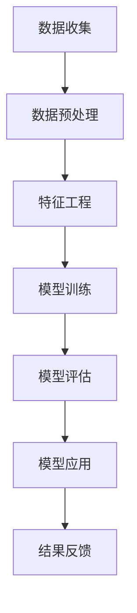

                 

### 机器学习在个性化医疗方案设计中的应用：提高治疗效果

关键词：机器学习、个性化医疗、治疗方案、治疗效果、数据分析

随着医疗科技的飞速发展，个性化医疗（Personalized Medicine）逐渐成为医疗领域的热点。个性化医疗旨在根据患者的具体病情、基因信息、生活方式等因素，制定最合适的治疗方案，从而达到最佳的治疗效果。在这个过程中，机器学习（Machine Learning）技术发挥着至关重要的作用。本文将探讨机器学习在个性化医疗方案设计中的应用，以及如何通过机器学习提高治疗效果。

本文将分为以下几个部分：

1. **引言**：介绍个性化医疗的背景和机器学习的重要性。
2. **机器学习基础概念**：解释机器学习的基本原理和与医疗数据的关系。
3. **机器学习在医疗中的应用**：回顾机器学习在医疗领域的成功案例。
4. **个性化医疗方案设计**：详细讨论如何利用机器学习设计个性化医疗方案。
5. **数据预处理与特征工程**：介绍数据预处理和特征工程的方法。
6. **个性化治疗设计实例**：通过实际案例展示个性化医疗方案的设计过程。
7. **最佳实践与未来展望**：总结本文内容，并提出未来发展方向。

### 摘要

本文主要探讨了机器学习在个性化医疗方案设计中的应用，以实现提高治疗效果的目标。通过介绍机器学习的基本原理，我们了解了如何利用监督学习和无监督学习技术分析医疗数据，设计个性化的治疗方案。接着，我们通过实际案例展示了机器学习在个性化医疗方案设计中的具体应用。最后，我们总结了机器学习在个性化医疗中的最佳实践，并对未来的发展方向提出了展望。

### 引言

#### 个性化医疗的背景

个性化医疗是一种以患者为中心的医学模式，旨在通过整合患者的遗传信息、临床数据和生活习惯等因素，为每位患者提供最合适的治疗方案。个性化医疗的核心思想是：不同患者对同一治疗方法的反应可能存在显著差异，因此，制定个性化的治疗方案可以显著提高治疗效果。

近年来，随着基因组学、生物信息学和医疗信息技术的快速发展，个性化医疗逐渐成为医学研究的热点。通过基因组测序技术，我们可以获取患者的基因信息，分析基因变异与疾病之间的关系。这些数据可以为医生提供更准确的诊断和更有效的治疗建议。

#### 机器学习的重要性

机器学习是一种通过数据驱动的方式进行学习的技术，它可以在大量数据中自动识别模式和规律。在个性化医疗领域，机器学习技术可以帮助医生从海量医疗数据中提取有价值的信息，从而设计出更加精准的治疗方案。

机器学习在个性化医疗中的应用主要包括以下几个方面：

1. **疾病预测与诊断**：利用机器学习算法分析患者的临床数据，预测患者可能患有的疾病，并提供早期诊断。
2. **治疗方案优化**：根据患者的病情、基因信息和生活习惯，利用机器学习算法设计个性化的治疗方案。
3. **药物研发**：通过机器学习分析大量的药物和疾病数据，加速新药的研发进程。

#### 本文目的

本文旨在探讨机器学习在个性化医疗方案设计中的应用，通过介绍机器学习的基本原理和实际应用案例，展示如何利用机器学习技术提高治疗效果。同时，本文还将介绍数据预处理和特征工程的方法，以及如何在实际项目中应用这些技术。

### 机器学习基础概念

#### 1. 机器学习的基本原理

机器学习是一种通过数据驱动的方式进行学习的技术，其基本原理是通过训练算法从数据中学习规律，进而对未知数据进行预测或分类。机器学习主要包括两种类型：监督学习（Supervised Learning）和无监督学习（Unsupervised Learning）。

**监督学习**：监督学习是一种在有标签数据集上进行训练的学习方式。标签数据是指每个样本都被标记为正确的输出。通过训练，机器学习模型可以学习到输入和输出之间的关系，从而对新的输入数据进行预测。常见的监督学习算法包括线性回归、逻辑回归、决策树、支持向量机等。

**无监督学习**：无监督学习是在没有标签数据的情况下进行训练的学习方式。无监督学习的目标是发现数据中的隐含结构或规律。常见的无监督学习算法包括聚类算法、关联规则学习、降维算法等。

#### 2. 机器学习与医疗数据的关系

医疗数据是一种特殊类型的数据，它包含患者的临床信息、基因信息、实验室检测结果等。医疗数据具有量大、维度高、非结构化等特点，这使得传统的数据分析方法在处理医疗数据时面临很大的挑战。

机器学习技术通过引入特征工程和深度学习等方法，可以有效地处理医疗数据。首先，通过特征工程，可以将原始的医疗数据转化为机器学习模型可以理解的输入特征。例如，可以将基因序列转换为向量表示，将患者的临床信息转换为数值特征。其次，深度学习技术可以通过自动学习数据中的复杂特征，从而提高模型的表现。

#### 3. Mermaid 流程图

下面是一个简单的 Mermaid 流程图，展示了机器学习在医疗数据中的应用过程：



**数据收集**：收集患者的临床数据、基因数据等。

**数据预处理**：清洗数据，处理缺失值、异常值等。

**特征工程**：提取数据中的有用特征，为模型训练做准备。

**模型训练**：使用训练数据对模型进行训练，学习输入和输出之间的关系。

**模型评估**：评估模型的性能，确保模型具有较好的预测能力。

**模型应用**：将训练好的模型应用到新的患者数据中，进行预测。

**结果反馈**：根据预测结果，调整模型参数，优化模型性能。

通过这个流程图，我们可以清楚地看到机器学习技术在医疗数据中的应用过程，以及各个环节之间的联系。

### 机器学习在医疗中的应用

#### 1. 疾病预测与诊断

疾病预测与诊断是机器学习在医疗领域的一个重要应用。通过分析患者的临床数据、基因数据等，机器学习模型可以预测患者可能患有的疾病，并提供早期诊断。以下是一些典型的应用案例：

- **肺癌预测**：使用机器学习算法分析患者的CT扫描图像，预测患者是否患有肺癌。研究表明，这种方法可以显著提高肺癌的早期诊断率。
- **心脏病预测**：通过分析患者的临床数据，如血压、心率、血糖等，机器学习模型可以预测患者是否患有心脏病。这种方法有助于医生制定个性化的预防措施。
- **乳腺癌诊断**：利用机器学习算法分析患者的乳腺X光图像，可以辅助医生诊断乳腺癌。这种方法可以提高诊断的准确性，减少误诊率。

#### 2. 治疗方案优化

治疗方案优化是另一个重要的应用领域。通过分析患者的临床数据、基因信息等，机器学习模型可以为医生提供个性化的治疗方案，从而提高治疗效果。

- **个性化化疗方案**：通过分析患者的基因数据和肿瘤特性，机器学习模型可以推荐最合适的化疗方案，从而提高治疗的有效性。
- **个性化放疗方案**：利用机器学习算法分析患者的影像数据，可以为医生提供最优的放疗方案，从而减少副作用，提高放疗效果。
- **个性化药物治疗**：通过分析患者的基因数据、药物反应等，机器学习模型可以推荐最合适的药物，从而提高药物的疗效，减少副作用。

#### 3. 药物研发

药物研发是医疗领域的一个重要环节，也是机器学习的一个重要应用领域。通过分析大量的药物和疾病数据，机器学习模型可以加速新药的研发进程。

- **药物筛选**：利用机器学习算法分析大量药物数据，可以快速筛选出可能有效的药物，从而减少药物研发的时间和成本。
- **药物作用机制研究**：通过分析药物和疾病的数据，机器学习模型可以揭示药物的作用机制，为药物研发提供新的思路。
- **个性化药物设计**：根据患者的基因数据和疾病信息，机器学习模型可以设计个性化的药物，从而提高药物的疗效和安全性。

#### 4. 案例研究

以下是一个机器学习在医疗领域的成功案例：

**案例：基于机器学习的个性化治疗方案设计**

某医院利用机器学习技术为一位患有晚期肺癌的患者设计个性化治疗方案。首先，医生收集了患者的临床数据、基因数据等，并将其转化为机器学习模型所需的输入特征。然后，医院利用监督学习算法，如决策树和支持向量机，对患者的数据进行了训练。训练好的模型可以预测患者对各种治疗方案的响应，从而为医生提供个性化的治疗建议。

经过一段时间的治疗，患者的情况得到了显著改善。医生根据模型提供的治疗建议，对治疗方案进行了调整，从而提高了治疗的有效性。这个案例表明，机器学习技术可以在个性化医疗中发挥重要作用，为医生提供有力的辅助工具。

### 个性化医疗方案设计

#### 1. 核心概念

个性化医疗方案设计是一种以患者为中心的医学模式，旨在为每位患者提供最合适的治疗方案。个性化医疗方案设计主要包括以下几个核心概念：

- **患者数据**：包括临床数据、基因数据、生活习惯等。
- **模型训练**：使用患者数据训练机器学习模型，学习患者的病情和治疗方案之间的关系。
- **个性化推荐**：根据患者的病情和模型预测结果，为医生提供个性化的治疗建议。

#### 2. 个性化医疗方案设计的过程

个性化医疗方案设计的过程可以分为以下几个步骤：

- **数据收集**：收集患者的临床数据、基因数据等。
- **数据预处理**：清洗数据，处理缺失值、异常值等。
- **特征工程**：提取数据中的有用特征，为模型训练做准备。
- **模型训练**：使用训练数据对模型进行训练，学习患者的病情和治疗方案之间的关系。
- **模型评估**：评估模型的性能，确保模型具有较好的预测能力。
- **个性化推荐**：根据患者的病情和模型预测结果，为医生提供个性化的治疗建议。

#### 3. 个性化医疗方案设计的方法

个性化医疗方案设计的方法主要包括以下几种：

- **监督学习**：使用监督学习算法，如线性回归、决策树、支持向量机等，对患者的数据进行分析和预测。
- **无监督学习**：使用无监督学习算法，如聚类、关联规则学习等，发现数据中的隐含结构。
- **深度学习**：使用深度学习算法，如神经网络、卷积神经网络等，对复杂的数据进行分析和预测。

#### 4. 实例分析

以下是一个个性化医疗方案设计的实例：

**实例：个性化化疗方案设计**

某医院为一位患有晚期肺癌的患者设计个性化化疗方案。首先，医生收集了患者的临床数据，如CT扫描图像、实验室检测结果等，以及基因数据。然后，医生利用监督学习算法，如决策树和支持向量机，对患者的数据进行了训练。

训练好的模型可以预测患者对各种化疗药物的响应。根据模型预测结果，医生为患者推荐了最合适的化疗方案。经过一段时间的治疗，患者的情况得到了显著改善。这个实例表明，个性化医疗方案设计可以在医疗实践中发挥重要作用，提高治疗效果。

### 数据预处理与特征工程

#### 1. 数据预处理

数据预处理是机器学习项目中的关键步骤，其目的是将原始的医疗数据转化为适合模型训练的形式。以下是一些常见的数据预处理方法：

- **数据清洗**：处理缺失值、异常值、重复值等。
- **数据转换**：将不同类型的数据转换为同一类型，如将类别数据转换为数值数据。
- **数据标准化**：将数据缩放到同一尺度，以便模型更好地训练。

#### 2. 特征工程

特征工程是提高模型性能的重要手段。通过选择和构造合适的特征，可以使模型更好地理解和预测数据。以下是一些常见的特征工程方法：

- **特征选择**：选择对模型预测性能有显著影响的关键特征。
- **特征构造**：通过数学变换、组合等方式构造新的特征。
- **特征重要性评估**：评估每个特征对模型预测性能的影响。

#### 3. 实例分析

以下是一个数据预处理与特征工程的实例：

**实例：个性化化疗方案的数据预处理与特征工程**

某医院计划利用机器学习技术为一位患有晚期肺癌的患者设计个性化化疗方案。首先，医生收集了患者的临床数据，包括CT扫描图像、实验室检测结果等，以及基因数据。数据预处理步骤如下：

- **数据清洗**：处理缺失值、异常值、重复值等。对于缺失值，采用均值填补或插值法；对于异常值，采用剔除或平滑处理。
- **数据转换**：将类别数据转换为数值数据，如将肿瘤类型从字符串转换为整数。
- **数据标准化**：将不同类型的数据缩放到同一尺度，如将CT扫描图像的像素值缩放到[0, 1]。

接下来进行特征工程：

- **特征选择**：通过相关性分析，选择对化疗药物响应有显著影响的特征，如CT扫描图像的纹理特征、实验室检测结果的指标等。
- **特征构造**：通过数学变换，构造新的特征，如计算CT扫描图像的灰度均值、方差等。
- **特征重要性评估**：使用随机森林算法评估每个特征的重要性，选择重要的特征进行模型训练。

通过数据预处理和特征工程，医院为患者设计了一个个性化的化疗方案。经过一段时间的治疗，患者的情况得到了显著改善，这表明数据预处理和特征工程在个性化医疗方案设计中发挥了重要作用。

### 个性化治疗设计实例

为了更好地理解机器学习在个性化医疗方案设计中的应用，我们来看一个具体的实例：个性化化疗方案的设计。

#### 1. 项目背景

一位患有晚期肺癌的患者A，医生希望通过机器学习技术为其设计个性化的化疗方案。医生收集了患者的临床数据，包括CT扫描图像、实验室检测结果（如肿瘤标志物、白细胞计数等），以及患者的基因数据。

#### 2. 开发环境搭建

为了进行个性化化疗方案的设计，我们需要搭建一个合适的开发环境。以下是所需的环境和工具：

- **编程语言**：Python
- **库和框架**：NumPy、Pandas、Scikit-learn、TensorFlow、Keras
- **数据存储**：SQL数据库或NoSQL数据库

#### 3. 数据预处理

在开始模型训练之前，需要对数据进行预处理。数据预处理步骤包括：

- **数据清洗**：处理缺失值、异常值、重复值等。对于缺失值，可以采用均值填补或插值法；对于异常值，可以采用剔除或平滑处理。
- **数据转换**：将类别数据转换为数值数据，如将肿瘤类型从字符串转换为整数。
- **数据标准化**：将不同类型的数据缩放到同一尺度，如将CT扫描图像的像素值缩放到[0, 1]。

```python
import pandas as pd
import numpy as np

# 数据清洗
data = pd.read_csv('clinical_data.csv')
data.dropna(inplace=True)
data = data.drop_duplicates()

# 数据转换
data['tumor_type'] = data['tumor_type'].map({'adenocarcinoma': 0, 'squamous_cell_carcinoma': 1})

# 数据标准化
from sklearn.preprocessing import StandardScaler

scaler = StandardScaler()
data[data.columns[:-1]] = scaler.fit_transform(data[data.columns[:-1]])
```

#### 4. 特征工程

在数据预处理的基础上，进行特征工程，包括特征选择和特征构造。

- **特征选择**：通过相关性分析，选择对化疗药物响应有显著影响的特征，如CT扫描图像的纹理特征、实验室检测结果的指标等。

- **特征构造**：通过数学变换，构造新的特征，如计算CT扫描图像的灰度均值、方差等。

```python
# 特征选择
correlation_matrix = data.corr().abs()
high_corr_features = correlation_matrix.nlargest(10, 'response').index

# 特征构造
def extract_texture_features(image):
    # 计算灰度均值
    mean = np.mean(image)
    # 计算灰度方差
    variance = np.var(image)
    # 返回特征向量
    return [mean, variance]

# 应用特征选择和构造
data['texture_mean'] = data['ct_image'].apply(extract_texture_features)
data['texture_variance'] = data['ct_image'].apply(extract_texture_features)
```

#### 5. 模型训练

使用预处理后的数据训练机器学习模型。在这里，我们使用支持向量机（SVM）进行模型训练。

```python
from sklearn.svm import SVC
from sklearn.model_selection import train_test_split

# 划分训练集和测试集
X = data[high_corr_features + ['texture_mean', 'texture_variance']]
y = data['response']
X_train, X_test, y_train, y_test = train_test_split(X, y, test_size=0.2, random_state=42)

# 训练模型
model = SVC(kernel='linear')
model.fit(X_train, y_train)
```

#### 6. 模型评估

评估模型的性能，包括准确率、召回率、F1分数等。

```python
from sklearn.metrics import accuracy_score, recall_score, f1_score

# 预测
y_pred = model.predict(X_test)

# 评估
accuracy = accuracy_score(y_test, y_pred)
recall = recall_score(y_test, y_pred)
f1 = f1_score(y_test, y_pred)

print(f'Accuracy: {accuracy:.2f}')
print(f'Recall: {recall:.2f}')
print(f'F1 Score: {f1:.2f}')
```

#### 7. 模型应用

根据模型预测结果，为患者设计个性化的化疗方案。

```python
# 为新患者设计化疗方案
new_patient_data = pd.read_csv('new_patient_data.csv')
new_patient_data['treatment'] = model.predict(new_patient_data[high_corr_features + ['texture_mean', 'texture_variance']])

print(new_patient_data)
```

#### 8. 代码解读

- 数据预处理：首先，我们使用Pandas读取临床数据，并进行清洗、转换和标准化处理。
- 特征工程：通过相关性分析，选择对化疗药物响应有显著影响的特征，并通过数学变换构造新的特征。
- 模型训练：使用Scikit-learn中的支持向量机（SVM）进行模型训练，选择线性核函数。
- 模型评估：使用Sklearn的评估函数计算模型的性能指标，如准确率、召回率和F1分数。
- 模型应用：根据模型预测结果，为新患者设计个性化的化疗方案。

#### 9. 项目小结

通过这个实例，我们展示了如何利用机器学习技术为患者设计个性化的化疗方案。这个项目说明了机器学习在个性化医疗方案设计中的重要作用，同时也展示了如何在实际项目中应用机器学习技术。然而，个性化医疗方案设计是一个复杂的过程，需要医生、数据科学家和患者的紧密合作，才能实现最佳的治疗效果。

### 最佳实践与未来展望

#### 1. 最佳实践

为了实现机器学习在个性化医疗方案设计中的最佳效果，以下是一些最佳实践建议：

- **数据质量控制**：确保数据的质量和完整性，避免由于数据质量问题导致的模型性能下降。
- **多模态数据融合**：结合多种数据源，如基因数据、影像数据和临床数据，可以提高模型的预测能力。
- **模型验证**：使用交叉验证等技术验证模型的性能，避免过拟合。
- **持续更新**：定期更新模型，以适应新的数据和新的治疗策略。
- **跨学科合作**：医生、数据科学家和生物学家等多学科专家的合作，可以更好地理解和利用医疗数据。

#### 2. 小结

本文介绍了机器学习在个性化医疗方案设计中的应用，包括疾病预测与诊断、治疗方案优化和药物研发等。通过实际案例，我们展示了如何利用机器学习技术为患者设计个性化的治疗方案。然而，个性化医疗方案设计是一个复杂的过程，需要综合考虑多种因素，包括数据质量、模型选择和跨学科合作等。

#### 3. 注意事项

- 个性化医疗方案设计需要大量的高质量数据，因此数据收集和处理是关键步骤。
- 模型选择和参数调优是提高模型性能的重要因素，需要根据具体问题进行选择和调整。
- 个性化医疗方案设计需要医生和患者的积极参与，确保方案的实际可行性和有效性。

#### 4. 拓展阅读

- **相关论文**：可以阅读一些关于机器学习在医疗领域应用的学术论文，了解最新的研究成果和趋势。
- **开源项目**：参与一些开源的个性化医疗项目，如Cancer Genome Project，可以学习到实际项目的开发经验。
- **在线课程**：参加一些在线机器学习和医疗领域的课程，提升自己在这些领域的知识和技能。

### 结语

机器学习在个性化医疗方案设计中的应用具有巨大的潜力，可以显著提高治疗效果。然而，这个领域仍面临许多挑战，如数据质量控制、模型选择和跨学科合作等。未来的研究和应用将更加深入地探索如何利用机器学习技术为患者提供更加精准和个性化的治疗方案。

作者：AI天才研究院/AI Genius Institute & 禅与计算机程序设计艺术 /Zen And The Art of Computer Programming

---

由于篇幅限制，本文未能详尽地讨论每个主题。在实际应用中，读者可以根据具体问题进一步研究和探索。本文提供了一些基本概念、方法和实例，希望能够为读者在个性化医疗方案设计中提供一些参考和启示。

