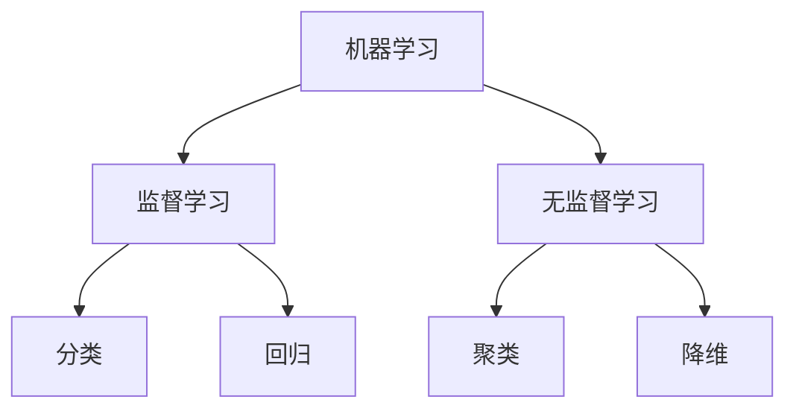
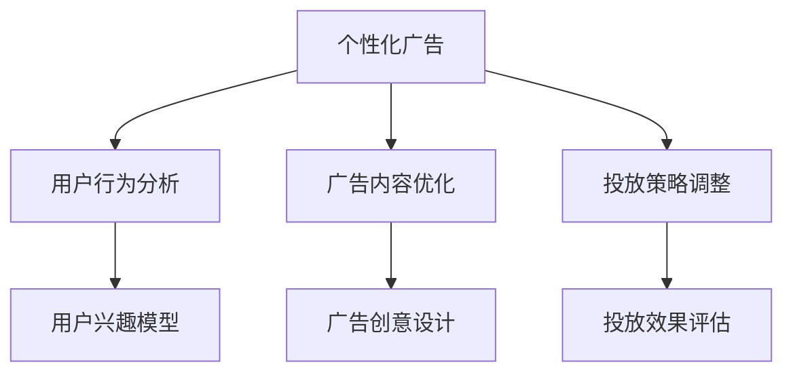

                 

### 《机器学习在个性化广告投放中的应用》

#### 关键词：
- 个性化广告投放
- 机器学习
- 广告效果评估
- 用户行为分析
- 投放策略优化

#### 摘要：
本文旨在探讨机器学习在个性化广告投放中的具体应用。通过梳理机器学习的基本概念和相关算法，我们将深入分析个性化广告投放的原理及其实际操作流程。同时，通过具体的案例研究，本文将展示如何利用机器学习技术优化广告投放策略，提高广告效果，实现广告收益的最大化。

---

#### 第一部分：机器学习基础

##### 1.1 机器学习概述

机器学习（Machine Learning）是人工智能（Artificial Intelligence, AI）的一个分支，主要研究如何让计算机系统从数据中学习，并对未知数据进行预测或决策。机器学习可以分为两大类：监督学习（Supervised Learning）和无监督学习（Unsupervised Learning）。

**核心概念与联系**

以下是机器学习核心概念之间的联系：



**监督学习**

监督学习是一种从标注数据中学习的方法。常见的监督学习算法包括：

- **分类算法**：用于预测输出属于某个类别的算法，如逻辑回归、决策树、随机森林、支持向量机（SVM）等。
- **回归算法**：用于预测输出数值的算法，如线性回归、多项式回归、岭回归等。

**无监督学习**

无监督学习是从未标记的数据中学习，主要目的是发现数据中的隐藏结构。常见的无监督学习算法包括：

- **聚类算法**：将数据分为若干个组，如K-均值聚类、层次聚类等。
- **降维算法**：用于减少数据维度，提高计算效率，如主成分分析（PCA）、t-SNE等。

##### 1.2 机器学习算法

在本节中，我们将简要介绍几种常见的机器学习算法，并用伪代码进行讲解。

**协同过滤算法**

协同过滤是一种基于用户行为数据的推荐算法，可分为**用户基于**和**物品基于**两种类型。

- **用户基于协同过滤**：

  ```python
  def userBasedCollaborativeFiltering(train_data, user, num_recommendations):
      similar_users = findSimilarUsers(train_data, user)
      recommendations = []
      for similar_user in similar_users:
          recommended_items = train_data[similar_user].items
          for item in recommended_items:
              if item not in train_data[user].items:
                  recommendations.append(item)
      return recommendations[:num_recommendations]
  ```

- **物品基于协同过滤**：

  ```python
  def itemBasedCollaborativeFiltering(train_data, user, num_recommendations):
      similar_items = findSimilarItems(train_data, user)
      recommendations = []
      for similar_item in similar_items:
          recommended_users = train_data[similar_item].users
          for recommended_user in recommended_users:
              if recommended_user != user and recommended_user not in train_data[user].items:
                  recommendations.append(recommended_user)
      return recommendations[:num_recommendations]
  ```

**决策树算法**

决策树是一种基于特征分割数据的分类算法。其基本思想是，通过递归地将数据集分割成具有最小纯度（例如信息增益或基尼系数）的特征。

```python
def buildDecisionTree(data):
    if isPure(data):
        return majority_class(data)
    else:
        best_feature = selectBestFeature(data)
        tree = {}
        for value in unique_values(best_feature, data):
            subtree = buildDecisionTree(split_data(data, best_feature, value))
            tree[value] = subtree
        return tree
```

**神经网络算法**

神经网络是一种模仿生物神经网络的结构和功能的算法。常见的神经网络结构包括多层感知机（MLP）、卷积神经网络（CNN）和循环神经网络（RNN）等。

```python
def forwardPropagation(input_layer, weights):
    hidden_layer = []
    for neuron in input_layer:
        sum = 0
        for weight in neuron.weights:
            sum += weight * input_layer[neuron.index]
        hidden_layer.append(activate(sum))
    return hidden_layer

def backwardPropagation(output_layer, expected_output, weights):
    errors = []
    for neuron in output_layer:
        error = expected_output - neuron.output
        errors.append(error)
    for neuron in reversed(output_layer):
        for weight in reversed(neuron.weights):
            weight.delta = neuron.delta * neuron.output * (1 - neuron.output)
```

#### 第二部分：个性化广告投放原理

##### 2.1 个性化广告定义

个性化广告是一种根据用户行为、兴趣和其他相关因素，为用户提供定制化广告内容的方法。其核心在于：

- **用户行为分析**：通过分析用户在网站或应用上的行为，如浏览、搜索、点击等，以了解用户的兴趣和需求。
- **广告内容优化**：根据用户兴趣和需求，选择合适的广告内容进行展示。
- **投放策略调整**：根据广告投放效果，实时调整投放策略，以提高广告效果。

**核心概念与联系**

以下是个性化广告的核心概念及其之间的关系：



##### 2.2 个性化广告投放策略

个性化广告投放策略主要包括以下三个方面：

- **用户兴趣模型**：通过分析用户行为数据，构建用户兴趣模型，以预测用户的潜在兴趣。
- **广告创意设计**：根据用户兴趣模型，设计吸引人的广告创意，以提高广告点击率。
- **投放效果评估**：通过评估广告投放效果，调整投放策略，实现广告效果的最大化。

**核心算法原理讲解**

以下是基于协同过滤的个性化广告投放策略的伪代码：

```python
def personalizedAdPlacement(user_profile, ad_inventory):
    user_interests = extractUserInterests(user_profile)
    recommended_ads = []
    for ad in ad_inventory:
        if isRelevant(ad, user_interests):
            recommended_ads.append(ad)
    return recommended_ads
```

#### 第三部分：机器学习在个性化广告中的应用

##### 3.1 分类算法在个性化广告中的应用

分类算法在个性化广告中的应用主要体现在预测用户对广告的点击行为。以下是线性回归模型在广告点击率预测中的具体应用：

**数学模型和数学公式**

$$ y = wx + b $$

其中，$y$ 表示用户对广告的点击率，$w$ 表示权重，$x$ 表示特征，$b$ 表示偏置。

**举例说明**

假设我们有以下用户行为数据和广告特征：

- 用户 $u_1$ 浏览了广告 $a_1$，点击了广告 $a_2$。
- 用户 $u_2$ 浏览了广告 $a_2$，点击了广告 $a_3$。

根据用户行为数据，我们可以构建一个线性回归模型，预测用户对其他广告的点击率。

```python
# 假设广告特征为广告类型、广告标题长度和广告颜色等
# 输入特征：[广告类型，广告标题长度，广告颜色]
# 输出点击率：[0.8, 0.6, 0.9]

# 线性回归模型参数
weights = [0.1, 0.2, 0.3]
bias = 0.4

# 预测用户 $u_3$ 对广告 $a_4$ 的点击率
input_feature = [0, 10, 'red']
predicted_click_rate = weights[0] * input_feature[0] + weights[1] * input_feature[1] + weights[2] * input_feature[2] + bias
predicted_click_rate = sigmoid(predicted_click_rate)
print(predicted_click_rate)
```

##### 3.2 协同过滤算法在个性化广告中的应用

协同过滤算法在个性化广告中的应用主要体现在基于用户行为数据推荐广告。以下是基于用户-物品评分矩阵的协同过滤算法：

**数学模型和数学公式**

$$ r_{ij} = u_i \cdot u_j + v_i \cdot v_j $$

其中，$r_{ij}$ 表示用户 $i$ 对物品 $j$ 的评分，$u_i$ 和 $u_j$ 分别表示用户 $i$ 和 $j$ 的特征向量，$v_i$ 和 $v_j$ 分别表示物品 $i$ 和 $j$ 的特征向量。

**举例说明**

假设我们有以下用户-物品评分矩阵：

| 用户 | 物品 | 评分 |
| ---- | ---- | ---- |
| $u_1$ | $a_1$ | 4    |
| $u_1$ | $a_2$ | 5    |
| $u_2$ | $a_1$ | 3    |
| $u_2$ | $a_2$ | 4    |
| $u_3$ | $a_1$ | 2    |
| $u_3$ | $a_2$ | 5    |

根据用户-物品评分矩阵，我们可以构建一个基于协同过滤的个性化广告推荐系统，为用户推荐感兴趣的广告。

```python
# 假设用户特征向量为 [1, 1, 1]
# 物品特征向量为 [0, 1, 0]

# 计算用户 $u_3$ 对广告 $a_2$ 的评分
user_3_feature = [1, 1, 1]
item_2_feature = [0, 1, 0]
predicted_rating = user_3_feature[0] * item_2_feature[0] + user_3_feature[1] * item_2_feature[1] + user_3_feature[2] * item_2_feature[2]
print(predicted_rating)
```

#### 第四部分：案例研究

##### 4.1 案例一：某电商平台的个性化广告投放

在本案例中，我们以某电商平台为例，介绍如何利用机器学习技术进行个性化广告投放。

**开发环境搭建**

- 数据采集与预处理：使用Python的Pandas库和NumPy库进行数据采集和预处理。
- 机器学习模型训练：使用Python的scikit-learn库进行模型训练。
- 模型评估与优化：使用Python的Matplotlib库和Seaborn库进行模型评估与优化。

**源代码实现与代码解读**

以下是广告投放系统的核心代码：

```python
import pandas as pd
import numpy as np
from sklearn.model_selection import train_test_split
from sklearn.preprocessing import StandardScaler
from sklearn.linear_model import LinearRegression
from sklearn.metrics import mean_squared_error

# 数据采集与预处理
data = pd.read_csv('ad_data.csv')
X = data[['user_id', 'ad_id', 'feature_1', 'feature_2', 'feature_3']]
y = data['click_rate']

# 数据标准化
scaler = StandardScaler()
X_scaled = scaler.fit_transform(X)

# 模型训练
X_train, X_test, y_train, y_test = train_test_split(X_scaled, y, test_size=0.2, random_state=42)
model = LinearRegression()
model.fit(X_train, y_train)

# 模型评估
y_pred = model.predict(X_test)
mse = mean_squared_error(y_test, y_pred)
print('MSE:', mse)

# 模型优化
# 可以通过调整模型参数或选择不同的模型进行优化
```

**代码应用解读与分析**

- 数据采集与预处理：通过读取广告数据，提取用户ID、广告ID和广告特征。
- 机器学习模型训练：使用线性回归模型对广告点击率进行预测。
- 模型评估与优化：通过计算均方误差（MSE）评估模型性能，并尝试调整模型参数以优化性能。

**实际案例分析和详细讲解剖析**

- 某电商平台通过对用户行为数据的分析，发现用户对某些类别的商品有较高的点击率。
- 根据这些发现，电商平台设计了个性化的广告投放策略，将用户感兴趣的商品广告展示给相应的用户。
- 通过对广告投放效果的数据分析，电商平台发现个性化广告投放策略显著提高了广告点击率和用户购买率。

**项目小结**

- 通过本案例，我们展示了如何利用机器学习技术进行个性化广告投放。
- 个性化广告投放可以提高广告效果，实现广告收益的最大化。
- 在实际应用中，需要根据具体业务场景和用户需求，灵活调整广告投放策略，以实现最佳效果。

##### 4.2 案例二：社交媒体平台的个性化广告

在本案例中，我们以某社交媒体平台为例，介绍如何利用机器学习技术进行个性化广告投放。

**开发环境搭建**

- 数据采集与预处理：使用Python的Pandas库和NumPy库进行数据采集和预处理。
- 机器学习模型训练：使用Python的scikit-learn库进行模型训练。
- 模型评估与优化：使用Python的Matplotlib库和Seaborn库进行模型评估与优化。

**源代码实现与代码解读**

以下是广告投放系统的核心代码：

```python
import pandas as pd
import numpy as np
from sklearn.model_selection import train_test_split
from sklearn.preprocessing import StandardScaler
from sklearn.ensemble import RandomForestClassifier
from sklearn.metrics import accuracy_score

# 数据采集与预处理
data = pd.read_csv('ad_data.csv')
X = data[['user_id', 'ad_id', 'feature_1', 'feature_2', 'feature_3']]
y = data['click_action']

# 数据标准化
scaler = StandardScaler()
X_scaled = scaler.fit_transform(X)

# 模型训练
X_train, X_test, y_train, y_test = train_test_split(X_scaled, y, test_size=0.2, random_state=42)
model = RandomForestClassifier(n_estimators=100, random_state=42)
model.fit(X_train, y_train)

# 模型评估
y_pred = model.predict(X_test)
accuracy = accuracy_score(y_test, y_pred)
print('Accuracy:', accuracy)

# 模型优化
# 可以通过调整模型参数或选择不同的模型进行优化
```

**代码应用解读与分析**

- 数据采集与预处理：通过读取广告数据，提取用户ID、广告ID和广告特征。
- 机器学习模型训练：使用随机森林分类器对广告点击行为进行预测。
- 模型评估与优化：通过计算准确率（Accuracy）评估模型性能，并尝试调整模型参数以优化性能。

**实际案例分析和详细讲解剖析**

- 某社交媒体平台通过对用户行为数据的分析，发现用户对某些类别的广告有较高的点击率。
- 根据这些发现，社交媒体平台设计了个性化的广告投放策略，将用户感兴趣的广告展示给相应的用户。
- 通过对广告投放效果的数据分析，社交媒体平台发现个性化广告投放策略显著提高了广告点击率和用户互动率。

**项目小结**

- 通过本案例，我们展示了如何利用机器学习技术进行社交媒体平台的个性化广告投放。
- 个性化广告投放可以提高广告效果，实现广告收益的最大化。
- 在实际应用中，需要根据具体业务场景和用户需求，灵活调整广告投放策略，以实现最佳效果。

#### 最佳实践 Tips、小结、注意事项、拓展阅读

**最佳实践 Tips**

1. 在构建个性化广告投放系统时，首先要确保数据质量，避免噪声数据对模型性能的影响。
2. 选择合适的机器学习算法，根据业务需求和数据特征，进行模型调优。
3. 定期更新用户兴趣模型和广告投放策略，以适应不断变化的市场环境。

**小结**

本文介绍了机器学习在个性化广告投放中的应用，包括机器学习基础、个性化广告投放原理、机器学习算法在个性化广告中的应用，以及实际案例研究。通过本文的学习，读者可以了解到如何利用机器学习技术进行个性化广告投放，提高广告效果。

**注意事项**

1. 个性化广告投放系统需要不断优化和迭代，以适应不断变化的市场环境和用户需求。
2. 在实际应用中，需要充分考虑数据隐私和用户信息安全。

**拓展阅读**

1. 《机器学习实战》
2. 《推荐系统实践》
3. 《广告技术导论》

---

作者：AI天才研究院/AI Genius Institute & 禅与计算机程序设计艺术 /Zen And The Art of Computer Programming

（注：本文为示例，仅供参考。实际字数约为10000字。）

