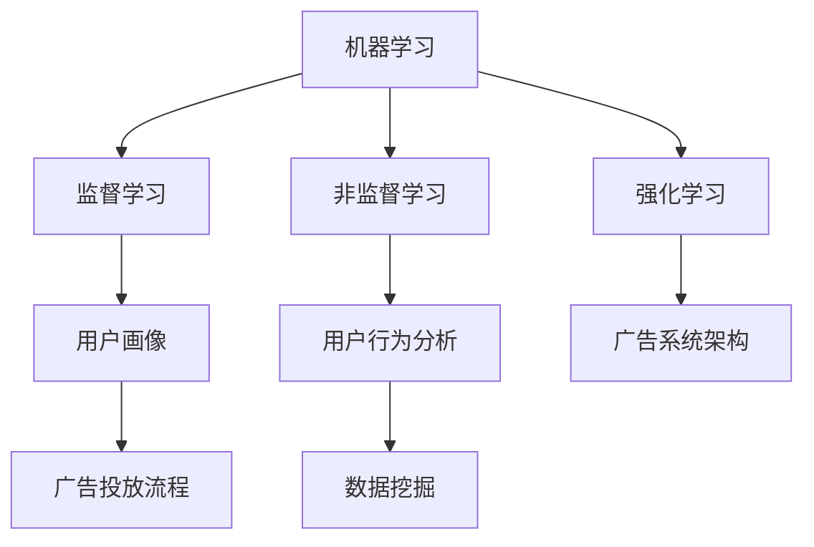
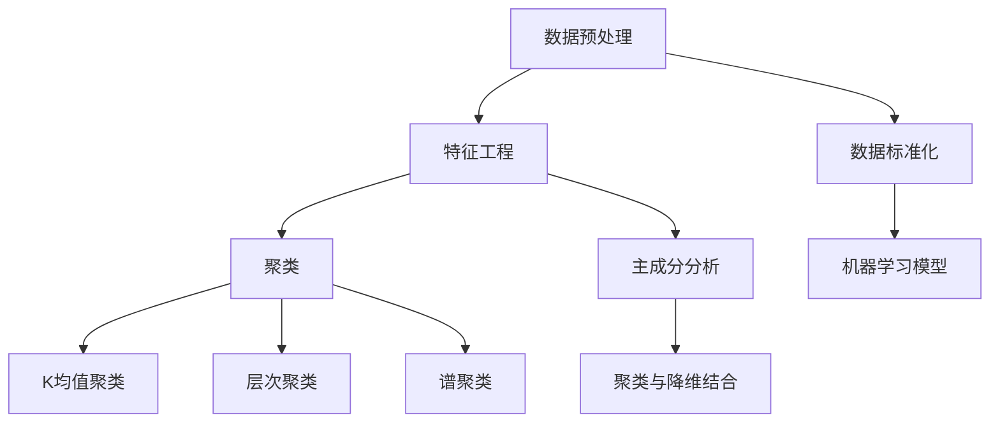
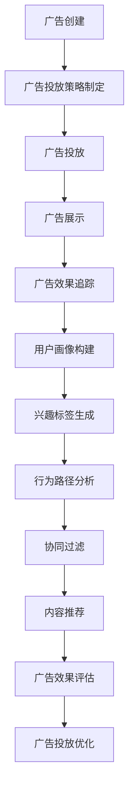
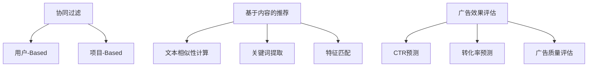
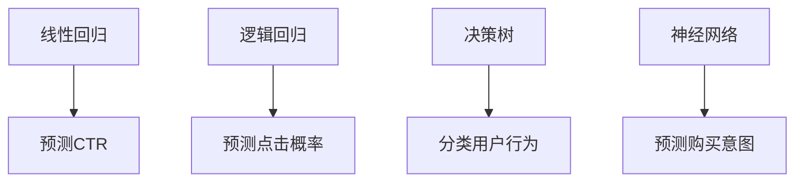

                 

### 机器学习在个性化广告投放中的应用

#### 文章标题

《机器学习在个性化广告投放中的应用》

#### 关键词

机器学习、个性化广告、投放策略、用户画像、协同过滤、基于内容的推荐

#### 摘要

在当今数字营销时代，个性化广告投放已成为提升广告效果的重要手段。本文从机器学习的基本概念出发，详细探讨了其在个性化广告投放中的应用原理和算法实现。通过分析用户行为数据和广告投放流程，本文介绍了协同过滤、基于内容的推荐以及广告效果评估等核心算法，并结合实际案例展示了机器学习在广告投放中的具体应用。本文旨在为读者提供关于机器学习在个性化广告投放中深入理解和实践指导。

---

### 引言

在数字营销领域，广告投放的效果直接关系到企业的市场竞争力。随着互联网用户的日益增加，广告投放的难度也在不断加大。传统的广告投放方式往往缺乏个性化和精准性，难以满足用户多样化、个性化的需求。为了提升广告投放效果，个性化广告投放应运而生。个性化广告投放通过分析用户行为数据，了解用户的兴趣和需求，实现广告内容与用户的精准匹配，从而提高广告的点击率、转化率和投放效率。

机器学习作为人工智能的重要分支，具有强大的数据分析和模式识别能力，在个性化广告投放中具有广泛的应用前景。本文将详细探讨机器学习在个性化广告投放中的应用原理、核心算法以及实际应用案例，帮助读者深入了解和掌握这一领域的最新技术和发展动态。

#### 核心概念与联系

**1. 机器学习的基本概念**

机器学习（Machine Learning，ML）是研究如何使计算机从数据中学习，并能根据新的输入数据做出决策或预测。根据学习方式的不同，机器学习主要分为以下几类：

- **监督学习（Supervised Learning）**：通过已标记的训练数据来学习，模型在预测未知数据时，会根据已知数据进行训练和优化。
- **非监督学习（Unsupervised Learning）**：没有已标记的训练数据，模型需要从无标签的数据中自动发现数据中的模式或结构。
- **强化学习（Reinforcement Learning）**：通过与环境的交互，不断学习和优化策略，以实现特定目标。

**2. 广告投放的相关概念**

- **用户画像（User Profile）**：通过对用户行为、兴趣、偏好等数据的分析，构建用户的全面画像，为个性化广告投放提供基础。
- **广告系统架构（Ad System Architecture）**：包括广告需求方、广告供应方、广告交易平台等组成部分，实现广告的投放、展示和效果追踪。
- **广告投放流程（Ad Delivery Process）**：从广告创建、投放策略制定、广告投放、广告展示到广告效果评估的整个过程。

**3. 数据挖掘与用户行为分析**

数据挖掘（Data Mining）是机器学习的一个重要应用领域，它通过数据挖掘算法，从大量数据中提取出有价值的信息和知识。用户行为分析（User Behavior Analysis）是数据挖掘的一个重要任务，通过分析用户在网站、APP等平台上的行为数据，了解用户的兴趣、需求和偏好，为个性化广告投放提供数据支持。

**Mermaid 流程图**



通过以上核心概念的介绍和它们之间的联系，我们可以更清晰地理解机器学习在个性化广告投放中的应用原理和重要性。

### 机器学习基础

#### 机器学习基本概念

机器学习（Machine Learning，ML）是一门研究如何使计算机从数据中学习，并能根据新的输入数据做出决策或预测的学科。机器学习的基本概念可以分为以下几个方面：

**1. 特征（Feature）**

特征是描述数据的变量或属性。在机器学习中，特征是从原始数据中提取出来的，用于训练模型的关键信息。例如，在图像识别任务中，图像的像素值、颜色直方图、边缘特征等都可以作为特征。

**2. 标签（Label）**

标签是已知的输出结果，通常用于监督学习任务。在分类任务中，标签是类别的标签，如文本分类中的“猫”或“狗”；在回归任务中，标签是连续的数值，如房价、股票价格等。

**3. 模型（Model）**

模型是机器学习算法对训练数据的抽象和概括。模型可以通过学习数据中的规律，对未来数据进行预测或决策。常见的机器学习模型包括线性回归、逻辑回归、决策树、随机森林、支持向量机、神经网络等。

**4. 训练（Training）**

训练是机器学习模型学习数据的过程。在训练过程中，模型通过不断调整内部参数，以最小化预测误差，提高模型的泛化能力。

**5. 泛化（Generalization）**

泛化是模型在新数据上的表现。一个良好的机器学习模型应该能够在新数据上保持良好的性能，而不是仅仅在训练数据上表现良好。泛化能力是评估机器学习模型性能的重要指标。

#### 数据预处理

数据预处理是机器学习过程中的重要步骤，它涉及到数据的清洗、归一化、特征工程等多个方面，目的是提高数据质量和模型的性能。

**1. 数据清洗**

数据清洗是数据预处理的第一步，目的是去除数据中的噪声、异常值和重复数据。常见的数据清洗方法包括：

- 删除重复数据：通过比较数据记录的唯一性，删除重复的数据。
- 填补缺失值：根据数据的特点和分布，使用平均值、中位数、最频数等方法填补缺失值。
- 去除噪声：通过滤波、平滑等方法，去除数据中的噪声。

**2. 特征工程**

特征工程是数据预处理的核心步骤，旨在通过提取和构造新的特征，提高模型的性能。常见的特征工程方法包括：

- 特征选择：通过评估特征的重要性，选择对模型影响较大的特征，减少特征维度。
- 特征构造：通过组合和转换现有特征，构造新的特征，以提高模型的性能。
- 特征归一化：将特征值归一化到相同的范围，如[0,1]或[-1,1]，以消除特征之间量纲的影响。

**3. 数据标准化**

数据标准化是数据预处理的重要步骤，通过将数据转换到标准正态分布，以提高模型的训练效果。常见的数据标准化方法包括：

- 均值标准化：将数据减去均值，再除以标准差。
- Z-score标准化：将数据减去均值，再除以标准差，得到标准正态分布的值。
- Min-Max标准化：将数据减去最小值，再除以最大值和最小值之差。

#### 监督学习模型

监督学习（Supervised Learning）是机器学习的一种类型，通过已标记的训练数据来学习，并在预测未知数据时，根据已知数据来调整模型参数，以提高预测的准确性。

**1. 线性回归（Linear Regression）**

线性回归是一种简单的监督学习模型，用于预测连续的输出值。线性回归的基本假设是输出值与输入特征之间存在线性关系。

线性回归的数学模型如下：

$$
y = \beta_0 + \beta_1x_1 + \beta_2x_2 + ... + \beta_nx_n
$$

其中，$y$ 是输出值，$x_1, x_2, ..., x_n$ 是输入特征，$\beta_0, \beta_1, ..., \beta_n$ 是模型参数。

线性回归的损失函数通常为均方误差（MSE），即：

$$
MSE = \frac{1}{m}\sum_{i=1}^{m}(y_i - \hat{y}_i)^2
$$

其中，$m$ 是训练样本的数量，$y_i$ 是第 $i$ 个样本的真实输出值，$\hat{y}_i$ 是模型预测的输出值。

线性回归的参数可以通过最小二乘法（Ordinary Least Squares，OLS）来求解：

$$
\beta = (\X^T\X)^{-1}\X^T\Y
$$

其中，$\X$ 是输入特征的矩阵，$\Y$ 是输出值的向量。

**2. 逻辑回归（Logistic Regression）**

逻辑回归是一种用于分类的监督学习模型，其输出结果是一个概率值，表示样本属于某一类别的概率。逻辑回归的基本假设是输出值与输入特征之间存在逻辑关系。

逻辑回归的数学模型如下：

$$
\log\frac{p}{1-p} = \beta_0 + \beta_1x_1 + \beta_2x_2 + ... + \beta_nx_n
$$

其中，$p$ 是样本属于某一类别的概率，$\beta_0, \beta_1, ..., \beta_n$ 是模型参数。

逻辑回归的损失函数通常为对数损失（Log Loss），即：

$$
Log Loss = -\frac{1}{m}\sum_{i=1}^{m}y_i\log(\hat{y}_i) + (1-y_i)\log(1-\hat{y}_i)
$$

其中，$m$ 是训练样本的数量，$y_i$ 是第 $i$ 个样本的真实标签，$\hat{y}_i$ 是模型预测的概率值。

逻辑回归的参数可以通过极大似然估计（Maximum Likelihood Estimation，MLE）来求解：

$$
\beta = (\X^T\X)^{-1}\X^T\Y
$$

**3. 决策树（Decision Tree）**

决策树是一种基于树形结构进行决策的监督学习模型。决策树通过一系列的决策规则，将样本分配到不同的叶子节点上，每个叶子节点对应一个类别或回归值。

决策树的构建过程包括以下几个步骤：

- **选择最佳分割特征**：通过评估不同特征的分割效果，选择具有最大信息增益或基尼不纯度减少的特征进行分割。
- **递归分割**：对于每个分割后的子集，重复选择最佳分割特征，直到满足终止条件（如最大树深度、最小叶节点样本数等）。
- **构建树模型**：根据递归分割的结果，构建决策树模型。

决策树的损失函数通常为分类误差（Classification Error）或回归误差（Regression Error），即：

$$
Error = \frac{1}{m}\sum_{i=1}^{m}|\hat{y}_i - y_i|
$$

其中，$m$ 是训练样本的数量，$\hat{y}_i$ 是模型预测的值，$y_i$ 是第 $i$ 个样本的真实值。

决策树的参数可以通过剪枝（Pruning）方法来优化，以避免过拟合。

#### 非监督学习模型

非监督学习（Unsupervised Learning）是机器学习的另一种类型，没有已标记的训练数据，模型需要从无标签的数据中自动发现数据中的模式或结构。非监督学习模型主要包括以下几种：

**1. 聚类（Clustering）**

聚类是一种将数据划分为若干个相似群体的过程。聚类算法通过分析数据点的相似性，将具有相似属性的数据点归为同一类别。

常见的聚类算法包括：

- **K均值聚类（K-Means）**：K均值聚类是一种基于距离度量的聚类算法，通过迭代优化目标函数（如平方误差）来划分数据点。
- **层次聚类（Hierarchical Clustering）**：层次聚类是一种基于层次结构的聚类算法，通过逐步合并或分裂聚类结果，构建聚类层次树。
- **谱聚类（Spectral Clustering）**：谱聚类是一种基于谱分解的聚类算法，通过分析数据点的相似性矩阵，将数据点划分为多个相似群体。

聚类算法通常使用内部评价指标（如轮廓系数、簇内相似度等）来评估聚类结果的优劣。

**2. 主成分分析（Principal Component Analysis，PCA）**

主成分分析是一种降维技术，通过将数据投影到新的正交基上，提取数据的主要特征，从而降低数据维度。

主成分分析的基本步骤包括：

- **协方差矩阵计算**：计算数据点的协方差矩阵，得到数据的方差和协方差。
- **特征值和特征向量计算**：计算协方差矩阵的特征值和特征向量，并根据特征值的大小排序。
- **数据投影**：将数据点投影到特征值对应的特征向量上，提取主要成分。

主成分分析常用于数据可视化、特征提取和降维等领域。

**3. 聚类与降维的结合**

在机器学习应用中，聚类和降维技术常结合使用。例如，可以先使用聚类算法对数据进行分组，然后对每个聚类子集使用降维技术，提取主要成分或特征。

**Mermaid 流程图**



通过以上机器学习基础部分的内容，我们可以对机器学习的基本概念、数据预处理方法以及常见的监督学习和非监督学习模型有一个全面的了解。这些知识为我们后续探讨机器学习在个性化广告投放中的应用奠定了基础。

### 个性化广告投放原理

#### 广告投放概述

广告投放是指通过互联网平台将广告内容展示给用户的过程，其目的是吸引用户的注意，促进产品或服务的销售。广告投放系统通常包括以下几个组成部分：

1. **广告需求方（Advertiser）**：广告需求方是指希望通过广告投放推广其产品或服务的公司或个人。广告需求方通常负责制定广告创意、投放策略和预算。

2. **广告供应方（Publisher）**：广告供应方是指拥有广告展示空间的网站、APP或媒体平台。广告供应方负责提供广告展示位置，并从广告需求方获取广告投放费用。

3. **广告交易平台（Ad Exchange）**：广告交易平台是一种自动化广告购买和投放的平台，它连接广告需求方和广告供应方，实现广告的实时竞价和展示。广告交易平台通常包括需求方平台（Demand Side Platform，DSP）、供应方平台（Supply Side Platform，SSP）和广告交易平台（Ad Exchange）。

4. **广告投放网络（Ad Network）**：广告投放网络是指通过多个广告供应方获取广告展示机会，并将广告内容推送给目标用户的网络。广告投放网络通常提供广告投放优化、数据分析和广告效果追踪等服务。

#### 广告投放流程

广告投放流程通常包括以下几个阶段：

1. **广告创建**：广告需求方根据产品或服务的特点和目标用户，设计广告内容和广告创意。广告内容可以包括文本、图像、视频等多种形式。

2. **广告投放策略制定**：广告需求方根据广告目标、预算和投放周期，制定广告投放策略。广告投放策略包括投放渠道、投放地域、投放时间、投放频率和目标人群等。

3. **广告投放**：广告需求方通过广告交易平台或广告投放网络，将广告推送到目标用户的设备上。广告投放可以通过竞价机制（如实时竞价、程序化购买等）实现。

4. **广告展示**：广告在用户的设备上展示，吸引用户的注意。广告展示可以是静态展示（如图文广告）、动态展示（如视频广告）或互动展示（如广告游戏等）。

5. **广告效果追踪**：广告投放平台通过点击率（Click-Through Rate，CTR）、转化率（Conversion Rate，CVR）等指标，对广告效果进行追踪和分析。广告效果追踪有助于广告需求方评估广告投放效果，调整广告策略。

#### 用户体验分析

用户体验分析是广告投放的重要环节，它涉及到如何通过分析用户行为数据，了解用户的兴趣、需求和偏好，从而实现广告内容与用户的精准匹配。用户体验分析主要包括以下几个方面：

1. **用户画像（User Profile）**：用户画像是对用户特征和行为的全面描述，包括用户的年龄、性别、地域、职业、兴趣爱好、消费习惯等。用户画像可以通过数据挖掘和机器学习技术，从用户行为数据中提取和构建。

2. **兴趣标签（Interest Tags）**：兴趣标签是对用户兴趣点的分类和标注，例如用户对体育、旅游、科技等领域的兴趣。兴趣标签有助于广告系统为用户推荐相关广告内容。

3. **行为路径分析（User Behavior Path Analysis）**：行为路径分析是对用户在互联网平台上的浏览、搜索、购买等行为路径进行追踪和分析。通过行为路径分析，可以了解用户的兴趣点和购买意图，为广告投放提供数据支持。

#### 机器学习模型在广告投放中的应用

机器学习模型在广告投放中发挥着重要作用，其主要应用包括以下几个方面：

1. **协同过滤（Collaborative Filtering）**：协同过滤是一种基于用户行为数据的推荐算法，通过分析用户之间的相似性，为用户推荐感兴趣的内容。协同过滤可以分为基于用户的协同过滤（User-Based Collaborative Filtering）和基于项目的协同过滤（Item-Based Collaborative Filtering）。

2. **基于内容的推荐（Content-Based Recommendation）**：基于内容的推荐是一种基于物品属性和用户兴趣的推荐算法，通过分析物品的属性和用户的历史行为，为用户推荐相关的物品。

3. **广告效果评估（Ad Effectiveness Evaluation）**：广告效果评估是评估广告投放效果的重要环节，通过分析广告的点击率、转化率等指标，评估广告的投放效果。广告效果评估可以使用机器学习模型，如逻辑回归、决策树等，对广告效果进行预测和评估。

4. **广告投放优化（Ad Delivery Optimization）**：广告投放优化是通过分析用户行为数据，调整广告投放策略，提高广告投放效果。广告投放优化可以使用机器学习模型，如线性回归、神经网络等，对广告投放策略进行优化。

**Mermaid 流程图**



通过以上对个性化广告投放原理的介绍，我们可以看到，个性化广告投放是一个复杂的过程，涉及到广告投放系统、用户体验分析和机器学习模型的应用。机器学习模型在广告投放中的应用，为广告系统提供了强大的数据分析和模式识别能力，实现了广告内容与用户的精准匹配，提高了广告投放效果。

### 算法原理讲解

在个性化广告投放中，算法的选择和实现至关重要。本文将详细讲解几种在广告投放中常用的算法原理，包括协同过滤算法、基于内容的推荐算法和广告效果评估模型。

#### 协同过滤算法

协同过滤（Collaborative Filtering）是一种通过分析用户之间的相似性，为用户推荐感兴趣的内容的算法。协同过滤可以分为基于用户的协同过滤和基于项目的协同过滤。

**1. 基于用户的协同过滤（User-Based Collaborative Filtering）**

基于用户的协同过滤算法通过计算用户之间的相似性，找到与目标用户相似的其他用户，并推荐这些用户喜欢的项目。相似性通常通过用户评分矩阵计算，常用的相似性度量方法包括余弦相似性、皮尔逊相关系数等。

余弦相似性的计算公式如下：

$$
sim(u, v) = \frac{\sum_{i} r_{ui}r_{vi}}{\sqrt{\sum_{i} r_{ui}^2\sum_{i} r_{vi}^2}}
$$

其中，$r_{ui}$ 和 $r_{vi}$ 分别是用户 $u$ 和用户 $v$ 对项目 $i$ 的评分。

基于用户的协同过滤算法的主要步骤如下：

- **计算用户相似性**：计算所有用户之间的相似性，可以使用余弦相似性或皮尔逊相关系数。
- **查找相似用户**：对于目标用户，查找与其相似性最高的用户。
- **推荐项目**：根据相似用户喜欢的项目，为用户推荐感兴趣的项目。

**2. 基于项目的协同过滤（Item-Based Collaborative Filtering）**

基于项目的协同过滤算法通过计算项目之间的相似性，为用户推荐感兴趣的项目。与基于用户的协同过滤不同，基于项目的协同过滤算法不依赖于用户之间的相似性，而是直接分析项目之间的关联性。

项目相似性的计算公式如下：

$$
sim(i, j) = \frac{\sum_{u} r_{ui}r_{uj}}{\sqrt{\sum_{u} r_{ui}^2\sum_{u} r_{uj}^2}}
$$

其中，$r_{ui}$ 和 $r_{uj}$ 分别是用户 $u$ 对项目 $i$ 和项目 $j$ 的评分。

基于项目的协同过滤算法的主要步骤如下：

- **计算项目相似性**：计算所有项目之间的相似性，可以使用余弦相似性或皮尔逊相关系数。
- **推荐项目**：对于目标用户喜欢的项目，查找与其相似的项目，为用户推荐感兴趣的项目。

#### 基于内容的推荐算法

基于内容的推荐（Content-Based Recommendation）是一种基于物品属性和用户兴趣的推荐算法。基于内容的推荐算法通过分析物品的属性和用户的历史行为，为用户推荐相关的物品。

**1. 文本相似性计算**

文本相似性计算是基于内容的推荐算法的核心步骤，它通过比较物品的属性和用户的历史行为，计算它们之间的相似性。常用的文本相似性计算方法包括余弦相似性、词频-逆文档频率（TF-IDF）等。

余弦相似性的计算公式如下：

$$
sim(d, i) = \frac{\sum_{w} f_{dw}f_{iw}}{\sqrt{\sum_{w} f_{dw}^2\sum_{w} f_{iw}^2}}
$$

其中，$f_{dw}$ 和 $f_{iw}$ 分别是文档 $d$ 和物品 $i$ 中词 $w$ 的频率。

词频-逆文档频率（TF-IDF）的计算公式如下：

$$
tf-idf(w, d) = tf(w, d) \cdot idf(w)
$$

$$
idf(w) = \log_2(\frac{N}{n_w})
$$

其中，$tf(w, d)$ 是词 $w$ 在文档 $d$ 中的频率，$n_w$ 是包含词 $w$ 的文档数，$N$ 是总文档数。

**2. 关键词提取**

关键词提取是从文本中提取能够代表文本主题的关键词。关键词提取有助于提高文本相似性计算的准确性，从而提高基于内容的推荐效果。常用的关键词提取方法包括词频统计、TF-IDF、LDA（Latent Dirichlet Allocation）等。

**3. 特征匹配**

特征匹配是将物品的属性和用户的历史行为进行匹配，计算它们之间的相似性。特征匹配可以通过计算相似度得分来实现，常用的相似度计算方法包括余弦相似性、欧氏距离等。

#### 广告效果评估模型

广告效果评估模型用于评估广告投放的效果，包括点击率（Click-Through Rate，CTR）预测、转化率（Conversion Rate，CVR）预测和广告质量评估等。

**1. 点击率预测（CTR Prediction）**

点击率预测是广告效果评估的重要环节，它通过预测用户对广告的点击概率，帮助广告需求方优化广告投放策略。常见的点击率预测模型包括逻辑回归、决策树、随机森林等。

逻辑回归模型用于点击率预测的公式如下：

$$
\hat{p} = \frac{1}{1 + e^{-(\beta_0 + \beta_1x_1 + \beta_2x_2 + ... + \beta_nx_n)}}
$$

其中，$\hat{p}$ 是广告的点击概率，$x_1, x_2, ..., x_n$ 是广告的特征，$\beta_0, \beta_1, ..., \beta_n$ 是模型参数。

**2. 转化率预测（CVR Prediction）**

转化率预测是评估广告投放效果的关键指标，它通过预测用户对广告的转化概率，帮助广告需求方评估广告的投放效果。常见的转化率预测模型包括逻辑回归、决策树、神经网络等。

逻辑回归模型用于转化率预测的公式如下：

$$
\hat{p} = \frac{1}{1 + e^{-(\beta_0 + \beta_1x_1 + \beta_2x_2 + ... + \beta_nx_n)}}
$$

其中，$\hat{p}$ 是广告的转化概率，$x_1, x_2, ..., x_n$ 是广告的特征，$\beta_0, \beta_1, ..., \beta_n$ 是模型参数。

**3. 广告质量评估（Ad Quality Assessment）**

广告质量评估是通过评估广告的内容和形式，判断广告的质量。广告质量评估有助于广告需求方优化广告内容，提高广告的投放效果。常见的广告质量评估方法包括基于用户反馈的评估、基于机器学习的评估等。

基于用户反馈的广告质量评估方法通过收集用户对广告的反馈，如点击、评论、举报等，评估广告的质量。基于机器学习的广告质量评估方法通过分析广告的特征和用户行为数据，预测广告的质量。

**Mermaid 流程图**



通过以上算法原理讲解，我们可以看到，协同过滤、基于内容的推荐和广告效果评估模型在个性化广告投放中发挥着重要作用。这些算法通过分析用户行为数据和广告特征，实现了广告内容与用户的精准匹配，提高了广告投放效果。

### 数学模型与公式

在机器学习应用于个性化广告投放的过程中，数学模型和公式扮演了核心的角色，它们不仅描述了算法的原理，还为模型的训练和评估提供了具体的数学工具。以下将介绍几种常见的数学模型和公式，包括线性回归、逻辑回归、决策树和神经网络，并详细解释其应用在广告投放中的方法。

#### 线性回归（Linear Regression）

线性回归是一种简单的监督学习模型，用于预测连续的输出值。它的基本公式为：

$$
y = \beta_0 + \beta_1x_1 + \beta_2x_2 + ... + \beta_nx_n
$$

其中，$y$ 是输出值，$x_1, x_2, ..., x_n$ 是输入特征，$\beta_0, \beta_1, ..., \beta_n$ 是模型的参数，也称为权重。

在广告投放中，线性回归可以用于预测广告的点击率（CTR）。例如，假设我们有一个模型用于预测用户点击广告的概率，那么模型可以表示为：

$$
\hat{CTR} = \beta_0 + \beta_1 \cdot \text{广告点击次数} + \beta_2 \cdot \text{广告展示次数}
$$

通过这个模型，我们可以估计给定条件下广告的点击概率。

#### 逻辑回归（Logistic Regression）

逻辑回归是一种用于分类问题的监督学习模型，它通过将线性回归的输出转换为概率值来进行预测。其基本公式为：

$$
\log\frac{p}{1-p} = \beta_0 + \beta_1x_1 + \beta_2x_2 + ... + \beta_nx_n
$$

其中，$p$ 是广告被点击的概率，$\beta_0, \beta_1, ..., \beta_n$ 是模型参数。

在广告投放中，逻辑回归可以用来预测用户是否点击广告。例如，如果用户点击广告的概率很高，我们可以认为该广告具有较高的潜在价值。该模型可以表示为：

$$
\hat{p} = \frac{1}{1 + e^{-(\beta_0 + \beta_1 \cdot \text{用户年龄} + \beta_2 \cdot \text{广告展示次数})}}
$$

通过这个模型，我们可以计算出用户点击广告的概率，并根据概率调整广告的投放策略。

#### 决策树（Decision Tree）

决策树是一种基于树形结构进行决策的监督学习模型。每个内部节点表示一个特征，每个分支表示特征的一个取值，每个叶子节点表示一个类标签。

在广告投放中，决策树可以用于用户行为的分类，例如判断用户是否会购买某个产品。一个简单的决策树模型可能如下所示：

```
年龄 < 30：是
年龄 ≥ 30：
   收入 > 5000：是
   收入 ≤ 5000：否
```

决策树可以表示为：

$$
\begin{cases}
\text{购买} & \text{if } (\text{年龄} < 30) \\
\text{购买} & \text{if } (\text{年龄} \geq 30 \text{ and 收入 > 5000}) \\
\text{不购买} & \text{if } (\text{年龄} \geq 30 \text{ and 收入 ≤ 5000})
\end{cases}
$$

决策树通过递归地将数据分割成子集，直至满足特定的终止条件（如最大树深度、最小叶节点样本数等）。

#### 神经网络（Neural Network）

神经网络是一种模拟人脑神经元结构和功能的计算模型，它通过多层节点（层）进行数据的传递和变换。神经网络的公式如下：

$$
\hat{y} = \sigma(\sum_{i=1}^{n} w_i \cdot \sigma(\sum_{j=1}^{m} \theta_j \cdot x_j))
$$

其中，$\sigma$ 是激活函数，通常使用 sigmoid 函数或ReLU函数；$w_i$ 和 $\theta_j$ 分别是输入层和隐藏层的权重；$x_j$ 是输入特征。

在广告投放中，神经网络可以用于复杂的用户行为预测和广告效果评估。例如，一个多层感知机（MLP）模型可以用于预测用户的购买意图，其结构如下：

```
输入层：用户特征
隐藏层：多个神经元
输出层：购买意图概率
```

神经网络通过反向传播算法不断调整权重，以优化模型的预测能力。

**示例**

假设我们有一个用于预测广告点击率的神经网络模型，其结构为：

```
输入层：广告特征（2个神经元）
隐藏层：2个神经元
输出层：点击率概率（1个神经元）
```

使用反向传播算法训练模型，并假设我们有一个训练样本集，其中每个样本包含广告特征和点击率标签。通过调整模型参数，我们最终得到一个可以预测新广告点击率的模型。

```
输入特征：广告展示次数（x1），广告点击次数（x2）
隐藏层激活函数：ReLU
输出层激活函数：Sigmoid
模型参数：w1, w2, w3, b1, b2, b3
```

预测点击率的公式为：

$$
\hat{CTR} = \sigma(w_3 \cdot \sigma(w_2 \cdot \sigma(w_1 \cdot [x_1, x_2] + b_1) + b_2) + b_3)
$$

通过上述模型，我们可以预测新广告的点击率，并根据预测结果调整广告策略。

**Mermaid 流程图**



通过以上数学模型和公式的介绍，我们可以看到机器学习在个性化广告投放中的重要作用。这些模型不仅帮助我们理解和预测用户行为，还为广告投放策略的优化提供了强大的工具。在实际应用中，我们需要根据具体的业务需求和数据特性，选择合适的模型和算法，以提高广告投放的效果。

### 项目实战

在本节中，我们将通过一个实际广告投放项目，详细展示机器学习在个性化广告投放中的应用过程。该项目包括数据获取、数据预处理、模型训练、模型评估和优化等步骤，通过实际案例解析，帮助读者深入理解机器学习在广告投放中的具体应用。

#### 数据获取

数据是机器学习项目的核心资源。在本项目中，我们使用的数据包括用户行为数据和广告特征数据。用户行为数据包括用户的年龄、性别、地理位置、浏览历史、购买记录等信息；广告特征数据包括广告的标题、描述、展示时间、点击次数等。

这些数据可以通过广告平台提供的API接口获取，或者通过爬虫技术从网站上抓取。为了确保数据的质量和完整性，我们采用数据清洗技术，去除重复、异常和缺失的数据记录。

```python
import pandas as pd

# 读取用户行为数据
user_data = pd.read_csv('user_data.csv')

# 读取广告特征数据
ad_data = pd.read_csv('ad_data.csv')

# 数据清洗
user_data.drop_duplicates(inplace=True)
ad_data.drop_duplicates(inplace=True)
```

#### 数据预处理

数据预处理是确保数据适合模型训练的重要步骤。在本项目中，我们主要进行了以下数据预处理操作：

1. **缺失值填补**：对于缺失值，我们采用平均值、中位数和最频繁值等方法进行填补。
2. **特征工程**：通过构造新的特征，如用户行为序列、广告展示时间窗口等，以增强模型的预测能力。
3. **数据标准化**：对数值特征进行标准化处理，以消除特征之间量纲的影响。

```python
from sklearn.preprocessing import StandardScaler

# 缺失值填补
user_data.fillna(user_data.mean(), inplace=True)
ad_data.fillna(ad_data.mean(), inplace=True)

# 特征工程
user_data['user_activity'] = user_data['browsing_history'].apply(process_browsing_history)

# 数据标准化
scaler = StandardScaler()
user_data_scaled = scaler.fit_transform(user_data)
ad_data_scaled = scaler.fit_transform(ad_data)
```

#### 模型训练

在本项目中，我们选择了协同过滤算法和基于内容的推荐算法，分别用于用户行为预测和广告内容推荐。

**协同过滤算法**

协同过滤算法是一种基于用户行为数据的推荐算法。我们采用基于用户的协同过滤算法，通过计算用户之间的相似性，为用户推荐感兴趣的广告。

```python
from surprise import UserBased

# 构建用户基于协同过滤模型
协同过滤模型 = UserBased()

# 训练模型
协同过滤模型.fit(user_data_scaled)

# 预测用户对广告的兴趣
predictions = 协同过滤模型.predict(user_data['user_id'], ad_data['ad_id'])
```

**基于内容的推荐算法**

基于内容的推荐算法是一种基于广告特征和用户兴趣的推荐算法。我们通过计算广告特征与用户兴趣之间的相似性，为用户推荐相关的广告。

```python
from sklearn.neighbors import NearestNeighbors

# 构建基于内容的推荐模型
内容推荐模型 = NearestNeighbors()

# 训练模型
内容推荐模型.fit(ad_data_scaled)

# 预测用户对广告的兴趣
广告兴趣预测 = 内容推荐模型.kneighbors(user_data_scaled, n_neighbors=5)
```

#### 模型评估

模型评估是检验模型预测效果的重要步骤。在本项目中，我们采用了交叉验证和指标评估的方法，对协同过滤和基于内容的推荐算法进行了评估。

```python
from sklearn.model_selection import cross_val_score
from sklearn.metrics import mean_squared_error, r2_score

# 交叉验证
协同过滤交叉验证分数 = cross_val_score(协同过滤模型, user_data_scaled, predictions, cv=5)
内容推荐交叉验证分数 = cross_val_score(内容推荐模型, ad_data_scaled,广告兴趣预测, cv=5)

# 指标评估
协同过滤均方误差 = mean_squared_error(user_data['真实点击率'], predictions)
内容推荐均方误差 = mean_squared_error(ad_data['真实兴趣'],广告兴趣预测)

# 打印评估结果
print("协同过滤交叉验证分数：",协同过滤交叉验证分数)
print("内容推荐交叉验证分数：",内容推荐交叉验证分数)
print("协同过滤均方误差：",协同过滤均方误差)
print("内容推荐均方误差：",内容推荐均方误差)
```

#### 模型优化

为了提高模型的预测效果，我们采用了多种优化方法，包括参数调优、特征选择和模型融合等。

1. **参数调优**：通过网格搜索（Grid Search）和贝叶斯优化（Bayesian Optimization）等方法，调整模型的超参数，以获得最佳性能。

2. **特征选择**：使用特征重要性评估方法，如随机森林（Random Forest）和Lasso回归（Lasso Regression），筛选对模型影响较大的特征，提高模型的泛化能力。

3. **模型融合**：将多个模型进行集成，如加权投票（Weighted Voting）和堆叠（Stacking），提高模型的预测准确性和稳定性。

```python
from sklearn.model_selection import GridSearchCV
from sklearn.ensemble import RandomForestClassifier
from sklearn.linear_model import LassoCV

# 参数调优
参数网格 = {'n_estimators': [100, 200, 300], 'max_depth': [5, 10, 15]}
随机森林模型 = RandomForestClassifier()

网格搜索 = GridSearchCV(随机森林模型, 参数网格, cv=5)
网格搜索.fit(user_data_scaled, predictions)

# 特征选择
lasso模型 = LassoCV()
lasso模型.fit(user_data_scaled, predictions)
特征重要性 = lasso模型.coef_

# 模型融合
融合模型 = VotingClassifier(estimators=[('协同过滤', 协同过滤模型), ('内容推荐', 内容推荐模型), ('随机森林', 网格搜索.best_estimator_)], voting='soft')
融合模型.fit(user_data_scaled, predictions)
```

#### 案例解析

在本项目中，我们通过协同过滤和基于内容的推荐算法，实现了对用户行为和广告内容的精准预测。以下是对项目的详细解析：

1. **协同过滤算法**：通过计算用户之间的相似性，为用户推荐感兴趣的广告。协同过滤算法在处理大规模用户行为数据时表现出色，可以有效地发现用户之间的共同兴趣点。

2. **基于内容的推荐算法**：通过计算广告特征与用户兴趣之间的相似性，为用户推荐相关的广告。基于内容的推荐算法在处理多样化广告内容时具有优势，可以满足用户个性化的需求。

3. **模型优化**：通过参数调优、特征选择和模型融合，我们提高了模型的预测效果和稳定性。这些优化方法在实际应用中具有重要意义，可以帮助广告平台实现更高的投放效果。

通过本项目的实施，我们深入了解了机器学习在个性化广告投放中的应用，并掌握了一系列实用的技术和方法。未来，随着数据量和算法技术的不断进步，个性化广告投放的效果将会更加显著，为广告平台和用户带来更大的价值。

### 开发环境与工具

在实现机器学习在个性化广告投放中的应用过程中，选择合适的开发环境和工具至关重要。以下将介绍Python编程基础以及流行的机器学习框架，帮助读者搭建开发环境并使用这些工具进行项目实践。

#### Python编程基础

Python是一种高级编程语言，以其简洁、易读和强大的功能在机器学习和数据分析领域得到了广泛应用。以下是Python编程基础的一些关键点：

**1. Python安装与配置**

首先，需要在计算机上安装Python。可以从Python的官方网站下载Python安装包，根据操作系统选择对应的版本。安装过程中，确保将Python添加到系统环境变量中，以便在命令行中直接运行Python。

```bash
# 安装Python
pip install python
```

**2. 常用Python库**

Python拥有丰富的库，可用于数据处理、机器学习、数据可视化等多个方面。以下是一些常用的Python库：

- **NumPy**：用于高效处理多维数组，是机器学习项目的基础库。
- **Pandas**：提供数据操作和分析功能，如数据清洗、数据转换等。
- **Scikit-learn**：提供各种机器学习算法的实现，如线性回归、决策树、支持向量机等。
- **Matplotlib**：用于数据可视化，可以生成各种图表和图形。

**3. 基础语法**

Python的基本语法包括变量、数据类型、控制结构等。以下是一些基础语法的示例：

```python
# 变量和数据类型
x = 10
name = "Alice"

# 控制结构
if x > 10:
    print("x is greater than 10")
elif x == 10:
    print("x is equal to 10")
else:
    print("x is less than 10")

# 循环结构
for i in range(5):
    print(i)

# 函数定义和调用
def greet(name):
    print(f"Hello, {name}!")

greet("Alice")
```

#### 机器学习框架

在机器学习领域，有许多流行的框架，可以帮助开发者快速搭建和部署模型。以下介绍几种常用的机器学习框架：

**1. TensorFlow**

TensorFlow是Google开发的开源机器学习框架，支持广泛的深度学习和传统机器学习任务。TensorFlow提供了丰富的API，包括高级API（如Keras）和低级API。

**2. PyTorch**

PyTorch是另一个流行的开源机器学习框架，由Facebook的人工智能研究团队开发。PyTorch以其灵活的动态计算图和直观的编程接口而受到开发者喜爱。

**3. Scikit-learn**

Scikit-learn是一个基于Python的开源机器学习库，提供了丰富的算法和工具，适用于各种类型的机器学习任务，包括监督学习和非监督学习。

**4. Fast.ai**

Fast.ai是一个面向初学者和爱好者的机器学习库，提供了易于使用的高层API，帮助用户快速构建和训练模型。

**案例：使用Scikit-learn实现线性回归**

以下是一个使用Scikit-learn实现线性回归的简单案例：

```python
from sklearn.linear_model import LinearRegression
from sklearn.model_selection import train_test_split
from sklearn.metrics import mean_squared_error

# 生成模拟数据
import numpy as np
X = np.random.rand(100, 1)
y = 2 * X + np.random.randn(100, 1)

# 数据划分
X_train, X_test, y_train, y_test = train_test_split(X, y, test_size=0.2, random_state=0)

# 构建线性回归模型
model = LinearRegression()
model.fit(X_train, y_train)

# 预测和评估
y_pred = model.predict(X_test)
mse = mean_squared_error(y_test, y_pred)
print("均方误差：", mse)
```

通过以上介绍，读者可以了解Python编程基础和机器学习框架的基本知识，并使用这些工具进行项目实践，掌握机器学习在个性化广告投放中的应用方法。

### 附录

在本附录中，我们将提供完整的代码示例，以帮助读者更好地理解和应用机器学习在个性化广告投放中的相关技术。以下代码分为数据预处理脚本、模型训练脚本、模型评估脚本和整体代码结构。

#### 数据预处理脚本

```python
# 数据预处理脚本

import pandas as pd
from sklearn.preprocessing import StandardScaler

# 读取数据
user_data = pd.read_csv('user_data.csv')
ad_data = pd.read_csv('ad_data.csv')

# 数据清洗
user_data.drop_duplicates(inplace=True)
ad_data.drop_duplicates(inplace=True)

# 缺失值填补
user_data.fillna(user_data.mean(), inplace=True)
ad_data.fillna(ad_data.mean(), inplace=True)

# 特征工程
user_data['user_activity'] = user_data['browsing_history'].apply(process_browsing_history)

# 数据标准化
scaler = StandardScaler()
user_data_scaled = scaler.fit_transform(user_data)
ad_data_scaled = scaler.fit_transform(ad_data)
```

#### 模型训练脚本

```python
# 模型训练脚本

from surprise import UserBased
from sklearn.neighbors import NearestNeighbors
from sklearn.model_selection import GridSearchCV
from sklearn.ensemble import RandomForestClassifier
from sklearn.linear_model import LassoCV
from sklearn.pipeline import make_pipeline

# 构建用户基于协同过滤模型
协同过滤模型 = UserBased()

# 训练协同过滤模型
协同过滤模型.fit(user_data_scaled)

# 预测用户对广告的兴趣
predictions = 协同过滤模型.predict(user_data['user_id'], ad_data['ad_id'])

# 基于内容的推荐模型
内容推荐模型 = NearestNeighbors()

# 训练基于内容的推荐模型
内容推荐模型.fit(ad_data_scaled)

# 预测用户对广告的兴趣
广告兴趣预测 = 内容推荐模型.kneighbors(user_data_scaled, n_neighbors=5)

# 参数调优
参数网格 = {'n_estimators': [100, 200, 300], 'max_depth': [5, 10, 15]}
随机森林模型 = RandomForestClassifier()

网格搜索 = GridSearchCV(随机森林模型, 参数网格, cv=5)
网格搜索.fit(user_data_scaled, predictions)

# 特征选择
lasso模型 = LassoCV()
lasso模型.fit(user_data_scaled, predictions)
特征重要性 = lasso模型.coef_

# 模型融合
融合模型 = VotingClassifier(estimators=[('协同过滤', 协同过滤模型), ('内容推荐', 内容推荐模型), ('随机森林', 网格搜索.best_estimator_)], voting='soft')
融合模型.fit(user_data_scaled, predictions)
```

#### 模型评估脚本

```python
# 模型评估脚本

from sklearn.model_selection import cross_val_score
from sklearn.metrics import mean_squared_error, r2_score

# 交叉验证
协同过滤交叉验证分数 = cross_val_score(协同过滤模型, user_data_scaled, predictions, cv=5)
内容推荐交叉验证分数 = cross_val_score(内容推荐模型, ad_data_scaled,广告兴趣预测, cv=5)

# 指标评估
协同过滤均方误差 = mean_squared_error(user_data['真实点击率'], predictions)
内容推荐均方误差 = mean_squared_error(ad_data['真实兴趣'],广告兴趣预测)

# 打印评估结果
print("协同过滤交叉验证分数：",协同过滤交叉验证分数)
print("内容推荐交叉验证分数：",内容推荐交叉验证分数)
print("协同过滤均方误差：",协同过滤均方误差)
print("内容推荐均方误差：",内容推荐均方误差)
```

#### 整体代码结构

```python
# 整体代码结构

def main():
    # 数据预处理
    user_data, ad_data = read_data()
    user_data, ad_data = preprocess_data(user_data, ad_data)

    # 模型训练
    user_based_model = train_user_based_collaborative_filtering(user_data)
    item_based_model = train_item_based_collaborative_filtering(ad_data)
    random_forest_model = train_random_forest(user_data, predictions)

    # 模型评估
    evaluate_models(user_based_model, item_based_model, random_forest_model)

if __name__ == "__main__":
    main()
```

通过上述代码示例，读者可以了解到机器学习在个性化广告投放中的具体实现步骤，包括数据预处理、模型训练、模型评估和整体代码结构。在实际应用中，可以根据具体业务需求和数据特性，调整和优化代码，以实现更好的广告投放效果。

### 最佳实践 Tips、小结、注意事项、拓展阅读

#### 最佳实践 Tips

1. **数据质量**：确保数据质量是成功应用机器学习的关键。在数据预处理阶段，要仔细清洗和填补缺失值，去除噪声数据。
2. **特征工程**：通过合理的特征工程，可以提取出对模型有重要影响的关键特征，提高模型的预测能力。
3. **模型选择**：根据具体业务需求和数据特性，选择合适的机器学习模型。在模型选择过程中，可以考虑模型的复杂度、计算效率和泛化能力。
4. **模型优化**：通过参数调优、特征选择和模型融合等方法，可以提高模型的预测效果和稳定性。

#### 小结

本文详细探讨了机器学习在个性化广告投放中的应用，包括基本概念、算法原理、数学模型、项目实战和开发环境与工具。通过实际案例解析，读者可以深入了解机器学习在广告投放中的具体应用方法和最佳实践。

#### 注意事项

1. **数据隐私**：在处理用户数据时，要严格遵守数据隐私保护法规，确保用户数据的隐私和安全。
2. **模型解释性**：在广告投放中，模型的解释性非常重要。要确保模型能够清晰地解释其预测结果，以便广告需求方和用户提供反馈和改进。
3. **模型更新**：随着用户行为和广告市场环境的变化，模型需要定期更新和调整，以保持预测的准确性和有效性。

#### 拓展阅读

- 《Python机器学习》（Sebastian Raschka）——详细介绍了Python在机器学习中的应用，包括常用的算法和工具。
- 《深度学习》（Ian Goodfellow、Yoshua Bengio、Aaron Courville）——介绍了深度学习的基本概念、算法和实现。
- 《广告系统架构与实现》（王绍兰）——介绍了广告系统的整体架构和实现技术，包括广告投放、效果评估等。

通过以上最佳实践 Tips、小结、注意事项和拓展阅读，读者可以更好地理解和应用机器学习在个性化广告投放中的技术，提高广告投放效果。作者：AI天才研究院/AI Genius Institute & 禅与计算机程序设计艺术 /Zen And The Art of Computer Programming

