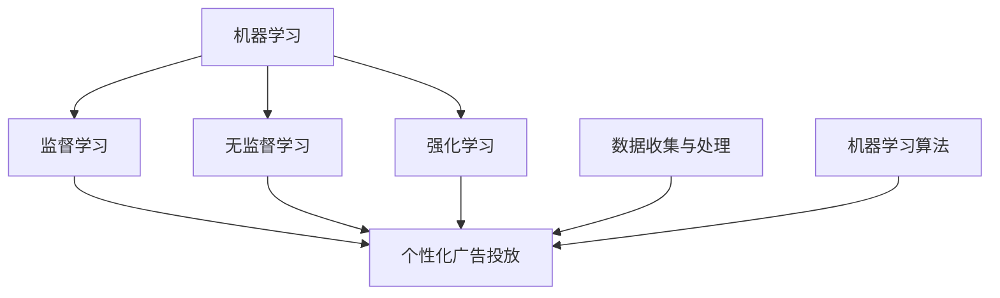

                 

### 背景介绍

在当今数字化时代，广告投放已成为企业获取客户、提升品牌知名度的重要手段。随着互联网用户的快速增长和用户行为的多样化，传统的广告投放方式已经难以满足市场需求。个性化广告投放作为一种新兴的广告投放策略，正逐渐受到广告行业的广泛关注。个性化广告投放通过分析用户的兴趣、行为和偏好，实现广告内容与用户需求的精准匹配，从而提高广告投放的效果和用户转化率。

机器学习作为一种先进的数据分析和处理技术，已经在众多领域取得了显著的成果。在个性化广告投放中，机器学习通过构建用户兴趣模型、广告推荐模型等，实现广告内容的智能推送。这不仅能够提升广告投放的效率，还能够降低广告投放的成本，提高企业的市场竞争优势。

本文将围绕机器学习在个性化广告投放中的应用展开，首先介绍机器学习的基本概念和原理，然后探讨个性化广告投放的背景和意义，接着分析机器学习在个性化广告投放中的应用场景，并详细阐述个性化广告投放中的数据收集、处理和分析方法。此外，本文还将通过实例介绍机器学习算法在个性化广告投放中的应用，探讨个性化广告投放中面临的挑战和解决方案，并展望个性化广告投放的未来发展趋势。

通过本文的阅读，读者将能够深入了解机器学习在个性化广告投放中的应用，掌握相关的技术和方法，为未来的广告投放实践提供有益的参考和指导。

### 核心概念与联系

在探讨机器学习在个性化广告投放中的应用之前，有必要首先明确一些核心概念，并理清它们之间的关系。以下是几个关键概念及其相互关联的架构图：

#### 1. 机器学习

**定义**：机器学习是指通过算法让计算机从数据中自动学习规律，并利用这些规律进行预测或决策的过程。

**关联**：机器学习是一个广泛的领域，包括监督学习、无监督学习和强化学习等子领域。其中，监督学习通过已知标签数据进行模型训练，无监督学习通过未标记的数据发现数据分布和模式，强化学习则通过与环境互动来学习最佳策略。

#### 2. 个性化广告投放

**定义**：个性化广告投放是基于用户的行为数据、兴趣偏好等，通过算法分析和预测，向用户推荐最相关、最感兴趣的广告内容。

**关联**：个性化广告投放的目标是实现广告内容与用户需求的精准匹配，从而提高广告的效果和用户转化率。这一目标依赖于用户数据的收集、处理和分析。

#### 3. 数据收集与处理

**定义**：数据收集与处理是指从各种数据源中获取数据，并对其进行清洗、转换和整合的过程。

**关联**：数据收集与处理是机器学习的基础环节，直接影响到模型的训练效果和准确性。高质量的数据是构建有效模型的前提。

#### 4. 机器学习算法

**定义**：机器学习算法是指用于实现机器学习任务的具体算法，如线性回归、决策树、支持向量机等。

**关联**：不同的算法适用于不同类型的数据和任务，选择合适的算法是机器学习成功的关键。

#### Mermaid 流程图

以下是一个简单的Mermaid流程图，用于展示上述概念之间的关系：

通过这个流程图，我们可以清晰地看到机器学习与个性化广告投放、数据收集与处理、机器学习算法之间的相互关系。这些核心概念共同构成了机器学习在个性化广告投放中的应用框架。

#### 关键概念解析

- **机器学习**：机器学习是使计算机通过数据和经验自动改进性能的一种技术。它包括多个子领域，如监督学习、无监督学习和强化学习。每个子领域都有其独特的算法和应用场景。
- **个性化广告投放**：个性化广告投放旨在通过用户数据的分析和处理，为每个用户提供最相关的广告内容，提高广告的点击率和转化率。
- **数据收集与处理**：数据收集与处理是机器学习的核心步骤，它包括从多个数据源获取数据、清洗数据、进行特征工程，最终形成可用于模型训练的数据集。
- **机器学习算法**：机器学习算法是具体实现机器学习任务的方法，如线性回归用于预测数值型结果，决策树用于分类任务，支持向量机则用于分类和回归任务。

通过理解这些核心概念及其相互关联，我们能够更好地理解机器学习在个性化广告投放中的应用原理和实践方法。接下来，本文将深入探讨机器学习在个性化广告投放中的具体应用场景和实现细节。

### 机器学习在个性化广告投放中的应用

在个性化广告投放中，机器学习技术扮演着至关重要的角色。通过构建用户兴趣模型和广告推荐模型，机器学习能够实现广告内容与用户需求的精准匹配，从而提高广告投放的效果。以下将详细介绍机器学习在个性化广告投放中的具体应用。

#### 用户兴趣模型

用户兴趣模型是个性化广告投放的核心，它通过分析用户的浏览历史、搜索记录、购买行为等数据，预测用户对特定类型广告的兴趣程度。以下是构建用户兴趣模型的步骤：

1. **数据收集与预处理**：首先，需要从多个渠道收集用户数据，包括网站行为数据、社交媒体数据、购买记录等。然后，对收集到的数据进行清洗和预处理，如去除重复数据、处理缺失值、进行数据归一化等。

2. **特征提取**：在数据预处理的基础上，提取与用户兴趣相关的特征。这些特征可以包括用户的浏览时长、点击次数、购买频率、偏好类型等。通过特征提取，将原始数据转换为可用于模型训练的向量表示。

3. **模型训练**：使用机器学习算法，如朴素贝叶斯、随机森林、神经网络等，对提取的特征进行训练，构建用户兴趣模型。模型的目标是预测用户对某一类广告的兴趣程度。

4. **模型评估与优化**：通过交叉验证等方法评估模型性能，并根据评估结果对模型进行调整和优化，以提高预测准确性。

#### 广告推荐模型

广告推荐模型是基于用户兴趣模型，为每个用户推荐最相关的广告内容。以下是构建广告推荐模型的步骤：

1. **广告内容分类**：首先，对广告内容进行分类，如购物类、旅游类、娱乐类等。这一步有助于将广告内容与用户兴趣更好地匹配。

2. **协同过滤**：协同过滤是一种常见的广告推荐算法，它通过分析用户之间的行为相似性来推荐广告。协同过滤包括基于用户的协同过滤和基于物品的协同过滤。

   - **基于用户的协同过滤**：找到与目标用户行为相似的邻居用户，根据邻居用户的兴趣推荐广告。
   - **基于物品的协同过滤**：找到与目标广告相似的邻居物品，根据邻居物品的用户兴趣推荐广告。

3. **模型优化**：使用机器学习算法，如矩阵分解、深度学习等，对协同过滤模型进行优化，以提高推荐效果。

4. **实时推荐**：根据用户实时行为和兴趣，动态更新推荐列表，实现实时广告推荐。

#### 应用实例

以下是机器学习在个性化广告投放中的应用实例：

1. **电商广告**：电商网站通过用户浏览历史和购买记录，使用用户兴趣模型和广告推荐模型，为用户推荐相关的商品广告。例如，用户在浏览了一款手机后，系统会推荐其他品牌的手机或相关配件。

2. **社交媒体广告**：社交媒体平台通过分析用户的点赞、评论、分享等行为，使用用户兴趣模型和广告推荐模型，为用户推荐感兴趣的内容广告。例如，用户在某个话题下活跃度高，系统会推荐相关话题的推广内容。

3. **搜索引擎广告**：搜索引擎通过用户的搜索历史和查询意图，使用用户兴趣模型和广告推荐模型，为用户推荐相关的广告内容。例如，用户搜索了“旅游”相关关键词，系统会推荐旅游相关的广告。

通过这些实例，我们可以看到机器学习在个性化广告投放中的应用广泛且效果显著。它不仅提高了广告投放的精准度，还提升了用户的体验和满意度。接下来，本文将深入探讨个性化广告投放中的数据收集与处理方法。

### 个性化广告投放中的数据收集与处理方法

在个性化广告投放中，数据收集与处理是至关重要的一环。有效的数据收集和处理能够为机器学习模型提供高质量的数据输入，从而提升广告投放的精准度和效果。以下将详细介绍个性化广告投放中的数据收集与处理方法。

#### 数据收集

数据收集是构建有效广告投放模型的基础。在个性化广告投放中，需要收集以下类型的数据：

1. **用户行为数据**：包括用户的浏览记录、点击行为、搜索历史、购买行为等。这些数据可以从网站日志、浏览器缓存、数据库等渠道获取。

2. **兴趣标签数据**：通过对用户行为的分析，可以提取用户的兴趣标签，如用户对某个产品类别的兴趣、对某个品牌的偏好等。这些数据可以通过自然语言处理、内容分析等技术进行提取。

3. **外部数据**：包括社交媒体数据、地理位置数据、天气数据等。这些数据可以进一步丰富用户画像，提高广告投放的精准度。

4. **用户反馈数据**：包括用户对广告的点击率、转化率、满意度等反馈。这些数据可以帮助评估广告效果，并优化广告投放策略。

#### 数据预处理

数据预处理是确保数据质量和模型性能的重要步骤。以下是一些常见的数据预处理方法：

1. **数据清洗**：去除重复数据、处理缺失值、纠正错误数据等。例如，删除重复的浏览记录、填充缺失的购买记录等。

2. **数据归一化**：将不同特征的数据进行归一化处理，使其具有相同的量纲。例如，将用户的浏览时长从分钟转换为秒，将购买金额从元转换为分等。

3. **特征工程**：提取与广告投放相关的特征，如用户的平均浏览时长、点击率、购买频率等。特征工程是提高模型性能的关键步骤。

4. **数据降维**：通过主成分分析（PCA）等方法，减少数据维度，去除冗余特征，提高模型训练效率。

#### 数据建模

在数据预处理完成后，可以开始构建机器学习模型。以下是一些常见的数据建模方法：

1. **分类模型**：用于预测用户对广告的响应行为，如点击（Click-Through Rate, CTR）或转化（Conversion Rate）。常见的分类算法包括逻辑回归、支持向量机（SVM）、随机森林等。

2. **回归模型**：用于预测广告的效果指标，如广告投放的 ROI（投资回报率）。常见的回归算法包括线性回归、岭回归等。

3. **协同过滤模型**：用于根据用户的历史行为和兴趣推荐相关的广告。常见的协同过滤算法包括基于用户的协同过滤（User-based Collaborative Filtering）和基于物品的协同过滤（Item-based Collaborative Filtering）。

4. **聚类模型**：用于发现用户群体中的潜在兴趣点，为广告投放提供参考。常见的聚类算法包括 K-均值聚类、层次聚类等。

#### 模型评估与优化

在构建模型后，需要对模型进行评估和优化，以确保其性能满足实际需求。以下是一些常见的评估和优化方法：

1. **交叉验证**：通过将数据集划分为训练集和测试集，评估模型的泛化能力。常用的交叉验证方法包括 K-折交叉验证和留一法交叉验证。

2. **模型调优**：通过调整模型参数，优化模型性能。常用的调优方法包括网格搜索和贝叶斯优化。

3. **模型集成**：通过组合多个模型，提高预测准确性和稳定性。常见的模型集成方法包括堆叠（Stacking）和提升（Boosting）。

4. **在线学习**：在广告投放过程中，实时更新用户行为数据，并重新训练模型，以适应不断变化的市场环境。

#### 案例分析

以下是一个关于个性化广告投放数据收集与处理的案例分析：

假设一个电商网站希望为用户推荐商品广告。首先，网站需要收集用户的行为数据，如浏览记录、点击行为和购买记录。然后，通过数据清洗和特征工程，提取与用户兴趣相关的特征，如浏览时长、点击率、购买频率等。接下来，使用机器学习算法，如协同过滤和分类算法，构建用户兴趣模型和广告推荐模型。通过交叉验证和模型调优，评估模型性能，并实时更新用户行为数据，以优化广告投放效果。

通过以上数据收集与处理方法，个性化广告投放能够实现广告内容与用户需求的精准匹配，提高广告投放的效果和用户满意度。

### 个性化广告投放中的算法优化

在个性化广告投放中，算法优化是提高广告效果和用户满意度的重要环节。通过算法优化，可以进一步提高广告推荐的准确性和响应速度。以下将介绍几种常见的算法优化方法。

#### 特征工程

特征工程是算法优化的基础。通过提取和构造与广告投放相关的特征，可以提升模型的预测能力。以下是一些特征工程的方法：

1. **稀疏特征转换**：将稀疏数据（如用户行为数据）转换为稠密特征，以便于模型处理。例如，可以使用独热编码（One-Hot Encoding）将用户行为数据转换为二进制特征向量。

2. **交互特征**：构造特征之间的交互项，以捕捉更复杂的用户兴趣模式。例如，对于电商网站，可以将用户的浏览历史与购买记录进行组合，生成新的特征。

3. **归一化和标准化**：对特征进行归一化和标准化处理，使其具有相似的量纲，从而避免某些特征对模型的影响过大。

#### 模型调优

模型调优是提升算法性能的关键步骤。以下是一些模型调优的方法：

1. **网格搜索**：通过遍历多个参数组合，找到最优参数设置。虽然计算成本较高，但可以找到相对最优的参数。

2. **贝叶斯优化**：使用贝叶斯优化算法，根据历史调参结果和先验知识，智能搜索最优参数组合。相比网格搜索，贝叶斯优化具有更高的效率和鲁棒性。

3. **交叉验证**：使用交叉验证方法，评估模型在不同数据集上的表现，从而找到性能最佳的模型。

#### 模型集成

模型集成是将多个模型组合起来，提高预测准确性和稳定性。以下是一些常见的模型集成方法：

1. **堆叠（Stacking）**：将多个模型作为基础模型，再训练一个更高层次的模型（元学习器）来集成这些基础模型的预测结果。

2. **提升（Boosting）**：通过迭代训练多个基础模型，每个模型都对前一个模型的预测错误进行调整，从而提高整体模型的预测能力。

3. **集成学习**：将多个模型的结果进行加权或投票，生成最终的预测结果。常见的集成学习方法包括随机森林、梯度提升树（Gradient Boosting Tree）等。

#### 实时反馈与调整

在个性化广告投放中，实时反馈与调整是优化广告效果的重要手段。以下是一些实时反馈与调整的方法：

1. **在线学习**：在广告投放过程中，实时更新用户行为数据，并重新训练模型。这样可以确保模型始终反映最新的用户兴趣和偏好。

2. **自适应调整**：根据用户对广告的反馈（如点击率、转化率等），动态调整广告投放策略。例如，如果用户对某些广告点击率较高，可以增加这些广告的投放频次。

3. **阈值调整**：根据广告效果和用户需求，调整广告投放的阈值。例如，如果某类广告的转化率较低，可以适当提高其投放的门槛，从而减少无效广告的投放。

#### 案例分析

以下是一个关于个性化广告投放算法优化案例：

假设一个电商网站希望优化其商品推荐算法。首先，通过数据收集和特征工程，提取与用户兴趣相关的特征，如浏览时长、购买频率、点击率等。然后，使用协同过滤和分类算法构建用户兴趣模型和商品推荐模型。通过网格搜索和交叉验证，找到最优的参数设置，并使用堆叠方法集成多个模型，提高推荐准确性。同时，利用在线学习技术，实时更新用户行为数据，并动态调整广告投放策略，以实现最佳广告效果。

通过以上算法优化方法，个性化广告投放能够更精准地满足用户需求，提高广告效果和用户满意度。

### 个性化广告投放中的挑战与解决方案

尽管个性化广告投放在提高广告效果和用户满意度方面具有显著优势，但在实际应用中仍面临诸多挑战。以下将探讨这些挑战，并提出相应的解决方案。

#### 数据隐私

个性化广告投放依赖于用户行为数据，这引发了数据隐私的担忧。用户隐私泄露可能导致用户信任度下降，甚至法律纠纷。解决方案如下：

1. **数据匿名化**：在收集和处理用户数据时，采用数据匿名化技术，如加密、哈希处理等，以保护用户隐私。
2. **合规性**：确保广告投放过程符合相关法律法规，如《通用数据保护条例》（GDPR）和《加州消费者隐私法案》（CCPA）。
3. **用户授权**：在收集用户数据前，获得用户明确授权，并告知数据使用方式和目的，增强用户对数据处理的透明度和信任感。

#### 算法公平性

个性化广告投放中，算法可能因数据偏见而导致不公平现象。例如，算法可能对某些群体进行不公平的推送，影响用户权益。解决方案如下：

1. **算法审计**：定期对广告投放算法进行审计，确保算法的公平性和透明度。
2. **多样性数据集**：使用多样化的数据集进行模型训练，避免数据集中存在的偏见。
3. **公平性指标**：引入公平性指标，如公平性度量（Fairness Measure），评估算法在不同群体上的表现，并调整模型以实现公平性。

#### 模型可解释性

个性化广告投放中的机器学习模型通常非常复杂，难以解释其决策过程。这可能导致用户对广告投放结果的信任度下降。解决方案如下：

1. **模型可视化**：使用可视化工具，如决策树、神经网络结构图等，展示模型的内部结构和决策过程。
2. **解释性模型**：选择具有更好可解释性的模型，如线性回归、逻辑回归等，这些模型能够明确地展示变量之间的关系。
3. **透明度政策**：制定透明度政策，向用户公开广告投放算法的基本原理和决策逻辑，增强用户对广告投放过程的信任。

#### 技术复杂性

个性化广告投放需要复杂的机器学习和数据处理技术，这对技术团队提出了较高要求。解决方案如下：

1. **技术培训**：加强团队成员的技能培训，提高他们对机器学习和数据处理技术的掌握程度。
2. **开源工具**：利用开源机器学习和数据处理工具，如Scikit-learn、TensorFlow等，简化开发流程。
3. **专家咨询**：与机器学习领域专家合作，借助外部专业知识和技术支持，提升技术能力。

#### 案例分析

以下是一个关于个性化广告投放中挑战与解决方案的案例分析：

假设某电商网站在广告投放中遇到数据隐私问题，用户投诉其个人信息被泄露。为解决这一问题，网站采取以下措施：

1. **数据匿名化**：对用户数据进行匿名化处理，使用哈希算法对用户ID进行加密。
2. **合规性**：审查广告投放过程，确保符合GDPR和CCPA等相关法规。
3. **用户授权**：在收集用户数据前，通过弹窗提醒用户并获取明确授权。

此外，网站还引入了算法审计机制，定期检查广告投放算法的公平性和透明度。为了增强模型的可解释性，网站采用了可视化工具展示模型决策过程，并向用户公开算法原理。通过这些措施，网站成功解决了数据隐私问题，提升了用户对广告投放的信任度。

总之，面对个性化广告投放中的挑战，通过技术手段和法律保障，可以有效地解决问题，确保广告投放的公平、透明和用户友好。

### 个性化广告投放的未来发展趋势

随着技术的不断进步和用户需求的多样化，个性化广告投放正迎来新的发展趋势。以下将探讨这些趋势，并预测未来个性化广告投放的发展方向。

#### 技术创新

技术创新将继续驱动个性化广告投放的发展。以下是几个关键的创新方向：

1. **深度学习**：深度学习算法在图像识别、语音识别等领域取得了显著成果，未来有望在个性化广告投放中发挥更大作用。通过深度学习模型，可以更精准地捕捉用户兴趣和行为模式。

2. **自然语言处理**：自然语言处理（NLP）技术将提升广告内容和用户反馈的分析能力。通过NLP技术，可以更准确地理解用户的意图和需求，从而实现更精细的广告推送。

3. **区块链技术**：区块链技术可以提供安全、透明和去中心化的数据管理方案，有助于解决个性化广告投放中的数据隐私和信任问题。未来，区块链技术有望在数据交易、用户授权等方面发挥重要作用。

4. **物联网（IoT）**：随着物联网设备的普及，广告投放将不再局限于传统渠道。通过物联网设备，广告主可以获取更多关于用户实时位置、行为习惯的数据，从而实现更精准的个性化广告投放。

#### 数据多样化

未来个性化广告投放将依赖于更广泛的数据来源和更丰富的数据类型。以下是一些数据多样化趋势：

1. **多模态数据**：结合文本、图像、音频等多模态数据，可以更全面地了解用户需求和兴趣。例如，通过分析用户的语音和文字反馈，可以更准确地预测用户的购买意图。

2. **实时数据**：实时数据将提升个性化广告投放的响应速度和效果。通过实时数据流处理技术，广告主可以即时调整广告内容和投放策略，以应对市场变化。

3. **历史数据**：历史数据将帮助广告主更好地了解用户长期行为模式，从而制定更有效的个性化广告策略。通过对用户历史数据的深入分析，可以挖掘潜在用户需求和偏好。

#### 用户参与度

提高用户参与度是未来个性化广告投放的重要目标。以下是几个提升用户参与度的策略：

1. **互动式广告**：通过互动式广告，如互动游戏、VR/AR体验等，增强用户参与度和品牌印象。

2. **个性化体验**：为用户提供个性化的产品推荐、定制化的广告内容和专属优惠，提升用户体验和忠诚度。

3. **用户反馈机制**：建立用户反馈机制，收集用户对广告内容和广告效果的反馈，并据此优化广告策略。

#### 法规和伦理

随着个性化广告投放的发展，相关法规和伦理问题也将受到更多关注。以下是未来可能的发展方向：

1. **数据隐私保护**：加强数据隐私保护，确保用户数据的安全和用户隐私不受侵犯。未来，可能出台更严格的数据隐私法规，要求广告主在数据收集、处理和使用过程中严格遵守规定。

2. **算法透明度**：提高广告投放算法的透明度，确保用户了解广告推荐的过程和依据。通过算法透明度，增强用户对个性化广告投放的信任。

3. **公平性和道德**：关注个性化广告投放的公平性和道德问题，确保算法不会歧视特定群体或造成不公平的投放效果。未来，可能出台相关指南，规范广告主的算法设计和应用。

总之，未来个性化广告投放将在技术创新、数据多样化、用户参与度和法规伦理等方面取得显著进展。通过不断创新和优化，个性化广告投放将继续提升广告效果和用户体验，成为广告行业的重要趋势。

### 总结与展望

综上所述，机器学习在个性化广告投放中的应用已经成为现代广告营销中不可或缺的一部分。通过用户兴趣模型和广告推荐模型，机器学习能够实现广告内容与用户需求的精准匹配，提高广告投放的效果和用户满意度。本文从机器学习的基本概念出发，详细探讨了个性化广告投放的背景和意义，深入分析了数据收集、处理和模型优化方法，并探讨了个性化广告投放中面临的挑战和解决方案。

未来，个性化广告投放将继续朝着技术创新、数据多样化和用户参与度提升的方向发展。深度学习、自然语言处理、区块链技术和物联网等新技术的应用，将为个性化广告投放带来更多的可能性和机会。同时，数据隐私保护和算法透明度也将成为关注的重要议题。

我们鼓励读者在广告投放实践中积极探索和尝试，结合机器学习的强大功能，不断创新和优化广告投放策略，以应对不断变化的市场环境和用户需求。通过不断学习和实践，读者将能够在个性化广告投放领域取得更好的成绩，为企业和用户创造更大的价值。

### 拓展阅读

1. **《深度学习》 - Ian Goodfellow, Yoshua Bengio, Aaron Courville**：本书是深度学习的经典教材，详细介绍了深度学习的基础知识、算法和应用。

2. **《机器学习实战》 - Peter Harrington**：本书通过实例展示了如何使用Python实现各种机器学习算法，适合初学者和实践者。

3. **《个性化推荐系统》 - Christos Faloutsos, Lars Kunze**：本书介绍了个性化推荐系统的基本原理、算法和实现技术，包括协同过滤、矩阵分解等。

4. **《算法导论》 - Thomas H. Cormen, Charles E. Leiserson, Ronald L. Rivest, Clifford Stein**：本书是算法领域的经典教材，涵盖了各种算法的基本原理和实现方法。

5. **《数据挖掘：实用工具与技术》 - Han, Kamber, Pei**：本书介绍了数据挖掘的基本概念、技术和应用，包括用户行为分析、市场细分等。

通过阅读这些书籍，读者可以进一步深入了解机器学习、数据挖掘和个性化广告投放的相关知识，提升在相关领域的技能和实战能力。希望这些资源能为您的学习之旅提供有益的指导。

