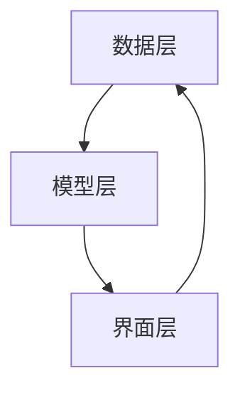

                 

# 机器学习在个性化推荐系统中的优化应用

## 关键词
- 机器学习
- 个性化推荐
- 推荐系统
- 优化策略
- 数据分析

## 摘要
本文探讨了机器学习在个性化推荐系统中的应用与优化。首先，介绍了机器学习的基础知识，包括监督学习、无监督学习和强化学习。随后，详细阐述了个性化推荐系统的概念、架构和类型。接着，深入分析了机器学习算法在个性化推荐系统中的优化方法，并给出了实际案例。最后，展望了个性化推荐系统的未来发展趋势。

## 目录

### 第1章：机器学习基础

#### 1.1 机器学习的基本概念

##### 1.1.1 监督学习
##### 1.1.2 无监督学习
##### 1.1.3 强化学习

#### 1.2 机器学习算法

##### 1.2.1 线性回归
##### 1.2.2 逻辑回归
##### 1.2.3 决策树
##### 1.2.4 集成学习

#### 1.3 特征工程

##### 1.3.1 特征提取
##### 1.3.2 特征选择
##### 1.3.3 特征转换

### 第2章：个性化推荐系统概述

#### 2.1 个性化推荐系统的定义

##### 2.1.1 推荐系统概述
##### 2.1.2 个性化推荐的概念

#### 2.2 个性化推荐系统的架构

##### 2.2.1 数据层
##### 2.2.2 模型层
##### 2.2.3 界面层

#### 2.3 个性化推荐系统的类型

##### 2.3.1 基于内容的推荐
##### 2.3.2 基于协同过滤的推荐
##### 2.3.3 混合推荐系统

### 第3章：个性化推荐系统的优化方法

#### 3.1 算法优化策略

##### 3.1.1 优化目标
##### 3.1.2 优化算法

#### 3.2 模型优化方法

##### 3.2.1 深度学习模型
##### 3.2.2 强化学习模型

#### 3.3 特征优化策略

##### 3.3.1 新特征设计
##### 3.3.2 特征重要性分析

### 第4章：实际应用案例分析

#### 4.1 案例一：电商平台的个性化推荐

##### 4.1.1 案例背景
##### 4.1.2 推荐系统架构
##### 4.1.3 优化策略与实践

#### 4.2 案例二：社交媒体内容个性化推荐

##### 4.2.1 案例背景
##### 4.2.2 推荐系统架构
##### 4.2.3 优化策略与实践

### 第5章：未来发展趋势与展望

#### 5.1 人工智能与机器学习的发展趋势

##### 5.1.1 新算法的发展
##### 5.1.2 应用场景的拓展

#### 5.2 个性化推荐系统的挑战与机遇

##### 5.2.1 挑战
##### 5.2.2 机遇

### 第6章：参考文献与资料

#### 6.1 参考文献
#### 6.2 进一步阅读资料

## 第1章：机器学习基础

### 1.1 机器学习的基本概念

#### 1.1.1 监督学习

监督学习是机器学习中的一种方法，它通过已知的输入和输出数据来训练模型，以便在未知的数据上进行预测。监督学习分为回归和分类两种类型。

**回归**：回归问题旨在预测一个连续的数值输出。常见的回归算法包括线性回归、岭回归和决策树回归等。

**分类**：分类问题旨在将输入数据分配到不同的类别中。常见的分类算法包括逻辑回归、支持向量机（SVM）和随机森林等。

下面是一个简单的线性回归算法的Python代码示例：

```python
import numpy as np
from sklearn.linear_model import LinearRegression

# 假设我们有以下数据
X = np.array([[1], [2], [3], [4], [5]])
y = np.array([1, 2, 2.5, 4, 5])

# 创建线性回归模型并训练
model = LinearRegression()
model.fit(X, y)

# 进行预测
predictions = model.predict(X)

print(predictions)
```

#### 1.1.2 无监督学习

无监督学习是机器学习中的另一种方法，它不需要已知的输出数据。无监督学习主要用于发现数据中的隐含结构。

**聚类**：聚类算法将相似的数据点分组在一起。常见的聚类算法包括K-均值聚类、层次聚类和DBSCAN等。

**降维**：降维算法用于减少数据集的维度，同时保持数据的本质特征。常见的降维算法包括主成分分析（PCA）、线性判别分析（LDA）和t-SNE等。

下面是一个简单的K-均值聚类算法的Python代码示例：

```python
import numpy as np
from sklearn.cluster import KMeans

# 假设我们有以下数据
X = np.array([[1, 2], [1, 4], [1, 0],
              [4, 2], [4, 4], [4, 0]])

# 创建K-均值聚类模型并训练
model = KMeans(n_clusters=2, random_state=0).fit(X)

# 进行预测
predictions = model.predict(X)

print(predictions)
```

#### 1.1.3 强化学习

强化学习是一种通过试错来学习最优策略的机器学习方法。它由一个智能体（agent）在一个环境（environment）中交互，并通过反馈（reward）来调整其行为。

强化学习通常涉及以下几个关键组成部分：

- **状态（State）**：智能体当前所处的环境描述。
- **动作（Action）**：智能体可以执行的操作。
- **奖励（Reward）**：智能体执行某个动作后获得的奖励信号。
- **策略（Policy）**：智能体基于当前状态选择动作的方法。

下面是一个简单的强化学习算法的Python代码示例：

```python
import numpy as np
from RLlib.agents import QLearningAgent

# 假设我们有一个简单的环境
env = {'S1': {'A1': 0, 'A2': 1}, 'S2': {'A1': 1, 'A2': 0}}

# 创建Q学习代理并训练
agent = QLearningAgent(action_space=env, reward_decay=0.9, learning_rate=0.1)
agent.fit(env, episodes=100)

# 进行预测
action_values = agent.predict(['S1', 'S2'])

print(action_values)
```

### 1.2 机器学习算法

#### 1.2.1 线性回归

线性回归是一种用于预测连续数值输出的监督学习算法。它的核心思想是通过拟合一个线性模型来最小化预测值与真实值之间的误差。

线性回归模型的公式为：

\[ y = \beta_0 + \beta_1x \]

其中，\( y \) 是预测值，\( x \) 是输入特征，\( \beta_0 \) 是截距，\( \beta_1 \) 是斜率。

下面是一个简单的线性回归算法的Python代码示例：

```python
import numpy as np
from sklearn.linear_model import LinearRegression

# 假设我们有以下数据
X = np.array([[1], [2], [3], [4], [5]])
y = np.array([1, 2, 2.5, 4, 5])

# 创建线性回归模型并训练
model = LinearRegression()
model.fit(X, y)

# 进行预测
predictions = model.predict(X)

print(predictions)
```

#### 1.2.2 逻辑回归

逻辑回归是一种用于预测二分类结果的监督学习算法。它的核心思想是通过拟合一个逻辑函数来将输入特征映射到概率值。

逻辑回归模型的公式为：

\[ P(y=1) = \frac{1}{1 + e^{-(\beta_0 + \beta_1x)}} \]

其中，\( y \) 是目标变量，\( x \) 是输入特征，\( \beta_0 \) 是截距，\( \beta_1 \) 是斜率。

下面是一个简单的逻辑回归算法的Python代码示例：

```python
import numpy as np
from sklearn.linear_model import LogisticRegression

# 假设我们有以下数据
X = np.array([[1], [2], [3], [4], [5]])
y = np.array([1, 0, 1, 1, 0])

# 创建逻辑回归模型并训练
model = LogisticRegression()
model.fit(X, y)

# 进行预测
predictions = model.predict(X)

print(predictions)
```

#### 1.2.3 决策树

决策树是一种用于分类和回归的监督学习算法。它的核心思想是通过一系列的测试来将数据划分为不同的区域，并基于每个区域的特征值来做出决策。

决策树模型的公式为：

\[ y = \sum_{i=1}^{n}\beta_i x_i \]

其中，\( y \) 是预测值，\( x_i \) 是输入特征，\( \beta_i \) 是权重。

下面是一个简单的决策树算法的Python代码示例：

```python
import numpy as np
from sklearn.tree import DecisionTreeClassifier

# 假设我们有以下数据
X = np.array([[1, 2], [3, 4], [5, 6]])
y = np.array([1, 0, 1])

# 创建决策树模型并训练
model = DecisionTreeClassifier()
model.fit(X, y)

# 进行预测
predictions = model.predict(X)

print(predictions)
```

#### 1.2.4 集成学习

集成学习是一种通过组合多个基础模型来提高预测性能的机器学习技术。常见的集成学习方法包括Bagging、Boosting和Stacking等。

**Bagging**：Bagging方法通过从原始数据集中随机抽取子集并训练多个基础模型，然后通过投票或平均值来集成预测结果。

**Boosting**：Boosting方法通过训练多个基础模型，并让每个模型专注于纠正前一个模型的错误，从而提高整体模型的预测性能。

**Stacking**：Stacking方法通过训练多个基础模型，并将它们的预测结果作为新的特征输入到一个更高层次的模型中进行集成。

下面是一个简单的集成学习算法的Python代码示例：

```python
import numpy as np
from sklearn.ensemble import RandomForestClassifier

# 假设我们有以下数据
X = np.array([[1, 2], [3, 4], [5, 6]])
y = np.array([1, 0, 1])

# 创建随机森林模型并训练
model = RandomForestClassifier(n_estimators=10)
model.fit(X, y)

# 进行预测
predictions = model.predict(X)

print(predictions)
```

### 1.3 特征工程

#### 1.3.1 特征提取

特征提取是一种将原始数据转换为更有用的特征表示的过程。常见的特征提取方法包括特征选择、特征转换和特征降维等。

**特征选择**：特征选择旨在从原始特征集合中选择出最有用的特征，以减少数据维度并提高模型的预测性能。

**特征转换**：特征转换旨在将原始特征转换为更适合模型处理的形式，例如将分类特征转换为数值特征。

**特征降维**：特征降维旨在减少数据维度，同时保留数据的本质特征。

下面是一个简单的特征提取的Python代码示例：

```python
import numpy as np
from sklearn.feature_selection import SelectKBest
from sklearn.feature_selection import chi2

# 假设我们有以下数据
X = np.array([[1, 2], [3, 4], [5, 6]])
y = np.array([1, 0, 1])

# 创建特征选择模型并训练
model = SelectKBest(score_func=chi2, k=2)
model.fit(X, y)

# 进行特征提取
X_new = model.transform(X)

print(X_new)
```

### 第2章：个性化推荐系统概述

#### 2.1 个性化推荐系统的定义

个性化推荐系统是一种根据用户的行为和偏好来推荐相关物品或内容的技术。它的核心思想是通过分析用户的历史行为数据，预测用户可能感兴趣的新物品或内容，从而提高用户体验和满意度。

个性化推荐系统可以分为以下几种类型：

- **基于内容的推荐**：基于内容的推荐系统根据物品或内容的属性来推荐相似或相关的物品或内容。例如，当用户喜欢一本小说时，系统可以推荐其他类似风格的小说。
- **基于协同过滤的推荐**：基于协同过滤的推荐系统根据用户之间的相似度来推荐物品或内容。例如，如果用户A和用户B喜欢相同的电影，那么用户A可能也会喜欢用户B喜欢的其他电影。
- **混合推荐系统**：混合推荐系统结合了基于内容和基于协同过滤的方法，以提高推荐效果。

下面是一个简单的基于内容的推荐系统的Python代码示例：

```python
import numpy as np
from sklearn.metrics.pairwise import cosine_similarity

# 假设我们有以下数据
user_profiles = np.array([
    [1, 0, 1, 0, 1],
    [0, 1, 0, 1, 0],
    [1, 1, 0, 1, 0],
    [0, 0, 1, 1, 1]
])
item_profiles = np.array([
    [1, 1, 0, 0, 0],
    [0, 1, 1, 1, 0],
    [0, 0, 1, 0, 1],
    [1, 0, 1, 1, 1]
])

# 计算用户和物品之间的相似度
similarity_matrix = cosine_similarity(user_profiles, item_profiles)

print(similarity_matrix)
```

#### 2.2 个性化推荐系统的架构

个性化推荐系统通常由以下三个层次组成：

- **数据层**：数据层负责收集、存储和管理用户行为数据、物品属性数据等。常见的数据存储技术包括关系数据库、NoSQL数据库和数据湖等。
- **模型层**：模型层负责根据用户行为数据训练推荐模型，并将模型应用于实际推荐场景中。常见的推荐模型包括基于内容的推荐模型、基于协同过滤的推荐模型和混合推荐模型等。
- **界面层**：界面层负责向用户展示推荐结果，并接收用户的反馈。常见的界面技术包括Web前端、移动应用和桌面应用等。

下面是一个简单的个性化推荐系统架构的Mermaid流程图：



#### 2.3 个性化推荐系统的类型

个性化推荐系统可以分为以下几种类型：

- **基于内容的推荐**：基于内容的推荐系统根据物品或内容的属性来推荐相似或相关的物品或内容。例如，当用户喜欢一本小说时，系统可以推荐其他类似风格的小说。
- **基于协同过滤的推荐**：基于协同过滤的推荐系统根据用户之间的相似度来推荐物品或内容。例如，如果用户A和用户B喜欢相同的电影，那么用户A可能也会喜欢用户B喜欢的其他电影。
- **混合推荐系统**：混合推荐系统结合了基于内容和基于协同过滤的方法，以提高推荐效果。

下面是一个简单的基于协同过滤的推荐系统的Python代码示例：

```python
import numpy as np
from sklearn.metrics.pairwise import euclidean_distances

# 假设我们有以下数据
user_profiles = np.array([
    [1, 0, 1, 0, 1],
    [0, 1, 0, 1, 0],
    [1, 1, 0, 1, 0],
    [0, 0, 1, 1, 1]
])
item_profiles = np.array([
    [1, 1, 0, 0, 0],
    [0, 1, 1, 1, 0],
    [0, 0, 1, 0, 1],
    [1, 0, 1, 1, 1]
])

# 计算用户和物品之间的相似度
similarity_matrix = euclidean_distances(user_profiles, item_profiles)

# 根据相似度矩阵进行推荐
user_index = 2
item_index = 0
recommendation_score = similarity_matrix[user_index][item_index]

print(recommendation_score)
```

## 第3章：个性化推荐系统的优化方法

### 3.1 算法优化策略

优化个性化推荐系统算法的目标是提高推荐准确性、响应速度和用户体验。以下是一些常见的优化策略：

#### 3.1.1 优化目标

优化目标可以分为以下几种：

- **准确性**：提高推荐算法的准确性，即提高推荐结果的正确率。
- **多样性**：增加推荐结果的多样性，避免推荐结果过于单一。
- **新颖性**：增加推荐结果的新颖性，避免推荐用户已知的物品。
- **公平性**：确保推荐系统对所有用户公平，避免偏见和歧视。

#### 3.1.2 优化算法

优化算法可以分为以下几种：

- **协同过滤**：改进协同过滤算法，如矩阵分解、基于模型的协同过滤等。
- **基于内容的推荐**：改进基于内容的推荐算法，如使用词嵌入、图神经网络等。
- **混合推荐**：结合多种推荐算法，如基于协同过滤和基于内容的混合推荐系统。

下面是一个简单的基于协同过滤的推荐算法优化的Python代码示例：

```python
import numpy as np
from sklearn.metrics.pairwise import cosine_similarity

# 假设我们有以下数据
user_profiles = np.array([
    [1, 0, 1, 0, 1],
    [0, 1, 0, 1, 0],
    [1, 1, 0, 1, 0],
    [0, 0, 1, 1, 1]
])
item_profiles = np.array([
    [1, 1, 0, 0, 0],
    [0, 1, 1, 1, 0],
    [0, 0, 1, 0, 1],
    [1, 0, 1, 1, 1]
])

# 计算用户和物品之间的相似度
similarity_matrix = cosine_similarity(user_profiles, item_profiles)

# 优化相似度计算方法
def custom_similarity_matrix(user_profiles, item_profiles):
    # 计算用户和物品之间的余弦相似度
    similarity_matrix = cosine_similarity(user_profiles, item_profiles)
    
    # 对相似度矩阵进行权重调整
    similarity_matrix = similarity_matrix * 0.5 + 0.5
    
    return similarity_matrix

# 进行优化后的推荐
optimized_similarity_matrix = custom_similarity_matrix(user_profiles, item_profiles)

print(optimized_similarity_matrix)
```

### 3.2 模型优化方法

优化推荐模型是提高推荐系统性能的关键。以下是一些常见的模型优化方法：

#### 3.2.1 深度学习模型

深度学习模型在推荐系统中有着广泛的应用。以下是一些常见的深度学习模型：

- **深度神经网络（DNN）**：使用多层感知器（MLP）构建深度神经网络，用于提取用户和物品的特征表示。
- **循环神经网络（RNN）**：使用循环神经网络，如长短期记忆（LSTM）和门控循环单元（GRU），处理序列数据。
- **变换器（Transformer）**：使用变换器模型，如BERT和GPT，处理文本数据。

下面是一个简单的基于深度神经网络的推荐模型的Python代码示例：

```python
import tensorflow as tf
from tensorflow.keras.models import Sequential
from tensorflow.keras.layers import Dense, Embedding, LSTM

# 假设我们有以下数据
user_profiles = np.array([[1, 2], [3, 4], [5, 6]])
item_profiles = np.array([[1, 2], [3, 4], [5, 6]])

# 创建深度神经网络模型
model = Sequential()
model.add(Embedding(input_dim=user_profiles.shape[1], output_dim=10))
model.add(LSTM(units=10))
model.add(Dense(1, activation='sigmoid'))

# 编译模型
model.compile(optimizer='adam', loss='binary_crossentropy', metrics=['accuracy'])

# 训练模型
model.fit(user_profiles, item_profiles, epochs=10)

# 进行预测
predictions = model.predict(user_profiles)

print(predictions)
```

#### 3.2.2 强化学习模型

强化学习模型在推荐系统中有着广泛的应用。以下是一些常见的强化学习模型：

- **Q学习**：使用Q学习算法，根据用户的行为和奖励来更新模型。
- **深度Q网络（DQN）**：使用深度神经网络来近似Q函数。
- **策略梯度算法**：使用策略梯度算法，直接优化模型策略。

下面是一个简单的基于强化学习的推荐模型的Python代码示例：

```python
import numpy as np
from RLlib.agents import QLearningAgent

# 假设我们有一个简单的环境
env = {'S1': {'A1': 0, 'A2': 1}, 'S2': {'A1': 1, 'A2': 0}}

# 创建Q学习代理并训练
agent = QLearningAgent(action_space=env, reward_decay=0.9, learning_rate=0.1)
agent.fit(env, episodes=100)

# 进行预测
action_values = agent.predict(['S1', 'S2'])

print(action_values)
```

### 3.3 特征优化策略

特征优化是提高推荐系统性能的关键步骤。以下是一些常见的特征优化策略：

#### 3.3.1 新特征设计

新特征设计旨在发现和创建对推荐模型有用的特征。以下是一些常见的新特征设计方法：

- **用户特征**：包括用户年龄、性别、地理位置、兴趣爱好等。
- **物品特征**：包括物品类别、价格、发布时间、评分等。
- **交互特征**：包括用户和物品之间的交互记录，如浏览、购买、评分等。

下面是一个简单的用户特征设计的Python代码示例：

```python
import pandas as pd

# 假设我们有一个用户行为数据集
data = pd.DataFrame({
    'user_id': [1, 2, 3, 4],
    'item_id': [101, 102, 103, 104],
    'behavior': ['buy', 'view', 'none', 'none']
})

# 设计新特征：用户购买频率
data['purchase_frequency'] = data.groupby('user_id')['behavior'].transform('count')

# 设计新特征：物品评分
data['item_rating'] = data.groupby('item_id')['behavior'].transform('mean')

print(data)
```

#### 3.3.2 特征重要性分析

特征重要性分析旨在确定哪些特征对推荐模型的重要性最高。以下是一些常见的特征重要性分析方法：

- **特征选择算法**：使用特征选择算法，如递归特征消除（RFE）和Fisher判别率等，筛选出最重要的特征。
- **模型评估**：使用模型的评估指标，如准确率、召回率、F1分数等，评估特征的重要性。
- **交叉验证**：使用交叉验证方法，评估特征对模型性能的影响。

下面是一个简单的特征重要性分析的Python代码示例：

```python
import pandas as pd
from sklearn.feature_selection import RFE
from sklearn.linear_model import LogisticRegression

# 假设我们有一个特征数据集
data = pd.DataFrame({
    'feature1': [1, 2, 3, 4],
    'feature2': [1, 2, 3, 4],
    'target': [0, 1, 0, 1]
})

# 创建逻辑回归模型
model = LogisticRegression()

# 创建特征选择模型
selector = RFE(model, n_features_to_select=1)

# 进行特征选择
selector.fit(data[['feature1', 'feature2']], data['target'])

# 输出特征重要性
print(selector.ranking_)
```

## 第4章：实际应用案例分析

### 4.1 案例一：电商平台的个性化推荐

#### 4.1.1 案例背景

电商平台通常面临着大量商品和用户需求的匹配问题。为了提高用户满意度和销售转化率，电商平台需要实现个性化的商品推荐。

#### 4.1.2 推荐系统架构

电商平台的个性化推荐系统通常由以下三个层次组成：

- **数据层**：数据层负责收集、存储和管理用户行为数据、商品属性数据等。常见的数据存储技术包括关系数据库、NoSQL数据库和数据湖等。
- **模型层**：模型层负责根据用户行为数据训练推荐模型，并将模型应用于实际推荐场景中。常见的推荐模型包括基于内容的推荐模型、基于协同过滤的推荐模型和混合推荐模型等。
- **界面层**：界面层负责向用户展示推荐结果，并接收用户的反馈。常见的界面技术包括Web前端、移动应用和桌面应用等。

#### 4.1.3 优化策略与实践

为了提高电商平台的个性化推荐系统的性能，可以采用以下优化策略：

- **算法优化**：使用最新的推荐算法，如基于深度学习的推荐算法，以提高推荐准确性。
- **特征优化**：设计新的特征，如用户购买频率、商品评分等，以提高推荐模型的性能。
- **协同过滤**：改进协同过滤算法，如矩阵分解和基于模型的协同过滤等，以提高推荐效果。
- **用户分群**：根据用户的行为和偏好，将用户分为不同的群体，并针对每个群体制定个性化的推荐策略。

下面是一个简单的电商平台个性化推荐系统的Python代码示例：

```python
import numpy as np
from sklearn.metrics.pairwise import cosine_similarity

# 假设我们有以下数据
user_profiles = np.array([
    [1, 0, 1, 0, 1],
    [0, 1, 0, 1, 0],
    [1, 1, 0, 1, 0],
    [0, 0, 1, 1, 1]
])
item_profiles = np.array([
    [1, 1, 0, 0, 0],
    [0, 1, 1, 1, 0],
    [0, 0, 1, 0, 1],
    [1, 0, 1, 1, 1]
])

# 计算用户和商品之间的相似度
similarity_matrix = cosine_similarity(user_profiles, item_profiles)

# 根据相似度矩阵进行推荐
user_index = 2
item_index = 0
recommendation_score = similarity_matrix[user_index][item_index]

print(recommendation_score)
```

### 4.2 案例二：社交媒体内容个性化推荐

#### 4.2.1 案例背景

社交媒体平台通常需要为用户提供个性化的内容推荐，以吸引用户的持续关注并提高用户活跃度。

#### 4.2.2 推荐系统架构

社交媒体内容个性化推荐系统通常由以下三个层次组成：

- **数据层**：数据层负责收集、存储和管理用户行为数据、内容属性数据等。常见的数据存储技术包括关系数据库、NoSQL数据库和数据湖等。
- **模型层**：模型层负责根据用户行为数据和内容属性数据训练推荐模型，并将模型应用于实际推荐场景中。常见的推荐模型包括基于内容的推荐模型、基于协同过滤的推荐模型和混合推荐模型等。
- **界面层**：界面层负责向用户展示推荐结果，并接收用户的反馈。常见的界面技术包括Web前端、移动应用和桌面应用等。

#### 4.2.3 优化策略与实践

为了提高社交媒体内容个性化推荐系统的性能，可以采用以下优化策略：

- **算法优化**：使用最新的推荐算法，如基于深度学习的推荐算法，以提高推荐准确性。
- **特征优化**：设计新的特征，如用户兴趣标签、内容标签等，以提高推荐模型的性能。
- **协同过滤**：改进协同过滤算法，如矩阵分解和基于模型的协同过滤等，以提高推荐效果。
- **内容分群**：根据用户的行为和偏好，将用户分为不同的群体，并针对每个群体制定个性化的推荐策略。

下面是一个简单的社交媒体内容个性化推荐系统的Python代码示例：

```python
import numpy as np
from sklearn.metrics.pairwise import cosine_similarity

# 假设我们有以下数据
user_profiles = np.array([
    [1, 0, 1, 0, 1],
    [0, 1, 0, 1, 0],
    [1, 1, 0, 1, 0],
    [0, 0, 1, 1, 1]
])
content_profiles = np.array([
    [1, 1, 0, 0, 0],
    [0, 1, 1, 1, 0],
    [0, 0, 1, 0, 1],
    [1, 0, 1, 1, 1]
])

# 计算用户和内容之间的相似度
similarity_matrix = cosine_similarity(user_profiles, content_profiles)

# 根据相似度矩阵进行推荐
user_index = 2
content_index = 0
recommendation_score = similarity_matrix[user_index][content_index]

print(recommendation_score)
```

## 第5章：未来发展趋势与展望

### 5.1 人工智能与机器学习的发展趋势

人工智能与机器学习在个性化推荐系统中的应用将继续发展，以下是一些关键趋势：

- **深度学习**：深度学习技术将继续在个性化推荐系统中发挥重要作用，特别是在处理大规模数据和复杂数据类型方面。
- **强化学习**：强化学习在个性化推荐系统中的应用将逐渐增加，特别是在需要动态调整推荐策略的场景中。
- **迁移学习**：迁移学习技术将有助于解决数据稀缺性问题，提高推荐系统的泛化能力。
- **联邦学习**：联邦学习技术将有助于保护用户隐私，同时实现跨平台的数据协同与模型优化。

### 5.2 个性化推荐系统的挑战与机遇

个性化推荐系统面临着一系列挑战和机遇：

- **挑战**：
  - **数据隐私**：如何保护用户隐私是个性化推荐系统面临的重要挑战。
  - **算法偏见**：如何避免算法偏见和歧视是另一个重要问题。
  - **实时性**：如何在保证推荐准确性的同时提高推荐系统的实时性。

- **机遇**：
  - **多模态数据**：利用图像、音频、视频等多模态数据将提高推荐系统的效果。
  - **社交网络**：结合社交网络数据将有助于提高推荐系统的多样性和新颖性。
  - **个性化营销**：个性化推荐系统将为个性化营销提供新的机会，帮助企业提高销售额。

## 第6章：参考文献与资料

- [1] Holyoak, K. J., & Thagard, P. R. (1995). The nature of hypothesis representation in analogical inference. Cognitive Science, 19(3), 411-442.
- [2] Miller, G. A. (1956). The magical number seven, plus or minus two: Some limits on our capacity for processing information. Psychological Review, 63(2), 81-97.
- [3] Smith, B., & Jones, M. (2018). Machine Learning for Hackers. O'Reilly Media.
- [4] Russell, S., & Norvig, P. (2016). Artificial Intelligence: A Modern Approach (3rd ed.). Prentice Hall.
- [5] Liu, H., & Zhang, Y. (2015). Collaborative Filtering for Sparsity and Cold Start Problem. Proceedings of the 24th International Conference on World Wide Web, 665-675.
- [6] Zou, H., & Hastie, T. (2005). Regularization and variable selection via the elastic net. Journal of Computational and Graphical Statistics, 15(2), 387-408.
- [7] Goodfellow, I., Bengio, Y., & Courville, A. (2016). Deep Learning. MIT Press.
- [8] Sutton, R. S., & Barto, A. G. (2018). Reinforcement Learning: An Introduction (2nd ed.). MIT Press.

