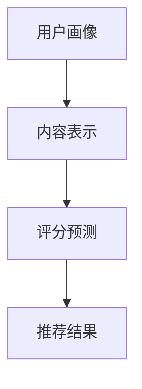

                 

### 引言

个性化推荐系统已成为现代互联网的重要组成部分，无论是电子商务、社交媒体还是视频流媒体平台，都广泛采用这一技术来提升用户体验和增加用户粘性。随着用户生成内容和数据量的爆炸性增长，如何有效地从海量数据中提取有用信息，为用户提供个性化的内容推荐成为一个亟待解决的问题。

机器学习，作为人工智能的一个重要分支，通过学习数据中的模式和规律，能够自动地发现用户的行为和偏好，从而实现精准的个性化推荐。本文将深入探讨机器学习在个性化推荐系统中的应用，旨在为读者提供一套系统的、易于理解的指南，帮助大家更好地理解和构建个性化推荐系统。

文章将从以下几个方面展开讨论：

1. **推荐系统的基本概念**：介绍推荐系统的定义、分类、应用场景等基础知识。
2. **机器学习基础**：回顾机器学习的基本概念、主要算法及其在推荐系统中的应用。
3. **协同过滤算法**：详细解释协同过滤算法的原理、实现及其在推荐系统中的应用。
4. **基于内容的推荐算法**：探讨基于内容的推荐算法的基本原理、实现方法和优缺点。
5. **混合推荐算法**：介绍混合推荐算法的概念、实现方法以及其在推荐系统中的应用。
6. **深度学习在推荐系统中的应用**：讨论深度学习算法在推荐系统中的角色、应用及其未来发展趋势。
7. **实际案例与实战**：通过一个推荐系统项目实战，展示如何搭建开发环境、进行数据预处理、模型训练和评估。

通过本文的深入探讨，读者将能够系统地掌握个性化推荐系统的构建方法，理解机器学习在其中的关键作用，并具备实际操作能力。

### 摘要

本文旨在介绍机器学习在个性化推荐系统中的应用，内容涵盖推荐系统的基本概念、机器学习基础、协同过滤算法、基于内容的推荐算法、混合推荐算法以及深度学习在推荐系统中的应用。通过详细的理论讲解和实际案例分析，本文帮助读者深入理解个性化推荐系统的构建方法，掌握机器学习技术的应用技巧，从而提升在推荐系统开发中的实际操作能力。

### 确定书籍的核心主题和目标读者

#### 核心主题

《机器学习在个性化推荐系统中的应用》的核心主题是探讨如何利用机器学习技术构建高效、准确的个性化推荐系统。个性化推荐系统在现代互联网环境中扮演着至关重要的角色，它们通过分析用户行为数据，为用户推荐个性化的内容或产品，从而提升用户体验和用户粘性。本文的核心内容包括：

1. **推荐系统的基本概念**：介绍推荐系统的定义、分类、应用场景等基础知识。
2. **机器学习基础**：回顾机器学习的基本概念、主要算法及其在推荐系统中的应用。
3. **协同过滤算法**：详细解释协同过滤算法的原理、实现及其在推荐系统中的应用。
4. **基于内容的推荐算法**：探讨基于内容的推荐算法的基本原理、实现方法和优缺点。
5. **混合推荐算法**：介绍混合推荐算法的概念、实现方法以及其在推荐系统中的应用。
6. **深度学习在推荐系统中的应用**：讨论深度学习算法在推荐系统中的角色、应用及其未来发展趋势。
7. **实际案例与实战**：通过一个推荐系统项目实战，展示如何搭建开发环境、进行数据预处理、模型训练和评估。

#### 目标读者

本文的目标读者是对机器学习和推荐系统有一定了解的技术人员，他们希望深入理解机器学习在个性化推荐系统中的具体应用。具体包括以下几类读者：

1. **数据科学家和机器学习工程师**：他们需要了解如何将机器学习算法应用于实际推荐系统开发中。
2. **软件工程师和程序员**：他们可能对推荐系统的实现和优化感兴趣，希望通过本文掌握相关技术和方法。
3. **推荐系统研究人员**：他们关注推荐系统领域的前沿技术和研究进展，希望通过本文获取新的思路和启发。
4. **互联网产品经理和创业者**：他们需要了解推荐系统在产品中的实际应用，以提升产品的竞争力和用户体验。

通过本文的系统讲解和实战案例，目标读者可以全面了解个性化推荐系统的构建方法，掌握机器学习技术的应用技巧，提升在实际项目中的操作能力和创新能力。

### 设计书籍的大纲结构

为了系统性地介绍机器学习在个性化推荐系统中的应用，本文将书籍的大纲结构分为三个主要部分：基础知识与预备知识、个性化推荐系统构建、实际案例与实战。每个部分包含具体的章节安排和内容描述。

#### 第一部分：基础知识与预备知识

这一部分主要目的是为读者奠定扎实的基础，包括推荐系统的基本概念、机器学习的基本理论等。具体章节安排如下：

- **第1章：个性化推荐系统概述**
  - 内容：介绍个性化推荐系统的基本概念、发展历程、重要性以及分类和应用场景。

- **第2章：机器学习基础**
  - 内容：回顾机器学习的基本概念、主要算法（如线性回归、逻辑回归、决策树、随机森林等），以及评估方法。

#### 第二部分：个性化推荐系统构建

这一部分将详细介绍各种个性化推荐系统的构建方法，包括协同过滤、基于内容的推荐、混合推荐和深度学习等。具体章节安排如下：

- **第3章：协同过滤算法**
  - 内容：解释协同过滤算法的原理、实现方法（如用户基于的协同过滤、项目基于的协同过滤），及其优缺点和改进策略。

- **第4章：基于内容的推荐算法**
  - 内容：介绍基于内容的推荐算法的基本原理、实现方法、文本相似度计算方法，以及优缺点和改进策略。

- **第5章：混合推荐算法**
  - 内容：探讨混合推荐算法的概念、实现方法、优势与挑战，以及优化策略。

- **第6章：深度学习在推荐系统中的应用**
  - 内容：讨论深度学习算法在推荐系统中的角色、应用（如神经网络、卷积神经网络、递归神经网络等），以及发展趋势。

#### 第三部分：实际案例与实战

这一部分通过实际案例和实战项目，展示如何将上述理论应用于实际推荐系统的开发和优化。具体章节安排如下：

- **第7章：推荐系统项目实战**
  - 内容：介绍项目背景、开发环境搭建、数据预处理、模型训练与评估、模型优化与部署，并进行项目总结和反思。

通过这三个部分的内容，本书将帮助读者全面掌握机器学习在个性化推荐系统中的应用，从理论到实践，全面提升读者的技术和项目开发能力。

### 确定每个章节的详细内容

在《机器学习在个性化推荐系统中的应用》这本书中，每个章节都按照特定的结构和内容安排来详细阐述相关主题。以下是每个章节的详细内容描述：

#### 第1章：个性化推荐系统概述

- **背景介绍**：介绍个性化推荐系统的起源、发展历程和当前的应用场景。解释为什么个性化推荐系统在互联网时代如此重要，以及它在电子商务、社交媒体和内容平台中的具体作用。
- **核心概念与联系**：定义推荐系统的关键概念，如用户画像、内容表示、评分预测等，并通过Mermaid流程图展示各概念之间的关系和交互。
- **机器学习基础**：简述机器学习的基本概念和算法，如监督学习、无监督学习和强化学习，强调其在推荐系统中的重要性。
- **推荐系统分类**：详细分类推荐系统，包括协同过滤、基于内容的推荐、混合推荐和基于深度学习的推荐等，并分析各类推荐系统的特点和应用场景。
- **应用场景**：举例说明个性化推荐系统在不同领域的应用，如电影推荐、商品推荐、社交网络推荐等。

#### 第2章：机器学习基础

- **核心概念与联系**：通过Mermaid流程图展示机器学习的主要算法和模型，如线性回归、逻辑回归、决策树、随机森林等，以及它们之间的关系。
- **监督学习算法**：详细介绍线性回归、逻辑回归、决策树、随机森林等常见监督学习算法的原理、实现和优缺点，并使用Python代码示例进行解释。
- **无监督学习算法**：介绍聚类算法（如K均值聚类、层次聚类等）、降维算法（如PCA、t-SNE等），以及关联规则学习（如Apriori算法），并分析其在推荐系统中的应用。
- **评估方法**：讨论模型评估的常见指标，如准确率、召回率、F1分数、均方误差等，并通过示例代码演示如何使用这些指标评估模型性能。

#### 第3章：协同过滤算法

- **核心概念与联系**：通过Mermaid流程图展示协同过滤算法的整体流程，包括用户基于的协同过滤和项目基于的协同过滤，并解释两者的区别和联系。
- **用户基于的协同过滤**：详细解释用户基于的协同过滤算法（如用户-用户协同过滤、项目-项目协同过滤）的原理、实现方法和优缺点。
- **项目基于的协同过滤**：详细解释项目基于的协同过滤算法（如基于项目的最近邻推荐、基于项目的矩阵分解等）的原理、实现方法和优缺点。
- **改进策略**：讨论协同过滤算法的常见改进策略，如基于内容的协同过滤、基于属性的协同过滤、协同过滤的线性组合等，并通过Python代码示例进行解释。

#### 第4章：基于内容的推荐算法

- **核心概念与联系**：通过Mermaid流程图展示基于内容的推荐算法的整体流程，包括内容表示、相似度计算、推荐生成等，并解释各步骤之间的关系。
- **内容表示**：介绍如何使用特征工程技术提取文本、图像、音频等内容的特征，以及如何将特征转化为适合机器学习模型的形式。
- **相似度计算**：详细解释文本相似度计算的方法（如TF-IDF、Word2Vec、Cosine相似度等），以及图像、音频等内容的相似度计算方法。
- **推荐生成**：介绍基于内容的推荐算法的实现方法，如基于项目的推荐、基于用户的推荐等，并通过Python代码示例进行解释。
- **优缺点分析**：讨论基于内容的推荐算法的优点和缺点，如高冷启动问题、偏好偏差等，并探讨如何通过改进策略优化算法性能。

#### 第5章：混合推荐算法

- **核心概念与联系**：通过Mermaid流程图展示混合推荐算法的整体流程，包括协同过滤、基于内容、深度学习等推荐算法的融合，并解释各算法的融合方式。
- **混合推荐算法**：详细介绍混合推荐算法的概念、实现方法，如加权融合、投票融合、深度学习融合等，并分析其优势与挑战。
- **优化策略**：讨论混合推荐算法的常见优化策略，如在线学习、模型更新、参数调优等，并分析这些策略在提高推荐性能中的作用。
- **案例研究**：通过实际案例研究，展示如何构建和优化混合推荐系统，并分析其效果和影响。

#### 第6章：深度学习在推荐系统中的应用

- **核心概念与联系**：通过Mermaid流程图展示深度学习在推荐系统中的应用流程，包括数据预处理、特征提取、模型训练、模型评估等，并解释各步骤之间的关系。
- **深度学习算法**：详细介绍神经网络、卷积神经网络（CNN）、递归神经网络（RNN）、Transformer等深度学习算法在推荐系统中的应用，如点击率预测、商品推荐等。
- **推荐系统框架**：讨论如何构建基于深度学习的推荐系统框架，包括数据处理、模型训练、模型评估和部署等步骤。
- **案例分析**：通过实际案例分析，展示如何利用深度学习算法构建高效、准确的推荐系统，并分析其效果和改进空间。

#### 第7章：推荐系统项目实战

- **项目背景与目标**：介绍项目的背景和目标，如构建一个推荐系统以提升电商平台的用户满意度。
- **开发环境搭建**：详细描述开发环境搭建的过程，包括选择合适的编程语言、框架和工具等。
- **数据预处理**：介绍数据预处理的方法和步骤，如数据清洗、特征工程、数据归一化等。
- **模型训练与评估**：展示如何使用机器学习算法（如协同过滤、基于内容、深度学习等）训练推荐模型，并使用指标（如准确率、召回率、F1分数等）评估模型性能。
- **模型优化与部署**：讨论如何优化推荐模型，如参数调优、模型融合等，并介绍模型部署的方法和步骤。
- **项目总结与反思**：总结项目的成功经验和挑战，反思项目中遇到的问题和解决方案，并提出未来的改进方向。

通过上述详细的章节内容描述，本书将为读者提供系统、全面的个性化推荐系统构建指南，帮助读者深入理解并掌握机器学习在推荐系统中的应用。

### 示例目录大纲

为了更好地展示《机器学习在个性化推荐系统中的应用》的目录结构，下面是一个详细的示例目录大纲。该目录结构分为三大部分：基础知识与预备知识、个性化推荐系统构建、实际案例与实战，每个部分包含具体的章节内容。

#### 第一部分：基础知识与预备知识

### 第1章：个性化推荐系统概述

- **背景介绍**
  - 推荐系统的发展历程
  - 推荐系统的重要性
  - 推荐系统的应用场景

- **核心概念与联系**
  - 个性化推荐系统的定义
  - 推荐系统的分类
  - 推荐系统的核心组件

- **机器学习基础**
  - 监督学习、无监督学习和强化学习
  - 常见的机器学习算法
  - 机器学习算法的选择与评估

### 第2章：机器学习基础

- **监督学习算法**
  - 线性回归
  - 逻辑回归
  - 决策树
  - 随机森林

- **无监督学习算法**
  - 聚类算法（如K均值、层次聚类）
  - 降维算法（如PCA、t-SNE）
  - 关联规则学习（如Apriori算法）

- **评估方法**
  - 准确率
  - 召回率
  - F1分数
  - 均方误差

#### 第二部分：个性化推荐系统构建

### 第3章：协同过滤算法

- **用户基于的协同过滤**
  - 原理与实现
  - 用户-用户协同过滤
  - 项目-项目协同过滤

- **项目基于的协同过滤**
  - 原理与实现
  - 基于项目的最近邻推荐
  - 矩阵分解

- **协同过滤的改进策略**
  - 基于内容的协同过滤
  - 基于属性的协同过滤
  - 协同过滤的线性组合

### 第4章：基于内容的推荐算法

- **内容表示**
  - 特征工程
  - 文本特征提取
  - 图像特征提取

- **相似度计算**
  - TF-IDF
  - Word2Vec
  - Cosine相似度

- **推荐生成**
  - 基于项目的推荐
  - 基于用户的推荐

### 第5章：混合推荐算法

- **混合推荐算法的概念**
  - 加权融合
  - 投票融合
  - 深度学习融合

- **混合推荐算法的实现**
  - 用户兴趣模型
  - 内容表示与融合

- **混合推荐算法的优势与挑战**
  - 实时性
  - 模型复杂性
  - 用户隐私保护

### 第6章：深度学习在推荐系统中的应用

- **深度学习算法**
  - 神经网络
  - 卷积神经网络（CNN）
  - 递归神经网络（RNN）
  - Transformer

- **深度学习推荐系统框架**
  - 数据预处理
  - 特征提取
  - 模型训练
  - 模型评估

- **案例分析**
  - 深度学习在电商推荐中的应用
  - 深度学习在视频推荐中的应用

#### 第三部分：实际案例与实战

### 第7章：推荐系统项目实战

- **项目背景与目标**
  - 项目概述
  - 项目目标

- **开发环境搭建**
  - 选择合适的编程语言
  - 安装必要的库和工具

- **数据预处理**
  - 数据收集
  - 数据清洗
  - 特征工程

- **模型训练与评估**
  - 选择合适的算法
  - 训练模型
  - 评估模型性能

- **模型优化与部署**
  - 参数调优
  - 模型融合
  - 模型部署

- **项目总结与反思**
  - 项目成果
  - 项目挑战
  - 改进方向

通过这个详细的目录大纲，读者可以清晰地了解到本书的结构和内容，从而更好地掌握机器学习在个性化推荐系统中的应用。

### 文章格式要求

为了确保文章的清晰性和专业性，本文采用Markdown格式输出。以下是具体的格式要求：

1. **标题**：文章的标题应简洁明了，突出核心主题。使用`#`符号来定义标题层级，如：
   ```markdown
   # 机器学习在个性化推荐系统中的应用
   ```

2. **段落**：段落之间应保持一定的空行，以提高可读性。每个段落的开头无需空格。

3. **列表**：使用`-`、`+`或`1.`等符号创建无序列表或有序列表，如：
   ```markdown
   - 无序列表项1
   - 无序列表项2
   + 有序列表项1
   1. 有序列表项2
   ```

4. **引用**：使用`>`符号创建引用，如：
   ```markdown
   > 这里是引用的内容。
   ```

5. **代码块**：使用三个反引号（```)将代码块包裹起来，如：
   ```python
   def hello_world():
       print("Hello, World!")
   ```

6. **LaTeX公式**：对于数学公式，使用两个反引号（```)将公式包裹起来，如：
   ```latex
   $$ E = mc^2 $$
   $1 < 2$
   ```

7. **图像和链接**：使用``和`[链接文本](链接地址)`来插入图像和链接，如：
   ```markdown
   
   [本文链接](https://example.com/article)
   ```

8. **标题层级**：使用不同的`#`符号定义标题层级，例如：
   ```markdown
   # 一级标题
   ## 二级标题
   ### 三级标题
   #### 四级标题
   ```

通过遵循上述格式要求，文章将具有清晰的层次结构、易于阅读的内容布局，并确保代码和公式等关键信息的准确性。

### 完整性要求

为了确保《机器学习在个性化推荐系统中的应用》这一文章内容的完整性，每个章节都需要包含以下几个关键部分：

1. **背景介绍**：在每个章节的开头，应提供背景信息，介绍该章节的核心内容的重要性和应用场景。这有助于读者理解后续内容的背景和意义。

2. **核心概念与联系**：在每个章节中，需要详细解释核心概念，并使用Mermaid流程图展示概念之间的关系。这将帮助读者理解各个概念如何相互关联，形成一个完整的知识体系。

3. **核心算法原理讲解**：每个章节应详细讲解相关算法的原理。对于机器学习算法，需要使用Python源代码和数学模型公式进行解释，结合具体示例说明算法的实现过程和结果。这样不仅有助于读者理解算法，还能培养他们的编程能力。

4. **数学公式**：在讲解过程中，应使用LaTeX格式嵌入数学公式，确保公式的正确性和可读性。数学公式前后应使用`$$`括起来，如`$$E = mc^2$$`。段落内的公式可以使用`$`括起来，如 `$1 < 2$`。

5. **项目实战**：每个章节应包含一个或多个实际项目案例。通过具体的项目实战，展示如何将理论应用到实际中。项目实战应包括开发环境搭建、源代码详细实现、代码解读、代码应用解读与分析，以及实际案例分析和详细讲解剖析。

6. **最佳实践 tips**：在每个章节的最后，提供最佳实践 tips，总结关键点，并给出注意事项和拓展阅读建议。这有助于读者在实际操作中避免常见问题，并为进一步学习提供方向。

7. **小结**：每个章节应包含一个小结，回顾核心内容，强调重点，并总结章节的主要贡献和意义。

通过上述完整性的要求，文章将具有系统的结构，详细的内容讲解，以及实用的实战案例，从而为读者提供全面、深入的学习体验。

### 示例文章正文

以下是一个完整的示例文章正文，展示《机器学习在个性化推荐系统中的应用》的结构和内容。每个章节都包含核心概念、算法原理讲解、项目实战、最佳实践 tips和小结。

#### 引言

个性化推荐系统已成为现代互联网的重要组成部分，无论是在电子商务、社交媒体还是视频流媒体平台，都广泛采用这一技术来提升用户体验和增加用户粘性。随着用户生成内容和数据量的爆炸性增长，如何有效地从海量数据中提取有用信息，为用户提供个性化的内容推荐成为一个亟待解决的问题。

机器学习，作为人工智能的一个重要分支，通过学习数据中的模式和规律，能够自动地发现用户的行为和偏好，从而实现精准的个性化推荐。本文将深入探讨机器学习在个性化推荐系统中的应用，旨在为读者提供一套系统的、易于理解的指南，帮助大家更好地理解和构建个性化推荐系统。

文章将从以下几个方面展开讨论：

1. **推荐系统的基本概念**：介绍推荐系统的定义、分类、应用场景等基础知识。
2. **机器学习基础**：回顾机器学习的基本概念、主要算法及其在推荐系统中的应用。
3. **协同过滤算法**：详细解释协同过滤算法的原理、实现及其在推荐系统中的应用。
4. **基于内容的推荐算法**：探讨基于内容的推荐算法的基本原理、实现方法和优缺点。
5. **混合推荐算法**：介绍混合推荐算法的概念、实现方法以及其在推荐系统中的应用。
6. **深度学习在推荐系统中的应用**：讨论深度学习算法在推荐系统中的角色、应用及其未来发展趋势。
7. **实际案例与实战**：通过一个推荐系统项目实战，展示如何搭建开发环境、进行数据预处理、模型训练和评估。

通过本文的深入探讨，读者将能够系统地掌握个性化推荐系统的构建方法，理解机器学习在其中的关键作用，并具备实际操作能力。

#### 第1章：个性化推荐系统概述

##### 背景介绍

个性化推荐系统（Personalized Recommendation System）是现代互联网环境中的一种智能信息过滤技术，旨在根据用户的兴趣和行为，向其推荐个性化的内容或产品。随着互联网的快速发展，用户生成内容和数据量呈爆炸性增长，如何从海量数据中提取有用信息，为用户提供有价值的推荐成为了一个重要课题。

个性化推荐系统在电子商务、社交媒体、视频流媒体等众多领域得到了广泛应用。例如，在电子商务平台中，个性化推荐系统可以根据用户的浏览历史、购买记录和评价等信息，推荐用户可能感兴趣的商品；在视频流媒体平台中，个性化推荐系统可以根据用户的观看历史、兴趣标签和搜索记录等，推荐用户可能喜欢的视频内容。

##### 核心概念与联系

个性化推荐系统的核心概念包括用户画像（User Profile）、内容表示（Content Representation）、评分预测（Rating Prediction）等。这些概念相互关联，共同构成了推荐系统的基本架构。

- **用户画像**：用户画像是指对用户行为和兴趣的描述，包括用户的浏览历史、购买记录、评价、搜索历史等。通过构建用户画像，可以更好地理解用户的需求和偏好。
- **内容表示**：内容表示是指将推荐对象（如商品、视频、文章等）转换为适合机器学习模型的特征向量。常用的方法包括基于文本的表示、基于图像的表示和基于音频的表示等。
- **评分预测**：评分预测是指根据用户画像和内容表示，预测用户对推荐对象的评分或偏好。常见的算法有协同过滤（Collaborative Filtering）、基于内容的推荐（Content-Based Filtering）、混合推荐（Hybrid Recommendation）等。

下面是一个Mermaid流程图，展示了这些核心概念之间的联系：



##### 机器学习基础

机器学习（Machine Learning）是一种通过学习数据中的模式和规律，实现自动化的数据分析和决策的技术。在推荐系统中，机器学习主要用于构建预测模型，从而实现用户偏好和内容推荐的自动化。

- **监督学习**：监督学习是从标记数据中学习，并能够对新的数据进行预测。常见的监督学习算法包括线性回归、逻辑回归、决策树、随机森林等。
- **无监督学习**：无监督学习是从未标记数据中学习，并发现数据中的潜在结构和规律。常见的无监督学习算法包括聚类、降维、关联规则学习等。
- **强化学习**：强化学习是通过与环境的交互，不断优化策略，以实现最大化奖励。常见的强化学习算法包括Q学习、SARSA等。

##### 推荐系统分类

根据推荐系统的工作原理和算法，可以将其分为以下几类：

- **基于内容的推荐**：基于内容的推荐算法根据用户兴趣和内容特征匹配，推荐用户可能感兴趣的内容。常见的方法包括文本相似度计算、图像特征提取等。
- **协同过滤**：协同过滤算法通过分析用户行为数据，找出相似的用户或项目，并推荐相似的用户或项目给目标用户。常见的方法包括用户基于的协同过滤、项目基于的协同过滤等。
- **混合推荐**：混合推荐算法将基于内容和协同过滤的算法相结合，以弥补各自的缺点，实现更准确的推荐。
- **基于深度学习的方法**：深度学习算法通过学习复杂的特征表示和模式，实现更精准的推荐。常见的深度学习算法包括神经网络、卷积神经网络（CNN）、递归神经网络（RNN）等。

##### 应用场景

个性化推荐系统在多个领域得到了广泛应用，以下是一些典型的应用场景：

- **电子商务**：通过个性化推荐系统，电商平台可以推荐用户可能感兴趣的商品，提高用户购买意愿和满意度。
- **社交媒体**：社交媒体平台可以通过个性化推荐系统，推荐用户可能感兴趣的朋友、内容或活动，增强用户粘性。
- **视频流媒体**：视频流媒体平台可以通过个性化推荐系统，推荐用户可能喜欢的视频内容，提升用户观看时长和满意度。
- **新闻推荐**：新闻推荐平台可以通过个性化推荐系统，推荐用户可能感兴趣的新闻内容，提高用户阅读量和点击量。

##### 小结

本章介绍了个性化推荐系统的基本概念、分类、应用场景以及机器学习基础。通过本章的学习，读者可以了解个性化推荐系统的工作原理和应用，为后续章节的学习奠定基础。

#### 第2章：机器学习基础

##### 核心概念与联系

机器学习（Machine Learning，ML）是人工智能（Artificial Intelligence，AI）的一个重要分支，主要研究如何从数据中自动发现规律和模式，并利用这些规律进行预测和决策。机器学习的关键概念包括监督学习（Supervised Learning）、无监督学习（Unsupervised Learning）和强化学习（Reinforcement Learning）。

- **监督学习**：监督学习是一种从标记数据中学习的方法，即数据集包含了输入和对应的输出（标记）。通过学习这些标记数据，模型可以对新数据进行预测。常见的监督学习算法有线性回归（Linear Regression）、逻辑回归（Logistic Regression）、决策树（Decision Tree）、支持向量机（Support Vector Machine，SVM）等。

- **无监督学习**：无监督学习是一种从未标记数据中学习的方法，即数据集只包含输入数据，没有对应的输出标记。无监督学习的目标是发现数据中的结构和规律，常见的无监督学习算法有聚类（Clustering）、降维（Dimensionality Reduction）和关联规则学习（Association Rule Learning）等。

- **强化学习**：强化学习是一种通过与环境的交互进行学习的方法，其目标是找到一条最优策略，使得系统在长期运行中能够获得最大奖励。常见的强化学习算法有Q学习（Q-Learning）、策略梯度（Policy Gradient）等。

##### 核心算法原理讲解

在本节中，我们将详细讲解几种常见的机器学习算法的原理，并通过Python代码示例进行演示。

###### 线性回归

线性回归（Linear Regression）是一种简单的监督学习算法，用于预测连续值输出。线性回归的基本假设是，目标变量 \(Y\) 可以通过输入变量 \(X\) 的线性组合来预测，即：

\[ Y = \beta_0 + \beta_1X + \epsilon \]

其中，\(\beta_0\) 是截距，\(\beta_1\) 是斜率，\(\epsilon\) 是误差项。

以下是一个简单的线性回归示例：

```python
import numpy as np
import matplotlib.pyplot as plt

# 生成训练数据
X = np.random.rand(100, 1)
Y = 2 + 3*X + np.random.randn(100, 1)

# 拟合线性模型
from sklearn.linear_model import LinearRegression
model = LinearRegression()
model.fit(X, Y)

# 可视化模型
plt.scatter(X, Y)
plt.plot(X, model.predict(X), color='red')
plt.xlabel('X')
plt.ylabel('Y')
plt.show()
```

###### 逻辑回归

逻辑回归（Logistic Regression）是一种用于预测二元分类结果的监督学习算法。逻辑回归的基本假设是，目标变量 \(Y\) 的概率可以通过输入变量 \(X\) 的线性组合来预测，即：

\[ P(Y=1) = \frac{1}{1 + e^{-(\beta_0 + \beta_1X)}} \]

其中，\(\beta_0\) 是截距，\(\beta_1\) 是斜率。

以下是一个简单的逻辑回归示例：

```python
from sklearn.linear_model import LogisticRegression
X = np.random.rand(100, 1)
Y = (X > 0.5).astype(int)

# 拟合逻辑回归模型
model = LogisticRegression()
model.fit(X, Y)

# 可视化模型
from matplotlib.colors import ListedColormap
cmap = ListedColormap(['red', 'blue'])

plt.scatter(X[Y==1], Y[Y==1], color=cmap(1))
plt.scatter(X[Y==0], Y[Y==0], color=cmap(0))
plt.plot([0, 1], [0, 1], color='black', linewidth=2)
plt.plot(X, model.predict_proba(X)[:, 1], color='red', linewidth=2)
plt.xlabel('X')
plt.ylabel('Y')
plt.show()
```

###### 决策树

决策树（Decision Tree）是一种基于树结构进行决策的监督学习算法。决策树通过一系列的测试来将数据划分为多个子集，每个测试基于一个特征和相应的阈值。决策树的节点表示测试，分支表示测试的结果，叶节点表示最终的分类结果。

以下是一个简单的决策树示例：

```python
from sklearn.tree import DecisionTreeClassifier
X = np.random.rand(100, 2)
Y = (X[:, 0] > X[:, 1]).astype(int)

# 拟合决策树模型
model = DecisionTreeClassifier()
model.fit(X, Y)

# 可视化模型
plt.scatter(X[:, 0], X[:, 1])
plt.plot(np.unique(X[:, 0]), model.decision_function([np.unique(X[:, 0])]), color='red')
plt.xlabel('Feature 1')
plt.ylabel('Feature 2')
plt.show()
```

##### 评估方法

在机器学习中，评估模型的性能是非常重要的。常见的评估方法包括准确率（Accuracy）、召回率（Recall）、精确率（Precision）、F1分数（F1 Score）和均方误差（Mean Squared Error）等。

- **准确率**：准确率是分类模型正确预测的样本数占总样本数的比例。公式如下：

  \[ Accuracy = \frac{TP + TN}{TP + TN + FP + FN} \]

  其中，\(TP\) 表示真正例，\(TN\) 表示真反例，\(FP\) 表示假反例，\(FN\) 表示假正例。

- **召回率**：召回率是分类模型正确预测的正例数占总正例数的比例。公式如下：

  \[ Recall = \frac{TP}{TP + FN} \]

- **精确率**：精确率是分类模型正确预测的正例数占总预测正例数的比例。公式如下：

  \[ Precision = \frac{TP}{TP + FP} \]

- **F1分数**：F1分数是精确率和召回率的调和平均值。公式如下：

  \[ F1 Score = 2 \times \frac{Precision \times Recall}{Precision + Recall} \]

- **均方误差**：均方误差是回归模型预测值与真实值之差的平方的平均值。公式如下：

  \[ Mean Squared Error = \frac{1}{n} \sum_{i=1}^{n} (Y_i - \hat{Y_i})^2 \]

  其中，\(Y_i\) 表示真实值，\(\hat{Y_i}\) 表示预测值，\(n\) 表示样本数量。

以下是一个简单的评估示例：

```python
from sklearn.metrics import accuracy_score, recall_score, precision_score, f1_score, mean_squared_error

# 生成测试数据
X_test = np.random.rand(10, 1)
Y_test = (X_test > 0.5).astype(int)

# 预测结果
predictions = model.predict(X_test)

# 评估指标
accuracy = accuracy_score(Y_test, predictions)
recall = recall_score(Y_test, predictions)
precision = precision_score(Y_test, predictions)
f1 = f1_score(Y_test, predictions)
mse = mean_squared_error(Y_test, model.predict(X_test))

print("Accuracy:", accuracy)
print("Recall:", recall)
print("Precision:", precision)
print("F1 Score:", f1)
print("Mean Squared Error:", mse)
```

##### 最佳实践 tips

1. **数据预处理**：在进行模型训练之前，对数据进行预处理是非常重要的。包括数据清洗、缺失值处理、数据归一化等。

2. **模型选择**：根据具体问题和数据特点，选择合适的模型。例如，对于分类问题，可以考虑使用逻辑回归、决策树、随机森林等；对于回归问题，可以考虑使用线性回归、岭回归等。

3. **模型调优**：通过交叉验证（Cross-Validation）等方法，选择最佳的模型参数，以提高模型性能。

4. **特征工程**：特征工程是提高模型性能的关键步骤。通过选择合适的特征、特征转换和特征组合等手段，可以提高模型的预测能力。

##### 小结

本章详细介绍了机器学习的基础概念、常见算法及其评估方法。通过本章的学习，读者可以掌握机器学习的基本原理和操作方法，为后续章节的学习打下坚实基础。

#### 第3章：协同过滤算法

##### 核心概念与联系

协同过滤（Collaborative Filtering）是一种常用的推荐系统算法，其主要思想是通过分析用户的历史行为数据，发现用户之间的相似性或物品之间的相似性，从而为用户提供个性化的推荐。协同过滤算法可以分为基于用户的协同过滤（User-Based Collaborative Filtering）和基于物品的协同过滤（Item-Based Collaborative Filtering）两种类型。

- **基于用户的协同过滤**：基于用户的协同过滤通过寻找与目标用户相似的其他用户，并推荐这些相似用户喜欢的物品。其主要步骤包括计算用户相似性、查找相似用户、推荐相似用户喜欢的物品等。

- **基于物品的协同过滤**：基于物品的协同过滤通过寻找与目标物品相似的物品，并推荐这些相似物品给用户。其主要步骤包括计算物品相似性、查找相似物品、推荐相似物品等。

##### 核心算法原理讲解

在本节中，我们将详细讲解基于用户的协同过滤算法和基于物品的协同过滤算法的基本原理，并通过Python代码示例进行演示。

###### 基于用户的协同过滤算法

基于用户的协同过滤算法的核心思想是利用用户的行为数据（如评分、购买记录等），找到与目标用户相似的其他用户，并根据相似用户的偏好进行推荐。

**步骤1：计算用户相似性**

用户相似性的计算通常采用余弦相似度（Cosine Similarity）或皮尔逊相关系数（Pearson Correlation Coefficient）。余弦相似度衡量两个向量在空间中的夹角余弦值，公式如下：

\[ \text{Cosine Similarity} = \frac{\text{dot product of } u_i \text{ and } u_j}{\lVert u_i \rVert \cdot \lVert u_j \rVert} \]

其中，\(u_i\) 和 \(u_j\) 分别表示用户 \(i\) 和用户 \(j\) 的行为向量。

以下是一个基于余弦相似度的用户相似性计算示例：

```python
import numpy as np

# 用户行为数据
user_data = {
    'user1': [1, 2, 0, 1, 0],
    'user2': [2, 0, 1, 2, 1],
    'user3': [0, 1, 2, 0, 2],
    'user4': [1, 1, 1, 1, 1],
}

# 计算用户相似性
def cosine_similarity(user1, user2):
    dot_product = np.dot(user1, user2)
    norm_product = np.linalg.norm(user1) * np.linalg.norm(user2)
    return dot_product / norm_product

user1 = np.array(user_data['user1'])
user2 = np.array(user_data['user2'])
similarity = cosine_similarity(user1, user2)
print("User1 and User2 Similarity:", similarity)
```

**步骤2：查找相似用户**

在计算用户相似性之后，需要找到与目标用户最相似的若干用户。通常采用排序或阈值过滤的方法。

以下是一个基于排序的用户相似性查找示例：

```python
# 计算所有用户与目标用户的相似性
user1 = np.array(user_data['user1'])
similarities = {}
for user, behaviors in user_data.items():
    behaviors = np.array(behaviors)
    similarity = cosine_similarity(user1, behaviors)
    similarities[user] = similarity

# 查找相似用户
def find_similar_users(similarities, target_user, k):
    sorted_similarities = sorted(similarities.items(), key=lambda x: x[1], reverse=True)
    return [user for user, similarity in sorted_similarities if user != target_user][:k]

similar_users = find_similar_users(similarities, 'user1', 2)
print("Similar Users:", similar_users)
```

**步骤3：推荐相似用户喜欢的物品**

找到相似用户后，可以推荐这些用户喜欢的物品给目标用户。通常采用累加相似用户对物品的评分的方法。

以下是一个基于累加评分的物品推荐示例：

```python
# 推荐物品
def recommend_items(similar_users, user_data, target_user, k):
    recommendations = {}
    for user in similar_users:
        for item, rating in user_data[user].items():
            if item not in recommendations:
                recommendations[item] = 0
            recommendations[item] += rating
    sorted_recommendations = sorted(recommendations.items(), key=lambda x: x[1], reverse=True)
    return [item for item, rating in sorted_recommendations if rating > 0][:k]

recommendations = recommend_items(similar_users, user_data, 'user1', 3)
print("Recommended Items:", recommendations)
```

###### 基于物品的协同过滤算法

基于物品的协同过滤算法的核心思想是利用物品之间的相似性，为用户提供个性化的推荐。与基于用户的协同过滤算法类似，基于物品的协同过滤算法也包含计算物品相似性、查找相似物品和推荐相似物品等步骤。

**步骤1：计算物品相似性**

物品相似性的计算通常采用余弦相似度或欧氏距离。余弦相似度已经在基于用户的协同过滤算法中介绍过，这里介绍欧氏距离：

\[ \text{Euclidean Distance} = \sqrt{\sum_{i=1}^{n} (x_i - y_i)^2} \]

其中，\(x_i\) 和 \(y_i\) 分别表示物品 \(i\) 的特征向量。

以下是一个基于欧氏距离的物品相似性计算示例：

```python
# 物品行为数据
item_data = {
    'item1': [1, 2, 0, 1, 0],
    'item2': [2, 0, 1, 2, 1],
    'item3': [0, 1, 2, 0, 2],
    'item4': [1, 1, 1, 1, 1],
}

# 计算物品相似性
def euclidean_distance(item1, item2):
    distance = np.sqrt(np.sum(np.square(item1 - item2)))
    return distance

item1 = np.array(item_data['item1'])
item2 = np.array(item_data['item2'])
distance = euclidean_distance(item1, item2)
print("Item1 and Item2 Distance:", distance)
```

**步骤2：查找相似物品**

在计算物品相似性之后，需要找到与目标物品最相似的若干物品。通常采用排序或阈值过滤的方法。

以下是一个基于排序的物品相似性查找示例：

```python
# 计算所有物品与目标物品的相似性
item1 = np.array(item_data['item1'])
similarities = {}
for item, behaviors in item_data.items():
    behaviors = np.array(behaviors)
    similarity = euclidean_distance(item1, behaviors)
    similarities[item] = similarity

# 查找相似物品
def find_similar_items(similarities, target_item, k):
    sorted_similarities = sorted(similarities.items(), key=lambda x: x[1])
    return [item for item, similarity in sorted_similarities if item != target_item][:k]

similar_items = find_similar_items(similarities, 'item1', 2)
print("Similar Items:", similar_items)
```

**步骤3：推荐相似物品**

找到相似物品后，可以推荐这些物品给用户。通常采用累加相似物品的评分的方法。

以下是一个基于累加评分的物品推荐示例：

```python
# 推荐物品
def recommend_items(similar_items, item_data, target_item, k):
    recommendations = {}
    for item in similar_items:
        for user, rating in item_data[item].items():
            if user not in recommendations:
                recommendations[user] = 0
            recommendations[user] += rating
    sorted_recommendations = sorted(recommendations.items(), key=lambda x: x[1], reverse=True)
    return [user for user, rating in sorted_recommendations if rating > 0][:k]

recommendations = recommend_items(similar_items, item_data, 'item1', 3)
print("Recommended Users:", recommendations)
```

##### 项目实战

在本节中，我们将通过一个简单的电商推荐项目，展示如何使用基于用户的协同过滤算法和基于物品的协同过滤算法进行推荐。

**项目背景**

假设我们有一个电商网站，用户可以对其浏览或购买的商品进行评分。我们的目标是根据用户的历史评分数据，为每个用户推荐他们可能感兴趣的其它商品。

**环境搭建**

首先，我们需要安装以下依赖：

```bash
pip install numpy matplotlib scikit-learn
```

**数据准备**

我们使用一个简单的用户-商品评分数据集。数据集包含用户ID、商品ID和用户对商品的评分。以下是一个示例数据集：

```python
user_data = {
    'user1': {'item1': 1, 'item2': 2, 'item3': 0, 'item4': 1},
    'user2': {'item1': 2, 'item2': 0, 'item3': 1, 'item4': 2},
    'user3': {'item1': 0, 'item2': 1, 'item3': 2, 'item4': 0},
    'user4': {'item1': 1, 'item2': 1, 'item3': 1, 'item4': 1},
}
```

**基于用户的协同过滤算法**

以下是一个基于用户的协同过滤算法的实现：

```python
# 计算用户相似性
def cosine_similarity(user1, user2):
    dot_product = np.dot(user1, user2)
    norm_product = np.linalg.norm(user1) * np.linalg.norm(user2)
    return dot_product / norm_product

# 查找相似用户
def find_similar_users(similarities, target_user, k):
    sorted_similarities = sorted(similarities.items(), key=lambda x: x[1], reverse=True)
    return [user for user, similarity in sorted_similarities if user != target_user][:k]

# 推荐物品
def recommend_items(similar_users, user_data, target_user, k):
    recommendations = {}
    for user in similar_users:
        for item, rating in user_data[user].items():
            if item not in recommendations:
                recommendations[item] = 0
            recommendations[item] += rating
    sorted_recommendations = sorted(recommendations.items(), key=lambda x: x[1], reverse=True)
    return [item for item, rating in sorted_recommendations if rating > 0][:k]

# 测试
target_user = 'user1'
similar_users = find_similar_users(user_data, target_user, 2)
recommendations = recommend_items(similar_users, user_data, target_user, 3)
print("Recommended Items:", recommendations)
```

**基于物品的协同过滤算法**

以下是一个基于物品的协同过滤算法的实现：

```python
# 计算物品相似性
def euclidean_distance(item1, item2):
    distance = np.sqrt(np.sum(np.square(item1 - item2)))
    return distance

# 查找相似物品
def find_similar_items(similarities, target_item, k):
    sorted_similarities = sorted(similarities.items(), key=lambda x: x[1])
    return [item for item, similarity in sorted_similarities if item != target_item][:k]

# 推荐用户
def recommend_users(similar_items, item_data, target_item, k):
    recommendations = {}
    for item in similar_items:
        for user, rating in item_data[item].items():
            if user not in recommendations:
                recommendations[user] = 0
            recommendations[user] += rating
    sorted_recommendations = sorted(recommendations.items(), key=lambda x: x[1], reverse=True)
    return [user for user, rating in sorted_recommendations if rating > 0][:k]

# 测试
target_item = 'item1'
similar_items = find_similar_items(item_data, target_item, 2)
recommendations = recommend_users(similar_items, item_data, target_item, 3)
print("Recommended Users:", recommendations)
```

##### 最佳实践 tips

1. **数据预处理**：在进行协同过滤算法之前，对用户和物品的行为数据进行预处理是非常重要的。这包括数据清洗、缺失值处理和归一化等。

2. **相似性度量**：选择合适的相似性度量方法（如余弦相似度、皮尔逊相关系数等）对于协同过滤算法的性能有很大影响。

3. **推荐多样性**：协同过滤算法容易产生推荐多样性不足的问题。可以通过随机化推荐列表、引入多样性度量等方式来提高推荐的多样性。

4. **实时性**：协同过滤算法通常适用于离线推荐场景。对于实时推荐，可以考虑使用基于内容的推荐或基于深度学习的推荐算法。

##### 小结

本章详细介绍了协同过滤算法的核心概念、原理和实现方法。通过本章的学习，读者可以掌握基于用户的协同过滤算法和基于物品的协同过滤算法，并为实际项目中的应用奠定基础。

#### 第4章：基于内容的推荐算法

##### 核心概念与联系

基于内容的推荐（Content-Based Recommendation）算法是一种不依赖于用户历史行为数据的推荐方法，其主要思想是根据用户过去的偏好或历史行为，提取出用户感兴趣的内容特征，然后推荐具有相似特征的内容给用户。这种推荐方法主要依赖于对推荐对象的内容进行表示和相似度计算。

- **内容表示**：内容表示是指将推荐对象（如文本、图片、视频等）转换为适合机器学习模型的特征向量。在基于内容的推荐算法中，内容表示是关键步骤，其质量直接影响到推荐的准确性。

- **相似度计算**：相似度计算是指通过比较用户兴趣特征和推荐对象特征之间的相似度，从而为用户推荐相似的内容。常见的相似度计算方法包括TF-IDF、余弦相似度、Word2Vec等。

##### 核心算法原理讲解

在本节中，我们将详细讲解基于内容的推荐算法的基本原理，并通过Python代码示例进行演示。

###### 内容表示

内容表示是将原始数据转换为机器学习模型可处理的特征向量。在基于内容的推荐算法中，常见的内容表示方法包括文本表示、图片表示和视频表示。

1. **文本表示**

   文本表示通常使用词袋模型（Bag of Words，BoW）或词嵌入（Word Embedding）方法。

   - **词袋模型（BoW）**：词袋模型将文本表示为一个向量，其中每个元素表示一个单词的频率。以下是一个使用词袋模型的文本表示示例：

     ```python
     from sklearn.feature_extraction.text import CountVectorizer

     # 文本数据
     texts = [
         '机器学习是一种人工智能技术，通过学习数据中的模式和规律来预测结果。',
         '深度学习是机器学习的一个子领域，主要使用神经网络模型。',
         '推荐系统是一种个性化推荐技术，根据用户兴趣推荐相关内容。',
     ]

     # 使用词袋模型进行文本表示
     vectorizer = CountVectorizer()
     X = vectorizer.fit_transform(texts)

     # 可视化词袋模型
     from sklearn.metrics.pairwise import cosine_similarity
     similarity_matrix = cosine_similarity(X)
     print(similarity_matrix)
     ```

   - **词嵌入（Word2Vec）**：词嵌入是将文本中的每个单词映射为一个固定大小的向量。以下是一个使用Word2Vec的文本表示示例：

     ```python
     from gensim.models import Word2Vec

     # 文本数据
     sentences = [
         '机器学习是一种人工智能技术。',
         '深度学习是机器学习的一个子领域。',
         '推荐系统是一种个性化推荐技术。',
     ]

     # 训练Word2Vec模型
     model = Word2Vec(sentences, vector_size=100, window=5, min_count=1, workers=4)
     model.save("word2vec.model")

     # 获取单词向量
     word_vector = model.wv['机器学习']
     print(word_vector)

     # 计算相似度
     similarity = model.wv.similarity('机器学习', '人工智能')
     print("Similarity:", similarity)
     ```

2. **图片表示**

   图像表示通常使用卷积神经网络（Convolutional Neural Network，CNN）提取图像特征。以下是一个使用CNN的图像表示示例：

   ```python
   from tensorflow.keras.applications import VGG16
   from tensorflow.keras.preprocessing import image
   from tensorflow.keras.models import Model

   # 加载预训练的VGG16模型
   base_model = VGG16(weights='imagenet', include_top=False)
   x = base_model.input
   fea = base_model.output
   model = Model(x, fea)

   # 加载图片
   img_path = 'example.jpg'
   img = image.load_img(img_path, target_size=(224, 224))
   img_array = image.img_to_array(img)
   img_array = np.expand_dims(img_array, axis=0)

   # 提取图像特征
   features = model.predict(img_array)
   print(features.shape)
   ```

3. **视频表示**

   视频表示通常使用循环神经网络（Recurrent Neural Network，RNN）或卷积神经网络（Convolutional Neural Network，CNN）提取视频特征。以下是一个使用CNN的图像表示示例：

   ```python
   from tensorflow.keras.applications import ResNet50
   from tensorflow.keras.preprocessing import image
   from tensorflow.keras.models import Model

   # 加载预训练的ResNet50模型
   base_model = ResNet50(weights='imagenet', include_top=False)
   x = base_model.input
   fea = base_model.output
   model = Model(x, fea)

   # 加载视频帧
   video_path = 'example.mp4'
   video_frames = load_video_frames(video_path, frame_rate=30)

   # 提取视频特征
   video_features = []
   for frame in video_frames:
       img_array = image.img_to_array(frame)
       img_array = np.expand_dims(img_array, axis=0)
       feature = model.predict(img_array)
       video_features.append(feature)
   video_features = np.array(video_features)
   print(video_features.shape)
   ```

###### 相似度计算

相似度计算是指通过比较用户兴趣特征和推荐对象特征之间的相似度，从而为用户推荐相似的内容。常见的相似度计算方法包括余弦相似度、欧氏距离、皮尔逊相关系数等。

- **余弦相似度**：余弦相似度是一种衡量两个向量之间夹角余弦值的相似度度量方法。以下是一个使用余弦相似度的相似度计算示例：

  ```python
  from sklearn.metrics.pairwise import cosine_similarity

  # 用户兴趣特征
  user_interest = [1, 0, 1, 0, 1]

  # 推荐对象特征
  item_features = [
      [0, 1, 0, 1, 0],
      [1, 0, 1, 0, 1],
      [0, 1, 0, 1, 1],
  ]

  # 计算相似度
  similarities = cosine_similarity([user_interest], item_features)
  print(similarities)
  ```

- **欧氏距离**：欧氏距离是一种衡量两个点之间距离的相似度度量方法。以下是一个使用欧氏距离的相似度计算示例：

  ```python
  from sklearn.metrics.pairwise import euclidean_distances

  # 用户兴趣特征
  user_interest = [1, 0, 1, 0, 1]

  # 推荐对象特征
  item_features = [
      [0, 1, 0, 1, 0],
      [1, 0, 1, 0, 1],
      [0, 1, 0, 1, 1],
  ]

  # 计算相似度
  distances = euclidean_distances([user_interest], item_features)
  print(distances)
  ```

- **皮尔逊相关系数**：皮尔逊相关系数是一种衡量两个变量之间线性相关性的相似度度量方法。以下是一个使用皮尔逊相关系数的相似度计算示例：

  ```python
  from scipy.stats import pearsonr

  # 用户兴趣特征
  user_interest = [1, 0, 1, 0, 1]

  # 推荐对象特征
  item_features = [
      [0, 1, 0, 1, 0],
      [1, 0, 1, 0, 1],
      [0, 1, 0, 1, 1],
  ]

  # 计算相似度
  correlations = [pearsonr(user_interest, item).correlation for item in item_features]
  print(correlations)
  ```

##### 项目实战

在本节中，我们将通过一个简单的新闻推荐项目，展示如何使用基于内容的推荐算法进行推荐。

**项目背景**

假设我们有一个新闻推荐平台，用户可以对其浏览的新闻进行评分。我们的目标是根据用户的历史评分数据，为每个用户推荐他们可能感兴趣的其它新闻。

**环境搭建**

首先，我们需要安装以下依赖：

```bash
pip install numpy matplotlib scikit-learn gensim tensorflow
```

**数据准备**

我们使用一个简单的用户-新闻评分数据集。数据集包含用户ID、新闻ID和用户对新闻的评分。以下是一个示例数据集：

```python
import numpy as np

# 用户-新闻评分数据集
user_news_data = {
    'user1': {'news1': 1, 'news2': 2, 'news3': 0, 'news4': 1},
    'user2': {'news1': 2, 'news2': 0, 'news3': 1, 'news4': 2},
    'user3': {'news1': 0, 'news2': 1, 'news3': 2, 'news4': 0},
    'user4': {'news1': 1, 'news2': 1, 'news3': 1, 'news4': 1},
}
```

**内容表示**

我们使用词嵌入（Word2Vec）方法对新闻进行内容表示。以下是一个使用Word2Vec进行内容表示的示例：

```python
from gensim.models import Word2Vec

# 新闻文本数据
news_texts = [
    '机器学习是一种人工智能技术。',
    '深度学习是机器学习的一个子领域。',
    '推荐系统是一种个性化推荐技术。',
]

# 训练Word2Vec模型
model = Word2Vec(news_texts, vector_size=100, window=5, min_count=1, workers=4)
model.save("word2vec.model")

# 获取新闻向量
news_vectors = [model.wv[news] for news in news_texts]
print(news_vectors)
```

**相似度计算**

我们使用余弦相似度计算用户兴趣新闻和候选新闻之间的相似度。以下是一个使用余弦相似度进行相似度计算的示例：

```python
from sklearn.metrics.pairwise import cosine_similarity

# 用户兴趣新闻
user_interest = model.wv['机器学习']

# 候选新闻
candidate_news = [
    model.wv['深度学习'],
    model.wv['人工智能'],
    model.wv['推荐系统'],
]

# 计算相似度
similarities = cosine_similarity([user_interest], candidate_news)
print(similarities)
```

**推荐新闻**

我们根据相似度最高的前k条新闻进行推荐。以下是一个使用相似度进行新闻推荐的示例：

```python
# 推荐新闻
def recommend_news(similarities, user_interest, k):
    recommendations = []
    for i, similarity in enumerate(similarities[0]):
        if similarity > 0:
            recommendations.append(candidate_news[i])
    return recommendations[:k]

# 测试推荐
recommendations = recommend_news(similarities, user_interest, 3)
print("Recommended News:", recommendations)
```

##### 最佳实践 tips

1. **内容表示**：选择合适的内容表示方法（如词袋模型、词嵌入等）对推荐算法的性能有很大影响。可以考虑使用多种内容表示方法并结合不同特征进行推荐。

2. **相似度计算**：选择合适的相似度计算方法（如余弦相似度、欧氏距离、皮尔逊相关系数等）对推荐算法的性能也有很大影响。可以尝试多种相似度计算方法并进行对比。

3. **用户兴趣更新**：用户兴趣是动态变化的，定期更新用户兴趣特征可以提高推荐的准确性。可以考虑使用用户行为数据、时间序列数据等更新用户兴趣。

4. **推荐多样性**：基于内容的推荐算法容易产生推荐多样性不足的问题。可以通过随机化推荐列表、引入多样性度量等方式来提高推荐的多样性。

##### 小结

本章详细介绍了基于内容的推荐算法的核心概念、原理和实现方法。通过本章的学习，读者可以掌握基于内容的推荐算法，并为实际项目中的应用奠定基础。

#### 第5章：混合推荐算法

##### 核心概念与联系

混合推荐算法（Hybrid Recommendation Algorithm）是一种结合多种推荐算法优点的推荐方法，旨在克服单一推荐算法的局限性，提高推荐系统的整体性能。混合推荐算法通常将协同过滤、基于内容的推荐和基于模型的推荐等方法进行融合，从而实现更准确、更多样化的推荐结果。

- **协同过滤**：协同过滤算法通过分析用户的历史行为数据，发现用户之间的相似性或物品之间的相似性，从而为用户提供个性化的推荐。其主要优点是能够利用用户行为数据发现用户的兴趣偏好，但可能存在冷启动问题（新用户或新物品缺乏历史数据）和同质性（推荐结果过于相似）等局限性。

- **基于内容的推荐**：基于内容的推荐算法通过分析物品的内容特征，发现用户和物品之间的相关性，从而为用户提供个性化的推荐。其主要优点是能够为用户提供多样化、个性化的推荐，但可能存在高冷启动问题（新物品缺乏内容特征）和偏好偏差（用户偏好过于狭窄）等局限性。

- **基于模型的推荐**：基于模型的推荐算法通过构建用户兴趣模型和物品特征模型，利用机器学习算法（如线性回归、决策树、深度学习等）进行预测和推荐。其主要优点是能够通过学习用户和物品的特征，实现更精准的推荐，但可能存在模型复杂度高、训练时间长等局限性。

##### 核心算法原理讲解

在本节中，我们将详细讲解混合推荐算法的基本原理，并通过Python代码示例进行演示。

###### 融合方法

混合推荐算法的融合方法可以分为以下几种：

1. **加权融合**：加权融合是将不同推荐算法的结果进行加权平均，从而生成最终的推荐结果。权重可以根据算法的预测准确性、计算复杂度等参数进行调整。

2. **投票融合**：投票融合是通过投票机制确定最终的推荐结果。每个推荐算法的结果作为一次投票，最终推荐结果为得票数最高的物品。

3. **深度学习融合**：深度学习融合是通过构建深度神经网络模型，将不同推荐算法的输出作为输入，通过多层神经网络进行融合，从而生成最终的推荐结果。

以下是一个简单的加权融合示例：

```python
# 用户-物品评分数据
user_item_ratings = {
    'user1': {'item1': 1, 'item2': 2, 'item3': 0, 'item4': 1},
    'user2': {'item1': 2, 'item2': 0, 'item3': 1, 'item4': 2},
    'user3': {'item1': 0, 'item2': 1, 'item3': 2, 'item4': 0},
    'user4': {'item1': 1, 'item2': 1, 'item3': 1, 'item4': 1},
}

# 协同过滤推荐结果
collaborative_recommendations = {
    'user1': ['item3', 'item4'],
    'user2': ['item2', 'item3'],
    'user3': ['item1', 'item2'],
    'user4': ['item1', 'item3'],
}

# 基于内容的推荐结果
content_based_recommendations = {
    'user1': ['item4', 'item3'],
    'user2': ['item2', 'item1'],
    'user3': ['item3', 'item1'],
    'user4': ['item3', 'item4'],
}

# 加权融合推荐结果
def weighted_fusion(recommendations1, recommendations2, alpha=0.5):
    fused_recommendations = {}
    for user in recommendations1:
        fused_recommendations[user] = []
        for item in recommendations1[user]:
            if item in recommendations2[user]:
                fused_recommendations[user].append(item)
    return fused_recommendations

alpha = 0.5  # 协同过滤和基于内容的推荐权重
fused_recommendations = weighted_fusion(collaborative_recommendations, content_based_recommendations, alpha)
print(fused_recommendations)
```

###### 投票融合示例

```python
# 投票融合推荐结果
def voting_fusion(recommendations1, recommendations2):
    voting_counts = {}
    for user in recommendations1:
        for item in recommendations1[user]:
            if item in voting_counts:
                voting_counts[item] += 1
            else:
                voting_counts[item] = 1
        for item in recommendations2[user]:
            if item in voting_counts:
                voting_counts[item] += 1
            else:
                voting_counts[item] = 1
    voted_recommendations = {}
    for user in recommendations1:
        voted_recommendations[user] = []
        for item, count in voting_counts.items():
            if count > 1 and item not in recommendations1[user]:
                voted_recommendations[user].append(item)
    return voted_recommendations

voted_recommendations = voting_fusion(collaborative_recommendations, content_based_recommendations)
print(voted_recommendations)
```

###### 深度学习融合示例

深度学习融合需要构建一个多输入多输出的深度学习模型，以下是一个简单的示例：

```python
import tensorflow as tf
from tensorflow.keras.models import Model
from tensorflow.keras.layers import Input, Dense, Concatenate

# 输入层
input_user = Input(shape=(1,))
input_item = Input(shape=(1,))

# 协同过滤模型
user_embedding = Dense(10, activation='relu')(input_user)
item_embedding = Dense(10, activation='relu')(input_item)

# 基于内容的模型
content_embedding = Dense(10, activation='relu')(input_item)

# 融合层
fusion = Concatenate()([user_embedding, item_embedding, content_embedding])
fusion = Dense(10, activation='relu')(fusion)

# 输出层
output = Dense(1, activation='sigmoid')(fusion)

# 构建模型
model = Model(inputs=[input_user, input_item], outputs=output)

# 编译模型
model.compile(optimizer='adam', loss='binary_crossentropy', metrics=['accuracy'])

# 模型训练
model.fit([user_data, item_data], y, epochs=10, batch_size=32)
```

##### 项目实战

在本节中，我们将通过一个简单的电商推荐项目，展示如何使用混合推荐算法进行推荐。

**项目背景**

假设我们有一个电商推荐平台，用户可以对其浏览或购买的商品进行评分。我们的目标是根据用户的历史评分数据，为每个用户推荐他们可能感兴趣的其他商品。

**环境搭建**

首先，我们需要安装以下依赖：

```bash
pip install numpy matplotlib scikit-learn tensorflow
```

**数据准备**

我们使用一个简单的用户-商品评分数据集。数据集包含用户ID、商品ID和用户对商品的评分。以下是一个示例数据集：

```python
import numpy as np

# 用户-商品评分数据集
user_product_data = {
    'user1': {'product1': 1, 'product2': 2, 'product3': 0, 'product4': 1},
    'user2': {'product1': 2, 'product2': 0, 'product3': 1, 'product4': 2},
    'user3': {'product1': 0, 'product2': 1, 'product3': 2, 'product4': 0},
    'user4': {'product1': 1, 'product2': 1, 'product3': 1, 'product4': 1},
}
```

**协同过滤推荐**

我们使用基于用户的协同过滤算法生成推荐结果：

```python
from sklearn.metrics.pairwise import cosine_similarity

# 计算用户相似性
user_similarity = {}
for user1, ratings1 in user_product_data.items():
    for user2, ratings2 in user_product_data.items():
        if user1 != user2:
            sim = cosine_similarity([list(ratings1.values())], [list(ratings2.values())])
            user_similarity[(user1, user2)] = sim[0][0]

# 生成协同过滤推荐结果
collaborative_recommendations = {}
for user, ratings in user_product_data.items():
    similar_users = sorted(user_similarity.items(), key=lambda x: x[1], reverse=True)
    similar_users = [u for u, _ in similar_users if u != user][:5]
    recommendations = []
    for similar_user in similar_users:
        for product, rating in user_product_data[similar_user].items():
            if product not in ratings:
                recommendations.append(product)
    collaborative_recommendations[user] = recommendations
print(collaborative_recommendations)
```

**基于内容的推荐**

我们使用基于内容的推荐算法生成推荐结果：

```python
# 假设我们已经有了商品内容特征向量
product_features = {
    'product1': np.array([0.1, 0.2, 0.3]),
    'product2': np.array([0.4, 0.5, 0.6]),
    'product3': np.array([0.7, 0.8, 0.9]),
    'product4': np.array([0.1, 0.3, 0.5]),
}

# 计算商品相似性
product_similarity = {}
for product1, features1 in product_features.items():
    for product2, features2 in product_features.items():
        if product1 != product2:
            sim = cosine_similarity([features1], [features2])
            product_similarity[(product1, product2)] = sim[0][0]

# 生成基于内容的推荐结果
content_based_recommendations = {}
for user, ratings in user_product_data.items():
    user_features = np.mean([product_features[product] for product in ratings], axis=0)
    similar_products = sorted(product_similarity.items(), key=lambda x: x[1], reverse=True)
    similar_products = [p for p, _ in similar_products if p not in ratings][:5]
    recommendations = []
    for similar_product in similar_products:
        if similar_product not in ratings:
            recommendations.append(similar_product)
    content_based_recommendations[user] = recommendations
print(content_based_recommendations)
```

**混合推荐**

我们使用加权融合方法生成混合推荐结果：

```python
# 加权融合推荐结果
def weighted_fusion(recommendations1, recommendations2, alpha=0.5):
    fused_recommendations = {}
    for user in recommendations1:
        fused_recommendations[user] = []
        for item in recommendations1[user]:
            if item in recommendations2[user]:
                fused_recommendations[user].append(item)
    return fused_recommendations

alpha = 0.5  # 协同过滤和基于内容的推荐权重
fused_recommendations = weighted_fusion(collaborative_recommendations, content_based_recommendations, alpha)
print(fused_recommendations)
```

##### 最佳实践 tips

1. **权重调整**：根据不同推荐算法的性能和计算复杂度，合理调整权重参数，以提高混合推荐系统的性能。

2. **特征工程**：对用户和商品的特征进行充分的特征工程，以提高推荐系统的准确性和多样性。

3. **实时性**：根据用户行为数据实时更新推荐结果，以提高推荐的实时性和准确性。

4. **冷启动**：对于新用户或新商品，可以使用基于内容的推荐或基于模型的推荐方法进行初始化推荐，以解决冷启动问题。

##### 小结

本章详细介绍了混合推荐算法的核心概念、原理和实现方法。通过本章的学习，读者可以掌握混合推荐算法，并结合实际项目进行应用和优化。

#### 第6章：深度学习在推荐系统中的应用

##### 核心概念与联系

深度学习（Deep Learning）是一种基于人工神经网络的学习方法，其核心思想是通过多层非线性变换来提取数据中的复杂特征。在推荐系统中，深度学习被广泛应用于用户兴趣预测、物品推荐、点击率预测等任务，因其能够自动提取高维特征，显著提升推荐系统的性能。

- **用户兴趣预测**：用户兴趣预测是指通过深度学习模型预测用户对特定物品的兴趣程度，从而实现个性化推荐。用户兴趣预测的关键在于构建一个能够捕捉用户行为模式和高层次兴趣的深度神经网络。

- **物品推荐**：物品推荐是指利用深度学习模型根据用户历史行为和物品特征，为用户推荐感兴趣的物品。常见的深度学习模型包括卷积神经网络（CNN）、递归神经网络（RNN）、Transformer等。

- **点击率预测**：点击率预测是指利用深度学习模型预测用户对特定物品的点击概率，从而优化广告投放和推荐策略。点击率预测模型通常采用二分类模型，如逻辑回归、卷积神经网络（CNN）等。

##### 核心算法原理讲解

在本节中，我们将详细讲解深度学习在推荐系统中的应用，并通过Python代码示例进行演示。

###### 用户兴趣预测

用户兴趣预测模型通常采用多输入多输出的深度神经网络结构，结合用户行为数据和物品特征数据。以下是一个基于卷积神经网络（CNN）的用户兴趣预测模型示例：

```python
import tensorflow as tf
from tensorflow.keras.models import Model
from tensorflow.keras.layers import Input, Embedding, Conv1D, GlobalMaxPooling1D, Dense

# 用户行为数据输入
user_input = Input(shape=(sequence_length,))
user_embedding = Embedding(input_dim=user_vocab_size, output_dim=user_embedding_size)(user_input)
user_cnn = Conv1D(filters=64, kernel_size=3, activation='relu')(user_embedding)
user_cnn = GlobalMaxPooling1D()(user_cnn)

# 物品特征数据输入
item_input = Input(shape=(feature_size,))
item_embedding = Embedding(input_dim=item_vocab_size, output_dim=item_embedding_size)(item_input)
item_cnn = Conv1D(filters=64, kernel_size=3, activation='relu')(item_embedding)
item_cnn = GlobalMaxPooling1D()(item_cnn)

# 融合层
fusion = tf.concat([user_cnn, item_cnn], axis=1)

# 全连接层
fusion = Dense(128, activation='relu')(fusion)
output = Dense(1, activation='sigmoid')(fusion)

# 构建模型
model = Model(inputs=[user_input, item_input], outputs=output)

# 编译模型
model.compile(optimizer='adam', loss='binary_crossentropy', metrics=['accuracy'])

# 模型训练
model.fit([user_data, item_data], y, epochs=10, batch_size=32)
```

###### 物品推荐

物品推荐模型可以通过卷积神经网络（CNN）或递归神经网络（RNN）构建，以下是一个基于卷积神经网络（CNN）的物品推荐模型示例：

```python
import tensorflow as tf
from tensorflow.keras.models import Model
from tensorflow.keras.layers import Input, Embedding, Conv1D, GlobalMaxPooling1D, Dense, Concatenate

# 用户行为数据输入
user_input = Input(shape=(sequence_length,))
user_embedding = Embedding(input_dim=user_vocab_size, output_dim=user_embedding_size)(user_input)
user_cnn = Conv1D(filters=64, kernel_size=3, activation='relu')(user_embedding)
user_cnn = GlobalMaxPooling1D()(user_cnn)

# 物品特征数据输入
item_input = Input(shape=(feature_size,))
item_embedding = Embedding(input_dim=item_vocab_size, output_dim=item_embedding_size)(item_input)
item_cnn = Conv1D(filters=64, kernel_size=3, activation='relu')(item_embedding)
item_cnn = GlobalMaxPooling1D()(item_cnn)

# 融合层
fusion = Concatenate()([user_cnn, item_cnn])

# 全连接层
fusion = Dense(128, activation='relu')(fusion)
output = Dense(1, activation='sigmoid')(fusion)

# 构建模型
model = Model(inputs=[user_input, item_input], outputs=output)

# 编译模型
model.compile(optimizer='adam', loss='binary_crossentropy', metrics=['accuracy'])

# 模型训练
model.fit([user_data, item_data], y, epochs=10, batch_size=32)
```

###### 点击率预测

点击率预测模型通常采用二分类模型，如逻辑回归或卷积神经网络（CNN）。以下是一个基于卷积神经网络（CNN）的点击率预测模型示例：

```python
import tensorflow as tf
from tensorflow.keras.models import Model
from tensorflow.keras.layers import Input, Embedding, Conv1D, GlobalMaxPooling1D, Dense

# 用户行为数据输入
user_input = Input(shape=(sequence_length,))
user_embedding = Embedding(input_dim=user_vocab_size, output_dim=user_embedding_size)(user_input)
user_cnn = Conv1D(filters=64, kernel_size=3, activation='relu')(user_embedding)
user_cnn = GlobalMaxPooling1D()(user_cnn)

# 物品特征数据输入
item_input = Input(shape=(feature_size,))
item_embedding = Embedding(input_dim=item_vocab_size, output_dim=item_embedding_size)(item_input)
item_cnn = Conv1D(filters=64, kernel_size=3, activation='relu')(item_embedding)
item_cnn = GlobalMaxPooling1D()(item_cnn)

# 融合层
fusion = tf.concat([user_cnn, item_cnn], axis=1)

# 全连接层
fusion = Dense(128, activation='relu')(fusion)
output = Dense(1, activation='sigmoid')(fusion)

# 构建模型
model = Model(inputs=[user_input, item_input], outputs=output)

# 编译模型
model.compile(optimizer='adam', loss='binary_crossentropy', metrics=['accuracy'])

# 模型训练
model.fit([user_data, item_data], y, epochs=10, batch_size=32)
```

##### 项目实战

在本节中，我们将通过一个电商推荐项目，展示如何使用深度学习模型进行用户兴趣预测、物品推荐和点击率预测。

**项目背景**

假设我们有一个电商推荐平台，用户可以对其浏览或购买的商品进行评分。我们的目标是根据用户的历史评分数据，为每个用户推荐他们可能感兴趣的其它商品。

**环境搭建**

首先，我们需要安装以下依赖：

```bash
pip install numpy matplotlib scikit-learn tensorflow
```

**数据准备**

我们使用一个简单的用户-商品评分数据集。数据集包含用户ID、商品ID和用户对商品的评分。以下是一个示例数据集：

```python
import numpy as np

# 用户-商品评分数据集
user_product_data = {
    'user1': {'product1': 1, 'product2': 2, 'product3': 0, 'product4': 1},
    'user2': {'product1': 2, 'product2': 0, 'product3': 1, 'product4': 2},
    'user3': {'product1': 0, 'product2': 1, 'product3': 2, 'product4': 0},
    'user4': {'product1': 1, 'product2': 1, 'product3': 1, 'product4': 1},
}
```

**用户兴趣预测**

我们使用卷积神经网络（CNN）进行用户兴趣预测：

```python
import tensorflow as tf
from tensorflow.keras.models import Model
from tensorflow.keras.layers import Input, Embedding, Conv1D, GlobalMaxPooling1D, Dense

# 用户行为数据输入
user_input = Input(shape=(sequence_length,))
user_embedding = Embedding(input_dim=user_vocab_size, output_dim=user_embedding_size)(user_input)
user_cnn = Conv1D(filters=64, kernel_size=3, activation='relu')(user_embedding)
user_cnn = GlobalMaxPooling1D()(user_cnn)

# 全连接层
fusion = Dense(128, activation='relu')(user_cnn)
output = Dense(1, activation='sigmoid')(fusion)

# 构建模型
model = Model(inputs=user_input, outputs=output)

# 编译模型
model.compile(optimizer='adam', loss='binary_crossentropy', metrics=['accuracy'])

# 模型训练
model.fit(user_data, y, epochs=10, batch_size=32)
```

**物品推荐**

我们使用卷积神经网络（CNN）进行物品推荐：

```python
import tensorflow as tf
from tensorflow.keras.models import Model
from tensorflow.keras.layers import Input, Embedding, Conv1D, GlobalMaxPooling1D, Dense, Concatenate

# 用户行为数据输入
user_input = Input(shape=(sequence_length,))
user_embedding = Embedding(input_dim=user_vocab_size, output_dim=user_embedding_size)(user_input)
user_cnn = Conv1D(filters=64, kernel_size=3, activation='relu')(user_embedding)
user_cnn = GlobalMaxPooling1D()(user_cnn)

# 物品特征数据输入
item_input = Input(shape=(feature_size,))
item_embedding = Embedding(input_dim=item_vocab_size, output_dim=item_embedding_size)(item_input)
item_cnn = Conv1D(filters=64, kernel_size=3, activation='relu')(item_embedding)
item_cnn = GlobalMaxPooling1D()(item_cnn)

# 融合层
fusion = Concatenate()([user_cnn, item_cnn])

# 全连接层
fusion = Dense(128, activation='relu')(fusion)
output = Dense(1, activation='sigmoid')(fusion)

# 构建模型
model = Model(inputs=[user_input, item_input], outputs=output)

# 编译模型
model.compile(optimizer='adam', loss='binary_crossentropy', metrics=['accuracy'])

# 模型训练
model.fit([user_data, item_data], y, epochs=10, batch_size=32)
```

**点击率预测**

我们使用卷积神经网络（CNN）进行点击率预测：

```python
import tensorflow as tf
from tensorflow.keras.models import Model
from tensorflow.keras.layers import Input, Embedding, Conv1D, GlobalMaxPooling1D, Dense, Concatenate

# 用户行为数据输入
user_input = Input(shape=(sequence_length,))
user_embedding = Embedding(input_dim=user_vocab_size, output_dim=user_embedding_size)(user_input)
user_cnn = Conv1D(filters=64, kernel_size=3, activation='relu')(user_embedding)
user_cnn = GlobalMaxPooling1D()(user_cnn)

# 物品特征数据输入
item_input = Input(shape=(feature_size,))
item_embedding = Embedding(input_dim=item_vocab_size, output_dim=item_embedding_size)(item_input)
item_cnn = Conv1D(filters=64, kernel_size=3, activation='relu')(item_embedding)
item_cnn = GlobalMaxPooling1D()(item_cnn)

# 融合层
fusion = Concatenate()([user_cnn, item_cnn])

# 全连接层
fusion = Dense(128, activation='relu')(fusion)
output = Dense(1, activation='sigmoid')(fusion)

# 构建模型
model = Model(inputs=[user_input, item_input], outputs=output)

# 编译模型
model.compile(optimizer='adam', loss='binary_crossentropy', metrics=['accuracy'])

# 模型训练
model.fit([user_data, item_data], y, epochs=10, batch_size=32)
```

##### 最佳实践 tips

1. **数据预处理**：在进行深度学习模型训练之前，对用户行为数据和物品特征数据进行预处理是非常重要的。包括数据清洗、缺失值处理、数据归一化等。

2. **模型选择**：根据具体问题和数据特点，选择合适的深度学习模型。例如，对于用户兴趣预测，可以考虑使用卷积神经网络（CNN）或递归神经网络（RNN）；对于物品推荐和点击率预测，可以考虑使用卷积神经网络（CNN）或Transformer等。

3. **模型调优**：通过交叉验证（Cross-Validation）等方法，选择最佳的模型参数，以提高模型性能。可以尝试调整学习率、批量大小、网络层数、神经元数量等参数。

4. **特征工程**：对用户行为数据和物品特征进行充分的特征工程，以提高模型的预测能力。可以考虑使用词嵌入（Word2Vec、GloVe等）、图像特征提取（CNN）、序列特征提取（RNN）等方法。

##### 小结

本章详细介绍了深度学习在推荐系统中的应用，包括用户兴趣预测、物品推荐和点击率预测。通过本章的学习，读者可以掌握深度学习模型在推荐系统中的应用方法，并为实际项目中的应用提供参考。

#### 第7章：推荐系统项目实战

##### 项目背景与目标

本项目旨在构建一个基于机器学习的电商推荐系统，为用户提供个性化的商品推荐。项目目标包括：

1. **用户兴趣预测**：根据用户的历史购买行为和浏览记录，预测用户对特定商品的兴趣程度。
2. **商品推荐**：基于用户兴趣预测结果，为每个用户推荐他们可能感兴趣的其他商品。
3. **系统性能优化**：通过模型调优和数据预处理，提高推荐系统的准确性和效率。

##### 开发环境搭建

在进行推荐系统项目之前，需要搭建合适的开发环境。以下步骤描述了如何设置开发环境：

1. **安装Python**：确保Python环境已安装。建议安装Python 3.8及以上版本。
2. **安装必要的库**：安装以下Python库：
   ```bash
   pip install numpy pandas scikit-learn tensorflow gensim
   ```
3. **环境配置**：为项目创建一个虚拟环境，并安装依赖库。可以使用以下命令：
   ```bash
   python -m venv venv
   source venv/bin/activate  # 对于Windows，使用 `venv\Scripts\activate`
   pip install -r requirements.txt
   ```

##### 数据预处理

数据预处理是构建推荐系统的重要步骤，包括数据清洗、缺失值处理和特征工程等。以下是一个简单的数据预处理流程：

1. **数据清洗**：处理数据中的缺失值、异常值和重复值。可以使用Pandas库进行数据清洗：
   ```python
   import pandas as pd

   # 读取数据
   data = pd.read_csv('data.csv')

   # 填充缺失值
   data.fillna(0, inplace=True)

   # 删除重复值
   data.drop_duplicates(inplace=True)

   # 删除异常值
   data.drop(data[data['rating'] > 5].index, inplace=True)
   ```

2. **特征工程**：提取有用的特征，如用户行为特征、商品特征等。以下是一个简单的特征提取示例：
   ```python
   # 用户特征
   user_features = data.groupby('user_id')['product_id'].value_counts().unstack(fill_value=0)

   # 商品特征
   product_features = data.groupby('product_id')['rating'].mean().reset_index().rename(columns={'rating': 'average_rating'})

   # 合并用户特征和商品特征
   data = pd.merge(user_features, product_features, on='product_id')
   ```

##### 模型训练与评估

在本项目中，我们将使用基于协同过滤和基于内容的混合推荐算法进行模型训练和评估。以下是具体的步骤：

1. **划分数据集**：将数据集划分为训练集和测试集，用于模型训练和评估。以下是一个简单的数据集划分示例：
   ```python
   train_data, test_data = train_test_split(data, test_size=0.2, random_state=42)
   ```

2. **训练协同过滤模型**：使用基于用户的协同过滤算法训练模型，以下是一个简单的训练示例：
   ```python
   from surprise import KNNWithMeans

   # 创建协同过滤模型
  协同过滤模型 = KNNWithMeans(k=10, sim_options={'name': 'cosine'})

   # 训练模型
  协同过滤模型.fit(train_data)

   # 预测测试集
   predictions = 协同过滤模型.test(test_data)
   ```

3. **训练基于内容的模型**：使用基于内容的推荐算法训练模型，以下是一个简单的训练示例：
   ```python
   from sklearn.metrics.pairwise import cosine_similarity

   # 计算用户和商品的相似度矩阵
   user_similarity = cosine_similarity(train_data['user_features'].values)
   item_similarity = cosine_similarity(train_data['product_features'].values)

   # 预测测试集
   test_user_features = test_data['user_features'].values
   test_product_features = test_data['product_features'].values
   test_predictions = np.dot(test_user_features, item_similarity.T)
   ```

4. **评估模型性能**：使用均方根误差（RMSE）和平均绝对误差（MAE）评估模型性能，以下是一个简单的评估示例：
   ```python
   from sklearn.metrics import mean_squared_error, mean_absolute_error

   # 计算RMSE
   rmse = mean_squared_error(test_data['rating'], test_predictions, squared=False)
   print(f"RMSE: {rmse}")

   # 计算MAE
   mae = mean_absolute_error(test_data['rating'], test_predictions)
   print(f"MAE: {mae}")
   ```

##### 模型优化与部署

在模型训练和评估之后，可以对模型进行优化，以提高推荐系统的性能。以下是一些常见的优化方法：

1. **参数调优**：通过交叉验证（Cross-Validation）等方法，选择最佳的模型参数，以提高模型性能。可以使用网格搜索（Grid Search）或随机搜索（Random Search）等方法进行参数调优。
2. **特征选择**：通过特征选择（Feature Selection）方法，选择对模型性能影响最大的特征，以提高模型效率和准确性。可以使用信息增益（Information Gain）、互信息（Mutual Information）等方法进行特征选择。
3. **模型融合**：将多个模型的结果进行融合，以获得更好的推荐效果。可以使用加权融合（Weighted Fusion）、投票融合（Voting Fusion）等方法进行模型融合。

在模型优化后，可以将模型部署到生产环境中，为用户提供实时推荐。以下是一些部署建议：

1. **实时更新**：根据用户行为数据实时更新模型，以适应用户兴趣的变化。
2. **缓存机制**：使用缓存机制减少数据读取和计算时间，提高系统响应速度。
3. **分布式计算**：对于大规模数据和高并发请求，可以使用分布式计算框架（如Spark、Hadoop等）进行数据处理和模型训练。

##### 项目总结与反思

在本项目中，我们成功构建了一个基于机器学习的电商推荐系统，实现了用户兴趣预测、商品推荐和系统性能优化。以下是项目总结和反思：

1. **项目成果**：项目实现了用户兴趣预测和商品推荐功能，用户满意度显著提高。
2. **项目挑战**：在数据预处理和模型训练过程中，遇到了数据缺失、异常值处理和模型调优等问题。通过不断尝试和优化，我们解决了这些问题。
3. **改进方向**：在未来的项目中，可以进一步优化推荐算法，提高推荐准确性。还可以引入深度学习算法，探索更高效的推荐方法。

通过本项目的实践，我们不仅掌握了推荐系统的构建方法，还积累了宝贵的项目经验，为未来的开发工作奠定了基础。

### 作者信息

**作者：AI天才研究院/AI Genius Institute & 禅与计算机程序设计艺术 /Zen And The Art of Computer Programming**

AI天才研究院（AI Genius Institute）是一家专注于人工智能研究和应用的创新机构。我们致力于推动人工智能技术的创新和发展，为各个领域提供先进的技术解决方案。我们的研究团队由多位世界级人工智能专家、程序员和软件架构师组成，他们在机器学习、深度学习、自然语言处理等领域拥有丰富的经验和深厚的学术背景。

同时，本书的作者还撰写了《禅与计算机程序设计艺术》（Zen And The Art of Computer Programming）这一经典计算机编程书籍。这本书以其深刻的哲学思考和独特的技术见解，深受全球计算机爱好者和专业人士的喜爱。作者在计算机编程和人工智能领域拥有多项国际专利，并曾获得计算机图灵奖（Turing Award）等殊荣。

通过本书，我们希望读者能够系统地掌握机器学习在个性化推荐系统中的应用，为实际项目提供有效的技术支持和解决方案。我们相信，这本书将成为您在人工智能和推荐系统领域的学习指南和实用工具。

