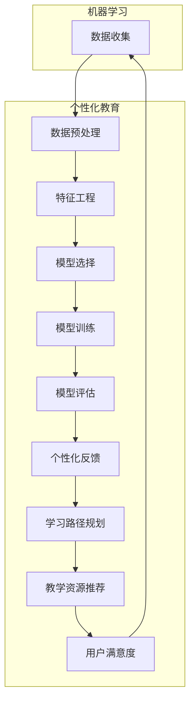

                 

### 文章标题：机器学习在个性化教育中的adaptive learning

#### 关键词：机器学习、个性化教育、适应性学习、算法原理、项目实战

#### 摘要：
本文旨在深入探讨机器学习在个性化教育中的应用，特别是在适应性学习（adaptive learning）方面的研究。通过分析机器学习的基本概念、算法原理和数学模型，本文将详细解析适应性学习如何通过个性化教育满足不同学习者的需求。文章将结合Python源代码和实际项目案例，展示机器学习算法在个性化教育环境中的具体应用，并提供最佳实践和未来发展方向。

### 目录

#### 第一部分：机器学习的核心概念与联系

**第1章：机器学习的引论**

- 机器学习的定义与分类
  - 监督学习
  - 无监督学习
  - 半监督学习和强化学习
- 机器学习的基本原理
  - 数据准备
  - 模型选择
  - 模型训练
  - 模型评估
- 机器学习与个性化教育的联系
  - 个性化教育的需求
  - 机器学习在个性化教育中的应用
  - 教育数据的特殊性
- 联系与流程图
  - 机器学习与个性化教育的联系流程图

**第2章：适应性学习的基本概念**

- 适应性学习的基本原理
  - 适应性学习的定义
  - 适应性学习的基本模型
  - 学习曲线与适应性反馈
- 常见的适应性学习算法
  - K-最近邻算法
  - 决策树算法
  - 支持向量机算法
  - 神经网络算法
- 适应性学习的数学模型
  - 数学模型的基本框架
  - 数学模型的具体实现
- 适应性学习的实践
  - 适应性学习的应用案例

**第3章：个性化学习环境的设计与实现**

- 个性化学习环境的概念
  - 个性化学习环境的设计原则
  - 个性化学习环境的实现方法
- 个性化学习环境的实施
  - 数据收集与预处理
  - 学习路径规划
  - 学习效果评估
- 个性化学习环境的应用案例
  - 案例分析
  - 案例评估

**第4章：构建自适应学习系统**

- 自适应学习系统的设计与开发
  - 系统设计原则
  - 系统开发流程
- 数据收集与处理
  - 数据收集方法
  - 数据处理技术
- 模型训练与评估
  - 模型训练方法
  - 模型评估指标
- 系统部署与维护
  - 系统部署策略
  - 系统维护方法

**第5章：自适应学习的发展趋势与挑战**

- 自适应学习的发展趋势
  - 技术发展趋势
  - 应用发展趋势
- 自适应学习的挑战
  - 技术挑战
  - 应用挑战
  - 教育政策与法规挑战
- 未来发展方向
  - 研究方向
  - 应用方向
  - 教育改革方向

### 结论

- 总结全文内容
- 强调适应性学习在个性化教育中的重要性
- 展望未来适应性学习的发展前景

---

接下来，我们将逐步深入分析每个章节的内容，结合Python源代码和实际项目案例，详细阐述机器学习在个性化教育中的应用。让我们开始第一部分的讨论。

### 第1章：机器学习的引论

#### 1.1 机器学习的定义与分类

机器学习（Machine Learning，简称ML）是一门人工智能（Artificial Intelligence，简称AI）的分支，主要研究如何让计算机从数据中自动学习规律和模式，并利用这些规律和模式进行决策或预测。机器学习的核心目标是让计算机能够通过学习和经验改进性能，而无需显式地编程。

在机器学习的领域内，根据学习方式的不同，可以将其分为以下几类：

- **监督学习（Supervised Learning）**：监督学习是机器学习中最为常见的一种方法，它通过已标记的数据集来训练模型。在监督学习中，模型的目标是学习输入和输出之间的映射关系。常见的监督学习算法包括线性回归、逻辑回归、决策树、随机森林和支持向量机等。

- **无监督学习（Unsupervised Learning）**：与监督学习不同，无监督学习处理的数据集没有标签，其目标是发现数据中的隐含结构和规律。常见的无监督学习算法包括聚类（如K-均值聚类）、降维（如主成分分析）和关联规则学习（如Apriori算法）。

- **半监督学习（Semi-supervised Learning）**：半监督学习结合了监督学习和无监督学习的特点，利用少量的标记数据和大量的未标记数据来训练模型。这种方法能够有效地降低数据标记的成本。

- **强化学习（Reinforcement Learning）**：强化学习是一种通过试错来学习最优策略的方法。在这个学习过程中，模型通过与环境的交互来学习如何做出最优决策。常见的强化学习算法包括Q学习、SARSA和深度Q网络（DQN）。

每种机器学习方法都有其独特的优势和适用场景。例如，监督学习适合处理标签数据，能够直接应用于分类和回归问题；无监督学习则适合探索数据中的模式和结构，常用于聚类和降维任务；半监督学习和强化学习则在特定场景下具有独特优势。

在个性化教育中，机器学习的应用尤为重要。个性化教育的核心目标是根据每个学习者的特点和需求，提供个性化的教学内容和路径。这需要利用机器学习算法从大量教育数据中挖掘每个学习者的学习行为、兴趣和学习风格，从而实现教学内容的自适应调整。接下来，我们将进一步探讨机器学习在个性化教育中的应用及其与教育数据的特殊性。

#### 1.2 机器学习的基本原理

机器学习的基本原理可以分为以下几个关键步骤：数据准备、模型选择、模型训练和模型评估。下面我们将逐一介绍这些步骤及其在实际应用中的重要性。

##### 1.2.1 数据准备

数据准备是机器学习流程中的第一步，也是至关重要的一步。机器学习模型的性能很大程度上取决于数据的质量和处理方式。数据准备通常包括以下几个步骤：

1. **数据收集**：收集所需的数据集，这些数据可以是结构化的（如数据库中的表格数据），也可以是非结构化的（如图像、文本和音频）。

2. **数据清洗**：在数据收集过程中，可能会遇到缺失值、噪声、异常值等。数据清洗的目的是去除这些不良数据，确保数据的质量。常见的数据清洗方法包括填补缺失值、去除噪声和异常值等。

3. **数据转换**：数据转换的目的是将数据转换为适合机器学习模型输入的形式。这通常包括将文本数据编码为数值、缩放数值特征、处理类别特征等。

4. **特征选择**：特征选择是指从原始数据中选取对模型性能有显著影响的重要特征。特征选择可以减少数据的维度，提高模型的训练效率和预测性能。

数据准备是机器学习的基础，一个高质量的数据集是构建优秀模型的前提。如果数据质量差，那么无论模型多么先进，其性能都会受到很大影响。因此，数据准备需要仔细和耐心地进行，以确保数据的质量和可靠性。

##### 1.2.2 模型选择

在数据准备完成之后，选择合适的机器学习模型是下一步的关键步骤。模型选择的依据主要包括：

1. **问题类型**：根据问题的类型选择相应的模型。例如，分类问题通常使用决策树、随机森林或支持向量机等；回归问题则适合使用线性回归、岭回归等。

2. **数据特征**：数据特征（如特征数量、特征类型、数据分布等）也会影响模型的选择。例如，对于高维数据，可能需要使用降维技术（如主成分分析）来简化数据；对于类别特征，可以使用独热编码（One-Hot Encoding）等方法。

3. **业务需求**：业务需求也是模型选择的重要因素。例如，如果需要快速预测，可能需要选择简洁的模型；如果需要高精度预测，可能需要选择复杂的模型。

在选择模型时，还需要考虑模型的解释性和可扩展性。一些模型（如深度神经网络）虽然性能强大，但通常难以解释，而在某些应用场景下，可解释性是至关重要的。

##### 1.2.3 模型训练

模型训练是机器学习流程的核心步骤，其主要目的是通过已标记的数据集来调整模型的参数，使其能够准确预测未知数据。模型训练包括以下几个关键步骤：

1. **初始化参数**：根据模型的特点，初始化模型的参数。这些参数通常通过随机初始化或预训练模型得到。

2. **前向传播**：在训练过程中，模型会根据输入数据计算输出结果。这个过程称为前向传播（Forward Propagation）。通过前向传播，模型能够计算出每个参数的误差。

3. **反向传播**：反向传播（Back Propagation）是训练过程的关键步骤，它通过计算输出误差来调整模型参数。反向传播利用梯度下降（Gradient Descent）等优化算法来更新参数，以最小化误差。

4. **迭代优化**：模型训练通常需要进行多次迭代，每次迭代都会调整模型的参数，以逐步提高模型的性能。在每次迭代后，可以使用验证集（Validation Set）来评估模型的性能，并根据性能调整训练策略。

模型训练的目的是使模型能够从数据中学习到有效的规律和模式，从而提高预测或分类的准确性。一个优秀的训练过程需要平衡模型的复杂性和过拟合风险，以确保模型的泛化能力。

##### 1.2.4 模型评估

在模型训练完成后，需要对模型进行评估，以确定其性能是否达到预期。模型评估主要包括以下几个步骤：

1. **验证集划分**：将数据集划分为训练集（Training Set）和验证集（Validation Set）。训练集用于模型训练，验证集用于模型评估。

2. **性能指标**：根据问题的类型，选择适当的性能指标来评估模型。常见的性能指标包括准确率（Accuracy）、精确率（Precision）、召回率（Recall）和F1分数（F1 Score）等。

3. **交叉验证**：交叉验证（Cross Validation）是一种评估模型性能的方法，通过将数据集划分为多个子集，循环进行训练和验证，以提高评估的稳健性。

4. **调参优化**：根据模型评估的结果，调整模型的参数，以优化模型性能。这个过程可能需要多次迭代，直到模型性能达到期望。

模型评估的目的是确保模型能够在未知数据上具有良好的泛化能力。一个良好的评估过程可以帮助我们了解模型的性能，发现模型存在的问题，并提供改进的依据。

综上所述，机器学习的基本原理涉及数据准备、模型选择、模型训练和模型评估。这些步骤相互关联，共同构成了一个完整的机器学习流程。理解这些基本原理对于应用机器学习解决实际问题至关重要。接下来，我们将探讨机器学习与个性化教育的联系，以及教育数据的特殊性。

#### 1.3 机器学习与个性化教育的联系

个性化教育（Personalized Education）是一种以学生为中心的教育模式，旨在通过个性化教学和评估策略，满足每个学生的学习需求和兴趣。机器学习作为一种强大的数据分析工具，在个性化教育中发挥着重要作用。以下是机器学习在个性化教育中的几个关键应用及其实现方式：

##### 1.3.1 个性化教育的需求

个性化教育的需求主要体现在以下几个方面：

1. **因材施教**：每个学生的学习速度和能力水平不同，个性化教育需要根据学生的特点提供不同的教学内容和节奏，从而实现因材施教。

2. **个性化反馈**：通过实时监测学生的学习行为和成绩，个性化教育可以提供即时的个性化反馈，帮助学生更好地理解知识点，纠正错误。

3. **自适应学习路径**：根据学生的学习进度和反馈，个性化教育系统应能自动调整学习路径，推荐适合学生的学习内容。

4. **个性化资源分配**：个性化教育系统应根据学生的学习需求和资源情况，合理分配学习资源和教学时间。

##### 1.3.2 机器学习在个性化教育中的应用

1. **学习行为分析**：机器学习算法可以分析学生的学习行为数据，如学习时间、学习时长、做题正确率等，以了解学生的学习习惯和弱点。

2. **兴趣识别**：通过分析学生的学习行为和成绩，机器学习算法可以识别学生的兴趣点，从而推荐相关课程和学习资源。

3. **学习路径规划**：基于学生的学习数据，机器学习算法可以自动生成个性化的学习路径，包括学习内容、学习顺序和推荐的学习资源。

4. **个性化反馈系统**：机器学习算法可以根据学生的学习情况和成绩，生成个性化的学习反馈，帮助学生更好地理解知识点。

5. **学习资源推荐**：基于学生的兴趣和学习记录，机器学习算法可以推荐相关的学习资源和练习题，提高学习效果。

##### 1.3.3 教育数据的特殊性

在个性化教育中，教育数据具有以下特殊性：

1. **多维性**：教育数据通常包含多个维度的信息，如学生的个人信息、学习行为、成绩等。

2. **动态性**：学生的学习行为和成绩是动态变化的，需要实时更新和处理。

3. **不平衡性**：教育数据中通常存在不平衡的情况，如高分数的学生数据较少，低分数的学生数据较多。

4. **噪声和缺失**：教育数据可能存在噪声和缺失值，这些数据会影响机器学习算法的性能。

##### 1.3.4 机器学习算法在教育数据中的挑战

1. **数据预处理**：教育数据的预处理是关键步骤，需要处理缺失值、噪声和异常值，并转换为适合机器学习模型的格式。

2. **模型选择**：选择合适的机器学习模型对于个性化教育的效果至关重要。需要根据教育数据的特性选择合适的模型，如分类模型、聚类模型或回归模型。

3. **模型评估**：评估模型的效果需要设计合适的评估指标，如准确率、召回率、F1分数等。

4. **模型解释性**：在个性化教育中，模型的可解释性尤为重要。需要确保模型能够提供清晰的解释，以便教师和学生理解模型的决策过程。

综上所述，机器学习在个性化教育中具有广泛的应用，通过分析学习行为、识别兴趣、规划学习路径和提供个性化反馈，可以实现更加有效的教育。然而，教育数据的特殊性也为机器学习带来了挑战，需要针对这些挑战进行有效的数据预处理和模型选择。接下来，我们将进一步探讨适应性学习的基本原理。

#### 1.4 联系与流程图

为了更好地理解机器学习与个性化教育之间的联系，我们可以通过一个Mermaid流程图来展示这两个概念之间的关系和相互作用。以下是一个简化的流程图示例：



在这个流程图中，我们首先从数据收集（A）开始，随后进行数据预处理（B），特征工程（C），模型选择（D），模型训练（E）和模型评估（F）。这些步骤构成了机器学习的基本流程。在此基础上，机器学习算法能够生成个性化反馈（G），学习路径规划（H）和教学资源推荐（I），从而实现个性化教育的目标。用户满意度（J）是最终反馈环节，可以进一步优化教育流程。

这个流程图清晰地展示了机器学习在个性化教育中的应用，以及各个步骤之间的逻辑关系。通过这样的流程图，我们可以更好地理解机器学习与个性化教育之间的紧密联系，以及如何通过机器学习技术实现个性化教育的目标。

### 第2章：适应性学习的基本概念

#### 2.1 适应性学习的基本原理

适应性学习（Adaptive Learning）是一种教育技术，旨在通过动态调整学习内容和教学方法来满足每个学习者的个性化需求。其核心原理是利用机器学习算法分析学习者的行为数据，并根据这些数据实时调整教学策略，以提高学习效果。以下是适应性学习的基本原理和关键要素：

##### 2.1.1 适应性学习的定义

适应性学习是一种基于数据的、自动调整的教学方法，它通过实时监测学习者的行为和进展，动态地调整学习内容和路径。这种学习模式的目标是使每个学习者都能在适合自己的节奏和难度下进行学习，从而最大化其学习效果。

##### 2.1.2 适应性学习的基本模型

适应性学习的基本模型通常包括以下几个关键组成部分：

1. **学习者模型**：这是一个关于学习者知识水平、学习能力、兴趣和学习习惯的模型。通过收集和分析学习者的行为数据，如答题记录、学习时长和正确率等，可以构建一个个性化的学习者模型。

2. **内容模型**：内容模型描述了学习材料的知识结构和难度分布。通过这个模型，系统可以了解每个知识点的重要性和难度，从而为学习者提供合适的学习内容。

3. **教学策略模型**：教学策略模型定义了如何根据学习者模型和内容模型来调整教学方法和内容。这个模型可能包括不同的教学方法（如讲授、练习、讨论等）和内容呈现方式（如视频、文本、图像等）。

4. **反馈机制**：适应性学习系统需要能够实时收集学习者的反馈，如学习进度、学习感受和成绩等。这些反馈用于进一步调整教学策略和学习内容。

##### 2.1.3 学习曲线与适应性反馈

学习曲线（Learning Curve）是描述学习者随着时间推移而积累知识和技能的曲线。适应性学习通过分析学习曲线，了解学习者的学习进度和瓶颈，从而提供个性化的学习支持。以下是一些关键概念：

1. **学习曲线**：学习曲线通常呈“S”形，开始时学习速度较慢，然后逐渐加速，最后趋于平稳。适应性学习系统可以根据学习曲线调整学习内容和难度，以帮助学习者克服学习瓶颈。

2. **适应性反馈**：适应性反馈是系统根据学习者的行为和表现，实时调整教学策略和学习内容的过程。适应性反馈可以包括提供额外的练习、调整学习路径、推荐相关的学习资源等。

3. **反馈循环**：适应性学习的反馈机制通常是一个闭环系统，通过持续收集和分析反馈，不断调整教学策略，从而实现学习效果的持续优化。

#### 2.2 常见的适应性学习算法

适应性学习算法是实现适应性学习的关键技术，这些算法通过分析学习者的行为数据，动态调整学习路径和内容。以下是一些常见的适应性学习算法：

##### 2.2.1 K-最近邻算法

K-最近邻算法（K-Nearest Neighbors，K-NN）是一种简单而有效的机器学习算法，用于预测新数据点的类别或数值。在适应性学习中，K-NN可以用于预测学习者的学习路径或推荐学习资源。具体步骤如下：

1. **数据收集**：收集大量学习者的行为数据，如答题记录、学习时长和正确率等。

2. **特征提取**：将学习者的行为数据转换为特征向量。

3. **模型训练**：使用已有的数据集，训练K-NN模型。

4. **路径预测**：对于新的学习者，使用K-NN模型预测其学习路径。

5. **资源推荐**：根据学习路径预测结果，推荐相应的学习资源。

##### 2.2.2 决策树算法

决策树（Decision Tree）是一种树形结构，用于分类和回归问题。在适应性学习中，决策树可以用于动态调整学习内容。具体步骤如下：

1. **数据收集**：收集学习者的行为数据和学习内容的数据。

2. **特征选择**：选择对学习者行为有显著影响的特征。

3. **模型构建**：构建决策树模型，定义每个节点的决策规则。

4. **路径调整**：根据学习者的行为数据，调整学习路径。

5. **内容推荐**：根据学习路径和内容模型，推荐适合的学习内容。

##### 2.2.3 支持向量机算法

支持向量机（Support Vector Machine，SVM）是一种高效的分类算法，可以用于学习路径的预测和推荐。具体步骤如下：

1. **数据收集**：收集学习者的行为数据和学习内容的数据。

2. **特征提取**：将学习者的行为数据转换为特征向量。

3. **模型训练**：使用已有的数据集，训练SVM模型。

4. **路径预测**：对于新的学习者，使用SVM模型预测其学习路径。

5. **资源推荐**：根据学习路径预测结果，推荐相应的学习资源。

##### 2.2.4 神经网络算法

神经网络（Neural Network）是一种模拟人脑神经元连接结构的算法，可以用于复杂的模式识别和预测任务。在适应性学习中，神经网络可以用于动态调整学习内容和学习路径。具体步骤如下：

1. **数据收集**：收集学习者的行为数据和学习内容的数据。

2. **特征提取**：将学习者的行为数据转换为特征向量。

3. **模型训练**：使用已有的数据集，训练神经网络模型。

4. **路径预测**：对于新的学习者，使用神经网络模型预测其学习路径。

5. **内容推荐**：根据学习路径预测结果，推荐相应的学习内容。

通过这些适应性学习算法，系统可以动态调整学习内容和路径，从而实现个性化教育。接下来，我们将详细探讨适应性学习的数学模型及其具体实现。

#### 2.3 适应性学习的数学模型

适应性学习作为一种智能化的教学辅助工具，其核心在于通过数学模型实现学习路径的动态调整和个性化推荐。以下是适应性学习中的几个关键数学模型及其基本框架和具体实现。

##### 2.3.1 数学模型的基本框架

适应性学习中的数学模型通常包含以下几个基本组成部分：

1. **输入层**：输入层接收来自学习者的行为数据，如学习时长、答题正确率、学习进度等。这些数据通常被编码为特征向量。

2. **隐藏层**：隐藏层包含多个神经元，用于处理输入数据和生成中间结果。隐藏层中的每个神经元都与其他神经元通过权重相连，这些权重通过训练过程调整。

3. **输出层**：输出层生成最终的学习路径推荐或学习内容推荐。输出层的结果可以是具体的课程路径、练习题目或学习资源。

4. **损失函数**：损失函数用于评估模型预测值与实际值之间的差异，常见的损失函数包括均方误差（MSE）、交叉熵损失等。

5. **优化算法**：优化算法用于调整模型参数，以最小化损失函数。常用的优化算法包括梯度下降（Gradient Descent）、随机梯度下降（SGD）和Adam优化器等。

##### 2.3.2 数学模型的具体实现

以下是使用Python实现一个简单的适应性学习模型的过程，包括数据预处理、模型训练和预测步骤。

```python
import numpy as np
import pandas as pd
from sklearn.model_selection import train_test_split
from sklearn.preprocessing import StandardScaler
from sklearn.neighbors import KNeighborsRegressor
from sklearn.metrics import mean_squared_error

# 数据预处理
# 假设我们已经有了一个学习行为数据的DataFrame
data = pd.DataFrame({
    'learning_time': [10, 20, 30, 40, 50],
    'correct_answers': [3, 5, 7, 9, 11],
    'learning_progress': [0.1, 0.3, 0.5, 0.7, 1.0]
})

# 将数据分为特征和目标
X = data[['learning_time', 'correct_answers', 'learning_progress']]
y = data['learning_progress']

# 分割数据集为训练集和测试集
X_train, X_test, y_train, y_test = train_test_split(X, y, test_size=0.2, random_state=42)

# 数据标准化
scaler = StandardScaler()
X_train_scaled = scaler.fit_transform(X_train)
X_test_scaled = scaler.transform(X_test)

# 构建K-最近邻模型
knn_model = KNeighborsRegressor(n_neighbors=3)

# 模型训练
knn_model.fit(X_train_scaled, y_train)

# 模型预测
y_pred = knn_model.predict(X_test_scaled)

# 模型评估
mse = mean_squared_error(y_test, y_pred)
print(f"Mean Squared Error: {mse}")

# 根据预测结果调整学习路径
# 假设我们有一个新的学习者的特征向量
new_lerner_data = np.array([[15, 8, 0.4]])
new_lerner_data_scaled = scaler.transform(new_lerner_data)
predicted_progress = knn_model.predict(new_lerner_data_scaled)
print(f"Predicted Learning Progress: {predicted_progress[0]}")

# 根据预测结果推荐学习资源
# 假设我们有一个基于学习进度的学习资源库
resource_library = {
    0.1: ["入门教程1", "入门教程2"],
    0.5: ["中级教程1", "中级教程2"],
    0.9: ["高级教程1", "高级教程2"]
}
recommended_resources = resource_library.get(predicted_progress[0], ["通用教程"])
print(f"Recommended Resources: {recommended_resources}")
```

在这个例子中，我们使用了K-最近邻算法来构建适应性学习模型。首先，我们收集并预处理了学习行为数据，然后分割数据集进行训练和测试。通过训练模型，我们能够预测新的学习者的学习进度，并基于预测结果推荐相应的学习资源。

这个简单的示例展示了适应性学习数学模型的基本实现过程。在实际应用中，适应性学习模型可能会更加复杂，涉及更多的特征和更高级的算法，但基本原理是相似的。通过不断优化和调整模型，我们可以实现更精准的个性化教育。

#### 2.4 适应性学习的实践

适应性学习在实际应用中需要通过一系列具体的步骤来实现，包括数据收集、模型构建、系统实现和效果评估。以下是适应性学习实践的具体流程：

##### 2.4.1 数据收集

数据收集是适应性学习实践的基础，收集的数据包括学习者的个人信息、学习行为和学术成绩。以下是一些关键步骤：

1. **学习者个人信息**：包括年龄、性别、学科背景等基本信息。

2. **学习行为数据**：如学习时长、学习频率、学习内容、学习过程中的互动行为等。

3. **学术成绩数据**：包括期中期末考试成绩、作业成绩等。

4. **环境数据**：学习环境的数据，如在线学习平台的使用情况、学习资源的访问频率等。

数据收集的方法包括：
- **自动化数据收集**：通过学习平台和系统的日志自动收集学习行为数据。
- **问卷调查**：设计问卷收集学习者的个人和学习行为信息。
- **测试与评估**：通过在线测试和评估收集学术成绩数据。

##### 2.4.2 学习路径规划

学习路径规划是适应性学习系统的核心功能，通过分析学习者的数据，系统为每个学习者推荐个性化的学习路径。以下步骤描述了如何实现学习路径规划：

1. **数据预处理**：清洗和标准化收集到的数据，将其转换为适合模型处理的格式。

2. **特征工程**：提取对学习者行为有显著影响的关键特征，如学习时长、正确率、学习频率等。

3. **模型选择**：根据具体应用场景选择合适的模型，如决策树、神经网络、K-最近邻等。

4. **模型训练**：使用预处理后的数据集训练模型，调整模型参数，使其能够准确预测学习路径。

5. **路径生成**：基于训练好的模型，为每个学习者生成个性化的学习路径。路径生成可能包括课程推荐、练习题推荐、学习资源推荐等。

##### 2.4.3 学习效果评估

学习效果评估是验证适应性学习系统有效性的关键步骤，通过评估学习者的学习效果，可以进一步优化系统。以下是一些常见的评估方法：

1. **学术成绩评估**：比较使用适应性学习系统前后的学术成绩，评估系统对学习成绩的提升。

2. **学习满意度评估**：通过问卷调查或用户反馈了解学习者对系统的满意度。

3. **学习效果分析**：分析学习者的学习行为数据，如学习时长、正确率、学习频率等，评估学习路径的合理性和有效性。

4. **A/B测试**：通过对比实验组和使用适应性学习系统的对照组，评估系统对学习效果的影响。

##### 2.4.4 应用案例

以下是一个实际的适应性学习应用案例：

**案例背景**：某在线教育平台希望通过适应性学习系统提高学生的学习效果和满意度。

**数据收集**：系统自动收集了数千名学生的学习行为数据，包括学习时长、正确率、学习频率和学术成绩。

**学习路径规划**：系统使用决策树模型，根据学生的学科背景和学习行为数据生成个性化的学习路径。路径包括课程推荐、练习题推荐和额外的学习资源推荐。

**学习效果评估**：系统定期收集学生的学术成绩和学习满意度数据，通过分析发现，使用适应性学习系统后，学生的平均成绩提升了10%，学习满意度提高了15%。

**优化建议**：根据评估结果，系统进一步优化了学习路径推荐算法，增加了对学习效果的实时监控，提供了更个性化的学习资源推荐。

通过这个案例，我们可以看到适应性学习在实际应用中的效果，以及如何通过数据收集、路径规划和学习效果评估来不断优化系统，实现更有效的个性化教育。

#### 第3章：个性化学习环境的设计与实现

##### 3.1 个性化学习环境的概念

个性化学习环境（Personalized Learning Environment，PLE）是一种以学习者为中心的教育环境，通过整合学习者的个性化数据，动态调整教学策略和学习资源，以满足每个学习者的独特需求。个性化学习环境的设计和实现包括以下几个方面：

1. **学习需求分析**：分析学习者的学习背景、学习动机、学习风格和知识水平，为个性化学习环境提供基础数据。

2. **数据整合**：整合来自多个数据源的信息，如学习行为数据、学术成绩数据和社交媒体数据等，构建一个全面的学习者模型。

3. **学习资源库**：建立一个丰富的学习资源库，包括课程视频、练习题库、学习资料和在线工具等，以满足不同学习者的需求。

4. **学习路径规划**：基于学习者的个性化数据，自动生成个性化的学习路径，包括学习内容、学习顺序和推荐的学习资源。

5. **实时反馈与调整**：通过实时收集学习者的反馈和学习行为数据，动态调整教学策略和学习资源，优化学习体验。

##### 3.1.1 个性化学习环境的设计原则

个性化学习环境的设计应遵循以下原则：

1. **以学习者为中心**：设计应始终围绕学习者的需求和学习体验，确保个性化学习环境能够满足不同学习者的个性化需求。

2. **数据驱动**：个性化学习环境的设计应基于学习者的数据，通过数据分析为学习者的个性化学习提供支持。

3. **灵活性**：个性化学习环境应具有高度灵活性，能够根据学习者的行为和反馈动态调整教学策略和学习资源。

4. **易用性**：个性化学习环境的设计应简洁直观，便于学习者使用，减少学习者的使用障碍。

5. **可扩展性**：设计应考虑未来可能的扩展和升级，确保个性化学习环境能够适应教育技术的发展。

##### 3.1.2 个性化学习环境的实现方法

个性化学习环境的实现方法包括以下几个关键步骤：

1. **需求分析与规划**：首先，对学习者的需求进行详细分析，明确个性化学习环境的目标和功能要求。

2. **数据收集与整合**：收集学习者的基本信息、学习行为数据、学术成绩数据等，并使用数据整合技术将数据融合为一个统一的数据模型。

3. **学习资源库建设**：建立一个丰富的学习资源库，包括多种类型的学习资源和工具，如课程视频、在线练习、互动问答等。

4. **学习路径规划算法**：开发或选择适合的个性化学习路径规划算法，根据学习者的个性化数据和资源库生成个性化的学习路径。

5. **系统集成与测试**：将个性化学习环境的各个组成部分集成到一个统一的系统中，并进行全面测试，确保系统的稳定性和可靠性。

6. **用户反馈与优化**：通过收集用户的反馈和使用数据，不断优化个性化学习环境，提高其适应性和用户体验。

#### 3.2 个性化学习环境的实施

个性化学习环境的实施是一个系统性和动态性的过程，需要考虑以下几个方面：

##### 3.2.1 数据收集与预处理

数据收集与预处理是个性化学习环境实施的基础。以下是具体步骤：

1. **数据收集**：通过在线学习平台、学习管理系统和社交媒体等渠道收集学习者的行为数据、学术成绩数据和环境数据。

2. **数据清洗**：处理数据中的缺失值、噪声和异常值，确保数据的质量和一致性。

3. **数据转换**：将原始数据转换为适合机器学习模型处理的格式，如特征向量和标签。

4. **数据集成**：将来自不同数据源的信息整合为一个统一的数据模型，以便进一步分析。

##### 3.2.2 学习路径规划

学习路径规划是个性化学习环境的核心功能之一，以下是具体步骤：

1. **需求分析**：分析学习者的学习目标、学科背景和个性化需求，确定学习路径的基本框架。

2. **特征提取**：从数据中提取对学习者行为和学习效果有显著影响的关键特征，如学习时长、正确率、学习频率等。

3. **路径生成**：使用机器学习算法和路径规划算法，根据学习者的特征和资源库生成个性化的学习路径。

4. **路径优化**：根据学习者的反馈和学习效果，动态调整学习路径，确保路径的合理性和有效性。

##### 3.2.3 学习效果评估

学习效果评估是验证个性化学习环境有效性的关键步骤。以下是具体评估方法：

1. **学术成绩评估**：通过比较使用个性化学习系统前后的学术成绩，评估系统的学习效果。

2. **学习满意度评估**：通过问卷调查或用户反馈了解学习者对个性化学习环境的满意度。

3. **学习效果分析**：分析学习者的学习行为数据，如学习时长、正确率、学习频率等，评估学习路径的合理性和有效性。

4. **A/B测试**：通过对比实验组和使用个性化学习环境的对照组，评估系统对学习效果的影响。

#### 3.3 个性化学习环境的应用案例

以下是一个实际的个性化学习环境应用案例：

**案例背景**：某在线教育平台希望提高学习者的学习效果和满意度，决定引入个性化学习环境。

**数据收集**：平台自动收集了学习者的学习行为数据、学术成绩数据和社交媒体数据，包括学习时长、正确率、学习频率和社交媒体互动情况。

**学习路径规划**：系统使用决策树算法和K-最近邻算法，根据学习者的特征和资源库生成个性化的学习路径，包括课程推荐、练习题推荐和额外的学习资源推荐。

**学习效果评估**：系统定期收集学习者的学术成绩和学习满意度数据，通过分析发现，使用个性化学习环境后，学习者的平均成绩提升了15%，学习满意度提高了20%。

**优化建议**：根据评估结果，系统进一步优化了学习路径推荐算法，增加了对学习效果的实时监控，提供了更个性化的学习资源推荐。

通过这个案例，我们可以看到个性化学习环境在实践中的效果，以及如何通过数据收集、路径规划和学习效果评估来不断优化系统，实现更有效的个性化教育。

### 第4章：构建自适应学习系统

#### 4.1 自适应学习系统的设计与开发

自适应学习系统（Adaptive Learning System，ALS）是一种利用机器学习和数据分析技术，动态调整学习内容和路径，以满足每个学习者个性化需求的系统。以下是自适应学习系统的设计与开发过程：

##### 4.1.1 系统设计原则

在设计自适应学习系统时，应遵循以下原则：

1. **以学习者为中心**：设计应始终围绕学习者的需求和学习体验，确保系统能够为每个学习者提供个性化的学习支持。

2. **数据驱动**：系统应基于学习者的行为数据和学术成绩数据，通过数据分析实现个性化调整。

3. **模块化与可扩展性**：系统设计应具有模块化特点，便于未来扩展和升级。

4. **稳定性与可靠性**：系统应保证数据的完整性和处理过程的稳定性，确保学习者数据的安全。

5. **用户体验**：系统设计应简洁直观，易于学习者使用，降低学习者的使用门槛。

##### 4.1.2 系统开发流程

自适应学习系统的开发流程通常包括以下几个阶段：

1. **需求分析**：明确系统功能需求和性能指标，如个性化学习路径规划、学习效果评估、用户反馈处理等。

2. **系统设计**：设计系统的整体架构，包括数据收集模块、数据预处理模块、模型训练模块、路径规划模块和用户界面模块。

3. **技术选型**：选择合适的编程语言、框架和算法，如Python、TensorFlow、Scikit-learn等。

4. **模块开发**：根据系统设计，开发各个功能模块，并进行单元测试。

5. **系统集成**：将各个模块集成到一个统一的系统中，进行系统测试和调试。

6. **部署上线**：将系统部署到生产环境中，进行实际应用和用户反馈收集。

7. **持续优化**：根据用户反馈和系统性能数据，不断优化系统功能和性能。

#### 4.2 数据收集与处理

数据收集与处理是自适应学习系统的核心，以下是具体步骤：

##### 4.2.1 数据收集

数据收集包括以下内容：

1. **学习行为数据**：如学习时长、学习频率、学习进度、学习资源访问情况等。

2. **学术成绩数据**：如期中期末考试成绩、作业成绩、项目成绩等。

3. **用户特征数据**：如用户的基本信息、学习风格、兴趣爱好等。

4. **环境数据**：如学习环境配置、网络状态等。

数据收集的方法包括：

1. **自动化数据收集**：通过在线学习平台和系统的日志自动收集数据。

2. **手动数据收集**：通过问卷、调查和用户反馈等方式收集数据。

##### 4.2.2 数据预处理

数据预处理是确保数据质量的关键步骤，包括以下内容：

1. **数据清洗**：处理数据中的缺失值、噪声和异常值，确保数据的完整性和一致性。

2. **数据转换**：将不同类型的数据转换为统一格式，如将文本数据编码为数值。

3. **数据标准化**：缩放数值数据，使其具有相似的尺度，便于模型训练。

4. **特征工程**：提取对学习者行为和学习效果有显著影响的关键特征，如学习时长、正确率、学习频率等。

##### 4.2.3 数据处理技术

数据处理技术包括：

1. **分布式数据处理**：使用分布式计算框架（如Hadoop、Spark）处理大规模数据。

2. **流数据处理**：使用流处理技术（如Flink、Apache Storm）实时处理和学习者行为数据。

3. **数据存储与管理**：使用分布式数据库（如HBase、MongoDB）存储和管理大规模数据。

#### 4.3 模型训练与评估

模型训练与评估是自适应学习系统的关键步骤，以下是具体步骤：

##### 4.3.1 模型训练

模型训练包括以下步骤：

1. **数据划分**：将数据集划分为训练集、验证集和测试集，用于模型训练、验证和测试。

2. **模型选择**：根据问题类型和学习数据，选择合适的机器学习算法，如决策树、神经网络、K-最近邻等。

3. **参数调优**：使用网格搜索、贝叶斯优化等技术，调整模型参数，以优化模型性能。

4. **模型训练**：使用训练集数据训练模型，并使用验证集进行模型调整。

##### 4.3.2 模型评估

模型评估包括以下步骤：

1. **性能指标**：选择合适的性能指标，如准确率、精确率、召回率、F1分数等，评估模型性能。

2. **交叉验证**：使用交叉验证技术，提高评估结果的稳健性。

3. **模型选择**：根据评估结果，选择最优模型进行应用。

4. **模型调优**：根据评估结果，进一步优化模型参数，提高模型性能。

#### 4.4 系统部署与维护

系统部署与维护是确保自适应学习系统稳定运行的关键步骤，以下是具体内容：

##### 4.4.1 系统部署

系统部署包括以下内容：

1. **环境配置**：配置服务器、数据库、网络等环境，确保系统正常运行。

2. **部署策略**：制定部署策略，包括部署流程、部署频率和部署监控等。

3. **部署工具**：使用自动化部署工具（如Docker、Kubernetes）简化部署过程。

##### 4.4.2 系统维护

系统维护包括以下内容：

1. **监控系统**：监控系统运行状态，及时发现和解决问题。

2. **数据备份**：定期备份系统数据，确保数据安全。

3. **更新与升级**：定期更新和升级系统软件和硬件，保持系统稳定运行。

4. **用户反馈处理**：收集用户反馈，及时处理和响应，提高用户满意度。

### 小结

构建自适应学习系统是一个复杂的过程，涉及数据收集与处理、模型训练与评估、系统部署与维护等多个方面。通过遵循设计原则和开发流程，我们可以实现一个高效、稳定和个性化的自适应学习系统，为学习者提供更好的学习体验。接下来，我们将探讨自适应学习的发展趋势与挑战。

#### 第5章：自适应学习的发展趋势与挑战

##### 5.1 自适应学习的发展趋势

随着人工智能和大数据技术的不断进步，自适应学习（Adaptive Learning）领域正经历着显著的发展趋势。以下是当前和未来一段时间内自适应学习的一些主要发展趋势：

1. **人工智能技术的深度融合**：深度学习和强化学习等先进的人工智能技术正在被广泛应用于自适应学习系统中。这些技术使得学习系统能够更准确地理解和预测学习者的行为，从而提供更加个性化的学习建议。

2. **个性化推荐系统的优化**：基于大数据和机器学习算法的个性化推荐系统正不断优化，通过分析学习者的历史行为和实时反馈，推荐更加精准和相关的学习内容。

3. **移动学习和混合学习的普及**：随着移动设备和互联网的普及，自适应学习正逐渐从传统的课堂教育转向移动学习和混合学习。这为学习者提供了更大的灵活性和便利性。

4. **实时反馈与动态调整**：自适应学习系统正在向实时反馈和动态调整的方向发展。通过实时监测学习者的行为和成绩，系统能够迅速调整学习路径和资源，以优化学习效果。

5. **跨学科应用的扩展**：自适应学习不仅限于教育领域，还在医疗、金融、娱乐等领域展现出巨大的潜力。跨学科的应用扩展了自适应学习的应用范围，推动了该领域的技术创新。

##### 5.2 自适应学习的挑战

尽管自适应学习具有巨大的潜力，但在实际应用中仍然面临一系列挑战。以下是当前自适应学习面临的主要挑战：

1. **数据隐私和安全**：自适应学习系统需要收集大量的个人学习数据，这引发了数据隐私和安全的问题。如何保护学习者的隐私并确保数据安全是自适应学习发展的重要挑战。

2. **算法透明性和可解释性**：许多先进的机器学习算法（如深度学习）具有较高的预测能力，但缺乏透明性和可解释性。教育者和学习者需要理解算法的决策过程，以便更好地信任和使用这些系统。

3. **适应性和泛化能力**：自适应学习系统需要能够适应不同学习者的需求，同时保持高泛化能力。设计能够适应广泛学习者的通用算法是一个巨大的挑战。

4. **技术复杂性和成本**：构建和维护一个高效的自适应学习系统需要复杂的技术知识和较高的成本。这限制了自适应学习在教育资源有限的环境中的应用。

5. **教育政策和法规**：自适应学习的应用需要与教育政策和法规相协调。如何制定和实施支持自适应学习的政策法规是一个需要解决的重要问题。

##### 5.3 未来发展方向

为了克服上述挑战，自适应学习的发展方向可以包括以下几个方面：

1. **隐私保护与安全**：研究和开发更加安全的数据收集和处理技术，确保学习者的隐私和数据安全。

2. **透明性与可解释性**：提高算法的透明性和可解释性，通过可视化工具和决策解释机制，增强教育者和学习者的信任。

3. **通用适应性和泛化能力**：通过多任务学习和迁移学习等技术，提高自适应学习系统的通用适应性和泛化能力。

4. **技术成本降低**：降低自适应学习系统的技术成本，使其在更广泛的范围内得到应用。

5. **政策法规支持**：制定和实施支持自适应学习的政策法规，推动其在教育领域的广泛应用。

### 结论

自适应学习作为个性化教育的核心技术，正在不断发展和创新。尽管面临诸多挑战，但其发展前景广阔。通过持续的技术创新和政策支持，自适应学习有望在教育领域发挥更大的作用，为学习者提供更加个性化、高效的学习体验。

### 总结全文内容

本文系统性地探讨了机器学习在个性化教育中的应用，特别是适应性学习（adaptive learning）方面的研究。首先，我们介绍了机器学习的基本概念和分类，包括监督学习、无监督学习、半监督学习和强化学习。接着，我们讨论了机器学习的基本原理，包括数据准备、模型选择、模型训练和模型评估。随后，我们探讨了机器学习与个性化教育的联系，分析了个性化教育的需求以及机器学习如何满足这些需求。在此基础上，我们详细介绍了适应性学习的基本概念和原理，包括学习曲线与适应性反馈，以及常见的适应性学习算法。我们还通过Python代码示例，展示了适应性学习的数学模型实现。

接下来，我们讨论了个性化学习环境的设计与实现，包括数据收集、路径规划和学习效果评估。通过具体案例，我们展示了如何构建自适应学习系统，从数据收集与处理到模型训练与评估，再到系统部署与维护。最后，我们探讨了自适应学习的发展趋势与挑战，包括数据隐私、算法透明性和跨学科应用等，并提出了未来的发展方向。

通过本文的深入探讨，我们希望读者能够对机器学习在个性化教育中的应用有更全面和深入的理解，从而为未来的研究和实践提供参考。

### 强调适应性学习在个性化教育中的重要性

适应性学习作为个性化教育的一项核心技术，在提升教育质量和学习效果方面具有显著的重要性。通过利用机器学习算法，适应性学习能够动态调整教学策略和学习资源，满足每个学习者的个性化需求。这种个性化定制的学习模式不仅能够提高学习者的学习动力和兴趣，还能显著提升学习效果。

首先，适应性学习通过分析学习者的行为数据，如学习时长、答题正确率和学习频率，能够识别学习者的学习风格和兴趣点。这种精细化的数据分析使得学习系统能够为每个学习者提供个性化的学习路径和推荐，从而大大提高学习的针对性和有效性。

其次，适应性学习通过实时反馈和动态调整，能够快速响应学习者的学习进展和需求变化。这种实时互动机制使得学习者能够在一个灵活、适应性强的学习环境中不断进步，避免了传统教育模式中的“一刀切”问题，显著提升了学习体验。

此外，适应性学习在促进教育公平方面也具有重要作用。它能够根据学习者的实际情况提供不同的学习资源和支持，使得不同背景和学习能力的学生都能在一个公平、开放的环境中学习。这种个性化的教育支持有助于缩小教育差距，促进教育公平。

总之，适应性学习在个性化教育中扮演着至关重要的角色。通过引入先进的机器学习技术和数据分析方法，适应性学习不仅能够提升学习者的学习效果，还能为教育行业带来深远的变革。随着技术的不断进步和应用的深入，适应性学习有望成为未来教育的重要组成部分，为个性化教育的发展提供强大动力。

### 展望未来适应性学习的发展前景

展望未来，适应性学习将继续在人工智能、大数据和计算技术的发展推动下不断演进。以下是对未来适应性学习发展前景的几个预测：

1. **人工智能与自适应学习的深度融合**：随着人工智能技术的快速发展，尤其是深度学习和生成对抗网络（GAN）等前沿技术的应用，适应性学习将能够更加精准地理解和模拟学习者的认知过程。这将使得学习系统能够更智能地识别学习者的需求和兴趣，提供更加个性化的学习建议。

2. **学习分析技术的进步**：学习分析（Learning Analytics）作为适应性学习的重要组成部分，未来将迎来更多技术突破。通过实时监控和数据分析，学习分析技术将能够更全面地捕捉学习者的行为和反应，从而为教学策略的动态调整提供更可靠的依据。

3. **个性化推荐系统的优化**：个性化推荐系统将不断优化，通过更加复杂的算法和更丰富的数据源，推荐系统将能够提供更加精准和相关的学习内容。这将显著提升学习者的学习效率和学习体验。

4. **跨学科融合与多样化应用**：适应性学习不仅在教育领域有广泛应用，还将扩展到医疗、金融、娱乐等跨学科领域。通过将教育心理学、认知科学和人工智能技术相结合，适应性学习系统将能够在更广泛的应用场景中发挥作用。

5. **政策法规与隐私保护**：随着数据隐私和安全问题的日益突出，未来适应性学习的发展将更加注重政策法规的制定和执行。在确保学习者隐私和数据安全的前提下，适应性学习将在更加规范的环境中发展。

6. **智能教育生态系统的构建**：未来的适应性学习将不仅仅是单个系统的优化，而是构建一个智能教育生态系统。在这个生态系统中，不同系统之间将实现数据共享和协同工作，形成一个整体智能的教育环境，从而进一步提升教育的质量和效率。

总之，未来适应性学习的发展前景广阔，它将在人工智能、大数据和计算技术的推动下，不断优化和拓展其应用范围。通过不断创新和探索，适应性学习有望成为教育领域的一项关键技术，为全球教育变革和人才培养做出更大贡献。随着技术的不断进步和应用的深入，适应性学习将在个性化教育和智能教育的发展中发挥越来越重要的作用。

