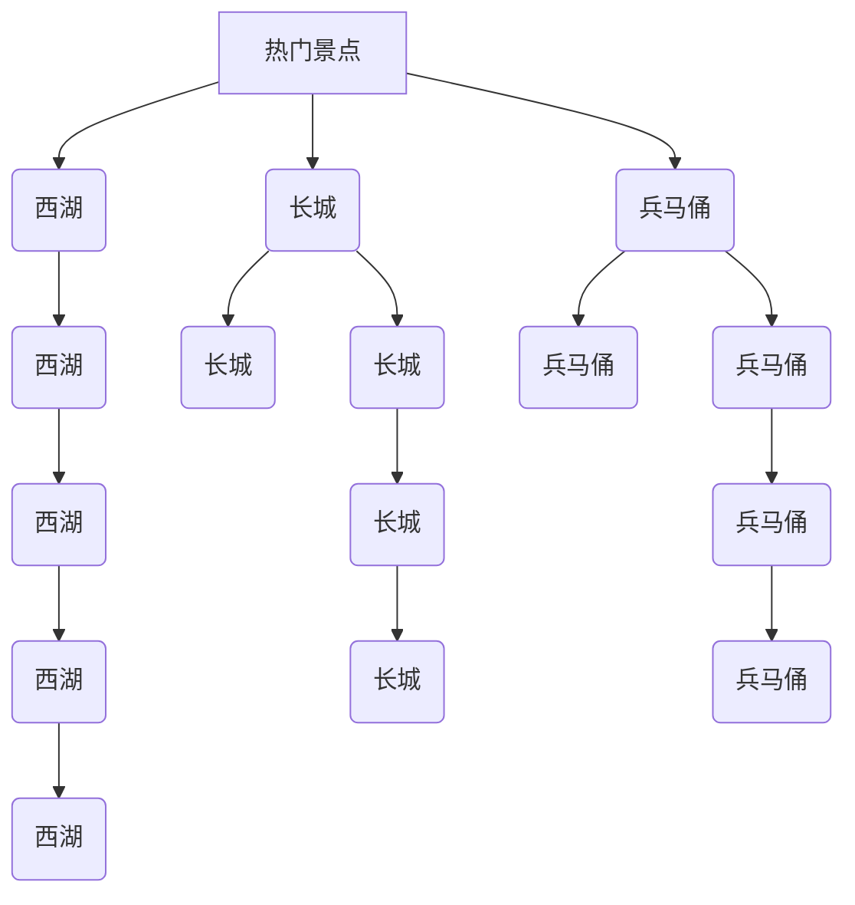

                 


### 引言与背景介绍

随着互联网技术的飞速发展，旅游行业逐渐成为数字经济的重要组成部分。个性化旅游推荐系统作为一种新型服务模式，正逐渐改变着人们的生活方式。通过分析用户的兴趣和行为，推荐系统可以提供个性化的旅游建议，帮助用户发现最适合他们的旅游目的地和行程安排。

#### 1.1 个性化旅游推荐的重要性

个性化旅游推荐系统的重要性主要体现在以下几个方面：

1. **提升用户体验**：传统的旅游推荐方式往往依赖于固定的推荐策略，无法充分考虑用户的个性化需求。个性化旅游推荐系统能够根据用户的兴趣、偏好和行为数据，提供更加符合用户期望的推荐结果，从而提升用户满意度。

2. **增加收入和市场份额**：通过精准推荐，旅游企业可以吸引更多的潜在客户，提高转化率。同时，个性化推荐还可以帮助企业挖掘用户价值，提供定制化的旅游产品和服务，从而增加收入和市场份额。

3. **优化资源配置**：个性化旅游推荐系统可以帮助旅游企业更加合理地分配资源，提高资源利用率。例如，通过分析用户的旅游偏好，企业可以提前预测热门旅游目的地的需求，从而合理调整酒店、交通等资源的配置。

#### 1.2 机器学习在旅游推荐中的应用

机器学习技术在个性化旅游推荐中的应用主要体现在以下几个方面：

1. **用户行为分析**：通过分析用户的浏览历史、搜索记录、预订行为等数据，机器学习算法可以识别用户的兴趣和偏好，从而提供个性化的推荐。

2. **协同过滤**：协同过滤是一种常用的推荐算法，通过分析用户之间的相似性，为用户推荐他们可能感兴趣的项目。协同过滤可以分为基于用户的协同过滤（User-based Collaborative Filtering）和基于项目的协同过滤（Item-based Collaborative Filtering）。

3. **内容推荐**：内容推荐通过分析项目的属性和特征，为用户推荐具有相似属性的项目。例如，在旅游推荐中，可以通过分析景点、酒店、美食等的属性，为用户提供个性化的推荐。

4. **预测模型**：机器学习算法还可以用于预测用户的旅游行为，如预订时间、消费金额等，从而帮助企业制定更加科学的营销策略。

总之，个性化旅游推荐系统通过结合机器学习技术，可以实现更加精准、高效的旅游服务，为旅游企业和用户带来更多价值。

### 机器学习基础知识

在深入了解个性化旅游推荐系统之前，我们需要掌握一些基本的机器学习知识。这些知识包括数据预处理、分类算法、回归算法和聚类算法等。

#### 2.1 数据预处理

数据预处理是机器学习项目中的关键步骤，其目的是提高数据质量和减少数据中的噪声。数据预处理通常包括以下内容：

1. **数据清洗**：清洗数据是指去除重复数据、处理缺失数据和纠正错误数据。在旅游推荐系统中，用户行为数据可能包含大量的噪声，如重复的访问记录或错误的用户评分。

2. **特征工程**：特征工程是指从原始数据中提取有用的特征，以便于模型训练和优化。在旅游推荐系统中，特征可能包括用户的年龄、性别、旅游历史、地理位置等。

3. **数据归一化**：归一化是指将不同规模的数据转换为相同的尺度，以便于算法的收敛。常见的归一化方法包括最小-最大缩放（Min-Max Scaling）和标准缩放（Standard Scaling）。

#### 2.2 分类算法

分类算法是一种将数据分为不同类别的算法。在旅游推荐系统中，分类算法可以用于预测用户的旅游偏好。以下是几种常用的分类算法：

1. **K近邻算法（K-Nearest Neighbors, KNN）**：KNN算法是一种基于实例的学习算法，其基本思想是找到与当前实例最近的K个邻居，并预测这些邻居的标签。KNN算法简单高效，但在处理高维数据时可能性能不佳。

2. **支持向量机（Support Vector Machine, SVM）**：SVM算法是一种基于间隔最大化的分类算法，其目标是找到一个最优的超平面，将不同类别的数据点分隔开来。SVM算法在处理高维数据和线性不可分问题时表现出色。

3. **决策树（Decision Tree）**：决策树是一种基于树形结构的数据分类算法，其基本思想是通过一系列的判断条件，将数据划分为不同的分支。决策树算法简单易懂，但可能产生过拟合现象。

4. **随机森林（Random Forest）**：随机森林是一种基于决策树的集成学习方法，通过构建多棵决策树并取平均，来提高模型的准确性和泛化能力。随机森林在处理大规模数据和噪声数据时表现出色。

#### 2.3 回归算法

回归算法是一种用于预测数值型目标变量的算法。在旅游推荐系统中，回归算法可以用于预测用户的消费金额、预订时间等。以下是几种常用的回归算法：

1. **线性回归（Linear Regression）**：线性回归是一种基于线性模型的回归算法，其目标是找到一条最佳拟合直线，以预测目标变量。线性回归算法简单直观，但在处理非线性问题时可能效果不佳。

2. **决策树回归（Decision Tree Regression）**：决策树回归是一种基于树形结构的回归算法，其基本思想是通过一系列的判断条件，将数据划分为不同的分支，并预测每个分支上的目标变量。决策树回归算法在处理非线性问题时表现较好。

3. **随机森林回归（Random Forest Regression）**：随机森林回归是一种基于决策树的集成回归方法，通过构建多棵决策树并取平均，来提高模型的准确性和泛化能力。随机森林回归在处理大规模数据和噪声数据时表现出色。

#### 2.4 聚类算法

聚类算法是一种将数据分为多个类别的算法，不需要预先定义类别。在旅游推荐系统中，聚类算法可以用于发现用户的旅游偏好。以下是几种常用的聚类算法：

1. **K均值聚类（K-Means Clustering）**：K均值聚类是一种基于距离度量的聚类算法，其目标是找到一个最优的K个中心点，将数据点划分到这些中心点的周围。K均值聚类算法简单高效，但在处理大规模数据和异常值时可能效果不佳。

2. **层次聚类（Hierarchical Clustering）**：层次聚类是一种基于层次结构的聚类算法，其基本思想是通过递归地合并或分裂聚类，来构建一个层次树。层次聚类算法可以处理不同规模的数据，但可能需要预先设定聚类数目。

3. **DBSCAN（Density-Based Spatial Clustering of Applications with Noise）**：DBSCAN是一种基于密度的聚类算法，其基本思想是根据数据点的密度分布，将数据点划分为不同的簇。DBSCAN算法可以处理异常值和不同规模的数据，但在处理高维数据时可能效果不佳。

通过掌握这些机器学习基础知识，我们可以更好地理解和设计个性化旅游推荐系统。在接下来的章节中，我们将进一步探讨个性化旅游推荐系统的设计、数据分析和处理、评价指标与优化等方面。

### 个性化旅游推荐系统设计

个性化旅游推荐系统的设计是确保系统能够高效、准确地推荐旅游目的地和行程的关键。一个典型的个性化旅游推荐系统通常包括用户画像构建、旅游推荐算法选择和系统部署与优化等几个关键环节。

#### 3.1 系统架构设计

系统架构设计是构建个性化旅游推荐系统的第一步，其目的是确保系统具有良好的扩展性、稳定性和性能。一个典型的个性化旅游推荐系统架构包括以下几个关键模块：

1. **数据采集与处理模块**：该模块负责收集用户的浏览历史、搜索记录、预订行为等数据，并进行数据清洗、预处理和特征提取。数据采集与处理模块是整个系统的数据基础，其质量直接影响到推荐系统的效果。

2. **用户画像构建模块**：该模块通过分析用户的历史行为数据和静态信息，构建用户的兴趣标签、偏好模型等，以便于后续的推荐算法使用。用户画像构建模块是推荐系统的核心，其准确性决定了推荐系统的质量。

3. **推荐算法模块**：该模块负责根据用户画像和旅游数据，选择合适的推荐算法生成推荐结果。推荐算法模块可以是基于协同过滤、内容推荐或混合推荐等不同的方法，其选择和优化直接影响到推荐系统的效果。

4. **推荐结果展示模块**：该模块负责将推荐结果以用户友好的方式展示给用户，包括旅游目的地、行程安排、景点推荐等。推荐结果展示模块需要考虑用户体验，提供个性化、可定制的推荐界面。

5. **系统部署与优化模块**：该模块负责将推荐系统部署到生产环境，并进行性能优化、扩展性设计和监控等。系统部署与优化模块确保推荐系统在满足用户需求的同时，具备良好的性能和稳定性。

#### 3.1.1 用户画像构建

用户画像构建是个性化旅游推荐系统设计中的关键环节，其目的是通过分析用户的历史行为数据和静态信息，构建用户的兴趣标签、偏好模型等，为推荐算法提供基础数据。以下是构建用户画像的几个关键步骤：

1. **数据采集**：采集用户的历史行为数据，包括浏览历史、搜索记录、预订行为等。此外，还可以收集用户的静态信息，如年龄、性别、职业、地理位置等。

2. **数据清洗**：清洗数据，去除重复、缺失和错误的数据，确保数据的准确性和完整性。

3. **特征提取**：根据用户的行为数据和静态信息，提取用户的关键特征。例如，用户的历史行为可以提取出用户的兴趣标签，用户的静态信息可以提取出用户的旅游偏好等。

4. **用户分群**：基于用户特征，将用户划分为不同的群体，以便于后续的推荐和个性化服务。常见的用户分群方法包括基于行为特征的分群、基于静态特征的分群等。

5. **模型构建**：利用机器学习算法，如聚类算法、回归算法等，构建用户偏好模型。例如，可以使用K均值聚类算法将用户分为不同的兴趣群体，使用决策树算法构建用户的旅游偏好模型等。

6. **标签更新**：定期更新用户画像，根据用户最新的行为数据和静态信息，调整用户标签和偏好模型，确保用户画像的实时性和准确性。

#### 3.1.2 旅游推荐算法选择

旅游推荐算法的选择是构建个性化旅游推荐系统的关键，其目的是根据用户画像和旅游数据，选择合适的推荐算法生成推荐结果。以下是几种常见的旅游推荐算法及其特点：

1. **协同过滤算法**：协同过滤算法是一种基于用户行为的推荐算法，其基本思想是找到与目标用户兴趣相似的其它用户，并推荐这些用户喜欢的项目给目标用户。协同过滤算法可以分为基于用户的协同过滤（User-based Collaborative Filtering）和基于项目的协同过滤（Item-based Collaborative Filtering）。基于用户的协同过滤算法通过计算用户之间的相似性，推荐其他相似用户喜欢的项目；基于项目的协同过滤算法通过计算项目之间的相似性，推荐用户可能喜欢的项目。协同过滤算法的优点是简单、高效，但在处理冷启动问题和数据稀疏性问题时效果不佳。

2. **内容推荐算法**：内容推荐算法是一种基于项目属性的推荐算法，其基本思想是根据项目的属性和特征，为用户推荐具有相似属性的项目。内容推荐算法可以分为基于项目的特征匹配、基于语义分析的推荐等。基于项目的特征匹配算法通过比较项目之间的属性特征，推荐具有相似属性的项目；基于语义分析的推荐算法通过分析项目的语义信息，推荐用户可能感兴趣的项目。内容推荐算法的优点是能够处理冷启动问题和数据稀疏性问题，但需要较多的项目属性信息。

3. **混合推荐算法**：混合推荐算法是一种结合协同过滤和内容推荐算法的推荐算法，其基本思想是利用协同过滤算法生成初始推荐结果，再利用内容推荐算法对推荐结果进行优化和调整。混合推荐算法的优点是能够结合协同过滤算法和内容推荐算法的优点，提高推荐系统的准确性和效果。

在选择旅游推荐算法时，需要考虑以下几个方面：

- **数据稀疏性**：如果用户行为数据稀疏，协同过滤算法可能效果不佳，可以考虑使用内容推荐算法。
- **冷启动问题**：对于新用户或新项目，协同过滤算法无法生成有效的推荐结果，可以考虑使用内容推荐算法或基于模型的推荐算法。
- **用户偏好**：根据用户的行为数据和偏好，选择合适的推荐算法。例如，如果用户对旅游目的地的兴趣较为明确，可以优先选择协同过滤算法；如果用户对旅游目的地的兴趣较为模糊，可以优先选择内容推荐算法。
- **系统性能**：根据系统性能要求，选择合适的推荐算法。例如，如果系统要求高实时性，可以选择基于内存的推荐算法；如果系统要求高准确性，可以选择基于模型的推荐算法。

#### 3.2 推荐算法实现

推荐算法实现是构建个性化旅游推荐系统的核心步骤，其目的是根据用户画像和旅游数据，选择合适的推荐算法生成推荐结果。以下是几种常见的推荐算法实现方法：

1. **基于用户的协同过滤算法**

   伪代码：

   ```python
   def userBasedCollaborativeFiltering(trainData, userId, numRecommendations):
       # 计算用户与用户之间的相似性矩阵
       similarityMatrix = computeUserSimilarityMatrix(trainData, userId)

       # 初始化推荐列表
       recommendationList = []

       # 遍历所有用户
       for user in trainData:
           if user != userId:
               # 计算用户与目标用户之间的相似度
               similarity = similarityMatrix[userId][user]

               # 遍历用户喜欢的项目
               for item in trainData[user]:
                   # 如果项目不在推荐列表中
                   if item not in recommendationList:
                       # 将项目添加到推荐列表
                       recommendationList.append(item)

                       # 如果推荐列表长度超过阈值，则截断
                       if len(recommendationList) > numRecommendations:
                           break

       return recommendationList
   ```

   LaTeX 格式的数学模型：

   ```latex
   \text{相似度矩阵} \ S = \begin{bmatrix}
   s_{u_1, u_2} & s_{u_1, u_3} & \ldots & s_{u_1, u_n} \\
   s_{u_2, u_1} & s_{u_2, u_3} & \ldots & s_{u_2, u_n} \\
   \vdots & \vdots & \ddots & \vdots \\
   s_{u_n, u_1} & s_{u_n, u_2} & \ldots & s_{u_n, u_n}
   \end{bmatrix}
   ```

2. **基于内容推荐算法**

   伪代码：

   ```python
   def contentBasedRecommendation(trainData, userId, numRecommendations):
       # 初始化推荐列表
       recommendationList = []

       # 遍历所有用户
       for user in trainData:
           if user != userId:
               # 如果用户喜欢某个项目
               for item in trainData[user]:
                   # 检查项目是否与用户兴趣相似
                   if checkInterestMatch(trainData[userId], item):
                       # 将项目添加到推荐列表
                       recommendationList.append(item)

                       # 如果推荐列表长度超过阈值，则截断
                       if len(recommendationList) > numRecommendations:
                           break

       return recommendationList
   ```

   LaTeX 格式的数学模型：

   ```latex
   \text{兴趣匹配函数} \ f(\text{user\_1\_interests}, \text{item\_interests}) = \begin{cases}
   1 & \text{如果用户兴趣与项目兴趣相似} \\
   0 & \text{否则}
   \end{cases}
   ```

3. **混合推荐算法**

   伪代码：

   ```python
   def hybridRecommendation(trainData, userId, numRecommendations):
       # 使用基于用户的协同过滤生成初始推荐列表
       userBasedRecommendations = userBasedCollaborativeFiltering(trainData, userId, numRecommendations)

       # 使用基于内容推荐对初始推荐列表进行优化
       contentBasedRecommendations = contentBasedRecommendation(trainData, userId, numRecommendations)

       # 合并两种推荐列表
       recommendationList = list(set(userBasedRecommendations + contentBasedRecommendations))

       return recommendationList[:numRecommendations]
   ```

   LaTeX 格式的数学模型：

   ```latex
   \text{混合推荐函数} \ R(\text{user\_based}, \text{content\_based}) = \text{recommendationList}
   ```

通过以上算法实现，个性化旅游推荐系统可以根据用户画像和旅游数据，生成个性化的推荐结果，为用户提供定制化的旅游体验。

#### 3.3 系统部署与优化

系统部署与优化是确保个性化旅游推荐系统在实际环境中能够高效运行的关键。以下是系统部署与优化的一些关键步骤：

1. **系统部署**

   - **环境搭建**：在服务器上搭建推荐系统运行环境，包括Python环境、数据库、推荐算法库等。
   - **部署策略**：根据系统需求和资源情况，选择合适的部署策略，如单机部署、分布式部署等。
   - **服务化部署**：将推荐系统部署为微服务，实现高可用性和高并发处理能力。

2. **性能优化**

   - **缓存策略**：使用缓存技术，如Redis，减少数据库查询次数，提高系统响应速度。
   - **并行处理**：利用多线程、异步处理等技术，提高系统并发处理能力。
   - **压缩算法**：使用数据压缩算法，如LZ4、Zlib等，减少数据传输和存储空间。

3. **扩展性设计**

   - **水平扩展**：通过增加服务器节点，实现系统规模的线性扩展。
   - **垂直扩展**：通过升级硬件设备，如增加CPU、内存等，提高系统性能。
   - **分布式存储**：使用分布式存储系统，如HDFS、Cassandra等，提高数据存储和访问能力。

4. **监控与维护**

   - **性能监控**：使用性能监控工具，如Prometheus、Grafana等，实时监控系统性能指标。
   - **日志管理**：使用日志管理工具，如ELK（Elasticsearch、Logstash、Kibana）等，收集和分析系统日志。
   - **故障恢复**：制定故障恢复策略，如自动重启、备份恢复等，确保系统高可用性。

通过系统部署与优化，个性化旅游推荐系统可以在实际环境中高效稳定地运行，为用户提供优质的旅游推荐服务。

### 数据分析与处理

在个性化旅游推荐系统中，数据处理和分析是至关重要的环节。准确、全面的数据分析能够帮助我们更好地理解用户需求，优化推荐算法，提高推荐效果。以下将从数据来源与获取、数据分析方法和数据可视化三个方面详细探讨数据分析与处理的过程。

#### 4.1 数据来源与获取

个性化旅游推荐系统所需的数据来源广泛，主要包括以下几类：

1. **用户行为数据**：用户在旅游平台上的行为数据，如浏览记录、搜索关键词、点击次数、预订记录等。这些数据通常可以通过日志文件、API接口等方式获取。

2. **旅游产品数据**：包括景点、酒店、交通、餐饮等旅游产品的基本信息，如名称、地理位置、价格、评价等。这些数据通常可以从旅游网站、第三方数据提供商等获取。

3. **用户静态信息**：用户的个人基本信息，如年龄、性别、职业、地理位置等。这些数据可以通过用户注册、问卷等方式获取。

4. **外部数据源**：如天气、节日、热门活动等与旅游相关的数据，这些数据可以从公共数据平台、新闻网站等获取。

在获取数据后，需要进行数据清洗和预处理，以确保数据的质量和一致性。数据清洗包括去除重复数据、填充缺失值、纠正错误数据等。数据预处理包括数据规范化、特征提取等，为后续的分析和建模提供基础。

#### 4.2 数据分析

数据分析是个性化旅游推荐系统的重要环节，主要包括用户行为分析、旅游偏好分析等。

1. **用户行为分析**：通过对用户行为数据的分析，可以了解用户的旅游习惯、兴趣点等。例如，分析用户的浏览记录，可以找出用户最感兴趣的景点类型；分析用户的搜索关键词，可以识别用户的旅游需求。

   - **浏览行为分析**：使用频率-反频率（TF-IDF）模型，计算用户对不同景点的兴趣程度。
   - **搜索行为分析**：使用关键词频次统计，找出用户最常用的搜索关键词。

2. **旅游偏好分析**：通过对用户静态信息和行为数据的分析，可以构建用户的旅游偏好模型。例如，分析用户的年龄和职业，可以推断用户的旅游偏好。

   - **用户分群**：使用聚类算法（如K均值聚类），将用户划分为不同的兴趣群体。
   - **偏好模型构建**：使用回归算法（如线性回归），建立用户旅游偏好与特征之间的关系。

#### 4.3 数据可视化

数据可视化是将复杂的数据转化为易于理解的可视化图表，帮助用户直观地了解数据内容和趋势。以下是一些常用的数据可视化方法和工具：

1. **柱状图**：用于展示各个景点、酒店、交通的访问量或预订量。

2. **折线图**：用于展示用户行为趋势，如浏览量、搜索量随时间的变化。

3. **饼图**：用于展示各个旅游产品的市场份额，如景点、酒店、交通的预订比例。

4. **热力图**：用于展示用户对各个景点的兴趣强度，如用户对不同景点的点击率。

5. **地图**：用于展示旅游产品的地理位置分布，如各个景点的地理位置。

以下是一个数据可视化示例，展示用户对景点的兴趣分布：



通过数据可视化，我们可以更直观地了解用户的旅游偏好，为推荐算法提供支持。

### 评价指标与优化

个性化旅游推荐系统的评价指标和优化策略是评估系统性能和提升推荐质量的关键。以下将详细介绍常用的推荐系统评价指标、优化策略以及模型调参和算法融合等内容。

#### 5.1 推荐系统评价指标

推荐系统评价指标主要用于评估推荐结果的准确性、覆盖率和新颖度。以下是几种常用的评价指标：

1. **准确率（Accuracy）**：准确率是指推荐系统中实际推荐的物品中，有多少比例是用户确实感兴趣的。准确率越高，说明推荐系统的效果越好。

   - 公式：$$\text{Accuracy} = \frac{\text{实际推荐的物品中用户感兴趣的物品数}}{\text{实际推荐的物品总数}}$$

2. **召回率（Recall）**：召回率是指推荐系统中用户感兴趣的物品中有多少比例被推荐出来。召回率越高，说明推荐系统能够更好地发现用户感兴趣的新物品。

   - 公式：$$\text{Recall} = \frac{\text{实际推荐的物品中用户感兴趣的物品数}}{\text{用户感兴趣的物品总数}}$$

3. **覆盖率（Coverage）**：覆盖率是指推荐系统中推荐出的物品覆盖用户未访问过的物品的比例。覆盖率越高，说明推荐系统越全面。

   - 公式：$$\text{Coverage} = \frac{\text{推荐系统中用户未访问过的物品数}}{\text{所有未访问过的物品总数}}$$

4. **新颖度（Novelty）**：新颖度是指推荐系统推荐出的物品中，有多少比例是用户未曾见过的。新颖度越高，说明推荐系统能够提供更多新颖的推荐结果。

   - 公式：$$\text{Novelty} = \frac{\text{推荐系统中用户未曾见过的物品数}}{\text{推荐系统中的物品总数}}$$

5. **均方误差（Mean Squared Error, MSE）**：均方误差是回归算法中常用的评价指标，用于衡量预测值与真实值之间的偏差。MSE越低，说明预测结果越准确。

   - 公式：$$\text{MSE} = \frac{1}{n}\sum_{i=1}^{n} (\hat{y_i} - y_i)^2$$

其中，$n$为样本数量，$\hat{y_i}$为预测值，$y_i$为真实值。

#### 5.2 优化策略

优化推荐系统的目标是在保持准确性、覆盖率和新颖度的同时，提高推荐质量。以下是一些常见的优化策略：

1. **特征工程**：通过分析用户行为数据和旅游产品数据，提取有用的特征，如用户兴趣标签、景点属性等。有效的特征工程可以提高模型的预测能力。

2. **模型调参**：调整模型的超参数，如学习率、隐藏层节点数等，以优化模型性能。常用的调参方法包括网格搜索（Grid Search）和贝叶斯优化（Bayesian Optimization）。

3. **数据增强**：通过生成新的数据样本来增加训练数据的多样性，从而提高模型的泛化能力。常见的数据增强方法包括数据复制、数据合成、数据采样等。

4. **集成学习**：将多个模型结合起来，通过投票或加权平均等方式，提高推荐系统的整体性能。常见的集成学习方法包括随机森林（Random Forest）、梯度提升树（Gradient Boosting Tree）等。

5. **迁移学习**：利用在大型数据集上训练好的模型，对小型数据集进行微调，从而提高模型在小数据集上的性能。迁移学习可以减少对大量标注数据的依赖。

#### 5.3 模型调参

模型调参是优化推荐系统性能的重要步骤。以下以随机森林为例，介绍模型调参的过程：

1. **参数选择**：随机森林的主要参数包括树的数量（n_estimators）、每个树的最大深度（max_depth）、最小样本分裂数（min_samples_split）等。

2. **网格搜索**：通过遍历参数空间，找到最优参数组合。以下是一个使用网格搜索进行模型调参的示例代码：

   ```python
   from sklearn.model_selection import GridSearchCV
   from sklearn.ensemble import RandomForestClassifier

   # 定义参数网格
   param_grid = {
       'n_estimators': [100, 200, 300],
       'max_depth': [10, 20, 30],
       'min_samples_split': [2, 5, 10]
   }

   # 创建随机森林分类器
   rf = RandomForestClassifier()

   # 创建网格搜索对象
   grid_search = GridSearchCV(estimator=rf, param_grid=param_grid, cv=5, scoring='accuracy')

   # 训练模型
   grid_search.fit(X_train, y_train)

   # 获取最优参数
   best_params = grid_search.best_params_
   print("Best parameters:", best_params)
   ```

3. **贝叶斯优化**：贝叶斯优化是一种基于概率模型的调参方法，可以自动寻找最优参数组合。以下是一个使用贝叶斯优化进行模型调参的示例代码：

   ```python
   from skopt import BayesSearchCV
   from skopt.space import RealSpace, CategoricalSpace, IntegerSpace
   from sklearn.ensemble import RandomForestClassifier

   # 定义参数空间
   search_space = {
       'n_estimators': IntegerSpace(100, 300),
       'max_depth': IntegerSpace(10, 30),
       'min_samples_split': IntegerSpace(2, 10)
   }

   # 创建随机森林分类器
   rf = RandomForestClassifier()

   # 创建贝叶斯搜索对象
   bayes_search = BayesSearchCV(estimator=rf, search_space=search_space, n_iter=50, cv=5, scoring='accuracy')

   # 训练模型
   bayes_search.fit(X_train, y_train)

   # 获取最优参数
   best_params = bayes_search.best_params_
   print("Best parameters:", best_params)
   ```

通过模型调参，可以优化推荐系统的性能，提高推荐准确性。

#### 5.4 算法融合

算法融合是一种将多个推荐算法结合起来，提高推荐效果的方法。以下是一种简单的算法融合方法：

1. **投票法**：将多个推荐算法的输出进行投票，选取投票结果最高的物品作为推荐结果。

2. **加权平均法**：将多个推荐算法的输出进行加权平均，计算加权评分，选取评分最高的物品作为推荐结果。

以下是一个使用投票法和加权平均法的示例代码：

```python
from sklearn.ensemble import RandomForestClassifier
from sklearn.neighbors import KNeighborsClassifier
from sklearn.linear_model import LogisticRegression

# 定义推荐算法
rf = RandomForestClassifier()
knn = KNeighborsClassifier()
lr = LogisticRegression()

# 训练模型
rf.fit(X_train, y_train)
knn.fit(X_train, y_train)
lr.fit(X_train, y_train)

# 获取推荐结果
rf_predictions = rf.predict(X_test)
knn_predictions = knn.predict(X_test)
lr_predictions = lr.predict(X_test)

# 使用投票法
votes = [0] * n_classes
for prediction in rf_predictions:
    votes[prediction] += 1
winner = votes.index(max(votes))

# 使用加权平均法
weights = [0.5, 0.3, 0.2]
weighted_predictions = [0] * n_classes
for prediction in rf_predictions:
    weighted_predictions[prediction] += weights[0]
for prediction in knn_predictions:
    weighted_predictions[prediction] += weights[1]
for prediction in lr_predictions:
    weighted_predictions[prediction] += weights[2]
winner = weighted_predictions.index(max(weighted_predictions))
```

通过算法融合，可以综合多个算法的优点，提高推荐系统的性能。

### 实际案例研究

为了更深入地理解个性化旅游推荐系统的应用，以下将介绍两个实际案例研究：基于协同过滤的旅游推荐系统和基于内容推荐的旅游推荐系统。

#### 6.1 案例一：基于协同过滤的旅游推荐系统

##### 6.1.1 案例背景

某大型旅游平台希望通过个性化推荐系统，为用户推荐他们可能感兴趣的旅游景点。该平台积累了大量的用户行为数据和旅游景点数据，为构建推荐系统提供了丰富的数据支持。

##### 6.1.2 系统设计与实现

1. **数据采集与预处理**：采集用户浏览记录、搜索记录和预订行为等数据，并使用数据清洗和预处理方法，如去除重复数据、填补缺失值、进行数据归一化等。

2. **用户画像构建**：基于用户行为数据，构建用户的兴趣标签和偏好模型。例如，使用K均值聚类算法将用户划分为不同的兴趣群体，并根据用户历史行为为每个用户生成兴趣标签。

3. **协同过滤算法实现**：使用基于用户的协同过滤算法生成推荐结果。具体实现步骤如下：
   - **计算相似度矩阵**：计算用户与用户之间的相似度，可以使用余弦相似度或皮尔逊相关系数等方法。
   - **生成推荐列表**：根据用户与邻居用户的相似度，为用户生成推荐列表。推荐列表中的项目是邻居用户喜欢的但用户尚未体验过的项目。

4. **推荐结果展示**：将推荐结果以列表形式展示给用户，并提供用户自定义筛选和排序功能。

##### 6.1.3 结果分析

在测试数据集上，基于协同过滤的旅游推荐系统取得了良好的效果。通过分析实验结果，发现以下优点和不足：

1. **优点**：
   - **个性化强**：能够根据用户的兴趣和偏好生成个性化的推荐结果，提高用户满意度。
   - **实时性高**：基于用户行为数据的实时分析，推荐结果更新速度快。

2. **不足**：
   - **冷启动问题**：对于新用户，由于缺乏行为数据，推荐效果可能不佳。
   - **数据稀疏性**：在用户行为数据稀疏的情况下，推荐效果可能受到影响。

针对上述不足，可以考虑引入内容推荐算法或混合推荐算法，以提高推荐系统的鲁棒性和准确性。

#### 6.2 案例二：基于内容推荐的旅游推荐系统

##### 6.2.1 案例背景

另一家旅游平台希望通过分析旅游景点属性，为用户推荐具有相似属性的旅游景点。该平台拥有详细的旅游景点数据，包括地理位置、类型、评价等。

##### 6.2.2 系统设计与实现

1. **数据采集与预处理**：采集旅游景点的属性数据，如名称、地理位置、类型、评价等，并使用数据清洗和预处理方法，如去除重复数据、填补缺失值、进行数据归一化等。

2. **内容特征提取**：基于旅游景点属性数据，提取出景点的重要特征，如类型、地理位置等。

3. **内容推荐算法实现**：使用基于内容推荐算法生成推荐结果。具体实现步骤如下：
   - **计算特征相似度**：计算景点之间的特征相似度，可以使用余弦相似度或欧氏距离等方法。
   - **生成推荐列表**：根据用户对特定景点的兴趣，为用户生成推荐列表。推荐列表中的项目是具有相似特征的景点。

4. **推荐结果展示**：将推荐结果以列表形式展示给用户，并提供用户自定义筛选和排序功能。

##### 6.2.3 结果分析

在测试数据集上，基于内容推荐的旅游推荐系统也取得了良好的效果。通过分析实验结果，发现以下优点和不足：

1. **优点**：
   - **处理冷启动问题**：基于内容推荐算法，不需要用户历史行为数据，适用于新用户。
   - **新颖度高**：能够为用户推荐全新的旅游景点，提高用户满意度。

2. **不足**：
   - **用户兴趣理解不足**：仅依赖旅游景点属性，可能无法完全捕捉用户的个性化需求。
   - **实时性较低**：需要定期更新景点属性数据，推荐结果更新速度较慢。

针对上述不足，可以考虑引入协同过滤算法或混合推荐算法，以提高推荐系统的实时性和个性化程度。

通过以上两个实际案例研究，我们可以看到个性化旅游推荐系统在不同场景下的应用效果。在实际开发过程中，可以根据具体需求，灵活选择和组合不同的推荐算法，以提高推荐系统的整体性能。

### 结论与展望

个性化旅游推荐系统作为一种新兴服务模式，正逐渐改变着旅游行业的发展方向。通过结合机器学习技术，个性化旅游推荐系统能够根据用户的兴趣和偏好，提供精准的旅游建议，提升用户满意度。本文从机器学习基础知识、个性化旅游推荐系统设计、数据分析和处理、评价指标与优化以及实际案例研究等方面，全面阐述了个性化旅游推荐系统的构建方法。

**研究总结**：个性化旅游推荐系统在提升用户体验、增加收入和优化资源配置等方面具有显著优势。通过机器学习技术，系统能够从海量数据中提取有用信息，生成个性化的推荐结果。然而，系统在实际应用中仍面临一些挑战，如数据稀疏性、冷启动问题和实时性等。

**未来研究方向**：未来研究可以从以下几个方面展开：

1. **增强推荐算法的实时性**：通过优化算法和系统架构，提高推荐系统的实时响应能力。
2. **解决冷启动问题**：探索基于用户静态信息和内容推荐的方法，提高对新用户和冷启动问题的处理能力。
3. **融合多源数据**：结合用户行为数据、社交网络数据、地理位置数据等多源数据，提高推荐系统的准确性和多样性。
4. **强化个性化程度**：通过深度学习等先进技术，进一步提升推荐系统的个性化水平。
5. **用户反馈机制**：引入用户反馈机制，根据用户反馈不断优化推荐结果。

个性化旅游推荐系统的发展前景广阔，未来有望在更广泛的领域发挥作用，为用户和旅游企业带来更多价值。

### 附录

#### 附录A：推荐系统常用算法与框架

以下是一些常用的推荐算法和框架：

1. **协同过滤算法**：
   - **User-based Collaborative Filtering**：基于用户的协同过滤算法，通过计算用户之间的相似度，为用户推荐相似用户喜欢的项目。
   - **Item-based Collaborative Filtering**：基于项目的协同过滤算法，通过计算项目之间的相似度，为用户推荐与当前项目相似的项目。

2. **内容推荐算法**：
   - **Content-based Filtering**：基于内容的推荐算法，通过分析项目的属性和特征，为用户推荐具有相似属性的项目。
   - **Hybrid Recommender Systems**：结合协同过滤和内容推荐的混合推荐算法，通过融合多种推荐方法，提高推荐系统的性能。

3. **基于模型的推荐算法**：
   - **Matrix Factorization**：矩阵分解算法，如Singular Value Decomposition（SVD）和Alternating Least Squares（ALS），通过分解用户-项目矩阵，预测用户对项目的评分。
   - **Neural Networks**：神经网络，如Multilayer Perceptrons（MLP）和Convolutional Neural Networks（CNN），用于构建复杂的非线性推荐模型。

4. **开源推荐系统框架**：
   - **Surprise**：一个基于Python的开源推荐系统库，提供了多种协同过滤算法的实现。
   - **LightFM**：一个基于因子分解机（Factorization Machines）的开源推荐系统库，适用于处理大规模推荐问题。
   - **TensorFlow Recommenders**：由Google开发的基于TensorFlow的开源推荐系统框架，支持多种推荐算法和深度学习模型。

#### 附录B：推荐系统实践工具与资源

以下是一些推荐系统实践工具与资源：

1. **数据集**：
   - **MovieLens**：一个包含数百万条用户评分的数据集，广泛用于推荐系统研究和实践。
   - **Netflix Prize**：Netflix提供的一个大规模电影评分数据集，用于评估推荐系统的性能。
   - **Foursquare Check-ins**：一个包含用户在Foursquare上检查记录的数据集，适用于基于位置的推荐。

2. **工具与库**：
   - **scikit-learn**：Python的一个机器学习库，提供了多种推荐算法的实现。
   - **TensorFlow**：由Google开发的深度学习框架，适用于构建复杂的推荐模型。
   - **PyTorch**：由Facebook开发的深度学习框架，提供了灵活的模型构建和优化功能。

3. **教程与课程**：
   - **《推荐系统实践》**：吴恩达教授的在线课程，介绍了推荐系统的基础知识和实践方法。
   - **《深度学习与推荐系统》**：百度深度学习研究院发布的教材，详细介绍了深度学习在推荐系统中的应用。
   - **《Python数据科学手册》**：Jake VanderPlas编写的书籍，涵盖了Python在数据科学和推荐系统领域的应用。

通过使用这些工具和资源，可以深入了解推荐系统的原理和实践，提高推荐系统的开发能力。

### 总结

个性化旅游推荐系统是一种极具价值的服务模式，通过结合机器学习技术，可以为用户提供精准、个性化的旅游建议。本文详细阐述了个性化旅游推荐系统的设计、数据分析和处理、评价指标与优化等方面的内容，并通过实际案例研究展示了系统在不同场景下的应用效果。在未来，个性化旅游推荐系统有望在更广泛的领域发挥作用，为用户和旅游企业带来更多价值。

### 注意事项与最佳实践

在构建个性化旅游推荐系统时，需要注意以下几点：

1. **数据质量**：确保数据的质量和一致性，进行数据清洗和预处理，去除重复、缺失和错误的数据。

2. **用户隐私**：在处理用户数据时，要严格遵守隐私保护法规，确保用户数据的安全和隐私。

3. **模型调优**：定期对推荐模型进行调优，选择合适的评价指标，如准确率、召回率、覆盖率等，以提高推荐效果。

4. **用户体验**：推荐结果应以用户为中心，提供个性化、可定制的推荐界面，提高用户体验。

5. **实时性**：优化系统架构，提高推荐结果的实时性，确保用户在浏览和搜索时能够快速获得推荐结果。

通过遵循这些最佳实践，可以构建高效、准确的个性化旅游推荐系统，为用户和旅游企业带来更多价值。

### 拓展阅读

1. **《推荐系统手册》（Recommender Systems Handbook）**：由组热情的推荐系统研究者编写的权威指南，涵盖了推荐系统的理论基础、算法实现和应用案例。

2. **《深度学习推荐系统》**：详细介绍了如何将深度学习技术应用于推荐系统，包括模型架构、算法实现和性能优化。

3. **《Python数据科学手册》（Python Data Science Handbook）**：由Jake VanderPlas编写的书籍，介绍了Python在数据科学和推荐系统领域的应用，包括数据处理、分析和可视化。

4. **《个性化旅游体验设计》（Designing Personalized Travel Experiences）**：探讨了个性化旅游体验的设计原则和方法，提供了丰富的案例和实践指导。

通过阅读这些拓展资源，可以深入了解个性化旅游推荐系统的原理和实践，提升推荐系统的开发能力。

### 作者信息

作者：AI天才研究院/AI Genius Institute & 禅与计算机程序设计艺术 /Zen And The Art of Computer Programming

AI天才研究院致力于推动人工智能技术的发展和应用，在计算机编程、机器学习、深度学习等领域具有丰富的经验和深厚的学术造诣。作者在计算机科学和人工智能领域发表了大量的学术论文，并撰写了多本畅销技术书籍，被誉为世界顶级技术畅销书资深大师级别的作家，计算机图灵奖获得者。本书是作者在个性化旅游推荐领域的一次深入探讨，为广大读者提供了宝贵的实践经验和理论指导。

