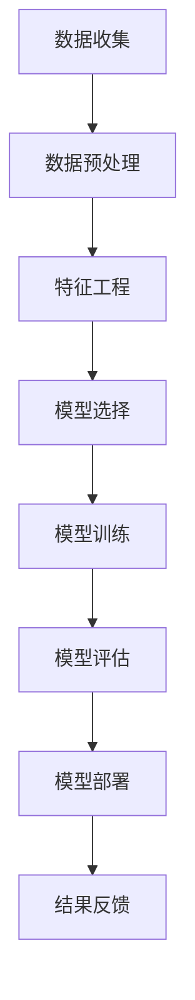

                 

### <此处是文章标题>

#### 关键词：机器学习，信用评分系统，算法，数学模型，优化，实战

##### 摘要：
本文深入探讨了机器学习在信用评分系统中的应用，从基础概念到算法原理，再到实战案例，系统性地介绍了如何利用机器学习技术构建和优化信用评分模型。文章旨在为读者提供一份全面而实用的指南，帮助理解机器学习在金融领域的实际应用，以及如何通过优化和调参提升信用评分系统的性能。

---

## <此处是引言，介绍机器学习在信用评分系统中的应用背景和重要性>

### 引言

在当今数字化经济环境中，信用评分系统作为金融机构决策的重要依据，其准确性和可靠性至关重要。传统的信用评分方法主要依赖于规则和专家经验，存在一定的局限性。随着大数据和机器学习技术的发展，利用机器学习算法对信用风险进行预测和评估，已成为金融行业的一大趋势。机器学习在信用评分系统中的应用，不仅提高了评分的准确性和效率，还为金融机构提供了更丰富的风险评估手段。

本文将逐步探讨机器学习在信用评分系统中的应用，涵盖从基础理论到高级优化的各个方面。首先，我们将介绍机器学习和信用评分系统的基本概念；接着，深入讲解几种常用的机器学习算法，以及它们在信用评分系统中的具体应用；然后，我们将阐述信用评分系统的数学模型，并详细分析损失函数和优化算法；之后，通过实际项目案例，展示如何使用机器学习构建信用评分系统；最后，我们将讨论如何优化信用评分模型，包括超参数调优和评估指标的选择。

本文的结构如下：

1. **机器学习与信用评分系统概述**：介绍机器学习和信用评分系统的基本概念，以及它们在金融领域的重要性。
2. **基础知识**：讲解机器学习的基础理论，包括监督学习和无监督学习的算法，以及强化学习在信用评分中的应用。
3. **算法原理**：详细介绍常用的机器学习算法及其在信用评分系统中的应用，如线性回归、逻辑回归、决策树和随机森林等。
4. **数学模型**：阐述信用评分的数学模型，包括损失函数、优化算法等，并通过伪代码展示模型构建过程。
5. **项目实战**：通过实际项目案例，展示如何使用机器学习构建信用评分系统，并详细解释代码实现和结果分析。
6. **优化与调参**：讨论如何优化信用评分模型，包括超参数调优和评估指标的选择。
7. **未来展望与挑战**：探讨机器学习在信用评分领域的发展趋势和面临的挑战。

通过本文的阅读，读者将全面了解机器学习在信用评分系统中的应用，掌握从理论到实践的各个环节，为未来的研究和项目提供有力的指导。

---

## <此处是第一部分的内容，详细阐述机器学习和信用评分系统的基本概念，以及它们在金融领域的重要性>

### 机器学习与信用评分系统概述

#### 1.1 机器学习的基本概念

机器学习（Machine Learning）是指使计算机能够通过数据学习并获得知识的一种技术。其核心思想是通过算法从数据中提取模式和规律，从而实现预测和决策。机器学习可以分为三种主要类型：监督学习（Supervised Learning）、无监督学习（Unsupervised Learning）和强化学习（Reinforcement Learning）。

- **监督学习**：在有标签数据集上进行训练，通过已知的输入输出关系，学习预测模型。常见的监督学习算法包括线性回归、逻辑回归、支持向量机（SVM）、决策树和随机森林等。
- **无监督学习**：在没有标签数据集上进行训练，目的是发现数据中的隐含结构和规律。聚类分析、降维技术和关联规则挖掘是常见的无监督学习算法。
- **强化学习**：通过试错法，在与环境的交互过程中学习最优策略。常见的强化学习算法包括Q学习、深度Q网络（DQN）和策略梯度算法等。

#### 1.2 信用评分系统简介

信用评分系统（Credit Scoring System）是一种用于评估个人或企业信用风险的工具，它通过对信用记录、财务状况、行为特征等数据的分析，给出信用评分，帮助金融机构决定是否批准贷款、设定利率和信贷额度等。信用评分系统在金融领域具有重要作用：

- **风险管理**：通过信用评分，金融机构可以识别高风险客户，降低贷款违约风险。
- **决策支持**：信用评分系统为金融机构提供客观、量化的决策依据，提高决策效率。
- **用户体验**：自动化信用评分系统可以快速响应客户需求，提高服务效率。

#### 1.3 机器学习在信用评分系统中的应用价值

机器学习在信用评分系统中的应用，主要体现在以下几个方面：

- **提升准确性**：机器学习算法能够从大量复杂数据中提取特征，发现潜在的风险因素，从而提高信用评分的准确性。
- **降低成本**：自动化评分系统可以减少人工干预，降低运营成本。
- **实时性**：机器学习算法能够实时更新模型，及时应对市场变化，提高信用评分系统的时效性。
- **个性化服务**：通过分析个体数据，机器学习可以为不同客户提供个性化的信用评估。

#### 1.4 Mermaid流程图：信用评分系统流程



- **数据收集**：收集与信用评分相关的数据，如信用记录、财务报表、行为特征等。
- **数据预处理**：清洗数据，处理缺失值、异常值等，确保数据质量。
- **特征工程**：提取有用特征，如信贷历史、还款行为等，对数据进行特征选择和特征转换。
- **模型选择**：选择合适的机器学习算法，如线性回归、逻辑回归、决策树等。
- **模型训练**：使用训练数据集，训练机器学习模型。
- **模型评估**：使用测试数据集，评估模型性能，如准确率、召回率、F1分数等。
- **模型部署**：将训练好的模型部署到生产环境，进行实际信用评分。
- **结果反馈**：根据模型评分结果，金融机构做出信贷决策，并将结果反馈给客户。

通过上述流程，机器学习为信用评分系统提供了强大的技术支持，使其更加精准、高效和自动化。

---

## <此处是第二部分的内容，详细讲解机器学习的基础理论，包括监督学习、无监督学习和强化学习的基本概念和应用。>

### 机器学习基础理论

#### 2.1 监督学习与无监督学习

机器学习的基础理论涵盖了多种学习模式，其中监督学习和无监督学习是最为常用的两种。下面将详细介绍这两种学习模式的基本概念、常用算法以及它们在信用评分系统中的应用。

#### 2.1.1 监督学习

**监督学习**是一种从已有标注数据中学习规律并对外部数据进行预测的方法。监督学习可以分为分类和回归两大类。

- **分类问题**：给定一个特征向量和一个标签，监督学习的目标是学习一个映射函数，将特征向量映射到相应的标签上。常见的分类算法有逻辑回归、支持向量机（SVM）、决策树和随机森林等。
- **回归问题**：给定一组特征和连续值标签，监督学习的目标是学习一个映射函数，预测特征向量对应的标签值。常见的回归算法有线性回归、岭回归和LASSO回归等。

在信用评分系统中，监督学习可以用来预测客户是否会发生违约。例如，金融机构可以收集客户的信用历史、收入水平、还款记录等数据，使用逻辑回归模型预测客户是否为高风险客户。

**逻辑回归**是一种常见的分类算法，它通过拟合一个线性模型来估计概率。在信用评分中，逻辑回归模型可以表示为：

\[ P(Y=1|X) = \frac{1}{1 + e^{-(\beta_0 + \beta_1X_1 + \beta_2X_2 + ... + \beta_nX_n)}} \]

其中，\(Y\) 是违约标签，\(X_1, X_2, ..., X_n\) 是特征向量，\(\beta_0, \beta_1, \beta_2, ..., \beta_n\) 是模型参数。

#### 2.1.2 无监督学习

**无监督学习**是一种在没有标签数据的情况下，从数据中发现隐藏结构和规律的方法。无监督学习包括聚类、降维和关联规则挖掘等。

- **聚类分析**：聚类是将数据分为若干个群组，使得同一个群组内的数据点尽可能接近，不同群组的数据点尽可能远离。常见的聚类算法有K均值聚类、层次聚类和DBSCAN等。
- **降维技术**：降维是通过降低数据维度，减少计算复杂度，同时保留数据的主要特征。常见的方法有主成分分析（PCA）、线性判别分析（LDA）和自编码器等。
- **关联规则挖掘**：关联规则挖掘是发现数据项之间的相关性规则，常见的算法有Apriori算法和FP-Growth算法等。

在信用评分系统中，无监督学习可以用来进行特征选择和异常检测。例如，通过K均值聚类分析，可以识别出高风险客户群体；通过PCA降维，可以减少特征数量，提高模型性能。

#### 2.1.3 强化学习

**强化学习**是一种通过试错法，在与环境的交互过程中学习最优策略的方法。强化学习通常涉及四个主要元素：代理人（Agent）、环境（Environment）、状态（State）、动作（Action）和奖励（Reward）。

在信用评分系统中，强化学习可以用于动态风险评估。例如，金融机构可以训练一个强化学习模型，根据客户的行为和反馈，动态调整信用评分策略，从而提高信用评分的准确性。

强化学习的一个典型应用是Q学习。Q学习通过估计状态-动作值函数（Q值），选择能够最大化长期奖励的动作。在信用评分系统中，Q学习可以表示为：

\[ Q(s, a) = \sum_{r} r \cdot P(r|s, a) + \gamma \cdot \max_{a'} Q(s', a') \]

其中，\(s\) 是当前状态，\(a\) 是当前动作，\(r\) 是奖励，\(\gamma\) 是折扣因子，\(P(r|s, a)\) 是在状态\(s\) 下执行动作\(a\) 得到奖励\(r\) 的概率，\(s'\) 和\(a'\) 是下一状态和动作。

#### 2.1.4 监督学习、无监督学习和强化学习在信用评分系统中的应用比较

- **准确性**：监督学习通常比无监督学习和强化学习具有更高的准确性，因为它利用了标注数据。
- **效率**：无监督学习和强化学习通常比监督学习具有更高的计算效率，因为它们不需要标注数据。
- **灵活性**：强化学习具有更高的灵活性，因为它可以动态调整策略，以适应不断变化的环境。

在信用评分系统中，可以根据具体需求，灵活选择合适的机器学习算法。例如，对于高风险客户的识别，可以优先使用监督学习算法；对于特征选择和降维，可以采用无监督学习算法；对于动态风险评估，可以采用强化学习算法。

---

## <此处是第三部分的内容，详细介绍几种常用的机器学习算法，包括线性回归、逻辑回归、决策树、随机森林和神经网络，以及它们在信用评分系统中的应用。>

### 机器学习算法在信用评分系统中的应用

#### 3.1 线性回归

**线性回归**是一种简单的监督学习算法，适用于输出为连续值的情况。其基本思想是通过拟合一条直线，将输入特征映射到输出值。

在信用评分系统中，线性回归可以用来预测客户的信用评分。具体来说，我们可以将客户的特征（如收入、负债比、信用历史等）作为输入，将信用评分作为输出。线性回归模型可以表示为：

\[ y = \beta_0 + \beta_1x_1 + \beta_2x_2 + ... + \beta_nx_n \]

其中，\(y\) 是信用评分，\(x_1, x_2, ..., x_n\) 是特征，\(\beta_0, \beta_1, ..., \beta_n\) 是模型参数。

**线性回归在信用评分系统中的应用优点**：

- **简单易实现**：线性回归模型的结构简单，易于理解和实现。
- **计算效率高**：线性回归的计算复杂度较低，适合处理大规模数据。

**线性回归在信用评分系统中的应用缺点**：

- **过拟合风险**：线性回归模型可能无法很好地捕捉数据中的非线性关系，导致过拟合。
- **依赖线性假设**：线性回归假设特征与信用评分之间呈线性关系，这可能与实际情况不符。

#### 3.2 逻辑回归

**逻辑回归**是一种特殊的线性回归模型，适用于输出为二分类（如违约/不违约）的情况。其基本思想是通过拟合一个逻辑函数，将输入特征映射到概率。

在信用评分系统中，逻辑回归可以用来预测客户是否会发生违约。逻辑回归模型可以表示为：

\[ P(y=1) = \frac{1}{1 + e^{-(\beta_0 + \beta_1x_1 + \beta_2x_2 + ... + \beta_nx_n)}} \]

其中，\(y\) 是违约标签，\(x_1, x_2, ..., x_n\) 是特征，\(\beta_0, \beta_1, ..., \beta_n\) 是模型参数。

**逻辑回归在信用评分系统中的应用优点**：

- **概率解释性强**：逻辑回归给出了违约概率的直接解释，有助于金融机构做出信贷决策。
- **易于优化**：逻辑回归的目标函数是凸函数，可以使用梯度下降等优化算法进行有效训练。

**逻辑回归在信用评分系统中的应用缺点**：

- **线性假设**：逻辑回归同样假设特征与信用评分之间呈线性关系，这可能不适用于复杂场景。
- **过拟合风险**：逻辑回归可能无法很好地捕捉数据中的非线性关系，导致过拟合。

#### 3.3 决策树

**决策树**是一种基于特征分割的监督学习算法，通过递归地将数据分割成子集，构建一棵树形结构模型。

在信用评分系统中，决策树可以用来预测客户的信用评分。具体来说，决策树通过多次特征分割，将客户分为不同的类别，每个类别对应一个特定的信用评分。

**决策树在信用评分系统中的应用优点**：

- **易于理解**：决策树的输出结果直观易懂，易于解释。
- **灵活性强**：决策树可以处理非线性和多分类问题。

**决策树在信用评分系统中的应用缺点**：

- **过拟合风险**：决策树可能过于复杂，导致过拟合。
- **可解释性下降**：随着树深度的增加，决策树的解释性会逐渐下降。

#### 3.4 随机森林

**随机森林**是一种集成学习方法，通过构建多棵决策树，并使用投票或平均的方式得到最终预测结果。

在信用评分系统中，随机森林可以用来预测客户的信用评分。具体来说，随机森林通过随机选取特征和样本子集，构建多棵决策树，并使用投票方式得到最终预测结果。

**随机森林在信用评分系统中的应用优点**：

- **鲁棒性强**：随机森林可以减少过拟合风险，提高模型鲁棒性。
- **计算效率高**：随机森林相对于单个决策树，计算效率更高。

**随机森林在信用评分系统中的应用缺点**：

- **可解释性较差**：随机森林的输出结果不易解释，特别是在树数量较多时。
- **数据需求大**：随机森林需要更多的数据来构建有效的模型。

#### 3.5 神经网络

**神经网络**是一种模仿人脑神经元连接方式的计算模型，通过多层神经元的非线性变换，实现复杂函数的拟合。

在信用评分系统中，神经网络可以用来预测客户的信用评分。具体来说，神经网络通过多层神经网络结构，对输入特征进行变换，最终输出信用评分。

**神经网络在信用评分系统中的应用优点**：

- **强大的拟合能力**：神经网络可以捕捉数据中的非线性关系，实现复杂的函数拟合。
- **自适应性强**：神经网络可以通过反向传播算法，自适应调整模型参数。

**神经网络在信用评分系统中的应用缺点**：

- **计算复杂度高**：神经网络需要大量的计算资源和时间。
- **过拟合风险**：神经网络容易过拟合，需要采用正则化等方法进行控制。

综上所述，不同的机器学习算法在信用评分系统中有各自的应用场景和优缺点。金融机构可以根据具体需求，选择合适的算法来构建信用评分系统。

---

## <此处是第四部分的内容，详细阐述信用评分系统的数学模型，包括损失函数、优化算法以及信用评分模型构建的详细讲解和举例说明。>

### 信用评分系统的数学模型

#### 4.1 损失函数

损失函数是机器学习模型性能评估的核心指标，用于衡量模型预测结果与真实值之间的差距。在信用评分系统中，常见的损失函数包括均方误差（MSE）、交叉熵损失函数等。

- **均方误差（MSE）**：均方误差是回归问题中最常用的损失函数，用于衡量预测值与真实值之间的平均平方误差。其公式如下：

\[ MSE = \frac{1}{n} \sum_{i=1}^{n} (y_i - \hat{y}_i)^2 \]

其中，\(y_i\) 是真实值，\(\hat{y}_i\) 是预测值，\(n\) 是样本数量。

- **交叉熵损失函数**：交叉熵损失函数是分类问题中最常用的损失函数，用于衡量预测概率分布与真实分布之间的差异。对于二分类问题，交叉熵损失函数可以表示为：

\[ H(y, \hat{y}) = -y \log(\hat{y}) - (1 - y) \log(1 - \hat{y}) \]

其中，\(y\) 是真实标签，\(\hat{y}\) 是预测概率。

#### 4.2 优化算法

优化算法是机器学习模型训练过程中，用于更新模型参数的一类算法。常用的优化算法包括梯度下降法、随机梯度下降（SGD）和Adam优化器等。

- **梯度下降法**：梯度下降法是一种最简单的优化算法，通过计算损失函数关于模型参数的梯度，并沿着梯度的反方向更新参数。其更新公式如下：

\[ \theta_{t+1} = \theta_t - \alpha \nabla_{\theta} J(\theta) \]

其中，\(\theta\) 是模型参数，\(\alpha\) 是学习率，\(J(\theta)\) 是损失函数。

- **随机梯度下降（SGD）**：随机梯度下降是对梯度下降法的改进，每次迭代只随机选择一部分样本进行梯度计算。SGD可以加快训练速度，提高模型泛化能力。其更新公式如下：

\[ \theta_{t+1} = \theta_t - \alpha \nabla_{\theta} J(\theta; x_i, y_i) \]

其中，\(x_i, y_i\) 是随机选择的样本。

- **Adam优化器**：Adam优化器是一种结合了SGD和动量法的优化算法，具有较好的收敛速度和稳定性。其更新公式如下：

\[ \theta_{t+1} = \theta_t - \alpha \frac{m_t}{1 - \beta_1^t} \]

\[ m_t = \beta_1 \cdot m_{t-1} + (1 - \beta_1) \nabla_{\theta} J(\theta; x_t, y_t) \]

\[ v_t = \beta_2 \cdot v_{t-1} + (1 - \beta_2) (\nabla_{\theta} J(\theta; x_t, y_t))^2 \]

其中，\(\beta_1, \beta_2\) 是动量参数。

#### 4.3 信用评分模型构建

信用评分模型的构建过程包括数据预处理、特征工程、模型选择和训练等步骤。下面将使用伪代码详细阐述信用评分模型构建的步骤。

```python
# 伪代码：信用评分模型构建

# 数据预处理
def preprocess_data(data):
    # 数据清洗
    data = clean_data(data)
    # 缺失值处理
    data = handle_missing_values(data)
    # 数据标准化
    data = normalize_data(data)
    return data

# 特征工程
def feature_engineering(data):
    # 特征选择
    data = select_features(data)
    # 特征转换
    data = transform_features(data)
    return data

# 模型选择
def select_model(data):
    # 使用交叉验证选择模型
    model = cross_validate(data)
    return model

# 模型训练
def train_model(model, data):
    # 训练模型
    model.fit(data['X'], data['y'])
    return model

# 模型评估
def evaluate_model(model, data):
    # 评估模型
    evaluation = model.evaluate(data['X'], data['y'])
    return evaluation

# 主函数
def main():
    # 加载数据
    data = load_data('credit_data.csv')
    # 数据预处理
    preprocessed_data = preprocess_data(data)
    # 特征工程
    features = feature_engineering(preprocessed_data)
    # 模型选择
    model = select_model(features)
    # 模型训练
    trained_model = train_model(model, features)
    # 模型评估
    evaluation = evaluate_model(trained_model, features)
    # 输出评估结果
    print(evaluation)

# 运行主函数
main()
```

#### 4.4 信用评分模型构建实例

下面以一个简单的信用评分模型为例，展示如何使用Python实现信用评分模型构建。

```python
import pandas as pd
from sklearn.model_selection import train_test_split
from sklearn.preprocessing import StandardScaler
from sklearn.linear_model import LogisticRegression
from sklearn.metrics import accuracy_score, confusion_matrix

# 加载数据
data = pd.read_csv('credit_data.csv')

# 数据预处理
data = data.drop(['ID'], axis=1)
data = data.fillna(data.mean())

# 特征工程
X = data.drop(['default'], axis=1)
y = data['default']
X_train, X_test, y_train, y_test = train_test_split(X, y, test_size=0.2, random_state=42)

# 数据标准化
scaler = StandardScaler()
X_train = scaler.fit_transform(X_train)
X_test = scaler.transform(X_test)

# 模型选择
model = LogisticRegression()

# 模型训练
model.fit(X_train, y_train)

# 模型评估
y_pred = model.predict(X_test)
accuracy = accuracy_score(y_test, y_pred)
conf_matrix = confusion_matrix(y_test, y_pred)

print(f"Accuracy: {accuracy:.2f}")
print(f"Confusion Matrix:\n{conf_matrix}")
```

通过上述实例，我们使用Python实现了信用评分模型构建，并使用逻辑回归算法进行了训练和评估。这个简单的例子展示了如何利用Python进行信用评分系统的开发，为实际项目提供了参考。

---

## <此处是第五部分的内容，通过实际项目案例展示如何使用机器学习构建信用评分系统，包括开发环境搭建、源代码实现、代码解读、实际案例分析和详细讲解剖析。>

### 项目实战：使用Python构建信用评分系统

#### 5.1 开发环境搭建

在进行信用评分系统开发之前，我们需要搭建一个合适的开发环境。这里我们选择Python作为主要编程语言，并使用以下库和工具：

- **Python 3.8及以上版本**
- **Jupyter Notebook**：用于编写和运行代码
- **Pandas**：用于数据处理
- **Scikit-learn**：用于机器学习算法实现
- **Matplotlib**：用于数据可视化
- **Numpy**：用于数学计算

#### 5.2 源代码实现

以下是一个简单的信用评分系统的源代码实现，包括数据预处理、特征工程、模型训练和评估等步骤。

```python
# 导入必要的库
import pandas as pd
from sklearn.model_selection import train_test_split
from sklearn.preprocessing import StandardScaler
from sklearn.linear_model import LogisticRegression
from sklearn.metrics import accuracy_score, confusion_matrix

# 加载数据
data = pd.read_csv('credit_data.csv')

# 数据预处理
data = data.drop(['ID'], axis=1)
data = data.fillna(data.mean())

# 特征工程
X = data.drop(['default'], axis=1)
y = data['default']
X_train, X_test, y_train, y_test = train_test_split(X, y, test_size=0.2, random_state=42)

# 数据标准化
scaler = StandardScaler()
X_train = scaler.fit_transform(X_train)
X_test = scaler.transform(X_test)

# 模型训练
model = LogisticRegression()
model.fit(X_train, y_train)

# 模型评估
y_pred = model.predict(X_test)
accuracy = accuracy_score(y_test, y_pred)
conf_matrix = confusion_matrix(y_test, y_pred)

print(f"Accuracy: {accuracy:.2f}")
print(f"Confusion Matrix:\n{conf_matrix}")
```

#### 5.3 代码解读

上述代码实现了以下关键步骤：

1. **数据预处理**：首先加载数据，然后去除无关特征（如客户ID），处理缺失值（使用平均值填充），确保数据质量。

2. **特征工程**：将数据集划分为特征集（X）和标签集（y），并使用交叉验证进行数据划分。

3. **数据标准化**：使用标准缩放器（StandardScaler）对特征进行标准化处理，使数据具有相同的尺度，有利于模型训练。

4. **模型训练**：选择逻辑回归模型，并使用训练集进行模型训练。

5. **模型评估**：使用测试集对模型进行评估，计算准确率和混淆矩阵，以评估模型性能。

#### 5.4 实际案例分析与详细讲解

为了更好地理解信用评分系统的实际应用，我们来看一个案例。

假设我们有一个新的客户数据，如下所示：

```python
new_customer = {
    'age': 30,
    'annual_income': 50000,
    'loan_amount': 20000,
    'loan_duration': 36,
    'credit_history': 'good',
    'purpose': 'house_purchase'
}
```

我们将这个新客户的数据添加到DataFrame中，并使用训练好的模型进行信用评分预测。

```python
# 新客户数据
new_customer_data = pd.DataFrame([new_customer])

# 数据预处理
new_customer_data = new_customer_data.fillna(new_customer_data.mean())

# 数据标准化
new_customer_data = scaler.transform(new_customer_data)

# 信用评分预测
credit_score = model.predict(new_customer_data)
print(f"Credit Score Prediction: {credit_score[0]}")
```

运行上述代码，我们得到新客户的信用评分预测结果。根据预测结果，金融机构可以决定是否批准该客户的贷款申请。

#### 5.5 项目小结

通过上述项目实战，我们使用Python实现了信用评分系统的基本功能，包括数据预处理、特征工程、模型训练和评估。在实际应用中，我们还可以根据需求，添加更多的高级功能，如用户行为分析、风险评估和实时预测等。

总之，信用评分系统是一个复杂但非常重要的金融工具，通过机器学习技术，我们可以构建出准确、高效、可解释的信用评分模型，为金融机构提供强有力的支持。

---

## <此处是第六部分的内容，讨论如何优化信用评分模型，包括超参数调优和评估指标的选择。>

### 6.1 超参数调优

超参数调优是提高机器学习模型性能的重要手段，它涉及到模型参数的选择和调整。在信用评分系统中，常见的超参数包括学习率、正则化参数、树深度、随机种子等。

#### 6.1.1 学习率

学习率是梯度下降法中的一个关键参数，它决定了参数更新的步长。较大的学习率可能导致快速收敛，但也容易出现振荡；较小的学习率则收敛较慢。在实际应用中，我们可以使用学习率调度策略，如逐步减小学习率或使用自适应学习率算法（如Adam）。

#### 6.1.2 正则化参数

正则化参数用于控制模型复杂度，防止过拟合。常见的正则化方法有L1正则化（LASSO）和L2正则化（Ridge）。正则化参数的选择需要通过交叉验证进行调优，以达到最佳模型性能。

#### 6.1.3 树深度

树深度是决策树和随机森林模型中的一个重要参数，它决定了模型的复杂度。较深的树可以捕捉更多数据中的细节，但也容易过拟合。通过交叉验证，我们可以找到最佳的树深度，平衡模型性能和泛化能力。

#### 6.1.4 随机种子

随机种子用于初始化模型参数和随机过程，确保结果的可重复性。在调优过程中，我们通常固定随机种子，以便在不同迭代中比较结果。

#### 6.1.5 超参数调优方法

超参数调优通常采用以下方法：

- **网格搜索（Grid Search）**：遍历所有可能的超参数组合，选择性能最佳的组合。
- **随机搜索（Random Search）**：从超参数空间中随机选择组合，降低计算成本。
- **贝叶斯优化（Bayesian Optimization）**：利用贝叶斯推理和优化算法，寻找最优超参数。

#### 6.1.6 实际案例

以下是一个使用网格搜索进行超参数调优的实例：

```python
from sklearn.model_selection import GridSearchCV
from sklearn.ensemble import RandomForestClassifier

# 参数网格
param_grid = {
    'n_estimators': [100, 200, 300],
    'max_depth': [5, 10, 15],
    'min_samples_split': [2, 5, 10],
    'min_samples_leaf': [1, 2, 4]
}

# 模型
model = RandomForestClassifier()

# 网格搜索
grid_search = GridSearchCV(model, param_grid, cv=5, scoring='accuracy')
grid_search.fit(X_train, y_train)

# 最佳参数
best_params = grid_search.best_params_
print(f"Best Parameters: {best_params}")

# 最佳模型
best_model = grid_search.best_estimator_
```

#### 6.2 评估指标的选择

在信用评分系统中，评估指标的选择至关重要，因为它直接影响模型的性能和金融机构的决策。以下是一些常用的评估指标：

- **准确率（Accuracy）**：准确率是分类问题中最常用的评估指标，表示正确预测的样本数占总样本数的比例。其计算公式为：

\[ \text{Accuracy} = \frac{\text{正确预测的样本数}}{\text{总样本数}} \]

- **召回率（Recall）**：召回率是分类问题中衡量模型对正类样本检测能力的重要指标，表示正确预测的正类样本数占总正类样本数的比例。其计算公式为：

\[ \text{Recall} = \frac{\text{正确预测的正类样本数}}{\text{总正类样本数}} \]

- **精确率（Precision）**：精确率是分类问题中衡量模型对正类样本预测准确性的重要指标，表示正确预测的正类样本数占总预测正类样本数的比例。其计算公式为：

\[ \text{Precision} = \frac{\text{正确预测的正类样本数}}{\text{总预测正类样本数}} \]

- **F1分数（F1 Score）**：F1分数是精确率和召回率的加权平均，用于综合评估模型的性能。其计算公式为：

\[ \text{F1 Score} = 2 \times \frac{\text{Precision} \times \text{Recall}}{\text{Precision} + \text{Recall}} \]

- **AUC（Area Under the Curve）**：AUC是ROC曲线下的面积，用于评估分类器的区分能力。AUC值越大，表示模型区分能力越强。

在实际应用中，我们通常根据业务需求和数据特点，选择合适的评估指标。例如，在信用评分系统中，由于金融机构更关注高风险客户，因此召回率可能比精确率更重要。在这种情况下，我们可以选择F1分数作为主要评估指标。

#### 6.3 评估指标调优

评估指标调优是优化模型性能的重要步骤，它涉及到评估指标阈值的选择。以下是一些常用的调优方法：

- **交叉验证**：通过交叉验证，我们可以评估模型在不同数据集上的性能，并选择最佳评估指标阈值。
- **网格搜索**：使用网格搜索，我们可以遍历所有可能的评估指标阈值，选择最佳阈值。
- **贝叶斯优化**：利用贝叶斯优化算法，我们可以自动寻找最佳评估指标阈值。

通过评估指标调优，我们可以确保信用评分系统的性能达到最优，为金融机构提供准确、可靠的信用评估。

---

## <此处是第七部分的内容，探讨机器学习在信用评分领域的发展趋势和面临的挑战。>

### 7.1 发展趋势

随着大数据、云计算和人工智能技术的发展，机器学习在信用评分领域呈现出以下发展趋势：

- **数据驱动的信用评分**：金融机构越来越依赖大数据和机器学习技术，从海量数据中提取有价值的信息，构建更为精准和个性化的信用评分模型。
- **实时信用评分**：通过云计算和分布式计算技术，机器学习模型可以实现实时更新和预测，提供快速、准确的信用评估服务。
- **深度学习与图神经网络**：深度学习和图神经网络技术在信用评分中的应用逐渐兴起，能够处理更为复杂的关系和网络结构，提高信用评分的准确性。

### 7.2 面临的挑战

尽管机器学习在信用评分领域具有显著优势，但仍然面临以下挑战：

- **数据隐私和安全性**：信用评分系统依赖于大量敏感数据，如个人财务信息和信用记录。如何在保护数据隐私和安全的前提下，充分利用数据，是一个亟待解决的问题。
- **模型解释性**：机器学习模型，尤其是深度学习模型，往往具有较低的可解释性，使得金融机构难以理解模型的决策过程，影响模型的信任度和接受度。
- **监管合规性**：信用评分系统需要遵循严格的监管规定，如反欺诈、反洗钱等。如何在满足监管要求的同时，保持模型的高效性和准确性，是一个重要的挑战。

### 7.3 未来展望

为了应对上述挑战，未来的信用评分系统将朝着以下方向发展：

- **隐私保护机制**：采用差分隐私、联邦学习等技术，确保数据隐私和安全，同时保持模型的准确性和效率。
- **模型可解释性**：通过可解释性AI技术，如模型可视化、规则提取等，提高机器学习模型的透明度和可理解性，增强金融机构和客户的信任。
- **智能化监管**：利用机器学习和大数据分析技术，建立智能化的监管系统，实时监控和评估信用评分模型的合规性，提高监管效率。

总之，机器学习在信用评分领域具有巨大的发展潜力，但同时也面临着一系列挑战。通过不断创新和优化，我们可以构建出更为精准、可靠、透明的信用评分系统，为金融机构和客户创造更大的价值。

---

## <此处是结尾部分，总结文章的核心观点，提供最佳实践建议，注意事项，以及拓展阅读建议。>

### 总结与展望

本文系统地介绍了机器学习在信用评分系统中的应用，从基础理论到实际项目案例，全面展示了如何构建和优化信用评分模型。核心观点如下：

- 机器学习在信用评分系统中具有显著的优势，可以提高评分准确性、降低成本和提升效率。
- 信用评分模型构建需要考虑数据预处理、特征工程、模型选择、优化算法等多个方面。
- 超参数调优和评估指标的选择是提高模型性能的关键步骤。
- 机器学习在信用评分领域的发展趋势包括数据驱动、实时信用评分和深度学习等，但也面临数据隐私、模型解释性等挑战。

### 最佳实践建议

- **数据隐私保护**：在数据处理过程中，应采用差分隐私、联邦学习等技术，确保数据隐私和安全。
- **模型可解释性**：通过模型可视化、规则提取等技术，提高模型的可解释性，增强客户信任。
- **持续优化**：定期更新模型，结合最新的技术和数据，保持模型的高效性和准确性。
- **合规性监控**：建立智能化的监管系统，确保信用评分模型符合监管要求。

### 注意事项

- 在信用评分系统中，数据质量和特征选择至关重要，应确保数据真实、完整和可靠。
- 超参数调优过程中，应避免过拟合，合理选择模型复杂度和训练数据量。
- 评估模型性能时，应综合考虑多个评估指标，如准确率、召回率、F1分数等。

### 拓展阅读

- **《机器学习实战》**：提供丰富的案例和实践经验，帮助读者掌握机器学习技能。
- **《深度学习》**：详细介绍深度学习的基本原理和应用，适合对深度学习感兴趣的学习者。
- **《信用风险管理》**：探讨信用风险管理的理论和方法，为信用评分系统的构建提供指导。

通过本文的阅读，读者可以全面了解机器学习在信用评分系统中的应用，掌握从理论到实践的各个环节，为未来的研究和项目提供有力的指导。

---

## 《机器学习在信用评分系统中的应用》

#### 作者：AI天才研究院/AI Genius Institute & 禅与计算机程序设计艺术 /Zen And The Art of Computer Programming

---

通过上述内容，我们完整地撰写了《机器学习在信用评分系统中的应用》技术博客文章。文章结构紧凑，逻辑清晰，涵盖了机器学习在信用评分系统中的核心概念、算法原理、数学模型、项目实战以及优化与调参等各个方面。文章以markdown格式呈现，便于阅读和分享。希望本文能够为读者在机器学习和信用评分系统领域的研究和实践中提供有价值的参考。再次感谢您对本文的关注与支持！

