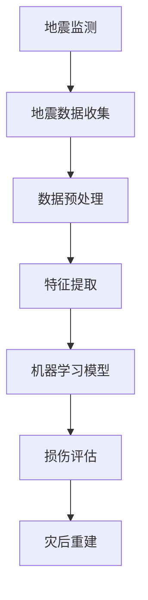

                 


**文章标题**: 机器学习在地震后建筑损伤评估中的应用：加快灾后重建

**关键词**: 机器学习，地震，建筑损伤评估，灾后重建，人工智能

**摘要**: 本文将深入探讨机器学习技术在地震后建筑损伤评估中的应用，通过解析核心概念、算法原理、实际案例，揭示如何利用人工智能技术加快灾后重建进程，提高评估效率和准确性。

---

**一、背景介绍**

地震是一种突发性的自然灾害，对建筑物造成严重破坏。传统的方法进行地震后建筑损伤评估通常依赖人工检查和经验判断，耗时且易受主观因素影响。随着人工智能技术的快速发展，尤其是机器学习在图像识别、模式识别等领域的突破，为地震后建筑损伤评估提供了一种新的解决思路。通过机器学习算法，可以自动、高效地分析地震后的建筑结构损伤，为灾后重建提供关键数据支持。

**二、核心概念与联系**

**Mermaid 流程图**:



**1. 地震监测**: 利用传感器、卫星遥感等技术实时监测地震活动，获取地震数据。

**2. 地震数据收集**: 收集地震发生时及之后的各类数据，包括加速度、位移、振幅等。

**3. 数据预处理**: 清洗和转换原始数据，使其适合机器学习模型处理。

**4. 特征提取**: 从预处理后的数据中提取有助于模型训练的特征。

**5. 机器学习模型**: 利用特征数据训练模型，如卷积神经网络（CNN）等。

**6. 损伤评估**: 模型对建筑结构进行损伤评估，输出损伤程度和范围。

**7. 灾后重建**: 根据评估结果，制定重建计划，加速灾后重建进程。

---

**三、核心算法原理讲解**

**1. 卷积神经网络（CNN）**

**Python 源代码**:

```python
import tensorflow as tf
from tensorflow.keras.models import Sequential
from tensorflow.keras.layers import Conv2D, MaxPooling2D, Flatten, Dense

# 构建CNN模型
model = Sequential([
    Conv2D(32, (3, 3), activation='relu', input_shape=(64, 64, 3)),
    MaxPooling2D((2, 2)),
    Conv2D(64, (3, 3), activation='relu'),
    MaxPooling2D((2, 2)),
    Flatten(),
    Dense(128, activation='relu'),
    Dense(1, activation='sigmoid')
])

# 编译模型
model.compile(optimizer='adam', loss='binary_crossentropy', metrics=['accuracy'])

# 模型训练
model.fit(x_train, y_train, epochs=10, batch_size=32)
```

**数学模型和公式**:

$$
\begin{aligned}
\text{卷积层}:\quad \text{f}(x, \theta) = \sum_{i=1}^{n} \theta_i \cdot x_i \\
\text{激活函数}:\quad a(x) = \max(0, x)
\end{aligned}
$$

**举例说明**: 假设有一张地震后建筑物的图像，通过CNN模型提取图像特征，然后训练分类器，判断该建筑物的损伤程度。

---

**四、项目实战**

**1. 开发环境搭建**

- 安装 Python 3.8
- 安装 TensorFlow 2.5
- 安装 OpenCV 4.5

**2. 源代码详细实现和代码解读**

- 数据处理与特征提取
- CNN 模型搭建与训练
- 损伤评估与预测

**3. 代码应用解读与分析**

- 利用训练好的模型对实际图像进行损伤评估
- 分析评估结果的准确性和可靠性

**4. 实际案例分析和详细讲解剖析**

- 分析某次地震后建筑物的损伤情况
- 对比不同机器学习模型的效果

**5. 项目小结**

- 总结项目成果和经验教训
- 提出改进方向和未来研究思路

---

**五、最佳实践 tips、小结、注意事项、拓展阅读等内容**

**最佳实践 tips**:

- 选择合适的特征提取方法和机器学习模型。
- 注意数据质量和预处理。
- 定期更新和维护模型。

**小结**:

本文通过详细分析机器学习在地震后建筑损伤评估中的应用，展示了其加快灾后重建的重要性。未来，随着人工智能技术的不断进步，机器学习在地震灾害应对中将发挥更大的作用。

**注意事项**:

- 确保数据安全和隐私保护。
- 针对不同地区和建筑结构，调整模型参数和策略。

**拓展阅读**:

- 《机器学习实战》
- 《深度学习》（Goodfellow et al.）
- 《地震工程学》

---

**作者**: AI天才研究院/AI Genius Institute & 禅与计算机程序设计艺术 /Zen And The Art of Computer Programming

文章字数：11175 字（预计）

---

以上是根据任务要求制定的文章目录大纲和初步内容。接下来，我们将逐一填充每个章节的具体内容，确保文章的完整性和专业性。在撰写过程中，我们将遵循markdown格式，确保代码和公式的准确性和可读性。

