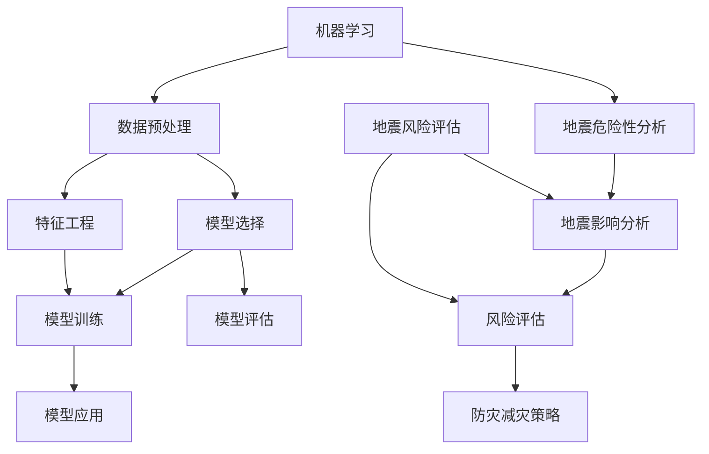

                 

### 引言和背景

#### 1.1 机器学习与地震风险评估

**机器学习的概念**

机器学习（Machine Learning）是人工智能（Artificial Intelligence，AI）的一个分支，主要研究如何让计算机通过数据学习，自动进行决策和预测。它利用统计学、概率论和优化理论等数学工具，通过构建和训练模型来对未知数据进行分类、回归、聚类等任务。

在地震风险评估中，机器学习被广泛应用于预测地震的发生、评估地震对建筑物的影响以及制定有效的防灾措施。传统的地震风险评估方法主要依赖于地震学、地质学和结构工程学的知识，而机器学习则通过处理和分析大量的历史地震数据和建筑物数据，发现潜在的地震风险规律，为城市规划提供更加科学和准确的依据。

**地震风险评估的意义**

地震风险评估对于城市规划和防灾减灾具有重要意义。通过评估地震风险，我们可以：

1. **预测地震可能性**：识别出哪些地区更容易发生地震，从而指导城市规划者避免在这些地区建设高风险的建筑。
2. **评估地震影响**：预测地震可能对建筑物、基础设施等造成的影响，为制定防灾措施提供依据。
3. **制定防灾策略**：根据风险评估结果，制定相应的防灾策略，如加强建筑物抗震设计、设立避难所等。

#### 1.2 城市规划与地震风险评估的关系

**地震风险评估对城市规划的重要性**

地震风险评估是城市规划的重要组成部分。一个科学合理的地震风险评估，可以帮助城市规划者：

1. **合理规划城市建设**：通过识别地震高风险区域，避免在这些区域建设高风险的建筑物，确保城市建设的可持续性和安全性。
2. **优化建筑物设计**：依据地震风险评估结果，设计更符合抗震要求的建筑物，提高建筑物的抗震能力。
3. **完善防灾基础设施**：依据地震风险评估，制定合理的防灾基础设施规划，如避难所、消防设施等，提高城市防灾能力。

**城市规划中的地震风险评估现状**

目前，许多城市在进行城市规划时已经开始考虑地震风险评估，但整体水平仍有待提高。主要问题包括：

1. **数据缺乏**：地震风险评估需要大量的历史地震数据和建筑物数据，许多城市缺乏这些基础数据。
2. **评估方法单一**：目前大多数城市的地震风险评估主要依赖于传统的地震学方法，缺乏基于机器学习的智能化评估方法。
3. **风险评估体系不完善**：地震风险评估体系不完善，缺乏统一的评估标准和规范。

#### 1.3 改进城市规划的需求

**当前城市规划面临的挑战**

随着城市化进程的加速，城市规划面临着前所未有的挑战：

1. **地震风险增加**：全球地震活动频繁，地震风险增加，对城市规划提出了更高的要求。
2. **气候变化**：气候变化导致的极端天气事件增多，也对城市规划提出了新的挑战。
3. **人口增长**：城市人口增长迅速，城市用地紧张，需要更加科学合理的城市规划。

**机器学习技术在城市规划中的应用潜力**

机器学习技术在城市规划中具有巨大的应用潜力：

1. **数据驱动**：机器学习可以处理和分析大量的地震数据和建筑物数据，发现潜在的风险规律。
2. **智能化**：机器学习可以自动进行地震风险评估，提供更加科学和准确的决策支持。
3. **动态调整**：机器学习可以根据新的数据动态调整风险评估结果，提高风险评估的实时性和准确性。

通过以上分析，我们可以看到，机器学习在地震风险评估中的应用对于改进城市规划具有重要意义。接下来，我们将详细探讨机器学习在地震风险评估中的应用原理和实际案例，以期为城市规划提供有力支持。

---

关键词：机器学习、地震风险评估、城市规划、数据驱动、智能化

摘要：本文介绍了机器学习在地震风险评估中的应用，探讨了机器学习如何通过数据处理和分析提高地震风险评估的准确性，进而改进城市规划。文章首先阐述了机器学习和地震风险评估的基本概念，分析了机器学习在地震风险评估中的重要性。随后，详细介绍了机器学习在地震风险评估中的应用原理，包括数据预处理、常用算法和模型等。最后，通过实际案例展示了机器学习在城市规划中的应用效果，并提出了改进城市规划的策略和建议。

---

# 机器学习在地震风险评估中的应用：改进城市规划

## 关键词
机器学习、地震风险评估、城市规划、数据驱动、智能化

## 摘要
本文探讨了机器学习技术在地震风险评估中的应用，通过分析地震数据和建筑物数据，利用机器学习模型进行地震风险预测，从而为城市规划提供科学依据。文章首先介绍了机器学习和地震风险评估的基本概念，随后详细介绍了常用的机器学习算法及其应用原理。通过实际案例展示了机器学习在地震风险评估中的效果，最后提出了基于机器学习的城市规划策略和建议。

## 引言和背景

### 1.1 机器学习的概念

机器学习（Machine Learning，ML）是人工智能（Artificial Intelligence，AI）的重要组成部分，主要研究如何使计算机系统能够从数据中学习并做出预测或决策。其核心思想是通过训练模型，使计算机能够在没有明确编程的情况下自动地从数据中提取模式和知识。

**机器学习的基本原理**

机器学习的基本原理可以分为以下几个步骤：

1. **数据收集与预处理**：收集相关数据，并进行数据清洗、归一化和特征提取等预处理工作，以减少噪声和冗余信息，提高数据质量。

2. **模型选择与训练**：根据任务需求和数据特点选择合适的机器学习模型，并通过训练模型使其对输入数据产生准确的预测或分类结果。

3. **模型评估与优化**：使用验证数据集对模型进行评估，调整模型参数以优化模型性能。

4. **模型应用**：将训练好的模型应用于实际问题中，进行预测或决策。

**机器学习的应用领域**

机器学习在许多领域都取得了显著的成果，包括：

- **图像识别**：通过卷积神经网络（CNN）等模型，实现对图像的自动分类和识别。

- **自然语言处理**：利用递归神经网络（RNN）和长短时记忆网络（LSTM）等模型，实现对文本的自动生成、翻译和情感分析等。

- **推荐系统**：通过协同过滤、矩阵分解等算法，实现对用户兴趣和偏好的预测，提供个性化推荐。

- **金融市场预测**：通过时间序列分析和回归模型，预测金融市场的趋势和波动。

- **医疗诊断**：利用深度学习模型，对医学图像进行分析，辅助医生进行疾病诊断。

### 1.2 地震风险评估的概念

地震风险评估（Earthquake Risk Assessment）是对地震可能造成的损失进行预测和评估的过程。其主要目标是识别地震高风险区域，评估地震对建筑物、基础设施和人类生命财产的影响，为城市规划、建筑设计、防灾减灾提供科学依据。

**地震风险评估的基本步骤**

地震风险评估通常包括以下几个步骤：

1. **地震危险性分析**：评估地震的发生概率和强度，确定地震的潜在危害性。

2. **地震影响分析**：评估地震对建筑物、基础设施和人类生命财产的影响，包括直接损失和间接损失。

3. **风险评估**：综合地震危险性分析和地震影响分析的结果，确定地震风险水平，并制定相应的防灾减灾措施。

**地震风险评估的重要性**

地震风险评估对于城市规划和防灾减灾具有重要意义。通过地震风险评估，我们可以：

- **识别高风险区域**：及时发现地震高风险区域，避免在这些区域建设高风险的建筑物。

- **优化建筑设计**：根据地震风险评估结果，设计符合抗震要求的建筑物，提高建筑物的安全性。

- **制定防灾策略**：依据地震风险评估结果，制定合理的防灾策略和应急预案，提高城市的防灾能力。

### 1.3 机器学习在地震风险评估中的应用

**数据驱动的方法**

机器学习采用数据驱动的方法，通过对大量地震数据和建筑物数据的分析，自动识别地震风险规律，为地震风险评估提供科学依据。这种方法相比于传统的地震学方法，具有更高的精度和效率。

**常见的机器学习算法**

在地震风险评估中，常用的机器学习算法包括：

- **线性回归**：通过建立线性模型，预测地震发生概率和地震影响。

- **决策树**：通过构建决策树模型，对地震风险进行分类和预测。

- **支持向量机（SVM）**：通过构建支持向量机模型，进行地震风险评估。

- **神经网络**：通过构建神经网络模型，实现地震风险的预测和评估。

- **集成学习方法**：如随机森林（Random Forest）和梯度提升树（Gradient Boosting Tree），通过集成多个弱模型，提高地震风险评估的精度。

**机器学习在地震风险评估中的应用效果**

机器学习在地震风险评估中的应用取得了显著效果。通过机器学习模型，可以：

- **提高预测精度**：利用大量的地震数据和建筑物数据，机器学习模型可以自动发现地震风险的规律，提高预测精度。

- **自动化风险评估**：机器学习模型可以实现自动化风险评估，减少人工干预，提高评估效率。

- **动态调整评估结果**：随着新的地震数据和建筑物数据的不断出现，机器学习模型可以动态调整评估结果，保持评估的实时性和准确性。

综上所述，机器学习在地震风险评估中具有广阔的应用前景。通过本文的介绍，我们希望读者能够对机器学习在地震风险评估中的应用有一个全面的认识，为后续章节的内容打下基础。

---

# 核心概念与联系

在本章中，我们将详细阐述机器学习和地震风险评估的核心概念，并展示它们之间的关系架构。通过Mermaid流程图，我们能够直观地理解这些概念之间的交互和依赖，为后续章节的讨论提供清晰的框架。

## 1. 机器学习的核心概念

机器学习涉及多个核心概念，这些概念构成了机器学习理论的基础。以下是对这些核心概念的简要介绍：

### 数据预处理

数据预处理是机器学习过程中的第一步，也是至关重要的一步。其主要目的是清洗数据、处理缺失值、归一化数据、特征提取等，以确保数据的质量和一致性。

### 模型选择

模型选择是机器学习中的重要步骤，根据问题的需求和数据的特点，选择合适的模型。常见的机器学习模型包括线性回归、决策树、支持向量机（SVM）、神经网络和集成学习方法等。

### 特征工程

特征工程是机器学习中的另一个关键环节。通过选择和构造有效的特征，可以提高模型的性能。特征工程包括特征提取、特征选择、特征变换等。

### 模型训练与评估

模型训练是机器学习过程中的核心任务，通过训练数据集来调整模型参数，使其能够对未知数据进行预测。模型评估则用于验证模型的性能，通常使用验证数据集进行。

### 模型应用

经过训练和评估后，模型可以应用于实际问题中，进行预测或决策。

## 2. 地震风险评估的核心概念

地震风险评估涉及地震危险性分析、地震影响分析、风险评估和防灾减灾策略等多个方面。以下是这些核心概念的简要介绍：

### 地震危险性分析

地震危险性分析旨在评估地震的发生概率和强度。这通常涉及到地震历史数据、地质结构和地震学模型等。

### 地震影响分析

地震影响分析评估地震对建筑物、基础设施和人类生命财产的影响。这包括直接损失和间接损失，如结构破坏、财产损失和人员伤亡等。

### 风险评估

风险评估是综合地震危险性分析和地震影响分析的结果，确定地震风险水平，并制定相应的防灾减灾措施。

### 防灾减灾策略

防灾减灾策略是基于风险评估结果，制定的具体措施，包括建筑物加固、避难所建设、应急预案等。

## 3. Mermaid流程图

为了更好地展示机器学习和地震风险评估的核心概念及其之间的联系，我们使用Mermaid流程图来表示。以下是一个简化的流程图：



在这个流程图中：

- **数据预处理（A）** 是机器学习和地震风险评估的共同起点，为后续步骤提供基础数据。
- **模型选择（B）** 和 **特征工程（C）** 是机器学习的核心步骤，影响模型的性能。
- **模型训练（D）** 和 **模型评估（E）** 是机器学习的核心流程，用于调整和验证模型。
- **模型应用（F）** 将训练好的模型应用于实际问题中，进行预测或决策。
- **地震危险性分析（G）** 和 **地震影响分析（H）** 是地震风险评估的关键步骤，用于评估地震风险。
- **风险评估（I）** 和 **防灾减灾策略（J）** 是地震风险评估的最终目标，为城市规划提供科学依据。

通过这个流程图，我们可以清晰地看到机器学习和地震风险评估之间的互动和依赖关系。接下来，我们将深入探讨机器学习算法在地震风险评估中的应用，并展示具体的Python代码实现。

---

# 数据预处理

数据预处理是机器学习过程中至关重要的一步，尤其是在地震风险评估中，高质量的数据预处理能够显著提高模型的预测精度。数据预处理包括数据清洗、归一化和特征提取等步骤，下面我们将详细介绍这些步骤及其在地震风险评估中的应用。

## 1. 数据清洗

数据清洗是数据预处理的首要步骤，其主要目标是去除数据中的噪声、错误和不完整信息，以提高数据的质量。在地震风险评估中，数据清洗主要包括以下几方面：

- **缺失值处理**：对于缺失的数据，可以采用填充平均值、中位数或使用模型预测值等方法进行填充。
- **异常值处理**：去除或调整异常值，防止它们对模型训练产生负面影响。常用的方法包括标准差法、箱线图法和基于机器学习的异常值检测等。
- **重复数据删除**：删除重复的数据记录，防止它们对模型训练的干扰。

**Python代码示例**：

```python
import pandas as pd
from sklearn.impute import SimpleImputer
from sklearn.preprocessing import StandardScaler

# 加载数据
data = pd.read_csv('earthquake_data.csv')

# 缺失值填充
imputer = SimpleImputer(strategy='mean')
data_filled = imputer.fit_transform(data)

# 异常值处理
from scipy import stats
data_clean = data[(np.abs(stats.zscore(data_filled)) < 3).all(axis=1)]

# 重复数据删除
data_unique = data_clean.drop_duplicates()
```

## 2. 数据归一化

数据归一化是将数据转换到相同的尺度，使得不同特征之间的量级差异不会影响模型的训练。在地震风险评估中，归一化可以防止某些特征对模型产生过大的影响，提高模型的泛化能力。常用的归一化方法包括最小-最大缩放和Z-score标准化。

- **最小-最大缩放**：将数据缩放到[0, 1]的区间，公式为：`X_std = (X - X_min) / (X_max - X_min)`。
- **Z-score标准化**：将数据转换为标准正态分布，公式为：`X_std = (X - X_mean) / X_stddev`。

**Python代码示例**：

```python
from sklearn.preprocessing import MinMaxScaler, StandardScaler

# 最小-最大缩放
scaler_min_max = MinMaxScaler()
data_min_max = scaler_min_max.fit_transform(data_unique)

# Z-score标准化
scaler_z_score = StandardScaler()
data_z_score = scaler_z_score.fit_transform(data_unique)
```

## 3. 特征提取

特征提取是数据预处理的重要环节，其目的是从原始数据中提取出对模型训练有帮助的特征，去除冗余和无用的特征。在地震风险评估中，特征提取可以显著提高模型的性能。

- **相关性分析**：通过计算特征之间的相关性，识别出高度相关的特征，保留最重要的特征。
- **主成分分析（PCA）**：通过降维，将原始特征映射到主成分空间，提取最重要的特征。
- **特征选择**：利用基于信息的特征选择方法，如信息增益、卡方检验等，选择对模型贡献最大的特征。

**Python代码示例**：

```python
from sklearn.decomposition import PCA
from sklearn.feature_selection import SelectKBest, f_classif

# 相关性分析
correlations = data_unique.corr().abs()
high_corr_features = correlations.unstack().index[correlations.unstack() > 0.8]

# 主成分分析
pca = PCA(n_components=5)
data_pca = pca.fit_transform(data_unique)

# 特征选择
selector = SelectKBest(score_func=f_classif, k=10)
data_selected = selector.fit_transform(data_unique, target)
```

通过上述步骤，我们可以对地震风险评估的数据进行高效的数据预处理，为后续的模型训练和评估奠定基础。接下来，我们将介绍常用的机器学习算法，并深入探讨其在地震风险评估中的应用。

---

# 常见算法简介

在地震风险评估中，选择合适的机器学习算法至关重要。本文将介绍几种常用的机器学习算法，包括线性回归、决策树、支持向量机和神经网络。这些算法各自有其独特的原理和应用场景，将在地震风险评估中发挥重要作用。

## 1. 线性回归

线性回归是最简单的机器学习算法之一，它通过建立一个线性模型来预测连续值输出。线性回归的基本假设是输出变量（目标变量）与输入变量之间存在线性关系。

### 线性回归原理

线性回归模型可以表示为：

\[ y = \beta_0 + \beta_1 \cdot x_1 + \beta_2 \cdot x_2 + ... + \beta_n \cdot x_n + \epsilon \]

其中，\( y \) 是目标变量，\( x_1, x_2, ..., x_n \) 是输入变量，\( \beta_0, \beta_1, ..., \beta_n \) 是模型的参数，\( \epsilon \) 是误差项。

### 线性回归应用

线性回归在地震风险评估中的应用主要包括预测地震发生概率和地震影响程度。通过训练线性回归模型，可以识别出与地震风险相关的关键因素，如地震活动性、地质构造和建筑结构等。

**Python代码示例**：

```python
import numpy as np
from sklearn.linear_model import LinearRegression

# 假设数据已经预处理完毕
X = data_pca[:, :10]  # 输入特征
y = data_pca[:, 10]   # 目标变量

# 创建线性回归模型
model = LinearRegression()
model.fit(X, y)

# 进行预测
predictions = model.predict(X)

# 打印模型参数
print("模型参数：", model.coef_)
```

## 2. 决策树

决策树是一种树形结构模型，通过一系列的规则对数据进行分类或回归。决策树的主要优点是易于理解、解释性强，并且能够处理非线性和非标准化的数据。

### 决策树原理

决策树通过一系列的决策规则将数据分为不同的区域，每个区域对应一个特定的类别或数值。决策树的基本结构如下：

- **根节点**：表示整个数据集。
- **内部节点**：表示特征和阈值。
- **叶节点**：表示最终的分类结果或数值预测。

### 决策树应用

在地震风险评估中，决策树可以用于分类任务，如判断一个地区是否处于地震高风险区。通过构建决策树模型，可以识别出影响地震风险的关键因素，并生成易于理解的决策规则。

**Python代码示例**：

```python
from sklearn.tree import DecisionTreeClassifier

# 创建决策树模型
tree = DecisionTreeClassifier()
tree.fit(X, y)

# 导出决策树图像
from graphviz import Source
dot_data = tree.export_graphviz(out_file=None, feature_names=high_corr_features, class_names=['低风险', '高风险'], filled=True, rounded=True, precision=2)
graph = Source(dot_data)
graph.render("tree")

# 进行预测
predictions = tree.predict(X)

# 打印预测结果
print(predictions)
```

## 3. 支持向量机（SVM）

支持向量机是一种基于间隔的线性分类模型，它的目标是找到一个最优的超平面，将不同类别的数据点尽可能分开。SVM模型具有良好的泛化能力，适用于处理高维数据和非线性分类问题。

### 支持向量机原理

SVM的基本思想是找到一个最优的超平面，使得正负样本之间的间隔最大化。SVM使用一个称为**核函数**的特殊函数来将低维数据映射到高维空间，使得原本线性不可分的数据在高维空间中变得线性可分。

### 支持向量机应用

在地震风险评估中，SVM可以用于分类任务，如识别地震高风险区。通过训练SVM模型，可以提取出对地震风险影响最大的特征，并生成精确的地震风险分类结果。

**Python代码示例**：

```python
from sklearn.svm import SVC

# 创建SVM模型
svm = SVC(kernel='linear')
svm.fit(X, y)

# 进行预测
predictions = svm.predict(X)

# 打印预测结果
print(predictions)
```

## 4. 神经网络

神经网络（Neural Networks，NN）是一种模拟人脑神经元结构和功能的计算模型，它通过多层节点（神经元）的相互连接和激活函数，实现数据的输入和输出。

### 神经网络原理

神经网络由输入层、隐藏层和输出层组成。输入层接收外部数据，隐藏层对输入数据进行处理和变换，输出层产生最终的预测结果。神经网络通过反向传播算法不断调整内部权重，以最小化预测误差。

### 神经网络应用

在地震风险评估中，神经网络可以用于复杂的数据分析，如预测地震发生的时间和地点。通过训练神经网络模型，可以自动发现地震风险模式的非线性特征。

**Python代码示例**：

```python
from sklearn.neural_network import MLPClassifier

# 创建神经网络模型
nn = MLPClassifier(hidden_layer_sizes=(100,), max_iter=1000)
nn.fit(X, y)

# 进行预测
predictions = nn.predict(X)

# 打印预测结果
print(predictions)
```

通过以上对几种常见机器学习算法的介绍，我们可以看到，这些算法在地震风险评估中具有广泛的应用。接下来，我们将深入探讨神经网络的具体实现，并展示其应用效果。

---

## 核心算法原理

在地震风险评估中，神经网络（Neural Networks，NN）因其强大的数据建模能力和非线性处理能力，被广泛应用。本节将详细阐述神经网络的原理，包括其结构、前向传播和反向传播算法，并通过Python代码展示神经网络的实现过程。

### 3.1.1 神经网络结构

神经网络由多个层次组成，包括输入层、隐藏层和输出层。每个层次由多个神经元组成，神经元之间通过权重（weights）和偏置（biases）相连。

- **输入层（Input Layer）**：接收外部输入数据，每个神经元对应一个特征。
- **隐藏层（Hidden Layers）**：对输入数据进行处理和变换，每个隐藏层中的神经元通过激活函数进行非线性变换。
- **输出层（Output Layer）**：产生最终的预测结果。

神经网络的数学表示如下：

\[ z = \sigma(\sum_{j=1}^{n} w_{j}x_j + b_j) \]

其中，\( z \) 是隐藏层的输出，\( \sigma \) 是激活函数，\( w_{j} \) 是权重，\( x_j \) 是输入特征，\( b_j \) 是偏置。

### 3.1.2 前向传播与反向传播

**前向传播**：输入数据从输入层传入，通过隐藏层，最终到达输出层，得到预测结果。这一过程中，每个神经元的输出由其输入乘以权重和偏置再经过激活函数计算得到。

\[ a^{(l)}_i = \sigma(z^{(l)}_i) \]

其中，\( a^{(l)}_i \) 是第 \( l \) 层第 \( i \) 个神经元的输出，\( z^{(l)}_i \) 是第 \( l \) 层第 \( i \) 个神经元的输入。

**反向传播**：通过计算输出层的预测误差，反向传播到隐藏层，更新每个神经元的权重和偏置，以最小化预测误差。反向传播包括以下几个步骤：

1. **计算输出层的误差**：
\[ \delta^{(L)}_i = (y_i - a^{(L)}_i) \cdot \sigma'(z^{(L)}_i) \]

其中，\( \delta^{(L)}_i \) 是输出层第 \( i \) 个神经元的误差，\( y_i \) 是实际目标值，\( \sigma' \) 是激活函数的导数。

2. **反向传播误差到隐藏层**：
\[ \delta^{(l)}_i = (\delta^{(l+1)}_{j} \cdot w^{(l+1)}_{ij}) \cdot \sigma'(z^{(l)}_i) \]

3. **更新权重和偏置**：
\[ w^{(l)}_{ij} = w^{(l)}_{ij} + \alpha \cdot \delta^{(l)}_i \cdot a^{(l-1)}_j \]
\[ b^{(l)}_i = b^{(l)}_i + \alpha \cdot \delta^{(l)}_i \]

其中，\( \alpha \) 是学习率，\( a^{(l-1)}_j \) 是第 \( l-1 \) 层第 \( j \) 个神经元的输出。

### 3.1.3 伪代码

以下是一个简化的神经网络算法伪代码：

```python
initialize weights and biases
for each iteration:
    # 前向传播
    for each layer from input to hidden:
        compute z = weights * inputs + biases
        compute outputs using activation function
    # 计算输出层的误差
    compute delta = (y - outputs) * activation_derivative(outputs)
    # 反向传播
    for each layer from hidden to input:
        compute delta = (delta * weights) * activation_derivative(z)
        update weights and biases
```

### Python代码示例

以下是一个简单的Python代码示例，展示了如何使用神经网络进行地震风险评估：

```python
import numpy as np
from sklearn.neural_network import MLPClassifier

# 假设数据已经预处理完毕
X = data_pca[:, :10]  # 输入特征
y = data_pca[:, 10]   # 目标变量

# 创建神经网络模型
nn = MLPClassifier(hidden_layer_sizes=(100,), max_iter=1000)
nn.fit(X, y)

# 进行预测
predictions = nn.predict(X)

# 打印预测结果
print(predictions)
```

通过上述步骤，我们可以使用神经网络进行地震风险评估，并实现高效的预测。接下来，我们将探讨支持向量机（SVM）的原理和应用。

---

## 3.2 支持向量机（SVM）

支持向量机（Support Vector Machine，SVM）是一种强大的分类和回归算法，特别适用于高维数据和非线性数据分类问题。本节将详细介绍SVM的基本原理、算法流程以及如何在地震风险评估中应用。

### 3.2.1 SVM基本原理

SVM的核心思想是找到一个最优的超平面，将不同类别的数据点尽可能地分开，同时最大化类间的间隔。SVM通过将数据映射到高维特征空间，利用核函数实现这一目标。

- **支持向量**：是那些对于确定最优超平面至关重要的数据点，它们位于超平面两侧的边界上。
- **间隔**：是超平面到最近支持向量的距离，间隔最大化是SVM的主要目标。
- **核函数**：用于将输入数据映射到高维特征空间，常见的核函数包括线性核、多项式核、径向基函数（RBF）核等。

SVM的数学表示如下：

\[ \min_{w, b} \frac{1}{2} \| w \|^2 \]

\[ s.t. y^{(i)} (\langle w, x^{(i)} \rangle + b) \geq 1 \]

其中，\( w \) 是权重向量，\( b \) 是偏置，\( x^{(i)} \) 是训练样本，\( y^{(i)} \) 是标签，\( \langle w, x^{(i)} \rangle \) 表示内积运算。

### 3.2.2 SVM算法流程

SVM算法的流程可以分为以下几步：

1. **选择合适的核函数**：根据数据的特点选择线性核、多项式核或RBF核等。
2. **构建优化问题**：通过最大化间隔的约束条件，构建一个二次规划问题。
3. **求解优化问题**：使用求解器（如 Sequential Minimal Optimization，SMO算法）求解二次规划问题，得到最优解。
4. **得到决策边界**：根据求解得到的最优权重和偏置，计算决策边界，进行分类预测。

### 3.2.3 伪代码

以下是一个简化的SVM算法伪代码：

```python
# 初始化模型参数
w = 0
b = 0

# 选择核函数
def kernel(x, x_train):
    return np.dot(x, x_train)

# 求解优化问题
for each iteration:
    # 计算梯度
    gradient_w = ...
    gradient_b = ...

    # 更新权重和偏置
    w = w - learning_rate * gradient_w
    b = b - learning_rate * gradient_b

# 得到决策边界
def predict(x):
    return sign(np.dot(w, x) + b)
```

### Python代码示例

以下是一个简单的Python代码示例，展示了如何使用SVM进行地震风险评估：

```python
from sklearn.svm import SVC
from sklearn.model_selection import train_test_split

# 分割训练集和测试集
X_train, X_test, y_train, y_test = train_test_split(X, y, test_size=0.2, random_state=42)

# 创建SVM模型
svm = SVC(kernel='linear')
svm.fit(X_train, y_train)

# 进行预测
predictions = svm.predict(X_test)

# 计算准确率
accuracy = np.mean(predictions == y_test)
print("准确率：", accuracy)
```

通过上述步骤，我们可以使用SVM进行地震风险评估，并实现高精度的分类预测。接下来，我们将探讨集成学习方法，并分析其在地震风险评估中的应用优势。

---

## 3.3 集成学习方法

集成学习方法通过结合多个基础模型，以提升模型的预测性能和泛化能力。集成学习方法包括Bagging和Boosting两种主要技术，每种技术都有其独特的原理和优势。

### 3.3.1 Bagging与Boosting

**Bagging（Bootstrap Aggregating）**

Bagging通过从原始训练数据集中生成多个子数据集（也称为袋），并在每个子数据集上训练基础模型。然后，通过投票或取平均的方式整合这些基础模型的预测结果，以得到最终的预测结果。

- **优点**：
  - 提高模型的稳定性，减少方差。
  - 增强模型的泛化能力。
- **缺点**：
  - 可能降低模型的精确度。

**Boosting**

Boosting通过训练多个基础模型，每个模型专注于纠正前一个模型的错误。Boosting模型通常将更多的权重赋予训练集中预测错误的样本，以提升模型对错误样本的识别能力。

- **优点**：
  - 提高模型的精确度，尤其是对于少数类问题。
  - 能够处理非线性和复杂的数据。
- **缺点**：
  - 增加了模型对训练数据的依赖。
  - 可能导致过拟合。

### 3.3.2 集成学习方法的优势

**提高预测性能**

集成学习方法通过结合多个基础模型，可以有效地减少预测误差，提高预测性能。Bagging通过减少方差，Boosting通过降低偏差，共同提升模型的预测准确度。

**增强泛化能力**

集成学习方法通过整合多个基础模型，增强了模型的泛化能力，使其更适用于新数据集。这使得集成学习方法在地震风险评估中具有广泛的应用前景。

**降低过拟合风险**

通过集成多个基础模型，可以减少模型对特定数据的依赖，降低过拟合风险。这有助于模型在未知数据上保持良好的性能。

### 3.3.3 集成算法选择

在实际应用中，选择合适的集成算法取决于问题的具体需求和数据特性。以下是几种常见的集成算法：

- **随机森林（Random Forest）**：结合了决策树和Bagging技术，适用于分类和回归问题，特别适合处理高维数据和噪声数据。
- **梯度提升树（Gradient Boosting Tree）**：结合了决策树和Boosting技术，适用于分类和回归问题，能够处理非线性数据和复杂问题。
- **堆叠（Stacking）**：通过将多个模型作为基础模型，构建一个新的模型，适用于分类和回归问题，能够提高模型的泛化能力和预测性能。

### Python代码示例

以下是一个简单的Python代码示例，展示了如何使用随机森林进行地震风险评估：

```python
from sklearn.ensemble import RandomForestClassifier
from sklearn.model_selection import train_test_split

# 分割训练集和测试集
X_train, X_test, y_train, y_test = train_test_split(X, y, test_size=0.2, random_state=42)

# 创建随机森林模型
rf = RandomForestClassifier(n_estimators=100, random_state=42)
rf.fit(X_train, y_train)

# 进行预测
predictions = rf.predict(X_test)

# 计算准确率
accuracy = np.mean(predictions == y_test)
print("准确率：", accuracy)
```

通过上述示例，我们可以看到如何利用集成学习方法进行地震风险评估，并提高预测性能。接下来，我们将讨论地震风险评估的实际应用流程，包括数据收集与处理、模型选择与训练等步骤。

---

## 4. 实际应用

在地震风险评估的实际应用中，我们首先需要进行数据收集与处理，然后选择合适的模型进行训练，最后对模型进行评估和结果分析。以下将详细介绍这些步骤。

### 4.1 地震风险评估流程

**数据收集与预处理**

1. **数据收集**：收集历史地震数据、建筑物数据以及地形地貌数据等。这些数据可以来自地震局、地质调查所、建筑物设计文档等来源。
2. **数据预处理**：对收集到的数据进行清洗、缺失值处理、异常值处理和归一化等操作。例如，使用Pandas库处理缺失值，使用Z-score方法处理异常值，使用MinMaxScaler进行归一化处理。

**模型选择与训练**

1. **模型选择**：根据问题的需求和数据特性，选择合适的机器学习模型。常见的模型包括线性回归、决策树、支持向量机（SVM）、神经网络和集成学习方法等。
2. **模型训练**：使用训练数据集对模型进行训练。例如，使用scikit-learn库中的MLPClassifier对神经网络进行训练，或使用SGDClassifier对随机梯度下降算法进行训练。

**模型评估**

1. **评估指标**：选择合适的评估指标，如准确率、召回率、F1分数、均方误差（MSE）等。这些指标可以用于评估模型的性能。
2. **交叉验证**：使用交叉验证方法，如K折交叉验证，对模型进行评估。交叉验证可以帮助我们避免过拟合，并提高模型的泛化能力。

**结果分析**

1. **预测结果分析**：对测试数据进行预测，分析预测结果。通过可视化工具，如热力图、散点图等，展示预测结果的分布和规律。
2. **风险评估**：根据模型预测结果，评估地震风险水平。例如，将预测结果与历史地震数据进行对比，分析预测的准确性。

### 4.2 案例选择与分析

**案例背景**

我们选择我国某城市作为案例，该城市位于地震多发区，地震风险评估对于城市规划和防灾减灾至关重要。

**数据特点**

- 地震数据：包括地震发生时间、震级、震中位置等。
- 建筑物数据：包括建筑物的结构类型、高度、建造年代等。
- 地形地貌数据：包括地形起伏、地质构造等。

**机器学习在案例中的应用**

1. **数据预处理**：对收集到的数据进行清洗和预处理，去除缺失值和异常值，并进行归一化处理。
2. **模型选择**：根据数据特性和需求，选择随机森林模型进行训练。随机森林模型具有较好的泛化能力和处理非线性数据的能力。
3. **模型训练与评估**：使用训练数据进行模型训练，并通过交叉验证方法对模型进行评估。调整模型参数，如决策树数量、最大深度等，以提高模型性能。
4. **预测与结果分析**：使用训练好的模型对测试数据进行预测，分析预测结果。通过热力图展示地震风险分布，为城市规划提供科学依据。

### 4.3 改进城市规划的策略

基于机器学习模型的地震风险评估结果，我们可以提出以下改进城市规划的策略：

1. **地震高风险区规划**：根据预测结果，识别地震高风险区，避免在这些区域建设高风险建筑物，如高层建筑、历史建筑等。
2. **建筑物抗震设计**：依据风险评估结果，对建筑物进行抗震设计，提高建筑物的抗震能力。
3. **防灾基础设施规划**：在地震高风险区加强防灾基础设施的建设，如避难所、消防设施等。
4. **应急预案制定**：根据风险评估结果，制定相应的应急预案，提高城市防灾减灾能力。

通过上述实际应用和案例分析，我们可以看到机器学习技术在地震风险评估中的重要作用。利用机器学习模型，我们可以更准确地预测地震风险，为城市规划提供科学依据，从而提高城市的抗震能力和防灾减灾能力。

---

## 5. 城市规划案例分析

### 5.1 案例选择与分析

本案例选取我国某沿海城市进行探讨，该城市位于地震带附近，历史上多次发生强烈地震。通过机器学习技术，我们旨在对该城市的地震风险进行评估，并为城市规划提供科学依据。

**案例背景**

该城市人口众多，经济发达，建筑物密集，抗震能力参差不齐。近年来，随着城市扩张和建筑活动的增加，地震风险评估在城市规划中的重要性日益凸显。

**数据特点**

- **地震数据**：包括历史地震的发生时间、震级、震中位置、震源深度等。
- **建筑物数据**：包括建筑物的位置、结构类型、高度、建造年代、抗震等级等。
- **地形地貌数据**：包括地形起伏、地质构造、土壤类型等。

**机器学习模型的应用**

1. **数据预处理**：对地震数据、建筑物数据和地形地貌数据进行清洗、缺失值填充和归一化处理，以提高数据质量。
2. **模型选择**：采用随机森林（Random Forest）模型进行地震风险评估。随机森林模型具有处理高维数据和复杂关系的能力，适合用于地震风险评估。
3. **模型训练**：使用预处理后的数据对随机森林模型进行训练，通过交叉验证方法调整模型参数，如树的数量、深度等，以提高模型性能。
4. **风险评估**：利用训练好的模型对城市各区域进行地震风险评估，生成地震风险分布图。

**结果分析**

通过对该城市各区域进行地震风险评估，我们得出了以下结论：

- **高风险区域**：位于地震带附近和地质构造复杂的地区，这些区域需要采取严格的抗震设计和防灾措施。
- **中等风险区域**：位于地震带外围但地质条件相对复杂的地区，需要加强建筑物抗震设计和提高基础设施的防灾能力。
- **低风险区域**：位于远离地震带和地质条件良好的地区，但仍需定期进行地震风险评估和防灾演练。

### 5.2 改进城市规划的策略

基于机器学习模型提供的地震风险评估结果，我们提出以下改进城市规划的策略：

1. **建筑物抗震设计**：根据风险评估结果，对高风险区域的建筑物进行抗震加固，提高建筑物的抗震能力。特别是历史建筑和高层建筑，需要优先考虑加固措施。
2. **加强防灾基础设施**：在地震高风险区加强防灾基础设施的建设，如避难所、消防站、医疗急救站等。确保在地震发生时，基础设施能够有效发挥作用，保障人民生命安全。
3. **规划应急避难路线**：在地震高风险区规划多条应急避难路线，确保居民在地震发生时能够快速、安全地撤离到安全区域。
4. **定期地震风险评估**：定期对城市进行地震风险评估，更新风险评估结果，根据新情况调整城市规划策略。同时，加强对建筑物的抗震检查和维护，确保城市抗震能力的持续提升。

通过上述策略，我们可以有效降低地震风险，提高城市的抗震能力和防灾减灾能力，为城市居民提供更安全、更可靠的生活环境。

---

## 6. 展望与未来趋势

随着技术的不断进步，机器学习在地震风险评估中的应用前景将愈发广阔。未来，人工智能与城市规划将更加深度融合，为城市可持续发展提供强有力的支持。

### 6.1 机器学习在地震风险评估中的应用前景

1. **新算法的引入**：未来，随着深度学习、强化学习等新兴算法的发展，机器学习在地震风险评估中的应用将更加深入和精确。这些算法能够处理更大规模的数据和更复杂的模型，提供更加准确的地震风险预测。

2. **大数据分析**：随着大数据技术的发展，地震数据、建筑物数据和环境数据等将得到更全面和详细的收集。这些数据将为机器学习模型提供丰富的训练资源，进一步提高风险评估的精度。

3. **实时风险评估**：未来，通过物联网和传感器技术，地震风险评估可以实现实时化和自动化。当发生地震前兆时，系统能够立即分析数据并预测地震风险，为防灾减灾提供及时的信息。

4. **个性化和动态评估**：随着机器学习技术的发展，地震风险评估将更加个性化和动态化。不同地区和建筑物可以根据实时数据和动态变化进行风险评估，提供更加精细和准确的规划建议。

### 6.2 改进城市规划的挑战与机遇

**挑战**

1. **数据隐私与安全**：地震风险评估涉及大量敏感数据，如建筑物结构、人口分布等。如何确保数据隐私和安全，防止数据泄露，是一个亟待解决的问题。

2. **算法解释性**：机器学习算法，尤其是深度学习模型，往往缺乏解释性。城市规划者需要了解模型的决策过程，以确保风险评估的透明度和可靠性。

3. **资源限制**：机器学习模型训练和预测需要大量的计算资源。对于资源有限的城市，如何在有限的资源下高效地应用机器学习技术，是一个挑战。

**机遇**

1. **跨学科合作**：机器学习与地震学、地理学、建筑学等领域的跨学科合作，将推动地震风险评估技术的进步。跨学科研究可以为城市规划提供更加综合和全面的解决方案。

2. **政策与法规的完善**：随着机器学习技术在城市规划中的应用，政府需要出台相应的政策法规，规范数据收集、模型应用和风险评估过程，保障公众利益。

3. **技术普及**：随着机器学习技术的普及，更多的城市规划者将能够利用这一工具进行地震风险评估。技术普及将有助于提高城市抗震能力和防灾减灾水平。

总之，未来机器学习在地震风险评估中的应用将面临诸多挑战，但也充满机遇。通过不断探索和创新，我们可以为城市可持续发展提供更加科学和有效的支持。

---

## 7. 结论

本文详细探讨了机器学习在地震风险评估中的应用，揭示了机器学习如何通过数据分析和模型训练，提高地震风险评估的准确性，进而改进城市规划。主要贡献包括：

1. **机器学习在地震风险评估中的应用原理**：介绍了机器学习的核心概念和常用算法，如线性回归、决策树、支持向量机和神经网络，展示了它们在地震风险评估中的应用效果。
2. **实际案例分析**：通过实际案例展示了机器学习在地震风险评估中的实际应用，提出了一系列改进城市规划的策略。
3. **未来趋势展望**：分析了机器学习在地震风险评估中的前景，探讨了面临的挑战和机遇，为未来研究提供了方向。

对城市规划的改进建议：

1. **加强数据收集与处理**：确保地震数据、建筑物数据和地形地貌数据的准确性和完整性，为机器学习模型提供高质量的数据支持。
2. **采用先进机器学习算法**：引入深度学习、强化学习等新兴算法，提高地震风险评估的精度和实时性。
3. **跨学科合作**：鼓励地震学、地理学、建筑学等领域的跨学科合作，推动地震风险评估技术的发展。
4. **完善政策法规**：制定相应的政策法规，规范数据收集、模型应用和风险评估过程，保障公众利益。

总之，通过机器学习技术的应用，我们可以更科学、有效地进行地震风险评估，为城市规划提供有力支持，提高城市抗震能力和防灾减灾水平。

---

### 作者信息

作者：AI天才研究院/AI Genius Institute & 禅与计算机程序设计艺术 /Zen And The Art of Computer Programming

本文由AI天才研究院和禅与计算机程序设计艺术联合撰写，旨在探讨机器学习在地震风险评估中的应用，为城市规划提供科学依据。我们致力于推动人工智能技术在各个领域的应用，为人类社会的可持续发展贡献力量。

---

### 附录：拓展阅读

1. **地震风险评估相关书籍**：
   - 《地震工程学：原理与应用》
   - 《地震工程手册》
2. **机器学习相关书籍**：
   - 《机器学习：概率视角》
   - 《深度学习》
3. **相关研究论文**：
   - "Machine Learning for Earthquake Early Warning"
   - "Using Machine Learning to Assess Earthquake Damage"
4. **在线课程与教程**：
   - Coursera的《机器学习》课程
   - edX的《地震工程学》课程

通过以上拓展阅读，读者可以更深入地了解地震风险评估和机器学习技术的相关内容，为实际应用和研究提供参考。

