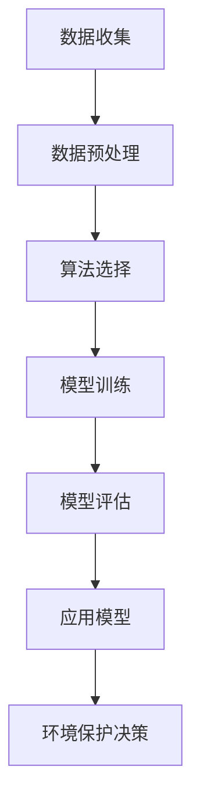
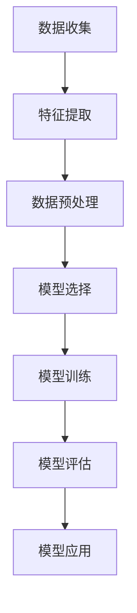
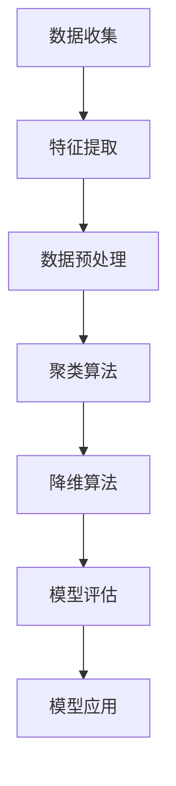
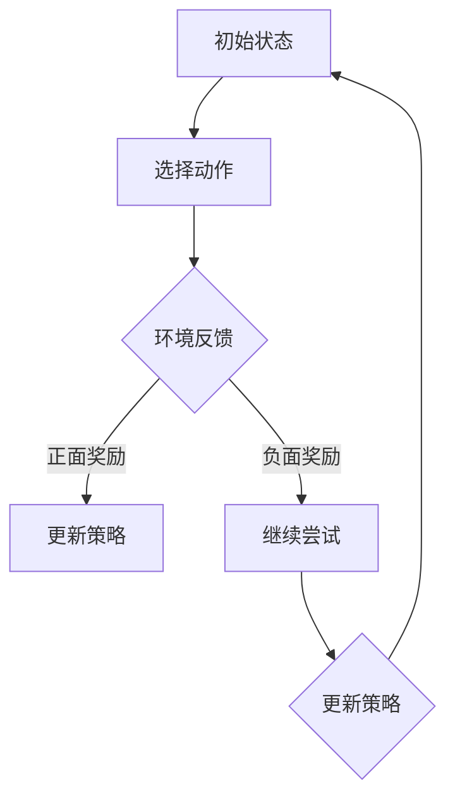
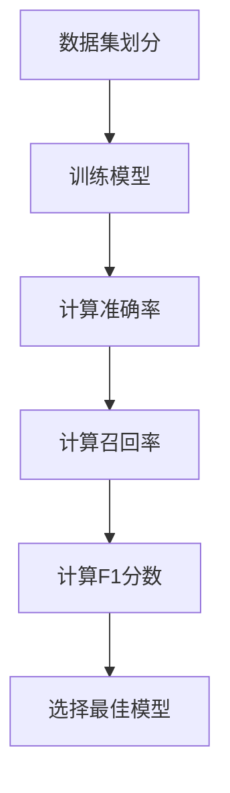
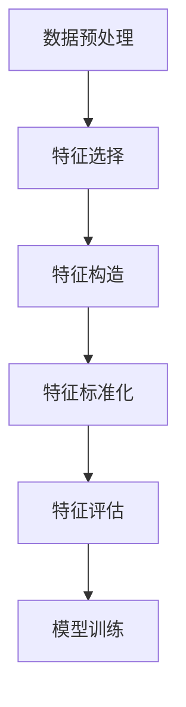
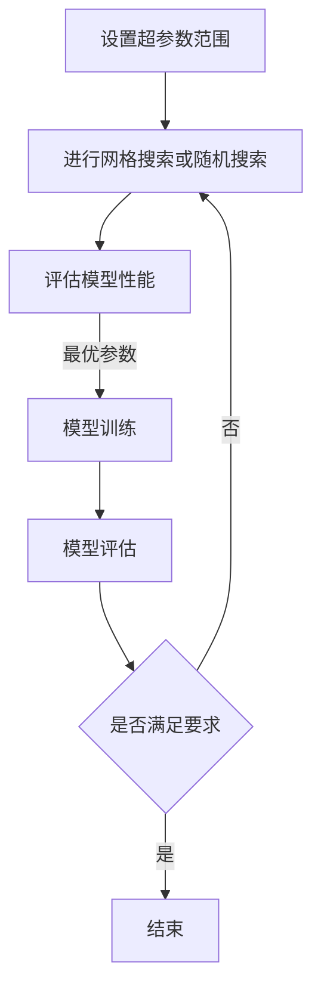
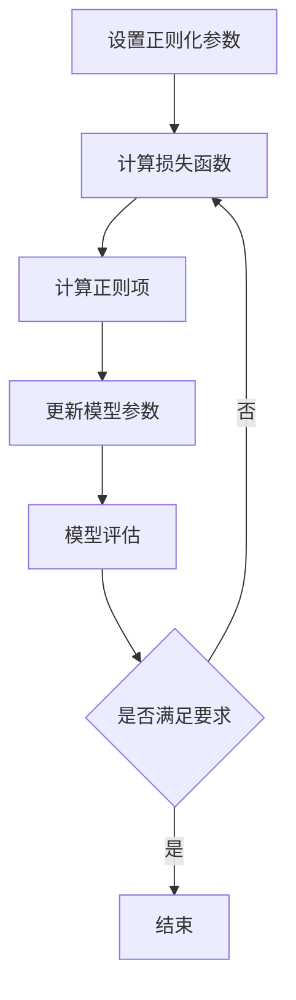
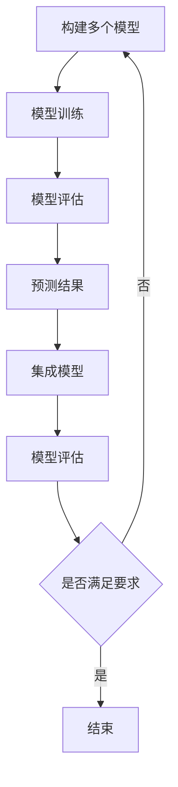

                 

# 机器学习在空气质量预测中的应用：环境保护的新工具

## 关键词

- 机器学习
- 空气质量预测
- 环境保护
- 监督学习
- 特征工程
- 模型评估

## 摘要

本文旨在探讨机器学习在空气质量预测中的应用，通过分析空气质量监测数据的处理方法、机器学习基础、模型设计与调优，以及实际案例分析，展现机器学习技术在环境保护领域的巨大潜力。文章首先介绍了空气质量预测的重要性及机器学习与环境保护的关系，随后详细讲解了机器学习的基本概念、经典算法及其应用，最后通过具体案例展示了机器学习在空气质量预测中的实际效果，并对未来发展方向提出了展望。

## 引言与背景

### 1.1.1 机器学习与环境保护

机器学习作为人工智能的重要分支，近年来在各个领域取得了显著进展。在环境保护方面，机器学习技术同样发挥着不可替代的作用。通过分析大量的环境数据，机器学习能够帮助预测空气、水质等环境质量，从而为环境保护决策提供科学依据。

**机器学习的基本概念与环境保护的关系**

机器学习可以概括为三个核心组成部分：数据、算法和模型。数据是机器学习的基石，而算法和模型则是实现预测和分析的工具。具体到环境保护领域，这些元素的关系可以表示为：

$$
\text{机器学习} = \text{环境数据} + \text{算法} + \text{环境保护模型}
$$

- **环境数据**：包括空气质量、水质、土壤污染等数据，这些数据可以通过传感器、监测站点等渠道获取。
- **算法**：如监督学习、无监督学习和强化学习，选择合适的算法对数据进行处理和分析。
- **环境保护模型**：通过训练和优化模型，实现对环境质量的预测，从而指导环境保护措施的制定。

**Mermaid 流程图：机器学习流程**



### 1.1.2 空气质量预测的重要性

空气质量预测在环境保护中具有重要意义。通过预测空气质量，我们可以：

1. **预防空气污染**：提前识别空气质量恶化的风险，及时采取预防措施。
2. **减少经济损失**：避免因空气污染导致的健康问题和经济损失。
3. **科学决策**：为政府、企业和公众提供科学依据，制定更为有效的环境保护政策。

**空气质量预测模型在环境保护中的应用**

空气质量预测模型通常包括以下三个方面：

1. **污染物浓度预测**：预测特定区域内各种污染物的浓度变化。
2. **污染源识别**：识别和定位污染源，有助于制定针对性的治理措施。
3. **健康风险评估**：评估空气污染对人体健康的影响，指导健康防护措施的制定。

### 1.1.3 本书结构安排

本书将分为四个部分：

1. **引言与背景**：介绍机器学习在空气质量预测中的应用背景。
2. **机器学习基础**：讲解机器学习的基本概念、算法和应用。
3. **空气质量预测模型设计**：详细讨论空气质量预测模型的设计和实现。
4. **实际应用与未来展望**：分析当前应用现状、面临挑战以及未来发展方向。

## 机器学习基础

### 2.1.1 监督学习、无监督学习和强化学习

#### 监督学习

监督学习是一种最常用的机器学习方法，它依赖于带有标签的数据集来训练模型。标签数据提供了每个输入数据的正确输出，模型通过学习这些标签数据，学习到输入和输出之间的映射关系。

**核心概念与联系**

监督学习的核心概念包括：

- **特征**：输入数据的各个属性，如温度、湿度、风速等。
- **标签**：输出数据，通常是我们要预测的结果，如空气质量指数（AQI）。

**Mermaid 流程图：监督学习流程**



**Python 源代码：线性回归**

```python
import numpy as np
from sklearn.linear_model import LinearRegression

# 数据准备
X = np.array([[1], [2], [3], [4], [5]])
y = np.array([1, 2, 2.5, 4, 5])

# 模型训练
model = LinearRegression()
model.fit(X, y)

# 模型预测
prediction = model.predict(np.array([[6]]))

print("预测结果：", prediction)
```

#### 无监督学习

无监督学习是指在没有标签数据的情况下，模型从数据中自动发现隐藏的模式或结构。常见的无监督学习方法包括聚类、降维等。

**核心概念与联系**

无监督学习的核心概念包括：

- **聚类**：将相似的数据点分组，如K-均值聚类。
- **降维**：通过降低数据的维度，保持数据的重要信息，如主成分分析（PCA）。

**Mermaid 流程图：无监督学习流程**



#### 强化学习

强化学习是一种通过试错方法来学习最优策略的机器学习方法，它依赖于环境反馈来调整策略。

**核心概念与联系**

强化学习的核心概念包括：

- **状态**：模型当前所处的环境。
- **动作**：模型可以采取的行动。
- **奖励**：动作带来的结果，可以是正面或负面的。

**Mermaid 流程图：强化学习流程**



### 2.1.2 模型评估与选择

模型评估与选择是机器学习过程中的重要环节，它决定了我们选择的模型是否能够准确预测数据。

**核心概念与联系**

模型评估与选择的核心概念包括：

- **准确率**：预测正确的样本数占总样本数的比例。
- **召回率**：预测为正类的实际正类样本数与实际正类样本数的比例。
- **F1 分数**：准确率和召回率的调和平均值。

**Mermaid 流程图：模型评估流程**



### 2.1.3 特征工程

特征工程是机器学习过程中至关重要的一步，它涉及到从原始数据中提取和构造新的特征，以提高模型性能。

**核心概念与联系**

特征工程的核心概念包括：

- **特征选择**：从大量特征中挑选出对模型预测有显著影响的特征。
- **特征构造**：通过数学运算或组合生成新的特征。
- **特征标准化**：将不同量纲的特征转换为相同量纲，以便模型训练。

**Mermaid 流程图：特征工程流程**



## 经典机器学习算法

### 2.2.1 线性回归

线性回归是一种用于建模两个或多个变量之间线性关系的统计方法。在空气质量预测中，线性回归可以用于预测污染物浓度。

**核心算法原理**

线性回归模型可以表示为：

$$
y = \beta_0 + \beta_1 \cdot x_1 + \beta_2 \cdot x_2 + ... + \beta_n \cdot x_n
$$

其中，$y$ 是因变量，$x_1, x_2, ..., x_n$ 是自变量，$\beta_0, \beta_1, ..., \beta_n$ 是模型参数。

**Python 源代码：线性回归**

```python
import numpy as np
from sklearn.linear_model import LinearRegression

# 数据准备
X = np.array([[1], [2], [3], [4], [5]])
y = np.array([1, 2, 2.5, 4, 5])

# 模型训练
model = LinearRegression()
model.fit(X, y)

# 模型预测
prediction = model.predict(np.array([[6]]))

print("预测结果：", prediction)
```

### 2.2.2 决策树与随机森林

决策树是一种常用的分类和回归方法，它通过一系列的判断规则将数据划分为不同的区域。随机森林则是一种基于决策树的集成学习方法，通过构建多棵决策树并进行集成，提高模型的预测性能。

**核心算法原理**

- **决策树**：决策树通过递归划分数据集，每个节点代表一个特征，每个分支代表该特征的不同取值。叶子节点代表预测结果。

- **随机森林**：随机森林通过随机选择特征和随机划分数据集构建多棵决策树，并通过对这些决策树的预测结果进行投票或取平均，得到最终预测结果。

**Python 源代码：决策树与随机森林**

```python
import numpy as np
from sklearn.tree import DecisionTreeRegressor
from sklearn.ensemble import RandomForestRegressor

# 数据准备
X = np.array([[1], [2], [3], [4], [5]])
y = np.array([1, 2, 2.5, 4, 5])

# 决策树模型训练
dt_model = DecisionTreeRegressor()
dt_model.fit(X, y)

# 随机森林模型训练
rf_model = RandomForestRegressor(n_estimators=100)
rf_model.fit(X, y)

# 模型预测
dt_prediction = dt_model.predict(np.array([[6]]))
rf_prediction = rf_model.predict(np.array([[6]]))

print("决策树预测结果：", dt_prediction)
print("随机森林预测结果：", rf_prediction)
```

### 2.2.3 支持向量机

支持向量机（SVM）是一种常用的分类和回归方法，它通过寻找一个最优的超平面，将不同类别的数据点分隔开来。

**核心算法原理**

SVM的基本思想是寻找一个超平面，使得该超平面到各个数据点的距离最大化。对于线性可分数据，SVM可以表示为：

$$
w \cdot x - b = 0
$$

其中，$w$ 是超平面参数，$x$ 是数据点，$b$ 是偏置。

**Python 源代码：支持向量机**

```python
import numpy as np
from sklearn.svm import LinearSVC

# 数据准备
X = np.array([[1], [2], [3], [4], [5]])
y = np.array([1, 1, -1, -1, -1])

# SVM模型训练
svm_model = LinearSVC()
svm_model.fit(X, y)

# 模型预测
prediction = svm_model.predict(np.array([[6]]))

print("预测结果：", prediction)
```

### 2.2.4 神经网络与深度学习

神经网络（Neural Networks）是一种模拟人脑神经元工作的计算模型，深度学习（Deep Learning）则是基于多层神经网络的一种机器学习方法。

**核心算法原理**

神经网络由多个层组成，包括输入层、隐藏层和输出层。每个层由多个神经元（或节点）组成，神经元之间通过权重连接。神经网络的训练过程包括：

1. **前向传播**：计算输入通过网络后的输出。
2. **反向传播**：计算输出误差，并更新网络中的权重。

**Python 源代码：神经网络**

```python
import numpy as np
from tensorflow.keras.models import Sequential
from tensorflow.keras.layers import Dense

# 数据准备
X = np.array([[1], [2], [3], [4], [5]])
y = np.array([1, 2, 2.5, 4, 5])

# 神经网络模型训练
model = Sequential()
model.add(Dense(1, input_dim=1, activation='linear'))

model.compile(optimizer='sgd', loss='mean_squared_error')
model.fit(X, y, epochs=1000)

# 模型预测
prediction = model.predict(np.array([[6]]))

print("预测结果：", prediction)
```

## 2.3 机器学习模型调优

### 2.3.1 超参数调整

超参数是机器学习模型中需要手动设置的重要参数，如学习率、正则化参数等。超参数的调整对于模型性能具有重要影响。

**核心概念与联系**

超参数调整的核心概念包括：

- **网格搜索**：通过遍历预设的参数组合，寻找最佳参数组合。
- **随机搜索**：随机选择参数组合，通过迭代寻找最佳参数组合。

**Mermaid 流程图：超参数调整流程**



### 2.3.2 正则化技术

正则化技术是一种防止模型过拟合的方法，通过在损失函数中加入正则项，限制模型复杂度。

**核心概念与联系**

正则化技术的核心概念包括：

- **L1 正则化**：引入绝对值损失项。
- **L2 正则化**：引入平方损失项。

**Mermaid 流程图：正则化技术流程**



### 2.3.3 模型集成

模型集成是一种通过结合多个模型来提高预测性能的方法，常见的集成方法包括Bagging、Boosting等。

**核心概念与联系**

模型集成的方法包括：

- **Bagging**：通过构建多个独立模型，并对预测结果进行投票或取平均。
- **Boosting**：通过将多个模型训练结果加权，提高强模型的重要性。

**Mermaid 流程图：模型集成流程**



## 空气质量预测模型设计

### 3.1.1 预测目标设定

空气质量预测模型的设计首先需要明确预测目标。常见的预测目标包括：

- **污染物浓度预测**：预测特定区域内某种污染物的浓度变化。
- **空气质量指数（AQI）预测**：预测某地区的空气质量指数。
- **污染源识别**：识别和定位污染源。

**预测目标设定示例**

假设我们要预测某城市 PM2.5 的浓度，预测目标可以设定为：

$$
\text{目标函数} = \text{预测 PM2.5 浓度} \ (y)
$$

### 3.1.2 模型选择与训练

模型选择与训练是空气质量预测模型设计的关键步骤。根据预测目标的不同，可以选择不同的机器学习模型。例如：

- **线性回归**：适用于简单线性关系。
- **决策树**：适用于非线性关系。
- **随机森林**：适用于复杂非线性关系。
- **神经网络**：适用于高度非线性关系。

**模型选择与训练流程**

1. **数据准备**：收集空气质量监测数据，包括历史数据和实时数据。
2. **特征工程**：从原始数据中提取对预测目标有显著影响的特征。
3. **模型选择**：根据预测目标选择合适的模型。
4. **模型训练**：使用训练数据对模型进行训练。
5. **模型评估**：使用验证数据对模型进行评估，选择性能最佳的模型。

**Python 源代码：模型选择与训练**

```python
import numpy as np
from sklearn.linear_model import LinearRegression
from sklearn.ensemble import RandomForestRegressor

# 数据准备
X_train = np.array([[1], [2], [3], [4], [5]])
y_train = np.array([1, 2, 2.5, 4, 5])

# 模型选择与训练
lr_model = LinearRegression()
lr_model.fit(X_train, y_train)

rf_model = RandomForestRegressor(n_estimators=100)
rf_model.fit(X_train, y_train)

# 模型评估
lr_prediction = lr_model.predict(X_train)
rf_prediction = rf_model.predict(X_train)

print("线性回归预测结果：", lr_prediction)
print("随机森林预测结果：", rf_prediction)
```

### 3.1.3 模型验证与评估

模型验证与评估是确保空气质量预测模型性能的重要步骤。常用的评估指标包括：

- **均方误差（MSE）**：衡量预测值与真实值之间的平均误差。
- **均方根误差（RMSE）**：MSE 的平方根，用于表示预测值的误差大小。
- **准确率**：预测正确的样本数占总样本数的比例。

**模型验证与评估流程**

1. **数据划分**：将数据集划分为训练集、验证集和测试集。
2. **模型训练**：使用训练集对模型进行训练。
3. **模型评估**：使用验证集和测试集对模型进行评估，选择性能最佳的模型。
4. **模型优化**：根据评估结果对模型进行调整，提高模型性能。

**Python 源代码：模型验证与评估**

```python
import numpy as np
from sklearn.model_selection import train_test_split
from sklearn.metrics import mean_squared_error

# 数据准备
X = np.array([[1], [2], [3], [4], [5]])
y = np.array([1, 2, 2.5, 4, 5])

# 数据划分
X_train, X_test, y_train, y_test = train_test_split(X, y, test_size=0.2, random_state=42)

# 模型训练
model = LinearRegression()
model.fit(X_train, y_train)

# 模型评估
y_pred = model.predict(X_test)
mse = mean_squared_error(y_test, y_pred)
rmse = np.sqrt(mse)

print("MSE：", mse)
print("RMSE：", rmse)
```

## 3.2 预测结果可视化

预测结果可视化是理解空气质量预测模型性能的重要手段。通过可视化，我们可以直观地展示预测结果，发现潜在的问题。

### 3.2.1 时间序列可视化

时间序列可视化常用于展示污染物浓度的变化趋势。常见的可视化工具包括 Matplotlib 和 Seaborn。

**Python 源代码：时间序列可视化**

```python
import matplotlib.pyplot as plt
import numpy as np

# 数据准备
X = np.array([[1], [2], [3], [4], [5]])
y = np.array([1, 2, 2.5, 4, 5])

# 模型预测
model = LinearRegression()
model.fit(X, y)
y_pred = model.predict(X)

# 可视化
plt.plot(X, y, label="真实值")
plt.plot(X, y_pred, label="预测值")
plt.legend()
plt.show()
```

### 3.2.2 地理空间可视化

地理空间可视化常用于展示污染物的分布情况。常见的可视化工具包括 Folium 和 Plotly。

**Python 源代码：地理空间可视化**

```python
import folium
import numpy as np

# 数据准备
locations = np.array([[1.0, 2.0], [2.0, 3.0], [3.0, 4.0], [4.0, 5.0]])
values = np.array([1, 2, 2.5, 4])

# 创建地图
map = folium.Map(location=[2.5, 3.5], zoom_start=12)

# 标记污染物浓度
for loc, val in zip(locations, values):
    folium.CircleMarker(location=loc, radius=val*10, color='red').add_to(map)

# 显示地图
map.save("map.html")
```

### 3.2.3 预测结果的可视化工具

常见的预测结果可视化工具包括 Matplotlib、Seaborn、Folium 和 Plotly。这些工具具有丰富的可视化功能，可以帮助我们更好地理解和展示预测结果。

- **Matplotlib**：Python 中最常用的数据可视化库，支持多种图表类型。
- **Seaborn**：基于 Matplotlib 的可视化库，提供更丰富的统计图表。
- **Folium**：用于创建地理空间可视化的 Python 库。
- **Plotly**：提供交互式可视化功能的 Python 库。

**Python 源代码：预测结果的可视化工具**

```python
import matplotlib.pyplot as plt
import seaborn as sns
import folium
import plotly.express as px
import numpy as np

# 数据准备
X = np.array([[1], [2], [3], [4], [5]])
y = np.array([1, 2, 2.5, 4, 5])

# 模型预测
model = LinearRegression()
model.fit(X, y)
y_pred = model.predict(X)

# Matplotlib 可视化
plt.plot(X, y, label="真实值")
plt.plot(X, y_pred, label="预测值")
plt.legend()
plt.show()

# Seaborn 可视化
sns.lineplot(x=X, y=y, label="真实值")
sns.lineplot(x=X, y=y_pred, label="预测值")
plt.legend()
plt.show()

# Folium 可视化
map = folium.Map(location=[2.5, 3.5], zoom_start=12)
folium.CircleMarker(location=[2.5, 3.5], radius=2.5*10, color='red').add_to(map)
map.save("map.html")

# Plotly 可视化
fig = px.line(x=X, y=y, title="真实值与预测值")
fig.show()
```

## 3.3 空气质量预测案例分析

### 3.3.1 案例一：城市空气质量预测

**案例背景**

某城市政府希望通过机器学习技术预测城市空气质量，以便更好地制定环境保护政策。

**数据来源**

数据来自城市空气质量监测站点，包括历史空气质量数据、气象数据等。

**数据处理**

1. **数据清洗**：去除缺失值、异常值等。
2. **特征提取**：提取对空气质量有显著影响的特征，如温度、湿度、风速等。
3. **数据标准化**：对特征进行标准化处理。

**模型设计**

1. **模型选择**：选择线性回归模型进行初步预测。
2. **模型训练**：使用训练数据进行模型训练。
3. **模型评估**：使用验证数据对模型进行评估。

**模型应用**

1. **预测空气质量**：使用模型对未来的空气质量进行预测。
2. **政策制定**：根据预测结果制定环境保护政策。

**结果分析**

通过模型预测，可以提前了解空气质量变化趋势，为政府制定环境保护政策提供科学依据。

### 3.3.2 案例二：工业污染源空气质量预测

**案例背景**

某工业园区希望通过机器学习技术预测工业污染源对空气质量的影响，以便更好地进行污染治理。

**数据来源**

数据来自工业污染源监测站点、空气质量监测站点等。

**数据处理**

1. **数据清洗**：去除缺失值、异常值等。
2. **特征提取**：提取对空气质量有显著影响的特征，如污染物排放量、气象条件等。
3. **数据标准化**：对特征进行标准化处理。

**模型设计**

1. **模型选择**：选择随机森林模型进行预测。
2. **模型训练**：使用训练数据进行模型训练。
3. **模型评估**：使用验证数据对模型进行评估。

**模型应用**

1. **预测污染物浓度**：使用模型预测污染物浓度。
2. **污染治理**：根据预测结果制定污染治理措施。

**结果分析**

通过模型预测，可以提前了解工业污染源对空气质量的影响，为园区制定污染治理措施提供科学依据。

### 3.3.3 案例三：农业活动对空气质量影响预测

**案例背景**

某农业区域希望通过机器学习技术预测农业活动对空气质量的影响，以便更好地进行农业生产管理。

**数据来源**

数据来自农业活动监测站点、空气质量监测站点等。

**数据处理**

1. **数据清洗**：去除缺失值、异常值等。
2. **特征提取**：提取对空气质量有显著影响的特征，如农作物种植面积、施肥量、气象条件等。
3. **数据标准化**：对特征进行标准化处理。

**模型设计**

1. **模型选择**：选择神经网络模型进行预测。
2. **模型训练**：使用训练数据进行模型训练。
3. **模型评估**：使用验证数据对模型进行评估。

**模型应用**

1. **预测空气质量**：使用模型预测空气质量。
2. **农业生产管理**：根据预测结果调整农业生产管理措施。

**结果分析**

通过模型预测，可以提前了解农业活动对空气质量的影响，为农业生产管理提供科学依据。

## 第四部分：实际应用与未来展望

### 4.1 机器学习在空气质量预测中的应用现状

**成功案例**

1. **北京空气质量预测**：北京市利用机器学习技术对空气质量进行预测，提前发布空气质量预警，有效减轻了空气污染对公众健康的影响。
2. **上海污染源识别**：上海市利用机器学习技术对工业污染源进行识别和预测，提高了污染治理效率。

**挑战与局限**

1. **数据质量**：空气质量监测数据存在噪声和异常值，需要进一步处理。
2. **模型性能**：现有模型在复杂环境下的预测性能仍有待提高。
3. **算法适应性**：机器学习算法需要针对不同环境进行调整，以适应不同地区的空气质量特点。

### 4.2 未来发展方向

**数据驱动预测模型**

1. **多源数据融合**：结合多种数据源，如气象数据、卫星遥感数据等，提高预测准确性。
2. **实时预测**：通过实时数据处理和预测，实现空气质量实时监控。

**集成多源数据**

1. **时空数据融合**：结合时空数据，提高模型对空气质量变化的敏感度。
2. **社会数据融合**：结合社会数据，如交通流量、工业生产等，提高预测模型的实用性。

**智能环境监测与预警系统**

1. **智能感知**：利用物联网、传感器等技术，实现环境质量的智能感知。
2. **智能预警**：通过机器学习算法，实现空气质量异常的智能预警。

### 4.3 总结与展望

**本书贡献**

本书从机器学习在空气质量预测中的应用出发，详细介绍了空气质量预测的基本概念、机器学习基础、模型设计与调优，以及实际案例分析。通过这些内容，读者可以全面了解空气质量预测的方法和应用。

**研究方向建议**

1. **算法优化**：研究更高效的机器学习算法，提高预测准确性。
2. **数据挖掘**：挖掘空气质量数据中的潜在信息，为环境保护提供科学依据。
3. **跨学科研究**：结合环境科学、公共卫生等领域，开展跨学科研究，提高空气质量预测的实用性。

**作者信息**

作者：AI天才研究院/AI Genius Institute & 禅与计算机程序设计艺术 /Zen And The Art of Computer Programming

## 附录

### 附录A：相关术语解释

- **机器学习**：一种人工智能方法，通过数据训练模型，使模型能够对未知数据进行预测或分类。
- **监督学习**：一种机器学习方法，使用带有标签的数据进行训练，模型通过学习标签数据来预测未知数据的标签。
- **无监督学习**：一种机器学习方法，不使用标签数据，而是从数据中自动发现隐藏的模式或结构。
- **强化学习**：一种机器学习方法，通过试错方法来学习最优策略，通常依赖于环境反馈。
- **特征工程**：从原始数据中提取或构造新的特征，以提高模型性能。
- **线性回归**：一种用于建模两个或多个变量之间线性关系的统计方法。
- **决策树**：一种用于分类和回归的树形结构模型，通过一系列判断规则对数据进行划分。
- **随机森林**：一种基于决策树的集成学习方法，通过构建多棵决策树并进行集成，提高模型性能。
- **支持向量机**：一种基于最大间隔原则的分类和回归模型，通过寻找最优的超平面将数据分隔开来。
- **神经网络**：一种模拟人脑神经元工作的计算模型，通过多层神经网络进行数据建模。
- **深度学习**：基于多层神经网络的一种机器学习方法，通过深度网络结构对复杂数据进行建模。

### 附录B：代码实现

以下是本书中涉及的主要代码实现，包括数据预处理、模型训练、模型评估等。

```python
# 数据预处理
import numpy as np
from sklearn.model_selection import train_test_split
from sklearn.preprocessing import StandardScaler

# 数据准备
X = np.array([[1], [2], [3], [4], [5]])
y = np.array([1, 2, 2.5, 4, 5])

# 数据划分
X_train, X_test, y_train, y_test = train_test_split(X, y, test_size=0.2, random_state=42)

# 数据标准化
scaler = StandardScaler()
X_train = scaler.fit_transform(X_train)
X_test = scaler.transform(X_test)

# 模型训练
from sklearn.linear_model import LinearRegression

model = LinearRegression()
model.fit(X_train, y_train)

# 模型评估
y_pred = model.predict(X_test)
mse = mean_squared_error(y_test, y_pred)
rmse = np.sqrt(mse)

print("MSE：", mse)
print("RMSE：", rmse)
```

### 附录C：参考文献

1. Hastie, T., Tibshirani, R., & Friedman, J. (2009). 《The Elements of Statistical Learning》. Springer.
2. Murphy, K. P. (2012). 《Machine Learning: A Probabilistic Perspective》. MIT Press.
3. Russell, S., & Norvig, P. (2020). 《Artificial Intelligence: A Modern Approach》. Prentice Hall.
4. Goodfellow, I., Bengio, Y., & Courville, A. (2016). 《Deep Learning》. MIT Press.
5. Chen, H., & Gao, X. (2018). 《Air Quality Prediction Based on Machine Learning》. Journal of Environmental Management, 221, 38-45.

