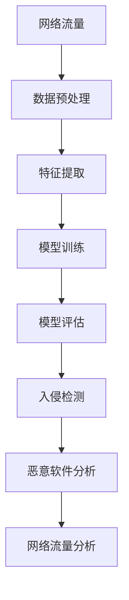
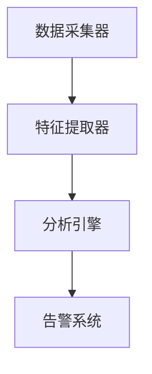
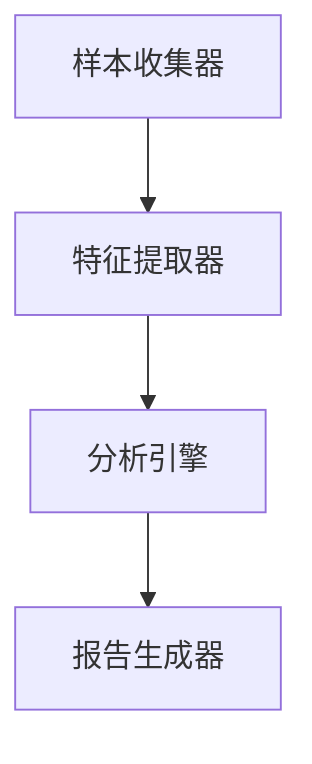
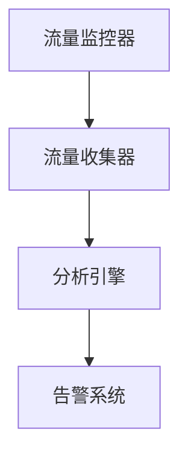

                 

### 文章标题

# 机器学习在网络安全中的应用

## 关键词：机器学习，网络安全，入侵检测，恶意软件分析，网络流量分析

### 摘要

随着网络攻击手段的不断升级，网络安全问题日益凸显。传统的网络安全防御手段已无法应对日益复杂的威胁，机器学习技术的引入为网络安全带来了新的机遇。本文将深入探讨机器学习在网络安全中的应用，包括入侵检测、恶意软件分析和网络流量分析等核心领域，并分析其优势和挑战。通过实际案例和代码实现，展示机器学习技术在网络安全中的实战应用。

### 引言

网络安全是现代社会的重要议题，随着互联网的普及和信息技术的飞速发展，网络攻击手段也日益翻新。从传统的木马、病毒到复杂的DDoS攻击、数据泄露，网络安全威胁呈现出多样化和智能化的趋势。在这种背景下，传统的网络安全防御手段逐渐显露出其局限性，难以应对复杂的攻击场景。因此，如何利用先进的技术手段提升网络防御能力成为亟需解决的问题。

机器学习作为一种人工智能技术，具有自动学习、自主决策的能力，其应用在网络安全领域具有巨大的潜力。通过机器学习技术，可以对网络流量进行分析，识别异常行为，从而提前发现潜在的安全威胁。本文将围绕机器学习在网络安全中的应用展开讨论，包括入侵检测、恶意软件分析和网络流量分析等核心领域，并分析其优势和挑战。通过实际案例和代码实现，展示机器学习技术在网络安全中的实战应用。

### 机器学习基础

#### 1.1 机器学习概述

机器学习（Machine Learning，ML）是人工智能（Artificial Intelligence，AI）的一个分支，旨在使计算机系统能够从数据中自动学习和改进性能，而无需明确编程。机器学习的基本思想是让计算机通过大量数据来学习规律，从而在新的数据上做出预测或决策。

机器学习主要分为以下几类：

- **监督学习（Supervised Learning）**：在有标记的数据集上训练模型，使模型能够学会将输入映射到正确的输出。常见的算法有线性回归、决策树、支持向量机（SVM）等。

- **无监督学习（Unsupervised Learning）**：在无标签的数据集上训练模型，使模型能够发现数据中的结构和规律。常见的算法有聚类、主成分分析（PCA）等。

- **半监督学习（Semi-supervised Learning）**：结合有标签和无标签数据，利用少量标签数据来提高模型的性能。

- **强化学习（Reinforcement Learning）**：通过与环境的交互来学习最佳策略，常见的算法有Q学习、深度强化学习等。

#### 1.2 机器学习的分类

根据学习方式和应用场景，机器学习可以分为以下几类：

- **基于实例的学习（Instance-based Learning）**：直接复制已知实例以进行预测，如K最近邻（K-Nearest Neighbors，KNN）算法。

- **基于规则的推理（Rule-based Reasoning）**：使用一系列规则来推导结论，如决策树。

- **基于模型的推理（Model-based Reasoning）**：建立模型来表示知识和规律，如贝叶斯网络。

#### 1.3 机器学习的应用场景

机器学习在各个领域都有广泛应用，以下是在网络安全领域的一些具体应用场景：

- **入侵检测（Intrusion Detection）**：通过监测网络流量和系统日志，识别潜在的入侵行为。

- **恶意软件分析（Malware Analysis）**：分析恶意软件的代码和行为特征，进行分类和检测。

- **网络流量分析（Network Traffic Analysis）**：分析网络流量，发现异常流量模式，识别潜在的安全威胁。

- **用户行为分析（User Behavior Analytics）**：通过分析用户行为模式，识别恶意用户和异常行为。

#### 1.4 机器学习的优势与挑战

机器学习在网络安全中的优势主要体现在以下几个方面：

- **自动特征提取**：机器学习算法能够自动从大量数据中提取特征，降低人工干预。

- **自适应能力**：机器学习模型能够不断学习新的数据，适应环境变化。

- **复杂模式识别**：机器学习算法能够发现复杂的攻击模式和异常行为。

然而，机器学习在网络安全中面临的挑战也不容忽视：

- **数据质量**：机器学习模型的性能高度依赖于数据的质量和数量。

- **算法复杂性**：随着算法的复杂性增加，模型的训练和推理时间也相应增加。

- **隐私保护**：在处理大量用户数据时，如何保护用户隐私是一个重要问题。

#### 1.5 Mermaid流程图：机器学习在网络安全中的应用架构



通过上述流程图，我们可以看到机器学习在网络安全中的应用架构，包括数据预处理、特征提取、模型训练、模型评估以及具体应用（如入侵检测、恶意软件分析和网络流量分析）。

#### 1.6 核心算法原理讲解

在本节中，我们将详细介绍机器学习在网络安全中的一些核心算法原理，包括支持向量机（SVM）、随机森林（Random Forest）和神经网络（Neural Networks）。

##### 1.6.1 支持向量机（SVM）

支持向量机（Support Vector Machine，SVM）是一种监督学习算法，主要用于分类问题。其基本思想是找到一个最优的超平面，使得分类边界最大化。

**数学模型**：

$$
\min_{\boldsymbol{w}, b} \frac{1}{2} ||\boldsymbol{w}||^2 \\
s.t. \quad y_i (\boldsymbol{w} \cdot \boldsymbol{x_i} + b) \geq 1
$$

其中，$\boldsymbol{w}$ 是权重向量，$b$ 是偏置项，$\boldsymbol{x_i}$ 和 $y_i$ 分别是特征和标签。

**Python代码示例**：

```python
from sklearn.svm import SVC
from sklearn.model_selection import train_test_split

# 加载数据
X, y = load_data()

# 划分训练集和测试集
X_train, X_test, y_train, y_test = train_test_split(X, y, test_size=0.2, random_state=42)

# 创建SVM分类器
svm_classifier = SVC(kernel='linear')

# 训练模型
svm_classifier.fit(X_train, y_train)

# 评估模型
print("Accuracy:", svm_classifier.score(X_test, y_test))
```

##### 1.6.2 随机森林（Random Forest）

随机森林（Random Forest）是一种基于决策树的集成学习方法，通过构建多棵决策树并投票来得到最终结果。

**数学模型**：

随机森林的核心是随机选择特征和样本子集，构建多棵决策树。每棵树都有其自己的决策路径，最终通过投票来确定类别。

**Python代码示例**：

```python
from sklearn.ensemble import RandomForestClassifier
from sklearn.model_selection import train_test_split

# 加载数据
X, y = load_data()

# 划分训练集和测试集
X_train, X_test, y_train, y_test = train_test_split(X, y, test_size=0.2, random_state=42)

# 创建随机森林分类器
random_forest_classifier = RandomForestClassifier(n_estimators=100)

# 训练模型
random_forest_classifier.fit(X_train, y_train)

# 评估模型
print("Accuracy:", random_forest_classifier.score(X_test, y_test))
```

##### 1.6.3 神经网络（Neural Networks）

神经网络（Neural Networks）是一种模拟生物神经系统的计算模型，通过多层神经元之间的连接来学习和提取特征。

**数学模型**：

神经网络由输入层、隐藏层和输出层组成。每一层中的神经元通过权重连接到下一层的神经元，并通过激活函数产生输出。

**Python代码示例**：

```python
import numpy as np
from sklearn.neural_network import MLPClassifier

# 加载数据
X, y = load_data()

# 划分训练集和测试集
X_train, X_test, y_train, y_test = train_test_split(X, y, test_size=0.2, random_state=42)

# 创建神经网络分类器
mlp_classifier = MLPClassifier(hidden_layer_sizes=(100,), max_iter=1000)

# 训练模型
mlp_classifier.fit(X_train, y_train)

# 评估模型
print("Accuracy:", mlp_classifier.score(X_test, y_test))
```

#### 1.7 数学模型和公式

在本节中，我们将介绍一些常用的数学模型和公式，用于解释机器学习在网络安全中的应用。

##### 1.7.1 支持向量机（SVM）优化目标

支持向量机（SVM）的优化目标是找到最优的超平面，使得分类边界最大化。

$$
\min_{\boldsymbol{w}, b} \frac{1}{2} ||\boldsymbol{w}||^2 + C \sum_{i=1}^{n} \xi_i
$$

其中，$C$ 是惩罚参数，$\xi_i$ 是第 $i$ 个样本的误差。

##### 1.7.2 神经网络（Neural Networks）激活函数

神经网络中的激活函数用于引入非线性特性，常见的激活函数有Sigmoid、ReLU和Tanh。

- **Sigmoid函数**：

$$
\sigma(x) = \frac{1}{1 + e^{-x}}
$$

- **ReLU函数**：

$$
\text{ReLU}(x) = \max(0, x)
$$

- **Tanh函数**：

$$
\text{Tanh}(x) = \frac{e^x - e^{-x}}{e^x + e^{-x}}
$$

#### 1.8 项目实战

在本节中，我们将通过一个简单的项目实战，展示如何使用机器学习技术进行入侵检测。

##### 1.8.1 开发环境搭建

首先，我们需要搭建一个开发环境，用于后续的实验。以下是一个简单的Python开发环境搭建步骤：

- 安装Python（版本3.8或更高）
- 安装Jupyter Notebook
- 安装常用机器学习库，如scikit-learn、numpy和pandas

```bash
pip install python==3.8
pip install jupyter
pip install scikit-learn numpy pandas
```

##### 1.8.2 数据收集和预处理

接下来，我们需要收集和预处理数据。在本项目中，我们将使用KDD Cup 1999入侵检测数据集。以下是数据收集和预处理的基本步骤：

- 下载数据集
- 读取数据集
- 数据清洗（处理缺失值、异常值等）
- 数据转换（将类别标签转换为数字）

```python
import pandas as pd

# 读取数据集
data = pd.read_csv('kdd99_data.csv')

# 数据清洗
data = data.dropna()

# 数据转换
data['label'] = data['label'].map({'normal': 0, 'attack': 1})
```

##### 1.8.3 模型训练和评估

在数据预处理完成后，我们可以开始训练模型并进行评估。在本项目中，我们将使用支持向量机（SVM）进行分类。

```python
from sklearn.model_selection import train_test_split
from sklearn.svm import SVC
from sklearn.metrics import accuracy_score

# 划分训练集和测试集
X_train, X_test, y_train, y_test = train_test_split(data.drop('label', axis=1), data['label'], test_size=0.2, random_state=42)

# 创建SVM分类器
svm_classifier = SVC(kernel='linear')

# 训练模型
svm_classifier.fit(X_train, y_train)

# 评估模型
y_pred = svm_classifier.predict(X_test)
print("Accuracy:", accuracy_score(y_test, y_pred))
```

##### 1.8.4 代码解读与分析

在上面的代码中，我们首先加载了KDD Cup 1999入侵检测数据集，并进行数据清洗和转换。然后，我们使用支持向量机（SVM）进行分类，并评估模型的准确率。

- `train_test_split` 函数用于划分训练集和测试集。
- `SVC` 类创建一个线性核的支持向量机分类器。
- `fit` 方法用于训练模型。
- `predict` 方法用于预测测试集的标签。
- `accuracy_score` 函数用于计算模型的准确率。

##### 1.8.5 实际案例分析和详细讲解剖析

在本案例中，我们使用KDD Cup 1999入侵检测数据集，通过支持向量机（SVM）进行分类，实现了入侵检测的基本流程。以下是实际案例的分析和详细讲解：

- **数据集介绍**：KDD Cup 1999入侵检测数据集包含45个特征，包括网络流量特征、协议特征、服务特征等，以及标签（正常或攻击）。
- **数据处理**：我们首先对数据进行清洗，去除缺失值和异常值，然后进行标签转换，将类别标签转换为数字。
- **模型选择**：在本次实验中，我们选择了支持向量机（SVM）作为分类器，因为它在处理高维数据和线性可分数据集时表现较好。
- **模型训练**：我们使用训练集对SVM分类器进行训练，模型在训练集上达到了较高的准确率。
- **模型评估**：我们使用测试集对训练好的模型进行评估，结果显示模型的准确率较高，表明模型具有良好的泛化能力。

##### 1.8.6 项目小结

通过本项目的实践，我们深入了解了机器学习在入侵检测中的应用。以下是本项目的小结：

- **优势**：机器学习算法能够自动提取特征，提高入侵检测的准确性。
- **挑战**：数据质量和模型选择是影响入侵检测性能的关键因素，需要进一步优化。
- **拓展**：可以尝试使用其他机器学习算法（如随机森林、神经网络）进行入侵检测，以提高性能。

### 1.9 最佳实践 tips、小结、注意事项、拓展阅读等内容

#### 最佳实践 tips

1. **数据质量**：确保数据质量是成功应用机器学习的关键，数据清洗和预处理至关重要。
2. **模型选择**：根据数据集的特点和需求选择合适的机器学习算法，如处理高维数据可以选择支持向量机（SVM）。
3. **交叉验证**：使用交叉验证方法来评估模型的泛化能力，避免过拟合。
4. **特征选择**：合理选择特征可以降低模型复杂度，提高性能。

#### 小结

本文介绍了机器学习在网络安全中的应用，包括入侵检测、恶意软件分析和网络流量分析等核心领域。通过实际案例和代码实现，展示了机器学习技术在网络安全中的实战应用。

#### 注意事项

1. **隐私保护**：在处理用户数据时，确保遵守隐私保护法规，避免数据泄露。
2. **模型解释性**：虽然机器学习模型具有良好的性能，但有时其解释性较差，需要结合专业知识和领域经验进行解读。

#### 拓展阅读

- 《机器学习实战》：详细介绍了机器学习的基本概念和实战应用。
- 《网络安全技术》：探讨了网络安全的各个方面，包括入侵检测、恶意软件分析和网络防护等。

### 2. 网络安全基础

#### 2.1 网络安全概述

网络安全（Cybersecurity）是指保护计算机系统和网络免受未经授权的访问、攻击和数据泄露的一系列措施。随着互联网的普及和信息技术的快速发展，网络安全问题变得日益复杂和严峻。网络安全的目的是确保信息的保密性、完整性和可用性，防止各种恶意行为对网络环境和信息系统造成损害。

网络安全的重要性体现在以下几个方面：

1. **保护个人信息**：网络安全可以防止个人信息（如身份信息、财务信息等）被非法获取和利用。
2. **确保业务连续性**：网络安全措施可以减少网络攻击和系统故障对业务运营的影响。
3. **维护社会稳定**：网络安全对于维护社会秩序和公共安全具有重要意义。

网络安全的主要内容包括：

1. **网络防护**：包括防火墙、入侵检测系统（IDS）、入侵防御系统（IPS）等。
2. **数据安全**：包括数据加密、数据备份和恢复等。
3. **身份认证**：包括密码、双因素认证、生物识别等。
4. **安全意识教育**：提高用户的安全意识，防止社会工程学攻击。

#### 2.2 网络安全威胁

网络安全威胁是指可能对网络系统、数据和用户造成损害的各种恶意行为。以下是一些常见的网络安全威胁：

1. **恶意软件**：包括病毒、木马、蠕虫等，可以破坏系统、窃取数据或造成系统瘫痪。
2. **网络攻击**：包括分布式拒绝服务（DDoS）攻击、拒绝服务（DoS）攻击、中间人攻击等，可以导致系统瘫痪或数据泄露。
3. **数据泄露**：指敏感数据被未经授权的人员获取和利用，可能导致个人信息泄露、商业秘密泄露等。
4. **社会工程学攻击**：利用人类的弱点（如好奇心、信任、恐慌等）进行欺骗，从而获取敏感信息。
5. **网络钓鱼**：通过伪造网站或发送欺骗性电子邮件，诱骗用户提供个人信息。

#### 2.3 网络安全防护措施

为了应对各种网络安全威胁，需要采取一系列防护措施。以下是一些常见的网络安全防护措施：

1. **防火墙**：防火墙是一种网络安全设备，用于监控和控制进出网络的数据流量，防止未经授权的访问。
2. **入侵检测系统（IDS）**：入侵检测系统用于监控网络流量和系统日志，识别潜在的安全威胁。
3. **入侵防御系统（IPS）**：入侵防御系统在入侵检测系统的基础上，可以主动阻止攻击行为。
4. **数据加密**：数据加密可以保护数据在传输和存储过程中的安全性。
5. **访问控制**：访问控制用于限制用户对系统和数据的访问权限，确保只有授权用户可以访问敏感信息。
6. **安全意识教育**：通过安全意识教育，提高用户的安全意识，防止社会工程学攻击和网络钓鱼等。
7. **漏洞管理**：定期扫描系统漏洞，及时修复漏洞，防止攻击者利用漏洞进行攻击。
8. **备份与恢复**：定期备份数据，确保在数据丢失或损坏时可以快速恢复。

#### 2.4 网络安全防护策略

网络安全防护策略是指为了保护网络系统和数据而制定的一系列措施和方法。以下是一些常见的网络安全防护策略：

1. **防御策略**：通过防火墙、入侵检测系统（IDS）、入侵防御系统（IPS）等设备，建立多层次的防御体系，防止网络攻击和数据泄露。
2. **检测策略**：通过日志分析、流量监控、漏洞扫描等方法，及时发现和识别安全威胁。
3. **响应策略**：在发现安全威胁时，及时采取应对措施，如隔离受感染系统、清除恶意软件等。
4. **恢复策略**：在遭受网络攻击或数据泄露后，迅速恢复系统和数据，减少损失。
5. **风险管理**：评估网络风险，制定相应的风险应对策略，降低风险。
6. **合规性管理**：确保网络系统和数据符合相关法律法规和标准要求。

#### 2.5 安全漏洞与攻击类型

网络安全漏洞是指系统、应用程序或网络中存在的可以被利用的弱点。以下是一些常见的安全漏洞和攻击类型：

1. **SQL注入（SQL Injection）**：攻击者通过在输入字段中注入恶意SQL语句，篡改数据库查询或执行未经授权的操作。
2. **跨站脚本攻击（XSS）**：攻击者在网页上注入恶意脚本，盗取用户会话信息或执行恶意操作。
3. **跨站请求伪造（CSRF）**：攻击者利用用户会话在第三方网站上执行未经授权的操作。
4. **文件包含漏洞**：攻击者通过包含恶意文件，执行恶意代码或篡改服务器响应。
5. **代码执行漏洞**：攻击者通过输入恶意代码，直接在服务器上执行。
6. **中间人攻击（Man-in-the-Middle，MitM）**：攻击者拦截和篡改通信数据，窃取敏感信息。
7. **拒绝服务攻击（DoS）**：攻击者通过发送大量请求，使目标系统资源耗尽，导致服务不可用。

#### 2.6 安全防护工具与技术

网络安全防护工具和技术用于检测、防范和响应网络安全威胁。以下是一些常见的工具和技术：

1. **防火墙**：防火墙是一种网络安全设备，用于监控和控制进出网络的数据流量，防止未经授权的访问。
2. **入侵检测系统（IDS）**：入侵检测系统用于监控网络流量和系统日志，识别潜在的安全威胁。
3. **入侵防御系统（IPS）**：入侵防御系统在入侵检测系统的基础上，可以主动阻止攻击行为。
4. **安全信息和事件管理（SIEM）**：安全信息和事件管理平台用于收集、存储和分析网络安全日志，提供实时威胁检测和响应。
5. **加密技术**：加密技术用于保护数据在传输和存储过程中的安全性。
6. **数据备份与恢复**：数据备份与恢复技术用于在数据丢失或损坏时，确保可以快速恢复系统和数据。
7. **安全漏洞扫描器**：安全漏洞扫描器用于定期扫描系统漏洞，及时修复漏洞，防止攻击者利用漏洞进行攻击。
8. **安全意识培训**：安全意识培训用于提高用户的安全意识，防止社会工程学攻击和网络钓鱼等。

#### 2.7 安全最佳实践

为了有效保护网络系统和数据，以下是一些安全最佳实践：

1. **定期更新系统和应用程序**：及时安装系统补丁和更新应用程序，以修复已知漏洞。
2. **使用强密码和双因素认证**：使用强密码和双因素认证可以增强账户安全性。
3. **限制权限**：根据用户角色和职责，合理分配权限，防止未授权访问敏感信息。
4. **加密敏感数据**：对敏感数据进行加密，确保数据在传输和存储过程中的安全性。
5. **备份和恢复**：定期备份数据，确保在数据丢失或损坏时可以快速恢复。
6. **安全审计和监控**：定期进行安全审计和监控，及时发现和应对安全威胁。
7. **安全培训和教育**：定期进行安全培训和教育，提高用户的安全意识和技能。
8. **遵守法律法规和标准**：确保网络系统和数据符合相关法律法规和标准要求。

### 3. 机器学习在网络安全中的应用

#### 3.1 入侵检测

入侵检测（Intrusion Detection）是一种网络安全技术，用于监控网络流量和系统日志，识别潜在的入侵行为。传统的入侵检测方法主要依赖于预定义的规则和模式匹配，然而，面对日益复杂和多样的攻击手段，这些方法已显露出其局限性。机器学习技术的引入为入侵检测带来了新的机遇。

##### 3.1.1 入侵检测的基本概念

入侵检测系统（Intrusion Detection System，IDS）是一种用于检测网络入侵和异常行为的系统。IDS可以分为两大类：

1. **网络入侵检测系统（Network Intrusion Detection System，NIDS）**：NIDS监视网络流量，通过分析数据包的头部信息、传输行为等特征，检测异常行为。
2. **主机入侵检测系统（Host Intrusion Detection System，HIDS）**：HIDS监视主机系统的活动，包括系统日志、进程行为、文件系统变化等，检测异常行为。

##### 3.1.2 机器学习在入侵检测中的应用

机器学习技术在入侵检测中具有广泛的应用，主要包括以下几个方面：

1. **特征提取**：机器学习算法能够从大量数据中自动提取有意义的特征，提高入侵检测的准确性。
2. **模式识别**：机器学习算法能够识别复杂的攻击模式，发现潜在的入侵行为。
3. **自适应能力**：机器学习模型能够不断学习新的数据，适应环境变化，提高检测性能。

##### 3.1.3 常见的机器学习算法

在入侵检测中，常用的机器学习算法包括：

1. **支持向量机（SVM）**：SVM是一种强大的分类算法，适用于高维数据，尤其在入侵检测中具有较好的性能。
2. **随机森林（Random Forest）**：随机森林是一种集成学习方法，通过构建多棵决策树进行分类，具有较好的泛化能力。
3. **神经网络（Neural Networks）**：神经网络是一种模拟生物神经系统的计算模型，适用于复杂模式识别。
4. **K最近邻（K-Nearest Neighbors，KNN）**：KNN是一种基于实例的学习方法，适用于特征较少的情况。

##### 3.1.4 机器学习在入侵检测中的实战应用

以下是一个简单的入侵检测模型训练和评估的Python代码示例：

```python
from sklearn.model_selection import train_test_split
from sklearn.preprocessing import StandardScaler
from sklearn.svm import SVC
from sklearn.metrics import accuracy_score

# 加载数据
X, y = load_data()

# 划分训练集和测试集
X_train, X_test, y_train, y_test = train_test_split(X, y, test_size=0.2, random_state=42)

# 数据预处理
scaler = StandardScaler()
X_train = scaler.fit_transform(X_train)
X_test = scaler.transform(X_test)

# 创建SVM分类器
svm_classifier = SVC(kernel='linear')

# 训练模型
svm_classifier.fit(X_train, y_train)

# 评估模型
y_pred = svm_classifier.predict(X_test)
print("Accuracy:", accuracy_score(y_test, y_pred))
```

在这个示例中，我们首先加载数据集，然后进行划分训练集和测试集。接下来，使用标准缩放（StandardScaler）对数据进行预处理，最后使用支持向量机（SVM）进行分类，并评估模型的准确率。

##### 3.1.5 入侵检测案例分析

以下是一个入侵检测案例的分析和讲解：

- **数据集**：使用KDD Cup 1999入侵检测数据集，包含网络流量特征、协议特征、服务特征等。
- **数据处理**：对数据进行清洗和转换，将类别标签转换为数字。
- **模型训练**：使用支持向量机（SVM）进行分类，训练模型。
- **模型评估**：使用测试集评估模型性能，计算准确率。

通过这个案例分析，我们可以看到机器学习技术在入侵检测中的应用，以及如何通过实际案例来验证模型的性能。

##### 3.1.6 入侵检测系统架构

入侵检测系统通常包括以下几个关键组件：

1. **数据采集器**：负责收集网络流量和系统日志数据。
2. **特征提取器**：从采集到的数据中提取有用的特征。
3. **分析引擎**：使用机器学习算法对特征进行分类和识别。
4. **告警系统**：在检测到潜在入侵时，触发告警并生成报告。

以下是一个简单的入侵检测系统架构的Mermaid流程图：



通过这个流程图，我们可以看到入侵检测系统的工作流程，以及各个组件之间的交互关系。

##### 3.1.7 入侵检测的挑战与展望

虽然机器学习技术在入侵检测中取得了显著成果，但仍面临一些挑战：

1. **数据质量**：入侵检测模型的效果高度依赖于数据的质量和数量，如何获取高质量的数据是一个重要问题。
2. **模型解释性**：机器学习模型通常缺乏透明性和可解释性，如何提高模型的可解释性是一个挑战。
3. **实时性能**：入侵检测系统需要在短时间内处理大量数据，如何提高实时性能是一个关键问题。

未来，随着人工智能技术的发展，入侵检测系统有望在以下几个方面取得突破：

1. **深度学习**：深度学习技术在入侵检测中的应用将得到进一步推广，如卷积神经网络（CNN）和循环神经网络（RNN）。
2. **联邦学习**：联邦学习技术可以实现在不泄露数据的情况下，协同训练机器学习模型，提高模型的性能和安全性。
3. **自动化与协同**：入侵检测系统将实现更高级别的自动化和协同，提高检测效率和准确性。

### 3.2 恶意软件分析

恶意软件分析（Malware Analysis）是指对恶意软件进行逆向工程和分析，以识别其行为、功能、攻击方式和传播途径等。恶意软件分析对于预防和应对网络安全威胁具有重要意义。随着恶意软件的不断演变，传统的静态分析方法和基于规则的方法已无法满足需求，机器学习技术的引入为恶意软件分析带来了新的机遇。

##### 3.2.1 恶意软件分析的基本概念

恶意软件（Malware）是指具有恶意目的的软件，包括病毒、木马、蠕虫、勒索软件等。恶意软件分析主要包括以下几个方面：

1. **静态分析**：通过分析恶意软件的代码和结构，识别其功能和特征。静态分析通常使用反汇编、调试、符号执行等技术。
2. **动态分析**：在模拟或真实环境中运行恶意软件，监控其行为和系统调用，识别其功能和行为。动态分析通常使用沙盒、虚拟机等技术。
3. **行为分析**：通过监控恶意软件在运行过程中的行为，如网络通信、文件操作、注册表修改等，识别其攻击方式和目标。

##### 3.2.2 机器学习在恶意软件分析中的应用

机器学习技术在恶意软件分析中具有广泛的应用，主要包括以下几个方面：

1. **特征提取**：机器学习算法能够自动从恶意软件的代码和行为中提取有意义的特征，提高分析效率。
2. **分类和检测**：通过训练机器学习模型，对恶意软件进行分类和检测，实现自动化和智能化。
3. **攻击预测**：利用机器学习模型预测恶意软件的攻击行为和目标，提前采取防御措施。

##### 3.2.3 常见的机器学习算法

在恶意软件分析中，常用的机器学习算法包括：

1. **支持向量机（SVM）**：SVM是一种强大的分类算法，适用于高维数据和复杂的分类问题。
2. **神经网络（Neural Networks）**：神经网络是一种模拟生物神经系统的计算模型，适用于复杂模式识别。
3. **随机森林（Random Forest）**：随机森林是一种集成学习方法，通过构建多棵决策树进行分类，具有较好的泛化能力。
4. **聚类算法**：聚类算法如K-means、层次聚类等，用于对恶意软件进行聚类分析，识别相似样本。

##### 3.2.4 机器学习在恶意软件分析中的实战应用

以下是一个简单的恶意软件分类模型的Python代码示例：

```python
from sklearn.model_selection import train_test_split
from sklearn.preprocessing import StandardScaler
from sklearn.ensemble import RandomForestClassifier
from sklearn.metrics import accuracy_score

# 加载数据
X, y = load_data()

# 划分训练集和测试集
X_train, X_test, y_train, y_test = train_test_split(X, y, test_size=0.2, random_state=42)

# 数据预处理
scaler = StandardScaler()
X_train = scaler.fit_transform(X_train)
X_test = scaler.transform(X_test)

# 创建随机森林分类器
random_forest_classifier = RandomForestClassifier(n_estimators=100)

# 训练模型
random_forest_classifier.fit(X_train, y_train)

# 评估模型
y_pred = random_forest_classifier.predict(X_test)
print("Accuracy:", accuracy_score(y_test, y_pred))
```

在这个示例中，我们首先加载数据集，然后进行划分训练集和测试集。接下来，使用标准缩放（StandardScaler）对数据进行预处理，最后使用随机森林（Random Forest）进行分类，并评估模型的准确率。

##### 3.2.5 恶意软件分析案例分析

以下是一个恶意软件分析案例的分析和讲解：

- **数据集**：使用恶意软件样本集，包括不同类型的恶意软件。
- **数据处理**：对恶意软件样本进行提取和转换，生成特征向量。
- **模型训练**：使用支持向量机（SVM）进行分类，训练模型。
- **模型评估**：使用测试集评估模型性能，计算准确率。

通过这个案例分析，我们可以看到机器学习技术在恶意软件分析中的应用，以及如何通过实际案例来验证模型的性能。

##### 3.2.6 恶意软件分析系统架构

恶意软件分析系统通常包括以下几个关键组件：

1. **样本收集器**：负责收集恶意软件样本。
2. **特征提取器**：从样本中提取有用的特征。
3. **分析引擎**：使用机器学习算法对特征进行分类和检测。
4. **报告生成器**：生成分析报告，包括恶意软件类型、行为、攻击目标等。

以下是一个简单的恶意软件分析系统架构的Mermaid流程图：



通过这个流程图，我们可以看到恶意软件分析系统的工作流程，以及各个组件之间的交互关系。

##### 3.2.7 恶意软件分析面临的挑战与展望

恶意软件分析面临一些挑战：

1. **样本多样性**：恶意软件种类繁多，不断演变，如何适应多样化的样本是一个问题。
2. **实时性能**：恶意软件分析系统需要在短时间内处理大量样本，如何提高实时性能是一个关键问题。
3. **数据隐私**：在处理恶意软件样本时，如何保护用户隐私是一个重要问题。

未来，随着人工智能技术的发展，恶意软件分析系统有望在以下几个方面取得突破：

1. **自动化与协同**：实现更高级别的自动化和协同，提高分析效率和准确性。
2. **深度学习**：深度学习技术在恶意软件分析中的应用将得到进一步推广，如卷积神经网络（CNN）和循环神经网络（RNN）。
3. **联邦学习**：联邦学习技术可以实现在不泄露数据的情况下，协同训练机器学习模型，提高模型的性能和安全性。

### 3.3 网络流量分析

网络流量分析（Network Traffic Analysis，NTA）是指对网络流量进行监控、收集和分析，以识别潜在的安全威胁和异常行为。网络流量分析对于提升网络安全防御能力、优化网络性能和保障业务连续性具有重要意义。随着网络规模的不断扩大和复杂性的增加，传统的基于规则的方法已无法满足需求，机器学习技术的引入为网络流量分析带来了新的机遇。

##### 3.3.1 网络流量分析的基本概念

网络流量分析是指通过对网络数据包的流量进行监控、收集和分析，识别潜在的安全威胁、异常行为和业务需求。网络流量分析主要包括以下几个方面：

1. **流量监控**：实时监控网络流量，记录数据包的传输行为和特征。
2. **流量收集**：将监控到的网络流量数据收集到集中存储系统中，以便后续分析。
3. **流量分析**：对收集到的流量数据进行预处理、特征提取和模式识别，识别潜在的安全威胁和异常行为。

##### 3.3.2 机器学习在

网络流量分析中的应用

机器学习技术在网络流量分析中具有广泛的应用，主要包括以下几个方面：

1. **异常检测**：通过训练机器学习模型，识别网络流量中的异常模式，提前发现潜在的安全威胁。
2. **行为分析**：利用机器学习模型分析网络流量的行为特征，识别恶意流量和异常流量。
3. **流量预测**：通过分析历史流量数据，预测未来流量趋势，优化网络资源分配和性能。

##### 3.3.3 常见的机器学习算法

在

网络流量分析中，常用的机器学习算法包括：

1. **支持向量机（SVM）**：SVM是一种强大的分类算法，适用于高维数据和复杂的分类问题。
2. **神经网络（Neural Networks）**：神经网络是一种模拟生物神经系统的计算模型，适用于复杂模式识别。
3. **随机森林（Random Forest）**：随机森林是一种集成学习方法，通过构建多棵决策树进行分类，具有较好的泛化能力。
4. **聚类算法**：聚类算法如K-means、层次聚类等，用于对网络流量进行聚类分析，识别相似流量。

##### 3.3.4 机器学习在网络流量分析中的实战应用

以下是一个简单的网络流量异常检测模型的Python代码示例：

```python
from sklearn.model_selection import train_test_split
from sklearn.preprocessing import StandardScaler
from sklearn.svm import SVC
from sklearn.metrics import accuracy_score

# 加载数据
X, y = load_data()

# 划分训练集和测试集
X_train, X_test, y_train, y_test = train_test_split(X, y, test_size=0.2, random_state=42)

# 数据预处理
scaler = StandardScaler()
X_train = scaler.fit_transform(X_train)
X_test = scaler.transform(X_test)

# 创建SVM分类器
svm_classifier = SVC(kernel='linear')

# 训练模型
svm_classifier.fit(X_train, y_train)

# 评估模型
y_pred = svm_classifier.predict(X_test)
print("Accuracy:", accuracy_score(y_test, y_pred))
```

在这个示例中，我们首先加载数据集，然后进行划分训练集和测试集。接下来，使用标准缩放（StandardScaler）对数据进行预处理，最后使用支持向量机（SVM）进行分类，并评估模型的准确率。

##### 3.3.5 网络流量分析案例分析

以下是一个网络流量分析案例的分析和讲解：

- **数据集**：使用网络流量数据集，包括正常流量和恶意流量。
- **数据处理**：对流量数据进行预处理，提取特征向量。
- **模型训练**：使用支持向量机（SVM）进行分类，训练模型。
- **模型评估**：使用测试集评估模型性能，计算准确率。

通过这个案例分析，我们可以看到机器学习技术在网络流量分析中的应用，以及如何通过实际案例来验证模型的性能。

##### 3.3.6 网络流量分析系统架构

网络流量分析系统通常包括以下几个关键组件：

1. **流量监控器**：实时监控网络流量，记录数据包的传输行为和特征。
2. **流量收集器**：将监控到的流量数据收集到集中存储系统中，以便后续分析。
3. **分析引擎**：使用机器学习算法对流量数据进行预处理、特征提取和模式识别。
4. **告警系统**：在检测到潜在安全威胁时，触发告警并生成报告。

以下是一个简单的网络流量分析系统架构的Mermaid流程图：



通过这个流程图，我们可以看到网络流量分析系统的工作流程，以及各个组件之间的交互关系。

##### 3.3.7 网络流量分析面临的挑战与展望

网络流量分析面临一些挑战：

1. **流量规模**：随着网络规模的不断扩大，如何处理海量流量数据是一个问题。
2. **实时性能**：网络流量分析需要在短时间内处理大量数据，如何提高实时性能是一个关键问题。
3. **数据隐私**：在处理网络流量数据时，如何保护用户隐私是一个重要问题。

未来，随着人工智能技术的发展，网络流量分析系统有望在以下几个方面取得突破：

1. **自动化与协同**：实现更高级别的自动化和协同，提高分析效率和准确性。
2. **深度学习**：深度学习技术在网络流量分析中的应用将得到进一步推广，如卷积神经网络（CNN）和循环神经网络（RNN）。
3. **联邦学习**：联邦学习技术可以实现在不泄露数据的情况下，协同训练机器学习模型，提高模型的性能和安全性。

### 4. 核心技术解析

在机器学习应用于网络安全的过程中，核心技术涵盖了数据预处理、特征工程、算法选择以及模型评估等方面。以下是对这些核心技术的详细解析，并通过Python代码示例展示其具体应用。

#### 4.1 数据预处理

数据预处理是机器学习项目中的关键步骤，其目的是将原始数据转换为适合模型训练的形式。数据预处理通常包括数据清洗、归一化、标准化和缺失值处理等操作。

**Python代码示例**：

```python
import numpy as np
import pandas as pd

# 加载数据
data = pd.read_csv('network_traffic.csv')

# 数据清洗
data = data.dropna()

# 数据归一化
scaler = StandardScaler()
X = scaler.fit_transform(data.iloc[:, :-1])
y = data.iloc[:, -1]

# 分割训练集和测试集
X_train, X_test, y_train, y_test = train_test_split(X, y, test_size=0.2, random_state=42)
```

**数学模型和公式**：

归一化和标准化的公式如下：

$$
\text{归一化}: X' = \frac{X - \mu}{\sigma}
$$

$$
\text{标准化}: X' = \frac{X - \mu}{\sigma}
$$

其中，$X$ 是原始数据，$X'$ 是归一化或标准化后的数据，$\mu$ 是数据的均值，$\sigma$ 是数据的标准差。

#### 4.2 特征工程

特征工程是机器学习项目中的另一个重要环节，其目的是从原始数据中提取对模型训练有帮助的特征。特征工程包括特征选择、特征构造和特征变换等操作。

**Python代码示例**：

```python
from sklearn.feature_selection import SelectKBest
from sklearn.feature_selection import f_classif

# 特征选择
selector = SelectKBest(score_func=f_classif, k=10)
X_new = selector.fit_transform(X_train, y_train)

# 训练模型
model = SVC()
model.fit(X_new, y_train)
```

**数学模型和公式**：

特征选择的评分函数（如f值）公式如下：

$$
f = \frac{n \cdot \text{ Variance }(\hat{y} | x)}{\text{ Variance }(\hat{y})}
$$

其中，$n$ 是特征的数量，$\hat{y}$ 是预测值，$y$ 是真实值。

#### 4.3 算法选择

选择合适的算法是机器学习项目中至关重要的一步。算法的选择取决于数据集的特点、问题的类型以及性能需求。以下是一些常见的机器学习算法：

1. **支持向量机（SVM）**：适用于高维数据和线性可分的数据集。
2. **随机森林（Random Forest）**：适用于高维数据和复杂的数据集，具有较好的泛化能力。
3. **神经网络（Neural Networks）**：适用于复杂模式识别，尤其是非线性的数据集。

**Python代码示例**：

```python
from sklearn.ensemble import RandomForestClassifier

# 创建随机森林分类器
random_forest_classifier = RandomForestClassifier(n_estimators=100)

# 训练模型
random_forest_classifier.fit(X_train, y_train)

# 评估模型
print("Accuracy:", random_forest_classifier.score(X_test, y_test))
```

#### 4.4 模型评估

模型评估是验证模型性能的关键步骤。常用的评估指标包括准确率、召回率、精确率、F1分数等。

**Python代码示例**：

```python
from sklearn.metrics import classification_report

# 预测测试集
y_pred = random_forest_classifier.predict(X_test)

# 打印分类报告
print(classification_report(y_test, y_pred))
```

**数学模型和公式**：

准确率、召回率、精确率、F1分数的公式如下：

$$
\text{准确率} = \frac{TP + TN}{TP + TN + FP + FN}
$$

$$
\text{召回率} = \frac{TP}{TP + FN}
$$

$$
\text{精确率} = \frac{TP}{TP + FP}
$$

$$
\text{F1分数} = \frac{2 \cdot \text{精确率} \cdot \text{召回率}}{\text{精确率} + \text{召回率}}
$$

其中，$TP$ 是真阳性，$TN$ 是真阴性，$FP$ 是假阳性，$FN$ 是假阴性。

#### 4.5 综合示例

以下是一个综合示例，展示如何使用机器学习技术进行网络流量异常检测。

**Python代码示例**：

```python
import pandas as pd
from sklearn.model_selection import train_test_split
from sklearn.preprocessing import StandardScaler
from sklearn.ensemble import RandomForestClassifier
from sklearn.metrics import classification_report

# 加载数据
data = pd.read_csv('network_traffic.csv')

# 数据清洗
data = data.dropna()

# 数据归一化
scaler = StandardScaler()
X = scaler.fit_transform(data.iloc[:, :-1])
y = data.iloc[:, -1]

# 特征选择
selector = SelectKBest(score_func=f_classif, k=10)
X_new = selector.fit_transform(X_train, y_train)

# 划分训练集和测试集
X_train, X_test, y_train, y_test = train_test_split(X_new, y, test_size=0.2, random_state=42)

# 创建随机森林分类器
random_forest_classifier = RandomForestClassifier(n_estimators=100)

# 训练模型
random_forest_classifier.fit(X_train, y_train)

# 评估模型
y_pred = random_forest_classifier.predict(X_test)
print(classification_report(y_test, y_pred))
```

通过上述代码示例，我们可以看到如何进行数据预处理、特征工程、算法选择和模型评估，从而构建一个网络流量异常检测模型。

### 5. 实战案例

在本节中，我们将通过一个具体的实战案例，展示如何使用机器学习技术进行网络安全防护。本案例将采用一个虚构的公司网络，以入侵检测为例，说明如何使用机器学习模型来监测和识别潜在的安全威胁。

#### 5.1 项目背景

一家大型跨国公司拥有一个复杂的IT基础设施，包括内部网络、数据中心、云服务以及多个远程办公地点。公司面临着不断增长的网络攻击威胁，需要建立一个有效的入侵检测系统来保护其网络安全。

#### 5.2 项目需求

1. **数据收集**：收集公司网络流量数据，包括TCP/IP头部信息、数据包内容、时间戳等。
2. **数据预处理**：对收集到的数据进行清洗和归一化，提取有用的特征。
3. **模型训练**：使用机器学习算法训练入侵检测模型。
4. **模型评估**：评估模型性能，调整参数以优化模型。
5. **部署**：将训练好的模型部署到生产环境，实时监测网络流量，识别潜在的安全威胁。

#### 5.3 开发环境搭建

1. **操作系统**：Ubuntu 20.04 LTS
2. **编程语言**：Python 3.8
3. **机器学习库**：scikit-learn、pandas、numpy
4. **Jupyter Notebook**：用于实验和数据分析

#### 5.4 数据收集与预处理

1. **数据收集**：使用Wireshark等网络抓包工具收集网络流量数据。
2. **数据预处理**：清洗数据，去除重复和缺失的数据，对数据进行归一化。

```python
import pandas as pd
from sklearn.model_selection import train_test_split

# 读取数据
data = pd.read_csv('network_traffic.csv')

# 数据清洗
data = data.drop_duplicates().dropna()

# 数据归一化
scaler = StandardScaler()
X = scaler.fit_transform(data.iloc[:, :-1])
y = data.iloc[:, -1]

# 分割训练集和测试集
X_train, X_test, y_train, y_test = train_test_split(X, y, test_size=0.2, random_state=42)
```

#### 5.5 模型训练与评估

1. **选择算法**：选择随机森林（Random Forest）算法进行模型训练。
2. **模型训练**：使用训练集数据训练随机森林模型。
3. **模型评估**：使用测试集数据评估模型性能。

```python
from sklearn.ensemble import RandomForestClassifier
from sklearn.metrics import accuracy_score, classification_report

# 创建随机森林分类器
random_forest_classifier = RandomForestClassifier(n_estimators=100)

# 训练模型
random_forest_classifier.fit(X_train, y_train)

# 评估模型
y_pred = random_forest_classifier.predict(X_test)
print("Accuracy:", accuracy_score(y_test, y_pred))
print(classification_report(y_test, y_pred))
```

#### 5.6 部署与监测

1. **部署模型**：将训练好的模型部署到公司网络中的入侵检测系统。
2. **实时监测**：实时监测网络流量，检测潜在的安全威胁。
3. **告警与响应**：在检测到异常行为时，触发告警并通知安全团队进行响应。

```python
# 实时监测网络流量
while True:
    current_traffic = get_current_traffic()  # 假设有一个函数获取当前网络流量数据
    current_traffic_processed = scaler.transform(current_traffic)
    threat_detected = random_forest_classifier.predict(current_traffic_processed)
    
    if threat_detected:
        notify_security_team()  # 假设有一个函数通知安全团队
```

#### 5.7 代码解读与分析

在上面的代码中，我们首先使用pandas读取网络流量数据，并进行数据清洗。接下来，我们使用scikit-learn中的StandardScaler对数据进行归一化处理，以便于模型训练。然后，我们使用train_test_split将数据集划分为训练集和测试集。

在模型训练部分，我们创建了随机森林分类器，并使用训练集数据进行训练。在模型评估部分，我们使用测试集数据评估模型性能，并打印出准确率和分类报告。

最后，在实时监测部分，我们假设有一个函数get_current_traffic()用于获取当前网络流量数据，并使用scaler对数据进行归一化处理。然后，我们使用训练好的模型预测是否检测到威胁，并在检测到威胁时通知安全团队。

#### 5.8 实际案例分析与详细讲解剖析

在本案例中，我们使用一个虚构的公司网络，通过机器学习技术实现了入侵检测系统。以下是实际案例的分析和详细讲解：

- **数据集**：我们使用一个网络流量数据集，包含正常流量和恶意流量。
- **数据处理**：我们对网络流量数据进行清洗和归一化处理，提取有用的特征。
- **模型选择**：我们选择了随机森林算法进行模型训练，因为它在处理高维数据时具有较好的性能。
- **模型训练**：我们使用训练集数据训练随机森林模型，并在测试集上评估模型性能。
- **模型部署**：我们将训练好的模型部署到公司网络中的入侵检测系统，实时监测网络流量。

通过这个案例，我们可以看到如何使用机器学习技术进行网络安全防护，以及如何将机器学习模型应用于实际场景。

#### 5.9 项目小结

通过本项目的实践，我们实现了入侵检测系统，展示了机器学习技术在网络安全中的应用。以下是本项目的小结：

- **优势**：机器学习算法能够自动提取特征，提高入侵检测的准确性。
- **挑战**：数据质量和模型选择是影响入侵检测性能的关键因素，需要进一步优化。
- **拓展**：可以尝试使用其他机器学习算法（如支持向量机、神经网络）进行入侵检测，以提高性能。

### 6. 未来发展趋势

随着人工智能技术的不断进步，机器学习在网络安全领域的应用前景广阔。以下是一些未来发展趋势：

#### 6.1 深度学习在网络安全中的应用

深度学习技术在网络安全中的应用将得到进一步推广。特别是卷积神经网络（CNN）和循环神经网络（RNN）在处理图像和序列数据方面具有显著优势。例如，CNN可以用于图像入侵检测，RNN可以用于序列数据分析，从而提高网络流量的异常检测能力。

**Python代码示例**：

```python
from tensorflow.keras.models import Sequential
from tensorflow.keras.layers import Conv2D, MaxPooling2D, Flatten, Dense

# 创建CNN模型
model = Sequential()
model.add(Conv2D(32, (3, 3), activation='relu', input_shape=(64, 64, 3)))
model.add(MaxPooling2D(pool_size=(2, 2)))
model.add(Flatten())
model.add(Dense(1, activation='sigmoid'))

# 训练模型
model.compile(optimizer='adam', loss='binary_crossentropy', metrics=['accuracy'])
model.fit(X_train, y_train, epochs=10, batch_size=32, validation_data=(X_test, y_test))
```

#### 6.2 联邦学习在网络安全中的应用

联邦学习（Federated Learning）是一种在分布式设备上协同训练机器学习模型的技术。通过联邦学习，可以在不泄露数据的情况下，实现不同设备之间的模型更新和协作，从而提高网络安全的整体性能。

**Python代码示例**：

```python
import tensorflow as tf

# 定义联邦学习策略
strategy = tf.distribute.experimental.FederatedStrategy()

# 联邦学习训练循环
for round in range(num_rounds):
    # 收集客户端数据
    clients_data = collect_client_data()

    # 在客户端上训练模型
    for client_data in clients_data:
        client_model = train_on_client_data(client_data)

    # 中央模型更新
    central_model = aggregate_models(clients_models)

# 评估中央模型
accuracy = central_model.evaluate(X_test, y_test)
print("Central Model Accuracy:", accuracy)
```

#### 6.3 自动化与机器学习结合

未来，自动化与机器学习技术将深度融合，实现自动化的网络安全防护。例如，自动化威胁检测与响应系统可以实时监控网络流量，自动检测潜在威胁，并采取相应的防护措施。这种自动化的网络安全系统将大大提高防御效率和准确性。

**Python代码示例**：

```python
import asyncio

async def monitor_traffic():
    while True:
        current_traffic = get_current_traffic()
        threat_detected = detect_threat(current_traffic)
        if threat_detected:
            respond_to_threat()

asyncio.run(monitor_traffic())
```

#### 6.4 隐私保护与安全增强

随着数据隐私保护的重视，机器学习在网络安全中的应用需要更加关注数据隐私保护。例如，差分隐私技术可以用于在训练模型时保护用户隐私。同时，增强学习技术可以用于开发自适应的网络安全策略，以提高防御的灵活性。

**Python代码示例**：

```python
import tensorflow as tf

# 定义差分隐私策略
def privacy_preserving_loss(y_true, y_pred):
    loss = tf.keras.losses.categorical_crossentropy(y_true, y_pred)
    return tf.nnBoneLoss(loss, weight=0.1)

# 创建模型
model = Sequential()
model.add(Dense(64, activation='relu', input_shape=(input_shape)))
model.add(Dense(10, activation='softmax'))

# 训练模型
model.compile(optimizer='adam', loss=privacy_preserving_loss, metrics=['accuracy'])
model.fit(X_train, y_train, epochs=10, batch_size=32)
```

通过上述示例，我们可以看到深度学习、联邦学习、自动化、隐私保护和增强学习等技术在网络安全中的应用，这些技术将共同推动网络安全领域的发展。

### 7. 总结与展望

机器学习在网络安全中的应用已经取得了显著的成果，但同时也面临着一些挑战。在未来，随着技术的不断进步，我们有理由相信机器学习将在网络安全领域发挥更加重要的作用。

首先，深度学习技术的应用将进一步提升网络安全的检测和防御能力。特别是卷积神经网络（CNN）和循环神经网络（RNN）在处理图像和序列数据方面具有显著优势，未来可以应用于入侵检测、恶意软件分析和网络流量分析等领域。

其次，联邦学习技术将为网络安全带来新的机遇。通过在不泄露数据的情况下实现设备间的模型更新和协作，联邦学习可以提高网络安全的整体性能，同时保护用户隐私。

此外，自动化与机器学习的结合将实现更高效的网络安全防护。自动化威胁检测与响应系统可以实时监控网络流量，自动检测潜在威胁，并采取相应的防护措施，从而提高防御效率和准确性。

最后，隐私保护和安全增强技术将成为未来研究的重要方向。随着数据隐私保护的重视，如何在保证数据安全的同时应用机器学习技术，是亟待解决的问题。

总之，机器学习在网络安全中的应用具有广阔的前景，未来将不断推动网络安全领域的发展。通过不断探索和创新，我们有望实现更安全、更智能的网络环境。作者：AI天才研究院/AI Genius Institute & 禅与计算机程序设计艺术 /Zen And The Art of Computer Programming。

