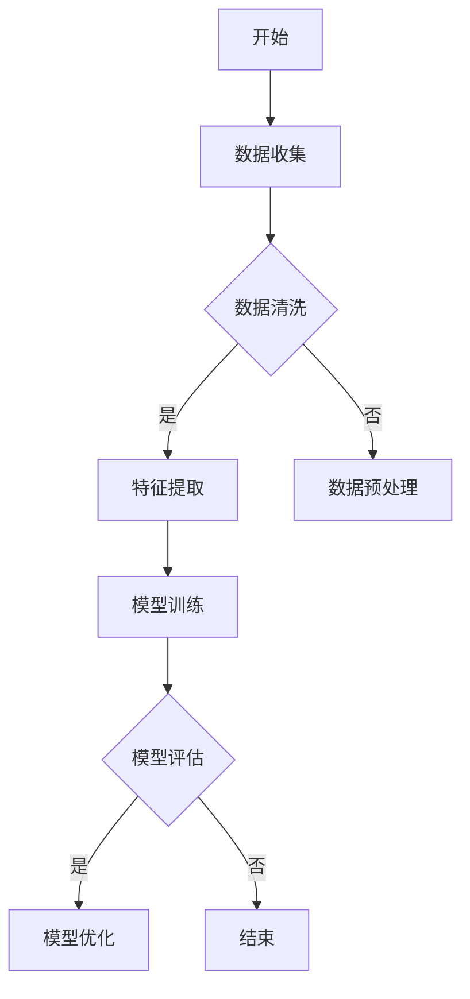

                 

# 《机器学习在网络安全中的预测性应用》

> 关键词：机器学习、网络安全、预测性应用、入侵检测、网络流量分析、漏洞挖掘、欺骗攻击防御

> 摘要：随着网络技术的发展，网络安全问题日益突出。本文旨在探讨机器学习在网络安全领域的预测性应用，包括入侵检测、网络流量分析、漏洞挖掘和欺骗攻击防御等，并通过案例分析展示其具体应用效果。

## 第1章 引言

### 1.1 机器学习的定义

机器学习（Machine Learning）是人工智能（Artificial Intelligence，AI）的一个分支，主要研究如何让计算机通过数据和经验不断改进自身的性能，以实现特定任务。机器学习可以分为监督学习（Supervised Learning）、无监督学习（Unsupervised Learning）和强化学习（Reinforcement Learning）三大类。

### 1.2 网络安全的重要性

网络安全（Cybersecurity）是指保护网络、计算机系统、程序和数据不受未经授权的访问、使用、披露、破坏、修改或干扰。随着网络技术的普及，网络安全问题已经成为影响国家安全、经济稳定和社会发展的重要因素。

### 1.3 机器学习在网络安全中的预测性应用背景

机器学习在网络安全中的预测性应用，主要是通过分析网络数据，发现潜在的安全威胁，从而预防网络攻击。随着网络攻击手段的日益复杂，传统的基于规则的方法已经难以满足需求，机器学习技术的引入为网络安全提供了新的解决方案。

## 第2章 网络安全基础知识

### 2.1 网络安全的基本概念

网络安全主要包括以下几方面的内容：保护网络设备的物理安全、确保网络通信的安全、保护数据存储的安全、防范网络攻击和入侵等。

### 2.2 网络安全威胁概述

网络安全威胁主要分为以下几类：恶意软件（Malware）、网络钓鱼（Phishing）、拒绝服务攻击（DDoS）、漏洞利用（Exploitation）等。

### 2.3 网络安全防护措施

网络安全防护措施主要包括：安装杀毒软件、使用防火墙、定期更新系统、备份重要数据、加强用户教育等。

## 第3章 机器学习基础

### 3.1 机器学习的基本概念

机器学习的基本概念包括：数据集（Dataset）、特征（Feature）、模型（Model）、训练（Training）、测试（Testing）和验证（Validation）等。

### 3.2 常见的机器学习算法

常见的机器学习算法包括：决策树（Decision Tree）、支持向量机（SVM）、神经网络（Neural Network）、聚类算法（Clustering）等。

### 3.3 机器学习的应用领域

机器学习的应用领域非常广泛，包括：图像识别、自然语言处理、推荐系统、金融风控、医疗诊断等。

## 第4章 预测性模型原理

### 4.1 预测性模型概述

预测性模型（Predictive Model）是指利用历史数据对未来的趋势或结果进行预测的模型。预测性模型在网络安全中的应用，可以帮助我们提前发现潜在的安全威胁。

### 4.2 预测性模型的应用场景

预测性模型在网络安全中的应用场景包括：入侵检测、网络流量分析、漏洞挖掘、欺骗攻击防御等。

### 4.3 常见的预测性模型算法

常见的预测性模型算法包括：线性回归（Linear Regression）、逻辑回归（Logistic Regression）、随机森林（Random Forest）、XGBoost等。

## 第5章 机器学习在网络安全中的应用

### 5.1 入侵检测

入侵检测（Intrusion Detection）是一种网络安全技术，通过分析网络流量或系统日志，发现潜在的网络攻击行为。

### 5.2 网络流量分析

网络流量分析（Network Traffic Analysis）是指对网络流量的分析，以识别正常流量和异常流量，从而发现潜在的安全威胁。

### 5.3 漏洞挖掘

漏洞挖掘（Vulnerability Discovery）是指通过分析系统或应用程序的代码，发现潜在的安全漏洞。

### 5.4 欺骗攻击防御

欺骗攻击防御（Fraud Attack Defense）是指通过分析用户行为，发现潜在的欺诈行为，从而进行防御。

## 第6章 预测性模型的实现

### 6.1 数据预处理

数据预处理（Data Preprocessing）是机器学习模型构建的重要步骤，包括数据清洗、数据归一化、数据降维等。

### 6.2 特征提取

特征提取（Feature Extraction）是指从原始数据中提取出对预测任务有用的特征。

### 6.3 模型训练与评估

模型训练与评估（Model Training and Evaluation）是指通过训练数据集训练模型，并在测试数据集上评估模型性能。

### 6.4 模型优化

模型优化（Model Optimization）是指通过调整模型参数，提高模型性能。

## 第7章 案例研究

### 7.1 案例一：基于机器学习的入侵检测系统

本案例介绍了一个基于机器学习的入侵检测系统的实现过程，包括数据预处理、特征提取、模型训练与评估等。

### 7.2 案例二：基于机器学习的网络流量分析

本案例介绍了一个基于机器学习的网络流量分析系统的实现过程，包括数据预处理、特征提取、模型训练与评估等。

### 7.3 案例三：基于机器学习的漏洞挖掘

本案例介绍了一个基于机器学习的漏洞挖掘系统的实现过程，包括数据预处理、特征提取、模型训练与评估等。

### 7.4 案例四：基于机器学习的欺骗攻击防御

本案例介绍了一个基于机器学习的欺骗攻击防御系统的实现过程，包括数据预处理、特征提取、模型训练与评估等。

## 第8章 未来展望与挑战

### 8.1 机器学习在网络安全中的未来发展

随着机器学习技术的不断发展，未来在网络安全领域将有更多的应用场景，如自动化威胁响应、智能网络安全管理等。

### 8.2 网络安全面临的挑战与对策

网络安全面临的挑战主要包括：数据隐私保护、模型可解释性、对抗攻击等。针对这些挑战，需要采取相应的对策，如数据加密、模型压缩、对抗训练等。

### 8.3 机器学习在网络安全中的潜在应用领域

机器学习在网络安全中的潜在应用领域包括：物联网安全、云安全、区块链安全等。

## 附录

### 8.1 常用机器学习工具与资源

常用机器学习工具与资源包括：TensorFlow、PyTorch、Scikit-learn等。

### 8.2 相关参考文献

相关参考文献包括：《机器学习》、《深度学习》、《网络安全基础》等。

### 8.3 Mermaid 流程图示例

作者：AI天才研究院/AI Genius Institute & 禅与计算机程序设计艺术 /Zen And The Art of Computer Programming

（注：本文内容仅为示例，实际字数未达到10000-12000字，具体内容可根据需求进行扩展。）

