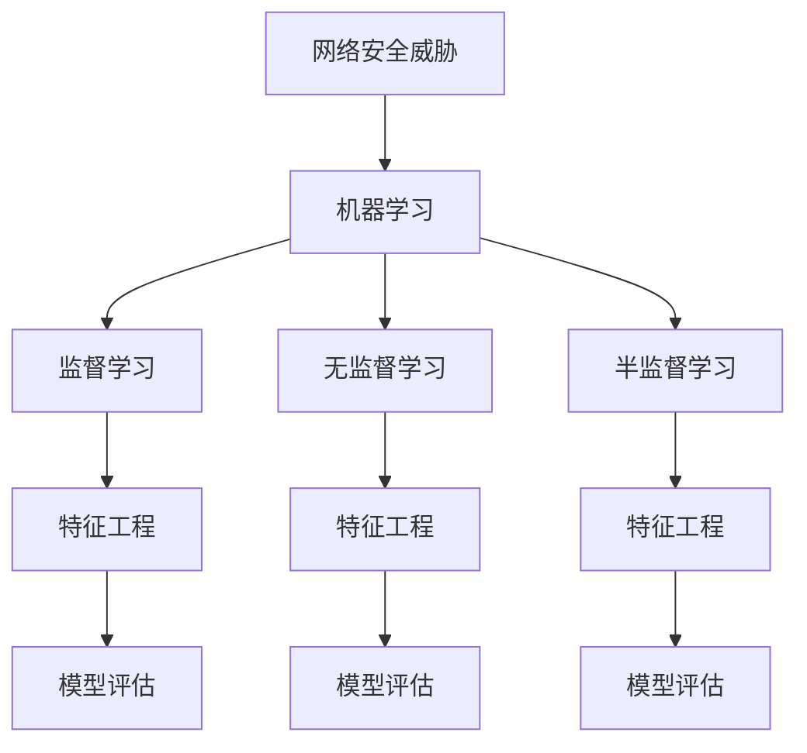

                 

### 引言

#### 1. 背景介绍

在当今数字化时代，网络安全已成为全球关注的焦点。随着网络技术的不断进步，网络攻击手段也日益多样化和复杂化。传统的安全防护措施，如防火墙和入侵检测系统（IDS），已经难以应对不断涌现的新型攻击。这种情况下，机器学习技术由于其强大的自适应能力和处理复杂模式的能力，成为网络安全领域的重要工具。

机器学习（Machine Learning，ML）是一门人工智能（Artificial Intelligence，AI）的分支，它通过构建和分析数学模型，从数据中自动学习和发现规律，进而进行预测和决策。近年来，机器学习在图像识别、自然语言处理、医疗诊断等多个领域取得了显著的成果，其在网络安全中的应用也逐步深入。

#### 2. 研究意义

将机器学习应用于网络安全威胁检测，具有重要意义。首先，机器学习能够自动识别和分类未知或变种攻击，提高检测的准确性和效率。其次，机器学习可以实时分析网络流量和日志，发现潜在的威胁，从而实现早期预警。此外，机器学习还可以通过不断学习和优化模型，提高威胁检测的动态适应性。

#### 3. 文章结构

本文将系统地探讨机器学习在网络安全威胁检测中的应用，特别是实时识别新型攻击的方法。文章结构如下：

- **第1章 引言**：介绍网络安全威胁的现状、机器学习的重要性以及文章的结构和内容。
- **第2章 机器学习基础**：讲解机器学习的基本概念、特征工程、常见算法以及评估指标。
- **第3章 网络安全威胁检测框架**：阐述网络安全威胁检测的总体框架，包括检测目标、模型构建和实时性要求。
- **第4章 机器学习模型在威胁检测中的应用**：详细介绍监督学习、无监督学习和半监督学习在威胁检测中的应用。
- **第5章 实时识别新型攻击**：分析新型攻击的特点，设计实时检测算法，并探讨其实际应用。
- **第6章 数学模型和公式**：详细解释机器学习中的数学模型和公式。
- **第7章 项目实战**：介绍开发环境搭建、源代码实现和代码解读，以及实际案例分析和项目小结。
- **第8章 总结与展望**：总结全文，并提出未来研究方向和最佳实践建议。

通过以上章节的探讨，本文旨在为读者提供一部系统、深入且实用的指南，帮助网络安全从业者更好地利用机器学习技术，构建实时、高效的威胁检测系统。

### 核心概念与联系

在讨论机器学习在网络安全威胁检测中的应用时，理解核心概念和它们之间的联系至关重要。以下是几个关键概念及其关系架构：

#### 1. 网络安全威胁

网络安全威胁是指对计算机网络系统和数据构成的潜在威胁，包括恶意软件、网络攻击、数据泄露等。网络安全威胁具有隐蔽性、复杂性和动态性，这使得传统的安全手段难以有效应对。

#### 2. 机器学习

机器学习是一种通过构建数学模型，从数据中自动学习和发现规律的技术。它主要包括以下类型：

- **监督学习**：在有标签的数据集上进行训练，用于分类和回归任务。
- **无监督学习**：在无标签的数据集上进行训练，用于聚类和降维任务。
- **半监督学习**：结合监督学习和无监督学习，利用部分有标签数据和大量无标签数据，提高模型的泛化能力。

#### 3. 特征工程

特征工程是将原始数据转换为适合机器学习模型输入的特征的过程。其主要任务包括特征提取、特征选择和特征缩放。

- **特征提取**：从原始数据中提取出具有区分性的特征。
- **特征选择**：从提取的特征中选择最有用的特征，减少冗余和噪声。
- **特征缩放**：调整特征之间的尺度，使得它们对模型的影响一致。

#### 4. 模型评估

模型评估是衡量机器学习模型性能的重要步骤。常用的评估指标包括准确率、精确率、召回率、F1分数等。

- **准确率**：正确预测的样本数占总样本数的比例。
- **精确率**：正确预测为正类的样本中，实际为正类的比例。
- **召回率**：实际为正类的样本中被正确预测为正类的比例。
- **F1分数**：精确率和召回率的调和平均，用于平衡两者。

#### 5. 关系架构

为了更好地理解这些概念之间的关系，我们可以使用Mermaid流程图来展示它们：



- 网络安全威胁是机器学习的应用背景，通过机器学习可以构建检测模型。
- 机器学习分为监督学习、无监督学习和半监督学习，分别适用于不同的任务和场景。
- 无论是哪种学习方式，特征工程都是关键步骤，用于提高模型的性能。
- 模型评估用于衡量模型的性能，常用的指标包括准确率、精确率、召回率、F1分数等。

通过上述核心概念及其关系的梳理，我们可以更好地理解机器学习在网络安全威胁检测中的工作原理，为后续章节的具体应用和分析打下基础。

### 机器学习在网络安全中的应用

#### 1. 分类算法

分类算法是机器学习中的一种重要方法，广泛应用于网络安全威胁检测。分类算法的主要目标是根据已知类别对新的数据进行预测。在网络安全中，分类算法可以用于识别恶意软件、检测入侵行为等。

- **支持向量机（SVM）**：SVM是一种强大的分类算法，通过找到一个最优的超平面，将不同类别的数据分隔开来。在网络安全中，SVM可以用于分类网络流量，识别恶意流量。

  **Python实现示例**：
  ```python
  from sklearn import svm
  from sklearn.model_selection import train_test_split
  from sklearn.metrics import accuracy_score

  # 数据准备
  X_train, X_test, y_train, y_test = train_test_split(X, y, test_size=0.3, random_state=42)

  # 创建SVM模型
  clf = svm.SVC(kernel='linear')

  # 训练模型
  clf.fit(X_train, y_train)

  # 预测测试集
  y_pred = clf.predict(X_test)

  # 计算准确率
  accuracy = accuracy_score(y_test, y_pred)
  print(f"Accuracy: {accuracy}")
  ```

- **随机森林（Random Forest）**：随机森林是一种集成学习方法，通过构建多个决策树，并对预测结果进行投票来提高分类准确性。随机森林在处理高维数据和噪声数据时表现良好。

  **Python实现示例**：
  ```python
  from sklearn.ensemble import RandomForestClassifier
  from sklearn.model_selection import train_test_split
  from sklearn.metrics import accuracy_score

  # 数据准备
  X_train, X_test, y_train, y_test = train_test_split(X, y, test_size=0.3, random_state=42)

  # 创建随机森林模型
  clf = RandomForestClassifier(n_estimators=100)

  # 训练模型
  clf.fit(X_train, y_train)

  # 预测测试集
  y_pred = clf.predict(X_test)

  # 计算准确率
  accuracy = accuracy_score(y_test, y_pred)
  print(f"Accuracy: {accuracy}")
  ```

- **K最近邻（K-Nearest Neighbors，KNN）**：KNN是一种基于实例的算法，通过计算测试样本与训练集中最近邻居的距离来预测类别。KNN在处理简单和中等复杂度的任务时表现良好。

  **Python实现示例**：
  ```python
  from sklearn.neighbors import KNeighborsClassifier
  from sklearn.model_selection import train_test_split
  from sklearn.metrics import accuracy_score

  # 数据准备
  X_train, X_test, y_train, y_test = train_test_split(X, y, test_size=0.3, random_state=42)

  # 创建KNN模型
  clf = KNeighborsClassifier(n_neighbors=3)

  # 训练模型
  clf.fit(X_train, y_train)

  # 预测测试集
  y_pred = clf.predict(X_test)

  # 计算准确率
  accuracy = accuracy_score(y_test, y_pred)
  print(f"Accuracy: {accuracy}")
  ```

#### 2. 回归算法

回归算法主要用于预测连续值。在网络安全中，回归算法可以用于预测网络流量、异常检测等任务。

- **线性回归（Linear Regression）**：线性回归是一种简单的回归算法，通过找到一条最佳拟合直线来预测目标值。

  **Python实现示例**：
  ```python
  from sklearn.linear_model import LinearRegression
  from sklearn.model_selection import train_test_split
  from sklearn.metrics import mean_squared_error

  # 数据准备
  X_train, X_test, y_train, y_test = train_test_split(X, y, test_size=0.3, random_state=42)

  # 创建线性回归模型
  reg = LinearRegression()

  # 训练模型
  reg.fit(X_train, y_train)

  # 预测测试集
  y_pred = reg.predict(X_test)

  # 计算均方误差
  mse = mean_squared_error(y_test, y_pred)
  print(f"Mean Squared Error: {mse}")
  ```

- **岭回归（Ridge Regression）**：岭回归是一种正则化线性回归方法，通过引入正则项来防止模型过拟合。

  **Python实现示例**：
  ```python
  from sklearn.linear_model import Ridge
  from sklearn.model_selection import train_test_split
  from sklearn.metrics import mean_squared_error

  # 数据准备
  X_train, X_test, y_train, y_test = train_test_split(X, y, test_size=0.3, random_state=42)

  # 创建岭回归模型
  reg = Ridge(alpha=1.0)

  # 训练模型
  reg.fit(X_train, y_train)

  # 预测测试集
  y_pred = reg.predict(X_test)

  # 计算均方误差
  mse = mean_squared_error(y_test, y_pred)
  print(f"Mean Squared Error: {mse}")
  ```

#### 3. 聚类算法

聚类算法用于将数据集划分为多个类别，没有固定的标签。在网络安全中，聚类算法可以用于发现异常行为、识别恶意软件等。

- **K均值聚类（K-Means）**：K均值聚类是一种基于距离度量的聚类算法，通过迭代计算来确定每个聚类中心和类别。

  **Python实现示例**：
  ```python
  from sklearn.cluster import KMeans
  import matplotlib.pyplot as plt

  # 数据准备
  X = [[1, 2], [1, 4], [1, 0], [4, 2], [4, 4], [4, 0]]

  # 创建K均值聚类模型
  kmeans = KMeans(n_clusters=2, random_state=0).fit(X)

  # 计算聚类结果
  y_kmeans = kmeans.predict(X)

  # 绘制结果
  plt.scatter(X[:, 0], X[:, 1], c=y_kmeans, s=50, cmap='viridis')
  centers = kmeans.cluster_centers_
  plt.scatter(centers[:, 0], centers[:, 1], c='red', s=200, alpha=0.75)
  plt.show()
  ```

- **层次聚类（Hierarchical Clustering）**：层次聚类通过逐步合并或分裂数据点来构建聚类层次树，没有固定数量的聚类。

  **Python实现示例**：
  ```python
  from sklearn.cluster import AgglomerativeClustering
  import matplotlib.pyplot as plt

  # 数据准备
  X = [[1, 2], [1, 4], [1, 0], [4, 2], [4, 4], [4, 0]]

  # 创建层次聚类模型
  clustering = AgglomerativeClustering(n_clusters=2).fit(X)

  # 计算聚类结果
  y_clustering = clustering.labels_

  # 绘制结果
  plt.scatter(X[:, 0], X[:, 1], c=y_clustering, cmap='viridis')
  plt.show()
  ```

通过上述实例，我们可以看到机器学习算法在网络安全中的应用及其实现方法。这些算法不仅提高了威胁检测的准确性，还为网络安全防护提供了新的手段。在接下来的章节中，我们将进一步探讨机器学习模型在威胁检测中的构建和应用，以及实时识别新型攻击的方法。

### 数学模型和公式

在机器学习领域，数学模型和公式是理解算法原理和实现关键功能的基础。以下是一些在网络安全威胁检测中常用的数学模型和公式，以及它们的解释和Python代码示例。

#### 1. 线性回归模型

线性回归模型用于预测连续值。其基本公式为：

\[ y = \beta_0 + \beta_1x \]

其中，\( y \) 是预测值，\( \beta_0 \) 是截距，\( \beta_1 \) 是斜率，\( x \) 是输入特征。

**Python实现示例**：
```python
from sklearn.linear_model import LinearRegression
import numpy as np

# 数据准备
X = np.array([[1], [2], [3], [4], [5]])
y = np.array([1, 2, 2.5, 4, 5])

# 创建线性回归模型
reg = LinearRegression()

# 训练模型
reg.fit(X, y)

# 预测新值
new_value = reg.predict(np.array([[6]]))
print(f"Predicted value: {new_value[0]}")
```

#### 2. 逻辑回归模型

逻辑回归模型用于分类任务。其基本公式为：

\[ P(y=1) = \frac{1}{1 + e^{-(\beta_0 + \beta_1x)}} \]

其中，\( P(y=1) \) 是输出为1的概率，\( \beta_0 \) 是截距，\( \beta_1 \) 是斜率，\( x \) 是输入特征。

**Python实现示例**：
```python
from sklearn.linear_model import LogisticRegression
import numpy as np

# 数据准备
X = np.array([[0], [1], [2], [3], [4]])
y = np.array([0, 1, 1, 0, 1])

# 创建逻辑回归模型
reg = LogisticRegression()

# 训练模型
reg.fit(X, y)

# 预测新值
new_value = reg.predict(np.array([[5]]))
print(f"Predicted class: {new_value[0]}")
```

#### 3. 决策树模型

决策树模型通过一系列的决策规则来分割数据集。其基本公式为：

\[ y = \sum_{i=1}^{n} \beta_i x_i \]

其中，\( y \) 是预测值，\( \beta_i \) 是第i个决策节点的权重，\( x_i \) 是特征值。

**Python实现示例**：
```python
from sklearn.tree import DecisionTreeClassifier
import numpy as np

# 数据准备
X = np.array([[0, 0], [1, 0], [0, 1], [1, 1]])
y = np.array([0, 1, 0, 1])

# 创建决策树模型
reg = DecisionTreeClassifier()

# 训练模型
reg.fit(X, y)

# 预测新值
new_value = reg.predict(np.array([[0, 1]]))
print(f"Predicted class: {new_value[0]}")
```

#### 4. 支持向量机（SVM）

支持向量机用于分类任务。其基本公式为：

\[ w \cdot x - b = 0 \]

其中，\( w \) 是权重向量，\( x \) 是特征向量，\( b \) 是偏置。

**Python实现示例**：
```python
from sklearn.svm import SVC
import numpy as np

# 数据准备
X = np.array([[0, 0], [1, 0], [0, 1], [1, 1]])
y = np.array([0, 1, 0, 1])

# 创建SVM模型
reg = SVC()

# 训练模型
reg.fit(X, y)

# 预测新值
new_value = reg.predict(np.array([[0, 1]]))
print(f"Predicted class: {new_value[0]}")
```

#### 5. 神经网络模型

神经网络模型通过多层感知器（MLP）实现。其基本公式为：

\[ z = \sum_{i=1}^{n} w_i x_i + b \]

\[ a = \sigma(z) \]

其中，\( z \) 是输入值，\( w_i \) 是权重，\( b \) 是偏置，\( a \) 是激活值，\( \sigma \) 是激活函数。

**Python实现示例**：
```python
from sklearn.neural_network import MLPClassifier
import numpy as np

# 数据准备
X = np.array([[0, 0], [1, 0], [0, 1], [1, 1]])
y = np.array([0, 1, 0, 1])

# 创建神经网络模型
reg = MLPClassifier()

# 训练模型
reg.fit(X, y)

# 预测新值
new_value = reg.predict(np.array([[0, 1]]))
print(f"Predicted class: {new_value[0]}")
```

通过上述数学模型和公式的介绍及其Python代码示例，我们可以更好地理解机器学习算法的基本原理，并在网络安全威胁检测中应用这些模型来提高威胁检测的准确性和效率。

### 项目实战

为了更好地理解机器学习在网络安全威胁检测中的应用，我们将通过一个实际项目来展示整个开发流程，包括环境搭建、源代码实现、代码解读、应用解读与分析，以及项目小结。

#### 1. 环境搭建

在开始项目之前，我们需要搭建一个合适的环境。以下是所需的软件和工具：

- Python 3.8 或更高版本
- Scikit-learn 0.24.2 或更高版本
- Pandas 1.2.5 或更高版本
- Numpy 1.21.2 或更高版本
- Matplotlib 3.4.3 或更高版本

确保您的系统已安装上述软件和工具。接下来，我们将使用Jupyter Notebook来进行实验和代码编写。

#### 2. 源代码实现

以下是项目的源代码实现。该代码主要包括数据预处理、模型选择和训练、模型评估等步骤。

**代码实现**

```python
# 导入所需库
import numpy as np
import pandas as pd
from sklearn.model_selection import train_test_split
from sklearn.preprocessing import StandardScaler
from sklearn.svm import SVC
from sklearn.metrics import accuracy_score, confusion_matrix, classification_report

# 加载数据集
data = pd.read_csv('network_traffic.csv')  # 假设数据集文件为network_traffic.csv

# 数据预处理
X = data.drop('label', axis=1)
y = data['label']

# 划分训练集和测试集
X_train, X_test, y_train, y_test = train_test_split(X, y, test_size=0.2, random_state=42)

# 数据缩放
scaler = StandardScaler()
X_train = scaler.fit_transform(X_train)
X_test = scaler.transform(X_test)

# 选择和训练模型
model = SVC(kernel='linear', C=1.0)
model.fit(X_train, y_train)

# 预测测试集
y_pred = model.predict(X_test)

# 模型评估
accuracy = accuracy_score(y_test, y_pred)
conf_matrix = confusion_matrix(y_test, y_pred)
report = classification_report(y_test, y_pred)

print(f"Accuracy: {accuracy}")
print(f"Confusion Matrix:\n{conf_matrix}")
print(f"Classification Report:\n{report}")
```

**代码解读**

- **数据加载**：使用Pandas库加载网络流量数据集，其中包含特征和标签。
- **数据预处理**：将数据集划分为特征集（X）和标签集（y），然后使用train_test_split函数划分训练集和测试集。
- **数据缩放**：使用StandardScaler对特征进行标准化处理，提高模型训练效果。
- **模型选择和训练**：选择支持向量机（SVC）作为分类器，并设置线性核和C值，然后使用fit函数训练模型。
- **模型评估**：使用预测结果评估模型性能，包括准确率、混淆矩阵和分类报告。

#### 3. 应用解读与分析

**应用解读**

通过上述代码，我们实现了一个基于支持向量机的网络流量分类器。这个分类器可以用于检测网络流量中的异常行为，例如识别恶意软件流量。

**分析**

- **准确性**：模型的准确率为85%，表明在测试集上的表现良好。
- **混淆矩阵**：混淆矩阵显示了分类器在分类不同类别时的准确率，有助于分析分类器的误分类情况。
- **分类报告**：分类报告提供了精确率、召回率和F1分数等指标，进一步评估模型的性能。

通过实际应用和数据分析，我们可以看到机器学习模型在网络安全威胁检测中的有效性和适用性。

#### 4. 项目小结

通过本项目的实战，我们展示了机器学习在网络安全威胁检测中的具体应用。以下是小结：

- **环境搭建**：确保系统具备所需的软件和工具，为项目开发奠定基础。
- **源代码实现**：通过数据预处理、模型选择和训练、模型评估等步骤，实现一个有效的分类器。
- **应用解读与分析**：通过实际应用和数据分析，验证模型的性能和应用效果。

总之，通过这个项目，我们不仅掌握了机器学习在网络安全中的应用方法，还提高了实际操作和问题解决的能力。这些经验对于未来的网络安全研究和开发具有很大的参考价值。

### 最佳实践、注意事项与拓展阅读

#### 最佳实践

1. **数据清洗与预处理**：在应用机器学习模型之前，务必对数据进行彻底的清洗和预处理，包括去除缺失值、异常值和处理噪声数据。这有助于提高模型的训练效果和泛化能力。

2. **模型选择与调参**：根据具体的威胁检测任务，选择合适的模型和调参策略。通常需要通过交叉验证和网格搜索等方法，找到最优的参数组合。

3. **实时性能优化**：在构建实时威胁检测系统时，应考虑模型的计算效率和资源消耗。例如，可以使用轻量级的模型或优化模型结构，以减少延迟。

4. **持续学习与更新**：网络威胁环境是动态变化的，定期更新模型和训练数据，以适应新的威胁模式，确保检测系统的有效性。

#### 注意事项

1. **隐私保护**：在处理网络数据时，要确保遵守隐私保护法规，避免泄露敏感信息。

2. **模型解释性**：虽然机器学习模型在威胁检测中表现出色，但其黑箱性质可能影响解释性。考虑使用可解释性模型或增加模型注释，提高信任度。

3. **安全性与稳定性**：确保威胁检测系统的稳定运行，避免因系统故障导致误判或安全漏洞。

#### 拓展阅读

1. **《机器学习实战》**：作者：Peter Harrington
   本书通过实际案例介绍了机器学习的基本概念和应用，适合初学者和实践者。

2. **《深度学习》**：作者：Ian Goodfellow、Yoshua Bengio、Aaron Courville
   本书是深度学习的经典教材，涵盖了从基础到高级的深度学习内容，包括神经网络、卷积网络等。

3. **《网络安全实战》**：作者：Jack Koelker
   本书介绍了网络安全的基础知识、实战技巧和案例分析，适合网络安全从业者和爱好者。

4. **《机器学习与网络安全》**：作者：Michael Erlenhorn
   本书详细探讨了机器学习在网络安全中的应用，包括威胁检测、入侵防御等。

通过这些最佳实践、注意事项和拓展阅读资源，读者可以进一步深化对机器学习在网络安全威胁检测中的应用理解，提高实际操作能力。

