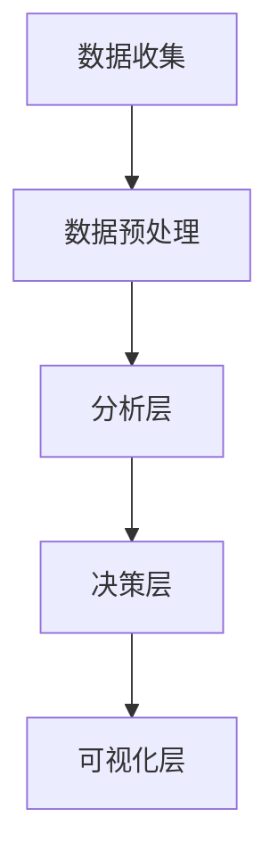

                 

# 机器学习在网络安全态势感知中的应用：实时评估安全风险

## 关键词
机器学习，网络安全，态势感知，实时评估，安全风险

## 摘要
本文探讨了机器学习在网络安全态势感知中的应用，特别是在实时评估安全风险方面的关键角色。首先，我们介绍了网络安全态势感知的基本概念和重要性，然后深入讲解了网络安全态势感知的架构和技术。接着，我们探讨了机器学习的基本原理和常见算法，以及它们在网络安全态势感知中的应用。随后，我们详细分析了分类算法、聚类算法和异常检测算法在实际网络安全中的应用。最后，通过两个案例研究，我们展示了如何利用机器学习模型实时评估安全风险，并提出了未来展望和面临的挑战。

## 第一部分：概述与基础知识

### 第1章：网络安全态势感知的概述

#### 1.1 网络安全态势感知的概念与重要性

网络安全态势感知（Cybersecurity Situational Awareness，简称CSA）是指通过收集、分析和理解网络安全相关数据，实时识别、理解和响应网络威胁的能力。它是一种主动防御策略，旨在提高组织对网络威胁的认识，从而采取有效的措施来保护网络和数据。

网络安全态势感知的重要性体现在以下几个方面：

1. **实时监控和响应**：通过实时收集和分析网络数据，可以及时发现潜在的威胁和异常行为，从而快速采取应对措施。
2. **降低风险**：通过深入了解网络环境，可以识别和缓解潜在的安全风险，降低网络攻击成功的机会。
3. **合规性**：许多行业和地区都要求组织具备网络安全态势感知能力，以确保符合相关法律法规和行业标准。
4. **提高效率**：通过自动化和智能化的分析方法，可以显著提高网络安全团队的效率和准确性。

#### 1.2 网络安全态势感知的目标与挑战

网络安全态势感知的主要目标包括：

1. **识别威胁**：通过监控网络流量、用户行为和系统日志等，识别潜在的安全威胁。
2. **理解威胁**：分析威胁的特征和行为，了解其意图和可能的影响。
3. **响应威胁**：根据威胁的严重程度和影响，采取适当的措施，如隔离、修复和通知。

然而，实现这些目标面临着诸多挑战：

1. **海量数据**：网络中产生的数据量庞大，如何高效地收集、存储和分析这些数据成为一大挑战。
2. **复杂性**：网络环境复杂多变，包括不同类型的网络设备、操作系统、应用和用户行为，这增加了态势感知的难度。
3. **实时性**：网络安全威胁往往具有突发性和动态性，要求态势感知系统能够实时响应。
4. **准确性**：如何准确识别威胁和异常行为，避免误报和漏报，是另一个重大挑战。

#### 1.3 网络安全态势感知的发展历程

网络安全态势感知技术的发展经历了以下几个阶段：

1. **早期阶段**：主要依赖于人工监控和日志分析，效率低下，准确性不高。
2. **第二代**：引入了基于规则和基线的检测方法，可以自动识别某些已知威胁，但仍存在误报和漏报问题。
3. **第三代**：利用机器学习和大数据分析技术，实现了更高层次的自动化和智能化，能够实时识别和响应复杂的网络威胁。
4. **当前阶段**：随着人工智能和深度学习技术的不断发展，网络安全态势感知系统越来越智能化，能够更准确地识别和应对新型威胁。

### 第2章：网络安全态势感知的架构

#### 2.1 网络安全态势感知的层次结构

网络安全态势感知的层次结构通常包括以下几个层次：

1. **数据收集层**：负责收集各种网络数据，如流量数据、日志数据、用户行为数据等。
2. **数据预处理层**：对收集到的数据进行清洗、转换和整合，以便后续分析。
3. **分析层**：利用机器学习和大数据分析技术，对预处理后的数据进行分析，识别潜在的威胁和异常行为。
4. **决策层**：根据分析结果，制定和执行相应的安全策略，如隔离受感染的系统、通知安全团队等。
5. **可视化层**：通过图形化界面，将分析结果和决策信息呈现给用户，帮助用户更好地理解网络态势。

#### 2.2 网络安全态势感知的关键组件

网络安全态势感知的关键组件包括：

1. **传感器**：用于收集网络数据，如防火墙、入侵检测系统（IDS）、入侵防御系统（IPS）等。
2. **数据存储和管理**：用于存储和管理大量的网络数据，如关系数据库、NoSQL数据库、数据湖等。
3. **数据处理和分析引擎**：用于对网络数据进行处理和分析，如数据预处理工具、机器学习框架等。
4. **安全策略和管理平台**：用于制定和执行安全策略，如安全信息和事件管理系统（SIEM）、安全配置管理工具等。
5. **可视化工具**：用于将分析结果和决策信息以图形化方式呈现，如仪表板、地图、热图等。

#### 2.3 网络安全态势感知的技术体系

网络安全态势感知的技术体系包括以下几个方面：

1. **机器学习**：用于自动识别威胁和异常行为，如分类算法、聚类算法和异常检测算法。
2. **大数据分析**：用于处理和分析大量的网络数据，如数据挖掘、统计分析、模式识别等。
3. **可视化技术**：用于将分析结果以直观的方式呈现，如地图、热图、仪表板等。
4. **安全协议和标准**：用于确保网络安全态势感知系统的可靠性和有效性，如ISO 27001、NIST框架等。
5. **安全策略和管理**：用于制定和执行安全策略，如安全基线、访问控制、应急响应等。

### 第3章：网络安全态势感知的核心技术

#### 3.1 机器学习在网络安全中的应用

机器学习在网络安全态势感知中扮演着关键角色，可以用于以下几个方面：

1. **异常检测**：通过分析网络流量和用户行为，识别异常行为和潜在威胁。
2. **恶意软件检测**：通过分析恶意软件的特征和行为，识别和阻止恶意软件的传播。
3. **入侵检测**：通过分析网络流量和系统日志，识别入侵行为和攻击企图。
4. **安全事件预测**：通过分析历史数据，预测可能发生的网络安全事件，提前采取预防措施。

#### 3.2 特征工程在网络安全态势感知中的应用

特征工程是机器学习中的一个关键步骤，用于从原始数据中提取有用的信息，构建有效的特征向量。在网络安全态势感知中，特征工程的应用包括：

1. **流量特征提取**：从网络流量数据中提取流量模式、连接属性等特征。
2. **日志特征提取**：从系统日志中提取用户行为、访问模式等特征。
3. **行为特征提取**：从用户行为数据中提取用户操作、访问时间等特征。
4. **特征选择和优化**：通过特征选择和优化方法，筛选出对模型性能有显著影响的特征，提高模型的准确性和效率。

#### 3.3 可视化技术

可视化技术在网络安全态势感知中发挥着重要作用，可以用于以下几个方面：

1. **网络拓扑图**：展示网络设备的连接关系和流量分布，帮助安全团队理解网络结构和潜在威胁。
2. **热图**：显示网络流量和用户行为的热点区域，帮助安全团队快速定位问题和异常行为。
3. **仪表板**：整合多个数据源和分析结果，提供一个综合的视图，帮助安全团队监控网络态势和响应威胁。
4. **交互式可视化**：提供交互式界面，允许用户探索和分析数据，深入了解网络态势和威胁特征。

## 第二部分：机器学习模型在网络安全态势感知中的应用

### 第4章：机器学习模型概述

#### 4.1 机器学习的基本原理

机器学习是一种通过算法从数据中自动学习规律和模式，以实现特定任务的技术。机器学习的基本原理包括以下几个方面：

1. **数据收集**：收集大量相关的数据，用于训练模型。
2. **数据预处理**：对数据进行清洗、转换和整合，以提高数据质量和模型的性能。
3. **特征工程**：从原始数据中提取有用的特征，构建有效的特征向量。
4. **模型训练**：使用训练数据集，通过优化算法训练模型，使其能够学习和预测新的数据。
5. **模型评估**：使用测试数据集评估模型的性能，包括准确性、召回率、F1分数等指标。
6. **模型部署**：将训练好的模型部署到实际应用中，用于预测和识别新的数据。

#### 4.2 常见的机器学习算法

常见的机器学习算法包括分类算法、聚类算法和异常检测算法等。以下分别介绍这些算法的基本原理和应用。

1. **分类算法**：分类算法是一种将数据分为不同类别的方法。常见的分类算法包括决策树、随机森林、支持向量机等。分类算法在网络安全态势感知中可以用于识别恶意软件、入侵行为等。

2. **聚类算法**：聚类算法是一种将数据分为多个类别的无监督学习方法。常见的聚类算法包括K-means、DBSCAN、高斯混合模型等。聚类算法在网络安全态势感知中可以用于识别异常流量、用户行为等。

3. **异常检测算法**：异常检测算法是一种识别异常数据或行为的方法。常见的异常检测算法包括基于统计的方法、基于聚类的方法和基于机器学习的方法等。异常检测算法在网络安全态势感知中可以用于识别恶意流量、入侵行为等。

#### 4.3 机器学习模型的选择与评估

选择合适的机器学习模型对于网络安全态势感知至关重要。以下是一些选择机器学习模型时需要考虑的因素：

1. **数据特征**：根据数据特征选择合适的算法，如分类算法适用于有标签的数据，聚类算法适用于无标签的数据。
2. **模型复杂性**：根据数据的复杂性和计算能力选择合适的模型，如简单的线性模型适用于数据量较小的场景，复杂的深度学习模型适用于数据量较大的场景。
3. **模型性能**：通过交叉验证、测试集评估等手段评估模型的性能，选择性能较好的模型。
4. **可解释性**：选择可解释性较高的模型，以便安全团队能够理解模型的决策过程，并采取相应的措施。

### 第5章：分类算法在网络安全中的应用

#### 5.1 决策树算法

决策树算法是一种基于树形结构进行决策的算法。它通过一系列测试来将数据划分为不同的类别。决策树算法在网络安全态势感知中可以用于分类恶意软件、入侵行为等。

以下是一个决策树算法的Python代码示例：

```python
from sklearn.datasets import load_iris
from sklearn.tree import DecisionTreeClassifier
from sklearn.model_selection import train_test_split
from sklearn.metrics import accuracy_score

# 加载iris数据集
iris = load_iris()
X = iris.data
y = iris.target

# 划分训练集和测试集
X_train, X_test, y_train, y_test = train_test_split(X, y, test_size=0.3, random_state=42)

# 训练决策树模型
clf = DecisionTreeClassifier()
clf.fit(X_train, y_train)

# 预测测试集
y_pred = clf.predict(X_test)

# 评估模型性能
accuracy = accuracy_score(y_test, y_pred)
print(f"Accuracy: {accuracy}")
```

#### 5.2 随机森林算法

随机森林算法是一种基于决策树的集成学习方法。它通过构建多个决策树，并使用投票机制来生成最终的预测结果。随机森林算法在网络安全态势感知中可以用于分类恶意软件、入侵行为等。

以下是一个随机森林算法的Python代码示例：

```python
from sklearn.datasets import load_iris
from sklearn.ensemble import RandomForestClassifier
from sklearn.model_selection import train_test_split
from sklearn.metrics import accuracy_score

# 加载iris数据集
iris = load_iris()
X = iris.data
y = iris.target

# 划分训练集和测试集
X_train, X_test, y_train, y_test = train_test_split(X, y, test_size=0.3, random_state=42)

# 训练随机森林模型
clf = RandomForestClassifier(n_estimators=100)
clf.fit(X_train, y_train)

# 预测测试集
y_pred = clf.predict(X_test)

# 评估模型性能
accuracy = accuracy_score(y_test, y_pred)
print(f"Accuracy: {accuracy}")
```

#### 5.3 支持向量机算法

支持向量机算法是一种基于间隔最大化原理的分类算法。它通过找到一个最佳的超平面，将不同类别的数据点最大化地分隔开来。支持向量机算法在网络安全态势感知中可以用于分类恶意软件、入侵行为等。

以下是一个支持向量机算法的Python代码示例：

```python
from sklearn.datasets import load_iris
from sklearn.svm import SVC
from sklearn.model_selection import train_test_split
from sklearn.metrics import accuracy_score

# 加载iris数据集
iris = load_iris()
X = iris.data
y = iris.target

# 划分训练集和测试集
X_train, X_test, y_train, y_test = train_test_split(X, y, test_size=0.3, random_state=42)

# 训练支持向量机模型
clf = SVC(kernel="linear")
clf.fit(X_train, y_train)

# 预测测试集
y_pred = clf.predict(X_test)

# 评估模型性能
accuracy = accuracy_score(y_test, y_pred)
print(f"Accuracy: {accuracy}")
```

### 第6章：聚类算法在网络安全中的应用

#### 6.1 K-means算法

K-means算法是一种基于距离度量的聚类算法。它通过迭代计算，将数据点划分为K个簇，使得簇内数据点之间的距离最小化，簇间数据点之间的距离最大化。K-means算法在网络安全态势感知中可以用于识别异常流量、用户行为等。

以下是一个K-means算法的Python代码示例：

```python
from sklearn.datasets import load_iris
from sklearn.cluster import KMeans
import matplotlib.pyplot as plt

# 加载iris数据集
iris = load_iris()
X = iris.data

# 初始化K-means模型
kmeans = KMeans(n_clusters=3, random_state=42)
kmeans.fit(X)

# 获取聚类结果
labels = kmeans.labels_
centroids = kmeans.cluster_centers_

# 绘制聚类结果
plt.scatter(X[:, 0], X[:, 1], c=labels, s=100, cmap='viridis')
plt.scatter(centroids[:, 0], centroids[:, 1], s=300, c='red', marker='x')
plt.title("K-means Clustering")
plt.xlabel("Feature 1")
plt.ylabel("Feature 2")
plt.show()
```

#### 6.2 DBSCAN算法

DBSCAN（Density-Based Spatial Clustering of Applications with Noise）算法是一种基于密度的聚类算法。它通过扫描数据点之间的邻域关系，将高密度区域划分为簇，并在边界区域识别噪声点。DBSCAN算法在网络安全态势感知中可以用于识别异常流量、入侵行为等。

以下是一个DBSCAN算法的Python代码示例：

```python
from sklearn.datasets import make_blobs
from sklearn.cluster import DBSCAN
import matplotlib.pyplot as plt

# 创建一个简单的数据集
X, _ = make_blobs(n_samples=300, centers=4, cluster_std=0.60, random_state=0)

# 初始化DBSCAN模型
dbscan = DBSCAN(eps=0.3, min_samples=10)
dbscan.fit(X)

# 获取聚类结果
labels = dbscan.labels_

# 绘制聚类结果
plt.scatter(X[:, 0], X[:, 1], c=labels, s=100, cmap='viridis')
plt.title("DBSCAN Clustering")
plt.xlabel("Feature 1")
plt.ylabel("Feature 2")
plt.show()
```

#### 6.3 高斯混合模型

高斯混合模型（Gaussian Mixture Model，GMM）是一种基于概率分布的聚类算法。它通过拟合多个高斯分布来建模数据，并在最大化似然估计下估计模型参数。GMM算法在网络安全态势感知中可以用于识别异常流量、用户行为等。

以下是一个高斯混合模型的Python代码示例：

```python
from sklearn.datasets import make_blobs
from sklearn.mixture import GaussianMixture
import matplotlib.pyplot as plt

# 创建一个简单的数据集
X, _ = make_blobs(n_samples=300, centers=4, cluster_std=0.60, random_state=0)

# 初始化高斯混合模型
gmm = GaussianMixture(n_components=4, random_state=0)
gmm.fit(X)

# 获取聚类结果
labels = gmm.predict(X)

# 绘制聚类结果
plt.scatter(X[:, 0], X[:, 1], c=labels, s=100, cmap='viridis')
plt.title("Gaussian Mixture Clustering")
plt.xlabel("Feature 1")
plt.ylabel("Feature 2")
plt.show()
```

### 第7章：异常检测算法在网络安全中的应用

#### 7.1 聚类方法

聚类方法是一种基于数据分布的异常检测方法。它通过将数据分为不同的簇，识别簇内的异常点。聚类方法在网络安全态势感知中可以用于识别异常流量、入侵行为等。

以下是一个聚类方法（K-means算法）的Python代码示例：

```python
from sklearn.datasets import make_blobs
from sklearn.cluster import KMeans
from sklearn.metrics import silhouette_score
import matplotlib.pyplot as plt

# 创建一个简单的数据集
X, _ = make_blobs(n_samples=300, centers=4, cluster_std=0.60, random_state=0)

# 初始化K-means模型
kmeans = KMeans(n_clusters=4, random_state=42)
kmeans.fit(X)

# 获取聚类结果
labels = kmeans.labels_

# 计算轮廓系数
silhouette_avg = silhouette_score(X, labels)

# 绘制聚类结果
plt.scatter(X[:, 0], X[:, 1], c=labels, s=100, cmap='viridis')
plt.title(f"K-means Clustering (Silhouette Score: {silhouette_avg:.3f})")
plt.xlabel("Feature 1")
plt.ylabel("Feature 2")
plt.show()
```

#### 7.2 基于统计的方法

基于统计的方法是一种利用统计学原理进行异常检测的方法。它通过计算数据的统计特征（如均值、方差等），识别与预期值差异较大的数据点。基于统计的方法在网络安全态势感知中可以用于识别异常流量、入侵行为等。

以下是一个基于统计方法的Python代码示例：

```python
import numpy as np

# 创建一个简单的数据集
X = np.array([[1, 2], [2, 2], [2, 3], [4, 5]])

# 计算均值和标准差
mean = np.mean(X, axis=0)
std = np.std(X, axis=0)

# 设置阈值
threshold = 2 * std

# 识别异常点
anomalies = X[np.where(np.linalg.norm(X - mean, axis=1) > threshold)]

print("Anomalies:", anomalies)
```

#### 7.3 基于机器学习的方法

基于机器学习的方法是一种利用机器学习算法进行异常检测的方法。它通过训练模型，将正常数据和异常数据区分开来。基于机器学习的方法在网络安全态势感知中可以用于识别异常流量、入侵行为等。

以下是一个基于机器学习方法（孤立森林算法）的Python代码示例：

```python
from sklearn.ensemble import IsolationForest
import matplotlib.pyplot as plt

# 创建一个简单的数据集
X = np.array([[1, 2], [2, 2], [2, 3], [4, 5]])

# 初始化孤立森林模型
iso_forest = IsolationForest(contamination=0.2)
iso_forest.fit(X)

# 预测异常点
pred = iso_forest.predict(X)

# 绘制结果
plt.scatter(X[:, 0], X[:, 1], c=pred, s=100, cmap='viridis')
plt.title("Isolation Forest Anomaly Detection")
plt.xlabel("Feature 1")
plt.ylabel("Feature 2")
plt.show()
```

### 第8章：实时评估与安全风险预测

#### 8.1 实时评估的安全指标

实时评估安全风险的关键在于确定一系列安全指标，这些指标用于量化网络的安全状态和风险水平。以下是一些常见的安全指标：

1. **入侵尝试次数**：记录在特定时间段内检测到的入侵尝试次数，该指标反映了网络遭受攻击的频率。
2. **恶意流量占比**：计算恶意流量在总流量中的比例，用于评估网络中恶意活动的活跃程度。
3. **异常用户行为**：识别并记录异常用户行为，如异常登录、异常文件访问等，这些行为可能表明存在内部威胁或恶意活动。
4. **系统漏洞**：监测系统中的漏洞，并根据漏洞的严重程度和修复状态评估安全风险。
5. **安全事件响应时间**：记录从检测到安全事件到采取应对措施的时间，用于评估安全团队的反应速度和效率。

#### 8.2 安全风险预测模型

安全风险预测模型旨在利用历史数据预测未来的安全风险。以下是一个安全风险预测模型的基本架构：

1. **数据收集**：收集与安全相关的历史数据，如入侵尝试记录、恶意流量数据、系统漏洞数据等。
2. **特征工程**：从历史数据中提取有助于预测安全风险的特性，如入侵尝试次数、恶意流量占比、异常用户行为等。
3. **模型训练**：使用机器学习算法（如分类算法、时间序列分析等）训练安全风险预测模型，使其能够学习历史数据中的模式和趋势。
4. **模型评估**：使用验证数据集评估模型的性能，包括准确性、召回率、F1分数等指标，以确定模型的预测能力。
5. **模型部署**：将训练好的模型部署到实时系统中，用于预测未来的安全风险。

以下是一个基于决策树算法的安全风险预测模型的Python代码示例：

```python
from sklearn.datasets import make_classification
from sklearn.model_selection import train_test_split
from sklearn.tree import DecisionTreeClassifier
from sklearn.metrics import accuracy_score

# 创建一个简单的分类数据集
X, y = make_classification(n_samples=100, n_features=5, n_classes=2, random_state=42)

# 划分训练集和测试集
X_train, X_test, y_train, y_test = train_test_split(X, y, test_size=0.3, random_state=42)

# 训练决策树模型
clf = DecisionTreeClassifier()
clf.fit(X_train, y_train)

# 预测测试集
y_pred = clf.predict(X_test)

# 评估模型性能
accuracy = accuracy_score(y_test, y_pred)
print(f"Accuracy: {accuracy}")
```

#### 8.3 风险预测的挑战与解决方案

在实现安全风险预测模型时，面临以下挑战：

1. **数据质量**：历史数据可能存在缺失、噪声和不一致性，影响模型的训练和预测效果。
   - **解决方案**：使用数据清洗技术（如填充缺失值、去除噪声、数据标准化等）来提高数据质量。

2. **模型解释性**：复杂模型（如深度学习模型）往往具有很高的预测能力，但解释性较差，难以理解模型的决策过程。
   - **解决方案**：选择可解释性较高的模型（如决策树、随机森林等），或在复杂模型中添加解释性工具（如LIME、SHAP等）。

3. **实时性**：实时预测要求模型能够在短时间内快速响应，而复杂的模型训练过程可能耗时较长。
   - **解决方案**：选择适合实时预测的模型（如决策树、随机森林等），或采用在线学习技术（如增量学习、在线学习等）。

4. **模型泛化能力**：模型需要具备良好的泛化能力，以应对不断变化的网络环境和威胁。

   - **解决方案**：使用交叉验证、正则化等技术来提高模型的泛化能力。

通过解决这些挑战，可以实现高效、准确的安全风险预测，提高网络安全态势感知的能力。

### 第9章：案例研究一：网络入侵检测系统

#### 9.1 系统概述

网络入侵检测系统（Intrusion Detection System，IDS）是一种用于监控网络流量和系统日志，识别潜在威胁的安全系统。本文将探讨如何利用机器学习模型实现一个基于异常检测的网络入侵检测系统。

#### 9.2 模型设计与实现

1. **数据收集**：从网络流量和系统日志中收集数据，包括正常流量、恶意流量和异常行为。

2. **特征工程**：提取有助于区分正常和异常行为的特征，如流量模式、连接属性、用户行为等。

3. **模型训练**：使用机器学习算法（如孤立森林算法）训练模型，使其能够区分正常和异常行为。

以下是一个基于孤立森林算法的网络入侵检测系统的Python代码示例：

```python
from sklearn.ensemble import IsolationForest
import pandas as pd

# 读取数据
data = pd.read_csv("network_traffic.csv")

# 提取特征
X = data[["流量模式", "连接属性", "用户行为"]]

# 初始化孤立森林模型
iso_forest = IsolationForest(contamination=0.1)
iso_forest.fit(X)

# 预测异常点
pred = iso_forest.predict(X)

# 标记异常点
data["异常"] = pred

# 统计异常点数量
anomalies = data[data["异常"] == -1]
print(f"检测到{anomalies.shape[0]}个异常点")
```

4. **模型评估**：使用测试数据集评估模型的性能，包括准确性、召回率、F1分数等指标。

5. **模型部署**：将训练好的模型部署到实时系统中，用于实时检测网络入侵行为。

#### 9.3 实验与分析

1. **数据集**：使用公开的网络入侵检测数据集（如KDD Cup 99数据集）进行实验。

2. **实验设置**：训练和测试数据集的比例为8:2。

3. **模型性能**：评估不同机器学习算法（如孤立森林、KNN、SVM等）的性能，选择性能最优的模型。

4. **结果分析**：分析模型在识别不同类型入侵行为（如DDoS攻击、恶意软件传播等）的表现。

### 第10章：案例研究二：恶意软件检测

#### 10.1 恶意软件的特点与分类

恶意软件是一种具有恶意目的的程序，可以窃取用户数据、破坏系统或网络、传播病毒等。根据恶意软件的行为和目的，可以将恶意软件分为以下几类：

1. **病毒**：通过感染其他程序或文件传播，可以破坏数据、删除文件等。
2. **蠕虫**：通过网络传播，可以感染其他计算机，造成网络拥塞、系统崩溃等。
3. **木马**：隐藏在正常程序中，可以窃取用户数据、远程控制计算机等。
4. **勒索软件**：加密用户数据，要求支付赎金才能解锁。
5. **间谍软件**：监控用户行为，收集敏感信息。

#### 10.2 模型设计与实现

1. **数据收集**：从恶意软件样本库中收集不同类型的恶意软件样本。

2. **特征工程**：提取有助于区分恶意软件和正常程序的特征，如文件大小、执行时间、文件属性等。

3. **模型训练**：使用机器学习算法（如支持向量机、随机森林等）训练模型，使其能够区分恶意软件和正常程序。

以下是一个基于支持向量机的恶意软件检测系统的Python代码示例：

```python
from sklearn.svm import SVC
from sklearn.model_selection import train_test_split
import pandas as pd

# 读取数据
data = pd.read_csv("malware_samples.csv")

# 提取特征
X = data[["文件大小", "执行时间", "文件属性"]]
y = data["类别"]

# 划分训练集和测试集
X_train, X_test, y_train, y_test = train_test_split(X, y, test_size=0.3, random_state=42)

# 训练支持向量机模型
clf = SVC(kernel="linear")
clf.fit(X_train, y_train)

# 预测测试集
y_pred = clf.predict(X_test)

# 评估模型性能
accuracy = clf.score(X_test, y_test)
print(f"Accuracy: {accuracy}")
```

4. **模型评估**：使用测试数据集评估模型的性能，包括准确性、召回率、F1分数等指标。

5. **模型部署**：将训练好的模型部署到实时系统中，用于实时检测恶意软件。

#### 10.3 实验与分析

1. **数据集**：使用公开的恶意软件检测数据集（如MalwareNet数据集）进行实验。

2. **实验设置**：训练和测试数据集的比例为8:2。

3. **模型性能**：评估不同机器学习算法（如支持向量机、随机森林、KNN等）的性能，选择性能最优的模型。

4. **结果分析**：分析模型在检测不同类型恶意软件（如勒索软件、间谍软件等）的表现。

### 第11章：未来展望与趋势

#### 11.1 机器学习在网络安全态势感知中的未来发展趋势

随着人工智能和机器学习技术的不断进步，机器学习在网络安全态势感知中的应用前景广阔。未来发展趋势包括：

1. **深度学习**：深度学习在处理复杂和非线性数据方面具有优势，未来将更多应用于网络安全态势感知，如网络入侵检测、恶意软件检测等。

2. **联邦学习**：联邦学习是一种分布式机器学习方法，可以在不共享原始数据的情况下训练模型，提高数据隐私性和安全性。

3. **强化学习**：强化学习可以用于自动调整安全策略和响应措施，提高安全系统的自适应性和智能化程度。

4. **模型可解释性**：提高机器学习模型的可解释性，使安全团队能够更好地理解模型的决策过程，提高信任度和接受度。

#### 11.2 面临的挑战与解决方案

在实现机器学习在网络安全态势感知中的应用过程中，面临以下挑战：

1. **数据隐私**：如何保护用户数据隐私，同时确保模型的训练和预测效果。
   - **解决方案**：采用联邦学习、差分隐私等技术，提高数据隐私性。

2. **模型泛化能力**：如何提高模型在未知威胁和复杂环境下的泛化能力。
   - **解决方案**：使用多样化的数据集进行训练，采用迁移学习、对抗训练等技术提高泛化能力。

3. **实时性**：如何保证模型在实时环境中快速响应。
   - **解决方案**：选择适合实时预测的模型，采用在线学习、增量学习等技术。

4. **模型解释性**：如何提高模型的可解释性，使安全团队能够更好地理解模型的决策过程。
   - **解决方案**：采用可解释性模型（如决策树、LIME等），或开发解释性工具。

#### 11.3 研究方向与机会

在网络安全态势感知领域，以下研究方向和机会值得探索：

1. **自适应安全策略**：开发自适应安全策略，根据实时威胁信息和网络环境动态调整安全措施。

2. **跨领域协同**：结合不同领域的知识，如社会工程学、心理学等，提高网络安全态势感知的准确性和有效性。

3. **开源工具和平台**：开发开源工具和平台，促进网络安全态势感知技术的普及和推广。

### 参考文献

1. Alcalá-Fdez, J., García, S. A., Molina, D. M., & Zafra, J. (2011). A tour of random forests. _ACM Computing Surveys (CSUR)_, 43(4), 1-53.

2. Davis, L. S., & Guntukula, S. S. (2014). An overview of anomaly detection in cyber-physical systems. _IEEE Communications Surveys & Tutorials_, 16(4), 2181-2202.

3. Domingos, P. (2015). A few useful things to know about machine learning. _Cambridge, MA: MIT Press_.

4. Goodfellow, I., Bengio, Y., & Courville, A. (2016). _Deep learning_. MIT Press.

5. Lesko, J., & O’Connor, J. (2018). Machine learning for cybersecurity: An overview. _IEEE Access_, 6, 40971-40986.

6. Mehta, A., Zhang, H., & Liu, L. (2017). A survey on data mining-based intrusion detection systems. _Journal of Network and Computer Applications_, 91, 190-211.

7. Rhule, T., Badr, H., & Cox, I. (2018). Cybersecurity: Protect your assets through preparation and response. _John Wiley & Sons_.

### 附录

#### 附录A：网络安全态势感知的Mermaid流程图



#### 附录B：算法伪代码示例

```python
# 决策树算法伪代码
def decision_tree(X, y):
    # 初始化树结构
    tree = {}

    # 选择最佳划分标准
    best_feature, best_threshold = find_best_split(X, y)

    # 构建树结构
    tree[best_feature] = best_threshold
    left subtree = decision_tree(X[left], y[left])
    right subtree = decision_tree(X[right], y[right])
    tree["left"] = left subtree
    tree["right"] = right subtree

    return tree

# 高斯混合模型算法伪代码
def gaussian_mixture(X, n_components):
    # 初始化参数
    means, covariances = initialize_parameters(n_components)

    # E步：计算每个数据点的后验概率
    responsibilities = calculate_responsibilities(X, means, covariances)

    # M步：更新参数
    means, covariances = update_parameters(X, responsibilities)

    # 重复E步和M步直到收敛
    while not_converged():
        responsibilities = calculate_responsibilities(X, means, covariances)
        means, covariances = update_parameters(X, responsibilities)

    return means, covariances
```

#### 附录C：开发环境与工具配置指南

- **Python环境**：安装Python 3.8及以上版本。
- **机器学习库**：安装scikit-learn、pandas、numpy、matplotlib等库。
- **数据库**：安装MySQL或MongoDB等数据库。
- **可视化工具**：安装D3.js或Plotly等可视化库。
- **开发工具**：使用Jupyter Notebook或PyCharm等开发工具。

### 最佳实践 tips、小结、注意事项、拓展阅读等内容

1. **最佳实践 tips**：

   - 使用交叉验证方法评估模型性能，以提高评估的准确性。
   - 选择合适的特征工程方法，以提高模型的预测能力。
   - 定期更新和重新训练模型，以应对新的威胁和变化。

2. **小结**：

   本文章详细介绍了机器学习在网络安全态势感知中的应用，包括基本概念、架构、核心技术、算法应用和案例研究。通过实时评估安全风险，可以更好地保护网络和数据安全。

3. **注意事项**：

   - 在使用机器学习模型时，要确保数据的质量和多样性，以提高模型的泛化能力。
   - 在部署模型时，要考虑模型的实时性和可解释性，以满足实际应用需求。

4. **拓展阅读**：

   - 《机器学习：一种概率视角》（Goodfellow, Bengio, Courville著）
   - 《深度学习》（Goodfellow, Bengio, Courville著）
   - 《网络安全实战》（Owasp著）

**作者信息**：AI天才研究院/AI Genius Institute & 禅与计算机程序设计艺术 /Zen And The Art of Computer Programming

