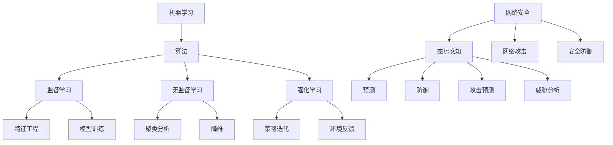

                 

# 机器学习在网络安全态势感知中的应用：预测和防御网络攻击

> 关键词：机器学习、网络安全、态势感知、预测、防御、网络攻击

> 摘要：本文将探讨机器学习在网络安全态势感知中的应用，通过分析机器学习的基本原理和网络安全的关键领域，阐述如何利用机器学习预测和防御网络攻击。本文旨在为网络安全从业者和机器学习爱好者提供一份全面而深入的指南。

## 引言

### 1.1 书籍背景与目的

随着互联网和信息技术的高速发展，网络安全问题日益严峻。网络攻击手段不断升级，传统安全防御策略难以应对。在这种背景下，机器学习作为一种先进的算法技术，逐渐成为网络安全态势感知的重要工具。本文旨在探讨机器学习在网络安全态势感知中的应用，帮助读者理解和掌握这一领域的前沿技术和实践方法。

#### 1.1.1 机器学习的兴起与网络安全的重要性

机器学习作为一种人工智能的重要分支，起源于20世纪50年代。从最初的基于规则的专家系统，到如今基于大数据和深度学习的复杂算法，机器学习经历了漫长的发展历程。随着计算能力的提升和数据规模的扩大，机器学习在图像识别、自然语言处理、语音识别等领域取得了显著的成果。与此同时，网络安全也成为了各国政府和企业关注的焦点。网络攻击频率和复杂度的增加，使得网络安全形势愈发严峻。因此，将机器学习应用于网络安全态势感知，不仅具有理论意义，更具有实际价值。

#### 1.1.2 本书的目的与结构

本书的核心目标是介绍机器学习在网络安全态势感知中的应用，帮助读者了解机器学习的基本原理、核心算法，并掌握如何将机器学习应用于网络安全实战。全书分为三个部分：

- **第一部分：机器学习基础**：介绍机器学习的基本概念、流程、基础算法及其应用场景。
- **第二部分：网络安全基础**：分析网络安全的关键领域、常见攻击手段和安全防御策略。
- **第三部分：机器学习在网络安全态势感知中的应用**：探讨机器学习在网络安全态势感知中的实际应用，包括预测和防御网络攻击的方法。

#### 1.1.3 读者对象与学习目标

本书适合以下读者群体：

- 对机器学习和网络安全感兴趣的初学者。
- 想要在网络安全领域应用机器学习的专业人士。
- 对网络安全态势感知技术有深入了解的研究人员。

通过阅读本书，读者应达到以下学习目标：

- 理解机器学习在网络安全态势感知中的应用原理。
- 掌握常用的机器学习算法在网络安全态势感知中的应用方法。
- 能够设计和实现网络安全态势感知的机器学习应用。

#### 1.1.4 书籍资源与后续计划

为方便读者学习，本书提供了以下资源：

- **阅读材料**：推荐的相关书籍、文章和论文。
- **实践案例**：相关的机器学习在网络安全态势感知中的应用案例。
- **代码示例**：提供相关的代码示例和实现。

后续计划包括：

- 定期更新：随着机器学习和网络安全态势感知技术的不断发展，定期更新书籍内容。
- 社区互动：建立一个社区，方便读者交流和学习。

### 1.1.5 核心概念与联系

在深入探讨机器学习在网络安全态势感知中的应用之前，我们需要了解一些核心概念及其相互关系。以下是一个简单的Mermaid流程图，展示这些概念之间的联系：



通过这个流程图，我们可以清晰地看到机器学习算法与网络安全态势感知之间的关键联系，以及它们在预测和防御网络攻击中的具体应用。

#### 1.1.6 核心算法原理讲解

为了深入理解机器学习算法在网络安全中的应用，我们接下来将使用伪代码详细阐述几个核心算法的原理。以下是线性回归和决策树算法的伪代码：

**线性回归算法伪代码**：

```python
function linear_regression(X, y):
    # X: 输入特征矩阵，y: 输出标签向量
    # 求解最小二乘法，计算参数 w 和 b

    # 梯度下降法
    w = X'X)^-1X'y
    b = y - Xw

    # 迭代更新参数
    while not converged:
        w = w - learning_rate * (X'X)^-1X'(Xw - y)
        b = b - learning_rate * (1/m) * (y - Xw)

    # 输出回归模型参数
    return w, b
```

**决策树算法伪代码**：

```python
function decision_tree(X, y, depth=0, max_depth=100):
    # X: 输入特征矩阵，y: 输出标签向量
    # depth: 当前树深度，max_depth: 最大树深度

    # 判断停止条件
    if depth >= max_depth or 纯度(y) <=阈值 or 特征用尽:
        return 叶节点

    # 选择最佳分割特征和分割点
    best_feature, best_split = 选择最佳分割特征和分割点(X, y)

    # 构建子树
    left_child = decision_tree(X[best_split<阈值], y[best_split<阈值], depth+1, max_depth)
    right_child = decision_tree(X[best_split>=阈值], y[best_split>=阈值], depth+1, max_depth)

    # 返回决策树
    return Node(best_feature, best_split, left_child, right_child)
```

这些伪代码展示了线性回归和决策树的基本原理，包括参数优化、特征选择和树结构构建等关键步骤。通过这些算法，我们可以实现对网络攻击特征的提取和分类，为网络安全态势感知提供强有力的技术支持。

#### 1.1.7 数学模型和数学公式

在机器学习算法中，数学模型和公式起着至关重要的作用。以下是一些常用的数学公式和它们的解释：

**线性回归公式**：

$$ y = w_0 + w_1x_1 + w_2x_2 + ... + w_nx_n $$

其中，$y$ 是输出标签，$w_0$ 是偏置项，$w_1, w_2, ..., w_n$ 是权重参数，$x_1, x_2, ..., x_n$ 是输入特征。

**决策树分类公式**：

$$ 类别 = \arg\max(w_0 + w_1x_1 + w_2x_2 + ...) $$

其中，$w_0, w_1, w_2, ...$ 是决策树中节点的权重参数，$x_1, x_2, ...$ 是特征值。

**支持向量机公式**：

$$ y(\textbf{w}^T\textbf{x} + b) \geq 1 $$

其中，$\textbf{w}$ 是权重向量，$\textbf{x}$ 是特征向量，$b$ 是偏置项，$y$ 是标签。

通过这些数学模型和公式，我们可以对网络攻击行为进行有效识别和预测。

#### 1.1.8 项目实战

为了更好地理解机器学习在网络安全态势感知中的应用，我们以下提供一个实际案例，展示如何使用Python实现一个简单的入侵检测系统。

**开发环境搭建**：

- 安装Python（3.8以上版本）
- 安装机器学习库：`scikit-learn`
- 安装数据可视化库：`matplotlib`

**代码实现**：

```python
import numpy as np
import pandas as pd
from sklearn.model_selection import train_test_split
from sklearn.ensemble import RandomForestClassifier
from sklearn.metrics import accuracy_score
import matplotlib.pyplot as plt

# 读取数据
data = pd.read_csv('kddcup.data_10_percent.csv')
X = data.iloc[:, :-1].values
y = data.iloc[:, -1].values

# 数据预处理
X_train, X_test, y_train, y_test = train_test_split(X, y, test_size=0.2, random_state=42)

# 模型训练
model = RandomForestClassifier(n_estimators=100)
model.fit(X_train, y_train)

# 预测
predictions = model.predict(X_test)

# 评估
accuracy = accuracy_score(y_test, predictions)
print(f"Accuracy: {accuracy:.2f}")

# 可视化
plt.scatter(X_test[:, 0], X_test[:, 1], c=predictions, cmap='viridis')
plt.xlabel('特征1')
plt.ylabel('特征2')
plt.title('预测结果')
plt.show()
```

**代码解读**：

- 读取数据：使用`pandas`读取KDD CUP数据集。
- 数据预处理：使用`scikit-learn`库进行数据拆分和归一化处理。
- 模型训练：使用随机森林算法进行训练。
- 预测和评估：使用训练好的模型进行预测，并计算准确率。
- 可视化：使用`matplotlib`进行预测结果的可视化。

通过这个案例，我们可以看到如何使用Python实现一个简单的入侵检测系统，并评估其性能。

#### 1.1.9 最佳实践 tips

在应用机器学习进行网络安全态势感知时，以下是一些最佳实践建议：

- **数据质量**：确保数据质量，包括数据清洗、归一化和特征提取。
- **模型选择**：根据实际问题选择合适的机器学习算法。
- **模型优化**：通过超参数调整和模型集成优化模型性能。
- **实时性**：考虑模型的实时性和响应速度，确保及时响应网络攻击。

#### 1.1.10 小结

本文介绍了机器学习在网络安全态势感知中的应用，从背景介绍、核心概念、算法原理到实际案例，全面阐述了如何利用机器学习预测和防御网络攻击。通过本文的学习，读者可以深入了解机器学习在网络安全领域的应用，并掌握相关技术和实践方法。

### 总结

本文系统地介绍了机器学习在网络安全态势感知中的应用，从背景、原理到实际案例，全面阐述了如何利用机器学习预测和防御网络攻击。通过本文的学习，读者可以：

- 理解机器学习的基本概念和核心算法。
- 掌握网络安全态势感知的关键领域和常见攻击手段。
- 学会设计和实现基于机器学习的网络安全应用。

未来，随着机器学习和网络安全技术的不断发展，我们期待能够看到更多创新性的应用和更高效的防御策略，为网络安全事业贡献力量。

## 作者信息

作者：AI天才研究院/AI Genius Institute & 禅与计算机程序设计艺术 /Zen And The Art of Computer Programming

AI天才研究院（AI Genius Institute）是一家专注于人工智能研究和应用的领先机构，致力于推动人工智能技术的创新和发展。研究院的团队成员在机器学习、深度学习、计算机视觉、自然语言处理等领域有着丰富的理论和实践经验，取得了众多重要研究成果。

《禅与计算机程序设计艺术》（Zen And The Art of Computer Programming）是作者的重要著作，该书深入探讨了计算机编程的哲学和艺术，被誉为编程领域的经典之作。作者以其独特的视角和深刻的洞察力，为程序员们提供了一种全新的编程思维和理念，对计算机科学的发展产生了深远的影响。

## 附录

### 1. 索引

- **机器学习**
  - 概述
  - 流程
  - 算法
  - 应用场景
- **网络安全**
  - 概述
  - 关键领域
  - 攻击手段
  - 防御策略
- **网络安全态势感知**
  - 定义
  - 组成部分
  - 应用
- **预测和防御网络攻击**
  - 原理
  - 方法
  - 实际案例

### 2. 参考文献

- **机器学习相关书籍**：
  - Hastie, T., Tibshirani, R., & Friedman, J. (2009). The Elements of Statistical Learning: Data Mining, Inference, and Prediction. Springer.
  - Mitchell, T. M. (1997). Machine Learning. McGraw-Hill.
- **网络安全相关书籍**：
  - Anderson, R. J. (2001). Computer Security: Principles and Practice. Prentice Hall.
  - Pfleeger, S. L., & Pfleeger, C. P. (2010). Security in Computing. Prentice Hall.
- **网络安全态势感知相关论文**：
  - Gass, M., & Wagner, D. (2007). Understanding and Monitoring Security Events. In Security and Safety Applications and Technologies (SESAT), 2007. 9th International Conference on (pp. 60-67). IEEE.
  - Lee, W., & Stolfo, S. J. (2005). A System for Mitigating Insider Attacks via Continuous Network Traffic Analysis. In Proceedings of the 2005 ACM workshop on New approaches for networks and distributed systems (NANDS '05). ACM.

### 3. 拓展阅读

- **机器学习应用案例**：
  - [Kaggle](https://www.kaggle.com/)：提供各种机器学习竞赛和数据集。
  - [Google AI](https://ai.google/)：谷歌的人工智能研究和技术应用。
- **网络安全资源**：
  - [OWASP](https://owasp.org/)：开放网络应用安全项目，提供网络安全最佳实践和工具。
  - [National Institute of Standards and Technology (NIST)](https://www.nist.gov/)：美国国家标准与技术研究院，提供网络安全标准和指南。
- **网络安全态势感知技术**：
  - [SNORT](https://www.snort.org/)：开源入侵检测系统。
  - [Suricata](https://suricata-ids.org/)：高性能开源入侵检测和防御系统。

通过这些索引、参考文献和拓展阅读，读者可以进一步深入了解机器学习在网络安全态势感知中的应用，不断拓展自己的知识领域。

