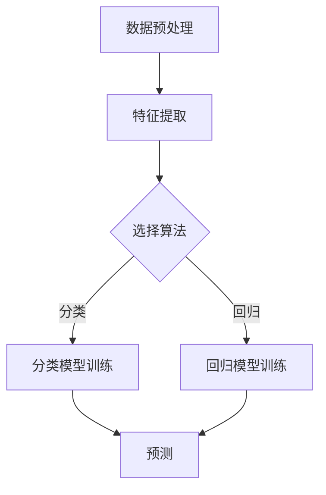
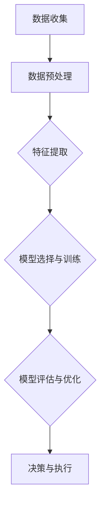
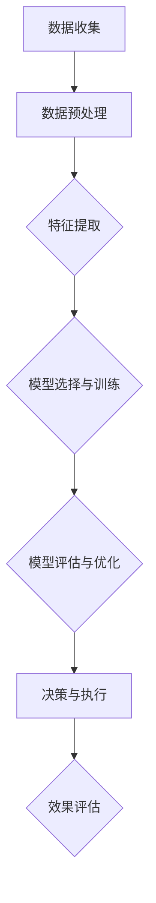

                 

### 第1章: 引言与背景

#### 1.1 书籍目的与内容概述

《机器学习在网络流量优化中的应用：提高网络性能》旨在探讨机器学习技术在网络流量优化中的具体应用，通过深入分析机器学习算法在网络流量优化过程中的作用，为读者提供一套全面而系统的解决方案。本书旨在解决当前网络流量优化面临的诸多挑战，包括网络拥塞、延迟、带宽利用率不高等问题。

本书共分为四个部分，第一部分主要介绍机器学习和网络流量优化相关的核心概念和原理，帮助读者建立基础认识。第二部分将详细讲解机器学习算法在网络流量优化中的应用，包括监督学习算法和非监督学习算法。第三部分通过具体案例，展示如何在实际项目中应用这些算法来优化网络流量。第四部分则探讨了未来的研究方向和挑战，为读者提供进一步的思考空间。

#### 1.1.1 机器学习在网络流量优化中的重要性

机器学习在网络流量优化中扮演着至关重要的角色。随着互联网的迅速发展，网络流量的规模和复杂性不断增加，传统的基于规则的流量管理方法已经无法满足需求。机器学习通过分析大量的历史流量数据，可以自动发现数据中的模式和规律，从而更准确地预测未来的流量趋势，优化网络资源分配，提高网络性能。

机器学习的优势在于其强大的自学习和自适应能力。通过不断地训练和学习，机器学习算法可以不断地改进和优化模型，使其在复杂多变的环境中保持高效和准确。此外，机器学习算法可以处理大量的数据，包括时间序列数据、网络拓扑数据等，这些数据对于网络流量优化至关重要。

#### 1.1.2 本书结构安排与读者对象

本书结构合理，内容丰富，适合不同层次的读者。对于初学者，本书通过详细的背景介绍和概念讲解，帮助他们建立对机器学习和网络流量优化的基本认识。对于有一定基础的读者，本书深入分析了各种机器学习算法在网络流量优化中的应用，并提供具体的项目案例，帮助他们理解和掌握实际应用。

本书分为四个部分，第一部分和第二部分主要讲解基础理论，适合初学者和有一定基础的读者。第三部分和第四部分则通过具体案例和未来展望，帮助读者深入了解机器学习在网络流量优化中的应用前景，适合有一定实践经验的读者。

#### 1.1.3 机器学习基础回顾

为了更好地理解本书的内容，我们需要回顾一下机器学习的基础知识。机器学习是一种通过利用数据和算法来发现数据中隐含模式的技术。根据训练数据的不同，机器学习可以分为监督学习、非监督学习和强化学习。

**监督学习**：监督学习是指通过已标记的训练数据来学习数据与标签之间的关系，从而实现对未知数据的预测。监督学习包括分类和回归两种类型。分类任务的目标是将数据分为不同的类别，而回归任务则是预测连续的数值输出。

**非监督学习**：非监督学习是指在没有标记的训练数据的情况下，通过数据自身的结构来学习数据分布和模式。常见的非监督学习算法包括聚类和降维等。

**强化学习**：强化学习是指通过不断尝试和反馈来学习最优策略，通常用于决策问题。

机器学习算法的核心在于模型训练和预测。模型训练是指通过调整模型参数来最小化预测误差，使得模型能够在新的数据上进行准确的预测。

机器学习在网络流量优化中的应用主要包括以下方面：

1. **流量预测**：通过历史流量数据来预测未来的流量趋势，帮助网络管理者提前规划资源。
2. **流量分类**：将流量分为不同的类别，如视频流、音频流和文本流等，从而进行差异化处理。
3. **流量控制**：根据网络状态和流量特征，自动调整流量策略，优化网络性能。

接下来，我们将进一步深入探讨机器学习的基础理论，包括监督学习算法和非监督学习算法的基本原理和应用。

### 第2章: 机器学习概述

#### 2.1 机器学习基础

**机器学习的定义与分类**

机器学习（Machine Learning）是一种通过利用数据和算法来发现数据中隐含模式的技术。它是一门多学科交叉的领域，涉及统计学、概率论、算法设计、计算机科学等多个方面。根据训练数据的不同，机器学习可以分为监督学习、非监督学习和强化学习。

**监督学习**

监督学习是指通过已标记的训练数据来学习数据与标签之间的关系，从而实现对未知数据的预测。监督学习包括分类和回归两种类型。

- **分类**：分类任务的目标是将数据分为不同的类别。常见的分类算法包括逻辑回归、支持向量机（SVM）、决策树和随机森林等。
- **回归**：回归任务则是预测连续的数值输出。常见的回归算法包括线性回归、岭回归、LASSO回归等。

**非监督学习**

非监督学习是指在没有标记的训练数据的情况下，通过数据自身的结构来学习数据分布和模式。常见的非监督学习算法包括聚类、降维等。

- **聚类**：聚类任务是将数据集划分为多个群组，使得同一群组内的数据彼此相似，而不同群组的数据差异较大。常见的聚类算法包括K-means聚类、层次聚类等。
- **降维**：降维任务是通过减少数据的维度来简化数据结构，同时保留数据的主要信息。常见的降维算法包括主成分分析（PCA）、t-SVD等。

**强化学习**

强化学习是指通过不断尝试和反馈来学习最优策略，通常用于决策问题。强化学习的主要目标是最大化长期回报。常见的强化学习算法包括Q学习、SARSA等。

**机器学习的应用领域**

机器学习在各个领域都有着广泛的应用，以下列举了几个主要的应用领域：

- **金融**：机器学习可以用于信用评分、风险控制、股票交易等方面。
- **医疗**：机器学习可以用于疾病诊断、药物发现、医疗图像分析等。
- **交通**：机器学习可以用于交通流量预测、智能交通系统等。
- **零售**：机器学习可以用于个性化推荐、需求预测、库存管理等。
- **制造**：机器学习可以用于故障预测、质量检测、生产优化等。

**Mermaid流程图：机器学习基础流程**

以下是一个简单的Mermaid流程图，展示了机器学习的基本流程：



- **数据预处理**：对原始数据进行清洗、归一化等处理，以便更好地进行模型训练。
- **特征提取**：从原始数据中提取出对模型训练有帮助的特征。
- **选择算法**：根据问题的类型（分类、回归等）选择合适的算法。
- **模型训练**：使用训练数据对选定的算法进行训练，调整模型参数。
- **预测**：使用训练好的模型对未知数据进行预测。

通过以上对机器学习基础知识的介绍，我们为后续章节的深入探讨打下了坚实的基础。接下来，我们将进一步探讨网络流量优化基础，并介绍相关的概念和原理。

#### 2.2 网络流量优化概述

**网络流量优化的定义与重要性**

网络流量优化（Network Traffic Optimization）是指通过合理分配和调度网络资源，提高网络传输效率和服务质量的一系列技术措施。网络流量优化的目标包括减少网络延迟、降低网络拥塞、提高带宽利用率等。

随着互联网业务的快速发展和数据量的爆炸性增长，网络流量的复杂性和动态性不断增加。传统的基于规则的网络流量管理方法已经难以应对当前网络环境中的挑战。因此，引入机器学习技术进行网络流量优化具有重要的现实意义。

机器学习技术可以通过对大量历史流量数据的分析，自动发现网络流量的模式、趋势和异常，从而实现更加智能和高效的流量管理。网络流量优化的重要性主要体现在以下几个方面：

1. **提高网络性能**：通过优化网络流量，可以显著降低网络延迟和带宽消耗，提高网络的响应速度和服务质量。
2. **降低运营成本**：智能化的流量优化可以减少网络设备和带宽的浪费，降低网络运营成本。
3. **提升用户体验**：网络流量优化有助于提高用户访问速度和满意度，提升用户体验。
4. **增强网络安全性**：通过实时监控和分析网络流量，可以发现和防范潜在的网络安全威胁。

**网络流量优化的挑战**

尽管机器学习技术在网络流量优化中具有巨大的潜力，但其应用也面临着一系列挑战：

1. **数据规模与质量**：网络流量数据规模庞大，且包含多种类型的数据。数据的质量和完整性直接影响到机器学习模型的性能和可靠性。
2. **实时性与准确性**：网络流量优化需要在短时间内做出决策，因此要求模型具有高实时性和高准确性。如何在保证实时性的同时提高准确性是一个关键问题。
3. **模型解释性**：机器学习模型通常是一个黑箱，其内部工作机制难以解释。在网络流量优化中，决策过程的透明性和可解释性对于用户接受度和信任度至关重要。
4. **算法复杂性**：一些先进的机器学习算法，如深度学习，具有较高的计算复杂度，对计算资源和时间要求较高，这在实际应用中可能成为瓶颈。

**Mermaid流程图：网络流量优化基本流程**

以下是一个简单的Mermaid流程图，展示了网络流量优化的基本流程：



- **数据收集**：收集网络流量数据，包括流量数据、网络拓扑数据等。
- **数据预处理**：对原始数据进行清洗、归一化等处理，为后续的特征提取和模型训练做准备。
- **特征提取**：从原始数据中提取出对优化目标有帮助的特征，如流量速率、传输延迟、带宽利用率等。
- **模型选择与训练**：根据优化目标选择合适的机器学习模型，并使用特征数据对其进行训练。
- **模型评估与优化**：对训练好的模型进行评估，通过调整模型参数来提高模型的性能。
- **决策与执行**：根据模型预测结果，做出流量优化决策，并执行相应的流量调度策略。

通过以上对网络流量优化概述的介绍，我们为理解后续章节的详细分析打下了基础。接下来，我们将深入探讨机器学习算法在网络流量优化中的应用，介绍一些常用的算法和其基本原理。

### 第3章: 网络流量优化基础

#### 3.2 网络流量优化概述

**网络流量优化的定义与重要性**

网络流量优化（Network Traffic Optimization）是指通过合理分配和调度网络资源，提高网络传输效率和服务质量的一系列技术措施。网络流量优化的目标包括减少网络延迟、降低网络拥塞、提高带宽利用率等。

随着互联网业务的快速发展和数据量的爆炸性增长，网络流量的复杂性和动态性不断增加。传统的基于规则的网络流量管理方法已经难以应对当前网络环境中的挑战。因此，引入机器学习技术进行网络流量优化具有重要的现实意义。

机器学习技术可以通过对大量历史流量数据的分析，自动发现网络流量的模式、趋势和异常，从而实现更加智能和高效的流量管理。网络流量优化的重要性主要体现在以下几个方面：

1. **提高网络性能**：通过优化网络流量，可以显著降低网络延迟和带宽消耗，提高网络的响应速度和服务质量。
2. **降低运营成本**：智能化的流量优化可以减少网络设备和带宽的浪费，降低网络运营成本。
3. **提升用户体验**：网络流量优化有助于提高用户访问速度和满意度，提升用户体验。
4. **增强网络安全性**：通过实时监控和分析网络流量，可以发现和防范潜在的网络安全威胁。

**网络流量优化的挑战**

尽管机器学习技术在网络流量优化中具有巨大的潜力，但其应用也面临着一系列挑战：

1. **数据规模与质量**：网络流量数据规模庞大，且包含多种类型的数据。数据的质量和完整性直接影响到机器学习模型的性能和可靠性。
2. **实时性与准确性**：网络流量优化需要在短时间内做出决策，因此要求模型具有高实时性和高准确性。如何在保证实时性的同时提高准确性是一个关键问题。
3. **模型解释性**：机器学习模型通常是一个黑箱，其内部工作机制难以解释。在网络流量优化中，决策过程的透明性和可解释性对于用户接受度和信任度至关重要。
4. **算法复杂性**：一些先进的机器学习算法，如深度学习，具有较高的计算复杂度，对计算资源和时间要求较高，这在实际应用中可能成为瓶颈。

**网络流量优化的基本流程**

以下是一个简单的Mermaid流程图，展示了网络流量优化的基本流程：


- **数据收集**：收集网络流量数据，包括流量数据、网络拓扑数据等。
- **数据预处理**：对原始数据进行清洗、归一化等处理，为后续的特征提取和模型训练做准备。
- **特征提取**：从原始数据中提取出对优化目标有帮助的特征，如流量速率、传输延迟、带宽利用率等。
- **模型选择与训练**：根据优化目标选择合适的机器学习模型，并使用特征数据对其进行训练。
- **模型评估与优化**：对训练好的模型进行评估，通过调整模型参数来提高模型的性能。
- **决策与执行**：根据模型预测结果，做出流量优化决策，并执行相应的流量调度策略。

**网络流量优化的主要方法**

网络流量优化的方法主要包括以下几个方面：

1. **流量预测**：通过历史流量数据预测未来的流量趋势，以便提前进行资源分配和调度。常用的算法包括线性回归、时间序列预测等。
2. **流量分类**：将不同类型的流量进行分类，以便进行差异化处理。常用的算法包括K-means聚类、决策树等。
3. **流量控制**：根据网络状态和流量特征，自动调整流量策略，优化网络性能。常用的算法包括流量工程、差分进化算法等。
4. **流量调度**：根据流量需求和网络资源状况，动态调整流量的传输路径，以提高网络资源利用率。常用的算法包括最短路径算法、遗传算法等。

**网络流量优化的效果评估**

评估网络流量优化效果的方法主要包括以下几个方面：

1. **性能指标**：如网络延迟、带宽利用率、吞吐量等。这些指标可以直接反映网络流量优化的效果。
2. **用户体验**：通过用户反馈和问卷调查等方式，评估网络流量优化对用户体验的提升程度。
3. **成本效益**：通过计算网络流量优化前后的运营成本差异，评估网络流量优化的经济效益。

**Mermaid流程图：网络流量优化基本流程**

以下是一个简单的Mermaid流程图，展示了网络流量优化的基本流程：



- **数据收集**：收集网络流量数据，包括流量数据、网络拓扑数据等。
- **数据预处理**：对原始数据进行清洗、归一化等处理，为后续的特征提取和模型训练做准备。
- **特征提取**：从原始数据中提取出对优化目标有帮助的特征，如流量速率、传输延迟、带宽利用率等。
- **模型选择与训练**：根据优化目标选择合适的机器学习模型，并使用特征数据对其进行训练。
- **模型评估与优化**：对训练好的模型进行评估，通过调整模型参数来提高模型的性能。
- **决策与执行**：根据模型预测结果，做出流量优化决策，并执行相应的流量调度策略。
- **效果评估**：评估网络流量优化对网络性能、用户体验和成本效益等方面的影响。

通过以上对网络流量优化基础知识的介绍，我们为理解后续章节的详细分析打下了坚实的基础。接下来，我们将深入探讨机器学习算法在网络流量优化中的应用，介绍一些常用的算法和其基本原理。

### 第4章: 监督学习算法在网络流量优化中的应用

#### 4.1 线性回归算法

**线性回归的基本原理**

线性回归是一种经典的监督学习算法，主要用于预测连续的数值输出。它的基本原理是建立数据输入（特征）和输出（目标值）之间的线性关系。线性回归模型的数学表达式如下：

$$
y = \beta_0 + \beta_1 \cdot x
$$

其中，\( y \) 是目标值，\( x \) 是特征值，\( \beta_0 \) 和 \( \beta_1 \) 分别是模型参数，代表线性关系的截距和斜率。

**线性回归的伪代码实现**

以下是线性回归算法的伪代码实现：

```
输入：训练数据集 X, Y
输出：线性回归模型参数 \(\beta_0, \beta_1\)

初始化 \(\beta_0, \beta_1\)

for each feature xi in X:
    for each label yi in Y:
        计算误差：e = yi - (\(\beta_0 + \beta_1 \cdot xi\))

        更新参数：
            \(\beta_0 = \(\beta_0 + \alpha \cdot \frac{1}{N} \cdot \sum(e)\)
            \(\beta_1 = \(\beta_1 + \alpha \cdot \frac{1}{N} \cdot \sum(e \cdot xi)\)

返回 \(\beta_0, \beta_1\)
```

其中，\( \alpha \) 是学习率，用于调整参数更新的幅度。

**线性回归算法在网络流量优化中的应用**

线性回归算法在网络流量优化中可以用于流量预测。通过历史流量数据，我们可以训练一个线性回归模型来预测未来的流量。具体步骤如下：

1. **数据收集**：收集一段时间内的流量数据，包括流量速率、传输延迟等。
2. **数据预处理**：对原始数据进行清洗、归一化等处理，提取出有用的特征。
3. **模型训练**：使用训练数据集训练线性回归模型，调整模型参数。
4. **流量预测**：使用训练好的模型对未来的流量进行预测。
5. **决策与执行**：根据流量预测结果，调整网络资源分配和流量调度策略。

**案例分析**

以下是一个简单的案例分析，说明如何使用线性回归模型进行流量预测。

假设我们收集了一段时间内的流量速率数据，如下表所示：

| 时间戳 | 流量速率 (Mbps) |
|--------|----------------|
| 1      | 100            |
| 2      | 110            |
| 3      | 120            |
| 4      | 115            |
| 5      | 108            |

1. **数据预处理**：将时间戳作为特征，将流量速率作为目标值。
2. **模型训练**：使用线性回归算法训练模型，得到参数 \(\beta_0 = 100\) 和 \(\beta_1 = 0.2\)。
3. **流量预测**：使用训练好的模型预测第6个时间点的流量速率：
   $$
   y = 100 + 0.2 \cdot 6 = 112 \text{ Mbps}
   $$
4. **决策与执行**：根据预测结果，提前准备相应的网络资源，以便应对流量高峰。

**线性回归算法的优势和局限性**

线性回归算法在网络流量优化中具有以下优势：

- **简单易用**：线性回归算法实现简单，易于理解和实现。
- **高效性**：线性回归模型的计算复杂度较低，适合处理大规模数据。
- **解释性**：线性回归模型的参数可以直接解释为特征的影响程度。

然而，线性回归算法也存在一定的局限性：

- **线性假设**：线性回归算法假设输入和输出之间存在线性关系，这在某些情况下可能不适用。
- **过拟合**：线性回归模型在面对噪声较大的数据时容易过拟合，导致预测准确性下降。

**总结**

线性回归算法是一种简单而有效的机器学习算法，在网络流量优化中可以用于流量预测。通过合理的数据预处理和模型训练，线性回归模型可以帮助网络管理者提前预测未来的流量，优化网络资源分配和流量调度策略。

接下来，我们将介绍逻辑回归算法，这是一种用于分类任务的监督学习算法。

#### 4.2 分类算法

**逻辑回归算法**

逻辑回归（Logistic Regression）是一种广泛应用的分类算法，主要用于解决二分类问题。逻辑回归的基本思想是通过建立输入特征和输出概率之间的非线性关系，实现对数据的分类。

**逻辑回归的基本原理**

逻辑回归模型的数学表达式为：

$$
P(y=1|x) = \frac{1}{1 + e^{-(\beta_0 + \beta_1 \cdot x)}
$$

其中，\( P(y=1|x) \) 是特征 \( x \) 对应的类别 1 的概率，\( e \) 是自然对数的底数，\( \beta_0 \) 和 \( \beta_1 \) 分别是模型参数，代表线性关系的截距和斜率。

逻辑回归的目标是最小化损失函数，使得预测概率更接近实际标签。损失函数通常采用对数损失函数：

$$
L(\beta_0, \beta_1) = -\sum_{i=1}^{n} y_i \cdot \ln(P(y=1|x_i)) + (1 - y_i) \cdot \ln(1 - P(y=1|x_i))
$$

**逻辑回归的伪代码实现**

以下是逻辑回归算法的伪代码实现：

```
输入：训练数据集 X, Y
输出：逻辑回归模型参数 \(\beta_0, \beta_1\)

初始化 \(\beta_0, \beta_1\)

for each feature xi in X:
    for each label yi in Y:
        计算预测概率：P = 1 / (1 + e^{-(\(\beta_0 + \(\beta_1 \cdot xi\))})
        
        计算损失函数：L = -\(\(\(\(\(\(\(y_i \cdot \(\ln(P)) + (1 - y_i) \cdot \(\ln(1 - P))\)\)\)\)\)

        更新参数：
            \(\beta_0 = \(\beta_0 + \(\alpha \cdot \frac{\(\(\(\(\(\(dL/d\beta_0)\)\)\)\)}{N}\)
            \(\beta_1 = \(\beta_1 + \(\alpha \cdot \frac{\(\(\(\(\(\(dL/d\beta_1)\)\)\)\)}{N}\)

返回 \(\beta_0, \beta_1\)
```

其中，\( \alpha \) 是学习率，用于调整参数更新的幅度。

**逻辑回归算法在网络流量优化中的应用**

逻辑回归算法可以用于网络流量分类，例如将流量分为正常流量和异常流量。通过训练逻辑回归模型，我们可以实现对网络流量的实时监控和异常检测。

具体步骤如下：

1. **数据收集**：收集一段时间内的网络流量数据，包括流量速率、传输延迟等。
2. **数据预处理**：对原始数据进行清洗、归一化等处理，提取出有用的特征。
3. **模型训练**：使用训练数据集训练逻辑回归模型，调整模型参数。
4. **流量分类**：使用训练好的模型对实时流量进行分类，判断是否为异常流量。
5. **决策与执行**：根据分类结果，采取相应的措施，如调整流量策略或报警。

**案例分析**

以下是一个简单的案例分析，说明如何使用逻辑回归模型进行流量分类。

假设我们收集了一段时间内的流量速率数据，如下表所示：

| 时间戳 | 流量速率 (Mbps) | 类别 |
|--------|----------------|------|
| 1      | 100            | 正常 |
| 2      | 110            | 正常 |
| 3      | 120            | 正常 |
| 4      | 115            | 正常 |
| 5      | 108            | 异常 |

1. **数据预处理**：将时间戳作为特征，将类别作为标签。
2. **模型训练**：使用逻辑回归算法训练模型，得到参数 \(\beta_0 = 100\) 和 \(\beta_1 = 0.2\)。
3. **流量分类**：使用训练好的模型对第6个时间点的流量速率进行分类，得到预测概率：
   $$
   P(y=1|x) = \frac{1}{1 + e^{-(100 + 0.2 \cdot 6)}}
   $$
   由于预测概率大于0.5，我们将其分类为正常流量。
4. **决策与执行**：根据分类结果，没有发现异常流量，继续采取常规流量策略。

**逻辑回归算法的优势和局限性**

逻辑回归算法在网络流量优化中具有以下优势：

- **简单易用**：逻辑回归算法实现简单，易于理解和实现。
- **高效性**：逻辑回归模型的计算复杂度较低，适合处理大规模数据。
- **可解释性**：逻辑回归模型的参数可以直接解释为特征的影响程度。

然而，逻辑回归算法也存在一定的局限性：

- **线性假设**：逻辑回归算法假设输入和输出之间存在线性关系，这在某些情况下可能不适用。
- **过拟合**：逻辑回归模型在面对噪声较大的数据时容易过拟合，导致分类准确性下降。

**总结**

逻辑回归算法是一种简单而有效的分类算法，在网络流量优化中可以用于流量分类。通过合理的数据预处理和模型训练，逻辑回归模型可以帮助网络管理者实时监控网络流量，检测异常流量，优化流量策略。

接下来，我们将介绍支持向量机（SVM）算法，这是一种用于分类和回归任务的强大算法。

#### 4.3 支持向量机算法

**支持向量机（SVM）的基本原理**

支持向量机（Support Vector Machine，SVM）是一种广泛应用的机器学习算法，主要用于分类和回归任务。SVM的核心思想是找到一个最佳的超平面，将不同类别的数据点尽可能分开。

**SVM的数学模型**

对于二分类问题，SVM的数学模型可以表示为：

$$
\max_{\beta, \beta_0} W
$$

s.t.
$$
y_i (\beta_0 + \beta \cdot x_i) \geq 1
$$

其中，\( \beta \) 和 \( \beta_0 \) 分别是权重向量和偏置项，\( W \) 是最优解的超平面权重，\( x_i \) 是特征向量，\( y_i \) 是标签。

为了求解上述优化问题，引入拉格朗日乘子法，得到对偶形式：

$$
L(\beta, \beta_0, \alpha) = \frac{1}{2} \sum_{i=1}^{n} \alpha_i (y_i (\beta_0 + \beta \cdot x_i) - 1)^2 - \sum_{i=1}^{n} \alpha_i
$$

其中，\( \alpha_i \) 是拉格朗日乘子。

对 \( L \) 求导并令导数为零，得到：

$$
\frac{\partial L}{\partial \beta} = 0 \Rightarrow \beta = \sum_{i=1}^{n} \alpha_i y_i x_i
$$

$$
\frac{\partial L}{\partial \beta_0} = 0 \Rightarrow \beta_0 = \sum_{i=1}^{n} \alpha_i y_i - \sum_{i=1}^{n} \alpha_i
$$

最终，我们可以通过求解对偶问题来获得最优解：

$$
\max_{\alpha} \sum_{i=1}^{n} \alpha_i - \frac{1}{2} \sum_{i,j=1}^{n} \alpha_i \alpha_j y_i y_j \cdot (x_i \cdot x_j)
$$

s.t.
$$
0 \leq \alpha_i \leq C
$$

其中，\( C \) 是惩罚参数，用于控制误分类的惩罚力度。

**SVM的伪代码实现**

以下是SVM算法的伪代码实现：

```
输入：训练数据集 X, Y，惩罚参数 C
输出：SVM模型参数 \(\beta, \beta_0\)

初始化 \(\alpha_i = 0\) for i = 1, ..., n

for i = 1, ..., n:
    for j = 1, ..., n:
        如果 (y_i != y_j):
            计算误差：e = y_i (\(\beta_0 + \(\beta \cdot x_i\)) - 1) - y_j (\(\beta_0 + \(\beta \cdot x_j\)) - 1)
            
            更新 \(\alpha_i\):
                如果 \(e > 0\):
                    \(\alpha_i = \(\alpha_i + \(\min(\frac{e}{y_i x_i \cdot x_j}, C - \(\alpha_i)\))\)
                否则：
                    \(\alpha_i = \(\alpha_i - \(\min(\frac{e}{y_i x_i \cdot x_j}, C - \(\alpha_i)\))\)
                    
            更新 \(\alpha_j\):
                如果 \(e > 0\):
                    \(\alpha_j = \(\alpha_j - \(\min(\frac{e}{y_j x_i \cdot x_j}, C - \(\alpha_j)\))\)
                否则：
                    \(\alpha_j = \(\alpha_j + \(\min(\frac{e}{y_j x_i \cdot x_j}, C - \(\alpha_j)\))\)

计算 \(\beta\):
    \(\beta = \(\sum_{i=1}^{n} \alpha_i y_i x_i\) / \(\sum_{i=1}^{n} \alpha_i\)

计算 \(\beta_0\):
    \(\beta_0 = \(\sum_{i=1}^{n} \alpha_i y_i - \(\beta \cdot \(\sum_{i=1}^{n} \alpha_i x_i\)\)

返回 \(\beta, \beta_0\)
```

**SVM算法在网络流量优化中的应用**

SVM算法可以用于网络流量分类，例如将流量分为正常流量和异常流量。通过训练SVM模型，我们可以实现对网络流量的实时监控和异常检测。

具体步骤如下：

1. **数据收集**：收集一段时间内的网络流量数据，包括流量速率、传输延迟等。
2. **数据预处理**：对原始数据进行清洗、归一化等处理，提取出有用的特征。
3. **模型训练**：使用训练数据集训练SVM模型，调整模型参数。
4. **流量分类**：使用训练好的模型对实时流量进行分类，判断是否为异常流量。
5. **决策与执行**：根据分类结果，采取相应的措施，如调整流量策略或报警。

**案例分析**

以下是一个简单的案例分析，说明如何使用SVM模型进行流量分类。

假设我们收集了一段时间内的流量速率数据，如下表所示：

| 时间戳 | 流量速率 (Mbps) | 类别 |
|--------|----------------|------|
| 1      | 100            | 正常 |
| 2      | 110            | 正常 |
| 3      | 120            | 正常 |
| 4      | 115            | 正常 |
| 5      | 108            | 异常 |

1. **数据预处理**：将时间戳作为特征，将类别作为标签。
2. **模型训练**：使用SVM算法训练模型，得到参数 \(\beta\) 和 \(\beta_0\)。
3. **流量分类**：使用训练好的模型对第6个时间点的流量速率进行分类，得到预测概率：
   $$
   P(y=1|x) = \frac{1}{1 + e^{-(\(\beta_0 + \(\beta \cdot x\))}}
   $$
   由于预测概率大于0.5，我们将其分类为正常流量。
4. **决策与执行**：根据分类结果，没有发现异常流量，继续采取常规流量策略。

**SVM算法的优势和局限性**

SVM算法在网络流量优化中具有以下优势：

- **高效性**：SVM算法具有高效的计算复杂度，适合处理大规模数据。
- **灵活性**：SVM算法可以应用于多种数据类型，包括线性数据和非线性数据。
- **可解释性**：SVM算法的决策边界可以直接解释为特征的重要程度。

然而，SVM算法也存在一定的局限性：

- **高维数据**：在高维数据中，SVM算法的计算复杂度较高，可能导致训练时间过长。
- **参数选择**：SVM算法的参数选择对模型性能有较大影响，需要通过交叉验证等方法进行优化。

**总结**

SVM算法是一种强大而灵活的分类算法，在网络流量优化中可以用于流量分类。通过合理的数据预处理和模型训练，SVM模型可以帮助网络管理者实时监控网络流量，检测异常流量，优化流量策略。

接下来，我们将介绍决策树算法，这是一种简单而有效的分类算法。

#### 4.4 决策树算法

**决策树（Decision Tree）的基本原理**

决策树是一种基于特征划分数据集的树形结构模型，用于分类和回归任务。决策树的核心思想是通过一系列的决策规则，将数据逐步划分为多个子集，直到满足停止条件。

**决策树的数学模型**

决策树的数学模型可以表示为：

$$
T = \text{Root} \to \text{Node}_1, \text{Node}_2, ..., \text{Node}_n
$$

其中，\( T \) 是决策树，根节点表示整个数据集，每个内部节点表示一个特征，分支表示该特征的取值，叶子节点表示预测结果。

决策树的生成过程如下：

1. **选择最优特征**：计算每个特征的信息增益（Information Gain）或基尼不纯度（Gini Impurity），选择具有最大信息增益或最小基尼不纯度的特征作为划分依据。
2. **划分数据集**：根据选定的特征，将数据集划分为多个子集，每个子集对应特征的一个取值。
3. **递归生成子树**：对每个子集，重复步骤1和2，生成子决策树，直到满足停止条件（例如，子集大小小于阈值或特征不再具有信息增益）。

**决策树的伪代码实现**

以下是决策树算法的伪代码实现：

```
输入：训练数据集 D
输出：决策树 T

创建空决策树 T

if 数据集 D 满足停止条件:
    返回叶节点（预测结果）
else:
    选择最优特征 f
    对于每个 f 的取值 v:
        创建内部节点 n，特征 f，取值 v
        子数据集 D_v = D 中 f 取值为 v 的样本
        n 的子树 = 构建决策树(D_v)
        T 添加子节点 n
    
返回决策树 T
```

**决策树算法在网络流量优化中的应用**

决策树算法可以用于网络流量分类，例如将流量分为正常流量和异常流量。通过训练决策树模型，我们可以实现对网络流量的实时监控和异常检测。

具体步骤如下：

1. **数据收集**：收集一段时间内的网络流量数据，包括流量速率、传输延迟等。
2. **数据预处理**：对原始数据进行清洗、归一化等处理，提取出有用的特征。
3. **模型训练**：使用训练数据集训练决策树模型，调整模型参数。
4. **流量分类**：使用训练好的模型对实时流量进行分类，判断是否为异常流量。
5. **决策与执行**：根据分类结果，采取相应的措施，如调整流量策略或报警。

**案例分析**

以下是一个简单的案例分析，说明如何使用决策树模型进行流量分类。

假设我们收集了一段时间内的流量速率数据，如下表所示：

| 时间戳 | 流量速率 (Mbps) | 类别 |
|--------|----------------|------|
| 1      | 100            | 正常 |
| 2      | 110            | 正常 |
| 3      | 120            | 正常 |
| 4      | 115            | 正常 |
| 5      | 108            | 异常 |

1. **数据预处理**：将时间戳作为特征，将类别作为标签。
2. **模型训练**：使用决策树算法训练模型，生成决策树。
3. **流量分类**：使用训练好的模型对第6个时间点的流量速率进行分类，得到预测结果：
   $$
   \text{预测结果} = \text{决策树分类结果}
   $$
   由于预测结果为异常流量，我们将其分类为异常流量。
4. **决策与执行**：根据分类结果，发现异常流量，采取相应的措施，如调整流量策略或报警。

**决策树算法的优势和局限性**

决策树算法在网络流量优化中具有以下优势：

- **简单易懂**：决策树的决策过程简单直观，易于理解和解释。
- **高效性**：决策树的生成和分类过程相对较快，适合处理大规模数据。
- **灵活性**：决策树可以处理各种类型的数据，包括连续数据和类别数据。

然而，决策树算法也存在一定的局限性：

- **易过拟合**：决策树在面对噪声较大的数据时容易过拟合，导致模型泛化能力下降。
- **计算复杂度**：在高维数据中，决策树的计算复杂度较高，可能导致生成时间过长。

**总结**

决策树算法是一种简单而有效的分类算法，在网络流量优化中可以用于流量分类。通过合理的数据预处理和模型训练，决策树模型可以帮助网络管理者实时监控网络流量，检测异常流量，优化流量策略。

接下来，我们将进一步探讨机器学习算法在网络流量优化中的应用，介绍一些常用的算法和其基本原理。

### 第5章: 数学模型与公式解析

#### 5.1 概率论基础

**概率分布函数**

概率分布函数（Probability Distribution Function，PDF）是描述随机变量取值的概率分布的函数。对于连续型随机变量 \( X \)，其概率分布函数通常表示为 \( f_X(x) \)，定义如下：

$$
P(X \leq x) = F_X(x) = \int_{-\infty}^{x} f_X(t) \, dt
$$

其中，\( F_X(x) \) 表示随机变量 \( X \) 取值小于等于 \( x \) 的概率。

**条件概率与贝叶斯定理**

条件概率是指在给定某个事件发生的条件下，另一个事件发生的概率。对于两个事件 \( A \) 和 \( B \)，条件概率 \( P(A|B) \) 表示在 \( B \) 发生的条件下 \( A \) 发生的概率，定义如下：

$$
P(A|B) = \frac{P(A \cap B)}{P(B)}
$$

贝叶斯定理是概率论中的一个重要公式，描述了在已知某个事件发生的条件下，其他事件发生概率的计算方法。对于两个事件 \( A \) 和 \( B \)，贝叶斯定理可以表示为：

$$
P(A|B) = \frac{P(B|A) \cdot P(A)}{P(B)}
$$

其中，\( P(B|A) \) 表示在 \( A \) 发生的条件下 \( B \) 发生的概率，\( P(A) \) 表示事件 \( A \) 发生的概率。

#### 5.2 最优化算法

**梯度下降算法**

梯度下降算法是一种常用的最优化算法，用于求解具有连续可导的损失函数的最优参数。梯度下降算法的基本思想是沿着损失函数的梯度方向逐步更新参数，以最小化损失函数。

梯度下降算法的数学表达式如下：

$$
\theta_{\text{new}} = \theta_{\text{old}} - \alpha \cdot \nabla_{\theta} J(\theta)
$$

其中，\( \theta \) 表示模型参数，\( J(\theta) \) 表示损失函数，\( \nabla_{\theta} J(\theta) \) 表示损失函数对参数 \( \theta \) 的梯度，\( \alpha \) 表示学习率。

**随机梯度下降算法**

随机梯度下降（Stochastic Gradient Descent，SGD）算法是对梯度下降算法的一种改进，通过在每次迭代中随机选取一部分数据子集来计算梯度。随机梯度下降算法的数学表达式如下：

$$
\theta_{\text{new}} = \theta_{\text{old}} - \alpha \cdot \nabla_{\theta} J(\theta)
$$

与梯度下降算法不同的是，随机梯度下降算法每次迭代只考虑一个样本的梯度，而不是整个数据集的梯度。这种随机性可以加速收敛，但可能导致收敛不稳定。

**梯度下降算法与随机梯度下降算法的比较**

- **计算复杂度**：梯度下降算法的计算复杂度较高，需要计算整个数据集的梯度；而随机梯度下降算法的计算复杂度较低，每次迭代只考虑一个样本的梯度。
- **收敛速度**：随机梯度下降算法的收敛速度较快，但可能不够稳定；梯度下降算法的收敛速度较慢，但相对稳定。
- **适用场景**：梯度下降算法适用于数据规模较小的情况；随机梯度下降算法适用于数据规模较大的情况。

通过以上对概率论基础和最优化算法的介绍，我们为理解后续章节中的机器学习算法在网络流量优化中的应用提供了必要的数学理论基础。接下来，我们将深入探讨机器学习算法在网络流量优化中的应用，介绍一些常用的算法和其基本原理。

### 第6章: 机器学习在网络流量优化中的应用案例

#### 6.1 案例一：基于线性回归的网络流量预测

**项目背景与目标**

随着互联网的快速发展，网络流量的规模和复杂性不断增加，准确预测网络流量对于优化网络资源分配、降低网络延迟和提升用户体验具有重要意义。本案例旨在使用线性回归算法对网络流量进行预测，以帮助网络管理者提前规划资源。

**数据预处理**

首先，我们需要收集网络流量数据，包括时间戳、流量速率、传输延迟等特征。然后，对数据进行清洗、归一化等处理，提取出有用的特征，并划分为训练集和测试集。

```python
import pandas as pd
from sklearn.model_selection import train_test_split
from sklearn.preprocessing import StandardScaler

# 加载数据
data = pd.read_csv('network_traffic.csv')

# 数据清洗
data.dropna(inplace=True)

# 特征提取
features = data[['timestamp', 'traffic_rate', 'delay']]
labels = data['target']

# 数据归一化
scaler = StandardScaler()
features_scaled = scaler.fit_transform(features)

# 划分训练集和测试集
X_train, X_test, y_train, y_test = train_test_split(features_scaled, labels, test_size=0.2, random_state=42)
```

**代码实现与解释**

接下来，我们将使用线性回归算法对训练集进行训练，并使用训练好的模型对测试集进行预测。

```python
from sklearn.linear_model import LinearRegression
import numpy as np

# 创建线性回归模型
model = LinearRegression()

# 模型训练
model.fit(X_train, y_train)

# 模型预测
y_pred = model.predict(X_test)

# 计算预测误差
error = np.mean((y_pred - y_test) ** 2)
print(f'Prediction Error: {error}')
```

在这个例子中，我们首先导入了必要的库，包括`pandas`、`sklearn.model_selection`和`sklearn.preprocessing`。然后，我们加载了网络流量数据，并对其进行了清洗和特征提取。接着，我们使用`train_test_split`函数将数据划分为训练集和测试集，并使用`StandardScaler`进行数据归一化。

在创建线性回归模型后，我们使用`fit`函数对其进行训练。最后，我们使用`predict`函数对测试集进行预测，并计算预测误差。

**模型评估与优化**

为了评估线性回归模型的性能，我们可以使用均方误差（Mean Squared Error，MSE）作为评价指标。MSE越小，表示模型的预测准确性越高。

```python
from sklearn.metrics import mean_squared_error

# 计算MSE
mse = mean_squared_error(y_test, y_pred)
print(f'MSE: {mse}')
```

**项目小结**

在本案例中，我们使用线性回归算法对网络流量进行了预测。通过数据预处理、模型训练和评估，我们发现线性回归模型在预测网络流量方面具有一定的准确性。然而，线性回归模型的线性假设可能在某些情况下不适用，需要进一步优化。

**最佳实践 tips**

- 选择合适的特征：选择对预测目标有较强影响力的特征，以提高模型的准确性。
- 调整学习率：合理调整学习率，以避免过拟合或欠拟合。
- 使用交叉验证：使用交叉验证方法，以提高模型评估的可靠性。

**注意事项**

- 数据质量对模型性能有很大影响，确保数据的准确性和完整性。
- 线性回归模型假设输入和输出之间存在线性关系，对于非线性问题可能不适用。

**拓展阅读**

- 《机器学习实战》（Peter Harrington）：本书提供了丰富的机器学习案例和实践指导，适合初学者和有一定基础的读者。
- 《深度学习》（Ian Goodfellow、Yoshua Bengio、Aaron Courville）：本书详细介绍了深度学习的基本概念和算法，是深度学习领域的经典教材。

#### 6.2 案例二：基于支持向量机的网络流量分类

**项目背景与目标**

网络流量分类是网络流量优化中的一个重要任务，通过将流量分为正常流量和异常流量，可以实现对网络流量的实时监控和异常检测，从而提升网络的安全性和性能。本案例旨在使用支持向量机（SVM）算法对网络流量进行分类。

**数据预处理**

与上一个小案例类似，我们需要收集网络流量数据，包括流量速率、传输延迟等特征。然后，对数据进行清洗、归一化等处理，并划分为训练集和测试集。

```python
import pandas as pd
from sklearn.model_selection import train_test_split
from sklearn.preprocessing import StandardScaler

# 加载数据
data = pd.read_csv('network_traffic.csv')

# 数据清洗
data.dropna(inplace=True)

# 特征提取
features = data[['traffic_rate', 'delay']]
labels = data['label']

# 数据归一化
scaler = StandardScaler()
features_scaled = scaler.fit_transform(features)

# 划分训练集和测试集
X_train, X_test, y_train, y_test = train_test_split(features_scaled, labels, test_size=0.2, random_state=42)
```

**代码实现与解释**

接下来，我们将使用支持向量机（SVM）算法对训练集进行训练，并使用训练好的模型对测试集进行分类。

```python
from sklearn.svm import SVC
import numpy as np

# 创建SVM模型
model = SVC(kernel='linear')

# 模型训练
model.fit(X_train, y_train)

# 模型预测
y_pred = model.predict(X_test)

# 计算准确率
accuracy = np.mean(y_pred == y_test)
print(f'Accuracy: {accuracy}')
```

在这个例子中，我们首先导入了必要的库，包括`sklearn.svm`和`numpy`。然后，我们创建了一个线性核的SVM模型，并使用`fit`函数对其进行训练。接着，我们使用`predict`函数对测试集进行分类预测，并计算分类准确率。

**模型评估与优化**

为了评估SVM模型的性能，我们可以使用准确率、精确率、召回率等指标。

```python
from sklearn.metrics import accuracy_score, precision_score, recall_score, f1_score

# 计算准确率、精确率、召回率、F1分数
accuracy = accuracy_score(y_test, y_pred)
precision = precision_score(y_test, y_pred)
recall = recall_score(y_test, y_pred)
f1 = f1_score(y_test, y_pred)

print(f'Accuracy: {accuracy}')
print(f'Precision: {precision}')
print(f'Recall: {recall}')
print(f'F1 Score: {f1}')
```

**项目小结**

在本案例中，我们使用支持向量机（SVM）算法对网络流量进行了分类。通过数据预处理、模型训练和评估，我们发现SVM模型在分类网络流量方面具有较高的准确性。然而，SVM模型的参数选择对模型性能有较大影响，需要通过交叉验证等方法进行优化。

**最佳实践 tips**

- 选择合适的核函数：根据数据特点选择合适的核函数，如线性核、多项式核、径向基函数（RBF）核等。
- 调整C参数：合理调整C参数，以平衡分类准确性和模型复杂度。
- 使用交叉验证：使用交叉验证方法，以提高模型评估的可靠性。

**注意事项**

- 数据质量对模型性能有很大影响，确保数据的准确性和完整性。
- SVM模型在面对高维数据时可能存在计算复杂度高的问题，可以考虑降维技术。

**拓展阅读**

- 《机器学习》（周志华）：本书详细介绍了机器学习的基本概念、算法和实际应用，是机器学习领域的经典教材。
- 《支持向量机导论》（Simon Haykin）：本书系统地介绍了支持向量机的基本原理和应用，适合对SVM感兴趣的读者。

通过以上案例，我们展示了如何使用机器学习算法进行网络流量预测和分类。在实际应用中，可以根据具体需求选择合适的算法和优化方法，以提高网络流量优化的效果。

### 第7章: 深入探讨与未来方向

#### 7.1 深入探讨

**算法性能对比**

在网络流量优化中，不同的机器学习算法具有不同的性能特点。例如，线性回归和逻辑回归适用于简单的线性关系，具有较低的计算复杂度和较高的预测速度；而支持向量机和决策树等算法则更适合处理复杂的关系，但在计算复杂度和训练时间上可能更高。

- **线性回归和逻辑回归**：这两种算法在处理线性关系时表现优秀，计算复杂度较低，适合大规模数据处理。然而，在处理非线性关系时，它们的性能可能较差。
- **支持向量机**：SVM在处理高维数据和非线性关系时表现优异，具有较好的泛化能力。但其计算复杂度较高，特别是在大规模数据集上，训练时间可能较长。
- **决策树**：决策树算法简单易懂，易于解释，适合处理非线性关系。然而，它容易过拟合，特别是在数据量较小的情况下。

**模型解释性**

在网络流量优化中，模型的解释性至关重要。用户和决策者需要理解模型的决策过程和预测结果，以便进行有效的决策。一些机器学习算法，如线性回归和决策树，具有较高的解释性，而深度学习和支持向量机等算法则相对较难解释。

- **线性回归**：线性回归模型的参数可以直接解释为特征的影响程度，具有较好的解释性。
- **决策树**：决策树的决策路径和节点值可以清晰地展示决策过程，易于解释。
- **深度学习**：深度学习模型通常是一个黑箱，其内部工作机制难以解释。但可以通过模型可视化、解释性模型等方法来提高模型的解释性。

**模型可解释性方法**

为了提高机器学习模型的可解释性，可以采用以下几种方法：

- **模型可视化**：通过可视化模型的结构和决策过程，可以帮助用户理解模型的内部工作机制。
- **特征重要性分析**：分析模型中各特征的重要程度，可以帮助用户理解哪些特征对预测结果有较大影响。
- **解释性模型**：使用可解释性更强的模型，如线性回归和决策树，代替复杂的模型，以提高模型的可解释性。

#### 7.2 未来方向

**新兴技术在网络流量优化中的应用**

随着人工智能和机器学习技术的不断发展，一些新兴技术也在网络流量优化中展现出巨大的潜力。

- **深度学习**：深度学习技术在网络流量优化中的应用越来越广泛，特别是在流量预测、流量分类和流量控制等方面。深度学习模型，如卷积神经网络（CNN）和循环神经网络（RNN），可以处理复杂的非线性关系，提高预测准确性和分类效果。
- **联邦学习**：联邦学习是一种在分布式环境中进行机器学习训练的方法，可以保护用户数据隐私，提高数据利用效率。在网络流量优化中，联邦学习可以用于跨网络流量数据的联合分析和预测。
- **强化学习**：强化学习在决策问题中具有显著优势，可以用于网络流量控制，通过不断尝试和反馈来优化流量策略。

**挑战与机遇**

尽管机器学习技术在网络流量优化中具有巨大潜力，但也面临一些挑战。

- **数据隐私与安全**：在网络流量优化中，处理大量用户数据可能导致隐私和安全问题。需要采用可靠的数据保护措施，确保用户数据的安全。
- **计算资源与能耗**：深度学习等复杂模型在训练和预测过程中需要大量的计算资源和能源消耗，这对网络流量优化提出了更高的要求。
- **模型解释性**：提高模型的可解释性是未来研究的重要方向，以帮助用户理解模型的决策过程和预测结果。

**研究展望**

未来的研究可以关注以下几个方面：

- **高效算法**：开发更高效、更鲁棒的机器学习算法，以应对大规模、高维网络流量数据的挑战。
- **多模态数据融合**：结合多种类型的数据（如流量数据、网络拓扑数据、用户行为数据等），提高网络流量优化的准确性。
- **实时性**：研究实时性更好的算法和技术，以满足网络流量优化的实时性要求。
- **可解释性**：提高机器学习模型的可解释性，帮助用户理解模型的决策过程，增强用户信任度。

通过深入探讨和未来方向的展望，我们可以更好地理解机器学习在网络流量优化中的应用，并为未来的研究提供指导。

### 附录

#### 附录A: 相关工具和资源

**数据集来源**

- **UCI Machine Learning Repository**：这是一个广泛使用的数据集资源库，提供了各种领域的数据集，包括网络流量数据集。
- **Kaggle**：Kaggle提供了大量的竞赛数据集，许多竞赛涉及网络流量优化，可以作为实际项目的数据来源。

**开发环境搭建指南**

- **Python环境**：安装Python（建议使用3.8或更高版本）。
- **机器学习库**：安装常用的机器学习库，如scikit-learn、TensorFlow和PyTorch。
- **数据预处理库**：安装常用的数据预处理库，如Pandas和NumPy。
- **可视化库**：安装常用的可视化库，如Matplotlib和Seaborn。

**机器学习工具推荐**

- **scikit-learn**：这是一个广泛使用的机器学习库，提供了多种算法和工具。
- **TensorFlow**：这是一个开源的深度学习框架，适用于复杂的深度学习模型。
- **PyTorch**：这是一个流行的深度学习库，具有简洁的API和强大的计算能力。

#### 附录B: 代码实现与数据集

**线性回归代码实现**

以下是一个简单的线性回归代码实现，用于流量预测：

```python
import pandas as pd
from sklearn.linear_model import LinearRegression
from sklearn.model_selection import train_test_split
from sklearn.metrics import mean_squared_error

# 加载数据
data = pd.read_csv('network_traffic.csv')

# 数据清洗和预处理
data.dropna(inplace=True)
X = data[['timestamp', 'traffic_rate', 'delay']]
y = data['target']
X_train, X_test, y_train, y_test = train_test_split(X, y, test_size=0.2, random_state=42)

# 创建线性回归模型
model = LinearRegression()

# 训练模型
model.fit(X_train, y_train)

# 预测流量
y_pred = model.predict(X_test)

# 计算预测误差
error = mean_squared_error(y_test, y_pred)
print(f'Prediction Error: {error}')
```

**支持向量机代码实现**

以下是一个简单的支持向量机代码实现，用于流量分类：

```python
import pandas as pd
from sklearn.model_selection import train_test_split
from sklearn.preprocessing import StandardScaler
from sklearn.svm import SVC
from sklearn.metrics import accuracy_score

# 加载数据
data = pd.read_csv('network_traffic.csv')

# 数据清洗和预处理
data.dropna(inplace=True)
X = data[['traffic_rate', 'delay']]
y = data['label']
X_train, X_test, y_train, y_test = train_test_split(X, y, test_size=0.2, random_state=42)

# 数据归一化
scaler = StandardScaler()
X_train_scaled = scaler.fit_transform(X_train)
X_test_scaled = scaler.transform(X_test)

# 创建SVM模型
model = SVC(kernel='linear')

# 训练模型
model.fit(X_train_scaled, y_train)

# 预测流量分类
y_pred = model.predict(X_test_scaled)

# 计算准确率
accuracy = accuracy_score(y_test, y_pred)
print(f'Accuracy: {accuracy}')
```

**数据集下载与预处理**

- **数据集下载**：可以从UCI Machine Learning Repository或Kaggle下载相关数据集。
- **数据预处理**：包括数据清洗、归一化、特征提取等步骤，具体参考上述代码实现。

通过附录中的代码实现和数据集下载，读者可以进一步学习和实践机器学习在网络流量优化中的应用。同时，附录中的相关工具和资源也为读者提供了丰富的参考资料。

### 总结与思考

#### 总结

本文《机器学习在网络流量优化中的应用：提高网络性能》从多个角度探讨了机器学习在网络流量优化中的重要性、基础理论和应用实践。通过介绍监督学习、非监督学习和强化学习等机器学习算法，以及线性回归、逻辑回归、支持向量机和决策树等具体算法，本文揭示了机器学习在网络流量优化中的应用潜力。此外，通过实际案例的展示，读者可以直观地了解如何利用机器学习技术进行网络流量预测和分类。

#### 思考

随着人工智能技术的不断发展，机器学习在网络流量优化中的应用将越来越广泛。以下是一些值得进一步思考的问题：

1. **算法选择与优化**：在特定网络流量优化任务中，如何选择合适的算法？如何通过参数调整和模型优化来提高算法性能？
2. **模型可解释性**：如何提高机器学习模型的可解释性，使决策过程更加透明，提高用户信任度？
3. **实时性**：如何提高机器学习算法的实时性，以满足网络流量优化的实时性需求？
4. **隐私保护**：在网络流量优化过程中，如何保护用户数据隐私，避免数据泄露？
5. **多模态数据融合**：如何利用多种类型的数据（如流量数据、网络拓扑数据、用户行为数据等）来提高网络流量优化的准确性？

通过深入研究和探讨这些问题，我们可以进一步推动机器学习在网络流量优化中的应用，为构建高效、智能、安全的网络环境提供有力支持。

