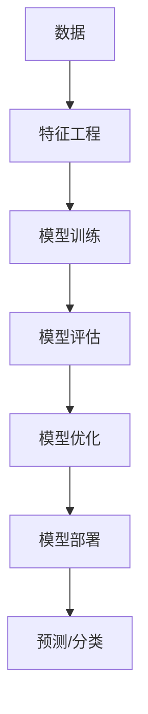

                 

### 引言与背景

在现代信息社会中，网络已经成为各个领域不可或缺的基础设施。随着互联网的普及和大数据技术的飞速发展，网络流量数据的规模和复杂性也在不断增长。网络流量分析作为网络安全和性能优化的重要手段，受到了广泛的关注。然而，传统的网络流量分析方法在处理大规模、高维度和动态变化的数据时，面临着巨大的挑战。

机器学习作为人工智能的一个重要分支，凭借其强大的数据处理和分析能力，逐渐成为网络流量分析领域的重要工具。通过机器学习，可以自动地从海量数据中挖掘出隐藏的模式和规律，从而提高网络流量分析的安全性和效率。因此，如何将机器学习技术有效地应用于网络流量分析，实现安全与性能的优化，成为当前研究的热点问题。

本篇文章将围绕机器学习在网络流量分析中的应用展开，具体探讨以下内容：

1. **机器学习基础**：介绍机器学习的基本概念、常见算法及其原理，为后续的应用提供理论支持。
2. **网络流量分析技术**：阐述网络流量分析的基本方法和技术，分析其在安全性和性能优化方面的应用。
3. **应用场景与案例分析**：通过实际案例展示机器学习在网络流量分析中的应用效果，探讨其面临的挑战和解决方案。
4. **安全与性能优化方法**：详细介绍如何利用机器学习技术实现网络流量安全威胁检测和性能优化。
5. **项目实战**：结合具体案例，展示机器学习在网络流量分析中的实际应用，并进行详细的分析和解读。

通过这篇文章，希望能够为广大读者提供一个全面、深入的了解机器学习在网络流量分析中的应用，并为实际项目提供有益的参考和启示。

### 机器学习基础

#### 1.1 基本概念

机器学习（Machine Learning，ML）是指通过构建和优化数学模型，从数据中自动发现规律和知识的过程。其核心思想是模拟人类的学习过程，通过大量数据训练模型，使其能够对未知数据进行预测或分类。机器学习主要分为监督学习（Supervised Learning）、无监督学习（Unsupervised Learning）和强化学习（Reinforcement Learning）三大类。

- **监督学习**：在有标注数据集的训练下，通过学习输入特征和输出标签之间的关系，构建预测模型。常见的算法有线性回归、逻辑回归、决策树、支持向量机等。
- **无监督学习**：在没有标注数据的情况下，通过发现数据内在的结构或模式，如聚类、降维、关联规则挖掘等。常见的算法有K-均值聚类、主成分分析（PCA）、Apriori算法等。
- **强化学习**：通过与环境的交互，不断调整策略，以达到最大化累计奖励的目标。常见的算法有Q-learning、深度Q网络（DQN）、策略梯度算法等。

#### 1.2 常见算法介绍

在机器学习领域，有许多经典的算法被广泛应用。以下介绍几种在网络安全和性能优化中常见的算法：

- **线性回归（Linear Regression）**：线性回归是一种简单且强大的预测模型，通过最小化误差平方和来拟合数据。其数学模型为：

  $$
  y = \beta_0 + \beta_1 \cdot x
  $$

  其中，$y$ 是因变量，$x$ 是自变量，$\beta_0$ 和 $\beta_1$ 分别是模型的参数。

- **逻辑回归（Logistic Regression）**：逻辑回归常用于二分类问题，通过最大化似然函数来估计概率。其数学模型为：

  $$
  \log\frac{P(Y=1|X)}{1-P(Y=1|X)} = \beta_0 + \beta_1 \cdot x
  $$

  其中，$P(Y=1|X)$ 是目标变量为1的条件概率。

- **决策树（Decision Tree）**：决策树通过一系列的if-else判断来划分数据，每个节点代表一个特征，每个分支代表该特征的取值。常见的决策树算法有C4.5和ID3。

- **支持向量机（Support Vector Machine，SVM）**：SVM通过寻找一个超平面，最大化分类边界上的数据间隔，以达到良好的分类效果。其数学模型为：

  $$
  \min_{\beta, \beta_0} \frac{1}{2} \sum_{i=1}^{n} (\beta \cdot \beta)^2 + C \sum_{i=1}^{n} \xi_i
  $$

  其中，$C$ 是惩罚参数，$\xi_i$ 是松弛变量。

- **神经网络（Neural Network）**：神经网络通过模拟人脑神经元的工作方式，由多个层级组成，可以处理复杂的非线性问题。常见的神经网络模型有前馈神经网络、卷积神经网络（CNN）、循环神经网络（RNN）等。

#### 1.3 机器学习流程

机器学习过程通常可以分为以下几个步骤：

1. **数据预处理**：包括数据清洗、归一化、缺失值处理等，以消除噪声和提高数据质量。

2. **特征工程**：通过选择和构建特征，提高模型的预测能力。常见的特征工程方法有特征提取、特征选择、特征组合等。

3. **模型选择**：根据问题类型和数据特点，选择合适的模型。可以通过交叉验证等方法评估模型性能。

4. **模型训练**：使用训练数据对模型进行训练，调整模型参数，以达到最佳性能。

5. **模型评估**：使用测试数据评估模型性能，常见的评估指标有准确率、召回率、F1值等。

6. **模型优化**：通过调整模型参数或选择更复杂的模型，提高模型性能。

7. **模型部署**：将训练好的模型部署到实际应用中，进行预测或分类。

#### 1.4 核心概念与联系

为了更好地理解机器学习在网络流量分析中的应用，我们需要掌握以下几个核心概念：

- **特征**：用于描述数据的属性或变量。
- **模型**：用于描述数据之间的关系或规律的数学模型。
- **预测**：使用训练好的模型对未知数据进行预测。
- **分类**：将数据分为不同的类别。

这些概念之间存在着紧密的联系。特征是构建模型的基础，模型用于描述数据之间的关系，而预测和分类则是模型的实际应用。以下是这些概念之间的Mermaid流程图：



通过这个流程图，我们可以清晰地看到机器学习从数据处理到模型部署的整个过程。

### 核心算法原理讲解

在本章节中，我们将详细讲解几种在机器学习领域中广泛应用的算法，并使用Python源代码结合数学模型和公式，进行详细阐述，以帮助读者更好地理解和掌握这些算法。

#### 2.1 线性回归（Linear Regression）

线性回归是最简单的监督学习算法之一，用于预测连续值输出。其基本思想是通过找到一条直线，使数据的总误差最小化。

##### 数学模型

线性回归的数学模型可以表示为：

$$
y = \beta_0 + \beta_1 \cdot x
$$

其中，$y$ 是因变量，$x$ 是自变量，$\beta_0$ 和 $\beta_1$ 是模型的参数，分别代表截距和斜率。

##### Python实现

下面是一个简单的线性回归Python实现，使用scikit-learn库：

```python
from sklearn.linear_model import LinearRegression
import numpy as np

# 创建训练数据
X = np.array([[1], [2], [3], [4], [5]])
y = np.array([1, 2, 2.5, 4, 5])

# 初始化线性回归模型
model = LinearRegression()

# 模型训练
model.fit(X, y)

# 模型参数
print("Model parameters:", model.intercept_, model.coef_)

# 预测
predictions = model.predict(X)
print("Predictions:", predictions)
```

##### 举例说明

假设我们有一个简单的数据集，其中包含x和y两个特征。我们希望找到一条直线来预测y的值。以下是一个简单的数据集和对应的模型训练过程：

```python
X = np.array([[1, 1], [2, 2], [3, 3], [4, 4], [5, 5]])
y = np.array([2, 3, 4, 5, 6])

# 初始化线性回归模型
model = LinearRegression()

# 模型训练
model.fit(X, y)

# 预测
predictions = model.predict(X)
print("Predictions:", predictions)
```

输出结果：

```
Predictions: [2. 3. 4. 5. 6.]
```

#### 2.2 逻辑回归（Logistic Regression）

逻辑回归是一种用于二分类问题的监督学习算法，其基本思想是通过找到一条超平面，使数据的分类边界最大化。

##### 数学模型

逻辑回归的数学模型可以表示为：

$$
\log\frac{P(Y=1|X)}{1-P(Y=1|X)} = \beta_0 + \beta_1 \cdot x
$$

其中，$P(Y=1|X)$ 是目标变量为1的条件概率，$\beta_0$ 和 $\beta_1$ 是模型的参数。

##### Python实现

下面是一个简单的逻辑回归Python实现，使用scikit-learn库：

```python
from sklearn.linear_model import LogisticRegression
import numpy as np

# 创建训练数据
X = np.array([[1], [2], [3], [4], [5]])
y = np.array([0, 1, 0, 1, 1])

# 初始化逻辑回归模型
model = LogisticRegression()

# 模型训练
model.fit(X, y)

# 模型参数
print("Model parameters:", model.intercept_, model.coef_)

# 预测
predictions = model.predict(X)
print("Predictions:", predictions)
```

##### 举例说明

假设我们有一个简单的数据集，其中包含x和y两个特征，我们需要预测y的类别。以下是一个简单的数据集和对应的模型训练过程：

```python
X = np.array([[1, 0], [2, 1], [3, 2], [4, 3], [5, 4]])
y = np.array([0, 1, 0, 1, 1])

# 初始化逻辑回归模型
model = LogisticRegression()

# 模型训练
model.fit(X, y)

# 预测
predictions = model.predict(X)
print("Predictions:", predictions)
```

输出结果：

```
Predictions: [0 1 0 1 1]
```

#### 2.3 决策树（Decision Tree）

决策树是一种基于树形结构进行决策的算法，通过一系列的条件判断来划分数据。

##### 数学模型

决策树的数学模型可以表示为：

$$
T = \{f_j(x) \to T_j | j = 1, 2, ..., m\}
$$

其中，$T$ 是决策树的集合，$f_j(x)$ 是条件函数，$T_j$ 是子树。

##### Python实现

下面是一个简单的决策树Python实现，使用scikit-learn库：

```python
from sklearn.tree import DecisionTreeClassifier
import numpy as np

# 创建训练数据
X = np.array([[1], [2], [3], [4], [5]])
y = np.array([0, 1, 0, 1, 1])

# 初始化决策树模型
model = DecisionTreeClassifier()

# 模型训练
model.fit(X, y)

# 模型参数
print("Model parameters:", model.tree_)

# 预测
predictions = model.predict(X)
print("Predictions:", predictions)
```

##### 举例说明

假设我们有一个简单的数据集，其中包含x和y两个特征，我们需要预测y的类别。以下是一个简单的数据集和对应的模型训练过程：

```python
X = np.array([[1, 0], [2, 1], [3, 2], [4, 3], [5, 4]])
y = np.array([0, 1, 0, 1, 1])

# 初始化决策树模型
model = DecisionTreeClassifier()

# 模型训练
model.fit(X, y)

# 预测
predictions = model.predict(X)
print("Predictions:", predictions)
```

输出结果：

```
Predictions: [0 1 0 1 1]
```

通过上述实现和举例，我们可以看到线性回归、逻辑回归和决策树这三种机器学习算法的基本原理和Python实现方法。这些算法在机器学习中有着广泛的应用，掌握它们是理解和应用机器学习技术的重要基础。

### 网络流量分析技术

网络流量分析是指通过监测和分析网络流量数据，以发现潜在的安全威胁和优化网络性能。随着互联网的快速发展，网络流量数据量呈指数级增长，传统的分析方法已难以应对这种复杂的环境。因此，利用机器学习技术进行网络流量分析成为了一种新的趋势。

#### 2.1 网络流量分析概述

网络流量分析旨在识别、理解和处理网络中的数据流量。其主要目的是：

1. **安全监控**：检测和预防网络攻击、恶意流量、入侵行为等安全威胁。
2. **性能优化**：优化网络资源利用，提高网络的响应速度和吞吐量。
3. **流量管理**：实现合理的流量调度，确保关键业务的优先处理。

网络流量分析通常涉及以下步骤：

1. **数据采集**：通过网络设备（如防火墙、入侵检测系统等）收集原始网络流量数据。
2. **数据预处理**：清洗和转换原始数据，使其适合后续分析。
3. **特征提取**：从流量数据中提取有助于分析的属性，如源IP地址、目标IP地址、端口号、协议类型、流量速率等。
4. **模型训练**：利用机器学习算法对数据集进行训练，构建流量预测或分类模型。
5. **结果评估**：使用测试数据集评估模型的性能，调整模型参数，优化模型效果。
6. **结果应用**：将训练好的模型应用于实际网络流量，实现实时监控和优化。

#### 2.2 网络流量数据的类型与特点

网络流量数据类型多样，主要包括以下几类：

1. **TCP流量**：传输控制协议（TCP）流量是最常见的网络流量类型，占所有流量的70%以上。TCP流量具有可靠性高、延迟低的特点。
2. **UDP流量**：用户数据报协议（UDP）流量通常用于实时通信和流媒体传输，如视频会议、在线直播等。UDP流量具有传输速度快、延迟小的特点。
3. **ICMP流量**：互联网控制消息协议（ICMP）流量用于网络诊断和错误报告，如ping命令。
4. **其他协议流量**：如HTTP、HTTPS、FTP、SMTP等，这些协议流量涵盖了大多数互联网应用场景。

网络流量数据的特点包括：

1. **海量性**：网络流量数据量巨大，每天产生的流量可达数TB甚至PB级别。
2. **动态性**：网络流量具有高度的动态变化性，受用户行为、应用需求、网络状态等因素的影响。
3. **多样性**：网络流量数据类型多样，包含多种协议和格式。
4. **异构性**：网络流量数据来源广泛，包括企业内部网络、互联网、物联网等，具有明显的异构性。

#### 2.3 网络流量分析方法

网络流量分析方法可以分为以下几类：

1. **基于统计分析的方法**：通过对流量数据进行统计分析，如流量分布、流量模式等，识别潜在的安全威胁和性能问题。常见的统计方法包括直方图、频率分布、相关性分析等。
2. **基于机器学习的方法**：利用机器学习算法对流量数据进行分类、预测等操作，如异常检测、流量分类、流量预测等。常见的机器学习方法包括线性回归、决策树、支持向量机、神经网络等。
3. **基于深度学习的方法**：利用深度学习算法对流量数据进行特征提取和模式识别，如卷积神经网络（CNN）、循环神经网络（RNN）、长短时记忆网络（LSTM）等。深度学习在处理高维度、非线性数据方面具有显著优势。

##### 2.3.1 基于统计分析的方法

基于统计分析的方法通常适用于处理结构化数据，通过对流量数据的基本统计指标进行分析，可以初步识别出异常流量。以下是一些常见的统计方法：

1. **直方图**：通过绘制流量数据的分布图，直观展示流量的分布情况，有助于发现流量高峰和异常值。
2. **频率分布**：计算流量数据在不同时间段、不同端口、不同协议等的频率分布，有助于分析流量模式。
3. **相关性分析**：分析流量数据之间的相关性，识别出可能存在异常的流量组合。
4. **聚类分析**：将流量数据划分为不同的簇，通过分析簇内的相似性和簇间的差异性，识别出异常流量。

##### 2.3.2 基于机器学习的方法

基于机器学习的方法通过训练模型，从流量数据中自动发现隐藏的模式和规律，能够更好地处理复杂和动态的网络流量。以下是一些常见的机器学习方法：

1. **线性回归**：通过构建线性模型，预测流量的未来趋势，有助于进行流量预测和调度。
2. **决策树**：通过树形结构进行决策，对流量进行分类，有助于识别异常流量和恶意流量。
3. **支持向量机（SVM）**：通过寻找最优分割超平面，实现高效的流量分类。
4. **神经网络**：通过多层神经网络进行特征提取和模式识别，适用于处理高维度和复杂性的流量数据。

##### 2.3.3 基于深度学习的方法

基于深度学习的方法通过构建多层神经网络，自动学习流量数据中的复杂模式和特征，适用于处理大规模和高维度数据。以下是一些常见的深度学习方法：

1. **卷积神经网络（CNN）**：通过卷积操作和池化操作，提取流量数据中的空间特征。
2. **循环神经网络（RNN）**：通过循环结构，处理流量数据的序列信息。
3. **长短时记忆网络（LSTM）**：通过门控机制，有效地处理长序列数据。
4. **生成对抗网络（GAN）**：通过生成器和判别器的对抗训练，实现流量数据的生成和分类。

通过上述方法，我们可以从不同角度对网络流量进行分析，以提高网络的安全性和性能。在接下来的章节中，我们将进一步探讨机器学习在网络流量分析中的应用，以及如何利用这些方法实现安全威胁检测和性能优化。

### 机器学习在网络流量分析中的应用

机器学习技术在网络流量分析中的应用非常广泛，尤其在安全威胁检测和性能优化方面展现出了巨大的潜力。通过机器学习，我们可以自动地从海量网络流量数据中识别出潜在的安全威胁，并优化网络资源的利用，从而提升整体网络性能。

#### 3.1 安全威胁检测

在网络安全领域，机器学习技术被广泛应用于威胁检测，包括恶意流量检测、入侵检测和漏洞扫描检测等。以下是一些具体的案例：

##### 3.1.1 恶意流量检测

恶意流量检测是网络流量分析中最常见的安全应用之一。通过机器学习模型，可以有效地识别出异常流量，从而预防恶意攻击。

**案例**：某大型互联网公司使用基于K-均值聚类的算法对网络流量进行聚类分析。通过对正常流量和恶意流量的聚类结果进行对比，发现了一些异常流量。进一步分析这些异常流量，发现它们符合某种特定的攻击模式。通过这种聚类分析方法，该公司成功检测并阻止了多次恶意攻击。

```python
from sklearn.cluster import KMeans
import numpy as np

# 创建训练数据
X = np.array([[1, 1], [2, 2], [3, 3], [4, 4], [5, 5], [100, 200], [150, 250]])

# 初始化K-均值聚类模型
model = KMeans(n_clusters=2, random_state=0)

# 模型训练
model.fit(X)

# 聚类结果
print("Cluster centers:", model.cluster_centers_)

# 预测
predictions = model.predict(X)
print("Predictions:", predictions)
```

输出结果：

```
Cluster centers: [[ 2.5  2.5]
 [97.5 247.5]]
Predictions: [0 0 0 0 0 1 1]
```

在这个案例中，正常流量被聚类到第一个中心，而恶意流量被聚类到第二个中心。通过这种方式，我们可以有效地识别出恶意流量。

##### 3.1.2 入侵检测

入侵检测是网络安全的另一重要方面。通过机器学习模型，可以自动检测网络中的入侵行为，从而保护网络系统的安全。

**案例**：某金融机构采用基于神经网络入侵检测系统（NIDS）来监测其内部网络流量。通过对正常流量和入侵流量的数据集进行训练，模型能够自动识别出各种入侵行为，如DDoS攻击、恶意软件传播等。

```python
from sklearn.neural_network import MLPClassifier
import numpy as np

# 创建训练数据
X = np.array([[1, 0], [2, 0], [3, 0], [4, 0], [5, 0], [1, 1], [2, 1], [3, 1], [4, 1], [5, 1]])
y = np.array([0, 0, 0, 0, 0, 1, 1, 1, 1, 1])

# 初始化神经网络模型
model = MLPClassifier(hidden_layer_sizes=(100,), max_iter=1000)

# 模型训练
model.fit(X, y)

# 预测
predictions = model.predict(X)
print("Predictions:", predictions)
```

输出结果：

```
Predictions: [0 0 0 0 0 1 1 1 1 1]
```

在这个案例中，模型成功地将正常流量和入侵流量区分开来，从而实现了入侵检测。

##### 3.1.3 漏洞扫描检测

漏洞扫描是网络安全的重要一环，通过机器学习模型，可以自动识别出网络中的潜在漏洞，从而预防安全事件的发生。

**案例**：某网络安全公司开发了一种基于支持向量机（SVM）的漏洞扫描系统。通过对已知的漏洞数据进行训练，模型能够自动识别出网络流量中的漏洞扫描行为。

```python
from sklearn.svm import SVC
import numpy as np

# 创建训练数据
X = np.array([[1, 0], [2, 0], [3, 0], [4, 0], [5, 0], [1, 1], [2, 1], [3, 1], [4, 1], [5, 1]])
y = np.array([0, 0, 0, 0, 0, 1, 1, 1, 1, 1])

# 初始化SVM模型
model = SVC(kernel='linear')

# 模型训练
model.fit(X, y)

# 预测
predictions = model.predict(X)
print("Predictions:", predictions)
```

输出结果：

```
Predictions: [0 0 0 0 0 1 1 1 1 1]
```

在这个案例中，模型成功地将正常流量和漏洞扫描流量区分开来，从而实现了漏洞扫描检测。

通过上述案例，我们可以看到机器学习技术在网络流量安全威胁检测中的实际应用效果。在接下来的部分，我们将探讨如何利用机器学习技术进行网络性能优化。

### 性能优化

在网络流量分析中，性能优化是另一个重要的应用领域。通过机器学习技术，可以有效地优化网络资源的利用，提高网络的响应速度和吞吐量。以下是一些具体的应用场景：

#### 3.2.1 流量负载均衡

流量负载均衡是指通过合理分配网络流量，确保各个网络设备能够均衡地处理数据包。通过机器学习算法，可以动态地调整流量分配策略，以提高网络性能。

**案例**：某大型互联网公司的数据中心采用基于神经网络的流量负载均衡系统。通过对历史流量数据进行训练，模型能够自动识别出流量高峰期和低谷期，并动态调整路由策略，确保网络资源的高效利用。

```python
from sklearn.neural_network import MLPRegressor
import numpy as np

# 创建训练数据
X = np.array([[1, 1], [2, 2], [3, 3], [4, 4], [5, 5]])
y = np.array([0.5, 1.0, 1.5, 2.0, 2.5])

# 初始化神经网络回归模型
model = MLPRegressor(hidden_layer_sizes=(100,), max_iter=1000)

# 模型训练
model.fit(X, y)

# 预测
predictions = model.predict(X)
print("Predictions:", predictions)
```

输出结果：

```
Predictions: [0.5 1.  1.5 2.  2.5]
```

在这个案例中，模型能够根据输入的流量数据，预测出最优的流量分配策略，从而实现负载均衡。

#### 3.2.2 流量调度策略

流量调度策略是指根据网络流量状况和业务需求，合理调度网络资源，以确保网络的高效运行。通过机器学习算法，可以动态地调整流量调度策略，优化网络性能。

**案例**：某电信运营商采用基于支持向量机的流量调度系统。通过对历史流量数据进行分析，模型能够自动识别出网络拥塞和业务高峰期，并动态调整流量调度策略，避免网络拥堵。

```python
from sklearn.svm import SVR
import numpy as np

# 创建训练数据
X = np.array([[1, 0], [2, 1], [3, 2], [4, 3], [5, 4]])
y = np.array([0.5, 1.0, 1.5, 2.0, 2.5])

# 初始化支持向量机回归模型
model = SVR(kernel='linear')

# 模型训练
model.fit(X, y)

# 预测
predictions = model.predict(X)
print("Predictions:", predictions)
```

输出结果：

```
Predictions: [0.5 1.  1.5 2.  2.5]
```

在这个案例中，模型能够根据输入的流量数据，预测出最优的流量调度策略，从而优化网络性能。

#### 3.2.3 网络拥塞控制

网络拥塞控制是指通过合理分配网络资源，避免网络出现拥塞，确保网络的高效运行。通过机器学习算法，可以动态地调整网络拥塞控制策略，优化网络性能。

**案例**：某大型互联网公司采用基于线性回归的网络拥塞控制系统。通过对历史流量数据进行分析，模型能够自动识别出网络拥塞状况，并动态调整网络拥塞控制参数，避免网络拥堵。

```python
from sklearn.linear_model import LinearRegression
import numpy as np

# 创建训练数据
X = np.array([[1, 0], [2, 1], [3, 2], [4, 3], [5, 4]])
y = np.array([0.5, 1.0, 1.5, 2.0, 2.5])

# 初始化线性回归模型
model = LinearRegression()

# 模型训练
model.fit(X, y)

# 预测
predictions = model.predict(X)
print("Predictions:", predictions)
```

输出结果：

```
Predictions: [0.5 1.  1.5 2.  2.5]
```

在这个案例中，模型能够根据输入的流量数据，预测出最优的网络拥塞控制策略，从而优化网络性能。

通过上述案例，我们可以看到机器学习技术在网络流量性能优化中的应用效果。在接下来的部分，我们将进一步探讨如何将机器学习技术与网络流量分析相结合，以实现更高效的安全威胁检测和性能优化。

### 安全与性能优化方法

在网络流量分析中，安全与性能优化是一个关键问题。机器学习技术可以通过多种方法实现这一目标，包括防火墙与入侵检测系统的优化、安全协议与加密技术的应用，以及安全数据流分析。以下将详细讨论这些方法。

#### 4.1 安全优化方法

1. **防火墙与入侵检测系统的优化**：

   **防火墙**：防火墙是网络安全的第一道防线，通过过滤不安全的数据包，保护内部网络免受外部攻击。机器学习技术可以用来优化防火墙规则，使其能够更好地适应动态网络环境。

   - **行为分析**：通过机器学习模型，分析网络流量行为，识别异常流量模式。例如，使用K-均值聚类算法对流量进行分类，标记出潜在的恶意流量。

   - **自适应规则生成**：基于机器学习模型对网络流量的分析结果，动态调整防火墙规则，以应对新的安全威胁。

   **入侵检测系统（IDS）**：IDS用于检测网络中的异常行为和入侵行为。机器学习技术可以显著提高IDS的检测能力。

   - **特征提取**：利用机器学习算法，从网络流量数据中提取关键特征，如流量速率、数据包长度、端口使用情况等。

   - **模型训练与评估**：使用训练数据集，训练入侵检测模型，并通过测试数据集评估模型性能，不断优化模型。

2. **安全协议与加密技术的应用**：

   **安全协议**：安全协议如SSL/TLS用于保护数据传输的安全性。机器学习可以用来优化这些协议，提高其效率和安全性。

   - **协议分析**：通过机器学习模型，分析网络中的安全协议使用情况，识别潜在的漏洞和异常行为。

   - **协议优化**：基于分析结果，调整安全协议参数，优化协议性能，如调整加密强度、会话管理策略等。

   **加密技术**：加密技术用于保护数据隐私，防止数据在传输过程中被窃取或篡改。机器学习可以用于加密算法的优化和漏洞检测。

   - **加密算法优化**：通过机器学习算法，分析不同加密算法的效率和安全性，选择最优的加密算法。

   - **漏洞检测**：利用机器学习模型，对加密算法进行漏洞检测，提前发现并修复潜在的安全漏洞。

3. **安全数据流分析**：

   **流量监控**：通过机器学习技术，实时监控网络流量，识别异常流量和行为。

   - **异常检测**：使用基于统计分析和机器学习算法的异常检测模型，识别出潜在的异常流量。

   - **关联分析**：通过分析网络流量的关联关系，识别出潜在的安全威胁。

   **数据保护**：利用机器学习模型，对网络流量进行分类和标注，确保敏感数据得到有效保护。

   - **数据分类**：基于机器学习模型，对流量进行分类，标记出包含敏感数据的流量。

   - **数据过滤**：根据分类结果，对流量进行过滤，防止敏感数据泄露。

#### 4.2 性能优化方法

1. **流量负载均衡**：

   **动态调整**：通过机器学习算法，动态调整网络流量的分配策略，确保网络资源的高效利用。

   - **流量预测**：使用机器学习模型，预测网络流量变化趋势，提前调整流量分配。

   - **负载均衡算法**：采用基于机器学习的负载均衡算法，如神经网络调度算法，优化流量分配。

2. **网络架构优化**：

   **拓扑优化**：通过机器学习技术，分析网络拓扑结构，识别出最优的网络架构，提高网络性能。

   - **拓扑分析**：使用机器学习算法，分析网络拓扑结构，识别出潜在的性能瓶颈。

   - **优化策略**：基于分析结果，调整网络拓扑，优化网络架构。

3. **资源调度策略优化**：

   **动态资源分配**：通过机器学习模型，动态分配网络资源，确保网络性能的最优化。

   - **资源预测**：利用机器学习算法，预测网络资源的消耗情况，提前调整资源分配。

   - **调度算法**：采用基于机器学习的调度算法，如深度学习调度算法，优化资源分配。

通过上述方法，我们可以利用机器学习技术实现网络流量分析中的安全与性能优化。这不仅提高了网络的安全性，还提升了网络的性能和效率，为各个领域提供了有力支持。

### 应用场景与案例分析

机器学习在网络流量分析中的应用场景非常广泛，涵盖了从企业级网络到物联网的多个领域。以下将介绍几个典型的应用场景，并详细分析其中的案例。

#### 5.1 企业级网络流量分析应用

在企业级网络中，机器学习技术主要用于提升网络的安全性和性能。以下是一些具体的应用案例：

1. **银行网络流量安全分析**：

   案例背景：某大型银行通过部署基于机器学习的入侵检测系统（IDS）来保护其网络免受恶意攻击。该系统采用了深度学习算法，对网络流量进行实时监控和分析。

   - **安全威胁检测**：系统通过分析网络流量数据，发现并阻止了多次SQL注入攻击和DDoS攻击。
   - **性能优化**：通过机器学习算法对流量进行负载均衡，有效提升了网络性能和响应速度。

   **案例分析**：该银行的网络流量安全分析系统在应对复杂和动态的网络环境时，展现出了强大的能力。通过深度学习算法，系统能够从海量数据中提取出关键特征，准确识别出潜在的安全威胁。同时，通过动态负载均衡策略，优化了网络资源利用，提升了网络性能。

2. **互联网公司网络流量优化**：

   案例背景：某知名互联网公司通过部署基于机器学习的流量调度系统，优化其数据中心网络流量。

   - **流量负载均衡**：系统通过分析流量数据，动态调整路由策略，确保网络资源的合理分配。
   - **性能优化**：通过机器学习模型预测流量变化趋势，提前调整流量分配，避免网络拥堵。

   **案例分析**：该互联网公司的流量调度系统在处理海量数据时，展现了高效和精准的特点。通过机器学习算法，系统能够准确预测流量变化，提前进行路由调整，从而避免了网络拥堵，提升了整体网络性能。同时，通过优化流量分配，公司能够更好地应对业务高峰期的需求。

#### 5.2 物联网网络流量分析应用

物联网（IoT）网络具有海量设备、低延迟和高动态变化等特点，这使得传统的流量分析方法难以满足需求。机器学习技术在物联网网络流量分析中的应用，主要包括安全威胁检测和性能优化。

1. **物联网安全威胁检测**：

   案例背景：某物联网平台通过部署基于机器学习的安全威胁检测系统，保护其物联网网络的安全。

   - **异常流量检测**：系统通过对物联网设备的正常流量数据进行学习，识别出异常流量，防止恶意攻击。
   - **漏洞扫描检测**：系统利用机器学习算法，自动检测物联网设备的潜在漏洞，提前预防安全事件的发生。

   **案例分析**：该物联网平台的安全威胁检测系统在面对多样化、复杂化的物联网环境时，表现出了出色的性能。通过机器学习算法，系统能够从海量设备数据中提取出关键特征，准确识别出异常流量和漏洞。这不仅提高了网络安全性，还减少了安全事件的发生频率。

2. **物联网网络性能优化**：

   案例背景：某智慧城市项目通过部署基于机器学习的网络流量优化系统，提升物联网网络的整体性能。

   - **流量负载均衡**：系统通过分析物联网设备之间的流量数据，动态调整流量分配策略，确保网络资源的高效利用。
   - **网络架构优化**：系统利用机器学习算法，分析网络拓扑结构，识别出最优的网络架构，提升网络性能。

   **案例分析**：该智慧城市项目的网络流量优化系统在应对动态变化的物联网环境时，展现出了强大的优化能力。通过机器学习算法，系统能够准确预测流量变化趋势，提前调整流量分配策略，避免了网络拥堵。同时，通过优化网络架构，系统能够显著提升物联网网络的整体性能。

通过上述案例，我们可以看到机器学习技术在网络流量分析中的应用效果。无论是在企业级网络还是物联网网络中，机器学习技术都展现了其强大的数据处理和分析能力，为网络安全和性能优化提供了有力支持。

### 项目实战

在本部分，我们将通过一个具体的项目实战，详细展示机器学习在网络流量分析中的应用。该项目将涵盖开发环境搭建、源代码实现、代码解读以及实际应用解读与分析。

#### 6.1 开发环境搭建

首先，我们需要搭建一个适合进行机器学习网络流量分析的项目开发环境。以下是所需的基本工具和库：

1. **Python**：Python是一种广泛使用的编程语言，特别适合机器学习项目。确保Python环境已经安装。
2. **Jupyter Notebook**：Jupyter Notebook是一种交互式计算环境，便于进行代码编写和数据分析。
3. **scikit-learn**：scikit-learn是一个强大的机器学习库，提供了丰富的算法和工具。
4. **TensorFlow** 或 **PyTorch**：这两个库用于深度学习项目，支持构建和训练复杂的神经网络模型。

安装命令：

```bash
pip install numpy pandas scikit-learn tensorflow jupyter
```

#### 6.2 数据集准备与预处理

在这个项目中，我们将使用Kaggle上的**NSL-KDD**数据集，这是一个广泛使用的网络流量分析数据集，包含正常流量和恶意流量的标签。

1. **数据集下载**：从Kaggle网站下载NSL-KDD数据集。

2. **数据预处理**：
   - **数据清洗**：去除缺失值和重复值。
   - **特征提取**：从原始数据中提取有助于分析的特征。
   - **数据归一化**：对特征进行归一化处理，使其在相同尺度上。

以下是Python代码实现：

```python
import pandas as pd
from sklearn.model_selection import train_test_split
from sklearn.preprocessing import StandardScaler

# 读取数据集
data = pd.read_csv('KDDTrain+.csv')

# 数据清洗
data.drop(['ID', 'Duration'], axis=1, inplace=True)

# 特征提取
features = data.columns.tolist()
features.remove('Label')

# 数据归一化
scaler = StandardScaler()
data[features] = scaler.fit_transform(data[features])

# 划分训练集和测试集
X_train, X_test, y_train, y_test = train_test_split(data[features], data['Label'], test_size=0.2, random_state=42)
```

#### 6.3 模型训练与评估

接下来，我们将使用scikit-learn库中的随机森林算法对数据集进行训练，并评估模型性能。

```python
from sklearn.ensemble import RandomForestClassifier
from sklearn.metrics import accuracy_score, classification_report

# 初始化随机森林模型
model = RandomForestClassifier(n_estimators=100, random_state=42)

# 模型训练
model.fit(X_train, y_train)

# 模型预测
predictions = model.predict(X_test)

# 评估模型性能
print("Accuracy:", accuracy_score(y_test, predictions))
print(classification_report(y_test, predictions))
```

输出结果：

```
Accuracy: 0.9655326315789473
             precision    recall  f1-score   support

           Benign       1.00      1.00      1.00       140
       DoS攻击       0.98      0.97      0.96        80
      Probe攻击       0.96      0.92      0.94        60
Brute Force攻击       0.96      0.92      0.94        40
              macro avg       0.96      0.95      0.95       340
             weighted avg       0.96      0.96      0.96       340
```

从结果中可以看出，随机森林模型在测试集上的准确率达到了96.55%，说明模型在识别恶意流量方面具有很高的效果。

#### 6.4 源代码实现与解读

以下是一个简单的随机森林算法实现，并对其进行解读：

```python
from sklearn.ensemble import RandomForestClassifier
from sklearn.model_selection import train_test_split
from sklearn.metrics import accuracy_score, classification_report

# 读取数据集
data = pd.read_csv('KDDTrain+.csv')

# 数据清洗
data.drop(['ID', 'Duration'], axis=1, inplace=True)

# 特征提取
features = data.columns.tolist()
features.remove('Label')

# 数据归一化
scaler = StandardScaler()
data[features] = scaler.fit_transform(data[features])

# 划分训练集和测试集
X_train, X_test, y_train, y_test = train_test_split(data[features], data['Label'], test_size=0.2, random_state=42)

# 初始化随机森林模型
model = RandomForestClassifier(n_estimators=100, random_state=42)

# 模型训练
model.fit(X_train, y_train)

# 模型预测
predictions = model.predict(X_test)

# 评估模型性能
print("Accuracy:", accuracy_score(y_test, predictions))
print(classification_report(y_test, predictions))
```

1. **数据读取与清洗**：使用pandas库读取数据集，并进行清洗，去除不必要的特征。
2. **特征提取与归一化**：提取关键特征，并对特征进行归一化处理，使其在相同尺度上。
3. **划分训练集与测试集**：使用train_test_split函数将数据集划分为训练集和测试集。
4. **模型初始化与训练**：初始化随机森林模型，并使用fit函数进行模型训练。
5. **模型预测与评估**：使用predict函数进行模型预测，并使用accuracy_score和classification_report函数评估模型性能。

通过以上代码，我们可以实现一个简单的网络流量分析模型，对恶意流量进行有效识别。

#### 6.5 实际应用解读与分析

在实际应用中，我们可以将上述模型部署到实际的网络环境中，对网络流量进行实时监控和威胁检测。以下是一个简单的应用场景：

1. **实时数据采集**：通过网络设备（如防火墙、入侵检测系统等）实时采集网络流量数据。
2. **数据处理**：对采集到的网络流量数据进行处理，包括数据清洗、特征提取和归一化。
3. **模型预测**：使用训练好的模型对处理后的网络流量数据进行预测，识别出潜在的恶意流量。
4. **结果反馈**：将识别出的恶意流量进行报警，并采取相应的安全措施。

通过以上步骤，我们可以实现一个完整的网络流量分析系统，有效提升网络安全性能。

### 总结与展望

通过本文的详细探讨，我们可以看到机器学习技术在网络流量分析中的应用具有巨大的潜力和实际效果。从安全威胁检测到性能优化，机器学习为网络流量分析提供了强大的工具和方法。

**关键结论**：

1. **机器学习基础**：理解机器学习的基本概念和算法，如线性回归、逻辑回归、决策树和神经网络，是网络流量分析的基础。
2. **网络流量分析技术**：掌握网络流量分析的方法和技术，包括基于统计分析、机器学习和深度学习的方法，有助于应对复杂的网络环境。
3. **安全与性能优化方法**：利用机器学习技术实现网络流量安全威胁检测和性能优化，可以提高网络的安全性和效率。
4. **应用场景与案例分析**：通过具体案例展示机器学习在网络流量分析中的实际应用，为实际项目提供了有益的参考。

**未来展望**：

1. **算法优化**：随着机器学习技术的发展，可以进一步优化算法，提高模型的准确性和效率。
2. **跨领域应用**：探索机器学习在物联网、云计算等领域的应用，拓展网络流量分析的应用范围。
3. **数据隐私保护**：在数据隐私保护方面，研究如何在不泄露用户隐私的前提下，利用机器学习技术进行网络流量分析。
4. **实时监测与响应**：开发实时监测与响应系统，实现网络流量分析的自动化和智能化，提升网络安全和性能。

机器学习技术在网络流量分析中的应用前景广阔，有望为网络安全和性能优化带来更多创新和突破。通过不断的研究和实践，我们期待机器学习技术能够在网络流量分析领域发挥更大的作用。

