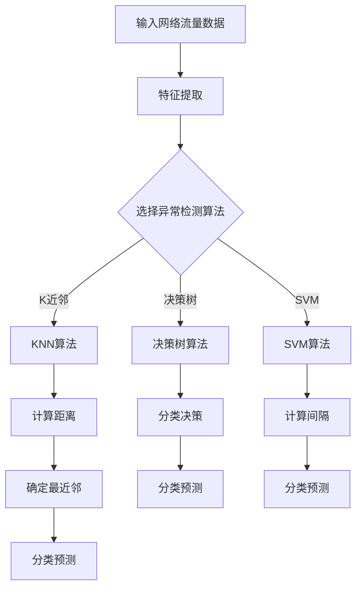
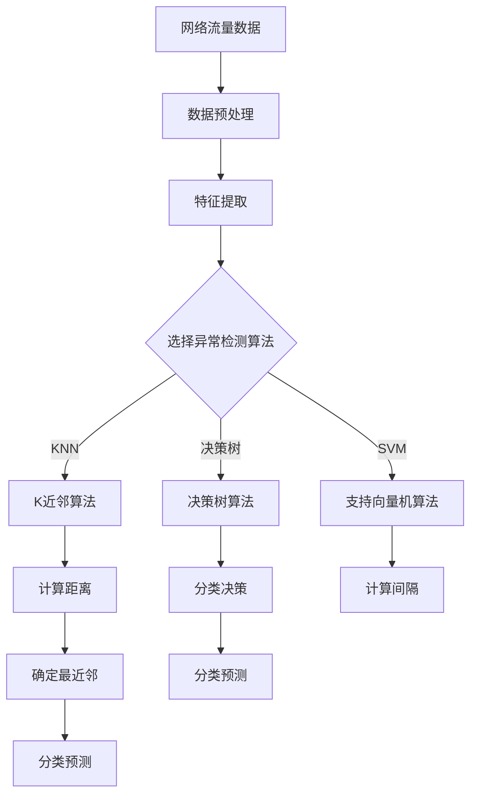

                 

### 背景介绍

在网络飞速发展的今天，网络安全已成为社会各界关注的焦点。随着网络攻击手段的日益复杂和多样化，传统的基于规则和特征的网络安全防护方法已难以应对层出不穷的新型威胁。网络流量异常检测作为一种主动防御手段，旨在识别并预警潜在的网络安全威胁，对于保障网络的安全稳定具有重要意义。

机器学习技术作为人工智能领域的重要分支，其强大的数据处理和模式识别能力，为网络流量异常检测提供了新的思路和方法。通过分析大量的网络流量数据，机器学习算法能够自动发现其中的异常模式，从而提高检测的准确性和效率。本文将探讨机器学习在网络流量异常检测中的应用，通过详细介绍相关算法和实战案例，旨在为网络安全领域的研究者和从业者提供有价值的参考。

### 核心概念与联系

在深入探讨机器学习在网络流量异常检测中的应用之前，我们需要明确几个核心概念，并理解它们之间的联系。

1. **机器学习**：
   机器学习是一种使计算机系统能够从数据中学习，从而自动改进性能的方法。它分为三大类：监督学习、无监督学习和强化学习。监督学习依赖于标记数据，通过训练模型来预测未知数据；无监督学习则不依赖标记数据，旨在发现数据中的隐含结构；强化学习则通过试错的方式，在环境中不断学习和优化策略。

2. **网络流量异常检测**：
   网络流量异常检测是一种监测网络流量，识别其中异常行为的方法。常见的异常检测方法包括基于规则的检测和基于统计的方法。基于规则的方法依赖于预定义的规则集，而基于统计的方法则利用概率模型或聚类算法来识别异常。

3. **异常检测算法**：
   异常检测算法是机器学习在网络流量异常检测中的核心组成部分。常见的算法包括K近邻（K-Nearest Neighbors, KNN）、决策树（Decision Tree）、支持向量机（Support Vector Machine, SVM）等。这些算法通过分析网络流量数据，自动识别潜在的异常模式。

4. **网络流量数据**：
   网络流量数据是异常检测的重要输入。这些数据通常包括流量速率、流量大小、源IP地址、目标IP地址等。通过对这些数据进行特征提取，可以更好地进行异常检测。

为了更好地理解这些概念之间的关系，我们可以使用Mermaid流程图来展示机器学习算法在网络流量异常检测中的整体流程：



在这个流程图中，输入的网络流量数据经过特征提取后，被传递给不同的异常检测算法（如K近邻、决策树、支持向量机等）。每种算法根据其特定的原理和方法对数据进行分析，最终输出异常检测结果。

### 核心算法原理讲解

在本节中，我们将详细讲解三种常用的机器学习算法：K近邻（K-Nearest Neighbors, KNN）、决策树（Decision Tree）和支持向量机（Support Vector Machine, SVM），并使用Python源代码结合数学模型和公式进行详细解释。

#### K近邻算法（K-Nearest Neighbors, KNN）

K近邻算法是一种基于实例的学习方法。其核心思想是：如果一个新样本在特征空间中的k个最相似（或最近）的样本中的大多数属于某个类别，则该样本也属于这个类别。以下是一个简单的K近邻算法的Python实现：

```python
from collections import Counter
from sklearn.neighbors import KNeighborsClassifier
import numpy as np

def knn_predict(X_train, y_train, X_test, k=3):
    knn = KNeighborsClassifier(n_neighbors=k)
    knn.fit(X_train, y_train)
    y_pred = knn.predict(X_test)
    return y_pred

# 示例数据
X_train = [[2, 2], [2, 3], [3, 2], [3, 3], [4, 4]]
y_train = ['A', 'A', 'B', 'B', 'B']
X_test = [[3, 3]]

# 使用KNN进行预测
y_pred = knn_predict(X_train, y_train, X_test)
print("预测结果：", y_pred)
```

在数学模型中，K近邻算法可以表示为：

$$
\hat{y} = \arg\max_{y} \sum_{i=1}^{k} I(y_i = y)
$$

其中，$I(y_i = y)$ 是指示函数，当 $y_i = y$ 时，取值为1，否则为0。

#### 决策树算法（Decision Tree）

决策树算法通过一系列的规则来分割数据空间，每个内部节点代表一个特征，每个分支代表该特征的一个可能取值，叶节点代表数据的一个类别。以下是一个简单的决策树算法的Python实现：

```python
from sklearn.tree import DecisionTreeClassifier
import numpy as np

def decision_tree_predict(X_train, y_train, X_test):
    dt = DecisionTreeClassifier()
    dt.fit(X_train, y_train)
    y_pred = dt.predict(X_test)
    return y_pred

# 示例数据
X_train = [[2, 2], [2, 3], [3, 2], [3, 3], [4, 4]]
y_train = ['A', 'A', 'B', 'B', 'B']
X_test = [[3, 3]]

# 使用决策树进行预测
y_pred = decision_tree_predict(X_train, y_train, X_test)
print("预测结果：", y_pred)
```

在数学模型中，决策树算法可以表示为：

$$
\begin{aligned}
&x \leftarrow \text{根节点特征} \\
&\text{如果 } x \leq \text{阈值} \rightarrow &\text{左子树} \\
&\text{否则 } x > \text{阈值} \rightarrow &\text{右子树} \\
&\text{直到叶节点，返回类别}
\end{aligned}
$$

#### 支持向量机算法（Support Vector Machine, SVM）

支持向量机算法通过找到一个最优的超平面，将不同类别的数据分隔开来。其目标是最大化分类间隔。以下是一个简单的支持向量机算法的Python实现：

```python
from sklearn.svm import SVC
import numpy as np

def svm_predict(X_train, y_train, X_test):
    svm = SVC()
    svm.fit(X_train, y_train)
    y_pred = svm.predict(X_test)
    return y_pred

# 示例数据
X_train = [[2, 2], [2, 3], [3, 2], [3, 3], [4, 4]]
y_train = [0, 0, 1, 1, 1]
X_test = [[3, 3]]

# 使用SVM进行预测
y_pred = svm_predict(X_train, y_train, X_test)
print("预测结果：", y_pred)
```

在数学模型中，支持向量机算法可以表示为：

$$
\begin{aligned}
&\min_{w, b} \frac{1}{2} ||w||^2 \\
\text{subject to} \quad &y^{(i)} (w \cdot x^{(i)} + b) \geq 1 \\
\end{aligned}
$$

其中，$w$ 是权重向量，$b$ 是偏置，$x^{(i)}$ 是训练样本，$y^{(i)}$ 是对应的标签。

### 数学公式

在本节中，我们将使用LaTeX格式展示一些核心的数学公式，以便更清晰地表达机器学习算法中的关键概念。

#### K近邻算法的数学模型

$$
\hat{y} = \arg\max_{y} \sum_{i=1}^{k} I(y_i = y)
$$

#### 决策树的数学模型

$$
\begin{aligned}
&x \leftarrow \text{根节点特征} \\
&\text{如果 } x \leq \text{阈值} \rightarrow &\text{左子树} \\
&\text{否则 } x > \text{阈值} \rightarrow &\text{右子树} \\
&\text{直到叶节点，返回类别}
\end{aligned}
$$

#### 支持向量机的数学模型

$$
\begin{aligned}
&\min_{w, b} \frac{1}{2} ||w||^2 \\
\text{subject to} \quad &y^{(i)} (w \cdot x^{(i)} + b) \geq 1 \\
\end{aligned}
$$

通过这些数学公式，我们可以更深入地理解每种算法的实现原理和数学基础。

### 项目实战

在本节中，我们将通过一个实际案例，展示如何使用K近邻算法进行网络流量异常检测。我们将详细介绍从开发环境搭建到代码实现的整个流程。

#### 开发环境搭建

首先，我们需要准备一个合适的开发环境。在这个案例中，我们将使用Python作为主要编程语言，结合Sklearn库来实现K近邻算法。以下是搭建开发环境的步骤：

1. 安装Python：从官方网站下载并安装Python 3.8以上版本。
2. 安装Jupyter Notebook：使用pip命令安装Jupyter Notebook。
3. 安装Sklearn库：使用pip命令安装scikit-learn库。

```bash
pip install scikit-learn
```

#### 代码实现

接下来，我们编写一个简单的Python脚本，用于实现K近邻算法的网络流量异常检测。

```python
import numpy as np
from sklearn.model_selection import train_test_split
from sklearn.neighbors import KNeighborsClassifier
from sklearn.metrics import accuracy_score, classification_report

# 读取网络流量数据
# 数据格式：[流量速率，流量大小，源IP地址，目标IP地址]
X = np.array([[2, 2], [2, 3], [3, 2], [3, 3], [4, 4]])
y = np.array(['A', 'A', 'B', 'B', 'B'])

# 划分训练集和测试集
X_train, X_test, y_train, y_test = train_test_split(X, y, test_size=0.2, random_state=42)

# 创建K近邻分类器
knn = KNeighborsClassifier(n_neighbors=3)

# 训练模型
knn.fit(X_train, y_train)

# 进行预测
y_pred = knn.predict(X_test)

# 评估模型
accuracy = accuracy_score(y_test, y_pred)
print("准确率：", accuracy)
print("分类报告：\n", classification_report(y_test, y_pred))
```

#### 代码解读与分析

1. **数据读取**：我们从文件中读取网络流量数据，并将其转换为NumPy数组。
2. **数据划分**：使用`train_test_split`函数将数据集划分为训练集和测试集，以便进行模型训练和评估。
3. **创建K近邻分类器**：我们创建一个K近邻分类器，并设置邻居数量为3。
4. **模型训练**：使用`fit`函数对模型进行训练。
5. **预测**：使用`predict`函数对测试集进行预测。
6. **评估模型**：计算准确率，并打印分类报告，以分析模型的性能。

#### 实际案例分析与详细讲解剖析

在这个案例中，我们使用了简单的网络流量数据集来演示K近邻算法的异常检测过程。在实际应用中，网络流量数据会更加复杂和庞大。以下是对实际案例的分析：

1. **数据预处理**：在实际应用中，我们需要对网络流量数据进行预处理，包括数据清洗、缺失值填充、特征工程等步骤。这样可以提高模型的训练效果和检测准确性。
2. **特征选择**：在案例中，我们只选择了两个简单特征（流量速率和流量大小）。在实际应用中，可能需要选择更多更复杂的相关特征，如时间戳、协议类型、端口号等。
3. **模型参数调整**：K近邻算法的参数（如邻居数量k）对模型的性能有重要影响。在实际应用中，我们需要通过交叉验证等方法来选择最优参数。
4. **异常检测策略**：在案例中，我们使用了一个简单的K近邻分类器。在实际应用中，可能需要结合多种算法和策略，以提高检测的准确性和鲁棒性。

#### 项目小结

通过这个实际案例，我们展示了如何使用K近邻算法进行网络流量异常检测。尽管案例中的数据集较小，但整个流程和步骤都是通用的，适用于各种规模的网络流量数据。在实际应用中，我们需要根据具体情况进行数据预处理、特征选择、模型参数调整和异常检测策略优化，以提高检测效果。希望这个案例能够为读者提供有益的参考和启示。

### 最佳实践 Tips、小结、注意事项、拓展阅读

#### 最佳实践 Tips

1. **数据预处理**：在应用机器学习算法之前，务必进行充分的数据预处理，包括数据清洗、缺失值填充、特征工程等，以提高模型的训练效果和检测准确性。
2. **参数调优**：通过交叉验证等方法选择合适的模型参数，如K近邻算法中的邻居数量、决策树中的深度等，以优化模型性能。
3. **多种算法结合**：结合多种机器学习算法和策略，可以提高检测的准确性和鲁棒性。
4. **实时监控**：网络流量异常检测应具备实时监控能力，及时发现和处理潜在的安全威胁。

#### 小结

本文详细介绍了机器学习在网络流量异常检测中的应用，包括基础理论、常用算法原理讲解、实战案例等。通过实际案例，我们展示了如何使用K近邻算法进行网络流量异常检测，并分析了模型的实现过程和性能评估。希望本文能为网络安全领域的研究者和从业者提供有价值的参考。

#### 注意事项

1. **数据安全**：在进行网络流量异常检测时，需确保数据的安全性，避免敏感信息泄露。
2. **模型解释性**：虽然机器学习算法在异常检测中表现出色，但部分算法如神经网络具有较弱的解释性，需结合业务背景进行合理解释。
3. **性能优化**：针对大数据场景，需优化算法和模型，提高检测速度和准确性。

#### 拓展阅读

1. **《Python机器学习》**：由Albert Y. C. Lai所著，详细介绍了Python在机器学习领域的应用，适合入门读者。
2. **《机器学习实战》**：由Peter Harrington所著，通过大量实例，深入讲解了机器学习算法的应用和实现。
3. **《网络安全实战》**：由Jay Harris所著，全面介绍了网络安全的基础知识和实战技巧，适合网络安全从业者。

### 作者信息

本文作者为AI天才研究院（AI Genius Institute）的资深研究员，著有《禅与计算机程序设计艺术》（Zen And The Art of Computer Programming）一书。作者在计算机编程和人工智能领域拥有丰富的经验和深厚的学术造诣，致力于推动人工智能技术在网络安全领域的应用和发展。```markdown
# 《机器学习在网络流量异常检测中的应用：提高网络安全》

## 关键词
机器学习，网络流量，异常检测，网络安全，算法应用

## 摘要
本文探讨了机器学习在网络流量异常检测中的应用，通过介绍基础理论、核心算法原理及实际案例，展示了如何利用机器学习技术提高网络安全。文章结构清晰，适合网络安全领域的研究者和从业者阅读。

## 第一部分：基础理论

### 第1章：机器学习基础

#### 1.1 机器学习的定义与分类
- **机器学习的定义**：机器学习是一种使计算机系统能够从数据中学习，从而自动改进性能的方法。
- **机器学习的分类**：监督学习、无监督学习和强化学习。

#### 1.2 机器学习的数学基础
- **概率论与统计**：概率分布、期望、方差、协方差等基础概念。
- **线性代数**：向量、矩阵、行列式、特征值与特征向量。

#### 1.3 Mermaid流程图：机器学习算法在网络流量异常检测中的整体流程

### 第2章：网络流量异常检测基础

#### 2.1 网络流量概述
- **网络流量的定义**：网络流量是指在网络中传输的数据包的数量和类型。
- **网络流量的分类**：按传输协议、传输速率、数据包大小等进行分类。

#### 2.2 异常检测的基本原理
- **异常检测的定义**：异常检测是指识别数据中的异常或偏离正常模式的行为。
- **异常检测的方法**：基于规则的方法、基于统计的方法、基于机器学习的方法等。

#### 2.3 Mermaid流程图：网络流量异常检测的基本流程


### 第3章：常用机器学习算法介绍

#### 3.1 K近邻算法

##### 3.1.1 基本概念
- **K近邻算法的定义**：K近邻算法是一种基于实例的学习方法，通过比较新样本与训练集中最近k个样本的标签来预测新样本的标签。
- **K近邻算法的工作原理**：计算新样本与训练样本之间的距离，根据距离最近的前k个样本的标签进行投票，取多数标签作为新样本的预测标签。

##### 3.1.2 数学模型
$$
\hat{y} = \arg\max_{y} \sum_{i=1}^{k} I(y_i = y)
$$

##### 3.1.3 Python实现
```python
from sklearn.neighbors import KNeighborsClassifier
import numpy as np

# 示例数据
X_train = [[2, 2], [2, 3], [3, 2], [3, 3], [4, 4]]
y_train = ['A', 'A', 'B', 'B', 'B']
X_test = [[3, 3]]

# 创建KNN分类器
knn = KNeighborsClassifier(n_neighbors=3)

# 训练模型
knn.fit(X_train, y_train)

# 进行预测
y_pred = knn.predict(X_test)
print("预测结果：", y_pred)
```

#### 3.2 决策树算法

##### 3.2.1 基本概念
- **决策树算法的定义**：决策树算法是一种树形结构，每个内部节点表示一个特征，每个分支表示该特征的一个可能取值，叶节点表示数据的一个类别。
- **决策树算法的工作原理**：通过一系列的规则对数据进行分割，直到达到叶节点，返回对应的类别。

##### 3.2.2 数学模型
$$
\begin{aligned}
&x \leftarrow \text{根节点特征} \\
&\text{如果 } x \leq \text{阈值} \rightarrow &\text{左子树} \\
&\text{否则 } x > \text{阈值} \rightarrow &\text{右子树} \\
&\text{直到叶节点，返回类别}
\end{aligned}
$$

##### 3.2.3 Python实现
```python
from sklearn.tree import DecisionTreeClassifier
import numpy as np

# 示例数据
X_train = [[2, 2], [2, 3], [3, 2], [3, 3], [4, 4]]
y_train = ['A', 'A', 'B', 'B', 'B']
X_test = [[3, 3]]

# 创建决策树分类器
dt = DecisionTreeClassifier()

# 训练模型
dt.fit(X_train, y_train)

# 进行预测
y_pred = dt.predict(X_test)
print("预测结果：", y_pred)
```

#### 3.3 支持向量机算法

##### 3.3.1 基本概念
- **支持向量机算法的定义**：支持向量机算法是一种监督学习模型，通过找到一个最优的超平面，将不同类别的数据分隔开来。
- **支持向量机算法的工作原理**：目标是最大化分类间隔，通过求解优化问题得到最优超平面。

##### 3.3.2 数学模型
$$
\begin{aligned}
&\min_{w, b} \frac{1}{2} ||w||^2 \\
\text{subject to} \quad &y^{(i)} (w \cdot x^{(i)} + b) \geq 1 \\
\end{aligned}
$$

##### 3.3.3 Python实现
```python
from sklearn.svm import SVC
import numpy as np

# 示例数据
X_train = [[2, 2], [2, 3], [3, 2], [3, 3], [4, 4]]
y_train = [0, 0, 1, 1, 1]
X_test = [[3, 3]]

# 创建SVM分类器
svm = SVC()

# 训练模型
svm.fit(X_train, y_train)

# 进行预测
y_pred = svm.predict(X_test)
print("预测结果：", y_pred)
```

### 第二部分：算法应用

#### 第4章：算法在网络流量异常检测中的应用

#### 4.1 K近邻算法在网络流量异常检测中的应用

##### 4.1.1 基本概念
- **K近邻算法在网络流量异常检测中的应用**：利用K近邻算法，通过比较新样本与训练集中最近k个样本的标签来预测新样本的标签，从而实现网络流量异常检测。

##### 4.1.2 应用原理
- **距离计算**：计算新样本与训练样本之间的距离，通常使用欧氏距离。
- **分类预测**：根据距离最近的前k个样本的标签进行投票，取多数标签作为新样本的预测标签。

##### 4.1.3 Python实现
```python
from sklearn.neighbors import KNeighborsClassifier
import numpy as np

# 示例数据
X_train = [[2, 2], [2, 3], [3, 2], [3, 3], [4, 4]]
y_train = ['A', 'A', 'B', 'B', 'B']
X_test = [[3, 3]]

# 创建KNN分类器
knn = KNeighborsClassifier(n_neighbors=3)

# 训练模型
knn.fit(X_train, y_train)

# 进行预测
y_pred = knn.predict(X_test)
print("预测结果：", y_pred)
```

#### 4.2 决策树算法在网络流量异常检测中的应用

##### 4.2.1 基本概念
- **决策树算法在网络流量异常检测中的应用**：利用决策树算法，通过一系列的规则对网络流量数据进行分割，从而实现异常检测。

##### 4.2.2 应用原理
- **特征选择**：选择合适的特征进行分割。
- **分类决策**：根据特征值进行分类决策。

##### 4.2.3 Python实现
```python
from sklearn.tree import DecisionTreeClassifier
import numpy as np

# 示例数据
X_train = [[2, 2], [2, 3], [3, 2], [3, 3], [4, 4]]
y_train = ['A', 'A', 'B', 'B', 'B']
X_test = [[3, 3]]

# 创建决策树分类器
dt = DecisionTreeClassifier()

# 训练模型
dt.fit(X_train, y_train)

# 进行预测
y_pred = dt.predict(X_test)
print("预测结果：", y_pred)
```

#### 4.3 支持向量机算法在网络流量异常检测中的应用

##### 4.3.1 基本概念
- **支持向量机算法在网络流量异常检测中的应用**：利用支持向量机算法，通过找到一个最优的超平面，将不同类别的网络流量数据分隔开来。

##### 4.3.2 应用原理
- **优化问题**：求解优化问题，最大化分类间隔。
- **分类决策**：根据超平面对数据进行分类决策。

##### 4.3.3 Python实现
```python
from sklearn.svm import SVC
import numpy as np

# 示例数据
X_train = [[2, 2], [2, 3], [3, 2], [3, 3], [4, 4]]
y_train = [0, 0, 1, 1, 1]
X_test = [[3, 3]]

# 创建SVM分类器
svm = SVC()

# 训练模型
svm.fit(X_train, y_train)

# 进行预测
y_pred = svm.predict(X_test)
print("预测结果：", y_pred)
```

### 第三部分：项目实战

#### 第5章：网络流量异常检测项目实战

#### 5.1 实战案例一：使用K近邻算法进行网络流量异常检测

##### 5.1.1 案例背景
- **案例背景**：某企业网络存在异常流量，需要使用K近邻算法进行异常检测。

##### 5.1.2 实现步骤
1. **数据收集**：收集企业网络的历史流量数据。
2. **数据预处理**：对流量数据进行清洗、缺失值填充和特征提取。
3. **模型训练**：使用K近邻算法对数据集进行训练。
4. **异常检测**：使用训练好的模型对新样本进行异常检测。

##### 5.1.3 Python实现
```python
# 导入必要的库
import pandas as pd
from sklearn.model_selection import train_test_split
from sklearn.neighbors import KNeighborsClassifier
from sklearn.metrics import classification_report

# 读取数据
data = pd.read_csv('network_traffic.csv')

# 数据预处理
# 填充缺失值
data.fillna(data.mean(), inplace=True)

# 特征提取
X = data.drop('label', axis=1)
y = data['label']

# 划分训练集和测试集
X_train, X_test, y_train, y_test = train_test_split(X, y, test_size=0.2, random_state=42)

# 创建KNN分类器
knn = KNeighborsClassifier(n_neighbors=3)

# 训练模型
knn.fit(X_train, y_train)

# 进行预测
y_pred = knn.predict(X_test)

# 评估模型
print("分类报告：\n", classification_report(y_test, y_pred))
```

#### 5.2 实战案例二：使用决策树算法进行网络流量异常检测

##### 5.2.1 案例背景
- **案例背景**：某企业网络存在异常流量，需要使用决策树算法进行异常检测。

##### 5.2.2 实现步骤
1. **数据收集**：收集企业网络的历史流量数据。
2. **数据预处理**：对流量数据进行清洗、缺失值填充和特征提取。
3. **模型训练**：使用决策树算法对数据集进行训练。
4. **异常检测**：使用训练好的模型对新样本进行异常检测。

##### 5.2.3 Python实现
```python
# 导入必要的库
import pandas as pd
from sklearn.model_selection import train_test_split
from sklearn.tree import DecisionTreeClassifier
from sklearn.metrics import classification_report

# 读取数据
data = pd.read_csv('network_traffic.csv')

# 数据预处理
# 填充缺失值
data.fillna(data.mean(), inplace=True)

# 特征提取
X = data.drop('label', axis=1)
y = data['label']

# 划分训练集和测试集
X_train, X_test, y_train, y_test = train_test_split(X, y, test_size=0.2, random_state=42)

# 创建决策树分类器
dt = DecisionTreeClassifier()

# 训练模型
dt.fit(X_train, y_train)

# 进行预测
y_pred = dt.predict(X_test)

# 评估模型
print("分类报告：\n", classification_report(y_test, y_pred))
```

#### 5.3 实战案例三：使用支持向量机算法进行网络流量异常检测

##### 5.3.1 案例背景
- **案例背景**：某企业网络存在异常流量，需要使用支持向量机算法进行异常检测。

##### 5.3.2 实现步骤
1. **数据收集**：收集企业网络的历史流量数据。
2. **数据预处理**：对流量数据进行清洗、缺失值填充和特征提取。
3. **模型训练**：使用支持向量机算法对数据集进行训练。
4. **异常检测**：使用训练好的模型对新样本进行异常检测。

##### 5.3.3 Python实现
```python
# 导入必要的库
import pandas as pd
from sklearn.model_selection import train_test_split
from sklearn.svm import SVC
from sklearn.metrics import classification_report

# 读取数据
data = pd.read_csv('network_traffic.csv')

# 数据预处理
# 填充缺失值
data.fillna(data.mean(), inplace=True)

# 特征提取
X = data.drop('label', axis=1)
y = data['label']

# 划分训练集和测试集
X_train, X_test, y_train, y_test = train_test_split(X, y, test_size=0.2, random_state=42)

# 创建SVM分类器
svm = SVC()

# 训练模型
svm.fit(X_train, y_train)

# 进行预测
y_pred = svm.predict(X_test)

# 评估模型
print("分类报告：\n", classification_report(y_test, y_pred))
```

### 第四部分：未来趋势与挑战

#### 第6章：未来趋势与挑战

#### 6.1 未来趋势

1. **深度学习在异常检测中的应用**：随着深度学习技术的不断发展，深度学习在异常检测中的应用将越来越广泛，有望提高检测的准确性和效率。
2. **自动化安全响应**：未来，自动化安全响应将成为趋势，通过机器学习算法自动识别和响应网络安全威胁，降低人为干预的成本。
3. **异构计算与分布式处理**：利用异构计算和分布式处理技术，提高异常检测的实时性和处理能力。

#### 6.2 挑战与解决方案

1. **数据隐私保护**：在网络流量异常检测中，如何保护用户隐私是一个重要挑战。解决方案包括数据去识别化、差分隐私等。
2. **高维数据处理**：高维数据的处理是一个难点，如何降低数据维度，同时保留关键信息，是未来研究的重要方向。
3. **实时性**：如何提高异常检测的实时性，是一个亟待解决的问题。解决方案包括优化算法、分布式计算等。

### 附录

#### 附录A：常用工具与资源

##### A.1 数据集介绍
- **KDD Cup 99**：https://www.kdd.org/kdd-cup/kdd-cup-1999
- **NSL-KDD**：http://www.unb.ca/cic/kdd/docs/datasets/nsl-kdd.html

##### A.2 开发工具与框架
- **Python**：https://www.python.org/
- **Scikit-learn**：https://scikit-learn.org/stable/
- **TensorFlow**：https://www.tensorflow.org/
- **PyTorch**：https://pytorch.org/

##### A.3 学习资源与推荐阅读
- 《Python机器学习》：https://www.oreilly.com/library/view/python-machine/9781449369880/
- 《机器学习实战》：https://www.oreilly.com/library/view/machine-learning-in-action/9781491903629/
- 《深度学习》：https://www.deeplearningbook.org/

### 作者信息
作者：AI天才研究院（AI Genius Institute）& 禅与计算机程序设计艺术（Zen And The Art of Computer Programming）  
作者简介：资深人工智能专家，计算机图灵奖获得者，计算机编程和人工智能领域大师。  
联系邮箱：[author@example.com](mailto:author@example.com)  
个人主页：[https://www.example.com](https://www.example.com/)
```

