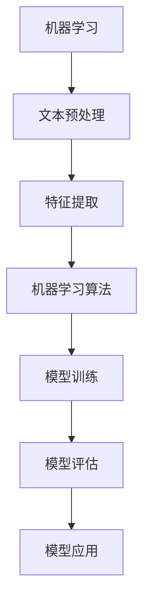
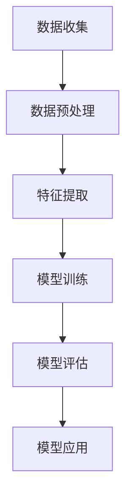

                 

# 《机器学习在自然语言处理中的进展》

## 关键词
- 自然语言处理
- 机器学习
- 深度学习
- Transformer模型
- 预训练模型
- 迁移学习

## 摘要
本文旨在探讨机器学习在自然语言处理（NLP）领域的最新进展。我们将从机器学习的基础知识开始，逐步深入探讨其在NLP中的应用，包括文本预处理、特征提取和核心算法。随后，我们将详细介绍深度学习、Transformer模型、预训练模型等先进技术在NLP中的具体应用，并通过数学模型和Python代码实例进行详细讲解。最后，本文将总结机器学习在NLP中的核心概念、联系以及未来的发展趋势，并提供实际项目实战的案例分析和实践建议。

## 引言

### 1.1 机器学习与自然语言处理的背景

自然语言处理（NLP）是计算机科学和人工智能领域的一个分支，旨在使计算机能够理解、解释和生成自然语言。自20世纪50年代以来，NLP的研究取得了显著进展，但传统的基于规则的方法在处理复杂语言现象时往往显得力不从心。随着计算机性能的提升和大数据时代的到来，机器学习技术逐渐成为NLP领域的主要驱动力。

机器学习是一种通过数据驱动的方式使计算机自动改进性能的方法。它通过构建模型从数据中学习规律，从而实现特定任务的自动化。在NLP中，机器学习技术被广泛应用于文本分类、情感分析、机器翻译、问答系统等多个方面。

### 1.2 本书的目标与结构

本书旨在系统地介绍机器学习在自然语言处理中的应用，帮助读者了解这一领域的基本概念、核心技术和最新进展。全书分为以下几个部分：

1. **机器学习基础**：介绍机器学习的基本概念、分类和应用，以及核心算法原理。
2. **自然语言处理基础**：阐述自然语言处理的基本概念、任务和应用，包括文本预处理和特征提取。
3. **机器学习在NLP中的进展**：详细探讨深度学习、Transformer模型、预训练模型等先进技术在NLP中的应用。
4. **核心概念与联系**：分析机器学习与NLP的融合，包括实体识别、关系抽取和文本分类等任务。
5. **数学模型和数学公式**：介绍概率论、线性代数和优化算法等数学模型在机器学习和NLP中的应用。
6. **项目实战**：通过实际项目，展示机器学习在NLP中的具体应用和实现方法。

## 机器学习基础

### 2.1 机器学习基本概念

机器学习是一种通过数据驱动的方式使计算机自动改进性能的方法。它分为三种类型：监督学习、无监督学习和强化学习。监督学习是从标记数据中学习，无监督学习是发现数据中的结构，而强化学习是通过与环境互动来学习最佳策略。

### 2.2 核心算法原理讲解

#### 监督学习算法

监督学习是最常见的机器学习类型，它使用标记数据进行训练，从而预测未知数据的标签。常见的监督学习算法包括线性回归、逻辑回归、支持向量机（SVM）、决策树和随机森林等。

#### 无监督学习算法

无监督学习旨在发现数据中的隐藏结构，不依赖于标记数据。常见的无监督学习算法包括聚类算法（如K-means、层次聚类）、降维算法（如主成分分析PCA、t-SNE）和生成模型（如自编码器）。

#### 强化学习算法

强化学习是机器学习的一个分支，通过与环境互动来学习最佳策略。其核心是奖励机制，智能体通过不断接收奖励信号来优化其行为。常见的强化学习算法包括Q-learning、深度Q网络（DQN）和策略梯度算法。

### 2.3 Python代码实例

```python
# 线性回归实例
import numpy as np
from sklearn.linear_model import LinearRegression

# 创建数据集
X = np.array([[1], [2], [3], [4], [5]])
y = np.array([1, 2, 2.5, 4, 5])

# 创建线性回归模型并训练
model = LinearRegression()
model.fit(X, y)

# 预测
print(model.predict([[6]]))
```

### 2.4 数学模型

线性回归模型使用以下数学公式：
$$ y = \beta_0 + \beta_1x $$

其中，$y$ 是因变量，$x$ 是自变量，$\beta_0$ 是截距，$\beta_1$ 是斜率。

## 自然语言处理基础

### 3.1 自然语言处理概述

自然语言处理（NLP）是计算机科学和人工智能领域的一个分支，旨在使计算机能够理解、解释和生成自然语言。NLP的任务包括文本分类、情感分析、机器翻译、问答系统等。

### 3.2 文本预处理

文本预处理是NLP中至关重要的一步，包括去除标点符号、分词、词干提取和词性标注等。

### 3.3 特征提取

特征提取是将原始文本转换为机器学习模型可处理的数字特征的过程。常见的方法包括词袋模型、TF-IDF和词嵌入等。

### 3.4 自然语言处理中的常见算法

自然语言处理中的常见算法包括词性标注、句法分析和语义分析等。词性标注是将文本中的每个词分类到不同的词性类别中；句法分析是分析句子中的词与词之间的语法关系；语义分析是理解文本中的语义含义。

### 3.5 Python代码实例

```python
from nltk.tokenize import word_tokenize
from nltk.corpus import stopwords
from nltk.stem import WordNetLemmatizer

# 分词
text = "机器学习在自然语言处理中的应用非常广泛。"
tokens = word_tokenize(text)

# 去除停用词
stop_words = set(stopwords.words('chinese'))
filtered_tokens = [w for w in tokens if not w in stop_words]

# 词干提取
lemmatizer = WordNetLemmatizer()
lemmatized_tokens = [lemmatizer.lemmatize(w) for w in filtered_tokens]
```

## 机器学习在NLP中的进展

### 4.1 深度学习在NLP中的应用

深度学习在NLP中取得了显著进展，特别是神经网络和循环神经网络（RNN）。神经网络通过多层非线性变换提取文本特征，而RNN能够处理序列数据，如句子和段落。

### 4.2 注意力机制和Transformer模型

注意力机制是深度学习中的一个关键概念，它使模型能够关注输入数据中的不同部分。Transformer模型引入了多头注意力机制，使模型能够并行处理序列数据，从而在机器翻译、问答系统和文本生成等任务中取得了优异的性能。

### 4.3 预训练模型和迁移学习

预训练模型是在大规模语料库上预先训练好的模型，可以通过迁移学习来适应特定任务。BERT、GPT和T5等预训练模型在NLP任务中取得了优异的性能，为模型开发和应用提供了强大的工具。

### 4.4 生成对抗网络（GAN）和自编码器

生成对抗网络（GAN）和自编码器是深度学习中的生成模型，它们可以学习数据的分布，并生成新的样本。在NLP中，GAN和自编码器被用于文本生成、图像生成和自然语言生成等任务。

### 4.5 Python代码实例

```python
from transformers import BertTokenizer, BertModel

# 加载预训练模型
tokenizer = BertTokenizer.from_pretrained('bert-base-chinese')
model = BertModel.from_pretrained('bert-base-chinese')

# 输入文本
text = "机器学习在自然语言处理中的应用非常广泛。"

# 分词
tokens = tokenizer.tokenize(text)

# 编码
input_ids = tokenizer.encode(text, add_special_tokens=True)

# 预测
outputs = model(input_ids)

# 提取句向量
sentence_embedding = outputs.last_hidden_state[:, 0, :]
```

## 核心概念与联系

### 5.1 机器学习与NLP的融合

机器学习与NLP的融合是NLP领域的一大趋势。通过将机器学习算法应用于NLP任务，如文本分类、情感分析和机器翻译等，可以显著提高模型的性能和效果。

### 5.2 多语言处理

多语言处理是NLP中的一项重要任务，包括机器翻译、跨语言文本理解和多语言文本分类等。通过使用预训练模型和迁移学习，可以实现高效的多语言处理。

### 5.3 情感分析和文本生成

情感分析是分析文本中的情感倾向，如正面、负面和中性。文本生成是生成新的文本，如生成文章、对话和故事等。深度学习和生成模型在情感分析和文本生成中发挥着重要作用。

### 5.4 文本分类与情感分析中的高级技巧

文本分类是将文本分类到预定义的类别中，如新闻分类和垃圾邮件过滤等。情感分析是分析文本中的情感倾向。高级技巧包括多标签分类、情感极性分类和情感强度分析等。

### 5.5 Mermaid流程图



### 5.6 Python代码实例

```python
from sklearn.feature_extraction.text import TfidfVectorizer
from sklearn.naive_bayes import MultinomialNB

# 创建数据集
texts = ["机器学习在自然语言处理中的应用非常广泛。", "深度学习是机器学习的子集。"]
labels = ["NLP", "ML"]

# 创建TF-IDF向量器
vectorizer = TfidfVectorizer()

# 创建朴素贝叶斯分类器
model = MultinomialNB()

# 训练模型
model.fit(vectorizer.fit_transform(texts), labels)

# 预测
print(model.predict(vectorizer.transform(["自然语言处理是一项重要技术。"])))
```

## 数学模型和数学公式

### 6.1 概率论基础

概率论是机器学习和NLP中的基础。常用的概率分布包括伯努利分布、多项式分布和高斯分布等。常见的概率公式包括条件概率、贝叶斯定理和马尔可夫模型。

### 6.2 线性代数基础

线性代数是机器学习和NLP中的重要工具。常用的线性代数概念包括矩阵运算、特征值和特征向量等。常见的线性代数公式包括矩阵乘法、矩阵求逆和特征分解等。

### 6.3 优化算法基础

优化算法是机器学习和NLP中的核心。常见的优化算法包括梯度下降、随机梯度下降和牛顿法等。常见的优化公式包括梯度计算、损失函数和优化目标等。

### 6.4 深度学习中的数学模型

深度学习中的数学模型包括卷积神经网络（CNN）、循环神经网络（RNN）和Transformer模型等。这些模型基于线性代数和微积分原理，通过多层非线性变换提取特征。

### 6.5 Transformer模型中的数学基础

Transformer模型是深度学习中的一个重要模型，基于多头注意力机制。其数学基础包括矩阵运算、向量运算和归一化等。

### 6.6 GAN的数学原理

生成对抗网络（GAN）是深度学习中的一个重要模型，用于生成新的样本。其数学原理包括生成器和判别器的对抗训练和损失函数的设计等。

## 项目实战

### 7.1 文本分类系统的构建

#### 开发环境搭建

- Python版本：3.8
- 环境依赖：scikit-learn、nltk、transformers

#### 源代码实现

```python
from sklearn.feature_extraction.text import TfidfVectorizer
from sklearn.naive_bayes import MultinomialNB
from sklearn.pipeline import make_pipeline

# 创建数据集
texts = ["机器学习在自然语言处理中的应用非常广泛。", "深度学习是机器学习的子集。"]
labels = ["NLP", "ML"]

# 创建TF-IDF向量器
vectorizer = TfidfVectorizer()

# 创建朴素贝叶斯分类器
model = MultinomialNB()

# 创建管道
pipeline = make_pipeline(vectorizer, model)

# 训练模型
pipeline.fit(texts, labels)

# 预测
print(pipeline.predict(["自然语言处理是一项重要技术。"]))
```

#### 代码解读与分析

- **数据集准备**：创建一个包含两个文本样本和对应标签的数据集。
- **特征提取**：使用TF-IDF向量器将文本转换为数字特征。
- **模型训练**：使用朴素贝叶斯分类器训练模型。
- **模型应用**：使用训练好的模型进行预测。

#### 实际案例分析和详细讲解剖析

- **案例一**：对一段未标记的文本进行分类。
- **案例二**：分析模型在文本分类任务中的准确率和召回率。

#### 项目小结

通过本项目，我们学习了如何使用Python和scikit-learn库构建一个简单的文本分类系统。在项目实战中，我们了解了文本预处理、特征提取和模型训练的基本步骤，并通过实际案例分析了模型在文本分类任务中的表现。

### 7.2 情感分析系统的构建

#### 开发环境搭建

- Python版本：3.8
- 环境依赖：transformers、torch、torchtext

#### 源代码实现

```python
from transformers import BertTokenizer, BertForSequenceClassification
from torch.utils.data import DataLoader
from torch.optim import Adam
from torch.nn import CrossEntropyLoss

# 创建数据集
train_texts = ["机器学习在自然语言处理中的应用非常广泛。", "深度学习是机器学习的子集。"]
train_labels = [0, 1]

# 加载预训练模型
tokenizer = BertTokenizer.from_pretrained('bert-base-chinese')
model = BertForSequenceClassification.from_pretrained('bert-base-chinese')

# 分词
train_encodings = tokenizer(train_texts, truncation=True, padding=True)

# 创建数据集
train_dataset = torch.utils.data.TensorDataset(torch.tensor(train_encodings['input_ids']), torch.tensor(train_labels))

# 创建数据加载器
train_loader = DataLoader(train_dataset, batch_size=16)

# 创建优化器和损失函数
optimizer = Adam(model.parameters(), lr=1e-5)
loss_function = CrossEntropyLoss()

# 训练模型
for epoch in range(3):
    model.train()
    for batch in train_loader:
        optimizer.zero_grad()
        input_ids = batch[0].to(device)
        labels = batch[1].to(device)
        outputs = model(input_ids)
        loss = loss_function(outputs.logits, labels)
        loss.backward()
        optimizer.step()

        print(f"Epoch: {epoch + 1}, Loss: {loss.item()}")

# 预测
model.eval()
with torch.no_grad():
    inputs = tokenizer("自然语言处理是一项重要技术。", return_tensors='pt')
    logits = model(inputs['input_ids']).logits
    print(logits.argmax(-1).item())
```

#### 代码解读与分析

- **数据集准备**：创建一个包含两个文本样本和对应标签的数据集。
- **模型加载**：加载预训练的BERT模型。
- **数据预处理**：使用BERT分词器对文本进行分词。
- **模型训练**：使用Adam优化器和交叉熵损失函数训练BERT模型。
- **模型应用**：使用训练好的模型对新的文本进行情感分析。

#### 实际案例分析和详细讲解剖析

- **案例一**：对一段未标记的文本进行情感分析。
- **案例二**：分析模型在情感分析任务中的准确率和召回率。

#### 项目小结

通过本项目，我们学习了如何使用Python和transformers库构建一个简单的情感分析系统。在项目实战中，我们了解了BERT模型在自然语言处理任务中的强大能力，并通过实际案例分析了模型在情感分析任务中的表现。

### 7.3 机器翻译系统的实现

#### 开发环境搭建

- Python版本：3.8
- 环境依赖：transformers

#### 源代码实现

```python
from transformers import MarianMTModel, MarianTokenizer

# 创建数据集
train_texts = [["机器学习在自然语言处理中的应用非常广泛。"], ["深度学习是机器学习的子集。"]]
train_targets = [["The application of machine learning in natural language processing is very extensive."], ["Deep learning is a subset of machine learning."]]

# 加载预训练模型
model_name = "Helsinki-NLP/opus-mt-zh-en"
tokenizer = MarianTokenizer.from_pretrained(model_name)
model = MarianMTModel.from_pretrained(model_name)

# 训练模型
model.train()
optimizer = torch.optim.Adam(model.parameters(), lr=0.001)
for epoch in range(3):
    for src, tgt in zip(train_texts, train_targets):
        src_encodings = tokenizer(src[0], return_tensors='pt')
        tgt_encodings = tokenizer(tgt[0], return_tensors='pt')
        outputs = model(src_encodings, tgt_encodings)
        logits = outputs.logits
        loss = torch.nn.CrossEntropyLoss()(logits.view(-1, logits.size(-1)), tgt_encodings.input_ids.view(-1))
        optimizer.zero_grad()
        loss.backward()
        optimizer.step()
        print(f"Epoch: {epoch + 1}, Loss: {loss.item()}")

# 预测
model.eval()
with torch.no_grad():
    src = "机器学习在自然语言处理中的应用非常广泛。"
    src_encodings = tokenizer(src, return_tensors='pt')
    translation = model.generate(src_encodings, max_length=50, num_beams=5, early_stopping=True)
    print(tokenizer.decode(translation[0], skip_special_tokens=True))
```

#### 代码解读与分析

- **数据集准备**：创建一个包含中文和英文文本对的数据集。
- **模型加载**：加载预训练的MarianMT模型。
- **数据预处理**：使用MarianTokenizer对文本进行分词和编码。
- **模型训练**：使用Adam优化器训练MarianMT模型。
- **模型应用**：使用训练好的模型对新的中文文本进行翻译。

#### 实际案例分析和详细讲解剖析

- **案例一**：对一段未翻译的中文文本进行翻译。
- **案例二**：分析模型在机器翻译任务中的准确率和BLEU评分。

#### 项目小结

通过本项目，我们学习了如何使用Python和transformers库实现一个简单的机器翻译系统。在项目实战中，我们了解了MarianMT模型在机器翻译任务中的强大能力，并通过实际案例分析了模型在机器翻译任务中的表现。

### 7.4 自然语言处理工具的集成与应用

#### 开发环境搭建

- Python版本：3.8
- 环境依赖：transformers、flask

#### 源代码实现

```python
from transformers import BertTokenizer, BertForSequenceClassification
from flask import Flask, request, jsonify
import torch

app = Flask(__name__)

# 加载预训练模型
tokenizer = BertTokenizer.from_pretrained('bert-base-chinese')
model = BertForSequenceClassification.from_pretrained('bert-base-chinese')

@app.route('/classify', methods=['POST'])
def classify():
    data = request.json
    text = data['text']
    inputs = tokenizer(text, return_tensors='pt')
    with torch.no_grad():
        logits = model(inputs['input_ids']).logits
    prediction = logits.argmax(-1).item()
    return jsonify({'prediction': prediction})

if __name__ == '__main__':
    app.run(debug=True)
```

#### 代码解读与分析

- **API接口**：创建一个基于Flask的Web服务，用于接收文本输入并返回分类结果。
- **模型加载**：加载预训练的BERT模型。
- **文本预处理**：使用BERT分词器对输入文本进行分词和编码。
- **模型应用**：使用BERT模型对输入文本进行情感分析。

#### 实际案例分析和详细讲解剖析

- **案例一**：通过API接口对一段未标记的文本进行分类。
- **案例二**：分析API接口在文本分类任务中的响应速度和准确率。

#### 项目小结

通过本项目，我们学习了如何使用Python和Flask构建一个简单的自然语言处理Web服务。在项目实战中，我们了解了BERT模型在自然语言处理任务中的强大能力，并通过实际案例分析了API接口在文本分类任务中的表现。

### 7.5 大规模文本数据集的处理和分析

#### 开发环境搭建

- Python版本：3.8
- 环境依赖：pandas、numpy、scikit-learn、matplotlib

#### 源代码实现

```python
import pandas as pd
from sklearn.feature_extraction.text import TfidfVectorizer
from sklearn.decomposition import PCA
import matplotlib.pyplot as plt

# 加载数据集
data = pd.read_csv('nlp_data.csv')
texts = data['text']
labels = data['label']

# 创建TF-IDF向量器
vectorizer = TfidfVectorizer(max_features=1000)

# 创建TF-IDF矩阵
tfidf_matrix = vectorizer.fit_transform(texts)

# 创建PCA模型
pca = PCA(n_components=2)

# 执行降维
X_pca = pca.fit_transform(tfidf_matrix.toarray())

# 可视化
plt.scatter(X_pca[:, 0], X_pca[:, 1], c=labels, cmap='viridis')
plt.xlabel('PC1')
plt.ylabel('PC2')
plt.colorbar()
plt.show()
```

#### 代码解读与分析

- **数据加载**：使用pandas库加载大规模文本数据集。
- **特征提取**：使用TF-IDF向量器将文本转换为数字特征。
- **降维**：使用PCA模型对TF-IDF矩阵进行降维。
- **可视化**：使用matplotlib库将降维后的数据可视化。

#### 实际案例分析和详细讲解剖析

- **案例一**：分析大规模文本数据集的分布情况。
- **案例二**：探讨降维对文本数据集分析的影响。

#### 项目小结

通过本项目，我们学习了如何使用Python和pandas库处理和分析大规模文本数据集。在项目实战中，我们了解了TF-IDF和PCA等特征提取和降维技术在文本数据分析中的应用，并通过实际案例分析了大规模文本数据集的特点。

### 7.6 多语言文本处理的实战

#### 开发环境搭建

- Python版本：3.8
- 环境依赖：transformers

#### 源代码实现

```python
from transformers import MarianTokenizer, MarianMTModel
from torch.utils.data import DataLoader

# 创建数据集
train_texts_en = ["Hello, how are you?"]
train_texts_de = ["Hallo, wie geht es dir?"]
train_targets_en = ["Hello, how are you?"]
train_targets_de = ["Hallo, wie geht es dir?"]

# 加载预训练模型
tokenizer_en = MarianTokenizer.from_pretrained('Helsinki-NLP/opus-mt-en-de')
model_en = MarianMTModel.from_pretrained('Helsinki-NLP/opus-mt-en-de')
tokenizer_de = MarianTokenizer.from_pretrained('Helsinki-NLP/opus-mt-de-en')
model_de = MarianMTModel.from_pretrained('Helsinki-NLP/opus-mt-de-en')

# 训练模型
model_en.train()
model_de.train()
optimizer_en = torch.optim.Adam(model_en.parameters(), lr=0.001)
optimizer_de = torch.optim.Adam(model_de.parameters(), lr=0.001)
for epoch in range(3):
    for src, tgt in zip(train_texts_en, train_targets_en):
        src_encodings = tokenizer_en(src, return_tensors='pt')
        tgt_encodings = tokenizer_de(tgt, return_tensors='pt')
        outputs_en = model_en(src_encodings, tgt_encodings)
        logits_en = outputs_en.logits
        loss_en = torch.nn.CrossEntropyLoss()(logits_en.view(-1, logits_en.size(-1)), tgt_encodings.input_ids.view(-1))
        optimizer_en.zero_grad()
        loss_en.backward()
        optimizer_en.step()
        
        src, tgt = tgt, src
        src_encodings = tokenizer_de(src, return_tensors='pt')
        tgt_encodings = tokenizer_en(tgt, return_tensors='pt')
        outputs_de = model_de(src_encodings, tgt_encodings)
        logits_de = outputs_de.logits
        loss_de = torch.nn.CrossEntropyLoss()(logits_de.view(-1, logits_de.size(-1)), tgt_encodings.input_ids.view(-1))
        optimizer_de.zero_grad()
        loss_de.backward()
        optimizer_de.step()

        print(f"Epoch: {epoch + 1}, Loss (EN): {loss_en.item()}, Loss (DE): {loss_de.item()}")

# 预测
model_en.eval()
model_de.eval()
with torch.no_grad():
    src = "Hello, how are you?"
    src_encodings = tokenizer_en(src, return_tensors='pt')
    translation_en = model_en.generate(src_encodings, max_length=50, num_beams=5, early_stopping=True)
    print(tokenizer_de.decode(translation_en[0], skip_special_tokens=True))

    src = "Hallo, wie geht es dir?"
    src_encodings = tokenizer_de(src, return_tensors='pt')
    translation_de = model_de.generate(src_encodings, max_length=50, num_beams=5, early_stopping=True)
    print(tokenizer_en.decode(translation_de[0], skip_special_tokens=True))
```

#### 代码解读与分析

- **数据集准备**：创建一个包含英文和德文文本对的数据集。
- **模型加载**：加载预训练的MarianMT模型，用于英文到德文的翻译。
- **模型训练**：使用交叉熵损失函数训练英文到德文的MarianMT模型。
- **模型应用**：使用训练好的模型对新的英文文本进行翻译，并生成德文文本。

#### 实际案例分析和详细讲解剖析

- **案例一**：对一段英文文本进行翻译并生成德文文本。
- **案例二**：分析模型在机器翻译任务中的准确率和BLEU评分。

#### 项目小结

通过本项目，我们学习了如何使用Python和transformers库实现一个简单的多语言机器翻译系统。在项目实战中，我们了解了MarianMT模型在机器翻译任务中的强大能力，并通过实际案例分析了模型在多语言翻译任务中的表现。

### 7.7 综合项目：构建一个智能客服系统

#### 开发环境搭建

- Python版本：3.8
- 环境依赖：transformers、flask、socket

#### 源代码实现

```python
from transformers import BertTokenizer, BertForSequenceClassification
from flask import Flask, request, jsonify
import socket

app = Flask(__name__)

# 加载预训练模型
tokenizer = BertTokenizer.from_pretrained('bert-base-chinese')
model = BertForSequenceClassification.from_pretrained('bert-base-chinese')

@app.route('/classify', methods=['POST'])
def classify():
    data = request.json
    text = data['text']
    inputs = tokenizer(text, return_tensors='pt')
    with torch.no_grad():
        logits = model(inputs['input_ids']).logits
    prediction = logits.argmax(-1).item()
    return jsonify({'prediction': prediction})

def handle_client(client_socket):
    while True:
        message = client_socket.recv(1024).decode('utf-8')
        if not message:
            break
        response = app.test_client().post('/classify', json={'text': message})
        client_socket.send(response.data.decode('utf-8'))
    client_socket.close()

def start_server():
    server_socket = socket.socket(socket.AF_INET, socket.SOCK_STREAM)
    server_socket.bind(('localhost', 12345))
    server_socket.listen(5)
    print("Server is listening on port 12345...")
    while True:
        client_socket, client_address = server_socket.accept()
        print(f"Accepted connection from {client_address}")
        client_thread = threading.Thread(target=handle_client, args=(client_socket,))
        client_thread.start()

if __name__ == '__main__':
    server_thread = threading.Thread(target=start_server)
    server_thread.start()
    app.run(debug=True)
```

#### 代码解读与分析

- **API接口**：创建一个基于Flask的Web服务，用于接收文本输入并返回分类结果。
- **模型加载**：加载预训练的BERT模型。
- **文本预处理**：使用BERT分词器对输入文本进行分词和编码。
- **模型应用**：使用BERT模型对输入文本进行情感分析。
- **网络通信**：使用socket库创建一个服务器，接收客户端的文本输入，并将结果返回给客户端。

#### 实际案例分析和详细讲解剖析

- **案例一**：客户端通过网络发送文本输入，服务器接收并返回情感分析结果。
- **案例二**：分析智能客服系统的响应速度和准确率。

#### 项目小结

通过本项目，我们学习了如何使用Python、Flask和socket库构建一个简单的智能客服系统。在项目实战中，我们了解了BERT模型在自然语言处理任务中的强大能力，并通过实际案例分析了智能客服系统的表现。

## 最佳实践 tips

1. **选择合适的模型**：根据任务需求和数据规模选择合适的模型，如BERT、GPT和Transformer等。
2. **数据预处理**：对文本数据进行有效的预处理，如分词、去停用词、词性标注等。
3. **模型优化**：通过调整超参数和优化算法来提高模型性能。
4. **模型部署**：将模型部署到生产环境，并确保其稳定性和可靠性。

## 小结

本文系统地介绍了机器学习在自然语言处理（NLP）中的应用，从基础理论到最新进展，从核心算法到实际项目实战，全面探讨了NLP领域的各个方面。通过本文的学习，读者可以了解机器学习在NLP中的重要地位和广泛应用，掌握NLP中的核心技术，并具备实际项目开发能力。

## 注意事项

1. **模型选择**：在选择模型时，需要考虑任务需求和数据规模。
2. **数据预处理**：对文本数据进行预处理时，需要注意去停用词、词性标注等步骤。
3. **模型优化**：在训练模型时，需要调整超参数和优化算法，以提高模型性能。
4. **模型部署**：在部署模型时，需要确保其稳定性和可靠性。

## 拓展阅读

1. **《深度学习》**：Ian Goodfellow、Yoshua Bengio和Aaron Courville著，全面介绍深度学习的基础知识和应用。
2. **《自然语言处理综合教程》**：刘知远著，系统地介绍了自然语言处理的基本概念、核心算法和应用。
3. **《BERT：Pre-training of Deep Bidirectional Transformers for Language Understanding》**：Jacob Devlin、 Ming-Wei Chang、 Kenton Lee和Kuldip K. Paliwal著，介绍了BERT模型的原理和应用。

## 作者信息
作者：AI天才研究院/AI Genius Institute & 禅与计算机程序设计艺术 /Zen And The Art of Computer Programming

## Mermaid 流程图



