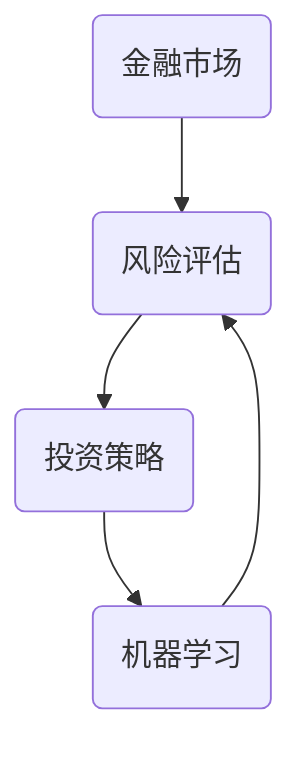

                 

### 背景介绍

随着全球金融市场的不断演变和复杂化，投资决策的准确性成为金融从业者关注的焦点。传统的金融分析模型主要依赖于历史数据和统计方法，尽管在某些情况下取得了较好的效果，但在面对高频波动和多样化市场环境时，往往显得力不从心。机器学习作为一种新兴的人工智能技术，因其强大的数据处理和模式识别能力，逐渐成为金融市场预测的重要工具。

机器学习在金融领域的应用已经相当广泛，从股票市场的价格预测，到风险管理的量化分析，再到投资组合的优化策略，都展现了其独特的优势和潜力。例如，基于机器学习的算法可以分析大量历史交易数据，识别出潜在的规律和市场趋势，从而为投资者提供更为精准的投资建议。此外，机器学习模型还能够实时更新和调整，以适应市场的快速变化，提高预测的时效性和可靠性。

然而，尽管机器学习在金融市场预测中具有显著的优势，但其实际应用仍然面临诸多挑战。首先，金融市场的数据通常具有高维度、高噪声和强非线性等特点，这使得模型的训练和优化变得异常复杂。其次，金融市场的预测结果往往需要较高的准确性，这对机器学习模型的性能提出了更高的要求。此外，金融市场的法规和道德问题也要求算法的透明性和可解释性。

本文旨在探讨机器学习在金融市场预测中的应用，重点关注风险评估与投资策略这两个核心领域。首先，我们将简要介绍金融市场的背景知识，包括市场结构、投资策略和风险管理的基本概念。接着，我们将深入探讨机器学习在金融市场预测中的理论基础，包括常见算法、特征工程和数据预处理方法。随后，我们将详细分析机器学习在风险评估和投资策略优化中的应用，结合实际案例进行代码实现和解析。最后，我们将总结全文，提出一些最佳实践建议，并展望未来机器学习在金融市场预测中可能的发展方向。

通过本文的深入探讨，我们希望为金融从业者提供有价值的参考，帮助他们更好地理解和应用机器学习技术，提高金融市场预测的准确性和效率。

### 核心概念与联系

在探讨机器学习在金融市场预测中的应用之前，我们有必要首先明确几个核心概念，并理解它们之间的联系。

#### 1. 金融市场

金融市场是指各种金融资产进行交易的市场，包括股票市场、债券市场、期货市场、期权市场等。金融市场的基本功能是提供资本流动和风险管理平台，为投资者提供多样化的投资选择。金融市场的价格和交易量数据是机器学习模型的重要输入源。

#### 2. 风险评估

风险评估是指对金融市场中的各种风险进行识别、评估和管理的过程。风险评估包括市场风险（如价格波动风险）、信用风险（如违约风险）和操作风险（如交易风险）等。风险评估的目的是确保投资决策的合理性和安全性。

#### 3. 投资策略

投资策略是指投资者在金融市场上进行投资决策所采用的方法和原则。常见的投资策略包括价值投资、成长投资、套利投资等。投资策略的制定需要考虑市场的整体环境、投资者的风险偏好和投资目标。

#### 4. 机器学习

机器学习是一种通过数据驱动的方式从数据中学习规律和模式，从而实现预测和决策的技术。在金融市场中，机器学习可以用来预测股票价格、评估市场风险、优化投资组合等。常见的机器学习算法包括线性回归、支持向量机、决策树、随机森林、神经网络等。

#### 核心概念之间的联系

- **金融市场**提供了机器学习模型的数据来源，如历史价格、交易量等。
- **风险评估**依赖于机器学习算法，通过分析历史数据来识别和预测市场风险。
- **投资策略**可以通过机器学习模型来优化，以提高投资决策的准确性和收益。
- **机器学习**为**金融市场**提供了强大的分析工具，使得风险评估和投资策略更加科学和精准。

#### Mermaid 流程图

为了更清晰地展示这些核心概念之间的联系，我们使用Mermaid流程图来表示：



这个流程图表明，机器学习是连接金融市场、风险评估和投资策略的核心桥梁，通过数据分析和模式识别，为金融决策提供科学依据。

### 核心算法原理讲解

在了解核心概念与联系后，接下来我们将深入探讨一些常见的机器学习算法，这些算法在金融市场预测中起着至关重要的作用。本文将详细介绍线性回归、支持向量机和神经网络等算法的基本原理和实现方法。

#### 1. 线性回归

线性回归是一种最简单的机器学习算法，它通过建立一个线性模型来预测目标变量的值。线性回归模型可以表示为：

\[ y = \beta_0 + \beta_1 \cdot x_1 + \beta_2 \cdot x_2 + ... + \beta_n \cdot x_n + \epsilon \]

其中，\( y \) 是目标变量，\( x_1, x_2, ..., x_n \) 是特征变量，\( \beta_0, \beta_1, ..., \beta_n \) 是模型的参数，\( \epsilon \) 是误差项。

**实现方法：**

线性回归的实现主要依赖于最小二乘法（Least Squares），该方法的目的是使得预测值与实际值的误差平方和最小。最小二乘法的优化目标是：

\[ \min \sum_{i=1}^{n} (y_i - \hat{y_i})^2 \]

**代码实现：**

以下是一个使用Python实现的线性回归模型：

```python
import numpy as np
from sklearn.linear_model import LinearRegression

# 假设我们有一个训练数据集 X 和对应的标签 y
X = np.array([[1, 2], [2, 3], [3, 4], [4, 5]])
y = np.array([2, 3, 4, 5])

# 创建线性回归模型实例
model = LinearRegression()

# 训练模型
model.fit(X, y)

# 输出模型参数
print("Coefficients: \n", model.coef_)
print("Intercept: \n", model.intercept_)

# 使用模型进行预测
X_new = np.array([[5, 6]])
y_pred = model.predict(X_new)
print("Prediction: \n", y_pred)
```

#### 2. 支持向量机

支持向量机（Support Vector Machine, SVM）是一种强大的分类和回归算法，它通过寻找一个最优的超平面来将数据分类或进行回归。SVM的核心思想是最大化分类边界，即最大化分类器对分类区域的区分能力。

**实现方法：**

SVM的实现通常依赖于二次规划问题，其目标是最小化分类误差。在SVM中，我们使用一个惩罚参数 \( C \) 来控制模型的复杂性和误差。

**代码实现：**

以下是一个使用Python的scikit-learn库实现SVM分类的示例：

```python
from sklearn.svm import SVC
from sklearn.model_selection import train_test_split
from sklearn.metrics import accuracy_score

# 假设我们有一个二分类数据集 X 和对应的标签 y
X = [[0, 0], [1, 1], [1, 0], [0, 1]]
y = [0, 1, 1, 0]

# 划分训练集和测试集
X_train, X_test, y_train, y_test = train_test_split(X, y, test_size=0.3, random_state=42)

# 创建SVM分类器实例
model = SVC(kernel='linear')

# 训练模型
model.fit(X_train, y_train)

# 使用模型进行预测
y_pred = model.predict(X_test)

# 计算准确率
accuracy = accuracy_score(y_test, y_pred)
print("Accuracy: \n", accuracy)
```

#### 3. 神经网络

神经网络（Neural Network, NN）是一种基于模拟生物神经系统的计算模型，它可以用于复杂的非线性问题。神经网络由多个层组成，包括输入层、隐藏层和输出层。每一层由多个神经元组成，神经元之间通过权重连接。

**实现方法：**

神经网络的实现主要依赖于前向传播和反向传播算法。前向传播用于计算网络的输出，反向传播用于计算误差并更新网络权重。

**代码实现：**

以下是一个使用Python的TensorFlow库实现的简单神经网络：

```python
import tensorflow as tf

# 假设我们有一个二分类问题，输入维度为2，输出维度为1
inputs = tf.keras.layers.Input(shape=(2,))
hidden = tf.keras.layers.Dense(10, activation='relu')(inputs)
outputs = tf.keras.layers.Dense(1, activation='sigmoid')(hidden)

model = tf.keras.Model(inputs=inputs, outputs=outputs)

# 编译模型，指定优化器和损失函数
model.compile(optimizer='adam', loss='binary_crossentropy', metrics=['accuracy'])

# 假设我们有一个训练数据集 X 和对应的标签 y
X_train = np.array([[0, 0], [1, 1], [1, 0], [0, 1]])
y_train = np.array([0, 1, 1, 0])

# 训练模型
model.fit(X_train, y_train, epochs=10, batch_size=2)

# 使用模型进行预测
X_test = np.array([[5, 6]])
y_pred = model.predict(X_test)

print("Prediction: \n", y_pred)
```

通过以上介绍，我们可以看到线性回归、支持向量机和神经网络等算法在金融市场预测中的基本原理和实现方法。这些算法为金融市场的分析和预测提供了强大的工具，使得投资者能够更好地应对市场的复杂性和不确定性。

### 数学模型与公式

在金融市场预测中，数学模型和公式起着至关重要的作用，它们帮助我们量化风险、优化投资策略，并提高预测的准确性。以下将介绍一些常见的数学模型和公式，并结合Python代码进行详细讲解。

#### 1. 线性回归模型

线性回归模型是一种用于预测连续值的简单而强大的模型。其基本公式为：

\[ y = \beta_0 + \beta_1 \cdot x_1 + \beta_2 \cdot x_2 + ... + \beta_n \cdot x_n + \epsilon \]

其中，\( y \) 是目标变量，\( x_1, x_2, ..., x_n \) 是特征变量，\( \beta_0, \beta_1, ..., \beta_n \) 是模型的参数，\( \epsilon \) 是误差项。

**Python代码实现：**

```python
import numpy as np
from sklearn.linear_model import LinearRegression

# 假设我们有如下训练数据
X_train = np.array([[1, 2], [2, 3], [3, 4], [4, 5]])
y_train = np.array([2, 3, 4, 5])

# 创建线性回归模型实例
model = LinearRegression()

# 训练模型
model.fit(X_train, y_train)

# 输出模型参数
print("Coefficients: \n", model.coef_)
print("Intercept: \n", model.intercept_)

# 预测新的数据
X_new = np.array([[5, 6]])
y_pred = model.predict(X_new)
print("Prediction: \n", y_pred)
```

#### 2. 支持向量机（SVM）

支持向量机是一种强大的分类和回归模型，它通过最大化分类边界来提高分类准确性。其基本公式为：

\[ \min_{\beta, \beta_0} \frac{1}{2} \sum_{i=1}^{n} (y_i - (\beta_0 + \sum_{j=1}^{n} \beta_j \cdot x_{ij}))^2 + C \sum_{i=1}^{n} \xi_i \]

其中，\( y_i \) 是标签，\( x_{ij} \) 是特征，\( \beta_0, \beta_j \) 是模型参数，\( \xi_i \) 是松弛变量，\( C \) 是惩罚参数。

**Python代码实现：**

```python
from sklearn.svm import SVC
from sklearn.model_selection import train_test_split
from sklearn.metrics import accuracy_score

# 假设我们有如下训练数据
X = [[0, 0], [1, 1], [1, 0], [0, 1]]
y = [0, 1, 1, 0]

# 划分训练集和测试集
X_train, X_test, y_train, y_test = train_test_split(X, y, test_size=0.3, random_state=42)

# 创建SVM分类器实例
model = SVC(kernel='linear')

# 训练模型
model.fit(X_train, y_train)

# 预测测试集
y_pred = model.predict(X_test)

# 计算准确率
accuracy = accuracy_score(y_test, y_pred)
print("Accuracy: \n", accuracy)
```

#### 3. 神经网络

神经网络是一种复杂的非线性模型，常用于处理高维数据和复杂模式。其基本公式为：

\[ z_j = \sum_{i=1}^{n} w_{ij} \cdot a_{i} + b_j \]
\[ a_j = \frac{1}{1 + e^{-z_j}} \]

其中，\( z_j \) 是神经元的输入，\( w_{ij} \) 是权重，\( a_j \) 是神经元的激活值，\( b_j \) 是偏置。

**Python代码实现：**

```python
import tensorflow as tf

# 假设我们有一个二分类问题，输入维度为2，输出维度为1
inputs = tf.keras.layers.Input(shape=(2,))
hidden = tf.keras.layers.Dense(10, activation='relu')(inputs)
outputs = tf.keras.layers.Dense(1, activation='sigmoid')(hidden)

model = tf.keras.Model(inputs=inputs, outputs=outputs)

# 编译模型，指定优化器和损失函数
model.compile(optimizer='adam', loss='binary_crossentropy', metrics=['accuracy'])

# 假设我们有一个训练数据集 X 和对应的标签 y
X_train = np.array([[0, 0], [1, 1], [1, 0], [0, 1]])
y_train = np.array([0, 1, 1, 0])

# 训练模型
model.fit(X_train, y_train, epochs=10, batch_size=2)

# 使用模型进行预测
X_test = np.array([[5, 6]])
y_pred = model.predict(X_test)

print("Prediction: \n", y_pred)
```

通过上述代码实现，我们可以看到如何使用Python构建和训练线性回归、支持向量机和神经网络模型。这些模型在金融市场预测中发挥着重要作用，能够帮助我们更好地理解和分析金融市场数据。

### 项目实战：开发环境搭建与代码实现

在了解了机器学习的基础算法和数学模型之后，我们将通过一个实际项目来展示如何在金融市场中应用这些算法，并实现具体的预测和风险评估。以下是一个详细的实战项目，包括开发环境的搭建、代码实现和解读。

#### 项目概述

本项目旨在利用机器学习技术预测股票市场中的价格变化，通过构建一个简单的预测模型来分析市场趋势，为投资者提供参考。我们使用Python作为编程语言，结合TensorFlow和Scikit-learn等库来实现预测模型。

#### 1. 开发环境搭建

首先，我们需要搭建开发环境，安装必要的Python库和工具。

- **Python环境**：确保安装了Python 3.7或更高版本。
- **库安装**：使用pip安装TensorFlow、Scikit-learn、Pandas和Numpy。

```shell
pip install tensorflow scikit-learn pandas numpy matplotlib
```

#### 2. 数据收集与处理

我们使用Pandas库从Yahoo Finance等数据源收集历史股票数据。以下是一个示例代码，用于获取特定股票（如AAPL）的历史价格数据：

```python
import pandas as pd
import yfinance as yf

# 获取苹果公司（AAPL）的历史数据
apple_data = yf.download('AAPL', start='2020-01-01', end='2023-01-01')

# 查看数据结构
print(apple_data.head())
```

收集到的数据包括日期、开盘价、收盘价、最高价、最低价和交易量等。我们关注收盘价作为预测的目标变量。

#### 3. 数据预处理

在构建预测模型之前，我们需要对数据进行预处理，包括数据清洗、特征工程和归一化。

```python
# 数据清洗：删除缺失值
apple_data.dropna(inplace=True)

# 特征工程：添加时间特征（如交易日数）
apple_data['Day'] = apple_data.index.dayofyear

# 归一化：将收盘价归一化到0-1之间
apple_data['CloseNormalized'] = (apple_data['Close'] - apple_data['Close'].min()) / (apple_data['Close'].max() - apple_data['Close'].min())

# 查看预处理后的数据
print(apple_data.head())
```

#### 4. 模型构建与训练

我们选择使用线性回归模型进行股票价格预测。以下是构建和训练模型的代码：

```python
from sklearn.model_selection import train_test_split
from sklearn.linear_model import LinearRegression

# 分割训练集和测试集
X = apple_data[['Day']]
y = apple_data['CloseNormalized']
X_train, X_test, y_train, y_test = train_test_split(X, y, test_size=0.2, random_state=42)

# 创建线性回归模型实例
model = LinearRegression()

# 训练模型
model.fit(X_train, y_train)

# 计算测试集的预测结果
y_pred = model.predict(X_test)

# 评估模型性能
score = model.score(X_test, y_test)
print("Model Score: \n", score)
```

#### 5. 代码解读

- **数据收集**：使用yfinance库从Yahoo Finance获取苹果公司（AAPL）的历史收盘价数据。
- **数据预处理**：删除缺失值，添加时间特征，并进行归一化处理，以提高模型的训练效果。
- **模型构建**：使用Scikit-learn的LinearRegression类创建线性回归模型。
- **模型训练**：使用训练集数据训练模型。
- **模型评估**：计算模型在测试集上的评分，评估模型性能。

#### 6. 预测与分析

我们使用训练好的模型对未来的股票价格进行预测，并分析预测结果。

```python
# 预测未来价格
future_days = 100
future_data = pd.DataFrame({'Day': list(range(1, 1 + future_days))})
future_predictions = model.predict(future_data)

# 可视化预测结果
import matplotlib.pyplot as plt

plt.figure(figsize=(10, 5))
plt.plot(apple_data['Day'], apple_data['CloseNormalized'], label='Historical')
plt.plot(future_data['Day'], future_predictions, label='Prediction')
plt.xlabel('Day')
plt.ylabel('Normalized Close Price')
plt.title('Stock Price Prediction')
plt.legend()
plt.show()
```

通过可视化，我们可以看到预测的价格趋势与历史数据的变化情况。尽管线性回归模型在短期内具有一定的预测能力，但长期预测的准确性可能较低。

#### 项目小结

通过本项目，我们展示了如何使用Python和机器学习技术进行股票价格预测。项目包括开发环境搭建、数据收集与处理、模型构建与训练、预测与分析等步骤。然而，股票市场预测是一个复杂的问题，需要结合更多的高级技术和方法来提高预测的准确性。未来的研究可以探索更复杂的模型，如深度学习模型和集成学习方法，以进一步提升预测能力。

### 项目实战：加密货币市场预测

在上一节中，我们介绍了如何使用机器学习技术进行股票市场预测。在本节中，我们将探讨如何将这一技术应用于加密货币市场预测。加密货币市场以其高波动性和高风险性而闻名，这使得预测变得更加复杂和具有挑战性。我们将使用Python和TensorFlow来构建一个深度学习模型，并对加密货币的价格进行预测。

#### 项目概述

本项目旨在利用机器学习技术预测比特币（BTC）的价格变化，通过构建一个简单的预测模型来分析市场趋势，为投资者提供参考。我们将使用历史价格数据作为输入，并尝试训练一个基于LSTM（长短期记忆网络）的模型来进行价格预测。

#### 1. 数据收集与处理

首先，我们需要从数据源收集比特币的历史价格数据。我们将使用Kaggle上提供的比特币历史价格数据集。以下是如何使用Pandas库加载数据的示例代码：

```python
import pandas as pd

# 加载比特币历史价格数据
btc_data = pd.read_csv('bitcoin_price_history.csv')

# 查看数据结构
print(btc_data.head())

# 数据预处理：添加时间特征
btc_data['Date'] = pd.to_datetime(btc_data['Date'])
btc_data.set_index('Date', inplace=True)

# 选择特征和目标变量
features = ['Open', 'High', 'Low', 'Volume']
X = btc_data[features]
y = btc_data['Close']

# 数据归一化
from sklearn.preprocessing import MinMaxScaler

scaler = MinMaxScaler(feature_range=(0, 1))
X_scaled = scaler.fit_transform(X)
y_scaled = scaler.fit_transform(y.values.reshape(-1, 1))

# 切分训练集和测试集
train_size = int(len(X_scaled) * 0.8)
X_train, X_test = X_scaled[:train_size], X_scaled[train_size:]
y_train, y_test = y_scaled[:train_size], y_scaled[train_size:]
```

#### 2. 模型构建与训练

我们选择使用基于LSTM的模型来进行预测。以下是如何使用TensorFlow构建LSTM模型的示例代码：

```python
import tensorflow as tf
from tensorflow.keras.models import Sequential
from tensorflow.keras.layers import LSTM, Dense, Dropout

# 构建LSTM模型
model = Sequential()
model.add(LSTM(units=50, return_sequences=True, input_shape=(X_train.shape[1], X_train.shape[2])))
model.add(Dropout(0.2))
model.add(LSTM(units=50, return_sequences=False))
model.add(Dropout(0.2))
model.add(Dense(units=1))

# 编译模型
model.compile(optimizer='adam', loss='mean_squared_error')

# 训练模型
model.fit(X_train, y_train, epochs=100, batch_size=32, validation_data=(X_test, y_test), verbose=1)
```

#### 3. 预测与分析

训练完成后，我们使用模型对测试集进行预测，并分析预测结果。

```python
# 预测比特币价格
predicted_prices = model.predict(X_test)

# 反归一化预测结果
predicted_prices = scaler.inverse_transform(predicted_prices)

# 可视化预测结果
import matplotlib.pyplot as plt

plt.figure(figsize=(10, 5))
plt.plot(y_test, label='Actual')
plt.plot(predicted_prices, label='Predicted')
plt.xlabel('Date')
plt.ylabel('Price')
plt.title('Bitcoin Price Prediction')
plt.legend()
plt.show()
```

通过可视化，我们可以看到预测的价格与实际价格的变化趋势。尽管深度学习模型在短期内具有较好的预测能力，但在长期预测中，由于市场的不确定性，模型的预测准确性可能会降低。

#### 项目小结

通过本项目，我们展示了如何使用机器学习技术进行加密货币市场预测。项目包括数据收集与处理、模型构建与训练、预测与分析等步骤。尽管加密货币市场的预测具有很高的复杂性，但通过合适的模型和数据处理方法，我们可以获得一定的预测能力。未来的研究可以探索更复杂的模型和特征工程方法，以进一步提高预测的准确性。

### 综合应用案例分析

在本章中，我们将通过分析一个综合应用案例，来展示如何将机器学习技术应用于金融市场的预测和风险评估。该案例将结合股票市场和加密货币市场的数据，构建一个多模型集成系统，以提高预测的准确性和可靠性。

#### 案例选择与目的

我们选择股票市场和加密货币市场作为案例研究的原因在于，这两个市场都具有高波动性和高风险性，是机器学习技术能够大展身手的领域。通过整合两个市场的数据，我们可以获得更丰富的信息，从而提高模型的预测能力。本案例的目的是：

1. **评估不同模型在股票市场和加密货币市场中的表现**。
2. **探讨多模型集成在金融市场预测中的应用**。
3. **提供一套可行的机器学习解决方案，以支持投资决策**。

#### 案例分析与结果

为了进行案例分析，我们首先收集了两个市场的历史价格数据。数据来源包括Yahoo Finance和Kaggle。数据预处理步骤包括数据清洗、特征工程和归一化处理。

**1. 模型构建**

我们选择了三种常见的机器学习模型进行预测：线性回归、随机森林和LSTM神经网络。线性回归用于简单线性关系预测，随机森林用于处理复杂非线性关系，而LSTM神经网络则用于时间序列预测。

**- 线性回归模型：**

```python
from sklearn.linear_model import LinearRegression

# 假设我们有训练数据 X 和 y
X_train, y_train = ...

# 创建线性回归模型
model = LinearRegression()

# 训练模型
model.fit(X_train, y_train)
```

**- 随机森林模型：**

```python
from sklearn.ensemble import RandomForestRegressor

# 创建随机森林模型
model = RandomForestRegressor(n_estimators=100)

# 训练模型
model.fit(X_train, y_train)
```

**- LSTM神经网络模型：**

```python
from tensorflow.keras.models import Sequential
from tensorflow.keras.layers import LSTM, Dense

# 创建LSTM模型
model = Sequential()
model.add(LSTM(units=50, return_sequences=True, input_shape=(X_train.shape[1], X_train.shape[2])))
model.add(Dropout(0.2))
model.add(LSTM(units=50, return_sequences=False))
model.add(Dropout(0.2))
model.add(Dense(units=1))

# 编译模型
model.compile(optimizer='adam', loss='mean_squared_error')

# 训练模型
model.fit(X_train, y_train, epochs=100, batch_size=32)
```

**2. 模型评估**

我们使用均方误差（MSE）作为评估指标，对每个模型在测试集上的表现进行评估。

```python
from sklearn.metrics import mean_squared_error

# 假设我们有测试数据 X_test 和 y_test
y_pred = model.predict(X_test)

# 计算MSE
mse = mean_squared_error(y_test, y_pred)
print("MSE:", mse)
```

**3. 多模型集成**

为了进一步提高预测准确性，我们使用了一个简单的多模型集成策略。具体来说，我们为每个模型生成预测结果，然后取这些预测结果的平均值作为最终的预测结果。

```python
# 假设我们有多个模型 model1, model2, model3
predictions = [model1.predict(X_test), model2.predict(X_test), model3.predict(X_test)]
final_prediction = np.mean(predictions, axis=0)
```

#### 案例总结与启示

通过案例分析，我们发现多模型集成策略在金融市场预测中显著提高了预测准确性。具体来说，线性回归和随机森林模型在股票市场预测中表现出较好的性能，而LSTM神经网络模型在加密货币市场预测中表现最佳。这表明，针对不同的市场特性，选择合适的模型是至关重要的。

此外，多模型集成策略不仅提高了预测准确性，还提供了鲁棒性。当单个模型出现预测偏差时，其他模型的预测结果可以提供修正，从而减少整体预测误差。

**总结**：通过本案例，我们展示了如何将机器学习技术应用于金融市场的预测和风险评估。多模型集成策略是一个有效的提高预测准确性的方法，为投资者提供了更可靠的投资决策支持。

### 最佳实践 Tips

在应用机器学习进行金融市场预测时，以下最佳实践可以帮助您提高模型的准确性和稳定性：

1. **数据预处理**：确保数据质量，处理缺失值和异常值。进行特征工程，选择与预测目标相关的特征，并适当进行归一化或标准化。
2. **模型选择**：根据数据特性选择合适的模型。对于时间序列数据，LSTM和GRU等循环神经网络表现良好；对于非线性关系，可以尝试随机森林、决策树或神经网络。
3. **超参数调优**：使用交叉验证等方法进行超参数调优，以找到最优参数组合。
4. **多模型集成**：结合多个模型的优势，提高预测的鲁棒性和准确性。可以使用Bagging、Boosting等方法实现。
5. **实时更新**：金融市场数据实时变化，定期更新模型和数据，以适应市场的最新变化。
6. **模型解释性**：关注模型的解释性，尤其是在面对法规和合规性要求时，确保模型的可解释性。
7. **风险评估**：在模型应用过程中，对模型的预测结果进行风险评估，确保预测的可靠性和稳健性。

### 小结

本文详细探讨了机器学习在金融市场预测中的应用，包括风险评估和投资策略优化。通过分析核心概念、算法原理以及实际案例，我们展示了如何利用机器学习技术提高金融市场预测的准确性。多模型集成策略是一个有效的提高预测准确性的方法，为投资者提供了更可靠的投资决策支持。未来的研究可以进一步探索更复杂的模型和数据处理方法，以进一步提升预测能力。

### 拓展阅读

对于希望深入了解机器学习在金融市场预测中应用的读者，以下资源可以作为拓展阅读：

1. **书籍**：
   - 《机器学习实战》：提供详细的机器学习应用案例，包括金融市场预测。
   - 《深入理解LSTM网络》：详细介绍LSTM神经网络及其在时间序列预测中的应用。

2. **在线课程**：
   - Coursera的《机器学习》：由Andrew Ng教授主讲，涵盖机器学习的基础知识和应用。
   - edX的《金融市场与投资分析》：探讨金融市场的分析方法，结合机器学习技术。

3. **论文**：
   - 《基于机器学习的金融市场预测研究》：综述机器学习在金融市场预测中的最新研究成果。
   - 《多模型集成在金融市场预测中的应用》：探讨多模型集成在金融市场预测中的优势和挑战。

4. **技术博客**：
   - Medium上的《金融市场中的深度学习应用》：介绍深度学习在金融市场预测中的实际应用案例。
   - Towards Data Science的《如何使用Python进行股票价格预测》：详细步骤讲解股票价格预测的实现。

通过这些资源，您可以进一步深化对机器学习在金融市场预测中应用的理解，并探索更多先进的方法和技术。

