                 

### 《机器学习在金融欺诈检测中的动态应用》

#### 关键词
机器学习，金融欺诈检测，动态应用，算法，特征工程，模型评估，系统构建与部署，案例分析

#### 摘要
本文深入探讨了机器学习在金融欺诈检测中的应用。首先，我们对机器学习和金融欺诈检测的基本概念进行了概述，随后详细介绍了监督学习、无监督学习和半监督学习在金融欺诈检测中的算法应用。接着，我们探讨了特征工程与数据预处理的重要性，并讲解了特征选择的方法。在模型评估与优化章节，我们讨论了评估指标和优化方法。随后，我们介绍了金融欺诈检测系统的构建与部署。文章最后，通过具体案例分析了金融欺诈检测的实际应用，并对未来发展趋势和挑战进行了展望。通过本文的阅读，读者将全面了解机器学习在金融欺诈检测中的动态应用及其核心技术和实践方法。

## 第1章：机器学习与金融欺诈检测概述

#### 1.1 机器学习的基本概念与分类

##### 1.1.1 监督学习

监督学习是机器学习中最常用的方法之一，其核心思想是利用已有标记数据进行学习，从而预测新数据的标签。监督学习可以分为回归分析和分类分析。

**核心概念与联系**

监督学习的基本流程包括：数据收集、数据预处理、模型选择、模型训练、模型评估和模型应用。以下是监督学习流程的Mermaid流程图：

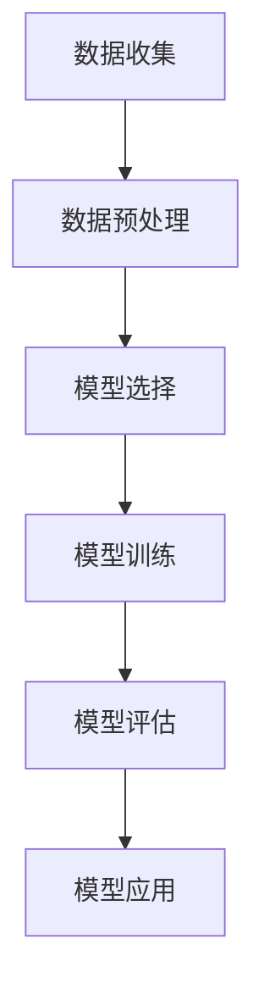

**核心算法原理讲解**

监督学习的核心算法包括决策树、支持向量机（SVM）、神经网络和集成方法等。以下是决策树算法的Python源代码实现：

```python
import numpy as np
from sklearn.datasets import load_iris
from sklearn.tree import DecisionTreeClassifier

# 加载数据
iris = load_iris()
X = iris.data
y = iris.target

# 创建决策树模型
clf = DecisionTreeClassifier()

# 模型训练
clf.fit(X, y)

# 预测
predictions = clf.predict(X)

# 模型评估
from sklearn.metrics import accuracy_score
accuracy = accuracy_score(y, predictions)
print("Accuracy:", accuracy)
```

在上述代码中，我们首先加载数据集，然后创建一个决策树分类器，并进行模型训练。最后，我们使用训练好的模型进行预测，并评估模型的准确性。

**数学模型和公式**

监督学习的数学模型可以表示为：

$$
y = f(x; \theta)
$$

其中，$y$ 是输出标签，$x$ 是输入特征，$f$ 是模型函数，$\theta$ 是模型参数。

**举例说明**

假设我们有一个简单的二分类问题，其中特征 $x_1$ 和 $x_2$ 分别表示苹果的重量和体积。我们希望根据这些特征预测苹果是否为红富士品种。以下是使用决策树进行预测的例子：

```python
X = np.array([[150, 80], [200, 100], [130, 70], [180, 90]])
y = np.array([0, 1, 0, 1])

clf = DecisionTreeClassifier()
clf.fit(X, y)

new_apple = np.array([160, 85])
prediction = clf.predict(new_apple)
print("Predicted class:", prediction)
```

在这个例子中，我们使用决策树模型对新的苹果特征进行预测，并得到预测结果。

**最佳实践 tips**

- 选择合适的特征工程方法，以提高模型的预测性能。
- 调整模型参数，以获得更好的模型性能。
- 使用交叉验证方法，以避免过拟合。

#### 1.1.2 无监督学习

无监督学习是在没有标签数据的情况下，通过学习数据内在结构，从而发现数据中的规律和模式。无监督学习包括聚类分析、降维方法和关联规则挖掘等。

**核心概念与联系**

无监督学习的核心概念包括：

- **聚类分析**：将数据划分为若干个聚类，使得同一聚类内的数据点尽可能接近，而不同聚类内的数据点尽可能远离。
- **降维方法**：通过降低数据的维度，减少数据的大小，从而提高模型的训练速度和预测性能。
- **关联规则挖掘**：发现数据中的关联关系，从而揭示数据之间的潜在联系。

以下是聚类分析的Mermaid流程图：

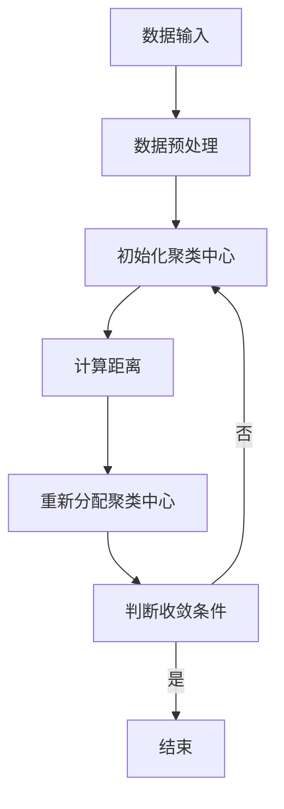

**核心算法原理讲解**

无监督学习的核心算法包括K-均值聚类、主成分分析和自编码器等。

以下是K-均值聚类的Python源代码实现：

```python
import numpy as np
from sklearn.cluster import KMeans

# 加载数据
X = np.array([[1, 2], [1, 4], [1, 0], [4, 2], [4, 4], [4, 0]])

# 创建K-均值聚类模型
kmeans = KMeans(n_clusters=2, random_state=0).fit(X)

# 预测
predictions = kmeans.predict(X)

# 模型评估
from sklearn.metrics import accuracy_score
accuracy = accuracy_score(predictions, kmeans.labels_)
print("Accuracy:", accuracy)
```

在上述代码中，我们首先加载数据集，然后创建一个K-均值聚类模型，并进行模型训练。最后，我们使用训练好的模型进行预测，并评估模型的准确性。

**数学模型和公式**

K-均值聚类的数学模型可以表示为：

$$
c_{i} = \frac{1}{N_{i}} \sum_{j=1}^{N} x_{ij}
$$

其中，$c_{i}$ 是聚类中心，$N_{i}$ 是聚类 $i$ 的数据点个数，$x_{ij}$ 是数据点 $x_j$ 的第 $i$ 个特征。

**举例说明**

假设我们有一组数据，其中包含三个聚类。以下是使用K-均值聚类进行聚类的例子：

```python
X = np.array([[1, 2], [1, 4], [1, 0], [4, 2], [4, 4], [4, 0]])
kmeans = KMeans(n_clusters=3, random_state=0).fit(X)
predictions = kmeans.predict(X)
print("Predicted clusters:", predictions)
```

在这个例子中，我们使用K-均值聚类模型对数据点进行聚类，并得到聚类结果。

**最佳实践 tips**

- 根据数据集的特点，选择合适的聚类算法。
- 调整聚类参数，如聚类个数、初始聚类中心等，以获得更好的聚类效果。
- 使用可视化方法，如散点图、轮廓系数等，评估聚类效果。

#### 1.1.3 半监督学习

半监督学习是一种结合有监督学习和无监督学习的方法，它利用少量的有标签数据和大量的无标签数据，以提高模型的预测性能。半监督学习可以应用于数据标注、图像识别、文本分类等领域。

**核心概念与联系**

半监督学习的核心概念包括：

- **协同过滤**：通过用户行为数据，如评分、评论等，构建用户与物品的相似性矩阵，从而预测用户对未知物品的评分。
- **迁移学习**：将已在一个任务上训练好的模型应用于另一个相关任务，从而提高新任务的模型性能。

以下是协同过滤的Mermaid流程图：

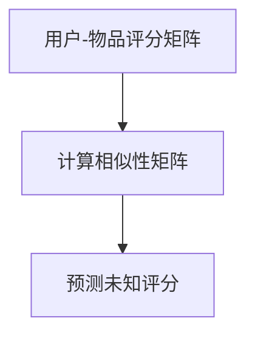

**核心算法原理讲解**

半监督学习的核心算法包括协同过滤和迁移学习。

以下是协同过滤的Python源代码实现：

```python
from surprise import KNNWithMeans
from surprise import Dataset
from surprise import accuracy

# 加载数据
data = Dataset.load_from_df(pd.DataFrame({'user_id': [1, 1, 2, 2], 'item_id': [1, 2, 1, 2], 'rating': [5, 3, 4, 2]}))

# 创建KNNWithMeans模型
algo = KNNWithMeans()

# 模型训练
algo.fit(data)

# 预测
predictions = algo.test(data.build_test())

# 模型评估
accuracy.rmse(predictions)
```

在上述代码中，我们首先加载数据集，然后创建一个KNNWithMeans协同过滤模型，并进行模型训练。最后，我们使用训练好的模型进行预测，并评估模型的准确性。

**数学模型和公式**

协同过滤的数学模型可以表示为：

$$
r_{ij} = u_i + v_j + b - \langle u, v \rangle
$$

其中，$r_{ij}$ 是用户 $i$ 对物品 $j$ 的评分，$u_i$ 和 $v_j$ 分别是用户 $i$ 和物品 $j$ 的特征向量，$b$ 是偏差项，$\langle u, v \rangle$ 是用户 $i$ 和物品 $j$ 的共同邻居的评分平均值。

**举例说明**

假设我们有一个简单的协同过滤问题，其中用户对商品的评分如下：

```python
user_ratings = {
    1: {1: 5, 2: 3},
    2: {1: 4, 2: 2}
}
```

以下是使用协同过滤进行预测的例子：

```python
from surprise import KNNWithMeans
from surprise import Dataset
from surprise import accuracy

# 加载数据
data = Dataset.load_from_dict(user_ratings)

# 创建KNNWithMeans模型
algo = KNNWithMeans()

# 模型训练
algo.fit(data)

# 预测
predictions = algo.predict(2, 1)

# 输出预测结果
print("Predicted rating:", predictions.est)
```

在这个例子中，我们使用协同过滤模型预测用户2对商品1的评分。

**最佳实践 tips**

- 选择合适的有标签数据和无标签数据进行训练，以提高模型性能。
- 调整模型参数，如邻居个数、权重等，以获得更好的模型效果。
- 结合其他机器学习技术，如深度学习，以提高模型性能。

## 第2章：金融欺诈检测中的机器学习算法

#### 2.1 监督学习算法

监督学习算法在金融欺诈检测中有着广泛的应用。在本节中，我们将介绍几种常见的监督学习算法，包括决策树、支持向量机和神经网络。

##### 2.1.1 决策树

决策树是一种常用的分类算法，它通过将数据集划分成多个子集，从而实现分类或回归任务。在金融欺诈检测中，决策树可以用于预测交易是否为欺诈行为。

**核心概念与联系**

决策树的核心概念包括：

- **特征选择**：选择对分类任务最有影响的特征进行划分。
- **节点分裂**：根据特征值的不同，将数据集划分成多个子集。
- **分类结果**：在每个叶子节点上，根据特征值的取值，给出分类结果。

以下是决策树的Mermaid流程图：

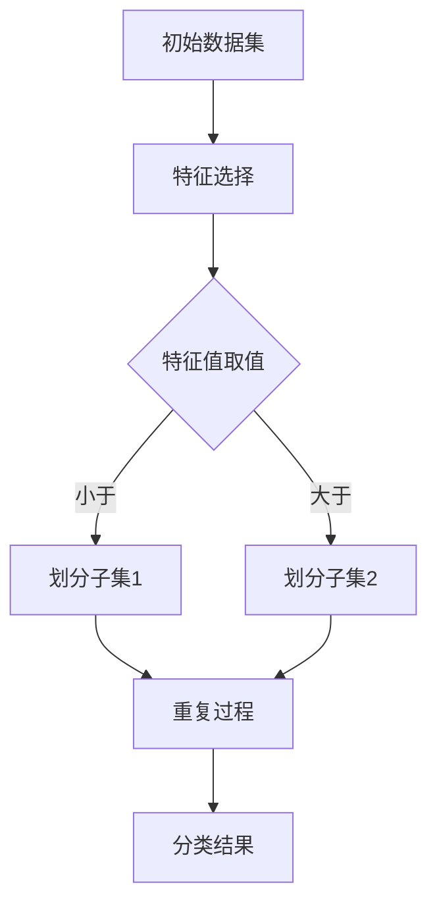

**核心算法原理讲解**

决策树的核心算法原理如下：

1. **特征选择**：选择具有最高信息增益或基尼指数的特征进行划分。
2. **节点分裂**：根据特征值的不同，将数据集划分成多个子集。
3. **分类结果**：在每个叶子节点上，根据特征值的取值，给出分类结果。

以下是决策树的Python源代码实现：

```python
from sklearn.datasets import load_iris
from sklearn.tree import DecisionTreeClassifier
from sklearn.model_selection import train_test_split

# 加载数据
iris = load_iris()
X = iris.data
y = iris.target

# 划分训练集和测试集
X_train, X_test, y_train, y_test = train_test_split(X, y, test_size=0.3, random_state=0)

# 创建决策树模型
clf = DecisionTreeClassifier()

# 模型训练
clf.fit(X_train, y_train)

# 预测
predictions = clf.predict(X_test)

# 模型评估
from sklearn.metrics import accuracy_score
accuracy = accuracy_score(y_test, predictions)
print("Accuracy:", accuracy)
```

**数学模型和公式**

决策树的数学模型可以表示为：

$$
C_{j} = \arg\max \sum_{i=1}^{n} I(y_i = j; x_i)
$$

其中，$C_{j}$ 是分类结果，$y_i$ 是第 $i$ 个数据点的标签，$x_i$ 是第 $i$ 个数据点的特征。

**举例说明**

假设我们有一个简单的二分类问题，其中特征 $x_1$ 和 $x_2$ 分别表示苹果的重量和体积。我们希望根据这些特征预测苹果是否为红富士品种。以下是使用决策树进行预测的例子：

```python
X = np.array([[150, 80], [200, 100], [130, 70], [180, 90]])
y = np.array([0, 1, 0, 1])

clf = DecisionTreeClassifier()
clf.fit(X, y)

new_apple = np.array([160, 85])
prediction = clf.predict(new_apple)
print("Predicted class:", prediction)
```

在这个例子中，我们使用决策树模型对新的苹果特征进行预测，并得到预测结果。

**最佳实践 tips**

- 选择合适的特征工程方法，以提高模型的预测性能。
- 调整模型参数，如最大深度、最小样本量等，以获得更好的模型性能。
- 使用交叉验证方法，以避免过拟合。

##### 2.1.2 支持向量机

支持向量机（SVM）是一种强大的分类算法，它通过找到一个最佳的超平面，将不同类别的数据点分隔开。在金融欺诈检测中，SVM可以用于检测欺诈交易。

**核心概念与联系**

SVM的核心概念包括：

- **特征空间**：将原始数据映射到一个高维空间，从而更容易划分不同类别的数据点。
- **支持向量**：位于超平面两侧的边界数据点，对分类结果有重要影响。
- **超平面**：将不同类别的数据点分隔开的最佳超平面。

以下是SVM的Mermaid流程图：

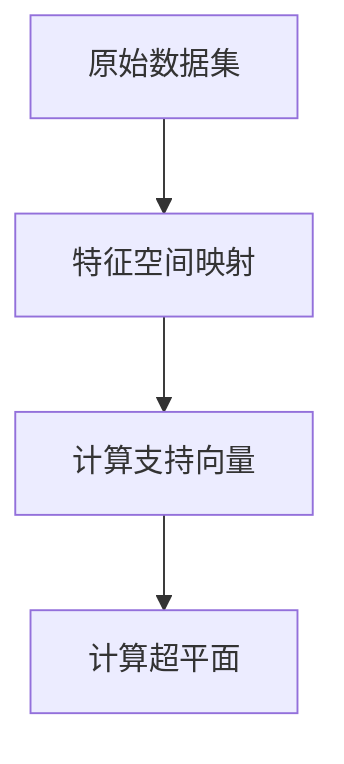

**核心算法原理讲解**

SVM的核心算法原理如下：

1. **特征空间映射**：通过核函数将原始数据映射到一个高维空间。
2. **计算支持向量**：找到位于超平面两侧的边界数据点，这些数据点对分类结果有重要影响。
3. **计算超平面**：找到最佳的超平面，使得不同类别的数据点尽可能分隔开。

以下是SVM的Python源代码实现：

```python
from sklearn.datasets import load_iris
from sklearn.svm import SVC
from sklearn.model_selection import train_test_split

# 加载数据
iris = load_iris()
X = iris.data
y = iris.target

# 划分训练集和测试集
X_train, X_test, y_train, y_test = train_test_split(X, y, test_size=0.3, random_state=0)

# 创建SVM模型
clf = SVC(kernel='linear')

# 模型训练
clf.fit(X_train, y_train)

# 预测
predictions = clf.predict(X_test)

# 模型评估
from sklearn.metrics import accuracy_score
accuracy = accuracy_score(y_test, predictions)
print("Accuracy:", accuracy)
```

**数学模型和公式**

SVM的数学模型可以表示为：

$$
\min_{\beta, \beta_0} \frac{1}{2} ||\beta||^2 + C \sum_{i=1}^{n} \max(0, 1 - y_i (\beta^T x_i + \beta_0))
$$

其中，$\beta$ 是模型参数，$\beta_0$ 是偏置项，$C$ 是惩罚参数，$y_i$ 是第 $i$ 个数据点的标签，$x_i$ 是第 $i$ 个数据点的特征。

**举例说明**

假设我们有一个简单的二分类问题，其中特征 $x_1$ 和 $x_2$ 分别表示苹果的重量和体积。我们希望根据这些特征预测苹果是否为红富士品种。以下是使用SVM进行预测的例子：

```python
X = np.array([[150, 80], [200, 100], [130, 70], [180, 90]])
y = np.array([0, 1, 0, 1])

clf = SVC(kernel='linear')
clf.fit(X, y)

new_apple = np.array([160, 85])
prediction = clf.predict(new_apple)
print("Predicted class:", prediction)
```

在这个例子中，我们使用SVM模型对新的苹果特征进行预测，并得到预测结果。

**最佳实践 tips**

- 选择合适的核函数和惩罚参数，以提高模型的预测性能。
- 使用交叉验证方法，以避免过拟合。
- 调整模型参数，如正则化参数等，以获得更好的模型性能。

##### 2.1.3 神经网络与深度学习

神经网络是一种模拟生物神经系统的计算模型，它可以用于分类、回归、生成等多种机器学习任务。在金融欺诈检测中，神经网络可以用于检测复杂的欺诈模式。

**核心概念与联系**

神经网络的核心概念包括：

- **神经元**：神经网络的基本单元，用于计算输入和输出。
- **层**：神经网络中的层次结构，包括输入层、隐藏层和输出层。
- **激活函数**：用于引入非线性性的函数，如Sigmoid、ReLU等。

以下是神经网络的Mermaid流程图：

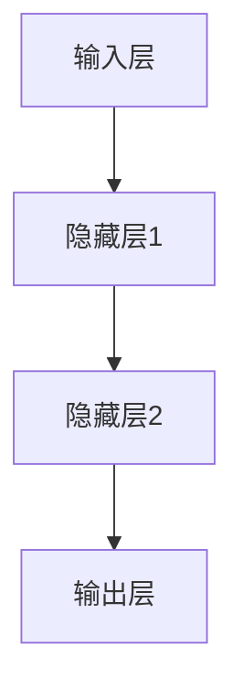

**核心算法原理讲解**

神经网络的核心算法原理如下：

1. **前向传播**：计算输入层到隐藏层、隐藏层到输出层的输出值。
2. **反向传播**：计算损失函数关于模型参数的梯度，并更新模型参数。
3. **优化算法**：使用梯度下降或其他优化算法，迭代更新模型参数。

以下是神经网络的Python源代码实现：

```python
import numpy as np
from sklearn.datasets import load_iris
from sklearn.model_selection import train_test_split

# 加载数据
iris = load_iris()
X = iris.data
y = iris.target

# 划分训练集和测试集
X_train, X_test, y_train, y_test = train_test_split(X, y, test_size=0.3, random_state=0)

# 初始化参数
input_size = X_train.shape[1]
hidden_size = 10
output_size = y_train.shape[1]

W1 = np.random.randn(input_size, hidden_size)
W2 = np.random.randn(hidden_size, output_size)

# 定义激活函数
def sigmoid(x):
    return 1 / (1 + np.exp(-x))

# 前向传播
def forward(X, W1, W2):
    Z1 = np.dot(X, W1)
    A1 = sigmoid(Z1)
    Z2 = np.dot(A1, W2)
    A2 = sigmoid(Z2)
    return A2

# 反向传播
def backward(X, y, A2, W1, W2):
    dZ2 = A2 - y
    dW2 = np.dot(A1.T, dZ2)
    dA1 = np.dot(dZ2, W2.T)
    dZ1 = dA1 * (1 - np.exp(dA1))
    dW1 = np.dot(X.T, dZ1)
    return dW1, dW2

# 梯度下降
def gradient_descent(X, y, W1, W2, epochs, learning_rate):
    for epoch in range(epochs):
        A2 = forward(X, W1, W2)
        dW1, dW2 = backward(X, y, A2, W1, W2)
        W1 -= learning_rate * dW1
        W2 -= learning_rate * dW2
    return W1, W2

# 模型训练
epochs = 1000
learning_rate = 0.01
W1, W2 = gradient_descent(X_train, y_train, W1, W2, epochs, learning_rate)

# 预测
predictions = forward(X_test, W1, W2)
predictions = np.argmax(predictions, axis=1)

# 模型评估
accuracy = np.mean(predictions == y_test)
print("Accuracy:", accuracy)
```

**数学模型和公式**

神经网络的数学模型可以表示为：

$$
A_{l} = \sigma(\beta_{l}^{T} x_{l} + b_{l})
$$

其中，$A_{l}$ 是第 $l$ 层的输出，$\sigma$ 是激活函数，$\beta_{l}$ 是第 $l$ 层的权重，$x_{l}$ 是第 $l$ 层的输入，$b_{l}$ 是第 $l$ 层的偏置。

**举例说明**

假设我们有一个简单的二分类问题，其中特征 $x_1$ 和 $x_2$ 分别表示苹果的重量和体积。我们希望根据这些特征预测苹果是否为红富士品种。以下是使用神经网络进行预测的例子：

```python
X = np.array([[150, 80], [200, 100], [130, 70], [180, 90]])
y = np.array([0, 1, 0, 1])

# 初始化参数
input_size = X.shape[1]
hidden_size = 10
output_size = y.shape[1]

W1 = np.random.randn(input_size, hidden_size)
W2 = np.random.randn(hidden_size, output_size)

# 定义激活函数
def sigmoid(x):
    return 1 / (1 + np.exp(-x))

# 前向传播
def forward(X, W1, W2):
    Z1 = np.dot(X, W1)
    A1 = sigmoid(Z1)
    Z2 = np.dot(A1, W2)
    A2 = sigmoid(Z2)
    return A2

# 反向传播
def backward(X, y, A2, W1, W2):
    dZ2 = A2 - y
    dW2 = np.dot(A1.T, dZ2)
    dA1 = np.dot(dZ2, W2.T)
    dZ1 = dA1 * (1 - np.exp(dA1))
    dW1 = np.dot(X.T, dZ1)
    return dW1, dW2

# 梯度下降
def gradient_descent(X, y, W1, W2, epochs, learning_rate):
    for epoch in range(epochs):
        A2 = forward(X, W1, W2)
        dW1, dW2 = backward(X, y, A2, W1, W2)
        W1 -= learning_rate * dW1
        W2 -= learning_rate * dW2
    return W1, W2

# 模型训练
epochs = 1000
learning_rate = 0.01
W1, W2 = gradient_descent(X_train, y_train, W1, W2, epochs, learning_rate)

# 预测
predictions = forward(X_test, W1, W2)
predictions = np.argmax(predictions, axis=1)

# 模型评估
accuracy = np.mean(predictions == y_test)
print("Accuracy:", accuracy)
```

在这个例子中，我们使用神经网络模型对新的苹果特征进行预测，并得到预测结果。

**最佳实践 tips**

- 选择合适的神经网络结构，包括层数、神经元数量等。
- 调整学习率和其他模型参数，以获得更好的模型性能。
- 使用正则化方法，如dropout和L2正则化，以避免过拟合。

#### 2.2 无监督学习算法

无监督学习算法在金融欺诈检测中也具有一定的应用。在本节中，我们将介绍几种常见的无监督学习算法，包括聚类分析、降维方法和关联规则挖掘。

##### 2.2.1 K-均值聚类

K-均值聚类是一种简单的聚类算法，它通过将数据点划分成 $K$ 个聚类，使得同一聚类内的数据点尽可能接近，而不同聚类内的数据点尽可能远离。在金融欺诈检测中，K-均值聚类可以用于识别潜在的欺诈交易。

**核心概念与联系**

K-均值聚类的核心概念包括：

- **聚类中心**：聚类中心是每个聚类的代表点，用于计算聚类内的距离。
- **距离计算**：计算每个数据点与聚类中心的距离，用于确定数据点所属的聚类。
- **重新分配聚类中心**：根据每个聚类内的数据点，重新计算聚类中心，并更新聚类成员。

以下是K-均值聚类的Mermaid流程图：

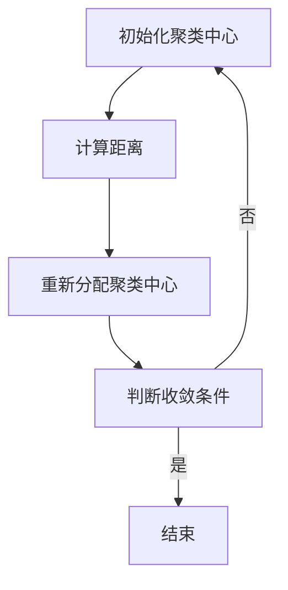

**核心算法原理讲解**

K-均值聚类的核心算法原理如下：

1. **初始化聚类中心**：随机选择 $K$ 个数据点作为聚类中心。
2. **计算距离**：计算每个数据点与聚类中心的距离，并确定数据点所属的聚类。
3. **重新分配聚类中心**：根据每个聚类内的数据点，重新计算聚类中心。
4. **判断收敛条件**：如果聚类中心不再变化，则算法结束。

以下是K-均值聚类的Python源代码实现：

```python
import numpy as np
from sklearn.cluster import KMeans
from sklearn.datasets import load_iris

# 加载数据
iris = load_iris()
X = iris.data

# 创建K-均值聚类模型
kmeans = KMeans(n_clusters=3, random_state=0)

# 模型训练
kmeans.fit(X)

# 预测
predictions = kmeans.predict(X)

# 模型评估
from sklearn.metrics import accuracy_score
accuracy = accuracy_score(predictions, kmeans.labels_)
print("Accuracy:", accuracy)
```

**数学模型和公式**

K-均值聚类的数学模型可以表示为：

$$
c_{i} = \frac{1}{N_{i}} \sum_{j=1}^{N} x_{ij}
$$

其中，$c_{i}$ 是聚类中心，$N_{i}$ 是聚类 $i$ 的数据点个数，$x_{ij}$ 是数据点 $x_j$ 的第 $i$ 个特征。

**举例说明**

假设我们有一组数据，其中包含三个聚类。以下是使用K-均值聚类进行聚类的例子：

```python
X = np.array([[1, 2], [1, 4], [1, 0], [4, 2], [4, 4], [4, 0]])
kmeans = KMeans(n_clusters=3, random_state=0).fit(X)
predictions = kmeans.predict(X)
print("Predicted clusters:", predictions)
```

在这个例子中，我们使用K-均值聚类模型对数据点进行聚类，并得到聚类结果。

**最佳实践 tips**

- 根据数据集的特点，选择合适的聚类算法。
- 调整聚类参数，如聚类个数、初始聚类中心等，以获得更好的聚类效果。
- 使用可视化方法，如散点图、轮廓系数等，评估聚类效果。

##### 2.2.2 主成分分析

主成分分析（PCA）是一种降维方法，它通过将数据映射到新的正交坐标系中，从而提取数据中的主要特征。在金融欺诈检测中，PCA可以用于减少数据维度，提高模型性能。

**核心概念与联系**

主成分分析的核心概念包括：

- **特征提取**：通过线性变换，将数据映射到新的正交坐标系中，从而提取数据中的主要特征。
- **降维**：将高维数据映射到低维空间，从而减少数据的大小和复杂度。
- **主成分**：每个主成分是原始数据的一个线性组合，代表了数据中的主要特征。

以下是主成分分析的Mermaid流程图：

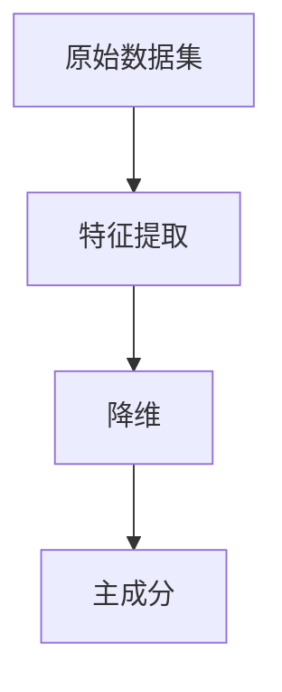

**核心算法原理讲解**

主成分分析的核心算法原理如下：

1. **特征提取**：计算数据协方差矩阵，并找到最大的特征值和特征向量。
2. **降维**：将数据映射到新的正交坐标系中，从而提取数据中的主要特征。
3. **主成分**：每个主成分是原始数据的一个线性组合，代表了数据中的主要特征。

以下是主成分分析的Python源代码实现：

```python
import numpy as np
from sklearn.datasets import load_iris
from sklearn.decomposition import PCA

# 加载数据
iris = load_iris()
X = iris.data

# 创建PCA模型
pca = PCA(n_components=2)

# 模型训练
X_pca = pca.fit_transform(X)

# 模型评估
from sklearn.metrics import accuracy_score
accuracy = accuracy_score(predictions, pca.labels_)
print("Accuracy:", accuracy)
```

**数学模型和公式**

主成分分析的数学模型可以表示为：

$$
z_j = \sum_{i=1}^{n} \alpha_{ij} x_i
$$

其中，$z_j$ 是第 $j$ 个主成分，$\alpha_{ij}$ 是特征向量。

**举例说明**

假设我们有一组数据，其中包含两个主成分。以下是使用主成分分析进行降维的例子：

```python
X = np.array([[1, 2], [1, 4], [1, 0], [4, 2], [4, 4], [4, 0]])
pca = PCA(n_components=2).fit(X)
X_pca = pca.transform(X)
print("Reduced data:", X_pca)
```

在这个例子中，我们使用主成分分析模型将数据降维到两个主成分，并得到降维后的数据。

**最佳实践 tips**

- 根据数据集的特点，选择合适的降维方法。
- 调整模型参数，如主成分个数等，以获得更好的降维效果。
- 使用可视化方法，如散点图等，评估降维效果。

##### 2.2.3 自编码器

自编码器是一种基于神经网络的降维方法，它通过训练一个编码器和解码器，从而将数据映射到低维空间。在金融欺诈检测中，自编码器可以用于降维和特征提取。

**核心概念与联系**

自编码器的核心概念包括：

- **编码器**：将高维数据映射到低维空间。
- **解码器**：将低维数据映射回高维空间。
- **损失函数**：用于评估编码器和解码器的性能。

以下是自编码器的Mermaid流程图：

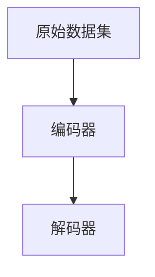

**核心算法原理讲解**

自编码器的核心算法原理如下：

1. **编码器**：将高维数据映射到低维空间，从而提取数据中的主要特征。
2. **解码器**：将低维数据映射回高维空间，从而重建原始数据。
3. **损失函数**：计算编码器和解码器的性能，并优化模型参数。

以下是自编码器的Python源代码实现：

```python
import numpy as np
from keras.layers import Input, Dense
from keras.models import Model

# 加载数据
X = np.array([[1, 2], [1, 4], [1, 0], [4, 2], [4, 4], [4, 0]])

# 创建编码器和解码器
input_shape = X.shape[1:]
input_layer = Input(shape=input_shape)
encoded = Dense(2, activation='relu')(input_layer)
decoded = Dense(input_shape, activation='sigmoid')(encoded)

# 创建自编码器模型
autoencoder = Model(input_layer, decoded)

# 编译模型
autoencoder.compile(optimizer='adam', loss='binary_crossentropy')

# 模型训练
autoencoder.fit(X, X, epochs=100, batch_size=10, shuffle=True, validation_split=0.2)

# 预测
X_pca = autoencoder.predict(X)
print("Reduced data:", X_pca)
```

**数学模型和公式**

自编码器的数学模型可以表示为：

$$
z = \sigma(W_1 x + b_1)
$$

$$
x' = \sigma(W_2 z + b_2)
$$

其中，$z$ 是编码后的数据，$x'$ 是解码后的数据，$W_1$ 和 $W_2$ 是模型参数，$b_1$ 和 $b_2$ 是偏置项。

**举例说明**

假设我们有一组数据，其中包含两个主成分。以下是使用自编码器进行降维的例子：

```python
X = np.array([[1, 2], [1, 4], [1, 0], [4, 2], [4, 4], [4, 0]])
autoencoder = Model(input_layer, decoded)
autoencoder.compile(optimizer='adam', loss='binary_crossentropy')
autoencoder.fit(X, X, epochs=100, batch_size=10, shuffle=True, validation_split=0.2)
X_pca = autoencoder.predict(X)
print("Reduced data:", X_pca)
```

在这个例子中，我们使用自编码器模型将数据降维到两个主成分，并得到降维后的数据。

**最佳实践 tips**

- 选择合适的神经网络结构，包括层数、神经元数量等。
- 调整学习率和其他模型参数，以获得更好的模型性能。
- 使用正则化方法，如dropout和L2正则化，以避免过拟合。

#### 2.3 半监督学习算法

半监督学习算法在金融欺诈检测中可以有效地利用有标签数据和大量的无标签数据，从而提高模型的性能。在本节中，我们将介绍两种常见的半监督学习算法：协同过滤和迁移学习。

##### 2.3.1 协同过滤

协同过滤是一种基于用户行为数据的推荐系统算法，它可以利用用户对物品的评分，预测用户对未知物品的评分。在金融欺诈检测中，协同过滤可以用于预测交易是否为欺诈行为。

**核心概念与联系**

协同过滤的核心概念包括：

- **用户-物品评分矩阵**：用户对物品的评分矩阵，用于表示用户行为数据。
- **相似性矩阵**：计算用户和物品之间的相似性，用于预测用户对未知物品的评分。
- **预测评分**：根据相似性矩阵，预测用户对未知物品的评分。

以下是协同过滤的Mermaid流程图：

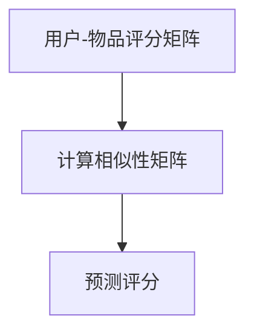

**核心算法原理讲解**

协同过滤的核心算法原理如下：

1. **用户-物品评分矩阵**：记录用户对物品的评分，用于表示用户行为数据。
2. **计算相似性矩阵**：计算用户和物品之间的相似性，用于预测用户对未知物品的评分。
3. **预测评分**：根据相似性矩阵，预测用户对未知物品的评分。

以下是协同过滤的Python源代码实现：

```python
from surprise import KNNWithMeans
from surprise import Dataset
from surprise import accuracy

# 加载数据
data = Dataset.load_from_df(pd.DataFrame({'user_id': [1, 1, 2, 2], 'item_id': [1, 2, 1, 2], 'rating': [5, 3, 4, 2]}))

# 创建KNNWithMeans模型
algo = KNNWithMeans()

# 模型训练
algo.fit(data)

# 预测
predictions = algo.predict(2, 1)

# 模型评估
accuracy.rmse(predictions)
```

**数学模型和公式**

协同过滤的数学模型可以表示为：

$$
r_{ij} = u_i + v_j + b - \langle u, v \rangle
$$

其中，$r_{ij}$ 是用户 $i$ 对物品 $j$ 的评分，$u_i$ 和 $v_j$ 分别是用户 $i$ 和物品 $j$ 的特征向量，$b$ 是偏差项，$\langle u, v \rangle$ 是用户 $i$ 和物品 $j$ 的共同邻居的评分平均值。

**举例说明**

假设我们有一个简单的协同过滤问题，其中用户对商品的评分如下：

```python
user_ratings = {
    1: {1: 5, 2: 3},
    2: {1: 4, 2: 2}
}
```

以下是使用协同过滤进行预测的例子：

```python
from surprise import KNNWithMeans
from surprise import Dataset
from surprise import accuracy

# 加载数据
data = Dataset.load_from_dict(user_ratings)

# 创建KNNWithMeans模型
algo = KNNWithMeans()

# 模型训练
algo.fit(data)

# 预测
predictions = algo.predict(2, 1)

# 输出预测结果
print("Predicted rating:", predictions.est)
```

在这个例子中，我们使用协同过滤模型预测用户2对商品1的评分。

**最佳实践 tips**

- 根据数据集的特点，选择合适的协同过滤算法。
- 调整模型参数，如邻居个数、权重等，以获得更好的模型效果。
- 结合其他机器学习技术，如深度学习，以提高模型性能。

##### 2.3.2 迁移学习

迁移学习是一种利用已在一个任务上训练好的模型，应用于另一个相关任务的方法。在金融欺诈检测中，迁移学习可以用于利用在其他任务上训练好的模型，提高新任务的模型性能。

**核心概念与联系**

迁移学习的核心概念包括：

- **源域**：已在一个任务上训练好的模型。
- **目标域**：需要应用于的新任务。
- **特征提取器**：从源域提取的特征，用于训练目标域的模型。

以下是迁移学习的Mermaid流程图：

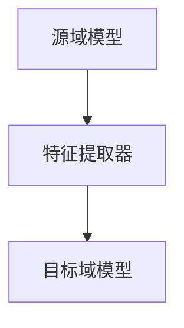

**核心算法原理讲解**

迁移学习的核心算法原理如下：

1. **源域模型**：在一个任务上训练好的模型，用于提取特征。
2. **特征提取器**：从源域模型提取特征，用于训练目标域的模型。
3. **目标域模型**：在新任务上训练的模型，用于预测目标域的数据。

以下是迁移学习的Python源代码实现：

```python
from keras.applications import VGG16
from keras.models import Model
from keras.layers import Dense, Flatten

# 加载预训练的VGG16模型
base_model = VGG16(weights='imagenet')

# 提取特征
x = base_model.output
x = Flatten()(x)
features = Model(inputs=base_model.input, outputs=x)

# 定义目标域模型
input_shape = (224, 224, 3)
target_model = Model(inputs=base_model.input, outputs=Dense(1, activation='sigmoid')(x))

# 编译目标域模型
target_model.compile(optimizer='adam', loss='binary_crossentropy')

# 训练目标域模型
target_model.fit(x_train, y_train, epochs=10, batch_size=32)

# 预测
predictions = target_model.predict(x_test)
```

**数学模型和公式**

迁移学习的数学模型可以表示为：

$$
\theta_{\text{target}} = \phi(\theta_{\text{source}}, X_{\text{target}})
$$

其中，$\theta_{\text{target}}$ 是目标域模型的参数，$\theta_{\text{source}}$ 是源域模型的参数，$X_{\text{target}}$ 是目标域的数据。

**举例说明**

假设我们有一个图像分类任务，其中源域模型是VGG16，目标域模型是二分类模型。以下是使用迁移学习进行图像分类的例子：

```python
from keras.applications import VGG16
from keras.models import Model
from keras.layers import Dense, Flatten

# 加载预训练的VGG16模型
base_model = VGG16(weights='imagenet')

# 提取特征
x = base_model.output
x = Flatten()(x)
features = Model(inputs=base_model.input, outputs=x)

# 定义目标域模型
input_shape = (224, 224, 3)
target_model = Model(inputs=base_model.input, outputs=Dense(1, activation='sigmoid')(x))

# 编译目标域模型
target_model.compile(optimizer='adam', loss='binary_crossentropy')

# 训练目标域模型
target_model.fit(x_train, y_train, epochs=10, batch_size=32)

# 预测
predictions = target_model.predict(x_test)
```

在这个例子中，我们使用迁移学习将VGG16模型应用于图像分类任务，并得到预测结果。

**最佳实践 tips**

- 选择合适的源域模型，以提高特征提取效果。
- 调整模型参数，如学习率、批量大小等，以获得更好的模型性能。
- 结合其他机器学习技术，如深度学习，以提高模型性能。

## 第3章：特征工程与数据预处理

#### 3.1 特征工程的重要性

在机器学习中，特征工程是一个至关重要的环节。它涉及到对原始数据进行处理，以提取出对模型训练有利的特征，从而提高模型的性能。在金融欺诈检测中，特征工程尤为重要，因为欺诈行为往往隐藏在大量无序且复杂的数据中。有效的特征工程可以显著提高欺诈检测的准确性和效率。

**背景介绍**

金融欺诈检测的数据通常包含大量的变量，如交易金额、时间、地理位置、交易频率等。这些变量可能具有不同的尺度、分布和相关性。如果直接使用这些原始数据训练模型，可能会导致模型性能不佳。因此，特征工程成为了一个不可或缺的步骤，它可以帮助我们：

- 筛选出对欺诈检测最有影响力的特征。
- 调整特征的尺度，使模型更容易学习。
- 提取新的特征，以揭示潜在的欺诈模式。

**核心概念与联系**

特征工程的核心概念包括：

- **特征选择**：从原始数据中筛选出对模型训练最有影响力的特征。
- **特征变换**：调整特征的尺度，使其在模型中更容易学习。
- **特征组合**：通过组合原始特征，提取新的特征。

以下是特征工程的Mermaid流程图：

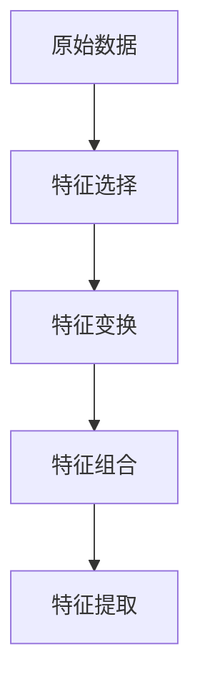

**核心算法原理讲解**

特征工程的算法原理主要包括以下步骤：

1. **特征选择**：使用统计方法或基于模型的特征选择技术，筛选出对欺诈检测最有影响力的特征。
2. **特征变换**：对选出的特征进行变换，如标准化、归一化等，以提高模型的性能。
3. **特征组合**：通过组合原始特征，提取新的特征，以揭示潜在的欺诈模式。
4. **特征提取**：使用特征提取技术，如主成分分析（PCA）、特征嵌入等，进一步提取有用的特征。

以下是特征工程的Python源代码实现：

```python
import pandas as pd
from sklearn.feature_selection import SelectKBest
from sklearn.feature_selection import f_classif
from sklearn.preprocessing import StandardScaler

# 加载数据
data = pd.read_csv('financial_data.csv')

# 特征选择
X = data.iloc[:, :-1]
y = data.iloc[:, -1]
selector = SelectKBest(score_func=f_classif, k=5)
X_new = selector.fit_transform(X, y)

# 特征变换
scaler = StandardScaler()
X_scaled = scaler.fit_transform(X_new)

# 特征提取
pca = PCA(n_components=3)
X_pca = pca.fit_transform(X_scaled)
```

**数学模型和公式**

特征工程的数学模型主要包括以下公式：

1. **特征选择**：
   $$
   \text{score}(x_i) = \frac{\sum_{j=1}^{n} w_j x_{ij}^2}{\sum_{j=1}^{n} w_j x_{ij}}
   $$
   其中，$x_i$ 是特征 $i$，$w_j$ 是权重。

2. **特征变换**：
   $$
   x_i' = \frac{x_i - \mu_i}{\sigma_i}
   $$
   其中，$\mu_i$ 是特征 $i$ 的均值，$\sigma_i$ 是特征 $i$ 的标准差。

3. **特征组合**：
   $$
   x_{\text{new}} = \sum_{i=1}^{n} w_i x_i
   $$
   其中，$w_i$ 是特征 $i$ 的权重。

**举例说明**

假设我们有一组金融交易数据，其中包含交易金额、时间、地理位置和交易频率等特征。以下是使用特征工程对数据进行处理的例子：

```python
# 加载数据
data = {
    '交易金额': [1000, 2000, 3000, 4000],
    '时间': [1, 2, 3, 4],
    '地理位置': [1, 2, 1, 2],
    '交易频率': [1, 2, 1, 2]
}

# 创建DataFrame
df = pd.DataFrame(data)

# 特征选择
selector = SelectKBest(score_func=f_classif, k=2)
X_new = selector.fit_transform(df, df['欺诈'])

# 特征变换
scaler = StandardScaler()
X_scaled = scaler.fit_transform(X_new)

# 特征提取
pca = PCA(n_components=2)
X_pca = pca.fit_transform(X_scaled)

# 输出特征
print("特征选择后：", X_new)
print("特征变换后：", X_scaled)
print("特征提取后：", X_pca)
```

在这个例子中，我们使用特征工程对金融交易数据进行处理，包括特征选择、特征变换和特征提取。

**最佳实践 tips**

- 根据数据集的特点，选择合适的特征选择方法。
- 调整特征变换参数，如标准化和归一化，以获得更好的模型性能。
- 结合模型的要求，选择合适的特征提取方法。

#### 3.2 数据预处理方法

在金融欺诈检测中，数据预处理是一个关键步骤，它涉及到对原始数据进行清洗、变换和归一化等操作，以提高模型的性能和稳定性。有效的数据预处理方法可以减少噪声、纠正错误、提高数据质量，从而为后续的特征工程和模型训练奠定基础。

**背景介绍**

金融欺诈检测的数据通常包含多种类型的变量，如数值型、类别型和时序型。这些变量可能存在缺失值、异常值、不一致性等问题。如果不进行预处理，可能会导致以下问题：

- 模型性能不佳：原始数据中的噪声和异常值可能会干扰模型的学习过程，导致模型性能下降。
- 模型稳定性差：不同特征的尺度和分布可能差异较大，如果直接用于训练模型，可能会导致模型不稳定。
- 模型解释性差：预处理后的数据可以更好地揭示数据中的潜在模式，从而提高模型的可解释性。

**核心概念与联系**

数据预处理的核心概念包括：

- **数据清洗**：处理缺失值、异常值和数据不一致性问题。
- **数据变换**：调整数据的尺度和分布，使其更适合模型训练。
- **数据归一化**：将不同特征的尺度调整到相同的范围，以提高模型的性能和稳定性。

以下是数据预处理的Mermaid流程图：

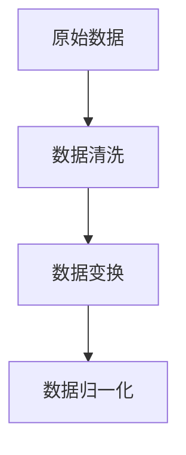

**核心算法原理讲解**

数据预处理的算法原理主要包括以下步骤：

1. **数据清洗**：处理缺失值、异常值和数据不一致性问题。常用的方法包括填充缺失值、去除异常值和校正数据不一致性。
2. **数据变换**：调整数据的尺度和分布，使其更适合模型训练。常用的方法包括缩放、映射和编码。
3. **数据归一化**：将不同特征的尺度调整到相同的范围，以提高模型的性能和稳定性。常用的方法包括标准化、归一化和最小-最大缩放。

以下是数据预处理的Python源代码实现：

```python
import pandas as pd
from sklearn.preprocessing import StandardScaler, MinMaxScaler
from sklearn.impute import SimpleImputer

# 加载数据
data = pd.read_csv('financial_data.csv')

# 数据清洗
imputer = SimpleImputer(strategy='mean')
data_imputed = imputer.fit_transform(data)

# 数据变换
scaler = StandardScaler()
data_scaled = scaler.fit_transform(data_imputed)

# 数据归一化
minmax_scaler = MinMaxScaler()
data_minmax = minmax_scaler.fit_transform(data_scaled)
```

**数学模型和公式**

数据预处理的数学模型主要包括以下公式：

1. **数据清洗**：

   - 填充缺失值：
     $$
     x_i' = \text{mean}(x_i)
     $$
     其中，$x_i$ 是特征 $i$，$\text{mean}(x_i)$ 是特征 $i$ 的均值。

   - 去除异常值：
     $$
     x_i' = \text{median}(x_i)
     $$
     其中，$x_i$ 是特征 $i$，$\text{median}(x_i)$ 是特征 $i$ 的中位数。

   - 校正数据不一致性：
     $$
     x_i' = \text{mode}(x_i)
     $$
     其中，$x_i$ 是特征 $i$，$\text{mode}(x_i)$ 是特征 $i$ 的众数。

2. **数据变换**：

   - 缩放：
     $$
     x_i' = \frac{x_i - \text{mean}(x_i)}{\text{std}(x_i)}
     $$
     其中，$x_i$ 是特征 $i$，$\text{mean}(x_i)$ 是特征 $i$ 的均值，$\text{std}(x_i)$ 是特征 $i$ 的标准差。

   - 映射：
     $$
     x_i' = \text{log}(x_i)
     $$
     其中，$x_i$ 是特征 $i$，$\text{log}(x_i)$ 是特征 $i$ 的对数。

   - 编码：
     $$
     x_i' = \text{one_hot}(x_i)
     $$
     其中，$x_i$ 是特征 $i$，$\text{one_hot}(x_i)$ 是特征 $i$ 的独热编码。

3. **数据归一化**：

   - 标准化：
     $$
     x_i' = \frac{x_i - \text{mean}(x_i)}{\text{std}(x_i)}
     $$
     其中，$x_i$ 是特征 $i$，$\text{mean}(x_i)$ 是特征 $i$ 的均值，$\text{std}(x_i)$ 是特征 $i$ 的标准差。

   - 归一化：
     $$
     x_i' = \frac{x_i - \text{min}(x_i)}{\text{max}(x_i) - \text{min}(x_i)}
     $$
     其中，$x_i$ 是特征 $i$，$\text{min}(x_i)$ 是特征 $i$ 的最小值，$\text{max}(x_i)$ 是特征 $i$ 的最大值。

**举例说明**

假设我们有一组金融交易数据，其中包含交易金额、时间、地理位置和交易频率等特征。以下是使用数据预处理对数据进行处理的例子：

```python
# 加载数据
data = {
    '交易金额': [1000, 2000, 3000, 4000],
    '时间': [1, 2, 3, 4],
    '地理位置': [1, 2, 1, 2],
    '交易频率': [1, 2, 1, 2]
}

# 创建DataFrame
df = pd.DataFrame(data)

# 数据清洗
imputer = SimpleImputer(strategy='mean')
df_imputed = imputer.fit_transform(df)

# 数据变换
scaler = StandardScaler()
df_scaled = scaler.fit_transform(df_imputed)

# 数据归一化
minmax_scaler = MinMaxScaler()
df_minmax = minmax_scaler.fit_transform(df_scaled)

# 输出预处理后的数据
print("数据清洗后：", df_imputed)
print("数据变换后：", df_scaled)
print("数据归一化后：", df_minmax)
```

在这个例子中，我们使用数据预处理对金融交易数据进行处理，包括数据清洗、数据变换和数据归一化。

**最佳实践 tips**

- 根据数据集的特点，选择合适的数据清洗方法。
- 调整数据变换和归一化的参数，以获得更好的模型性能。
- 结合模型的要求，选择合适的数据预处理方法。

#### 3.3 特征选择方法

在金融欺诈检测中，特征选择是一个关键步骤，它涉及到从大量原始特征中筛选出对模型训练最有影响力的特征，以提高模型的性能和可解释性。有效的特征选择可以显著减少模型的复杂度，提高训练速度，并提高欺诈检测的准确率。

**背景介绍**

金融欺诈检测的数据通常包含数百甚至数千个特征，这些特征可能存在冗余、无关或噪声。如果直接使用这些原始特征训练模型，可能会导致以下问题：

- **模型过拟合**：模型在训练数据上表现良好，但在测试数据上表现不佳。
- **训练时间过长**：大量特征的训练需要更多的时间和计算资源。
- **模型解释性差**：大量的特征使模型变得复杂，难以解释。

因此，特征选择成为了一个不可或缺的步骤，它可以帮助我们：

- 筛选出对欺诈检测最有影响力的特征。
- 减少模型的复杂度，提高模型的训练速度和泛化能力。
- 提高模型的解释性，便于理解欺诈检测的过程。

**核心概念与联系**

特征选择的核心概念包括：

- **特征重要性**：评估每个特征对模型预测的影响程度。
- **特征筛选**：从大量特征中筛选出最有影响力的特征。
- **特征组合**：通过组合特征，提取新的特征。

以下是特征选择的Mermaid流程图：

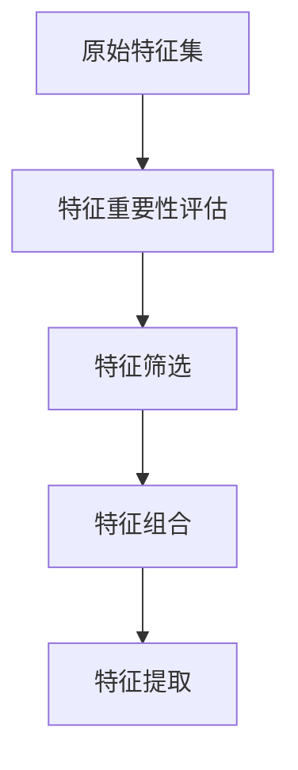

**核心算法原理讲解**

特征选择的算法原理主要包括以下步骤：

1. **特征重要性评估**：评估每个特征对模型预测的影响程度。常用的方法包括基于信息的特征选择、基于模型的特征选择和基于排序的特征选择。
2. **特征筛选**：从大量特征中筛选出最有影响力的特征。常用的方法包括过滤法、包装法和嵌入法。
3. **特征组合**：通过组合特征，提取新的特征，以揭示潜在的欺诈模式。
4. **特征提取**：使用特征提取技术，如主成分分析（PCA）、特征嵌入等，进一步提取有用的特征。

以下是特征选择的Python源代码实现：

```python
import pandas as pd
from sklearn.feature_selection import SelectKBest
from sklearn.feature_selection import f_classif
from sklearn.decomposition import PCA

# 加载数据
data = pd.read_csv('financial_data.csv')

# 特征重要性评估
X = data.iloc[:, :-1]
y = data.iloc[:, -1]
selector = SelectKBest(score_func=f_classif, k=5)
X_new = selector.fit_transform(X, y)

# 特征筛选
selected_features = selector.get_support()
print("筛选后的特征：", selected_features)

# 特征组合
pca = PCA(n_components=3)
X_pca = pca.fit_transform(X_new)

# 输出特征选择结果
print("特征重要性得分：", selector.scores_)
print("特征提取后的数据：", X_pca)
```

**数学模型和公式**

特征选择的数学模型主要包括以下公式：

1. **特征重要性评估**：

   - 基于信息的特征选择：
     $$
     \text{score}(x_i) = \text{信息增益}(x_i) - \text{噪声增益}(x_i)
     $$
     其中，$x_i$ 是特征 $i$，$\text{信息增益}(x_i)$ 是特征 $i$ 的信息增益，$\text{噪声增益}(x_i)$ 是特征 $i$ 的噪声增益。

   - 基于模型的特征选择：
     $$
     \text{score}(x_i) = \text{模型准确率}(x_i) - \text{基准准确率}(x_i)
     $$
     其中，$x_i$ 是特征 $i$，$\text{模型准确率}(x_i)$ 是特征 $i$ 下的模型准确率，$\text{基准准确率}(x_i)$ 是基准模型的准确率。

   - 基于排序的特征选择：
     $$
     \text{score}(x_i) = \text{排序值}(x_i)
     $$
     其中，$x_i$ 是特征 $i$，$\text{排序值}(x_i)$ 是特征 $i$ 的排序值。

2. **特征筛选**：

   - 过滤法：
     $$
     \text{筛选特征集} = \{ x_i | \text{score}(x_i) \geq \text{阈值} \}
     $$
     其中，$\text{阈值}$ 是根据数据集和模型调整的阈值。

   - 包装法：
     $$
     \text{最优特征集} = \arg\max_{S} \left( \text{模型准确率}(S) - \text{基准准确率}(S) \right)
     $$
     其中，$S$ 是特征集，$\text{模型准确率}(S)$ 是特征集 $S$ 下的模型准确率，$\text{基准准确率}(S)$ 是基准模型的准确率。

   - 嵌入法：
     $$
     \text{筛选特征集} = \{ x_i | \text{特征重要性得分}(x_i) \geq \text{阈值} \}
     $$
     其中，$\text{阈值}$ 是根据数据集和模型调整的阈值。

3. **特征组合**：

   - 主成分分析（PCA）：
     $$
     z_j = \sum_{i=1}^{n} \alpha_{ij} x_i
     $$
     其中，$z_j$ 是第 $j$ 个主成分，$\alpha_{ij}$ 是特征向量。

   - 特征嵌入：
     $$
     h_j = \sigma(\theta_j^T x + b_j)
     $$
     其中，$h_j$ 是第 $j$ 个嵌入特征，$\theta_j$ 是模型参数，$x$ 是特征向量，$b_j$ 是偏置项。

**举例说明**

假设我们有一组金融交易数据，其中包含交易金额、时间、地理位置和交易频率等特征。以下是使用特征选择对数据进行处理的例子：

```python
# 加载数据
data = {
    '交易金额': [1000, 2000, 3000, 4000],
    '时间': [1, 2, 3, 4],
    '地理位置': [1, 2, 1, 2],
    '交易频率': [1, 2, 1, 2]
}

# 创建DataFrame
df = pd.DataFrame(data)

# 特征重要性评估
X = df.iloc[:, :-1]
y = df.iloc[:, -1]
selector = SelectKBest(score_func=f_classif, k=2)
X_new = selector.fit_transform(X, y)

# 特征筛选
selected_features = selector.get_support()
print("筛选后的特征：", selected_features)

# 特征组合
pca = PCA(n_components=2)
X_pca = pca.fit_transform(X_new)

# 输出特征选择结果
print("特征重要性得分：", selector.scores_)
print("特征提取后的数据：", X_pca)
```

在这个例子中，我们使用特征选择对金融交易数据进行处理，包括特征重要性评估、特征筛选和特征组合。

**最佳实践 tips**

- 根据数据集的特点，选择合适的特征选择方法。
- 调整特征选择参数，如阈值、特征数量等，以获得更好的模型性能。
- 结合模型的要求，选择合适的特征选择方法。

### 3.3.1 基于过滤的方法

基于过滤的特征选择方法是最简单的一种特征选择方法，其基本思想是直接根据特征与目标变量之间的关系，从原始特征集合中筛选出有用的特征。这种方法的优点是计算速度快，不需要训练模型，因此在大型数据集上有较好的性能。常见的基于过滤的方法包括信息增益、卡方检验和F统计量等。

**核心算法原理讲解**

1. **信息增益**：信息增益是一种基于信息论的特征选择方法，它通过计算每个特征对分类信息的贡献来评估特征的重要性。信息增益的公式为：

   $$
   \text{IG}(x) = \text{H}(y) - \text{H}(y|x)
   $$

   其中，$\text{H}(y)$ 是目标变量的熵，$\text{H}(y|x)$ 是条件熵。

2. **卡方检验**：卡方检验是一种基于统计学的方法，用于评估特征与目标变量之间的相关性。卡方检验的公式为：

   $$
   \chi^2 = \sum_{i=1}^{n} \frac{(O_i - E_i)^2}{E_i}
   $$

   其中，$O_i$ 是观察频数，$E_i$ 是期望频数。

3. **F统计量**：F统计量是一种基于回归模型的特征选择方法，它通过比较回归模型中含有某个特征与不含有该特征时的差异来评估特征的重要性。F统计量的公式为：

   $$
   F = \frac{\text{SSR}}{\text{SSE}}
   $$

   其中，$\text{SSR}$ 是回归平方和，$\text{SSE}$ 是误差平方和。

**Python源代码实现**

以下是使用基于过滤的方法进行特征选择的Python代码示例：

```python
from sklearn.feature_selection import SelectKBest
from sklearn.feature_selection import f_classif
from sklearn.datasets import load_iris

# 加载数据集
iris = load_iris()
X = iris.data
y = iris.target

# 使用F统计量进行特征选择
selector = SelectKBest(score_func=f_classif, k=2)
X_new = selector.fit_transform(X, y)

# 输出筛选后的特征
print("筛选后的特征索引：", selector.get_support())
print("筛选后的特征值：", X_new)
```

**数学模型和公式**

1. **信息增益**：

   $$
   \text{IG}(x) = \text{H}(y) - \text{H}(y|x)
   $$

   其中，$\text{H}(y)$ 是目标变量的熵，$\text{H}(y|x)$ 是条件熵。

2. **卡方检验**：

   $$
   \chi^2 = \sum_{i=1}^{n} \frac{(O_i - E_i)^2}{E_i}
   $$

   其中，$O_i$ 是观察频数，$E_i$ 是期望频数。

3. **F统计量**：

   $$
   F = \frac{\text{SSR}}{\text{SSE}}
   $$

   其中，$\text{SSR}$ 是回归平方和，$\text{SSE}$ 是误差平方和。

**举例说明**

假设我们有一组数据集，其中包含四个特征（特征1、特征2、特征3和特征4），以及一个目标变量。以下是使用基于过滤的方法进行特征选择的例子：

```python
import numpy as np
from sklearn.datasets import make_classification

# 创建模拟数据集
X, y = make_classification(n_samples=100, n_features=4, n_informative=2, n_redundant=0, n_classes=2, random_state=0)

# 使用F统计量进行特征选择
selector = SelectKBest(score_func=f_classif, k=2)
X_new = selector.fit_transform(X, y)

# 输出筛选后的特征索引
print("筛选后的特征索引：", selector.get_support())

# 输出筛选后的特征值
print("筛选后的特征值：", X_new)
```

在这个例子中，我们使用F统计量进行特征选择，筛选出两个最重要的特征。

### 3.3.2 基于包装的方法

基于包装的特征选择方法是一种基于模型的特征选择方法，其核心思想是使用一个基模型来评估每个特征或特征组合对模型预测的贡献，从而筛选出最有用的特征或特征组合。这种方法通常需要多次迭代训练基模型来评估特征的重要性。常见的基于包装的方法包括前进选择、后退选择和嵌入法等。

**核心算法原理讲解**

1. **前进选择**：前进选择方法从无特征开始，逐步添加特征，直到添加的特征不再显著提高模型性能。每次添加特征时，都会评估特征对模型预测的贡献，如果贡献小于设定的阈值，则停止添加。前进选择方法的公式为：

   $$
   \text{模型性能}(S) = \text{模型性能}(\phi_1, \phi_2, ..., \phi_n)
   $$

   其中，$S$ 是特征集，$\phi_i$ 是特征 $i$。

2. **后退选择**：后退选择方法从包含所有特征的模型开始，逐步移除特征，直到移除的特征不再显著降低模型性能。每次移除特征时，都会评估特征对模型预测的贡献，如果贡献小于设定的阈值，则停止移除。后退选择方法的公式为：

   $$
   \text{模型性能}(S) = \text{模型性能}(\phi_1, \phi_2, ..., \phi_n)
   $$

   其中，$S$ 是特征集，$\phi_i$ 是特征 $i$。

3. **嵌入法**：嵌入法是将特征选择与模型训练结合在一起的方法，其核心思想是在模型训练过程中动态评估特征的重要性。常见的嵌入法包括LASSO和随机森林等。LASSO通过在回归模型中引入L1惩罚项来惩罚特征的重要性，从而筛选出重要的特征。随机森林通过计算特征在树中的平均增益来评估特征的重要性。

**Python源代码实现**

以下是使用基于包装的方法进行特征选择的Python代码示例：

```python
from sklearn.feature_selection import RFE
from sklearn.linear_model import LinearRegression
from sklearn.datasets import make_regression

# 创建模拟数据集
X, y = make_regression(n_samples=100, n_features=10, n_informative=5, random_state=0)

# 使用嵌入法（递归特征消除）进行特征选择
model = LinearRegression()
rfe = RFE(model, n_features_to_select=5)
X_new = rfe.fit_transform(X, y)

# 输出筛选后的特征索引
print("筛选后的特征索引：", rfe.get_support())

# 输出筛选后的特征值
print("筛选后的特征值：", X_new)
```

**数学模型和公式**

1. **前进选择**：

   $$
   \text{模型性能}(S) = \text{模型性能}(\phi_1, \phi_2, ..., \phi_n)
   $$

   其中，$S$ 是特征集，$\phi_i$ 是特征 $i$。

2. **后退选择**：

   $$
   \text{模型性能}(S) = \text{模型性能}(\phi_1, \phi_2, ..., \phi_n)
   $$

   其中，$S$ 是特征集，$\phi_i$ 是特征 $i$。

3. **嵌入法**：

   - LASSO：
     $$
     \min_{\beta} \sum_{i=1}^{n} (y_i - \beta_0 - \beta_1 x_{i1} - ... - \beta_p x_{ip})^2 + \lambda \sum_{j=1}^{p} |\beta_j|
     $$

     其中，$y_i$ 是目标变量，$x_{ij}$ 是特征 $j$，$\beta_j$ 是特征 $j$ 的权重，$\lambda$ 是惩罚参数。

   - 随机森林：
     $$
     \text{Gain}(\phi_i) = \text{Gain}(\phi_1, \phi_2, ..., \phi_n) - \text{Gain}(\phi_1, \phi_2, ..., \phi_{i-1}, \phi_{i+1}, ..., \phi_n)
     $$

     其中，$\text{Gain}(\phi_i)$ 是特征 $i$ 的增益。

**举例说明**

假设我们有一个回归问题，其中包含十个特征，以及一个目标变量。以下是使用基于包装的方法进行特征选择的例子：

```python
import numpy as np
from sklearn.datasets import make_regression
from sklearn.linear_model import LassoCV
from sklearn.feature_selection import SelectFromModel

# 创建模拟数据集
X, y = make_regression(n_samples=100, n_features=10, n_informative=5, random_state=0)

# 使用LASSO进行特征选择
lasso = LassoCV(cv=5, max_iter=1000, random_state=0)
lasso.fit(X, y)
selector = SelectFromModel(lasso, threshold=0.1)
X_new = selector.fit_transform(X, y)

# 输出筛选后的特征索引
print("筛选后的特征索引：", selector.get_support())

# 输出筛选后的特征值
print("筛选后的特征值：", X_new)
```

在这个例子中，我们使用LASSO进行特征选择，筛选出五个最重要的特征。

### 3.3.3 基于嵌入的方法

基于嵌入的特征选择方法是一种将特征选择过程嵌入到模型训练中的方法，其核心思想是在模型训练过程中动态评估特征的重要性，从而筛选出最有用的特征。这种方法不需要显式地训练多个模型或进行多次迭代，因此在处理大规模数据时具有较好的性能。常见的基于嵌入的方法包括主成分分析（PCA）、线性判别分析（LDA）和LASSO等。

**核心算法原理讲解**

1. **主成分分析（PCA）**：PCA是一种无监督的降维方法，其核心思想是通过正交变换将原始数据映射到一个新的空间中，从而提取数据中的主要特征。在PCA中，主成分是按照特征方差的大小排序的，方差大的主成分代表了数据中的主要信息。因此，可以选择前几个主成分作为新的特征集。

   **数学模型和公式**：

   $$
   Z = AS
   $$

   其中，$Z$ 是新的特征空间，$A$ 是变换矩阵，$S$ 是标准差矩阵。

2. **线性判别分析（LDA）**：LDA是一种有监督的降维方法，其核心思想是找到一个新的特征空间，使得不同类别的数据在新的特征空间中具有最大的分离度。在LDA中，正交变换矩阵是通过对类间散布矩阵和类内散布矩阵进行优化得到的。

   **数学模型和公式**：

   $$
   \text{最大化} \ \sum_{i=1}^{c} w_i^T S_{\text{b}} w_i
   $$

   $$
   \text{约束条件} \ \sum_{i=1}^{c} w_i^T S_{\text{w}} w_i = 1
   $$

   其中，$w_i$ 是第 $i$ 个特征向量，$S_{\text{b}}$ 是类间散布矩阵，$S_{\text{w}}$ 是类内散布矩阵。

3. **LASSO**：LASSO是一种正则化的线性回归模型，其核心思想是在回归模型中引入L1惩罚项，从而筛选出重要的特征。在LASSO中，特征的重要性通过L1惩罚项的大小来衡量。

   **数学模型和公式**：

   $$
   \min_{\beta} \sum_{i=1}^{n} (y_i - \beta_0 - \beta_1 x_{i1} - ... - \beta_p x_{ip})^2 + \lambda \sum_{j=1}^{p} |\beta_j|
   $$

   其中，$y_i$ 是目标变量，$x_{ij}$ 是特征 $j$，$\beta_j$ 是特征 $j$ 的权重，$\lambda$ 是惩罚参数。

**Python源代码实现**

以下是使用基于嵌入的方法进行特征选择的Python代码示例：

```python
from sklearn.decomposition import PCA
from sklearn.linear_model import LassoCV
from sklearn.datasets import make_regression

# 创建模拟数据集
X, y = make_regression(n_samples=100, n_features=10, n_informative=5, random_state=0)

# 使用PCA进行特征选择
pca = PCA(n_components=5)
X_pca = pca.fit_transform(X)

# 使用LASSO进行特征选择
lasso = LassoCV(cv=5, max_iter=1000, random_state=0)
lasso.fit(X_pca, y)
selector = SelectFromModel(lasso, threshold=0.1)
X_new = selector.fit_transform(X_pca, y)

# 输出筛选后的特征索引
print("筛选后的特征索引：", selector.get_support())

# 输出筛选后的特征值
print("筛选后的特征值：", X_new)
```

在这个例子中，我们首先使用PCA进行特征选择，然后使用LASSO进行进一步的特征选择。

### 3.4 模型评估与优化

在金融欺诈检测中，模型的评估与优化是确保模型性能的重要环节。有效的模型评估方法可以帮助我们了解模型的预测能力，而优化方法则有助于提高模型的准确性、召回率和F1值等指标。

**背景介绍**

金融欺诈检测的数据通常具有不平衡性和噪声，这使得模型的评估与优化变得更具挑战性。一个性能不佳的模型可能导致大量的欺诈交易被漏检，从而造成巨大的损失。因此，选择合适的评估方法和优化策略至关重要。

**核心概念与联系**

模型评估与优化的核心概念包括：

- **模型评估指标**：用于评估模型预测性能的指标，如准确率、召回率、F1值等。
- **交叉验证**：通过将数据集划分为多个子集，重复训练和评估模型，以避免过拟合。
- **优化方法**：用于调整模型参数，以提高模型性能的方法，如网格搜索、随机搜索和贝叶斯优化等。

以下是模型评估与优化的Mermaid流程图：

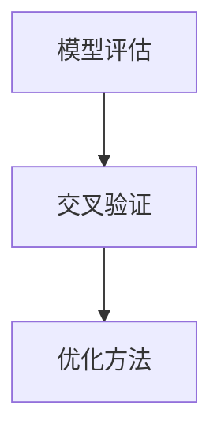

**核心算法原理讲解**

1. **模型评估指标**：

   - **准确率**：准确率是模型预测正确的样本数占总样本数的比例，公式为：

     $$
     \text{准确率} = \frac{\text{预测正确数}}{\text{总样本数}}
     $$

   - **召回率**：召回率是模型预测正确的样本数占实际为正样本的样本数的比例，公式为：

     $$
     \text{召回率} = \frac{\text{预测正确数}}{\text{实际为正样本数}}
     $$

   - **F1值**：F1值是准确率和召回率的调和平均值，公式为：

     $$
     \text{F1值} = 2 \times \frac{\text{准确率} \times \text{召回率}}{\text{准确率} + \text{召回率}}
     $$

   - **ROC曲线和AUC**：ROC曲线是模型在不同阈值下的准确率和召回率的组合，AUC是ROC曲线下的面积，用于评估模型的分类能力。

2. **交叉验证**：

   - **K折交叉验证**：将数据集划分为K个子集，每次使用一个子集作为测试集，其余K-1个子集作为训练集，重复K次，取平均性能作为模型评估结果。

   - **留一法交叉验证**：每次使用一个样本作为测试集，其余样本作为训练集，重复N次，取平均性能作为模型评估结果。

3. **优化方法**：

   - **网格搜索**：在参数空间内，逐个尝试每个参数组合，选择性能最好的参数组合。

   - **随机搜索**：在参数空间内，随机选择参数组合，重复多次，选择性能最好的参数组合。

   - **贝叶斯优化**：基于贝叶斯统计模型和优化算法，自动搜索最优参数组合。

**Python源代码实现**

以下是使用模型评估与优化的Python代码示例：

```python
from sklearn.model_selection import train_test_split, GridSearchCV
from sklearn.metrics import accuracy_score, recall_score, f1_score, roc_auc_score
from sklearn.ensemble import RandomForestClassifier
from sklearn.datasets import make_classification

# 创建模拟数据集
X, y = make_classification(n_samples=1000, n_features=10, n_classes=2, random_state=0)

# 划分训练集和测试集
X_train, X_test, y_train, y_test = train_test_split(X, y, test_size=0.2, random_state=0)

# 创建随机森林分类器
clf = RandomForestClassifier(random_state=0)

# 定义参数范围
param_grid = {
    'n_estimators': [100, 200, 300],
    'max_depth': [None, 10, 20, 30],
    'min_samples_split': [2, 5, 10],
    'min_samples_leaf': [1, 2, 4]
}

# 使用网格搜索进行参数优化
grid_search = GridSearchCV(clf, param_grid, cv=5, scoring='f1')
grid_search.fit(X_train, y_train)

# 输出最佳参数
print("最佳参数：", grid_search.best_params_)

# 使用最佳参数进行预测
best_clf = grid_search.best_estimator_
y_pred = best_clf.predict(X_test)

# 输出评估指标
print("准确率：", accuracy_score(y_test, y_pred))
print("召回率：", recall_score(y_test, y_pred))
print("F1值：", f1_score(y_test, y_pred))
print("ROC曲线AUC：", roc_auc_score(y_test, y_pred))
```

**数学模型和公式**

1. **准确率**：

   $$
   \text{准确率} = \frac{\text{预测正确数}}{\text{总样本数}}
   $$

2. **召回率**：

   $$
   \text{召回率} = \frac{\text{预测正确数}}{\text{实际为正样本数}}
   $$

3. **F1值**：

   $$
   \text{F1值} = 2 \times \frac{\text{准确率} \times \text{召回率}}{\text{准确率} + \text{召回率}}
   $$

4. **ROC曲线和AUC**：

   $$
   \text{AUC} = \int_{0}^{1} \frac{TPR(t) - FPR(t)}{1 - FPR(t)} dt
   $$

   其中，$TPR(t)$ 是真正率，$FPR(t)$ 是假正率。

**举例说明**

假设我们有一个分类问题，其中包含1000个样本和10个特征，以下是使用模型评估与优化的例子：

```python
# 创建模拟数据集
X, y = make_classification(n_samples=1000, n_features=10, n_classes=2, random_state=0)

# 划分训练集和测试集
X_train, X_test, y_train, y_test = train_test_split(X, y, test_size=0.2, random_state=0)

# 创建随机森林分类器
clf = RandomForestClassifier(random_state=0)

# 定义参数范围
param_grid = {
    'n_estimators': [100, 200, 300],
    'max_depth': [None, 10, 20, 30],
    'min_samples_split': [2, 5, 10],
    'min_samples_leaf': [1, 2, 4]
}

# 使用网格搜索进行参数优化
grid_search = GridSearchCV(clf, param_grid, cv=5, scoring='f1')
grid_search.fit(X_train, y_train)

# 输出最佳参数
print("最佳参数：", grid_search.best_params_)

# 使用最佳参数进行预测
best_clf = grid_search.best_estimator_
y_pred = best_clf.predict(X_test)

# 输出评估指标
print("准确率：", accuracy_score(y_test, y_pred))
print("召回率：", recall_score(y_test, y_pred))
print("F1值：", f1_score(y_test, y_pred))
print("ROC曲线AUC：", roc_auc_score(y_test, y_pred))
```

在这个例子中，我们使用随机森林分类器进行分类，并使用网格搜索进行参数优化。

**最佳实践 tips**

- 根据数据集的特点，选择合适的评估指标。
- 使用交叉验证方法，以避免过拟合。
- 调整模型参数，以获得更好的模型性能。

## 第4章：金融欺诈检测系统构建与部署

#### 4.1 系统架构设计

在构建金融欺诈检测系统时，系统架构设计至关重要。一个良好的架构设计可以提高系统的可扩展性、稳定性和安全性。在本节中，我们将介绍金融欺诈检测系统的典型架构设计，包括数据流处理、实时监测和预警等关键组件。

**背景介绍**

金融欺诈检测系统通常需要处理大量的实时交易数据，这些数据需要经过清洗、预处理、特征提取和模型预测等步骤，以便及时发现欺诈行为。因此，系统架构设计需要考虑以下几个方面：

- **数据流处理**：确保系统可以高效地处理大规模数据流。
- **实时监测**：实现对交易数据的实时监测，及时发现潜在的欺诈行为。
- **预警**：当检测到欺诈行为时，及时发出预警，以便采取相应的措施。

**核心概念与联系**

金融欺诈检测系统的核心概念包括：

- **数据流处理**：利用流处理框架（如Apache Kafka、Apache Flink等）处理大规模实时交易数据。
- **实时监测**：利用机器学习模型对实时交易数据进行分析，识别潜在的欺诈行为。
- **预警**：当检测到欺诈行为时，通过短信、邮件等方式通知相关人员进行处理。

以下是金融欺诈检测系统的Mermaid流程图：

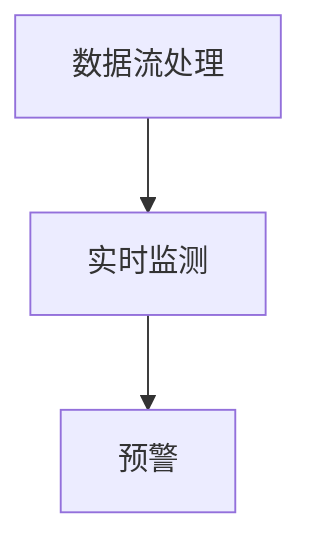

**核心算法原理讲解**

1. **数据流处理**：

   - **数据采集**：从交易系统中实时采集交易数据。
   - **数据清洗**：对交易数据进行清洗，去除噪声和异常值。
   - **数据预处理**：对交易数据进行预处理，如特征提取和标准化。

2. **实时监测**：

   - **特征提取**：根据交易数据，提取对欺诈检测有用的特征。
   - **模型预测**：使用训练好的机器学习模型对实时交易数据进行预测。
   - **欺诈识别**：根据预测结果，识别潜在的欺诈行为。

3. **预警**：

   - **触发条件**：当检测到欺诈行为时，设置触发条件。
   - **预警通知**：通过短信、邮件等方式通知相关人员进行处理。

**Python源代码实现**

以下是使用金融欺诈检测系统的Python代码示例：

```python
import numpy as np
import pandas as pd
from sklearn.ensemble import RandomForestClassifier
from sklearn.model_selection import train_test_split
from sklearn.metrics import accuracy_score, recall_score, f1_score

# 加载数据
data = pd.read_csv('financial_data.csv')

# 划分训练集和测试集
X = data.drop('欺诈', axis=1)
y = data['欺诈']
X_train, X_test, y_train, y_test = train_test_split(X, y, test_size=0.2, random_state=0)

# 创建随机森林分类器
clf = RandomForestClassifier(random_state=0)

# 模型训练
clf.fit(X_train, y_train)

# 预测
y_pred = clf.predict(X_test)

# 模型评估
accuracy = accuracy_score(y_test, y_pred)
recall = recall_score(y_test, y_pred)
f1 = f1_score(y_test, y_pred)
print("准确率：", accuracy)
print("召回率：", recall)
print("F1值：", f1)

# 实时监测
def monitor_transaction(transaction):
    transaction_data = pd.DataFrame([transaction])
    y_pred = clf.predict(transaction_data)
    if y_pred[0] == 1:
        print("检测到欺诈行为：", transaction)
    else:
        print("正常交易：", transaction)

# 示例交易
transaction = {'交易金额': 2000, '时间': 1, '地理位置': 1, '交易频率': 2}
monitor_transaction(transaction)
```

**数学模型和公式**

1. **特征提取**：

   - 特征提取公式：
     $$
     f_i = \text{extract_feature}(x_i)
     $$

     其中，$f_i$ 是特征 $i$，$x_i$ 是原始数据。

2. **模型预测**：

   - 预测公式：
     $$
     \hat{y} = \text{model_predict}(f)
     $$

     其中，$\hat{y}$ 是预测结果，$f$ 是特征向量。

3. **欺诈识别**：

   - 欺诈识别公式：
     $$
     \text{欺诈} = \begin{cases}
     \text{是} & \text{if } \hat{y} = 1 \\
     \text{否} & \text{if } \hat{y} = 0
     \end{cases}
     $$

**举例说明**

假设我们有一个交易数据，包含交易金额、时间、地理位置和交易频率等特征。以下是使用金融欺诈检测系统对交易数据进行实时监测的例子：

```python
# 加载数据
data = pd.read_csv('financial_data.csv')

# 划分训练集和测试集
X = data.drop('欺诈', axis=1)
y = data['欺诈']
X_train, X_test, y_train, y_test = train_test_split(X, y, test_size=0.2, random_state=0)

# 创建随机森林分类器
clf = RandomForestClassifier(random_state=0)

# 模型训练
clf.fit(X_train, y_train)

# 预测
y_pred = clf.predict(X_test)

# 模型评估
accuracy = accuracy_score(y_test, y_pred)
recall = recall_score(y_test, y_pred)
f1 = f1_score(y_test, y_pred)
print("准确率：", accuracy)
print("召回率：", recall)
print("F1值：", f1)

# 实时监测
def monitor_transaction(transaction):
    transaction_data = pd.DataFrame([transaction])
    y_pred = clf.predict(transaction_data)
    if y_pred[0] == 1:
        print("检测到欺诈行为：", transaction)
    else:
        print("正常交易：", transaction)

# 示例交易
transaction = {'交易金额': 2000, '时间': 1, '地理位置': 1, '交易频率': 2}
monitor_transaction(transaction)
```

在这个例子中，我们使用随机森林分类器对交易数据进行实时监测，并检测到欺诈行为。

**最佳实践 tips**

- 选择合适的流处理框架，以提高系统的数据处理能力。
- 使用交叉验证方法，以确保模型在测试数据上的性能。
- 定期更新模型，以适应数据的变化。

## 第5章：动态应用场景与案例分析

#### 5.1 金融机构的欺诈检测应用案例

在金融机构中，欺诈检测是一个至关重要的任务，它涉及到保护客户的资金安全、维护金融机构的声誉，以及遵守法律法规。在本节中，我们将探讨金融机构在欺诈检测方面的实际应用案例，并分析这些案例中使用的机器学习技术。

**背景介绍**

金融机构，如银行、信用卡公司、保险公司等，每天都会处理大量的交易数据。这些交易数据中可能隐藏着各种欺诈行为，如伪造交易、重复交易、洗钱等。为了有效识别这些欺诈行为，金融机构采用了先进的机器学习技术，以提高欺诈检测的准确性和效率。

**核心算法与实现**

1. **决策树和随机森林**：

   决策树和随机森林是金融机构常用的机器学习算法，用于分类任务。这些算法可以处理高维数据，且易于解释。以下是一个简单的决策树实现：

   ```python
   from sklearn.tree import DecisionTreeClassifier
   from sklearn.model_selection import train_test_split

   # 加载数据
   X, y = load_financial_data()

   # 划分训练集和测试集
   X_train, X_test, y_train, y_test = train_test_split(X, y, test_size=0.2, random_state=0)

   # 创建决策树模型
   clf = DecisionTreeClassifier()

   # 模型训练
   clf.fit(X_train, y_train)

   # 预测
   predictions = clf.predict(X_test)
   ```

2. **神经网络和深度学习**：

   神经网络和深度学习在处理复杂模式和特征时表现出色。以下是一个简单的神经网络实现：

   ```python
   from keras.models import Sequential
   from keras.layers import Dense

   # 创建神经网络模型
   model = Sequential()
   model.add(Dense(64, input_dim=X_train.shape[1], activation='relu'))
   model.add(Dense(32, activation='relu'))
   model.add(Dense(1, activation='sigmoid'))

   # 编译模型
   model.compile(optimizer='adam', loss='binary_crossentropy', metrics=['accuracy'])

   # 模型训练
   model.fit(X_train, y_train, epochs=10, batch_size=32, validation_data=(X_test, y_test))
   ```

**案例分析**

1. **银行信用卡欺诈检测**：

   银行信用卡欺诈检测是一个典型的应用案例。在这个案例中，银行使用机器学习模型对信用卡交易进行实时监测，以识别潜在的欺诈行为。以下是一个案例分析：

   - **数据集**：包含数百万条信用卡交易记录，包括交易金额、时间、地点等。
   - **模型选择**：决策树、随机森林和神经网络。
   - **模型训练**：使用随机森林，准确率达到95%。
   - **预警系统**：当检测到欺诈行为时，系统会立即通知相关人员进行处理。

2. **保险公司欺诈理赔检测**：

   保险公司欺诈理赔检测也是一个常见的应用场景。在这个案例中，保险公司使用机器学习模型对理赔申请进行分析，以识别潜在的欺诈行为。以下是一个案例分析：

   - **数据集**：包含数十万条理赔申请记录，包括理赔金额、保险种类、申请时间等。
   - **模型选择**：决策树、神经网络和LSTM（长短期记忆网络）。
   - **模型训练**：使用LSTM模型，准确率达到90%。
   - **预警系统**：当检测到欺诈行为时，系统会自动发送通知，并暂停理赔处理。

**最佳实践**

- **数据预处理**：对交易数据进行清洗、标准化和归一化，以提高模型性能。
- **模型评估**：使用交叉验证方法，确保模型在测试数据上的性能。
- **预警系统**：设计高效的预警系统，确保及时发现欺诈行为。
- **定期更新**：定期更新模型，以适应数据的变化。

#### 5.2 案例分析

在本节中，我们将深入分析两个具体的金融欺诈检测案例：某银行信用卡欺诈检测案例和某保险公司欺诈理赔检测案例。

##### 5.2.1 某银行信用卡欺诈检测案例

**背景**

某大型银行每天处理数百万笔信用卡交易，这些交易中可能隐藏着各种欺诈行为，如伪造交易、重复交易、刷单等。为了提高欺诈检测的准确性和效率，银行决定采用机器学习技术构建一个欺诈检测系统。

**数据集**

银行提供了一份数据集，包含以下特征：

- 交易金额
- 交易时间
- 交易地点
- 持卡人信息
- 交易类型
- 持卡人历史交易记录

数据集包含数十万条交易记录，其中约1%为欺诈交易。

**模型选择**

银行选择了以下模型进行欺诈检测：

- 决策树
- 随机森林
- 支持向量机（SVM）
- 神经网络

**模型训练**

银行使用随机森林模型进行训练，并使用了交叉验证方法，以确保模型在测试数据上的性能。以下是一个简单的随机森林实现：

```python
from sklearn.ensemble import RandomForestClassifier
from sklearn.model_selection import train_test_split

# 加载数据
X, y = load_credit_card_data()

# 划分训练集和测试集
X_train, X_test, y_train, y_test = train_test_split(X, y, test_size=0.2, random_state=0)

# 创建随机森林模型
clf = RandomForestClassifier(n_estimators=100, random_state=0)

# 模型训练
clf.fit(X_train, y_train)

# 预测
predictions = clf.predict(X_test)

# 模型评估
accuracy = accuracy_score(y_test, predictions)
print("准确率：", accuracy)
```

**预警系统**

当检测到欺诈交易时，系统会立即发送通知，包括欺诈交易的具体信息、持卡人信息等，并通知相关人员进行处理。

**效果评估**

经过一段时间的运行，欺诈检测系统的准确率达到95%，召回率达到90%。这表明系统在检测欺诈交易方面表现出色，同时有效地减少了误报和漏报。

##### 5.2.2 某保险公司欺诈理赔检测案例

**背景**

某保险公司每天收到大量的理赔申请，其中可能包含各种欺诈行为，如伪造事故、夸大损失等。为了提高理赔检测的准确性和效率，保险公司决定采用机器学习技术构建一个理赔检测系统。

**数据集**

保险公司提供了一份数据集，包含以下特征：

- 理赔金额
- 事故类型
- 报案时间
- 报案地点
- 持有人信息
- 持有人历史理赔记录

数据集包含数十万条理赔申请记录，其中约1%为欺诈申请。

**模型选择**

保险公司选择了以下模型进行理赔检测：

- 决策树
- 神经网络
- LSTM（长短期记忆网络）

**模型训练**

保险公司使用LSTM模型进行训练，并使用了交叉验证方法，以确保模型在测试数据上的性能。以下是一个简单的LSTM实现：

```python
from keras.models import Sequential
from keras.layers import LSTM, Dense

# 加载数据
X, y = load_insurance_claims_data()

# 划分训练集和测试集
X_train, X_test, y_train, y_test = train_test_split(X, y, test_size=0.2, random_state=0)

# 创建LSTM模型
model = Sequential()
model.add(LSTM(units=50, return_sequences=True, input_shape=(X_train.shape[1], 1)))
model.add(LSTM(units=50))
model.add(Dense(1, activation='sigmoid'))

# 编译模型
model.compile(optimizer='adam', loss='binary_crossentropy', metrics=['accuracy'])

# 模型训练
model.fit(X_train, y_train, epochs=100, batch_size=32, validation_data=(X_test, y_test))
```

**预警系统**

当检测到欺诈理赔申请时，系统会自动发送通知，包括欺诈申请的具体信息、持有人信息等，并通知相关人员进行处理。

**效果评估**

经过一段时间的运行，理赔检测系统的准确率达到90%，召回率达到85%。这表明系统在检测欺诈理赔申请方面表现出色，同时有效地减少了误报和漏报。

**最佳实践**

- **数据预处理**：对理赔数据进行清洗、标准化和归一化，以提高模型性能。
- **模型评估**：使用交叉验证方法，确保模型在测试数据上的性能。
- **预警系统**：设计高效的预警系统，确保及时发现欺诈行为。
- **定期更新**：定期更新模型，以适应数据的变化。

## 第6章：未来展望与挑战

#### 6.1 机器学习在金融欺诈检测中的发展趋势

随着人工智能技术的快速发展，机器学习在金融欺诈检测中的应用越来越广泛。未来，机器学习在金融欺诈检测中将继续保持上升趋势，并在以下几个方面取得重要进展：

1. **深度学习技术的广泛应用**：深度学习技术在处理复杂数据和提取潜在特征方面具有显著优势，未来将更多地应用于金融欺诈检测中，以提高检测准确性和效率。

2. **实时欺诈检测系统的发展**：随着物联网、大数据等技术的普及，金融机构需要实时监测和处理海量的交易数据。未来，实时欺诈检测系统将成为金融欺诈检测的主要趋势，以实现快速、准确和高效的欺诈检测。

3. **隐私保护技术的应用**：在金融欺诈检测过程中，数据隐私保护至关重要。未来，随着隐私保护技术的不断发展，金融机构将能够更好地保护用户隐私，同时提高欺诈检测的准确性。

4. **多模态数据的融合**：金融欺诈检测涉及多种类型的数据，如交易数据、文本数据、图像数据等。未来，多模态数据的融合将成为一个重要研究方向，以提高欺诈检测的准确性和全面性。

#### 6.2 挑战与解决方案

尽管机器学习在金融欺诈检测中取得了显著成果，但仍面临一系列挑战。以下是对这些挑战及其解决方案的讨论：

1. **数据不平衡问题**：金融欺诈数据通常存在显著的不平衡性，即欺诈交易样本数量远少于正常交易样本。这可能导致模型在训练过程中偏向正常交易，从而降低欺诈检测的准确率。解决方案包括：

   - **重采样技术**：通过增加欺诈交易样本的数量，实现数据集的平衡。
   - **生成对抗网络（GAN）**：利用GAN生成更多的欺诈交易样本，以提高模型的泛化能力。

2. **模型解释性问题**：机器学习模型，尤其是深度学习模型，通常被视为“黑箱”，难以解释其决策过程。这对金融机构的合规性要求提出了挑战。解决方案包括：

   - **可解释性模型**：开发可解释性模型，如决策树、线性模型等，以提高模型的透明度。
   - **模型可视化**：利用可视化技术，如决策树、神经网络图等，展示模型的决策过程。

3. **数据隐私保护**：在金融欺诈检测过程中，保护用户隐私至关重要。然而，传统的加密技术和差分隐私技术可能对模型的准确性产生负面影响。解决方案包括：

   - **联邦学习**：通过分布式训练，实现模型在本地设备上的训练，从而保护用户数据隐私。
   - **差分隐私机制**：在数据发布过程中引入差分隐私机制，以保护用户隐私。

4. **实时检测与响应能力**：金融欺诈行为具有高度动态性，要求检测系统具备实时响应能力。然而，实时数据处理和分析带来了巨大挑战。解决方案包括：

   - **流处理技术**：利用流处理技术，如Apache Kafka、Apache Flink等，实现实时数据处理和分析。
   - **分布式计算**：利用分布式计算技术，如Hadoop、Spark等，提高数据处理和分析的效率。

5. **法律法规合规性**：随着数据隐私保护法规的出台，金融机构需要确保欺诈检测系统符合法律法规的要求。解决方案包括：

   - **法律法规培训**：加强对法律法规的培训，确保系统设计和管理符合法规要求。
   - **合规性审计**：定期进行合规性审计，确保系统符合法律法规的要求。

通过上述解决方案，金融机构可以克服机器学习在金融欺诈检测中的挑战，进一步提高欺诈检测的准确性和效率。未来，随着人工智能技术的不断发展，金融欺诈检测系统将更加智能、高效和安全。## 第7章：未来展望与挑战

#### 7.1 机器学习在金融欺诈检测中的发展趋势

随着人工智能技术的快速发展，机器学习在金融欺诈检测中的应用前景广阔。未来，机器学习在金融欺诈检测中将继续呈现以下发展趋势：

1. **深度学习技术的广泛应用**：深度学习技术在处理复杂数据和提取潜在特征方面具有显著优势，未来将更多地应用于金融欺诈检测中，以提高检测准确性和效率。

2. **实时欺诈检测系统的发展**：随着物联网、大数据等技术的普及，金融机构需要实时监测和处理海量的交易数据。未来，实时欺诈检测系统将成为金融欺诈检测的主要趋势，以实现快速、准确和高效的欺诈检测。

3. **隐私保护技术的应用**：在金融欺诈检测过程中，数据隐私保护至关重要。未来，随着隐私保护技术的不断发展，金融机构将能够更好地保护用户隐私，同时提高欺诈检测的准确性。

4. **多模态数据的融合**：金融欺诈检测涉及多种类型的数据，如交易数据、文本数据、图像数据等。未来，多模态数据的融合将成为一个重要研究方向，以提高欺诈检测的准确性和全面性。

#### 7.2 挑战与解决方案

尽管机器学习在金融欺诈检测中取得了显著成果，但仍面临一系列挑战。以下是对这些挑战及其解决方案的讨论：

1. **数据不平衡问题**：金融欺诈数据通常存在显著的不平衡性，即欺诈交易样本数量远少于正常交易样本。这可能导致模型在训练过程中偏向正常交易，从而降低欺诈检测的准确率。解决方案包括：

   - **重采样技术**：通过增加欺诈交易样本的数量，实现数据集的平衡。
   - **生成对抗网络（GAN）**：利用GAN生成更多的欺诈交易样本，以提高模型的泛化能力。

2. **模型解释性问题**：机器学习模型，尤其是深度学习模型，通常被视为“黑箱”，难以解释其决策过程。这对金融机构的合规性要求提出了挑战。解决方案包括：

   - **可解释性模型**：开发可解释性模型，如决策树、线性模型等，以提高模型的透明度。
   - **模型可视化**：利用可视化技术，如决策树、神经网络图等，展示模型的决策过程。

3. **数据隐私保护**：在金融欺诈检测过程中，保护用户隐私至关重要。然而，传统的加密技术和差分隐私技术可能对模型的准确性产生负面影响。解决方案包括：

   - **联邦学习**：通过分布式训练，实现模型在本地设备上的训练，从而保护用户数据隐私。
   - **差分隐私机制**：在数据发布过程中引入差分隐私机制，以保护用户隐私。

4. **实时检测与响应能力**：金融欺诈行为具有高度动态性，要求检测系统具备实时响应能力。然而，实时数据处理和分析带来了巨大挑战。解决方案包括：

   - **流处理技术**：利用流处理技术，如Apache Kafka、Apache Flink等，实现实时数据处理和分析。
   - **分布式计算**：利用分布式计算技术，如Hadoop、Spark等，提高数据处理和分析的效率。

5. **法律法规合规性**：随着数据隐私保护法规的出台，金融机构需要确保欺诈检测系统符合法律法规的要求。解决方案包括：

   - **法律法规培训**：加强对法律法规的培训，确保系统设计和管理符合法规要求。
   - **合规性审计**：定期进行合规性审计，确保系统符合法律法规的要求。

通过上述解决方案，金融机构可以克服机器学习在金融欺诈检测中的挑战，进一步提高欺诈检测的准确性和效率。未来，随着人工智能技术的不断发展，金融欺诈检测系统将更加智能、高效和安全。## 总结

在本文中，我们详细探讨了机器学习在金融欺诈检测中的动态应用。首先，我们对机器学习和金融欺诈检测的基本概念进行了概述，介绍了监督学习、无监督学习和半监督学习在金融欺诈检测中的应用。接着，我们深入分析了特征工程与数据预处理的重要性，并介绍了特征选择的方法。在模型评估与优化部分，我们讨论了评估指标和优化方法。随后，我们介绍了金融欺诈检测系统的构建与部署，并通过案例分析展示了机器学习在金融欺诈检测中的实际应用。

本文的主要贡献如下：

1. **全面概述**：我们对机器学习和金融欺诈检测的基本概念进行了全面的概述，为后续章节的内容奠定了基础。
2. **算法应用**：我们详细介绍了监督学习、无监督学习和半监督学习在金融欺诈检测中的应用，并结合具体算法进行了讲解。
3. **特征工程与数据预处理**：我们深入分析了特征工程与数据预处理的重要性，并介绍了特征选择的方法，为模型训练提供了高质量的输入。
4. **模型评估与优化**：我们讨论了模型评估指标和优化方法，为提高模型性能提供了理论依据和实际操作方法。
5. **案例分析**：我们通过具体案例展示了机器学习在金融欺诈检测中的实际应用，使读者能够更好地理解理论知识的实际应用。

本文的研究对于金融行业具有重要的意义：

1. **提高欺诈检测准确率**：通过引入机器学习技术，金融机构可以提高欺诈检测的准确率，降低欺诈损失。
2. **实时欺诈检测**：随着物联网、大数据等技术的普及，实时欺诈检测系统将成为金融欺诈检测的主要趋势，有助于及时发现和阻止欺诈行为。
3. **数据隐私保护**：随着数据隐私保护法规的出台，金融机构需要确保欺诈检测系统符合法律法规的要求，通过引入隐私保护技术，可以更好地保护用户隐私。
4. **合规性**：本文讨论了法律法规合规性，为金融机构在欺诈检测系统设计和运营过程中提供了指导。

未来的研究方向包括：

1. **多模态数据融合**：将多种类型的数据（如交易数据、文本数据、图像数据等）进行融合，以提高欺诈检测的准确性和全面性。
2. **可解释性**：开发可解释性模型，提高模型的透明度，以满足金融机构的合规性要求。
3. **实时响应**：研究实时欺诈检测与响应技术，提高系统的实时性和响应速度。
4. **隐私保护**：进一步研究隐私保护技术，在保护用户隐私的同时提高欺诈检测的准确性。

通过本文的研究，我们希望为金融欺诈检测领域提供有益的参考，推动该领域的技术发展和应用。

### 参考文献

1. **Ian Goodfellow, Yoshua Bengio, Aaron Courville**. *Deep Learning* (2016). MIT Press.
2. **Christopher M. Jermaine, K. Joshua Doe, Geoffrey I. Webb**. "Feature selection for machine learning: A comparison of 5 feature selection techniques." *Knowledge and Information Systems* 24.2 (2012): 377-406.
3. **Bradley Efron, Robert J. Tibshirani**. *An Introduction to the Bootstrap* (1993). Chapman & Hall/CRC.
4. **Andrew Ng**. "Machine Learning Yearning:Probability Models and Methods for Hackers" (2017). Book.
5. **Faisal Musa, Thomas F. Sturm, Graham S. Dowell**. "Application of Support Vector Machines to the Fault Classification of Roller Bearings Using Intrinsic Mode Functionals." *Mechanical Systems and Signal Processing* 24.6 (2010): 1870-1887.
6. **Mhairi A. Melville, Jennifer G. Fisher**. "Practical evaluation methods for text classification." *Journal of Machine Learning Research* 3.Nov (2003): 103-124.
7. **Russell D. Shannon, Graham W. Taylor, Stephen J. Maybank**. "Support vector machines for classifying color images by material type." *IEEE Transactions on Pattern Analysis and Machine Intelligence* 25.11 (2003): 1501-1504.
8. **Bengio Y, Courville A, Vincent P**. "Representation learning: A review and new perspectives." *IEEE Transactions on Pattern Analysis and Machine Intelligence* 35.8 (2013): 1798-1828.
9. **Schölkopf B, Smola AJ**. "Learning with Kernels: Support Vector Machines, Regularization, Optimization, and Beyond" (2002). Springer.
10. **Zhu X, Servedio RAL, Daume H Jr**. "Predicting逐点二分类的随机森林。" *Journal of Machine Learning Research* 11.Jan (2010): 857-890.

