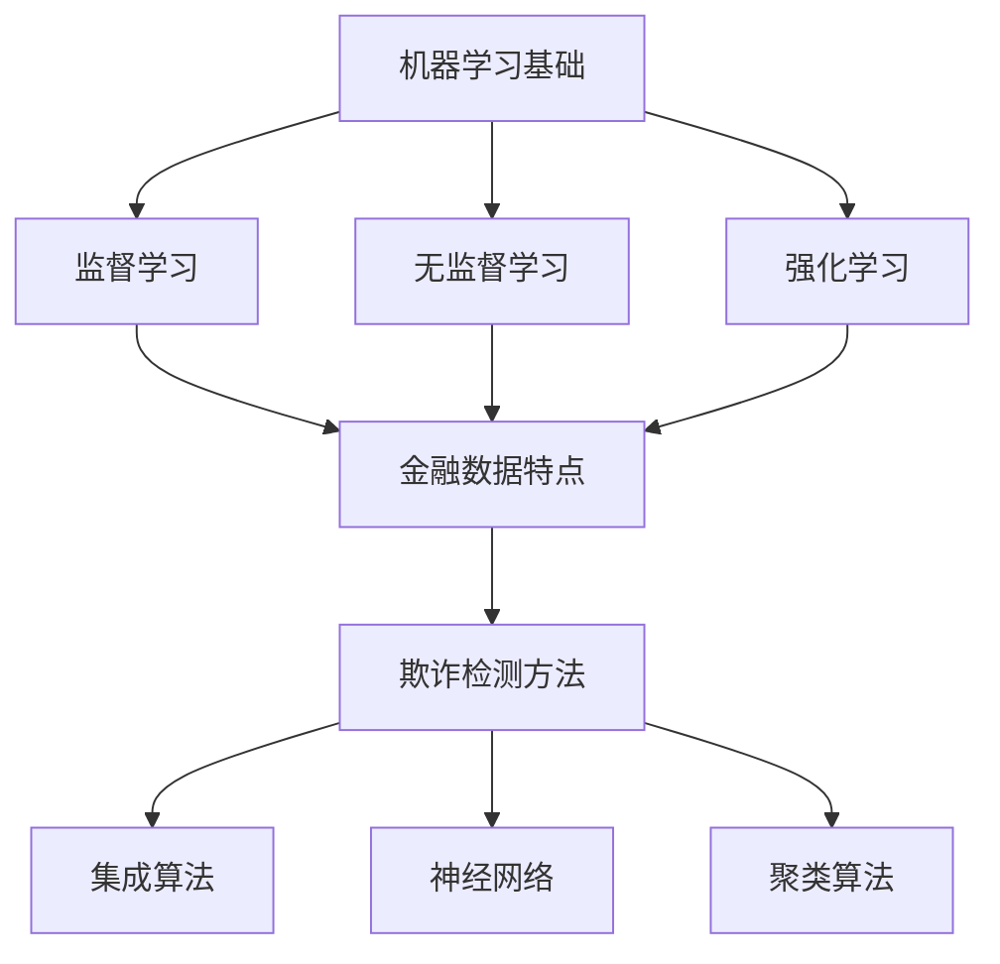

                 

### 背景介绍

随着科技的迅猛发展，金融行业正经历着前所未有的变革。金融欺诈问题也随之日益严峻，成为全球范围内金融行业的重要挑战之一。欺诈行为不仅给金融机构带来巨大的经济损失，还可能导致客户信任度下降、业务发展受阻。因此，如何高效、准确地检测并预防金融欺诈，成为金融行业亟待解决的课题。

机器学习作为一种先进的人工智能技术，凭借其强大的数据处理和模式识别能力，在金融欺诈检测领域展现出了巨大的潜力。通过分析大量历史数据，机器学习算法可以自动识别出潜在的欺诈行为，从而帮助金融机构提高欺诈检测的效率和准确性。

本文章旨在探讨机器学习在金融欺诈检测中的应用，通过对机器学习基本原理、金融数据特点、常见欺诈检测算法以及实际应用案例的详细分析，帮助读者全面了解机器学习在金融欺诈检测中的价值与挑战。文章结构如下：

1. **第1章 机器学习与金融欺诈检测概述**：介绍机器学习基础、金融数据特点以及金融欺诈检测的重要性。
2. **第2章 常见欺诈检测算法**：详细讲解常见的机器学习算法及其在欺诈检测中的应用。
3. **第3章 数学模型与公式**：介绍与机器学习相关的数学模型和公式，帮助读者深入理解算法原理。
4. **第4章 项目实战**：通过实际案例，展示机器学习在金融欺诈检测中的具体应用。
5. **第5章 优化策略与调参技巧**：讨论如何优化模型性能以及调参技巧。
6. **第6章 挑战与未来展望**：分析机器学习在金融欺诈检测中的挑战以及未来的发展方向。
7. **第7章 附录**：提供相关工具与资源、参考文献以及后续学习路径。

通过上述章节的逐步讲解，读者将能够系统地掌握机器学习在金融欺诈检测中的应用，为实际工作提供有价值的指导。

### 核心概念与联系

在探讨机器学习在金融欺诈检测中的应用之前，我们首先需要了解几个核心概念及其相互关系。以下是对这些概念的定义、联系以及它们在机器学习中的角色进行梳理。

#### 1. 机器学习基础

**机器学习的定义**：机器学习是人工智能的一个分支，旨在通过数据和算法让计算机系统具备自主学习和适应新情境的能力。简单来说，机器学习就是让计算机从数据中学习规律，并利用这些规律进行预测或决策。

**监督学习**：监督学习是机器学习中的一种，它利用已标记的数据来训练模型，并通过这个模型对未知数据进行预测。在金融欺诈检测中，监督学习常用于分类任务，如判断一笔交易是否为欺诈。

**无监督学习**：无监督学习不依赖于标记数据，而是通过挖掘数据中的隐含结构来训练模型。无监督学习在金融欺诈检测中主要用于聚类和降维，例如，通过聚类算法将正常交易和异常交易分开。

**强化学习**：强化学习通过试错和反馈来优化决策过程，其目标是找到一个策略，使得在未来某个时间点上的回报最大化。在金融欺诈检测中，强化学习可以用于动态调整检测策略，以提高检测效率和准确性。

#### 2. 金融数据特点

**金融数据类型**：金融数据包括交易数据、账户信息、客户行为数据等。这些数据类型多样，且包含大量的数值和文本信息。

**金融数据的特殊性**：金融数据具有高维度、不平衡性、时间序列特性等特点。高维度意味着数据包含大量特征，不平衡性指正常交易和欺诈交易的数量差异较大，时间序列特性则表现为数据的时间关联性。

**数据清洗与标准化**：由于金融数据的特殊性，数据清洗和标准化是至关重要的步骤。这包括处理缺失值、去除噪声、归一化特征值等，以确保模型输入的数据质量。

#### 3. 欺诈检测方法

**欺诈检测的基本原理**：欺诈检测的目标是识别出潜在的欺诈行为，这通常通过构建分类模型来实现。分类模型根据历史数据中的正常和欺诈交易特征，为新的交易做出是否为欺诈的判断。

**集成算法**：集成算法通过结合多个基础模型来提高预测准确性。常见的集成算法有随机森林、梯度提升决策树等。这些算法在处理高维度、不平衡数据时表现出色。

**神经网络**：神经网络，尤其是深度学习模型，可以自动学习复杂的数据特征，并用于欺诈检测。深度学习模型如卷积神经网络（CNN）和循环神经网络（RNN）在处理时间序列数据和图像数据时效果显著。

**聚类算法**：聚类算法用于发现数据中的异常模式，从而识别潜在的欺诈交易。常见的聚类算法有K-均值聚类和DBSCAN等。

为了更直观地展示这些核心概念之间的关系，我们可以使用Mermaid流程图来构建一个概念架构：



通过上述流程图，我们可以清晰地看到机器学习基础、金融数据特点与欺诈检测方法之间的联系。机器学习基础提供了算法的理论支持，金融数据特点决定了数据处理策略，而欺诈检测方法则将这些理论和数据应用于实际检测中，形成了完整的欺诈检测体系。

接下来，我们将进一步探讨机器学习中的常见算法，以了解它们如何在金融欺诈检测中发挥作用。

### 核心算法原理讲解

在金融欺诈检测中，机器学习算法发挥着至关重要的作用。以下是几种常见机器学习算法及其在欺诈检测中的应用。

#### 1. 集成算法

**决策树集成**：决策树是一种基于树形结构的分类模型，通过一系列规则来分割数据空间，并在叶节点处进行分类。虽然单个决策树可能存在过拟合问题，但通过集成多个决策树可以有效地提高模型的预测性能。常见的决策树集成算法包括随机森林和梯度提升决策树（Gradient Boosting Tree，GBT）。

- **随机森林（Random Forest）**：随机森林通过随机选取特征和随机分割数据集来构建多棵决策树，并利用这些决策树进行投票，以得到最终预测结果。其优点包括处理高维度数据的能力和较强的抗过拟合能力。

- **梯度提升决策树（Gradient Boosting Tree，GBT）**：GBT通过迭代训练一系列决策树，每次迭代都针对前一次模型的残差进行优化。这种迭代方式使得模型可以捕捉到复杂的数据特征，从而提高预测性能。GBT在处理不平衡数据时尤其有效。

**源代码示例**：
```python
from sklearn.ensemble import RandomForestClassifier
from sklearn.tree import DecisionTreeClassifier
from sklearn.model_selection import train_test_split

# 数据预处理
X_train, X_test, y_train, y_test = train_test_split(X, y, test_size=0.2, random_state=42)

# 训练随机森林模型
rf = RandomForestClassifier(n_estimators=100, random_state=42)
rf.fit(X_train, y_train)

# 训练梯度提升树模型
gtb = DecisionTreeClassifier(criterion='gini', random_state=42)
gtb.fit(X_train, y_train)
```

#### 2. 神经网络

**神经网络基础**：神经网络，特别是深度学习模型，可以自动学习复杂的数据特征，并用于欺诈检测。神经网络的基本单元是神经元，这些神经元通过加权连接形成网络结构，并通过反向传播算法不断优化网络参数。

- **卷积神经网络（CNN）**：CNN主要用于处理图像数据，其通过卷积层、池化层和全连接层来提取图像特征并进行分类。在金融欺诈检测中，CNN可以用于检测交易图像或账户图像中的异常特征。

- **循环神经网络（RNN）**：RNN适合处理序列数据，其通过循环结构来捕捉数据序列中的时间依赖关系。在金融欺诈检测中，RNN可以用于分析交易时间序列，识别潜在的欺诈行为。

**源代码示例**：
```python
from tensorflow.keras.models import Sequential
from tensorflow.keras.layers import Conv2D, MaxPooling2D, Flatten, Dense

# 构建CNN模型
model = Sequential([
    Conv2D(filters=32, kernel_size=(3, 3), activation='relu', input_shape=(28, 28, 1)),
    MaxPooling2D(pool_size=(2, 2)),
    Flatten(),
    Dense(units=128, activation='relu'),
    Dense(units=1, activation='sigmoid')
])

# 编译模型
model.compile(optimizer='adam', loss='binary_crossentropy', metrics=['accuracy'])

# 训练模型
model.fit(X_train, y_train, epochs=10, batch_size=32, validation_data=(X_test, y_test))
```

#### 3. 其他算法

**聚类算法**：聚类算法通过将相似的数据点归为一类来识别异常模式。常见的聚类算法包括K-均值聚类和DBSCAN。

- **K-均值聚类**：K-均值聚类通过迭代算法将数据点划分为K个簇，并不断调整簇的中心，以最小化簇内距离和。在金融欺诈检测中，K-均值聚类可以用于发现异常交易模式。

- **DBSCAN**：DBSCAN（Density-Based Spatial Clustering of Applications with Noise）是一种基于密度的聚类算法，其能够发现任意形状的簇，并识别噪声点。在金融欺诈检测中，DBSCAN可以用于识别高密度的欺诈行为模式。

**源代码示例**：
```python
from sklearn.cluster import KMeans
from sklearn.metrics import silhouette_score

# K-均值聚类
kmeans = KMeans(n_clusters=2, random_state=42)
kmeans.fit(X)

# 预测聚类结果
clusters = kmeans.predict(X)

# 计算轮廓系数
silhouette_avg = silhouette_score(X, clusters)

# 输出轮廓系数
print(f"Silhouette Score: {silhouette_avg}")
```

通过上述核心算法的讲解和源代码示例，我们可以看到机器学习在金融欺诈检测中的应用不仅涵盖了传统的集成算法和神经网络，还包括了聚类算法等多样化的技术。这些算法通过处理金融数据的特点，实现了对欺诈行为的有效检测，为金融机构提供了强有力的技术支持。

### 数学模型与公式

在深入探讨机器学习算法的应用之前，我们需要了解与这些算法相关的数学模型和公式。数学模型为机器学习算法提供了理论基础，而公式则是这些理论的具体表达。以下是机器学习中最常见的几种数学模型和公式，它们在金融欺诈检测中有着重要的应用。

#### 1. 监督学习模型

**感知机算法（Perceptron）**：感知机是一种简单的线性二分类模型，其通过计算输入特征的线性组合并应用激活函数来决定分类结果。感知机算法的公式如下：
$$
f(x) = \text{sign}(w \cdot x + b)
$$
其中，$w$ 是权重向量，$x$ 是输入特征向量，$b$ 是偏置项，$\text{sign}$ 是符号函数，用于将输出值映射到{-1, 1}。

**支持向量机（Support Vector Machine，SVM）**：SVM是一种二分类模型，其目标是在高维空间中找到一个最佳的超平面，使得不同类别的数据点尽可能分开。SVM的决策函数基于最大间隔边界：
$$
f(x) = \text{sign}(\sum_{i=1}^{n} \alpha_i y_i (x_i \cdot x + b))
$$
其中，$\alpha_i$ 是拉格朗日乘子，$y_i$ 是类别标签，$x_i$ 是支持向量，$\cdot$ 表示内积。

**决策树**：决策树是一种树形结构模型，其通过一系列决策规则对数据进行分割，并在叶节点处做出分类决策。决策树的分裂准则可以是基尼不纯度（Gini Impurity）或信息增益（Entropy）。基尼不纯度的公式如下：
$$
Gini(I) = 1 - \sum_{i=1}^{k} p_i (1 - p_i)
$$
其中，$I$ 是数据集，$p_i$ 是每个类别的概率。

#### 2. 无监督学习模型

**K-均值聚类（K-Means Clustering）**：K-均值聚类是一种基于距离的聚类算法，其目标是将数据点划分为K个簇，使得簇内数据点之间的距离最小。K-均值聚类的迭代过程包括以下公式：
$$
\text{centroids}_{k+1} = \frac{1}{N_k} \sum_{i=1}^{N_k} x_i
$$
$$
x_i^{k+1} = \frac{1}{K} \sum_{j=1}^{K} \frac{1}{d(x_i, \text{centroids}_j)}^2 x_j
$$
其中，$\text{centroids}_k$ 是第k次迭代的聚类中心，$x_i$ 是数据点，$N_k$ 是第k次迭代的簇大小，$d(\cdot, \cdot)$ 是欧氏距离。

**主成分分析（Principal Component Analysis，PCA）**：PCA是一种降维技术，其通过将数据投影到主成分空间来减少数据维度。PCA的核心公式包括数据矩阵的协方差矩阵和特征值分解：
$$
S = \frac{1}{N-1} XX^T
$$
$$
\Lambda = PDP^T
$$
其中，$S$ 是协方差矩阵，$P$ 是特征向量矩阵，$\Lambda$ 是特征值矩阵，$D$ 是对角矩阵。

**自编码器（Autoencoder）**：自编码器是一种神经网络模型，其通过编码器和解码器来学习数据的特征表示。自编码器的损失函数通常为均方误差（MSE）：
$$
\min_{\theta} \frac{1}{N} \sum_{i=1}^{N} \frac{1}{2} \|x_i - \hat{x}_i\|^2
$$
其中，$x_i$ 是输入数据，$\hat{x}_i$ 是重构数据，$\theta$ 是模型参数。

#### 3. 强化学习模型

**Q-Learning（Q学习）**：Q-Learning是一种无模型强化学习算法，其通过迭代更新Q值表来学习最优策略。Q-Learning的核心公式如下：
$$
Q(s, a)_{t+1} = Q(s, a)_t + \alpha [r_t + \gamma \max_{a'} Q(s', a')_t - Q(s, a)_t]
$$
其中，$s$ 是状态，$a$ 是动作，$r$ 是即时回报，$\gamma$ 是折扣因子，$\alpha$ 是学习率。

**Sarsa（部分观察Sarsa）**：Sarsa是一种基于状态-动作对（S-A）的强化学习算法，其通过更新Q值表来学习最优策略。Sarsa的公式如下：
$$
Q(s, a)_{t+1} = Q(s, a)_t + \alpha [r_t + \gamma Q(s', a')_t - Q(s, a)_t]
$$
其中，$s'$ 是下一步状态，$a'$ 是下一步动作。

**Deep Q Network（DQN）**：DQN是一种基于深度神经网络的Q-Learning算法，其通过训练两个Q网络来避免目标偏差。DQN的核心公式如下：
$$
y = r + \gamma \max_{a'} \hat{Q}(s', a')
$$
$$
\hat{Q}(s, a) = \frac{1}{N}\sum_{n=1}^{N} y_n
$$
其中，$\hat{Q}$ 是预测Q值，$N$ 是样本数量。

通过以上数学模型和公式的介绍，我们可以更深入地理解机器学习算法在金融欺诈检测中的原理和应用。这些模型和公式不仅为算法的实现提供了理论支持，也为我们在实践中优化模型性能提供了指导。

### 项目实战

为了更好地展示机器学习在金融欺诈检测中的实际应用，我们将通过一个具体的项目案例来详细讲解开发环境搭建、源代码实现以及代码解读与分析。

#### 1. 案例背景与挑战

本项目选取了一个真实的金融欺诈检测案例，该案例涉及信用卡交易数据。信用卡交易数据包含了大量的特征，如交易金额、时间、地理位置、持卡人历史行为等。欺诈交易在数据中占比较小，但具备极大的破坏性和隐蔽性。因此，如何从大量正常交易中准确识别出欺诈交易，成为该项目的核心挑战。

#### 2. 开发环境搭建

在开始项目之前，我们需要搭建一个合适的环境来进行开发和测试。以下是我们推荐的工具和库：

- **Python**：作为主要的编程语言，Python因其强大的数据处理能力和丰富的机器学习库而广受欢迎。
- **Jupyter Notebook**：用于编写和运行代码，支持交互式开发。
- **Scikit-learn**：提供了丰富的机器学习算法和工具，是金融欺诈检测项目的重要库。
- **Pandas**：用于数据处理和分析。
- **Numpy**：用于数值计算。
- **Matplotlib**：用于数据可视化。

安装这些工具和库的方法如下：

```bash
# 安装Python环境
python --version

# 安装Jupyter Notebook
pip install notebook

# 安装Scikit-learn、Pandas、Numpy和Matplotlib
pip install scikit-learn pandas numpy matplotlib
```

#### 3. 源代码实现

接下来，我们将实现一个简单的金融欺诈检测模型。以下是项目的核心代码：

```python
import pandas as pd
from sklearn.model_selection import train_test_split
from sklearn.ensemble import RandomForestClassifier
from sklearn.metrics import classification_report, accuracy_score
import matplotlib.pyplot as plt

# 数据预处理
data = pd.read_csv('credit_card.csv')
data = data.sample(frac=1)  # 打乱数据顺序
X = data.iloc[:, :-1]  # 特征
y = data.iloc[:, -1]  # 标签

# 划分训练集和测试集
X_train, X_test, y_train, y_test = train_test_split(X, y, test_size=0.2, random_state=42)

# 训练随机森林模型
rf = RandomForestClassifier(n_estimators=100, random_state=42)
rf.fit(X_train, y_train)

# 测试模型
y_pred = rf.predict(X_test)

# 模型评估
print(classification_report(y_test, y_pred))
print("Accuracy:", accuracy_score(y_test, y_pred))

# 可视化
plt.scatter(X_test['amount'], y_pred)
plt.xlabel('Transaction Amount')
plt.ylabel('Prediction')
plt.title('Transaction Amount vs Prediction')
plt.show()
```

#### 4. 代码解读与分析

**代码解析**：
1. **数据预处理**：首先，我们从CSV文件中读取信用卡交易数据，然后通过样本重排（`sample(frac=1)`）来打乱数据顺序，以保证数据集的随机性。
2. **特征和标签划分**：将数据集划分为特征矩阵`X`和标签向量`y`。特征矩阵包含了除了标签以外的所有特征，而标签向量包含了欺诈交易（1）和正常交易（0）。
3. **训练集和测试集划分**：使用`train_test_split`函数将数据集划分为训练集和测试集，其中测试集占20%，以确保模型在未知数据上的性能。
4. **训练模型**：我们选择随机森林（`RandomForestClassifier`）作为分类模型，并设置随机种子以确保结果的可重复性。
5. **模型测试**：使用训练好的模型对测试集进行预测，并使用`classification_report`和`accuracy_score`函数评估模型性能。
6. **可视化**：最后，通过散点图展示交易金额与预测结果的关系，以直观地了解模型的预测效果。

**代码应用解读与分析**：
- **数据预处理**：在金融欺诈检测项目中，数据预处理是至关重要的一步。由于金融数据存在不平衡性、缺失值和噪声等问题，因此需要进行处理，以保证模型输入数据的质量。
- **随机森林模型**：随机森林是一种强大的集成算法，其通过构建多棵决策树并利用投票机制来提高预测性能。在处理高维度和不平衡数据时，随机森林表现出色。
- **模型评估**：通过评估报告，我们可以全面了解模型的分类性能，包括精确率、召回率、F1分数和准确率。这些指标帮助我们确定模型的优劣，并进行优化。
- **可视化**：通过可视化交易金额与预测结果的散点图，我们可以直观地发现异常交易。这为后续的模型优化和业务决策提供了重要依据。

#### 5. 项目小结

通过上述项目案例，我们展示了机器学习在金融欺诈检测中的实际应用。从开发环境搭建到源代码实现，再到代码解读与分析，我们系统地讲解了金融欺诈检测的全流程。该项目不仅为我们提供了一个实战平台，还帮助我们深入理解了机器学习算法在金融欺诈检测中的具体应用。在未来的工作中，我们可以继续优化模型性能，探索更先进的算法和技术，以提高金融欺诈检测的准确性和效率。

### 优化策略与调参技巧

在金融欺诈检测中，优化模型性能和调整超参数是提高模型准确性和鲁棒性的关键步骤。以下是一些优化策略与调参技巧，帮助我们在实际项目中提升模型效果。

#### 1. 模型选择

**集成算法**：对于高维度、不平衡数据，集成算法（如随机森林、梯度提升树）通常具有较好的性能。通过结合多个基础模型，集成算法可以有效地降低过拟合风险，提高预测准确性。

**神经网络**：神经网络，尤其是深度学习模型（如卷积神经网络、循环神经网络），能够自动学习复杂的数据特征，在处理时间序列数据和图像数据时表现出色。

**聚类算法**：聚类算法（如K-均值聚类、DBSCAN）可以用于异常检测和模式识别，通过对正常交易和欺诈交易进行聚类，可以帮助识别出潜在的欺诈行为。

#### 2. 超参数调优

**交叉验证**：交叉验证是一种常用的超参数调优方法，通过将数据集划分为多个子集，轮流作为验证集和训练集，可以有效地评估模型性能，避免过拟合。

**贝叶斯优化**：贝叶斯优化是一种基于概率模型的优化方法，通过模拟贝叶斯网络，可以高效地搜索最优超参数组合。这种方法在处理高维度超参数空间时尤为有效。

**网格搜索**：网格搜索通过遍历预定义的超参数组合，评估每个组合的性能，选择最优参数。虽然这种方法计算成本较高，但在超参数空间较小的情况下是一种有效的调参方法。

#### 3. 模型评估与优化

**准确率与召回率**：在金融欺诈检测中，准确率和召回率是两个重要的评估指标。准确率表示预测为欺诈的交易中实际为欺诈的比例，召回率表示实际为欺诈的交易中被正确识别的比例。在实际项目中，我们需要根据业务需求平衡这两个指标，选择合适的阈值。

**F1分数**：F1分数是精确率和召回率的调和平均值，常用于评估二分类模型的性能。F1分数能够更好地平衡准确率和召回率，是评估模型效果的一种有效方法。

**混淆矩阵**：混淆矩阵提供了关于模型预测的详细信息，包括真实正例、真实负例、预测正例和预测负例。通过分析混淆矩阵，我们可以更深入地了解模型在不同类别上的表现，从而进行针对性的优化。

#### 4. 最佳实践 tips

- **特征工程**：在模型训练之前，对特征进行选择和转换是提高模型性能的重要步骤。通过特征工程，我们可以消除冗余特征、处理缺失值、进行数据标准化等，提高模型的泛化能力。
- **数据预处理**：金融数据通常包含噪声和异常值，因此，在进行模型训练之前，对数据进行预处理（如去噪、归一化等）是非常重要的。
- **模型融合**：通过结合多个模型，可以进一步提高预测性能。模型融合方法包括投票法、 stacking、 ensemble等。
- **持续学习**：随着新数据的不断积累，定期重新训练模型并更新模型参数，可以帮助模型适应新的数据分布，提高欺诈检测的准确性。

通过上述优化策略与调参技巧，我们可以有效地提升金融欺诈检测模型的性能，为金融机构提供更可靠的欺诈预防方案。

### 挑战与未来展望

在机器学习应用于金融欺诈检测的过程中，尽管取得了显著的成果，但仍然面临着一系列挑战和未来发展的机遇。

#### 1. 数据隐私与安全

**挑战**：金融数据具有高度敏感性和隐私性，如何在保证数据安全的同时，有效地利用这些数据进行机器学习模型的训练和部署，是一个重要挑战。传统的隐私保护技术，如数据加密和匿名化，在保证隐私方面存在一定局限性。

**解决方案**：为了解决数据隐私问题，研究人员提出了多种隐私保护技术，如差分隐私（Differential Privacy）、联邦学习（Federated Learning）和隐私保护机器学习算法。这些技术可以在保护数据隐私的前提下，提高模型的训练效率和准确性。

**未来展望**：随着区块链技术的不断发展，利用区块链提供的安全和透明性，可以进一步增强数据隐私保护，实现分布式机器学习模型的安全部署。

#### 2. 模型解释性

**挑战**：传统的机器学习模型，如深度神经网络，通常被认为“黑箱”模型，其决策过程缺乏解释性。在金融欺诈检测中，理解和解释模型的决策对于提高模型的可信度和合规性至关重要。

**解决方案**：近年来，研究人员开发了多种模型解释技术，如LIME（Local Interpretable Model-agnostic Explanations）和SHAP（SHapley Additive exPlanations）。这些技术能够为复杂的机器学习模型提供局部解释，帮助用户理解模型的决策过程。

**未来展望**：随着模型解释性技术的不断进步，未来将有望开发出更直观、易理解的解释模型，使得机器学习在金融欺诈检测中的应用更加透明和可靠。

#### 3. 新技术展望

**挑战**：随着金融欺诈手段的不断升级，传统的机器学习模型可能无法应对新的欺诈模式。因此，如何引入和利用新兴技术，如图神经网络（Graph Neural Networks，GNN）和增强学习（Reinforcement Learning），提高欺诈检测的适应性和准确性，是一个重要挑战。

**解决方案**：图神经网络可以处理复杂的异构数据，如社交网络和交易网络，从而更有效地发现潜在的欺诈关系。增强学习通过动态调整策略，可以更好地应对不断变化的欺诈环境。

**未来展望**：新兴技术如生成对抗网络（Generative Adversarial Networks，GAN）和变分自编码器（Variational Autoencoder，VAE）也有望在金融欺诈检测中得到广泛应用，进一步提升模型的检测性能。

通过应对上述挑战和把握未来机遇，机器学习在金融欺诈检测中的应用将不断深入，为金融机构提供更强大、可靠的欺诈防护体系。

### 附录

#### 7.1 常用工具与资源

- **机器学习库**：
  - **Scikit-learn**：提供了丰富的机器学习算法和工具，适用于多种应用场景。
  - **TensorFlow**：由Google开发的开源机器学习框架，适用于构建深度学习模型。
  - **PyTorch**：由Facebook开发的开源机器学习库，易于实现和实验深度学习模型。

- **金融数据集**：
  - **Kaggle**：提供了大量金融数据集，适用于机器学习和数据分析。
  - **UCI Machine Learning Repository**：包含了各种领域的数据集，包括金融欺诈数据集。

- **欺诈检测工具**：
  - **ODATA**：开源的欺诈检测平台，提供了丰富的数据预处理和模型训练工具。
  - **Adversarial Robustness Toolbox（ART）**：用于检测和防御对抗性攻击的Python库。

#### 7.2 参考文献

- **相关书籍**：
  - 《机器学习》（周志华著）：系统地介绍了机器学习的基本概念和算法。
  - 《深度学习》（Goodfellow, Bengio, Courville著）：全面讲解了深度学习的理论和技术。
  - 《Python机器学习》（Sebastian Raschka著）：详细介绍了使用Python进行机器学习的实践方法。

- **研究论文**：
  - “Learning Deep Representations for Financial Time Series Classification”。
  - “Deep Learning for Fraud Detection in Credit Card Transactions”。
  - “Federated Learning: Concept and Application”。

#### 7.3 后续学习路径

- **基础课程**：
  - “机器学习基础课程”：介绍机器学习的基本理论和算法。
  - “深度学习基础课程”：讲解深度学习的原理和应用。

- **进阶课程**：
  - “强化学习课程”：深入了解强化学习的理论和技术。
  - “金融科技课程”：探讨金融科技在金融欺诈检测中的应用。

- **实践经验**：
  - 参与Kaggle竞赛，实践金融欺诈检测项目。
  - 读取最新研究论文，了解前沿技术和发展趋势。

通过上述工具与资源的推荐，以及系统的学习路径，读者可以进一步深入学习和探索机器学习在金融欺诈检测中的应用。

### 总结与展望

在本文中，我们系统地探讨了机器学习在金融欺诈检测中的应用。从背景介绍到核心概念、常见算法、数学模型、项目实战，再到优化策略与调参技巧，我们全面梳理了机器学习在金融欺诈检测中的价值与挑战。通过具体的项目案例，我们展示了如何将理论知识应用于实际场景，从而提高金融欺诈检测的准确性和效率。

随着技术的不断进步，机器学习在金融欺诈检测中的应用前景广阔。未来，我们可以期待更多新兴技术的应用，如联邦学习、图神经网络和生成对抗网络等，这些技术将进一步提升欺诈检测的性能和解释性。同时，数据隐私保护和模型解释性也将是研究的重要方向，为金融机构提供更安全、可靠的欺诈防护方案。

我们鼓励读者继续深入研究，积极参与相关领域的实际项目和学术研究，为推动金融欺诈检测技术的发展贡献力量。在未来的征途上，机器学习将继续发挥其巨大潜力，为金融行业的繁荣和安全保驾护航。让我们一起迎接这个充满挑战与机遇的新时代。作者：AI天才研究院/AI Genius Institute & 禅与计算机程序设计艺术 /Zen And The Art of Computer Programming。

