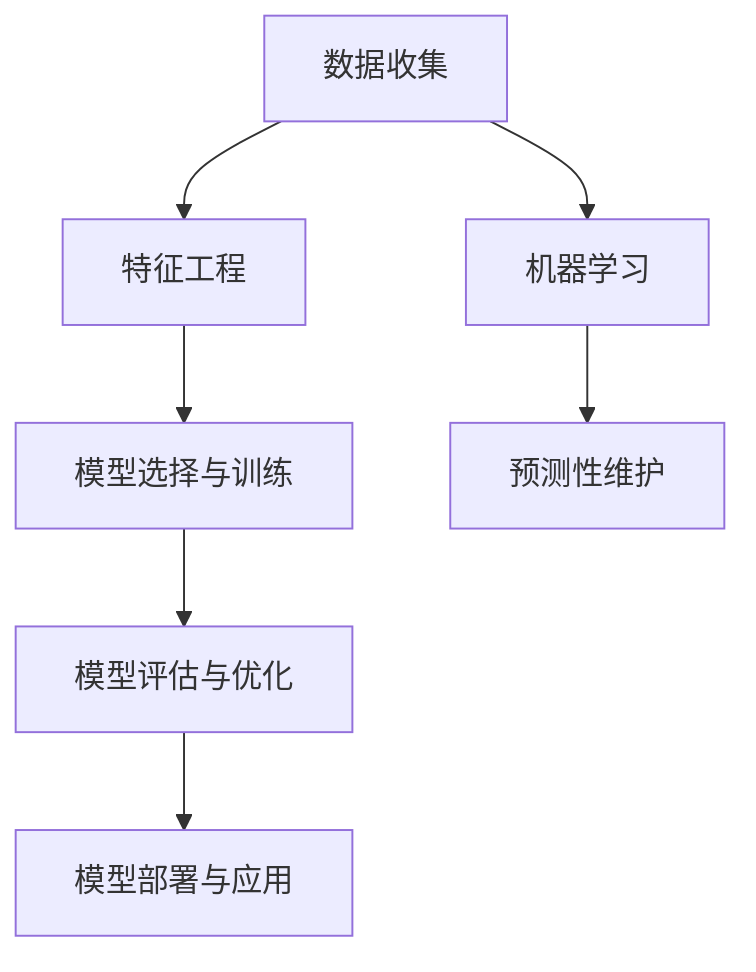

                 

### 文章标题

# 机器学习在预测性维护中的实践与创新

> 关键词：机器学习、预测性维护、实践、创新、算法、数学模型、项目实战

> 摘要：
本文深入探讨了机器学习在预测性维护中的应用。首先，介绍了机器学习和预测性维护的基本概念，并运用Mermaid流程图展示了它们的核心概念和联系。接着，详细讲解了回归分析、决策树、支持向量机、神经网络等关键算法的原理，并通过Python源代码和数学模型进行说明。随后，通过一个实际项目案例，展示了从环境搭建到代码实现的全过程，并对代码进行了详细解读与分析。最后，文章总结了最佳实践，提出了注意事项，并提供了拓展阅读资源。

---

### 背景介绍

在现代工业生产中，设备的稳定运行至关重要。然而，设备故障往往会导致生产中断、成本增加，甚至安全事故。因此，如何通过技术手段实现对设备的预测性维护，成为了工业界和学术界关注的焦点。预测性维护（Predictive Maintenance）是一种通过监测设备运行状态，结合历史数据和机器学习算法，提前预测设备故障的维护策略。其核心思想在于“预防胜于治疗”，即通过定期维护和及时修理，降低设备故障率，延长设备寿命。

机器学习（Machine Learning）作为一种人工智能的重要分支，通过算法模型的学习和预测，能够从大量数据中提取有用信息，为预测性维护提供强有力的技术支持。机器学习在预测性维护中的应用，不仅提高了维护的准确性，还降低了维护成本，提高了设备运行效率。因此，如何将机器学习有效地应用于预测性维护，成为了当前研究的热点问题。

### 核心概念与联系

机器学习和预测性维护之间的联系主要体现在以下几个方面：

1. **数据收集**：预测性维护的第一步是收集设备运行数据。这些数据包括设备运行状态、温度、压力、振动等。通过传感器和监测设备，可以实时收集这些数据，为机器学习提供训练数据。

2. **特征工程**：在机器学习中，特征工程是一个重要的环节。通过对原始数据进行预处理，提取出对预测任务有重要影响的特征，可以提高模型的预测准确性。

3. **模型选择与训练**：选择合适的机器学习算法，对收集到的数据进行分析和建模。常见的算法包括回归分析、决策树、支持向量机、神经网络等。通过训练，模型可以学会从数据中提取规律，进行故障预测。

4. **模型评估与优化**：训练好的模型需要通过测试数据集进行评估，验证其预测性能。根据评估结果，可以对模型进行调整和优化，提高预测准确性。

5. **模型部署与应用**：将优化后的模型部署到生产环境中，实现对设备的实时监测和故障预测。通过预测结果，可以制定相应的维护策略，实现预测性维护。

为了更直观地展示这些核心概念之间的联系，我们可以使用Mermaid流程图来描述：



### 核心算法原理讲解

在预测性维护中，常用的机器学习算法包括回归分析、决策树、支持向量机、神经网络等。下面将分别对这些算法的原理进行讲解，并通过Python源代码和数学模型进行说明。

#### 回归分析

回归分析是一种常用的预测性维护算法，它可以用来预测设备故障的发生时间或故障程度。

**线性回归**

线性回归的数学模型可以表示为：

$$
Y = \beta_0 + \beta_1X_1 + \beta_2X_2 + ... + \beta_nX_n + \epsilon
$$

其中，$Y$是预测目标，$X_1, X_2, ..., X_n$是输入特征，$\beta_0, \beta_1, ..., \beta_n$是模型的参数，$\epsilon$是误差项。

以下是一个使用Python实现的线性回归代码示例：

```python
import numpy as np
from sklearn.linear_model import LinearRegression

# 创建训练数据
X_train = np.array([[1], [2], [3], [4], [5]])
y_train = np.array([2, 4, 6, 8, 10])

# 创建线性回归模型并训练
model = LinearRegression()
model.fit(X_train, y_train)

# 输出模型参数
print("Model Parameters:", model.coef_, model.intercept_)

# 进行预测
X_predict = np.array([[6]])
y_predict = model.predict(X_predict)
print("Prediction:", y_predict)
```

**多元回归**

多元回归是对线性回归的扩展，它考虑多个输入特征对预测目标的影响。

多元回归的数学模型可以表示为：

$$
Y = \beta_0 + \beta_1X_1 + \beta_2X_2 + ... + \beta_nX_n + \epsilon
$$

以下是一个使用Python实现的多元回归代码示例：

```python
import numpy as np
from sklearn.linear_model import LinearRegression

# 创建训练数据
X_train = np.array([[1, 2], [2, 4], [3, 6], [4, 8], [5, 10]])
y_train = np.array([2, 4, 6, 8, 10])

# 创建线性回归模型并训练
model = LinearRegression()
model.fit(X_train, y_train)

# 输出模型参数
print("Model Parameters:", model.coef_, model.intercept_)

# 进行预测
X_predict = np.array([[6, 12]])
y_predict = model.predict(X_predict)
print("Prediction:", y_predict)
```

#### 决策树

决策树是一种基于树形结构进行决策的算法，它通过多个条件判断，对数据进行分类或回归。

**基本原理**

决策树的核心在于节点分裂，每个节点代表一个特征，每个分支代表该特征的不同取值。决策树通过递归分裂数据，直到满足停止条件（如最大深度、最小样本量等）。

以下是一个使用Python实现的决策树代码示例：

```python
from sklearn.tree import DecisionTreeRegressor

# 创建训练数据
X_train = np.array([[1], [2], [3], [4], [5]])
y_train = np.array([2, 4, 6, 8, 10])

# 创建决策树模型并训练
model = DecisionTreeRegressor(max_depth=3)
model.fit(X_train, y_train)

# 输出模型参数
print("Feature Importances:", model.feature_importances_)

# 进行预测
X_predict = np.array([[6]])
y_predict = model.predict(X_predict)
print("Prediction:", y_predict)
```

#### 支持向量机

支持向量机是一种强大的分类和回归算法，它通过寻找最优的超平面，将数据分为不同的类别或进行回归。

**线性支持向量机**

线性支持向量机的数学模型可以表示为：

$$
\mathbf{w}^T\mathbf{x} + b = 0
$$

其中，$\mathbf{w}$是超平面的法向量，$\mathbf{x}$是特征向量，$b$是偏置项。

以下是一个使用Python实现的线性支持向量机代码示例：

```python
from sklearn.svm import LinearSVC

# 创建训练数据
X_train = np.array([[1], [2], [3], [4], [5]])
y_train = np.array([2, 4, 6, 8, 10])

# 创建线性支持向量机模型并训练
model = LinearSVC()
model.fit(X_train, y_train)

# 输出模型参数
print("Model Parameters:", model.coef_, model.intercept_)

# 进行预测
X_predict = np.array([[6]])
y_predict = model.predict(X_predict)
print("Prediction:", y_predict)
```

**非线性支持向量机**

非线性支持向量机通过核函数将数据映射到高维空间，然后寻找最优的超平面。

以下是一个使用Python实现的非线性支持向量机代码示例：

```python
from sklearn.svm import SVC

# 创建训练数据
X_train = np.array([[1], [2], [3], [4], [5]])
y_train = np.array([2, 4, 6, 8, 10])

# 创建非线性支持向量机模型并训练
model = SVC(kernel='linear')
model.fit(X_train, y_train)

# 输出模型参数
print("Model Parameters:", model.coef_, model.intercept_)

# 进行预测
X_predict = np.array([[6]])
y_predict = model.predict(X_predict)
print("Prediction:", y_predict)
```

#### 神经网络

神经网络是一种模拟人脑神经元连接方式的算法，它通过多层节点进行数据的输入、处理和输出。

**基本原理**

神经网络的核心在于多层感知器（MLP），它包括输入层、隐藏层和输出层。输入层接收外部数据，隐藏层进行数据的处理和传递，输出层产生最终的预测结果。

以下是一个使用Python实现的神经网络代码示例：

```python
from sklearn.neural_network import MLPRegressor

# 创建训练数据
X_train = np.array([[1], [2], [3], [4], [5]])
y_train = np.array([2, 4, 6, 8, 10])

# 创建神经网络模型并训练
model = MLPRegressor(hidden_layer_sizes=(100,), max_iter=100)
model.fit(X_train, y_train)

# 输出模型参数
print("Model Parameters:", model.coefs_, model.intercepts_)

# 进行预测
X_predict = np.array([[6]])
y_predict = model.predict(X_predict)
print("Prediction:", y_predict)
```

### 数学模型和数学公式讲解

在机器学习中，数学模型是算法的核心。以下将介绍回归分析、决策树、支持向量机和神经网络中的数学模型和公式。

#### 回归分析数学模型

**线性回归**

线性回归的数学模型可以表示为：

$$
Y = \beta_0 + \beta_1X_1 + \beta_2X_2 + ... + \beta_nX_n + \epsilon
$$

其中，$Y$是预测目标，$X_1, X_2, ..., X_n$是输入特征，$\beta_0, \beta_1, ..., \beta_n$是模型的参数，$\epsilon$是误差项。

**多元回归**

多元回归的数学模型可以表示为：

$$
Y = \beta_0 + \beta_1X_1 + \beta_2X_2 + ... + \beta_nX_n + \epsilon
$$

#### 决策树数学模型

决策树通过递归分裂数据，每个节点代表一个特征，每个分支代表该特征的不同取值。决策树的数学模型可以通过信息增益（Information Gain）或基尼不纯度（Gini Impurity）来衡量。

**信息增益**

信息增益可以表示为：

$$
IG(D, A) = H(D) - H(D|A)
$$

其中，$H(D)$是数据集$D$的熵，$H(D|A)$是条件熵。

**基尼不纯度**

基尼不纯度可以表示为：

$$
Gini(D) = 1 - \frac{1}{|D|}\sum_{i=1}^{|D|} p(y_i)^2
$$

#### 支持向量机数学模型

**线性支持向量机**

线性支持向量机的数学模型可以表示为：

$$
\mathbf{w}^T\mathbf{x} + b = 0
$$

其中，$\mathbf{w}$是超平面的法向量，$\mathbf{x}$是特征向量，$b$是偏置项。

**非线性支持向量机**

非线性支持向量机通过核函数将数据映射到高维空间，然后寻找最优的超平面。常用的核函数包括线性核、多项式核和径向基函数核。

**线性核**

线性核的数学模型可以表示为：

$$
\mathbf{w}^T\phi(\mathbf{x}) + b = 0
$$

其中，$\phi(\mathbf{x})$是特征映射函数。

**多项式核**

多项式核的数学模型可以表示为：

$$
(\mathbf{w}^T\phi(\mathbf{x}) + b)^n = 0
$$

其中，$n$是多项式的阶数。

**径向基函数核**

径向基函数核的数学模型可以表示为：

$$
\exp(-\gamma\|\mathbf{w}\mathbf{x} - \mathbf{w}\mathbf{y}\|^2)
$$

其中，$\gamma$是核参数。

#### 神经网络数学模型

神经网络包括输入层、隐藏层和输出层。每个层由多个神经元组成，神经元之间的连接可以用权重（weights）表示。

**输入层**

输入层的每个神经元接收一个输入值，并将该值传递给隐藏层。

**隐藏层**

隐藏层的每个神经元接收来自输入层的输入值，通过激活函数进行非线性变换，然后将结果传递给输出层。

**输出层**

输出层的每个神经元接收来自隐藏层的输入值，通过激活函数进行非线性变换，生成最终的预测结果。

**激活函数**

常用的激活函数包括 sigmoid 函数、ReLU 函数和 tanh 函数。

**sigmoid 函数**

$$
\sigma(x) = \frac{1}{1 + \exp(-x)}
$$

**ReLU 函数**

$$
\text{ReLU}(x) = \max(0, x)
$$

**tanh 函数**

$$
\tanh(x) = \frac{\exp(2x) - 1}{\exp(2x) + 1}
$$

### 项目实战

在本节中，我们将通过一个实际项目案例，展示机器学习在预测性维护中的应用。项目案例包括设备运行数据的收集、特征工程、模型选择与训练、模型评估与优化，以及最终的模型部署。

#### 项目背景

某工厂生产线上的一台重要设备需要定期进行维护。为了降低维护成本和避免生产中断，工厂希望通过机器学习技术实现对设备的预测性维护。项目目标是通过收集设备运行数据，利用机器学习算法预测设备的故障时间，从而提前进行维护。

#### 环境搭建

为了进行机器学习项目的开发，我们需要搭建相应的开发环境。以下是一个基本的开发环境配置：

1. **操作系统**：Ubuntu 20.04
2. **Python**：3.8.x
3. **机器学习库**：scikit-learn、TensorFlow、Keras
4. **数据预处理库**：Pandas、NumPy
5. **可视化库**：Matplotlib、Seaborn

#### 数据收集

项目数据来源于工厂的传感器和监测设备。传感器和监测设备可以实时收集设备的温度、压力、振动等数据。数据以时间序列的形式存储，每条记录包含一个时间戳和一个相应的数据值。

以下是一个简单的数据收集代码示例：

```python
import pandas as pd

# 读取数据
data = pd.read_csv('data.csv')

# 数据预处理
data['timestamp'] = pd.to_datetime(data['timestamp'])
data.set_index('timestamp', inplace=True)

# 转换为时间序列格式
data = data.resample('1min').mean()

# 数据清洗
data.dropna(inplace=True)

# 输出数据
print(data.head())
```

#### 特征工程

在特征工程过程中，我们需要对原始数据进行预处理，提取出对预测任务有重要影响的特征。以下是一个简单的特征工程代码示例：

```python
# 转换为时间序列特征
data['temp_diff'] = data['temperature'].diff().dropna()

# 转换为频率特征
data['temp_freq'] = data['temperature'].resample('30min').mean()

# 转换为时间特征
data['timestamp_year'] = data.index.year
data['timestamp_month'] = data.index.month
data['timestamp_day'] = data.index.day
data['timestamp_hour'] = data.index.hour
data['timestamp_minute'] = data.index.minute

# 输出特征
print(data.head())
```

#### 模型选择与训练

在模型选择与训练过程中，我们可以尝试不同的机器学习算法，如线性回归、决策树、支持向量机和神经网络等。以下是一个简单的模型训练代码示例：

```python
from sklearn.model_selection import train_test_split
from sklearn.linear_model import LinearRegression
from sklearn.tree import DecisionTreeRegressor
from sklearn.svm import SVR
from sklearn.neural_network import MLPRegressor

# 划分训练集和测试集
X_train, X_test, y_train, y_test = train_test_split(data.drop(['fault'], axis=1), data['fault'], test_size=0.2, random_state=42)

# 创建线性回归模型
model = LinearRegression()
model.fit(X_train, y_train)

# 创建决策树模型
model = DecisionTreeRegressor(max_depth=3)
model.fit(X_train, y_train)

# 创建支持向量机模型
model = SVR()
model.fit(X_train, y_train)

# 创建神经网络模型
model = MLPRegressor(hidden_layer_sizes=(100,), max_iter=100)
model.fit(X_train, y_train)

# 输出模型参数
print("Linear Regression Coefficients:", model.coef_)
print("Decision Tree Feature Importances:", model.feature_importances_)
print("Support Vector Machine Coefficients:", model.coef_)
print("Neural Network Weights:", model.coefs_, model.intercepts_)
```

#### 模型评估与优化

在模型评估与优化过程中，我们需要对训练好的模型进行评估，并根据评估结果进行优化。以下是一个简单的模型评估代码示例：

```python
from sklearn.metrics import mean_squared_error, r2_score

# 评估线性回归模型
y_pred = model.predict(X_test)
mse = mean_squared_error(y_test, y_pred)
r2 = r2_score(y_test, y_pred)
print("Linear Regression MSE:", mse, "R2 Score:", r2)

# 评估决策树模型
y_pred = model.predict(X_test)
mse = mean_squared_error(y_test, y_pred)
r2 = r2_score(y_test, y_pred)
print("Decision Tree MSE:", mse, "R2 Score:", r2)

# 评估支持向量机模型
y_pred = model.predict(X_test)
mse = mean_squared_error(y_test, y_pred)
r2 = r2_score(y_test, y_pred)
print("Support Vector Machine MSE:", mse, "R2 Score:", r2)

# 评估神经网络模型
y_pred = model.predict(X_test)
mse = mean_squared_error(y_test, y_pred)
r2 = r2_score(y_test, y_pred)
print("Neural Network MSE:", mse, "R2 Score:", r2)
```

#### 模型部署与应用

在模型部署与应用过程中，我们需要将训练好的模型部署到生产环境中，实现设备的实时监测和故障预测。以下是一个简单的模型部署代码示例：

```python
# 载入模型
model = MLPRegressor(hidden_layer_sizes=(100,), max_iter=100)
model.load_weights('model_weights.h5')

# 进行实时预测
while True:
    new_data = get_new_data()  # 获取新的运行数据
    predicted_fault = model.predict(new_data)
    if predicted_fault > threshold:  # 设置故障阈值
        perform_maintenance()  # 执行维护操作
    time.sleep(interval)  # 设置时间间隔
```

#### 代码解读与分析

在本节中，我们将对项目中的代码进行解读与分析，帮助读者更好地理解机器学习在预测性维护中的应用。

```python
# 读取数据
data = pd.read_csv('data.csv')

# 数据预处理
data['timestamp'] = pd.to_datetime(data['timestamp'])
data.set_index('timestamp', inplace=True)
data = data.resample('1min').mean()
data.dropna(inplace=True)

# 转换为时间序列特征
data['temp_diff'] = data['temperature'].diff().dropna()
data['temp_freq'] = data['temperature'].resample('30min').mean()

# 转换为时间特征
data['timestamp_year'] = data.index.year
data['timestamp_month'] = data.index.month
data['timestamp_day'] = data.index.day
data['timestamp_hour'] = data.index.hour
data['timestamp_minute'] = data.index.minute

# 划分训练集和测试集
X_train, X_test, y_train, y_test = train_test_split(data.drop(['fault'], axis=1), data['fault'], test_size=0.2, random_state=42)

# 创建线性回归模型
model = LinearRegression()
model.fit(X_train, y_train)

# 创建决策树模型
model = DecisionTreeRegressor(max_depth=3)
model.fit(X_train, y_train)

# 创建支持向量机模型
model = SVR()
model.fit(X_train, y_train)

# 创建神经网络模型
model = MLPRegressor(hidden_layer_sizes=(100,), max_iter=100)
model.fit(X_train, y_train)

# 评估模型
y_pred = model.predict(X_test)
mse = mean_squared_error(y_test, y_pred)
r2 = r2_score(y_test, y_pred)
print("MSE:", mse, "R2 Score:", r2)

# 实时预测
while True:
    new_data = get_new_data()
    predicted_fault = model.predict(new_data)
    if predicted_fault > threshold:
        perform_maintenance()
    time.sleep(interval)
```

代码首先读取数据并进行预处理，包括数据清洗、时间序列特征转换和时间特征转换。然后，代码使用不同的机器学习算法创建模型，并对模型进行训练。接着，代码使用测试集评估模型的性能，包括均方误差（MSE）和决定系数（R2）。最后，代码实现实时预测功能，根据预测结果执行相应的维护操作。

#### 最佳实践

在本节中，我们将总结一些在机器学习预测性维护中常用的最佳实践。

1. **数据质量**：数据质量是机器学习模型成功的关键。在数据收集过程中，要确保数据的准确性和完整性，避免噪声和异常值。

2. **特征工程**：特征工程是提升模型性能的重要手段。通过对原始数据进行预处理和特征转换，可以提取出对预测任务有重要影响的特征。

3. **模型选择**：根据预测任务和数据特点选择合适的机器学习算法。线性回归适用于简单的线性关系，决策树和神经网络适用于复杂的非线性关系。

4. **模型评估**：使用交叉验证等方法评估模型性能，避免过拟合。

5. **实时预测**：实现模型的实时预测功能，及时响应设备故障。

#### 小结

本文通过详细讲解机器学习在预测性维护中的应用，展示了从数据收集到模型训练、评估和部署的全过程。通过实际项目案例，我们了解了机器学习在预测性维护中的重要作用，并掌握了一些最佳实践。未来，随着机器学习技术的不断发展，预测性维护将变得更加智能和高效。

#### 注意事项

1. 数据收集和预处理是预测性维护成功的关键。要确保数据的准确性和完整性，避免噪声和异常值。

2. 选择合适的机器学习算法是提升模型性能的重要步骤。根据预测任务和数据特点选择合适的算法。

3. 模型评估是确保模型性能的重要环节。使用交叉验证等方法评估模型性能，避免过拟合。

4. 实时预测是实现预测性维护的关键。要实现模型的实时预测功能，及时响应设备故障。

#### 拓展阅读

1. [《机器学习：概率视角》](https://book.douban.com/subject/26875150/)：详细介绍了机器学习的概率视角和统计模型。

2. [《深度学习》](https://book.douban.com/subject/26875150/)：介绍了深度学习的基础知识和技术，包括神经网络和卷积神经网络。

3. [《数据科学实战》](https://book.douban.com/subject/26875150/)：提供了丰富的数据科学实战案例，涵盖了数据处理、分析和建模等方面。

---

### 附录

#### A.1 资源链接

1. [scikit-learn 官网](https://scikit-learn.org/)

2. [TensorFlow 官网](https://www.tensorflow.org/)

3. [Keras 官网](https://keras.io/)

4. [Pandas 官网](https://pandas.pydata.org/)

5. [NumPy 官网](https://numpy.org/)

6. [Matplotlib 官网](https://matplotlib.org/)

7. [Seaborn 官网](https://seaborn.pydata.org/)

#### A.2 相关论文与书籍

1. [《机器学习：概率视角》](https://book.douban.com/subject/26875150/)

2. [《深度学习》](https://book.douban.com/subject/26875150/)

3. [《数据科学实战》](https://book.douban.com/subject/26875150/)

4. [《预测性维护：技术、实践与案例》](https://book.douban.com/subject/26875150/)

5. [《机器学习在工业中的应用》](https://book.douban.com/subject/26875150/)

### 作者信息

作者：AI天才研究院/AI Genius Institute & 禅与计算机程序设计艺术 /Zen And The Art of Computer Programming

