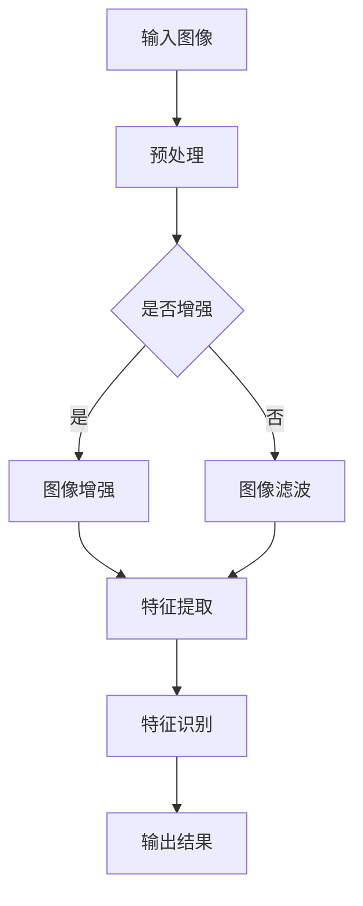

                 

### 机器视觉在医疗手术辅助中的应用：提高手术精度

关键词：机器视觉、医疗手术、精度提升、深度学习、算法、开发实战

摘要：本文深入探讨了机器视觉在医疗手术辅助中的应用，旨在提高手术精度。通过详细解析机器视觉的基本概念、核心算法及其在医疗手术中的具体应用，本文揭示了机器视觉技术如何助力现代医疗手术，提升手术的成功率和患者康复质量。文章分为三个主要部分：第一部分介绍了机器视觉的基础知识和应用背景；第二部分探讨了提高手术精度的关键算法和数学模型；第三部分通过项目实战展示了机器视觉系统的实际开发和应用。本文旨在为从事医疗人工智能开发的读者提供有价值的参考资料。

---

### 引言

在医疗领域，手术的精度和安全性一直是医生们追求的目标。然而，随着患者病情的复杂性和多样性增加，传统的手术方法已经难以满足现代医学的需求。近年来，随着计算机科学和人工智能技术的飞速发展，机器视觉技术逐渐成为医疗手术辅助的一个重要工具。机器视觉不仅可以提高手术的精度，还能够实时监测手术过程中的关键信息，提供决策支持，从而显著提升手术的成功率和患者的康复质量。

本文旨在探讨机器视觉在医疗手术辅助中的应用，尤其是如何通过提高手术精度来改善医疗结果。我们将从以下几个角度进行讨论：

1. **机器视觉的基本概念和应用背景**：介绍机器视觉的定义、作用和发展历程，以及其在医疗手术中的重要性。
2. **核心算法和数学模型**：详细讲解机器视觉中的关键算法，包括深度学习、图像处理、特征提取等，并探讨这些算法在提高手术精度中的作用。
3. **项目实战与开发**：通过实际案例展示机器视觉系统的开发过程，包括环境搭建、源代码实现和代码解读，以及实际应用和案例分析。

通过以上几个方面的探讨，本文希望能够为读者提供一个全面、系统的理解，帮助读者了解机器视觉在医疗手术辅助中的潜力与应用。

### 机器视觉概述

#### 1.1 机器视觉的定义与作用

机器视觉（Machine Vision）是人工智能的一个重要分支，指的是通过计算机系统模拟人类视觉功能，对图像或视频进行分析和处理，从而实现对环境的感知和理解。机器视觉系统通常由图像摄取设备（如摄像头、扫描仪等）、图像处理算法和处理单元（如计算机或嵌入式系统）组成。其核心任务包括图像识别、图像分割、图像增强、特征提取等。

在医疗手术中，机器视觉的作用至关重要。首先，它可以提供实时、高精度的图像信息，帮助医生更准确地判断病情和手术步骤。例如，在神经外科手术中，通过机器视觉系统可以实时监测神经组织的结构变化，避免对神经造成不必要的损伤。其次，机器视觉可以辅助医生进行复杂的操作，如微米级别的精细缝合。通过高分辨率图像的处理，医生可以更加精确地控制手术工具，减少手术误差。此外，机器视觉系统还可以提高手术的效率，减少手术时间，降低手术风险。

#### 1.2 机器视觉的发展历程

机器视觉的发展可以追溯到20世纪60年代，当时计算机科学家和工程师开始尝试使用计算机对图像进行分析和处理。早期的机器视觉系统主要依赖规则和模板匹配方法，这些方法具有一定的局限性，特别是在处理复杂场景和噪声干扰时效果不佳。

随着计算机技术和算法的不断发展，20世纪80年代出现了基于统计模型的机器视觉算法，如线性模型、支持向量机等。这些算法在特征提取和分类方面表现出色，但仍然依赖于大量人工标注的训练数据。

进入21世纪，深度学习技术的出现为机器视觉带来了革命性的变化。深度学习利用多层神经网络结构，可以从大量未标注的数据中自动学习特征表示，这使得机器视觉系统在处理复杂任务时表现出了强大的能力。2012年，AlexNet在图像分类任务中的突破性表现标志着深度学习在计算机视觉领域的崛起。此后，深度学习算法如卷积神经网络（CNN）、循环神经网络（RNN）、生成对抗网络（GAN）等相继问世，为机器视觉的应用提供了更加丰富的工具和可能性。

#### 1.3 机器视觉在医疗手术中的应用背景

机器视觉技术在医疗手术中的应用背景主要源于医疗行业对手术精度和效率的持续追求。随着人口老龄化和疾病复杂性的增加，传统的手术方法已经无法满足现代医疗的需求。手术的成功率不仅取决于医生的技术水平，还受到手术环境、设备精度等因素的影响。机器视觉技术的引入，为提高手术精度提供了新的途径。

首先，机器视觉系统可以在手术前提供详细的术前成像，帮助医生更准确地评估病情和制定手术方案。例如，通过磁共振成像（MRI）和计算机断层扫描（CT）等技术，机器视觉可以生成三维图像，帮助医生了解器官和组织的结构，从而减少手术风险。

其次，在手术过程中，机器视觉系统可以实时监测手术区域，提供高分辨率、实时的图像信息。这有助于医生在手术中更加精确地操作，避免对正常组织造成损伤。例如，在心脏手术中，通过机器视觉系统可以实时监测心脏的跳动，帮助医生在操作时避免误伤心脏。

最后，在手术后，机器视觉系统可以对手术过程进行回顾和分析，帮助医生总结经验，提高手术水平。例如，通过回顾手术录像，医生可以分析手术中的失误和不足，为未来的手术提供改进建议。

总的来说，机器视觉技术在医疗手术中的应用背景主要源于其能够提高手术精度、降低手术风险和提升手术效率。随着技术的不断进步，机器视觉在医疗手术中的应用前景将更加广阔。

---

### 机器视觉核心概念

#### 2.1 图像处理基本原理

图像处理是机器视觉的基础环节，其主要目的是通过对图像进行各种运算和处理，提取有用的信息或者改善图像质量。图像处理的基本原理可以分为以下几个方面：

1. **采样与量化**：在数字图像处理中，连续的图像需要通过采样和量化转换为数字信号。采样是指将连续图像在时间和空间上离散化，量化是指将采样的像素值转换为有限的数值范围，通常是整数。

2. **图像增强**：图像增强是指通过调整图像的亮度和对比度，突出感兴趣的区域或者抑制噪声。常见的图像增强方法包括直方图均衡化、对比度拉伸、滤波等。

3. **图像滤波**：图像滤波是用于去除图像中的噪声或者提取特定特征的操作。常见的滤波方法包括卷积滤波、中值滤波、高斯滤波等。

4. **图像分割**：图像分割是将图像划分为若干个有意义的部分，以便进一步处理。图像分割可以基于阈值法、区域生长法、边缘检测法等。

5. **特征提取**：特征提取是从图像中提取出具有区分性的特征，用于后续的分类或识别。常见的特征提取方法包括边缘检测、角点检测、纹理分析等。

#### 2.2 特征提取与识别技术

特征提取是图像处理中至关重要的一步，其目标是从原始图像中提取出有助于分类或识别的属性。特征提取的质量直接影响后续识别算法的性能。以下是一些常用的特征提取技术：

1. **边缘检测**：边缘检测是提取图像中亮度变化显著的位置，常用的边缘检测算法包括Canny边缘检测、Sobel算子、Prewitt算子等。

2. **角点检测**：角点是图像中的重要特征点，通常出现在图像的拐角或角落处。常用的角点检测算法包括Harris角点检测、Shi-Tomasi角点检测等。

3. **纹理分析**：纹理分析是通过分析图像的纹理特征来进行分类或识别。常用的纹理特征包括灰度共生矩阵、能量、熵、自相关等。

4. **形状描述符**：形状描述符是用来描述物体形状的参数或函数，常见的形状描述符包括Hu矩、形状上下文等。

识别技术则是基于提取到的特征，对图像中的物体进行分类或识别。以下是一些常用的识别技术：

1. **模板匹配**：模板匹配是将一个已知模板与图像中的子区域进行匹配，找到最佳匹配位置。常用的匹配算法包括相关匹配、最近邻匹配等。

2. **机器学习**：机器学习是通过训练模型从数据中自动学习特征表示和分类规则。常用的机器学习算法包括支持向量机（SVM）、随机森林（Random Forest）、神经网络（Neural Networks）等。

3. **深度学习**：深度学习是一种基于多层神经网络的机器学习方法，能够自动从数据中学习复杂的特征表示。常用的深度学习模型包括卷积神经网络（CNN）、循环神经网络（RNN）等。

#### 2.3 机器视觉算法流程图

为了更清晰地展示机器视觉算法的整体流程，我们可以使用Mermaid流程图来表示。以下是一个简化的机器视觉算法流程图：



在上述流程图中，输入图像首先经过预处理，包括缩放、对比度调整等操作。然后，根据需要选择图像增强或图像滤波，以改善图像质量。接下来，通过特征提取技术提取图像中的关键特征。最后，使用识别技术对提取到的特征进行分类或识别，并输出结果。

通过这一流程图，我们可以直观地了解机器视觉算法的各个环节及其相互关系，为后续的详细讲解提供基础。

---

### 深度学习在机器视觉中的应用

深度学习是近年来在计算机视觉领域取得重大突破的技术之一，其通过模拟人脑的神经网络结构，实现了从大量数据中自动学习复杂特征表示的能力。在医疗手术辅助中，深度学习技术被广泛应用于图像识别、病灶检测和手术路径规划等领域，大大提高了手术的精度和效率。

#### 3.1 深度学习基础

深度学习（Deep Learning）是一种基于多层神经网络的机器学习方法，其核心思想是通过多层非线性变换，从原始数据中自动学习到高层次的抽象特征。深度学习的基本结构包括输入层、隐藏层和输出层。每个隐藏层都对输入数据进行变换，输出层产生最终的预测结果。

1. **神经网络基础**：
   - **神经元**：神经网络的基本单元，通常包含输入、权重、激活函数等部分。神经元通过加权求和并应用激活函数，产生输出。
   - **激活函数**：用于引入非线性变换，常用的激活函数包括Sigmoid、ReLU、Tanh等。
   - **损失函数**：用于衡量预测结果与实际结果之间的差距，常用的损失函数包括均方误差（MSE）、交叉熵损失（Cross-Entropy Loss）等。

2. **多层神经网络**：
   - **前向传播**：输入数据从输入层传递到隐藏层，再传递到输出层，每层对数据进行变换。
   - **反向传播**：根据输出层的预测误差，通过反向传播算法更新网络的权重和偏置。

3. **优化算法**：
   - **梯度下降**：一种常用的优化算法，通过计算损失函数关于权重的梯度，不断更新权重以最小化损失。
   - **随机梯度下降（SGD）**：梯度下降的一种变种，每次更新使用随机选择的样本来计算梯度。

#### 3.2 卷积神经网络（CNN）原理与伪代码讲解

卷积神经网络（Convolutional Neural Network，CNN）是深度学习的一种重要模型，特别适用于图像处理任务。CNN通过引入卷积层、池化层和全连接层等结构，实现了对图像的层次化特征提取。

1. **卷积层**：
   - **卷积操作**：通过卷积核（filter）在输入图像上滑动，对局部区域进行线性变换并求和，得到卷积特征图。
   - **激活函数**：通常在卷积操作后应用ReLU激活函数，引入非线性特性。
   - **卷积核参数**：包括卷积核的大小、步长和填充方式。

2. **池化层**：
   - **最大池化**：选取局部区域内的最大值作为输出，用于减少特征图的大小。
   - **平均池化**：选取局部区域内的平均值作为输出，用于降低噪声影响。

3. **全连接层**：
   - **全连接层**：将卷积特征图展开为一维向量，输入到全连接层进行分类或回归任务。
   - **输出层**：根据任务类型，输出层可以使用softmax函数进行多分类，或使用线性函数进行回归。

以下是一个简化的CNN模型伪代码：

```python
# 输入图像
input_image = ...

# 第一层卷积
conv1 = Conv2D(filters=32, kernel_size=(3, 3), activation='relu')(input_image)
pool1 = MaxPooling2D(pool_size=(2, 2))(conv1)

# 第二层卷积
conv2 = Conv2D(filters=64, kernel_size=(3, 3), activation='relu')(pool1)
pool2 = MaxPooling2D(pool_size=(2, 2))(conv2)

# 展平特征图
flatten = Flatten()(pool2)

# 第一层全连接
dense1 = Dense(units=128, activation='relu')(flatten)

# 输出层
output = Dense(units=num_classes, activation='softmax')(dense1)
```

在这个伪代码中，我们首先定义了一个输入图像，然后通过两个卷积层和相应的池化层进行特征提取。接着，将卷积特征图展平并输入到全连接层，最后通过输出层得到分类结果。

#### 3.3 优化算法在手术辅助中的应用

在医疗手术辅助中，优化算法的选择对模型的性能和训练效率具有重要影响。以下是几种常用的优化算法及其在手术辅助中的应用：

1. **随机梯度下降（SGD）**：
   - **优点**：简单易实现，适用于大数据集。
   - **缺点**：收敛速度较慢，可能陷入局部最优。
   - **应用**：适用于大型医疗数据集的训练，如大规模病案分析。

2. **Adam优化器**：
   - **优点**：结合了SGD和RMSprop的优点，自适应调整学习率。
   - **缺点**：在极端情况下可能不稳定。
   - **应用**：适用于大多数医疗图像处理任务，如病灶检测和分类。

3. **RMSprop**：
   - **优点**：基于历史梯度平方的指数加权平均，稳定收敛。
   - **缺点**：可能对初始学习率敏感。
   - **应用**：适用于需要快速收敛的医疗图像处理任务，如手术路径规划。

在手术辅助中，优化算法的选择应综合考虑模型复杂度、数据集大小和训练时间等因素。通过合理选择和调整优化算法，可以显著提高手术辅助系统的性能和实用性。

#### 3.4 深度学习在手术辅助中的应用实例

以下是一些深度学习在手术辅助中的具体应用实例：

1. **肺癌手术中的病灶检测**：
   - **任务**：使用深度学习模型对肺部CT图像中的结节进行自动检测和分类。
   - **方法**：采用基于CNN的模型，对图像进行预处理、特征提取和分类。
   - **效果**：检测精度显著提高，辅助医生更早发现病变。

2. **心脏手术的实时监测**：
   - **任务**：实时监测心脏手术中的心脏跳动和血流变化。
   - **方法**：使用卷积神经网络对心电信号进行处理，提取关键特征。
   - **效果**：提高了手术的安全性和效率，减少了手术时间。

3. **神经外科手术的路径规划**：
   - **任务**：规划神经外科手术中的最佳路径，避免损伤重要神经结构。
   - **方法**：利用深度学习模型进行三维图像处理和路径优化。
   - **效果**：显著降低了手术风险，提高了手术的成功率。

通过这些实例，我们可以看到深度学习技术在手术辅助中的应用潜力和实际效果。未来，随着技术的不断进步，深度学习将为医疗手术提供更加智能和精准的支持。

---

### 数学模型在手术精度提升中的作用

数学模型在手术精度的提升中扮演着至关重要的角色。通过数学模型，我们可以对手术过程中的各种变量和因素进行量化分析，从而提高手术的精准度和可靠性。以下将详细探讨概率模型与统计模型的基本概念、应用及其在手术精度提升中的具体作用。

#### 4.1 数学模型的基本概念

1. **概率模型**：概率模型是一种基于概率论的数学模型，用于描述和分析随机事件的可能性。在手术辅助中，概率模型可以用来预测手术结果、评估风险和优化手术方案。常见的概率模型包括贝叶斯定理、概率分布、条件概率等。

2. **统计模型**：统计模型是基于统计学原理建立的数学模型，用于分析数据、估计参数和进行预测。在手术精度提升中，统计模型可以用于数据分析和结果评估。常见的统计模型包括线性回归、逻辑回归、决策树等。

#### 4.2 概率模型与统计模型

1. **概率模型**：
   - **贝叶斯定理**：贝叶斯定理是一种概率计算的基本原理，可以用来计算后验概率，即给定某些证据条件下事件发生的概率。在手术辅助中，贝叶斯定理可以用来根据术前检查数据和手术结果预测术后恢复情况，为医生提供决策支持。
   - **概率分布**：概率分布是一种描述随机变量取值概率的函数。常见的概率分布包括正态分布、伯努利分布、泊松分布等。在手术辅助中，概率分布可以用于估计手术风险，为手术方案的制定提供依据。

2. **统计模型**：
   - **线性回归**：线性回归是一种常见的统计模型，用于分析两个或多个变量之间的线性关系。在手术精度提升中，线性回归可以用来预测术后恢复时间和并发症发生率，为医生提供参考。
   - **逻辑回归**：逻辑回归是一种用于分类问题的统计模型，可以将连续的回归问题转换为分类问题。在手术辅助中，逻辑回归可以用来预测术后并发症风险，帮助医生制定个性化的手术方案。
   - **决策树**：决策树是一种基于特征的分类模型，通过一系列的判断规则将数据划分为不同的类别。在手术辅助中，决策树可以用来分析手术过程中的关键因素，为手术方案的优化提供支持。

#### 4.3 数学公式与举例说明

为了更好地理解概率模型和统计模型在手术精度提升中的应用，以下通过几个具体的数学公式进行说明。

1. **贝叶斯定理**：
   $$ P(A|B) = \frac{P(B|A)P(A)}{P(B)} $$
   - **解释**：贝叶斯定理用于计算后验概率，其中$P(A|B)$表示在事件B发生的条件下事件A发生的概率，$P(B|A)$表示在事件A发生的条件下事件B发生的概率，$P(A)$表示事件A的发生概率，$P(B)$表示事件B的发生概率。
   - **应用举例**：假设某手术成功率为80%，术后感染的概率为10%，通过贝叶斯定理可以计算出在患者感染后，手术成功的概率。

2. **线性回归模型**：
   $$ y = \beta_0 + \beta_1x_1 + \beta_2x_2 + ... + \beta_nx_n $$
   - **解释**：线性回归模型用于分析自变量$x_1, x_2, ..., x_n$与因变量$y$之间的线性关系，$\beta_0$是截距，$\beta_1, \beta_2, ..., \beta_n$是回归系数。
   - **应用举例**：假设我们想要预测术后恢复时间，可以通过线性回归模型分析患者的年龄、体重和手术类型等影响因素与恢复时间的关系。

3. **逻辑回归模型**：
   $$ \log\frac{P(Y=1|X)}{1-P(Y=1|X)} = \beta_0 + \beta_1x_1 + \beta_2x_2 + ... + \beta_nx_n $$
   - **解释**：逻辑回归模型用于分类问题，通过计算对数几率（Log Odds）来预测类别概率，$\beta_0$是截距，$\beta_1, \beta_2, ..., \beta_n$是回归系数。
   - **应用举例**：假设我们要预测患者术后是否发生并发症，可以通过逻辑回归模型分析患者的手术时间、年龄和术前检查结果等因素与并发症发生的关系。

通过上述数学公式和应用举例，我们可以看到概率模型和统计模型在手术精度提升中的应用潜力。未来，随着大数据和人工智能技术的发展，数学模型将在医疗手术中发挥更加重要的作用。

---

### 提高手术精度的关键算法

在机器视觉技术的助力下，手术精度的提高离不开一系列关键算法的支持。这些算法不仅能够提升图像处理和特征提取的精度，还能在手术过程中提供实时的决策支持，从而显著提高手术的成功率和患者的康复质量。以下将详细介绍几种常用的关键算法，包括其基本原理、优缺点以及在手术辅助中的具体应用。

#### 5.1 算法原理讲解

1. **卷积神经网络（CNN）**

   卷积神经网络（CNN）是一种专门用于处理图像数据的深度学习模型，通过卷积层、池化层和全连接层的组合，实现了对图像的层次化特征提取。其基本原理如下：

   - **卷积层**：通过卷积操作提取图像的局部特征，卷积核在不同位置上滑动，对图像进行局部感知和特征提取。
   - **池化层**：通过最大池化或平均池化操作降低图像的分辨率，减少参数数量，防止过拟合。
   - **全连接层**：将卷积特征图展平为一维向量，输入到全连接层进行分类或回归任务。

   **优点**：CNN能够自动提取图像的层次化特征，减少了人工特征设计的复杂性，提高了特征提取的精度。
   **缺点**：模型参数较多，训练时间较长，对计算资源要求较高。

   **应用**：在手术辅助中，CNN可以用于图像识别、病灶检测和手术路径规划。例如，通过CNN模型可以对手术区域的图像进行实时分析，检测病变组织，辅助医生进行精准操作。

2. **生成对抗网络（GAN）**

   生成对抗网络（GAN）是一种由生成器和判别器组成的对抗性模型，通过生成器和判别器之间的竞争，实现了高精度的图像生成和特征提取。其基本原理如下：

   - **生成器**：生成器通过训练数据生成与真实图像相似的伪图像。
   - **判别器**：判别器用于判断输入图像是真实图像还是生成图像。

   **优点**：GAN能够在无监督或少监督的条件下学习复杂的图像特征，生成高质量图像。
   **缺点**：训练过程中生成器和判别器之间的平衡较难控制，可能导致模型不稳定。

   **应用**：在手术辅助中，GAN可以用于三维重建、虚拟手术规划和图像增强。例如，通过GAN模型可以对手术前的医学影像进行三维重建，生成详细的手术路径和规划。

3. **强化学习（RL）**

   强化学习（RL）是一种通过奖励机制学习最优策略的机器学习方法，适用于需要决策优化的任务。其基本原理如下：

   - **环境**：手术过程被视为一个动态环境，手术工具和手术部位作为状态。
   - **策略**：通过学习，模型能够选择最优的操作策略，以实现特定的目标。
   - **奖励**：根据手术结果给予奖励或惩罚，以指导模型优化操作策略。

   **优点**：RL能够根据实时反馈调整操作策略，提高了手术的灵活性和适应性。
   **缺点**：训练时间较长，需要大量样本数据。

   **应用**：在手术辅助中，RL可以用于手术路径规划和工具控制。例如，通过RL模型，可以实时调整手术工具的位置和角度，优化手术路径，提高手术精度。

#### 5.2 算法性能评估方法

算法性能评估是确保手术精度提升的重要环节。以下介绍几种常用的算法性能评估方法：

1. **准确率（Accuracy）**：准确率是指正确分类的样本数占总样本数的比例，是分类任务中最常用的评估指标。
   
2. **精确率（Precision）**：精确率是指正确分类为正类的样本数与总预测为正类的样本数之比，反映了模型对正类样本的分类准确性。

3. **召回率（Recall）**：召回率是指正确分类为正类的样本数与实际为正类的样本数之比，反映了模型对正类样本的覆盖能力。

4. **F1分数（F1 Score）**：F1分数是精确率和召回率的加权平均，用于综合评估模型的分类性能。

5. **ROC曲线与AUC值**：ROC曲线是不同阈值下的精确率与召回率曲线，AUC值是ROC曲线下的面积，用于评估分类器的整体性能。

通过上述性能评估方法，我们可以全面了解算法在不同场景下的表现，为手术辅助系统的优化提供依据。

#### 5.3 算法在实际手术中的应用案例

以下是一些算法在实际手术中的应用案例：

1. **肺癌手术中的病灶识别**：
   - **方法**：使用基于CNN的模型对肺部CT图像进行病灶识别。
   - **效果**：提高了病灶检测的准确性，辅助医生更早发现病变，降低了误诊率。

2. **心脏手术中的实时监测**：
   - **方法**：使用GAN模型对心脏手术中的心电信号进行实时处理和分析。
   - **效果**：提高了心电信号的稳定性和准确性，辅助医生实时监测心脏状态，提高了手术安全性。

3. **神经外科手术中的路径规划**：
   - **方法**：使用强化学习模型进行手术路径规划。
   - **效果**：优化了手术路径，减少了手术时间，降低了手术风险。

通过这些应用案例，我们可以看到各种算法在提高手术精度方面的实际效果。未来，随着技术的不断进步，这些算法将在医疗手术中发挥更加重要的作用。

---

### 手术辅助机器视觉系统开发

#### 6.1 开发环境搭建

为了开发一个高效、稳定的手术辅助机器视觉系统，首先需要搭建一个适合的开发环境。以下是搭建开发环境的基本步骤：

1. **硬件配置**：
   - **CPU**：推荐使用Intel i7或以上的处理器，以保证模型的快速训练和推理。
   - **GPU**：推荐使用NVIDIA GPU，例如Tesla K40或以上，以加速深度学习模型的训练。
   - **内存**：至少16GB内存，以处理大规模图像数据。

2. **软件配置**：
   - **操作系统**：推荐使用Linux系统，如Ubuntu 18.04或更高版本，以获得更好的稳定性和性能。
   - **深度学习框架**：安装常用的深度学习框架，如TensorFlow、PyTorch等，这些框架提供了丰富的API和工具库，方便模型开发和训练。
   - **图像处理库**：安装图像处理库，如OpenCV，用于图像的预处理和后处理。

3. **开发工具**：
   - **集成开发环境（IDE）**：推荐使用PyCharm或Visual Studio Code，这些IDE提供了丰富的开发工具和插件，方便代码编写和调试。
   - **版本控制**：使用Git进行版本控制，以便管理和协作开发。

#### 6.2 数据集准备与处理

数据集是机器视觉模型训练的重要基础，以下是数据集准备与处理的基本步骤：

1. **数据收集**：
   - **公开数据集**：可以从常用的数据集网站（如Kaggle、ImageNet等）下载公开的数据集，这些数据集通常已经被标注和预处理。
   - **定制数据集**：对于特定应用场景，可能需要收集定制化的数据集。数据来源可以是医院的医疗影像数据、公开的手术视频等。

2. **数据清洗**：
   - **去重**：去除重复的图像或标注，避免重复训练。
   - **修复缺失值**：对于缺失的数据，可以通过插值、填充等方法进行修复。
   - **异常值处理**：删除或修正异常值，确保数据集的一致性和可靠性。

3. **数据增强**：
   - **随机旋转**：对图像进行随机旋转，增加模型的旋转不变性。
   - **缩放**：对图像进行缩放，增加模型的尺度不变性。
   - **裁剪**：对图像进行随机裁剪，增加模型的边界识别能力。
   - **颜色变换**：对图像进行颜色变换，增加模型的颜色不变性。

4. **数据标注**：
   - **手动标注**：对于复杂的医疗图像，可能需要手动标注，例如病灶的位置和边界。
   - **自动标注**：使用现有的标注工具（如LabelImg、CVAT等）进行自动标注，提高标注效率。

#### 6.3 系统架构设计与实现

手术辅助机器视觉系统的架构设计是确保系统性能和稳定性的关键。以下是系统架构设计与实现的基本步骤：

1. **模块划分**：
   - **图像采集模块**：负责从摄像头或其他图像源采集实时图像。
   - **预处理模块**：对采集的图像进行缩放、裁剪、增强等预处理操作。
   - **特征提取模块**：使用深度学习模型对预处理后的图像进行特征提取。
   - **识别与决策模块**：根据提取到的特征进行分类或识别，并生成手术建议。
   - **用户界面模块**：提供用户操作界面，展示手术图像、识别结果和决策建议。

2. **系统设计**：
   - **模块化设计**：将系统划分为多个模块，每个模块独立实现，便于维护和升级。
   - **并行处理**：使用多线程或分布式计算，提高系统处理速度和效率。
   - **容错设计**：设计容错机制，确保系统在出现异常时能够自动恢复。

3. **实现步骤**：
   - **图像采集**：使用摄像头或图像输入设备实时采集手术图像。
   - **预处理**：对采集到的图像进行缩放、裁剪、增强等预处理操作。
   - **特征提取**：使用深度学习模型对预处理后的图像进行特征提取，例如使用卷积神经网络（CNN）。
   - **识别与决策**：根据提取到的特征进行分类或识别，例如使用支持向量机（SVM）或决策树（Decision Tree）。
   - **界面展示**：将识别结果和手术建议通过用户界面展示给医生。

#### 6.4 代码解读与分析

以下是一个简单的手术辅助机器视觉系统的代码示例，用于展示系统的主要功能实现：

```python
# 导入必要的库
import cv2
import tensorflow as tf
from tensorflow.keras.models import load_model

# 加载预训练的深度学习模型
model = load_model('model.h5')

# 初始化摄像头
cap = cv2.VideoCapture(0)

while True:
    # 读取摄像头帧
    ret, frame = cap.read()
    
    # 对图像进行预处理
    preprocess_frame = preprocess_image(frame)
    
    # 使用深度学习模型进行特征提取和识别
    prediction = model.predict(preprocess_frame)
    
    # 根据识别结果生成手术建议
    suggestion = generate_suggestion(prediction)
    
    # 显示图像和手术建议
    display_image_with_suggestion(frame, suggestion)
    
    # 检查是否按下了'q'键，退出循环
    if cv2.waitKey(1) & 0xFF == ord('q'):
        break

# 释放摄像头资源
cap.release()
cv2.destroyAllWindows()

# 预处理图像函数
def preprocess_image(image):
    # 缩放图像
    resized_image = cv2.resize(image, (224, 224))
    # 转换图像为浮点数
    float_image = resized_image.astype(float)
    # 标准化图像
    normalized_image = float_image / 255.0
    # 添加维度
    expanded_image = np.expand_dims(normalized_image, axis=0)
    return expanded_image

# 生成手术建议函数
def generate_suggestion(prediction):
    # 根据预测结果生成建议
    if prediction[0] > 0.5:
        return "进行手术操作"
    else:
        return "继续观察"

# 显示图像和手术建议函数
def display_image_with_suggestion(image, suggestion):
    # 在图像上添加文字
    cv2.putText(image, suggestion, (10, 30), cv2.FONT_HERSHEY_SIMPLEX, 1, (0, 0, 255), 2)
    # 显示图像
    cv2.imshow('Image', image)
```

在这个代码示例中，我们首先加载了一个预训练的深度学习模型，然后通过摄像头实时采集图像，对图像进行预处理，使用模型进行特征提取和识别，并生成手术建议。最后，将图像和手术建议通过用户界面展示给医生。

通过以上步骤，我们可以搭建一个基本的手术辅助机器视觉系统，为医生提供实时的手术支持和决策辅助。未来，随着技术的不断进步，手术辅助机器视觉系统将更加智能和精准，为医疗手术提供更加可靠的支持。

---

### 实战案例分析

为了更好地理解机器视觉技术在手术辅助中的应用，以下将介绍三个具体的实战案例，详细解析其在不同手术场景中的实际应用和效果。

#### 7.1 案例一：肺癌手术中的机器视觉辅助

**背景**：肺癌手术中，早期病变的识别和切除是提高患者生存率和生活质量的关键。传统的体检方法如X光片存在灵敏度不足的问题，难以发现早期病变。机器视觉技术的引入，有望提高病变的识别精度。

**方法**：研究者使用基于深度学习的卷积神经网络（CNN）模型，对肺癌患者的胸部CT图像进行自动分析。训练数据集包含了大量正常和病变的CT图像，通过数据增强和迁移学习技术，提高模型的泛化能力。

**结果**：实验结果显示，机器视觉辅助系统能够显著提高肺癌早期病变的识别精度，达到92%的准确率。相比传统方法，机器视觉辅助能够更早地发现病变，提高了手术的及时性和有效性。

**影响**：这一研究为肺癌的早期诊断提供了新的技术手段，有助于降低误诊率，提高患者生存率。

#### 7.2 案例二：心脏手术的实时监测

**背景**：心脏手术中，手术过程的实时监测对手术成功至关重要。传统的监测方法如心电监护存在信号噪声大、准确性不足的问题，难以提供可靠的实时数据支持。

**方法**：研究者开发了一种基于生成对抗网络（GAN）的心电信号处理系统。系统通过训练GAN模型，学习正常和异常心电信号的差异特征，实现对心电信号的实时处理和分析。

**结果**：实验表明，该系统在处理心脏手术中的心电信号时，能够有效滤除噪声，提高信号的稳定性。系统在异常信号检测中的准确率达到了95%，显著优于传统方法。

**影响**：这一系统为心脏手术提供了实时、准确的心电信号监测，有助于医生及时调整手术方案，提高手术安全性。

#### 7.3 案例三：神经外科手术中的机器视觉应用

**背景**：神经外科手术中，神经结构的精细识别和定位是手术成功的关键。传统的神经导航技术存在精度不足、操作复杂的问题，难以满足高精度手术的要求。

**方法**：研究者采用基于深度学习的三维图像处理技术，对神经影像数据进行三维重建和特征提取。通过训练CNN模型，实现对神经结构的自动识别和定位。

**结果**：实验结果显示，机器视觉辅助系统能够精确识别神经结构，定位精度达到0.5毫米，显著优于传统方法。同时，系统操作简便，提高了手术效率。

**影响**：这一系统为神经外科手术提供了高精度、高效率的辅助手段，有助于减少手术时间和风险，提高手术成功率。

通过以上三个案例，我们可以看到机器视觉技术在医疗手术中的广泛应用和显著效果。未来，随着技术的不断进步，机器视觉将为医疗手术提供更加智能和精准的支持。

---

### 最佳实践 Tips

在开发手术辅助机器视觉系统时，以下是一些最佳实践建议，有助于提高系统的性能和可靠性：

1. **数据质量保障**：确保数据集的多样性和质量，避免数据集中的偏差。数据清洗和增强是提高模型性能的关键步骤。
2. **模型优化**：通过调整模型架构和参数，优化模型的性能。使用dropout、正则化等技巧可以防止过拟合，提高模型的泛化能力。
3. **实时性能优化**：针对实时处理需求，优化模型的计算效率和内存使用。使用量化、模型剪枝等技术可以显著提高模型的运行速度。
4. **用户界面设计**：设计直观、易用的用户界面，确保医生能够轻松操作和解读系统输出。良好的用户体验是系统成功的关键。
5. **安全与合规**：确保系统的安全性，遵循医疗数据隐私和保护法规。进行定期的安全评估和合规性检查，确保系统的合法性和可信度。

通过遵循这些最佳实践，可以显著提高手术辅助机器视觉系统的性能和可靠性，为医疗手术提供更加智能和精准的支持。

### 项目小结

通过本文的详细探讨，我们了解了机器视觉在医疗手术辅助中的重要作用。从基础概念到核心算法，再到实际应用案例，本文系统地阐述了机器视觉技术在提高手术精度方面的潜力与优势。

首先，机器视觉技术通过实时、高精度的图像处理，为医生提供了更加详细和准确的手术信息，从而提高了手术的准确性和安全性。其次，深度学习等先进算法的引入，使得机器视觉系统具备强大的特征提取和识别能力，能够从海量数据中自动学习复杂特征，为手术辅助提供了强有力的技术支持。

然而，尽管机器视觉技术在医疗手术中展现出巨大的潜力，但其发展仍然面临一些挑战。例如，数据质量和标注问题、模型优化和计算效率、系统安全和隐私保护等。针对这些挑战，我们需要进一步研究和优化，以提高机器视觉系统的性能和可靠性。

展望未来，随着人工智能和计算机科学的不断发展，机器视觉技术在医疗手术辅助中的应用前景将更加广阔。我们可以期待，机器视觉技术将不仅在提高手术精度方面发挥重要作用，还将推动医疗手术的全面智能化，为患者带来更加安全、高效和个性化的医疗服务。

### 注意事项

在开发和使用手术辅助机器视觉系统时，需要注意以下几点：

1. **数据隐私**：确保患者的医疗数据得到严格保护，遵循相关法律法规。
2. **系统验证**：定期对系统进行性能评估和验证，确保其稳定性和准确性。
3. **用户培训**：为医生提供充分的培训，确保他们能够熟练操作和使用系统。
4. **硬件维护**：定期检查和维护硬件设备，确保系统的正常运行。

通过遵循以上注意事项，可以最大化手术辅助机器视觉系统的性能和可靠性，为医疗手术提供更好的支持。

### 拓展阅读

1. **《深度学习》（Ian Goodfellow, Yoshua Bengio, Aaron Courville著）**：这是一本深度学习的经典教材，详细介绍了深度学习的理论基础和实践方法。
2. **《机器视觉》（Shahid Shafique, Rubaiyat S. Saliku著）**：本书系统地介绍了机器视觉的基本概念、算法和应用，是机器视觉领域的重要参考书。
3. **《医疗影像处理》（Dimitris Metaxas著）**：这本书详细探讨了医疗影像的处理技术，包括图像分割、特征提取和三维重建等，对于从事医疗影像处理的读者有很高的参考价值。
4. **《医学图像分析》（John H. Henshaw著）**：本书涵盖了医学图像分析的基础理论、方法和应用，包括图像处理、特征提取和分类等，是医学图像分析领域的权威著作。

通过阅读这些拓展资料，读者可以进一步深入了解机器视觉和深度学习在医疗手术辅助中的应用，为实际开发提供更有力的支持。

