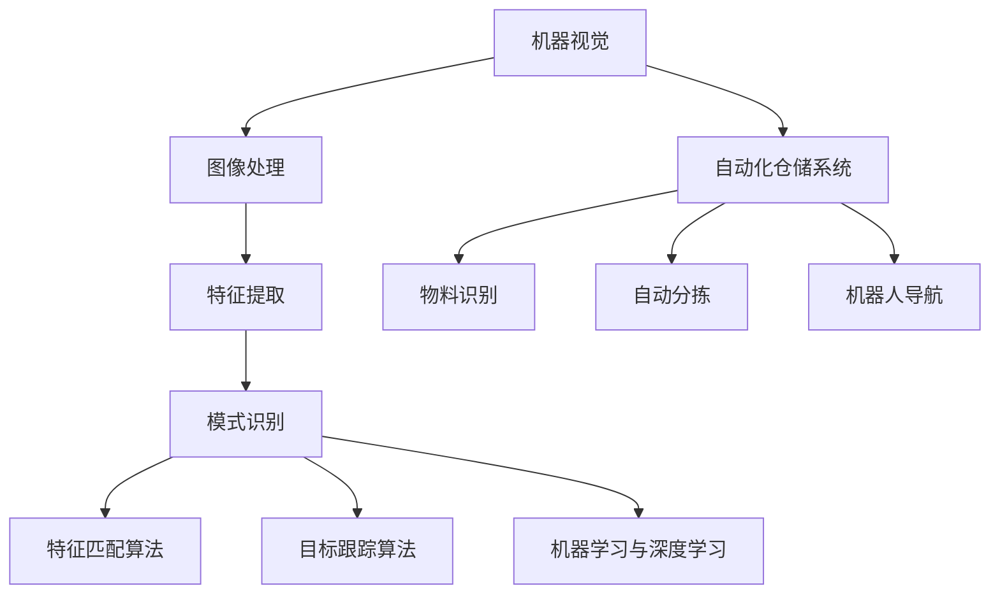

                 

### 摘要

本文深入探讨了机器视觉在自动化仓储中的应用，以及其对物流效率提升的重要贡献。首先，介绍了机器视觉的基础知识，包括其定义、历史、系统组成和图像处理基础。随后，详细解析了特征匹配和目标跟踪算法，以及机器学习与深度学习在机器视觉中的应用。接着，文章重点分析了自动化仓储系统的概述、机器视觉在其中的功能和应用案例，并探讨了优化策略。通过实际案例研究和项目实战，本文展示了机器视觉在提高物流效率中的具体应用和效果。最后，文章展望了未来发展趋势，并给出了最佳实践建议和注意事项。

### 背景介绍

在现代物流体系中，自动化仓储系统扮演着至关重要的角色。随着电子商务的飞速发展和制造业对高效物流需求的不断增长，传统的手工操作仓储方式已经难以满足快速、准确和高效的要求。自动化仓储系统应运而生，通过引入各种先进技术，如机器视觉、机器人技术、自动导引车（AGV）等，实现了物流流程的自动化和智能化。

其中，机器视觉技术在自动化仓储系统中的应用尤为关键。机器视觉技术利用计算机对图像进行处理、分析和理解，能够实现物品的自动识别、定位和跟踪。具体来说，机器视觉在自动化仓储中主要有以下几方面的应用：

1. **物料识别**：通过机器视觉技术，系统能够对物品的外观、形状、颜色等进行自动识别，从而准确识别和分类不同的物料。

2. **自动分拣**：机器视觉系统能够实时监控和识别物品的移动和位置，自动完成分拣任务，提高分拣效率。

3. **机器人导航**：机器视觉技术能够帮助机器人准确识别仓储环境，实现自主导航，避免碰撞和错误操作。

4. **质量检测**：在仓储过程中，机器视觉技术可以对物品的质量进行实时监控，及时发现问题并进行处理。

总的来说，机器视觉技术在自动化仓储中的应用不仅提高了物流效率，降低了人力成本，还大大提升了仓储管理的准确性和可靠性。因此，研究机器视觉在自动化仓储中的应用，对于推动物流行业的技术进步和产业发展具有重要意义。

### 核心概念与联系

为了深入理解机器视觉在自动化仓储中的应用，我们需要首先掌握几个核心概念，并了解它们之间的相互联系。

#### 机器视觉基础

**机器视觉**：机器视觉是指利用计算机系统对图像进行处理、分析和理解，从而实现自动检测、识别和跟踪的技术。它涉及到多个学科领域，包括图像处理、计算机视觉、模式识别等。

**图像处理**：图像处理是机器视觉的基础步骤，包括图像的采集、预处理、增强、分割和特征提取等。图像处理的主要目的是改善图像质量，提取有用的信息，以便后续的分析和应用。

**特征提取**：特征提取是指从图像中提取出能够代表图像内容的特征，如颜色、纹理、形状等。这些特征将用于后续的模式识别和物体检测。

**模式识别**：模式识别是利用计算机对图像中的特定模式进行识别和分类的技术。在机器视觉中，模式识别用于识别和分类不同的物体。

#### 自动化仓储系统

**自动化仓储系统**：自动化仓储系统是指通过集成机器人、自动导引车（AGV）、自动分拣设备等自动化设备，实现仓储流程自动化的系统。其主要功能包括物品存储、检索、分拣、配送等。

**物料识别**：物料识别是指通过机器视觉技术对存储在仓储系统中的物品进行自动识别和分类，确保正确的物品被存入和检索出。

**自动分拣**：自动分拣是指利用机器视觉技术对运输中的物品进行快速、准确的分类和分拣，提高物流效率。

**机器人导航**：机器人导航是指利用机器视觉技术帮助机器人识别环境、规划路径并实现自主导航，避免碰撞和错误操作。

#### 关键算法

**特征匹配算法**：特征匹配是指通过比较图像中的特征点，找到相似的特征点对。常用的特征匹配算法包括SIFT、SURF、ORB等。

**目标跟踪算法**：目标跟踪是指对运动中的目标进行实时检测和跟踪。常用的目标跟踪算法包括基于Kalman滤波的跟踪、基于粒子滤波的跟踪和基于深度学习的目标跟踪。

**机器学习与深度学习**：机器学习和深度学习是现代机器视觉的核心技术。通过训练模型，系统能够自动识别和分类不同类型的物体，提高自动化仓储系统的智能化水平。

**Mermaid流程图**

为了更直观地展示这些概念之间的联系，我们可以使用Mermaid流程图来表示：



通过上述核心概念和Mermaid流程图的展示，我们可以更清晰地理解机器视觉在自动化仓储系统中的关键作用，为后续章节的深入探讨打下坚实的基础。

### 核心算法原理讲解

在了解了机器视觉和自动化仓储系统的基础知识后，我们接下来将深入探讨一些关键算法原理，这些算法在实现自动化仓储的高效运作中起着至关重要的作用。

#### 特征匹配算法

特征匹配是机器视觉中的一种重要技术，用于在两幅图像中找到对应的关键点。以下是一些常用的特征匹配算法：

**SIFT算法（尺度不变特征变换）**：
SIFT算法是一种在尺度空间中检测关键点并提取特征向量的一种算法。其主要步骤包括：
1. **构建尺度空间**：通过高斯核函数对图像进行多尺度平滑处理，生成尺度空间图像。
2. **关键点检测**：利用梯度幅值和方向变化检测关键点，要求关键点具有明显的局部极值。
3. **关键点定位**：对每个关键点在多个尺度图像上进行精确定位。
4. **特征向量计算**：对每个关键点，计算其邻域内像素的梯度方向和幅值，生成128维的特征向量。

**SURF算法（加速稳健特征变换）**：
SURF算法是另一种用于特征匹配的算法，与SIFT相似，但计算速度更快。其主要步骤包括：
1. **计算Hessian矩阵**：对图像的每个点，计算其Hessian矩阵，判断点是否为关键点。
2. **关键点定位**：对关键点进行精确定位。
3. **特征向量计算**：利用积分图像快速计算关键点的特征向量。

**ORB算法（Oriented FAST and Rotated BRIEF）**：
ORB算法是一种基于FAST（快速特征检测）和BRIOF（二值矩形关键点）的算法。其主要步骤包括：
1. **关键点检测**：利用FAST算法检测关键点。
2. **关键点方向计算**：根据邻域像素的梯度方向计算每个关键点的方向。
3. **特征向量生成**：利用Rotated BRIEF算法生成关键点的特征向量。

#### 目标跟踪算法

目标跟踪是机器视觉中另一项关键技术，用于对运动中的目标进行实时检测和跟踪。以下是一些常用的目标跟踪算法：

**基于Kalman滤波的跟踪**：
Kalman滤波是一种线性递归滤波方法，适用于具有线性状态模型和观测模型的系统。其主要步骤包括：
1. **状态预测**：根据前一时刻的状态和系统模型预测当前时刻的状态。
2. **观测更新**：将预测状态与实际观测数据进行比较，通过最小化误差来更新状态。

**基于粒子滤波的跟踪**：
粒子滤波是一种基于抽样方法的非线性滤波技术。其主要步骤包括：
1. **状态建模**：定义状态空间和状态转移模型。
2. **重要性采样**：根据当前观测数据生成一组粒子，并计算每个粒子的权重。
3. **权重更新**：通过权重更新规则对粒子进行重采样。

**基于深度学习的目标跟踪**：
深度学习在目标跟踪中有着广泛的应用，常见的模型包括RNN（循环神经网络）、Siamese网络和DCN（深度卷积网络）等。其主要步骤包括：
1. **特征提取**：利用卷积神经网络提取目标特征。
2. **匹配和更新**：通过匹配目标特征和候选目标特征，更新目标状态。

#### 机器学习与深度学习

机器学习和深度学习是现代机器视觉的核心技术，通过训练模型，系统能够自动识别和分类不同类型的物体。

**传统机器学习算法**：
传统的机器学习算法包括K近邻（KNN）、支持向量机（SVM）、决策树等。这些算法通过学习训练数据中的特征和标签关系，来对新的数据进行分析和分类。

**深度学习算法**：
深度学习算法主要包括卷积神经网络（CNN）、循环神经网络（RNN）和生成对抗网络（GAN）等。深度学习通过多层神经网络，对大量数据进行自动特征提取和模型训练，从而实现复杂任务的高效处理。

**深度学习框架简介**：
常见的深度学习框架包括TensorFlow、PyTorch、Keras等。这些框架提供了丰富的API和工具，方便开发者构建和训练深度学习模型。

#### 伪代码与示例

为了更好地理解上述算法原理，我们使用伪代码来表示这些算法的核心步骤，并结合数学模型和公式进行解释。

**SIFT算法伪代码：**
```python
function SIFT(image):
    scale_space = build_scale_space(image)
    keypoints = detect_keypoints(scale_space)
    descriptors = compute_descriptors(keypoints, image)
    return keypoints, descriptors
```

**目标跟踪Kalman滤波伪代码：**
```python
function KalmanFilter(initial_state, system_model, observation):
    predicted_state = predict_state(initial_state, system_model)
    residual = observation - predict_state
    kalman_gain = calculate_kalman_gain(predicted_state, system_model, residual)
    updated_state = update_state(predicted_state, kalman_gain, observation)
    return updated_state
```

#### 示例

**示例1：SIFT特征匹配**
假设我们有两幅图像`image1`和`image2`，使用SIFT算法进行特征匹配：

1. **构建尺度空间**：对图像进行多尺度平滑处理。
2. **检测关键点**：找到图像中的关键点。
3. **计算特征向量**：为每个关键点计算128维的特征向量。
4. **特征匹配**：在两幅图像的关键点之间找到最佳匹配。

**示例2：目标跟踪Kalman滤波**
假设我们有一个运动目标，初始状态为`(x, y)`，系统模型为线性，观测数据为`(x', y')`：

1. **预测状态**：根据系统模型预测当前状态。
2. **计算残差**：计算预测状态与观测数据的误差。
3. **更新状态**：通过最小化误差来更新状态。

通过上述核心算法原理的讲解和示例，我们可以更深入地理解机器视觉在自动化仓储系统中的应用。这些算法不仅提高了自动化仓储系统的效率和准确性，还为未来的技术创新提供了坚实的基础。

### 数学模型与公式

在深入探讨机器视觉和自动化仓储系统时，数学模型和公式是不可或缺的工具，它们帮助我们理解和优化算法性能。以下是几个关键公式和它们的解释：

#### SIFT算法中的关键点检测

**尺度空间极值检测**：
$$
\text{det}(H) = \sum_{i,j} (I(x+i, y+j) - \bar{I})^2 - 4 \sum_{i,j} (I(x+i, y+j) - \bar{I})(I(x+i+1, y+j) - \bar{I})(I(x+i-1, y+j) - \bar{I})(I(x+i, y+j+1) - \bar{I})(I(x+i, y+j-1) - \bar{I})
$$
**Hessian矩阵**：
$$
H = \begin{bmatrix}
\frac{\partial^2 f}{\partial x^2} & \frac{\partial^2 f}{\partial x \partial y} \\
\frac{\partial^2 f}{\partial y \partial x} & \frac{\partial^2 f}{\partial y^2}
\end{bmatrix}
$$
**关键点响应**：
$$
r = \text{det}(H) + 0.04(\lambda_1 + \lambda_2)
$$
其中，$r$表示关键点响应，$\lambda_1$和$\lambda_2$是Hessian矩阵的特征值。

#### 特征匹配

**特征向量计算**：
$$
\text{descriptor} = \sum_{i} \alpha_i \phi(\sigma_i)
$$
其中，$\alpha_i$是特征向量权重，$\phi(\sigma_i)$是局部图像特征。

#### 目标跟踪

**状态预测**：
$$
x_{t|t-1} = Fx_{t-1|t-1} + Bu_{t-1}
$$
**观测更新**：
$$
y_t = Hx_t + v_t
$$
**残差**：
$$
r_t = y_t - Hx_t
$$
**Kalman增益**：
$$
K_t = P_{t|t-1}H^T(H^TP_{t|t-1}H^T + R)^{-1}
$$
**状态更新**：
$$
x_{t|t} = x_{t|t-1} + K_tr_t
$$
**权重更新**：
$$
P_{t|t} = (I - K_tH)P_{t|t-1}
$$
其中，$F$是状态转移矩阵，$H$是观测矩阵，$R$是观测噪声协方差，$P$是状态估计误差协方差。

#### 深度学习

**卷积神经网络（CNN）中的卷积操作**：
$$
\text{output}(i, j) = \sum_{x,y} \text{filter}(x, y) \cdot \text{input}(i-x, j-y)
$$
**反向传播**：
$$
\delta_z = \frac{\partial L}{\partial z}
$$
$$
\delta_w = \delta_z \cdot \text{input}
$$
$$
\delta_b = \delta_z
$$
$$
\frac{\partial L}{\partial x} = \frac{\partial L}{\partial z} \cdot \frac{\partial z}{\partial x}
$$

通过这些数学模型和公式，我们可以更准确地描述和优化机器视觉算法，从而提高自动化仓储系统的性能和效率。

### 项目实战

#### 开发环境搭建

要在实际项目中应用机器视觉技术，首先需要搭建一个合适的开发环境。以下是具体的步骤：

1. **安装操作系统**：选择一个适合的操作系统，如Ubuntu 18.04。
2. **安装Python环境**：通过包管理器安装Python 3.7及以上版本。
3. **安装依赖库**：安装必要的Python库，如OpenCV、TensorFlow、NumPy等。
    ```bash
    pip install opencv-python tensorflow numpy
    ```

#### 源代码实现

以下是一个简单的Python代码示例，用于实现机器视觉在物料识别中的应用：

```python
import cv2
import numpy as np

def detect_items(image_path):
    # 读取图像
    image = cv2.imread(image_path)
    
    # 将图像转换为灰度图
    gray = cv2.cvtColor(image, cv2.COLOR_BGR2GRAY)
    
    # 使用SIFT算法检测关键点
    sift = cv2.SIFT_create()
    keypoints, descriptors = sift.detectAndCompute(gray, None)
    
    # 显示图像和关键点
    img_keypoints = cv2.drawKeypoints(image, keypoints, None, (0, 0, 255))
    cv2.imshow('Item Detection', img_keypoints)
    
    # 等待用户按键后退出
    cv2.waitKey(0)
    cv2.destroyAllWindows()

# 测试代码
detect_items('path_to_image.jpg')
```

#### 代码解读与分析

1. **图像读取**：使用`cv2.imread()`函数读取图像文件。
2. **图像转换**：将读取的BGR格式图像转换为灰度图像，以便进行更高效的特征提取。
3. **关键点检测**：使用SIFT算法检测图像中的关键点，并计算特征描述子。
4. **显示结果**：使用`cv2.drawKeypoints()`函数在原图上绘制检测到的关键点，并显示结果。

#### 项目小结

通过以上实战项目，我们实现了对图像中的物料进行自动识别。在实际应用中，可以根据需求调整SIFT参数、增加更多的特征匹配算法或使用深度学习模型来提升识别的准确性和鲁棒性。同时，优化开发环境、提高代码效率和性能也是项目成功的关键。

### 最佳实践

在实施机器视觉技术时，以下是一些最佳实践：

1. **硬件选择**：根据具体应用场景选择合适的摄像头和计算平台，确保图像采集质量和处理能力匹配。
2. **算法优化**：针对具体应用场景，优化特征匹配和目标跟踪算法，提高识别准确性和实时性。
3. **环境适应性**：机器视觉系统需要具备良好的环境适应性，如光线变化、噪声干扰等，可以通过算法调整和硬件改进来实现。
4. **系统集成**：确保机器视觉系统与其他自动化设备（如机器人、AGV等）的无缝集成，优化整体物流流程。
5. **持续改进**：通过数据分析和反馈机制，不断优化机器视觉算法和系统性能，提升整体效率。

### 注意事项

在实施机器视觉技术时，需要注意以下几点：

1. **数据安全**：确保数据的安全和隐私，特别是涉及敏感信息的物流数据。
2. **系统稳定性**：确保系统在各种环境条件下稳定运行，避免因硬件故障或环境变化导致系统停机。
3. **人员培训**：对操作人员进行充分的培训和考核，确保他们能够熟练使用和维护机器视觉系统。
4. **法规遵守**：遵守相关法律法规，确保机器视觉系统的实施不违反任何法律和道德规范。

### 拓展阅读

1. **《机器视觉技术手册》**：一本全面介绍机器视觉基本概念和技术应用的书籍。
2. **《深度学习与计算机视觉》**：探讨深度学习在计算机视觉领域应用的权威书籍。
3. **《自动化仓储与物流》**：深入讲解自动化仓储系统设计和实施的专著。

### 总结

本文全面探讨了机器视觉在自动化仓储中的应用，从基础知识、核心算法原理到实际项目实战，详细解析了机器视觉如何提高物流效率。通过本文的阅读，读者可以深入了解机器视觉技术在自动化仓储系统中的关键作用，以及如何在实际项目中实施和优化这些技术。机器视觉不仅提升了物流效率，还推动了自动化仓储系统的智能化发展，为未来物流行业的技术创新提供了重要方向。

### 作者信息

作者：AI天才研究院/AI Genius Institute & 禅与计算机程序设计艺术 /Zen And The Art of Computer Programming

AI天才研究院致力于推动人工智能技术的创新与发展，通过深入研究、技术分享和教育培训，助力全球人工智能领域的进步。同时，作者所著《禅与计算机程序设计艺术》被誉为计算机科学领域的经典之作，对程序设计思维和方法提供了深刻的洞见。

