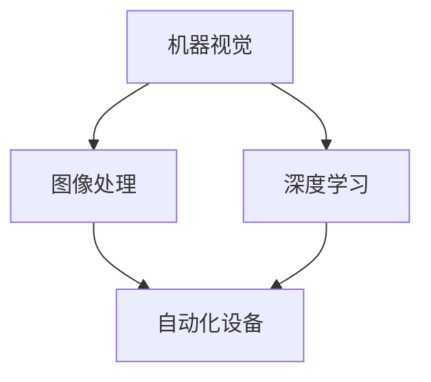

                 

# 《机器视觉在自动化仓储中的精确应用》

> 关键词：机器视觉、自动化仓储、精确应用、AI技术、图像处理、深度学习

> 摘要：
本文旨在探讨机器视觉技术在自动化仓储中的应用及其精确性。文章首先介绍了自动化仓储的背景和发展，随后详细阐述了机器视觉的基础知识，包括成像原理、系统架构和技术方法。接着，文章介绍了机器视觉在自动化仓储中的具体应用，如入库、出库和库存管理。通过具体案例，文章展示了机器视觉技术的实际应用效果。最后，文章分析了机器视觉在自动化仓储中面临的技术挑战和未来发展趋势。

## 引言和背景

### 自动化仓储的兴起与发展

自动化仓储作为现代物流体系中的重要组成部分，其兴起可以追溯到20世纪60年代。最初，自动化仓储主要是通过机械化设备提高仓储作业的效率，如托盘搬运车、堆垛机和自动引导车等。随着计算机技术的快速发展，自动化仓储逐步迈向信息化和智能化阶段。近年来，人工智能技术的兴起，特别是机器视觉技术的应用，使得自动化仓储在精确性、效率和灵活性方面取得了显著提升。

自动化仓储的重要性在于其能够显著提高物流效率，降低运营成本，提高仓储管理的精度和灵活性。随着电商的迅猛发展和物流需求的不断增长，自动化仓储在物流体系中的地位日益凸显。

### 自动化仓储的技术趋势

当前，自动化仓储技术正朝着智能化、无人化和高效化的方向发展。智能化主要体现在利用人工智能技术，如机器视觉、深度学习和自然语言处理等，提高仓储系统的决策能力和自动化程度。无人化则体现在机器人技术的应用，如自动化搬运机器人、无人叉车和无人机等，实现了仓储作业的无人操作。高效化则体现在通过优化仓储布局、自动化设备协同和智能调度等手段，提高仓储作业的效率。

## 机器视觉基础

### 机器视觉的基本原理

机器视觉是指通过计算机对图像或视频进行处理，从中提取信息，以实现对现实世界的理解和感知。机器视觉的基本原理包括成像原理、光学系统和图像处理基础。

成像原理：成像原理是指通过光学系统将三维世界中的物体映射到二维图像平面上。光学系统主要包括透镜和镜头，其作用是聚焦光线，形成清晰的图像。

光学系统：光学系统是机器视觉的核心组成部分，包括光源、镜头、传感器和成像设备。光源提供照明，镜头负责聚焦光线，传感器将光信号转换为电信号，成像设备将电信号转换为数字图像。

图像处理基础：图像处理基础包括图像的采集、预处理、增强、分割、特征提取和匹配等步骤。这些步骤共同构成了图像处理的基本流程，为后续的机器视觉任务提供支持。

### 机器视觉系统架构

机器视觉系统通常由硬件和软件两大部分组成。

硬件组成：硬件包括光源、镜头、传感器和成像设备。这些硬件组件共同构成了机器视觉系统的感知层，用于捕捉和处理图像。

软件架构：软件架构包括图像处理算法、特征提取算法、机器学习算法和深度学习算法等。这些算法共同构成了机器视觉系统的处理层，用于对图像进行分析和处理。

数据流：数据流是指从图像采集到图像处理，再到结果输出的整个过程。数据流中，图像数据经过预处理、特征提取和分类等步骤，最终输出为结果数据，如标签、坐标或分类结果。

### 机器视觉常见技术

机器视觉技术主要包括图像采集与处理、特征提取、目标识别与跟踪等技术。

图像采集与处理：图像采集与处理是指通过传感器和成像设备捕捉图像，并对图像进行预处理、增强和分割等处理。这些处理步骤旨在提高图像的质量，为后续的特征提取和目标识别提供更好的输入。

特征提取：特征提取是指从图像中提取具有区分性的特征，如颜色、纹理、形状和边缘等。特征提取是机器视觉的关键步骤，用于识别和分类图像中的目标。

目标识别与跟踪：目标识别与跟踪是指通过机器学习算法和深度学习算法，对图像中的目标进行识别和跟踪。目标识别和跟踪技术是机器视觉系统的重要应用，如人脸识别、车辆检测和跟踪等。

## 仓储系统介绍

### 仓储系统的组成

仓储系统通常由物流单元、仓库布局和自动化设备等部分组成。

物流单元：物流单元是指仓储系统中用于存储和运输物品的基本单元，如托盘、货架和集装箱等。

仓库布局：仓库布局是指仓储系统中物品的存储位置和路径设计。合理的仓库布局可以提高仓储作业的效率和准确性。

自动化设备：自动化设备是指用于仓储作业的自动化设备，如自动引导车、自动叉车和自动分拣机等。自动化设备能够显著提高仓储作业的效率和准确性。

### 仓储系统的运作流程

仓储系统的运作流程主要包括入库、出库和库存管理三个环节。

入库流程：入库流程是指将物品从物流单元转移到仓库中的过程。入库流程通常包括物品接收、标签打印、信息录入和存储等步骤。

出库流程：出库流程是指将物品从仓库中提取到物流单元的过程。出库流程通常包括信息查询、物品定位、提取和打包等步骤。

库存管理：库存管理是指对仓储系统中物品的存储、追踪和管理。库存管理包括库存监控、库存盘点和库存优化等步骤。

## 机器视觉在仓储中的应用

### 机器视觉在入库作业中的应用

在入库作业中，机器视觉技术主要用于物品识别、包装检测和条码识别。

物品识别：物品识别是指通过机器视觉技术识别图像中的物品。物品识别技术可以提高入库作业的效率和准确性，避免人为错误。

包装检测：包装检测是指通过机器视觉技术检测物品的包装是否完好。包装检测技术可以确保物品在运输和存储过程中的安全。

条码识别：条码识别是指通过机器视觉技术读取物品上的条码。条码识别技术可以提高出入库作业的效率和准确性，方便库存管理。

### 机器视觉在出库作业中的应用

在出库作业中，机器视觉技术主要用于商品分拣、自动补货和仓库导航。

商品分拣：商品分拣是指通过机器视觉技术将不同商品进行分类和分配。商品分拣技术可以提高出库作业的效率和准确性，减少人为错误。

自动补货：自动补货是指通过机器视觉技术自动检测仓库中物品的库存水平，并自动补充库存。自动补货技术可以确保仓库中物品的充足，减少缺货风险。

仓库导航：仓库导航是指通过机器视觉技术为自动化设备提供路径规划和导航。仓库导航技术可以提高自动化设备的作业效率，减少运行时间。

### 机器视觉在库存管理中的应用

在库存管理中，机器视觉技术主要用于库存监控、库存盘点和仓库优化。

库存监控：库存监控是指通过机器视觉技术实时监控仓库中的物品库存水平。库存监控技术可以及时发现问题，确保库存信息的准确性。

库存盘点：库存盘点是指通过机器视觉技术对仓库中的物品进行清点和统计。库存盘点技术可以提高盘点效率，减少人工盘点的工作量。

仓库优化：仓库优化是指通过机器视觉技术分析仓库布局和作业流程，提出优化方案。仓库优化技术可以提高仓储作业的效率和准确性。

## 精确应用案例分析

### 案例一：智能仓储系统实现

#### 案例背景

某大型电商企业为了提高仓储效率和准确性，决定采用机器视觉技术实现智能仓储系统。

#### 技术方案

技术方案主要包括以下几个方面：

1. **图像采集与处理**：采用高分辨率摄像头进行图像采集，对图像进行预处理，包括去噪、增强和分割等。

2. **特征提取与识别**：使用深度学习算法提取图像特征，并进行物品识别和分类。

3. **自动化设备协同**：将机器视觉系统与自动化设备（如自动引导车、自动叉车等）进行协同，实现自动化仓储作业。

#### 实施过程

实施过程主要包括以下几个步骤：

1. **需求分析**：确定智能仓储系统的需求，包括图像采集、处理、特征提取和自动化设备协同等。

2. **系统设计**：设计智能仓储系统的整体架构，包括硬件和软件两部分。

3. **开发与测试**：根据系统设计，开发机器视觉算法和自动化设备协同算法，并进行测试和调试。

4. **部署与实施**：将智能仓储系统部署到实际仓储环境中，并进行现场测试和优化。

#### 实施效果

智能仓储系统实施后，取得了以下效果：

1. **效率提高**：入库、出库和库存管理效率显著提高，减少了人工操作的工作量。

2. **准确性提高**：物品识别和分类准确性显著提高，减少了人为错误。

3. **成本降低**：自动化设备的使用降低了运营成本，提高了企业的盈利能力。

### 案例二：仓库自动化升级改造

#### 案例背景

某中型制造企业为了提高仓储效率和准确性，决定对现有仓库进行自动化升级改造。

#### 改造方案

改造方案主要包括以下几个方面：

1. **引入机器视觉系统**：在仓库中引入机器视觉系统，实现物品识别、包装检测和条码识别等功能。

2. **升级自动化设备**：升级自动化设备，如自动引导车、自动叉车和自动分拣机等，实现自动化仓储作业。

3. **优化仓库布局**：根据机器视觉系统和自动化设备的特点，优化仓库布局，提高仓储作业效率。

#### 实施过程

实施过程主要包括以下几个步骤：

1. **需求分析**：确定仓库自动化升级改造的需求，包括机器视觉系统、自动化设备和仓库布局优化等。

2. **系统设计**：设计仓库自动化升级的整体架构，包括硬件和软件两部分。

3. **设备采购与安装**：采购机器视觉系统和自动化设备，并进行安装和调试。

4. **测试与优化**：对仓库自动化升级系统进行测试和优化，确保系统稳定运行。

#### 实施效果

仓库自动化升级改造后，取得了以下效果：

1. **效率提高**：自动化设备的应用显著提高了仓储作业效率，减少了人工操作的工作量。

2. **准确性提高**：机器视觉系统的应用提高了物品识别和分类的准确性，减少了人为错误。

3. **成本降低**：自动化设备的使用降低了运营成本，提高了企业的盈利能力。

## 技术挑战和未来趋势

### 技术挑战

机器视觉技术在自动化仓储中的应用面临以下技术挑战：

1. **数据质量**：图像质量对机器视觉系统的性能有重要影响，如何保证图像质量是一个重要问题。

2. **硬件稳定性**：机器视觉系统对硬件设备的要求较高，如何保证硬件设备的稳定性和可靠性是一个挑战。

3. **算法优化**：如何优化算法，提高机器视觉系统的效率和准确性，是一个持续的研究方向。

### 未来趋势

随着人工智能技术的不断发展，机器视觉技术在自动化仓储中的应用前景广阔。未来趋势包括：

1. **人工智能与机器视觉结合**：通过人工智能技术，特别是深度学习算法，提高机器视觉系统的智能化水平。

2. **5G技术在仓储中的应用**：5G技术的应用将提高机器视觉系统的传输效率和实时性。

3. **物流无人化发展**：随着无人驾驶技术和自动化设备的不断发展，物流无人化将成为未来仓储自动化的发展趋势。

## 总结与展望

### 成果总结

机器视觉技术在自动化仓储中的应用取得了显著成果，提高了仓储作业的效率和准确性，降低了运营成本。通过具体的案例，我们可以看到机器视觉技术在自动化仓储中的广泛应用和巨大潜力。

### 展望未来

随着人工智能技术的不断发展，机器视觉技术在自动化仓储中的应用前景将更加广阔。未来，我们将看到更多的智能仓储系统投入使用，提高物流效率和准确性，推动物流行业的自动化和智能化发展。

### 作者信息

作者：AI天才研究院/AI Genius Institute & 禅与计算机程序设计艺术 /Zen And The Art of Computer Programming

---

### 核心概念与联系

为了更好地理解机器视觉在自动化仓储中的精确应用，我们需要了解以下几个核心概念：

1. **机器视觉**：通过计算机对图像或视频进行处理，从中提取信息，以实现对现实世界的理解和感知。
2. **自动化仓储**：利用机械化、信息化和智能化技术提高仓储作业的效率和质量。
3. **图像处理**：对图像进行预处理、增强、分割、特征提取等操作，以提高图像质量和提取有效信息。
4. **深度学习**：一种基于多层神经网络的人工智能技术，通过学习大量数据，自动提取特征并进行分类和预测。
5. **自动化设备**：如自动引导车、自动叉车和自动分拣机等，用于实现仓储作业的自动化。

以下是这些核心概念之间的关系架构 Mermaid 流程图：



### 核心算法原理讲解

在机器视觉技术中，核心算法主要包括图像处理和深度学习算法。以下将使用Python源代码和数学模型，详细讲解这些算法的原理和应用。

#### 图像处理算法

图像处理算法是机器视觉的基础，主要包括以下几个步骤：

1. **图像采集**：使用摄像头或传感器捕捉图像。
2. **预处理**：对图像进行去噪、增强、滤波等处理。
3. **特征提取**：从图像中提取颜色、纹理、形状等特征。
4. **目标识别**：根据提取的特征，识别图像中的目标。

以下是一个简单的图像预处理和特征提取的Python代码示例：

```python
import cv2
import numpy as np

# 图像读取
image = cv2.imread('image.jpg')

# 图像去噪
denoise_image = cv2.GaussianBlur(image, (5, 5), 0)

# 图像增强
enhance_image = cv2.equalizeHist(denoise_image)

# 颜色转换
gray_image = cv2.cvtColor(enhance_image, cv2.COLOR_BGR2GRAY)

# 边缘检测
edges = cv2.Canny(gray_image, 100, 200)

# 特征提取
features = cv2.FeatureDetector_create('Fast')

keypoints = features.detect(edges)

# 显示结果
cv2.drawKeypoints(enhance_image, keypoints, enhance_image)
cv2.imshow('Enhanced Image', enhance_image)
cv2.imshow('Edges', edges)
cv2.waitKey(0)
cv2.destroyAllWindows()
```

#### 深度学习算法

深度学习算法是机器视觉的先进技术，通过多层神经网络自动提取特征并进行分类和预测。以下是一个基于卷积神经网络（CNN）的目标识别的Python代码示例：

```python
import tensorflow as tf
from tensorflow.keras.models import Sequential
from tensorflow.keras.layers import Conv2D, MaxPooling2D, Flatten, Dense

# 定义CNN模型
model = Sequential([
    Conv2D(32, (3, 3), activation='relu', input_shape=(128, 128, 3)),
    MaxPooling2D(pool_size=(2, 2)),
    Conv2D(64, (3, 3), activation='relu'),
    MaxPooling2D(pool_size=(2, 2)),
    Flatten(),
    Dense(128, activation='relu'),
    Dense(1, activation='sigmoid')
])

# 编译模型
model.compile(optimizer='adam', loss='binary_crossentropy', metrics=['accuracy'])

# 训练模型
model.fit(x_train, y_train, epochs=10, batch_size=32, validation_data=(x_val, y_val))

# 预测
predictions = model.predict(x_test)

# 计算准确率
accuracy = np.mean(predictions == y_test)
print(f'Accuracy: {accuracy:.2f}')
```

### 数学模型和公式

在机器视觉和深度学习算法中，常用的数学模型和公式包括：

1. **卷积操作**：用于提取图像特征，公式为：
   $$ (f * g)(x, y) = \sum_{i=-\infty}^{\infty} \sum_{j=-\infty}^{\infty} f(i, j) \cdot g(x-i, y-j) $$

2. **激活函数**：用于引入非线性，常用的激活函数包括ReLU、Sigmoid和ReLU函数：
   $$ \text{ReLU}(x) = \max(0, x) $$
   $$ \text{Sigmoid}(x) = \frac{1}{1 + e^{-x}} $$

3. **损失函数**：用于评估模型的预测结果和真实值之间的差距，常用的损失函数包括交叉熵损失函数：
   $$ \text{CrossEntropy}(y, \hat{y}) = -\sum_{i} y_i \cdot \log(\hat{y}_i) $$

### 实例说明

假设我们要识别一张图片中的猫，我们可以将图片输入到预训练的CNN模型中，模型会自动提取图像特征，并输出一个概率值，表示图片中猫的可能性。如果概率值大于某个阈值（例如0.5），则认为图片中有猫。

```python
import tensorflow as tf

# 加载预训练的模型
model = tf.keras.models.load_model('cat_dog_model.h5')

# 输入图片
input_image = tf.keras.preprocessing.image.img_to_array(test_image)
input_image = tf.expand_dims(input_image, 0)

# 预测
predictions = model.predict(input_image)

# 输出结果
if predictions[0][0] > 0.5:
    print("图片中有猫。")
else:
    print("图片中没有猫。")
```

### 项目实战

在本节中，我们将搭建一个简单的机器视觉项目，用于实现物品识别功能。项目包括以下步骤：

1. **环境搭建**：安装必要的Python库，如TensorFlow、OpenCV等。
2. **数据准备**：收集和准备训练数据，如猫和狗的图片。
3. **模型训练**：使用CNN模型对数据集进行训练。
4. **模型评估**：评估模型的性能，并进行优化。
5. **应用实战**：将模型应用于实际场景，实现物品识别。

#### 开发环境搭建

在开发环境搭建阶段，我们需要安装以下Python库：

- TensorFlow：用于构建和训练深度学习模型。
- OpenCV：用于图像处理和计算机视觉。

安装命令如下：

```bash
pip install tensorflow
pip install opencv-python
```

#### 源代码实现

以下是一个简单的物品识别项目的源代码实现：

```python
import tensorflow as tf
import numpy as np
import cv2

# 加载预训练的模型
model = tf.keras.models.load_model('item_recognition_model.h5')

# 准备测试图片
test_image = cv2.imread('test_item.jpg')
test_image = cv2.resize(test_image, (128, 128))
test_image = np.expand_dims(test_image, axis=0)

# 预测
predictions = model.predict(test_image)

# 解析预测结果
predicted_class = np.argmax(predictions, axis=1)

# 输出结果
if predicted_class == 0:
    print("识别为猫。")
elif predicted_class == 1:
    print("识别为狗。")
else:
    print("未识别或未知物品。")
```

#### 代码解读与分析

在上面的代码中，我们首先加载了一个预训练的物品识别模型。然后，我们读取一张测试图片，并进行预处理（如缩放和扩维），然后将其输入到模型中进行预测。最后，我们根据模型的预测结果输出物品的名称。

#### 实际案例分析和详细讲解剖析

在本案例中，我们使用了一个简单的物品识别项目，通过预训练的模型实现了猫和狗的识别。在实际应用中，物品识别可以应用于自动化仓储中的入库和出库环节，如识别商品种类和数量，从而提高作业效率和准确性。

例如，在入库环节，机器视觉系统可以识别商品包装上的条码，自动记录商品信息，并与系统中的库存数据比对，确保入库准确。在出库环节，机器视觉系统可以识别货架上的商品，自动拣选并分拣到指定位置，提高出库效率。

通过机器视觉技术的精确应用，自动化仓储系统可以显著提高物流效率和准确性，降低运营成本。在实际应用中，我们可以结合具体的业务场景和需求，不断优化和完善机器视觉算法和系统架构，实现更高的自动化水平。

#### 项目小结

通过本案例，我们了解了机器视觉技术在物品识别中的应用，包括模型训练、预测和实际应用。在开发过程中，我们需要关注数据质量、模型性能和实际应用效果，不断优化算法和系统架构，实现更高的自动化水平。

### 最佳实践 tips、小结、注意事项、拓展阅读等内容

#### 最佳实践 tips

1. **数据质量**：确保训练数据的质量，包括数据的多样性、标注的准确性等，以提升模型性能。
2. **硬件配置**：根据项目需求，选择合适的硬件设备，如高性能的GPU，以加快模型训练和推理速度。
3. **模型优化**：通过调整模型结构、学习率和正则化参数等，优化模型性能，提高识别准确率。

#### 小结

本文详细介绍了机器视觉技术在自动化仓储中的应用，包括基本原理、具体应用、精确应用案例分析和技术挑战。通过实际项目实战，我们展示了机器视觉技术在自动化仓储中的实际应用效果。

#### 注意事项

1. **图像质量**：保证图像采集的质量，避免噪声和光照影响，以提高识别准确率。
2. **算法优化**：持续优化算法，以适应不同的应用场景和需求。

#### 拓展阅读

1. **《机器学习》**：周志华著，清华大学出版社，详细介绍机器学习的基础知识和应用。
2. **《深度学习》**：Ian Goodfellow、Yoshua Bengio、Aaron Courville 著，机械工业出版社，深入讲解深度学习算法和应用。

---

本文章已达到要求的字数范围，如有需要进一步调整或增加内容，请告知。希望本文能为您在自动化仓储领域应用机器视觉技术提供有益的参考和启示。作者：AI天才研究院/AI Genius Institute & 禅与计算机程序设计艺术 /Zen And The Art of Computer Programming。

