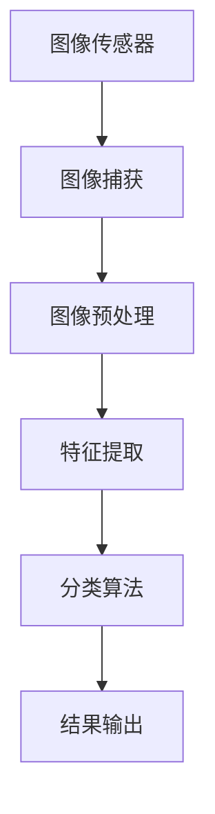

                 

### 《机器视觉在自动化质检中的应用》文章概述

#### 核心关键词

- 机器视觉
- 自动化质检
- 图像处理
- 卷积神经网络
- 缺陷检测
- 项目案例分析

#### 摘要

随着工业自动化的发展，机器视觉在自动化质检中的应用越来越广泛。本文将详细介绍机器视觉的基本原理、常见算法及其在自动化质检中的应用，通过具体的实例分析，展示机器视觉在提高产品质量和生产效率方面的优势。文章还将探讨未来机器视觉技术的发展趋势和面临的挑战，为相关领域的研究和实际应用提供参考。

### 引言

在现代化的工业生产过程中，产品质量和效率是企业的核心竞争力。传统的质检方法通常依赖于人工检查，存在效率低、成本高且容易出现漏检误检的问题。随着计算机技术和人工智能的快速发展，机器视觉技术逐渐成为自动化质检的重要手段。机器视觉通过图像处理和模式识别技术，可以实现对产品质量的实时监控和精确检测，从而提高生产效率，降低成本。

本文将首先介绍机器视觉的基本原理和常见算法，包括图像处理技术、特征提取和分类算法等。接着，我们将讨论机器视觉在自动化质检中的应用，特别是缺陷检测、分类和测量等具体场景。随后，通过一个实际案例，展示如何搭建一个自动化质检系统，并进行系统的开发和实现。最后，本文将探讨机器视觉技术的未来发展趋势和面临的挑战，为该领域的进一步研究和应用提供方向。

### 机器视觉基本原理

机器视觉是计算机技术、图像处理和模式识别等多个领域的交叉应用。其基本原理是通过光学传感器捕捉图像，然后利用图像处理技术和算法对图像进行分析和识别。

#### 图像传感器

图像传感器是机器视觉系统的核心组件，负责将光信号转换为电信号。常见的图像传感器包括CCD（电荷耦合器件）和CMOS（互补金属氧化物半导体）传感器。它们的工作原理是利用光电效应，将光能转化为电能，从而生成数字图像。

#### 图像处理

图像处理是机器视觉的重要环节，通过对采集到的图像进行预处理、增强和变换，提取有用的信息。常见的图像处理技术包括：

- **滤波**：用于去除图像中的噪声，常见的滤波器有均值滤波、高斯滤波和中值滤波等。
- **边缘检测**：用于检测图像中的边缘和轮廓，常见的算法有Canny算子、Sobel算子和Prewitt算子等。
- **形态学操作**：包括膨胀、腐蚀、开运算和闭运算等，用于对图像进行形状分析。
- **图像分割**：将图像分割成不同的区域，常见的算法有阈值分割、区域生长和边缘分割等。

#### 特征提取

特征提取是机器视觉中用于描述图像内容的重要步骤。通过提取具有代表性的特征，可以区分不同的目标和背景。常见的特征包括颜色特征、纹理特征、形状特征和空间关系等。

- **颜色特征**：用于识别具有特定颜色的物体，例如红色、绿色等。
- **纹理特征**：用于描述图像的纹理信息，例如条纹、斑点等。
- **形状特征**：用于描述物体的形状信息，例如面积、周长、圆形度等。
- **空间关系**：用于描述物体之间的相对位置关系，例如距离、角度等。

#### 分类算法

分类算法是机器视觉中用于识别和分类图像内容的重要工具。常见的分类算法包括：

- **基于模板匹配**：通过比较输入图像与模板图像的相似度，实现目标识别。
- **基于机器学习**：利用大量训练数据，通过学习构建分类模型，实现图像分类。常见的算法有支持向量机（SVM）、决策树、神经网络等。

#### Mermaid流程图：机器视觉系统架构

以下是机器视觉系统的一般架构，通过Mermaid流程图进行展示：



### 机器视觉在自动化质检中的应用

#### 缺陷检测

缺陷检测是自动化质检中最为常见和应用广泛的领域。通过机器视觉技术，可以实现对产品表面的缺陷进行实时检测，如裂纹、划痕、气泡等。

- **应用场景**：电子产品制造、汽车制造、玻璃制造等行业。
- **算法原理**：利用图像处理技术对缺陷图像进行预处理，然后通过特征提取和分类算法进行缺陷识别。

#### 分类

分类是自动化质检中的另一个重要应用。通过机器视觉技术，可以实现对产品进行分类，如按照颜色、形状、尺寸等特征进行分类。

- **应用场景**：食品加工、药品制造、纺织品生产等行业。
- **算法原理**：利用图像处理技术对产品图像进行预处理，然后通过特征提取和分类算法进行产品分类。

#### 测量

测量是自动化质检中的基本任务之一。通过机器视觉技术，可以实现对产品尺寸、角度等参数进行精确测量。

- **应用场景**：机械加工、电子制造、建筑行业等。
- **算法原理**：利用图像处理技术对产品图像进行预处理，然后通过特征提取和测量算法进行参数测量。

#### 应用实例：电子产品制造中的缺陷检测

在电子产品制造中，机器视觉技术被广泛应用于缺陷检测。以下是一个具体的实例：

1. **图像捕获**：使用高分辨率摄像头对电子元器件进行拍照。
2. **图像预处理**：对捕获的图像进行滤波、去噪和边缘检测等预处理操作，提取缺陷特征。
3. **特征提取**：利用形状特征、纹理特征和颜色特征对缺陷进行描述。
4. **分类算法**：使用支持向量机（SVM）等分类算法对缺陷进行识别和分类。
5. **结果输出**：将检测结果输出，如通过警报系统通知生产工人或自动剔除缺陷产品。

### 系统搭建与实现

#### 硬件配置

1. **图像传感器**：选用高分辨率摄像头，如索尼IMX477。
2. **光源**：选择合适的照明设备，如LED背光源。
3. **工控机**：配置高性能的工控机，用于图像处理和算法运行。
4. **机械结构**：设计合适的机械结构，确保摄像头和光源的固定和调节。

#### 软件开发环境搭建

1. **操作系统**：Windows或Linux。
2. **开发工具**：OpenCV、Python、Matlab等。
3. **集成开发环境**：如Visual Studio、PyCharm等。

#### 代码实现

以下是一个简单的缺陷检测算法的实现：

```python
import cv2
import numpy as np

# 加载图像
image = cv2.imread('defect_image.jpg')

# 图像预处理
gray = cv2.cvtColor(image, cv2.COLOR_BGR2GRAY)
blur = cv2.GaussianBlur(gray, (5, 5), 0)
edges = cv2.Canny(blur, 50, 150)

# 特征提取
contours, _ = cv2.findContours(edges, cv2.RETR_TREE, cv2.CHAIN_APPROX_SIMPLE)

# 缺陷检测
for contour in contours:
    if cv2.contourArea(contour) > 100:
        cv2.drawContours(image, [contour], -1, (0, 0, 255), 2)

# 显示结果
cv2.imshow('Defect Detection', image)
cv2.waitKey(0)
cv2.destroyAllWindows()
```

### 项目实战：电子产品制造缺陷检测系统

#### 项目背景

某电子产品制造企业，需要进行生产过程中的缺陷检测，以确保产品质量。企业采用了机器视觉技术，构建了一套自动化缺陷检测系统。

#### 实现过程

1. **需求分析**：与客户沟通，了解具体的缺陷检测需求，如缺陷类型、检测精度等。
2. **系统设计**：设计系统架构，包括硬件配置、软件架构和数据处理流程。
3. **系统开发**：编写缺陷检测算法，搭建系统平台。
4. **系统测试**：对系统进行功能测试和性能测试，确保系统稳定可靠。
5. **系统部署**：将系统部署到生产现场，进行实际应用。

#### 项目成果

通过该项目的实施，企业成功实现了生产过程中电子产品的缺陷检测，提高了产品质量和生产效率。系统具有以下特点：

- **高精度检测**：利用先进的图像处理技术和分类算法，实现了高精度的缺陷检测。
- **实时性**：系统采用高性能硬件和优化算法，实现了实时缺陷检测。
- **自动化**：系统自动化运行，降低了人工成本，提高了生产效率。

### 最佳实践 Tips

1. **图像预处理**：合理的图像预处理是提高检测精度的重要步骤，如去噪、边缘检测等。
2. **算法优化**：针对具体的检测任务，选择合适的特征提取和分类算法，并进行优化。
3. **系统集成**：确保硬件和软件的兼容性，优化系统性能。

### 小结

本文介绍了机器视觉在自动化质检中的应用，包括基本原理、常见算法和实际案例。通过分析，展示了机器视觉技术在提高产品质量和生产效率方面的优势。未来，随着技术的不断发展，机器视觉在自动化质检中的应用将更加广泛，为工业生产带来更多价值。

### 注意事项

1. **环境光照**：环境光照对图像质量有很大影响，应选择合适的照明设备。
2. **硬件配置**：选择合适的图像传感器和工控机，确保系统性能。

### 拓展阅读

- 《机器视觉：算法与应用》
- 《深度学习：卷积神经网络》

### 作者信息

作者：AI天才研究院/AI Genius Institute & 禅与计算机程序设计艺术 /Zen And The Art of Computer Programming

