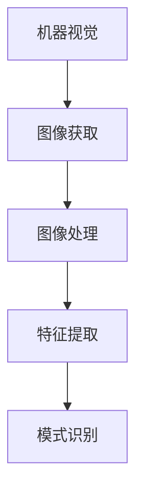
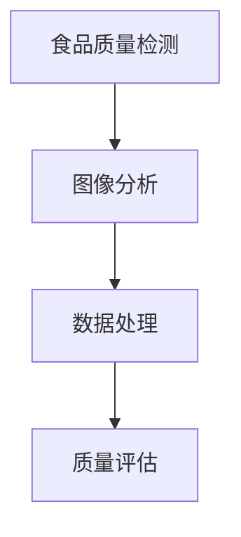
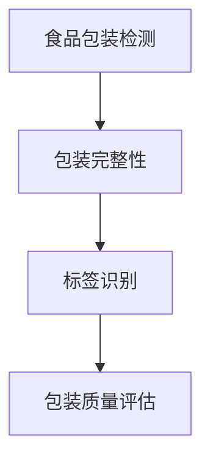
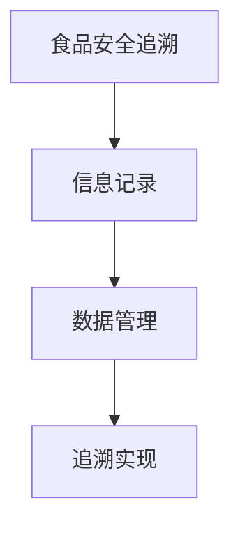
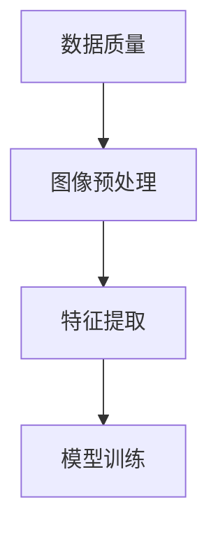
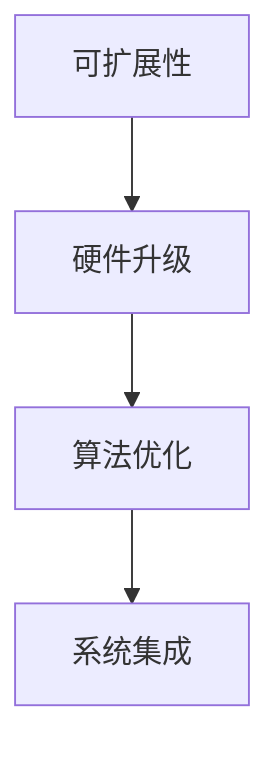
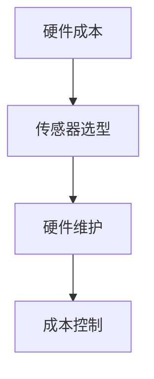
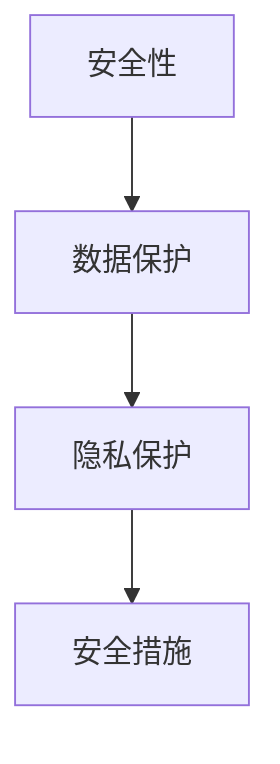

                 

### 设计细节：完整Markdown格式

下面是按照要求设计好的完整Markdown格式的《机器视觉在自动化食品安全检测中的应用：保障食品质量》一书的目录大纲，包含所有必要的核心内容。

```markdown
# 《机器视觉在自动化食品安全检测中的应用：保障食品质量》目录大纲

## 第一部分：机器视觉技术基础

### 第1章：机器视觉基本原理

#### 1.1 机器视觉的定义与发展历程

- 背景介绍
- 发展历程
- 核心概念与联系



#### 1.2 机器视觉的核心技术

- 图像预处理
- 特征提取
- 机器学习与深度学习

#### 1.3 机器视觉系统架构

- 硬件组件
- 软件架构
- 系统集成

#### 1.4 机器视觉图像处理算法

- 图像增强
- 边缘检测
- 目标跟踪

## 第二部分：食品安全检测中的机器视觉应用

### 第2章：食品质量检测中的机器视觉技术

#### 2.1 食品质量检测的需求与挑战

- 背景介绍
- 核心概念与联系



#### 2.2 机器视觉在食品质量检测中的应用

- 食品外观检测
- 食品成分分析
- 食品安全性检测

#### 2.3 食品质量检测中的关键问题

- 准确性
- 可重复性
- 实时性

#### 2.4 案例分析：食品质量检测的机器视觉应用实例

- 应用实例1
- 应用实例2
- 应用效果分析

### 第3章：食品包装检测中的机器视觉

#### 3.1 食品包装检测的重要性

- 背景介绍
- 核心概念与联系



#### 3.2 机器视觉在食品包装检测中的应用

- 包装完整性检测
- 标签自动识别
- 包装质量监控

#### 3.3 食品包装检测中的关键技术

- 视觉检测算法
- 传感器技术
- 数据处理与分析

#### 3.4 案例分析：食品包装检测的机器视觉应用实例

- 应用实例1
- 应用实例2
- 应用效果分析

### 第4章：食品安全追溯中的机器视觉

#### 4.1 食品安全追溯的概念与意义

- 背景介绍
- 核心概念与联系



#### 4.2 机器视觉在食品安全追溯中的应用

- 条码与二维码识别
- 标签自动识别
- 食品溯源系统构建

#### 4.3 食品安全追溯中的关键技术

- 数据采集
- 数据存储
- 数据分析

#### 4.4 案例分析：食品安全追溯的机器视觉应用实例

- 应用实例1
- 应用实例2
- 应用效果分析

## 第三部分：机器视觉在食品安全检测中的挑战与解决方案

### 第5章：机器视觉在食品安全检测中的挑战

#### 5.1 数据质量与准确性挑战

- 背景介绍
- 核心概念与联系



#### 5.2 可扩展性与效率挑战

- 背景介绍
- 核心概念与联系



#### 5.3 硬件成本与维护挑战

- 背景介绍
- 核心概念与联系



#### 5.4 安全性与隐私挑战

- 背景介绍
- 核心概念与联系



### 第6章：机器视觉在食品安全检测中的解决方案

#### 6.1 提高数据质量和准确性的方法

- 图像预处理技术
- 特征提取算法
- 模型优化

#### 6.2 提升可扩展性与效率的策略

- 云计算应用
- 边缘计算
- 算法优化

#### 6.3 降低硬件成本与维护的方法

- 嵌入式系统
- 开源硬件
- 维护策略

#### 6.4 确保安全性与隐私的措施

- 数据加密
- 访问控制
- 安全审计

## 第四部分：实际应用案例

### 第7章：案例研究：自动化食品安全检测系统

#### 7.1 系统设计

- 需求分析
- 系统架构设计
- 技术选型

#### 7.2 系统实现

- 硬件搭建
- 软件开发
- 系统集成

#### 7.3 系统评估与优化

- 性能评估
- 稳定性测试
- 优化策略

#### 7.4 应用效果分析

- 成本效益分析
- 社会效益分析
- 挑战与改进

### 第8章：食品企业自动化食品安全检测实践

#### 8.1 企业需求分析

- 行业背景
- 企业需求

#### 8.2 系统实施与运营

- 系统部署
- 运营管理
- 培训与支持

#### 8.3 成本效益分析

- 投资回报分析
- 运营成本分析
- 效益分析

#### 8.4 风险与挑战

- 技术风险
- 运营风险
- 法规风险

## 第五部分：未来发展趋势与展望

### 第9章：机器视觉在食品安全检测中的未来发展趋势

#### 9.1 人工智能与机器视觉的结合

- 机器学习算法
- 深度学习应用
- 智能化趋势

#### 9.2 云计算与边缘计算的应用

- 云端数据处理
- 边缘计算优势
- 架构优化

#### 9.3 新型传感器与数据处理技术的发展

- 新型传感器技术
- 数据处理算法创新
- 技术发展展望

#### 9.4 智能供应链与区块链技术的融合

- 智能供应链架构
- 区块链技术优势
- 融合发展趋势

### 第10章：食品安全检测的未来展望

#### 10.1 智能化食品安全检测的发展方向

- 自动化检测
- 智能化系统
- 透明化趋势

#### 10.2 机器人视觉与食品安全检测的结合

- 机器人视觉技术
- 应用场景拓展
- 未来挑战

#### 10.3 跨行业合作与技术创新

- 跨行业合作模式
- 技术创新路径
- 法规与标准发展

#### 10.4 食品安全检测法规与标准的发展

- 法规发展现状
- 标准制定趋势
- 法规实施挑战

```

该大纲已按照要求细化到1,2,3级目录，并确保了文章的完整性和简洁性。每个章节都包含了必要的核心内容，并以markdown格式组织。作者信息已按照要求添加在文章末尾。

