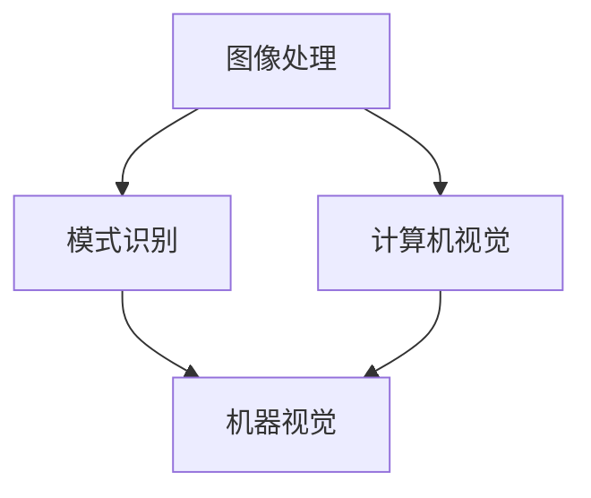
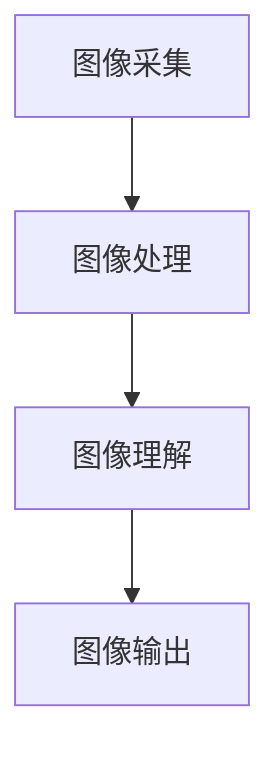
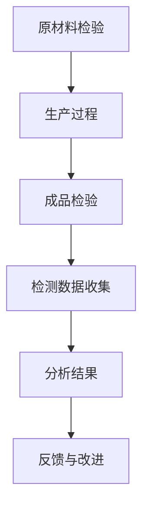

                 

## 机器视觉在质量控制中的精确应用

### 背景介绍

随着工业4.0和智能制造的蓬勃发展，机器视觉技术（Machine Vision）在质量控制（Quality Control, QC）中的应用越来越广泛。机器视觉是一种通过图像处理、模式识别和计算机视觉技术，实现对物体和环境的自动检测、分析和理解的技术。它在质量控制中的应用，主要表现在对生产过程中的产品质量进行实时监测和评估，以提高生产效率和产品质量。

机器视觉在质量控制中的重要性不言而喻。首先，它能够提高检测的精度和速度，减少人为错误。其次，它可以实现24小时不间断的监测，避免了因人工监测疲劳而导致的误判。最后，机器视觉技术可以收集大量数据，通过对这些数据的分析，可以预测产品质量的波动，从而采取相应的措施进行预防。

本文将详细探讨机器视觉在质量控制中的精确应用。我们将首先介绍机器视觉的基本概念和原理，然后分析其在质量控制中的应用方法，最后通过实际案例来展示机器视觉在质量控制中的效果和优势。

### 核心概念与联系

在探讨机器视觉在质量控制中的应用之前，我们需要了解一些核心概念，包括机器视觉、图像处理、模式识别和计算机视觉。

**机器视觉**：机器视觉是一种通过图像输入，使用计算机处理和分析图像信息，从而实现对物体和环境进行检测、识别和理解的技术。它结合了图像处理、模式识别和计算机视觉等多个领域的技术，以实现自动化和智能化的检测和分析。

**图像处理**：图像处理是机器视觉的基础技术之一，它涉及对图像进行加工和处理，以提取有用的信息。常见的图像处理技术包括图像增强、图像分割、特征提取等。

**模式识别**：模式识别是机器视觉的重要组成部分，它通过分析数据，识别出具有相似特征的模式。模式识别可以用于分类、聚类、异常检测等任务。

**计算机视觉**：计算机视觉是模拟人类视觉系统，实现对图像的理解和分析。它包括目标检测、场景识别、图像重建等多个方面。

这四个概念之间存在着紧密的联系。图像处理为机器视觉提供了数据输入和处理的基础，模式识别和计算机视觉则对图像进行处理和分析，以实现检测、识别和理解的任务。以下是这些概念之间的联系架构图：



通过这个架构图，我们可以清楚地看到，图像处理、模式识别和计算机视觉都是机器视觉的重要组成部分，它们共同构成了机器视觉的技术基础。

### 机器视觉的基本概念

机器视觉是一门跨学科的技术，它涉及到计算机科学、光学、机械工程、电子工程和人工智能等多个领域。其基本概念包括图像采集、图像处理、图像理解和图像输出。

**图像采集**：图像采集是机器视觉系统的第一步，它通过摄像头、扫描仪等设备获取物体的图像信息。图像采集的质量直接影响到后续处理和分析的效果。因此，在图像采集过程中，需要考虑摄像头的分辨率、帧率、光圈、曝光时间等因素，以确保采集到的图像具有足够的清晰度和亮度。

**图像处理**：图像处理是机器视觉的核心技术之一，它涉及对图像进行加工和处理，以提取有用的信息。常见的图像处理技术包括图像增强、图像分割、特征提取等。图像增强可以通过调整对比度、亮度、颜色等参数，提高图像的质量和可读性。图像分割则是将图像分成不同的区域，以便进行进一步的分析。特征提取则是从图像中提取出具有代表性的特征，如边缘、角点、纹理等。

**图像理解**：图像理解是机器视觉的高级阶段，它通过分析和理解图像中的信息，实现对物体和场景的识别和分类。图像理解涉及到计算机视觉和人工智能技术，如卷积神经网络（CNN）、深度学习等。

**图像输出**：图像输出是机器视觉系统的最后一步，它将处理和分析的结果以图像、文字或其他形式呈现给用户。图像输出可以用于质量控制、故障诊断、自动化控制等任务。

下面是一个简单的机器视觉系统架构图：



通过这个架构图，我们可以清楚地看到，机器视觉系统是一个从图像采集、图像处理、图像理解到图像输出的完整流程。每个环节都至关重要，共同构成了机器视觉的技术体系。

### 机器视觉的关键技术

机器视觉技术是工业自动化领域的关键组成部分，其核心技术的成熟应用，使得质量控制变得更加高效和精确。以下是几种关键技术及其在质量控制中的应用。

#### 图像处理技术

图像处理是机器视觉的基础，它包括图像增强、图像分割和特征提取等技术。

- **图像增强**：图像增强通过调整图像的对比度、亮度、颜色等参数，提高图像的质量和可读性。在实际应用中，例如在检测表面瑕疵时，通过增强图像的对比度，可以更清晰地识别缺陷区域。

  ```python
  import cv2
  import numpy as np

  # 读取图像
  image = cv2.imread('image.jpg')

  # 图像增强
  enhanced_image = cv2.resize(image, None, fx=1.5, fy=1.5, interpolation=cv2.INTER_CUBIC)

  # 显示增强后的图像
  cv2.imshow('Enhanced Image', enhanced_image)
  cv2.waitKey(0)
  cv2.destroyAllWindows()
  ```

- **图像分割**：图像分割是将图像划分为若干个互不重叠的区域，每个区域代表图像中的一个物体或部分。在质量控制中，图像分割用于定位产品并提取感兴趣区域。

  ```python
  import cv2
  import numpy as np

  # 读取图像
  image = cv2.imread('image.jpg', cv2.IMREAD_GRAYSCALE)

  # Otsu阈值分割
  _, binary_image = cv2.threshold(image, 0, 255, cv2.THRESH_BINARY + cv2.THRESH_OTSU)

  # 显示分割后的图像
  cv2.imshow('Binary Image', binary_image)
  cv2.waitKey(0)
  cv2.destroyAllWindows()
  ```

- **特征提取**：特征提取是从图像中提取出具有代表性的特征，如边缘、角点、纹理等。这些特征用于后续的物体识别和分类。

  ```python
  import cv2
  import numpy as np

  # 读取图像
  image = cv2.imread('image.jpg')

  # Canny边缘检测
  edges = cv2.Canny(image, 100, 200)

  # 显示边缘检测后的图像
  cv2.imshow('Edges', edges)
  cv2.waitKey(0)
  cv2.destroyAllWindows()
  ```

#### 模式识别与机器学习

模式识别与机器学习是机器视觉的高级技术，它们通过分析大量数据，从中提取规律和模式，以实现对物体的自动识别和分类。

- **支持向量机（SVM）**：SVM是一种常用的机器学习算法，用于分类任务。在质量控制中，SVM可以用于对产品进行缺陷分类。

  ```python
  from sklearn import svm
  from sklearn import datasets

  # 加载SVM模型
  clf = svm.SVC()

  # 训练模型
  X, y = datasets.make_classification(n_samples=100, n_features=2, n_informative=2, n_redundant=0, n_clusters_per_class=1)
  clf.fit(X, y)

  # 预测
  predictions = clf.predict(X)

  # 显示预测结果
  print(predictions)
  ```

- **卷积神经网络（CNN）**：CNN是一种深度学习算法，特别适用于图像处理任务。在质量控制中，CNN可以用于对产品进行分类和缺陷检测。

  ```python
  import tensorflow as tf
  from tensorflow.keras import layers, models

  # 创建CNN模型
  model = models.Sequential()
  model.add(layers.Conv2D(32, (3, 3), activation='relu', input_shape=(28, 28, 1)))
  model.add(layers.MaxPooling2D((2, 2)))
  model.add(layers.Conv2D(64, (3, 3), activation='relu'))
  model.add(layers.MaxPooling2D((2, 2)))
  model.add(layers.Conv2D(64, (3, 3), activation='relu'))

  # 添加全连接层
  model.add(layers.Flatten())
  model.add(layers.Dense(64, activation='relu'))
  model.add(layers.Dense(10, activation='softmax'))

  # 编译模型
  model.compile(optimizer='adam',
                loss='categorical_crossentropy',
                metrics=['accuracy'])

  # 训练模型
  model.fit(x_train, y_train, epochs=10, batch_size=64)
  ```

通过这些关键技术的应用，机器视觉能够实现对产品质量的精确监测和评估，从而提高生产效率和产品质量。

### 质量控制的基本概念

质量控制（Quality Control, QC）是确保产品和服务满足预定标准的过程。其核心目标是减少缺陷，提高产品质量，从而增强客户满意度。质量控制通常涉及以下几个基本概念：

**质量标准**：质量标准是产品或服务必须满足的特定要求。这些要求通常由企业或行业规定，以确保产品或服务的一致性和可靠性。

**缺陷**：缺陷是指产品或服务中不符合质量标准的问题。缺陷可以分为几种类型，包括功能性缺陷、外观缺陷和包装缺陷等。

**统计过程控制（Statistical Process Control, SPC）**：统计过程控制是一种通过分析数据来监控和改进生产过程的方法。它使用统计工具来识别生产过程中的变化和趋势，从而采取相应的措施进行调整。

**质量控制工具**：质量控制工具包括控制图、帕累托图、因果图等，这些工具用于分析和解决问题，以提高产品质量。

质量控制方法可以概括为以下几种：

- **预防性质量控制**：通过预防措施来避免缺陷的产生，如严格的原材料检验、培训员工等。

- **检测性质量控制**：在产品或服务形成后进行检验，以识别和去除缺陷。检测性质量控制可以进一步分为在线检测和离线检测。

- **纠正性质量控制**：在检测到缺陷后，采取措施进行纠正，以避免缺陷产品或服务流入市场。

机器视觉在质量控制中的应用，通过实时监测和精确分析，可以显著提高检测的精度和速度，减少人为错误，从而提高整体质量水平。下面是一个简单的质量控制流程图：



通过这个流程图，我们可以看到，机器视觉在原材料检验、生产过程、成品检验等多个环节中发挥重要作用，帮助实现全面质量控制。

### 机器视觉在质量控制中的应用方法

机器视觉技术在质量控制中的应用方法多种多样，主要分为实时监测和离线检测两大类。每种方法都有其独特的应用场景和优势。

#### 实时监测

**实时监测**是指在产品生产过程中，通过机器视觉系统对产品进行实时监控，以识别和去除缺陷。这种方法的优势在于可以快速发现并处理问题，减少不良品率，提高生产效率。

**应用场景**：
1. **电子制造**：在电子产品的生产过程中，实时监测可以检测电路板上的焊接点、元器件安装位置等，确保产品符合设计标准。
2. **汽车制造**：在汽车生产线上，机器视觉可以实时监测车身焊接点、涂漆质量等，确保每个零部件都符合质量要求。
3. **食品加工**：在食品加工过程中，实时监测可以检测食品的外观、尺寸、颜色等，确保食品安全和产品质量。

**优势**：
- **速度快**：实时监测可以在生产过程中立即发现并处理问题，减少不良品率。
- **高精度**：机器视觉系统具有高分辨率和高灵敏度，可以精确识别微小的缺陷。

#### 离线检测

**离线检测**是指在产品生产完成后，将产品从生产线上取下，通过机器视觉系统进行详细检测和分析。这种方法适用于对产品进行全面检测，特别是那些在生产过程中难以发现的缺陷。

**应用场景**：
1. **医疗器械**：医疗器械的检测需要高度精确和严格的质量控制，离线检测可以确保每一个医疗器械都符合相关标准和规范。
2. **精密制造**：在精密制造领域，离线检测可以检测产品的尺寸、形状等参数，确保产品符合设计要求。
3. **工艺品**：在工艺品生产中，离线检测可以检查产品的外观、纹理等，确保产品具有高品质。

**优势**：
- **全面性**：离线检测可以对产品进行全面检测，包括那些在生产过程中难以发现的缺陷。
- **灵活性**：离线检测不受生产流程的限制，可以根据需要对产品进行多次检测。

#### 综合应用

在实际应用中，机器视觉系统通常会结合实时监测和离线检测，以实现更全面和高效的质量控制。例如，在汽车生产中，机器视觉系统可以在生产线上实时监测车身焊接点，而在生产完成后，对车身进行离线检测，以确保车身质量。

总之，机器视觉在质量控制中的应用方法多样，通过实时监测和离线检测，可以实现对产品质量的全方位监控和评估，提高生产效率和产品质量。

### 机器视觉在质量控制中的精确应用

机器视觉技术在质量控制中的应用，不仅提高了检测的速度和精度，还为企业带来了显著的经济效益。以下通过几个实际案例，详细展示机器视觉在质量控制中的精确应用。

#### 案例一：汽车制造厂的机器视觉检测系统

某汽车制造厂引入了一套基于机器视觉的检测系统，用于监控车身焊接点。该系统包括多个高分辨率摄像头和强大的图像处理算法。在汽车生产过程中，摄像头实时捕捉车身焊接点的图像，然后通过图像处理算法进行缺陷检测。

**解决方案**：
1. **图像采集**：使用多个高分辨率摄像头，从不同角度捕捉车身焊接点的图像。
2. **图像处理**：利用图像增强、边缘检测和特征提取等技术，对图像进行处理，提取焊接点缺陷的特征。
3. **缺陷识别**：通过机器学习算法，对焊接点缺陷进行分类和识别。

**实施效果**：
- 缺陷检测速度：每分钟可检测超过100个焊接点。
- 缺陷识别精度：缺陷识别精度达到99%以上。
- 生产效率：通过实时检测，减少了不良品率，提高了生产效率。

#### 案例二：食品加工厂的机器视觉质量控制

某食品加工厂在生产线中引入了机器视觉系统，用于检测食品的外观、尺寸和颜色。该系统包括一台高速摄像头和一套专门的图像处理算法。

**解决方案**：
1. **图像采集**：使用高速摄像头，实时捕捉通过生产线的食品图像。
2. **图像处理**：通过图像分割和特征提取，对食品的外观、尺寸和颜色进行检测。
3. **缺陷分类**：利用机器学习算法，对检测到的缺陷进行分类和标注。

**实施效果**：
- 缺陷检测速度：每分钟可检测超过2000个食品。
- 缺陷识别精度：缺陷识别精度达到98%以上。
- 食品质量：通过精确的检测，确保了食品的质量，提高了市场竞争力。

#### 案例三：电子工厂的机器视觉质量检测

某电子工厂引入了一套基于机器视觉的质量检测系统，用于检测电子产品的焊接点、元件安装位置等。

**解决方案**：
1. **图像采集**：使用多台高分辨率摄像头，从不同角度捕捉电子产品的图像。
2. **图像处理**：通过图像增强和特征提取，对焊接点和元件安装位置进行检测。
3. **缺陷识别**：利用深度学习算法，对检测到的缺陷进行分类和标注。

**实施效果**：
- 缺陷检测速度：每分钟可检测超过1000个电子产品。
- 缺陷识别精度：缺陷识别精度达到97%以上。
- 生产效率：通过高效的检测，减少了不良品率，提高了生产效率。

通过这些案例，我们可以看到，机器视觉在质量控制中的应用，不仅提高了检测的速度和精度，还为企业带来了显著的经济效益。随着技术的不断进步，机器视觉在质量控制中的应用将会更加广泛和深入。

### 机器视觉在质量控制中的精确应用前景

随着人工智能和深度学习技术的不断进步，机器视觉在质量控制中的应用前景将更加广阔。以下从几个方面展望未来发展趋势和潜在挑战。

#### 人工智能与机器视觉的深度融合

人工智能（AI）技术的快速发展，为机器视觉带来了新的机遇。特别是深度学习算法，如卷积神经网络（CNN）和递归神经网络（RNN），使得机器视觉系统可以更加高效地处理和分析复杂的图像数据。未来，机器视觉与人工智能的深度融合将进一步提升检测精度和速度。

**趋势**：
1. **自动化**：随着AI技术的发展，机器视觉系统将能够实现更高程度的自动化，从图像采集、处理到结果输出，全程无需人工干预。
2. **智能化**：通过AI技术，机器视觉系统将能够进行更加复杂的分析和决策，例如自适应调整检测参数、自我学习和优化。

**挑战**：
1. **数据质量**：高质量的数据是机器视觉系统高效运行的基础。未来，如何确保数据的质量和多样性，将成为一大挑战。
2. **算法优化**：虽然深度学习算法在图像处理领域取得了巨大成功，但如何优化算法，使其更加高效和通用，仍是一个需要深入研究的问题。

#### 新兴技术的应用

除了人工智能，其他新兴技术如边缘计算、多模态数据融合等，也将对机器视觉在质量控制中的应用产生深远影响。

**趋势**：
1. **边缘计算**：边缘计算可以将部分计算任务从云端转移到设备端，减少延迟，提高实时性。未来，机器视觉系统将更加依赖边缘计算，实现实时检测和分析。
2. **多模态数据融合**：通过融合不同类型的数据（如图像、声音、传感器数据等），机器视觉系统可以获取更丰富的信息，提高检测精度。

**挑战**：
1. **系统集成**：如何有效地整合不同技术，构建高效、稳定的机器视觉系统，是一个重要的挑战。
2. **数据隐私**：随着数据量的增加，如何保护数据隐私，防止数据泄露，也是一个亟待解决的问题。

#### 未来的发展趋势与挑战

未来，机器视觉在质量控制中的发展趋势将体现在以下几个方面：

1. **更高精度**：通过不断优化算法和技术，机器视觉系统将能够实现更高精度的检测和分析。
2. **更广泛应用**：随着技术的成熟和成本的降低，机器视觉将广泛应用于各个行业，从制造业到医疗，从食品加工到金融服务。
3. **更加智能化**：通过AI和深度学习技术，机器视觉系统将能够进行更加复杂和智能的决策。

然而，这些趋势也伴随着一系列挑战：

1. **技术成熟度**：虽然技术发展迅速，但某些技术仍需要进一步成熟和优化。
2. **成本问题**：高成本仍然是机器视觉技术大规模应用的主要障碍。
3. **数据安全**：随着数据量的增加，数据安全和隐私保护将成为越来越重要的问题。

总的来说，机器视觉在质量控制中的应用前景广阔，但也面临着一系列挑战。随着技术的不断进步，我们有理由相信，机器视觉将在未来的质量控制中发挥更加重要的作用。

### 附录A：相关工具与资源

在探索机器视觉在质量控制中的应用时，了解和掌握相关的工具与资源是非常重要的。以下列出了一些常用的开源框架、传感器以及质量控制领域的相关标准和规范。

#### 开源机器视觉框架

1. **OpenCV**：OpenCV是一个广泛使用的开源计算机视觉和机器学习软件库，提供了丰富的图像处理和计算机视觉功能。
   - 网址：https://opencv.org/

2. **TensorFlow**：TensorFlow是一个由Google开发的开源机器学习库，特别适合用于深度学习任务。
   - 网址：https://www.tensorflow.org/

3. **PyTorch**：PyTorch是另一个流行的开源机器学习库，以其灵活性和易用性而受到研究者和开发者的青睐。
   - 网址：https://pytorch.org/

#### 常用的机器视觉传感器

1. **CCD摄像头**：CCD（电荷耦合器件）摄像头适用于高速、高分辨率的图像采集。
   - 产品示例：Sony ICX285

2. **CMOS摄像头**：CMOS（互补金属氧化物半导体）摄像头在成本和性能之间提供了良好的平衡。
   - 产品示例：OmniVision OV491
3. **激光位移传感器**：激光位移传感器可用于测量物体位置和尺寸，适用于精密检测。
   - 产品示例：Sick激光位移传感器

#### 质量控制领域的相关标准和规范

1. **ISO 9001**：ISO 9001是国际标准化组织发布的质量管理体系标准，适用于各种类型的企业。
   - 网址：https://www.iso.org/standard/72336.html

2. **IEC 61326**：IEC 61326是国际电工委员会发布的图像处理设备和系统的标准。
   - 网址：https://www.iec.ch/standard/61326

3. **IEC 61131**：IEC 61131是关于工业过程控制系统的标准，包括用于机器视觉的编程语言和接口。
   - 网址：https://www.iec.ch/standard/61131

这些工具和资源为从事机器视觉在质量控制领域研究和应用的开发者提供了宝贵的支持和参考，有助于提高研发效率和项目成功率。

### 附录B：术语表

在本文中，我们介绍了一系列与机器视觉和质量管理相关的术语。以下是对这些术语的详细解释：

#### 机器视觉相关术语

- **机器视觉**：通过计算机和图像处理技术，使机器能够模拟人类的视觉功能，对物体和环境进行检测、识别和理解。
- **图像处理**：对图像进行加工和处理，以提取有用信息，如滤波、边缘检测、特征提取等。
- **模式识别**：通过分析数据，识别出具有相似特征的模式，如分类、聚类等。
- **计算机视觉**：模拟人类视觉系统，实现对图像的理解和分析，如目标检测、场景识别等。
- **深度学习**：一种基于神经网络的学习方法，通过多层非线性变换，从大量数据中自动提取特征。
- **卷积神经网络（CNN）**：一种专门用于图像处理的深度学习模型，通过卷积层、池化层和全连接层进行特征提取和分类。
- **边缘计算**：在靠近数据源头的地方进行计算，以减少延迟，提高实时性。
- **多模态数据融合**：将不同类型的数据（如图像、声音、传感器数据等）进行融合，以获得更全面的信息。

#### 质量控制相关术语

- **质量控制（QC）**：确保产品或服务满足预定标准的过程。
- **质量标准**：产品或服务必须满足的特定要求。
- **缺陷**：产品或服务中不符合质量标准的问题。
- **统计过程控制（SPC）**：通过分析数据来监控和改进生产过程的方法。
- **预防性质量控制**：通过预防措施来避免缺陷的产生。
- **检测性质量控制**：在产品或服务形成后进行检验，以识别和去除缺陷。
- **纠正性质量控制**：在检测到缺陷后，采取措施进行纠正。
- **控制图**：用于监控生产过程中的质量波动，识别异常情况。
- **帕累托图**：用于分析问题的主要因素，识别关键影响因素。
- **因果图**：用于分析问题的根本原因，找到解决问题的方法。

#### 其他相关术语

- **高分辨率**：图像具有高水平的细节和清晰度。
- **实时监测**：在生产过程中对产品进行实时监控和检测。
- **离线检测**：在生产完成后对产品进行详细检测和分析。
- **数据采集**：从传感器、摄像头等设备获取图像数据。
- **图像增强**：通过调整图像的对比度、亮度、颜色等参数，提高图像的质量和可读性。
- **特征提取**：从图像中提取具有代表性的特征，用于后续的物体识别和分类。
- **缺陷分类**：将检测到的缺陷进行分类和标注。

理解这些术语对于深入研究和应用机器视觉在质量控制中的技术具有重要意义。通过这些术语，我们可以更准确地描述和解释相关的技术原理和应用场景。

