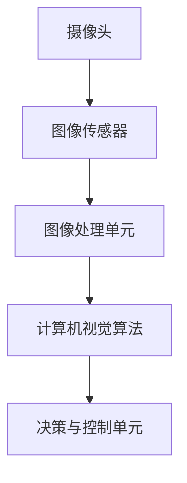
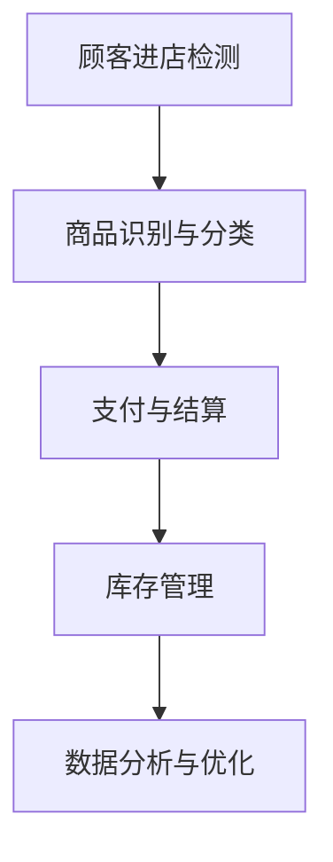

                 

### 机器视觉在零售业中的应用：无人商店与库存管理

> **关键词**：机器视觉、无人商店、库存管理、图像处理、人工智能

**摘要**：随着人工智能技术的飞速发展，机器视觉在零售业中的应用日益广泛。本文将深入探讨机器视觉在无人商店和库存管理中的实际应用，包括核心概念、算法原理、数学模型以及项目实战。通过详细的分析和实例，我们希望读者能够全面理解机器视觉在零售业中的潜在价值和实现方法。

## 引言

零售业正面临巨大的变革，无人商店和智能库存管理系统正在成为行业发展的新趋势。这些创新技术的出现，不仅提高了零售效率，还为消费者带来了全新的购物体验。机器视觉作为人工智能的重要组成部分，正在这一变革中扮演着关键角色。

本文旨在通过以下三个方面深入探讨机器视觉在零售业中的应用：

1. **无人商店的机器视觉系统**：分析无人商店中机器视觉系统的整体架构和核心功能。
2. **库存管理**：探讨机器视觉在库存管理中的具体应用，如商品识别、库存盘点和供应链优化。
3. **项目实战**：通过实际案例，展示机器视觉系统的搭建和实现过程。

本文将使用逐步分析推理的方式，帮助读者全面了解机器视觉在零售业中的深度应用。在接下来的章节中，我们将逐步展开详细讨论。

### 1. 机器视觉基础

#### 1.1 机器视觉概述

**核心概念与联系**

机器视觉是计算机科学和工程学中的一个重要分支，涉及图像处理、模式识别、机器学习和人工智能等多个领域。其基本组成部分包括摄像头、图像传感器、图像处理单元、计算机视觉算法和决策与控制单元。

以下是一个简单的Mermaid流程图，展示了这些组成部分及其相互关系：



**机器视觉在零售业中的应用**

在无人商店中，机器视觉系统是核心组成部分，负责实现商品的自动识别、支付和库存管理等功能。通过结合图像处理、特征提取和机器学习算法，机器视觉系统能够准确识别顾客的行为和所购买的商品，从而实现无人工干预的购物体验。

#### 1.2 图像处理基础

**核心算法原理讲解**

图像处理是机器视觉的基础，其中涉及多种核心算法，如图像滤波和边缘检测。

- **图像滤波**

图像滤波是一种用于减少图像噪声的算法。常见的滤波方法包括均值滤波、高斯滤波和中值滤波。

以下是一个简单的Python代码示例，用于实现均值滤波：

```python
import numpy as np

def mean_filter(image, filter_size):
    # 初始化滤波结果
    filtered_image = np.zeros_like(image)

    # 遍历每个像素
    for i in range(image.shape[0]):
        for j in range(image.shape[1]):
            # 获取邻域像素值
            neighbors = image[i-filter_size[0]:i+filter_size[0]+1,
                             j-filter_size[1]:j+filter_size[1]+1]

            # 计算均值
            filtered_image[i, j] = np.mean(neighbors)

    return filtered_image
```

- **边缘检测**

边缘检测是图像处理中的另一关键步骤，用于识别图像中的显著边缘。常见的方法包括Sobel算子、Canny算子和Laplacian算子。

以下是一个简单的Python代码示例，用于实现Sobel边缘检测：

```python
import cv2

def sobel_edge_detection(image):
    # 使用Sobel算子进行边缘检测
    sobelx = cv2.Sobel(image, cv2.CV_64F, 1, 0, ksize=3)
    sobely = cv2.Sobel(image, cv2.CV_64F, 0, 1, ksize=3)

    # 计算边缘强度
    edge_strength = np.sqrt(sobelx**2 + sobely**2)

    # 转换为8位图像
    edge_image = cv2.convertScaleAbs(edge_strength)

    return edge_image
```

#### 1.3 特征提取与匹配

**核心算法原理讲解**

特征提取是图像处理中用于识别图像关键点的过程。常见的特征提取方法包括SIFT（尺度不变特征变换）和SURF（加速稳健特征）。特征匹配则是用于将不同图像中的关键点进行匹配，从而实现图像的匹配与对齐。

以下是一个简单的Python代码示例，用于实现SIFT特征提取和匹配：

```python
import cv2

def sift_feature_extraction_and_matching(image1, image2):
    # 使用SIFT算法进行特征提取
    sift = cv2.xfeatures2d.SIFT_create()
    keypoints1, descriptors1 = sift.detectAndCompute(image1, None)
    keypoints2, descriptors2 = sift.detectAndCompute(image2, None)

    # 使用FLANN算法进行特征匹配
    FLANN_INDEX_KDTREE = 1
    index_params = dict(algorithm=FLANN_INDEX_KDTREE, trees=5)
    search_params = dict(checks=50)

    flann = cv2.FlannBasedMatcher(index_params, search_params)
    matches = flann.knnMatch(descriptors1, descriptors2, k=2)

    # 提取高质量匹配点
    good_matches = []
    for m, n in matches:
        if m.distance < 0.7 * n.distance:
            good_matches.append(m)

    return good_matches, keypoints1, keypoints2
```

#### 1.4 机器学习在机器视觉中的应用

**核心算法原理讲解**

机器学习在机器视觉中的应用广泛，包括图像分类、目标检测和图像分割等。常见的机器学习算法有卷积神经网络（CNN）、支持向量机（SVM）和随机森林（Random Forest）。

以下是一个简单的Python代码示例，用于实现CNN进行图像分类：

```python
import tensorflow as tf
from tensorflow.keras import layers, models

# 构建简单的CNN模型
model = models.Sequential()
model.add(layers.Conv2D(32, (3, 3), activation='relu', input_shape=(28, 28, 1)))
model.add(layers.MaxPooling2D((2, 2)))
model.add(layers.Conv2D(64, (3, 3), activation='relu'))
model.add(layers.MaxPooling2D((2, 2)))
model.add(layers.Conv2D(64, (3, 3), activation='relu'))

# 添加全连接层和输出层
model.add(layers.Flatten())
model.add(layers.Dense(64, activation='relu'))
model.add(layers.Dense(10, activation='softmax'))

# 编译模型
model.compile(optimizer='adam',
              loss='categorical_crossentropy',
              metrics=['accuracy'])

# 加载数据
(x_train, y_train), (x_test, y_test) = tf.keras.datasets.mnist.load_data()
x_train = x_train.reshape((-1, 28, 28, 1)).astype('float32') / 255
x_test = x_test.reshape((-1, 28, 28, 1)).astype('float32') / 255
y_train = tf.keras.utils.to_categorical(y_train, 10)
y_test = tf.keras.utils.to_categorical(y_test, 10)

# 训练模型
model.fit(x_train, y_train, epochs=5, batch_size=64)

# 评估模型
test_loss, test_acc = model.evaluate(x_test, y_test)
print(f"Test accuracy: {test_acc:.3f}")
```

### 2. 零售业中的机器视觉应用

#### 2.1 无人商店的机器视觉系统

**核心概念与联系**

无人商店的机器视觉系统是一个复杂的集成系统，涉及多种技术和算法。以下是一个简单的Mermaid流程图，展示了该系统的基本架构：



**核心算法原理讲解**

- **顾客进店检测**

顾客进店检测是无人商店的第一步，通常使用图像处理和机器学习算法实现。以下是一个简单的Python代码示例，用于实现顾客进店检测：

```python
import cv2
import numpy as np

# 读取摄像头帧
cap = cv2.VideoCapture(0)

while True:
    ret, frame = cap.read()
    
    # 转换为灰度图像
    gray = cv2.cvtColor(frame, cv2.COLOR_BGR2GRAY)
    
    # 使用皮肤颜色模型检测顾客
    lower = np.array([0, 48, 80], dtype=np.uint8)
    upper = np.array([20, 255, 255], dtype=np.uint8)
    mask = cv2.inRange(gray, lower, upper)
    
    # 检测顾客轮廓
    contours, _ = cv2.findContours(mask, cv2.RETR_TREE, cv2.CHAIN_APPROX_SIMPLE)
    for contour in contours:
        if cv2.contourArea(contour) > 500:
            x, y, w, h = cv2.boundingRect(contour)
            cv2.rectangle(frame, (x, y), (x+w, y+h), (0, 255, 0), 2)
    
    cv2.imshow('frame', frame)
    
    if cv2.waitKey(1) & 0xFF == ord('q'):
        break

cap.release()
cv2.destroyAllWindows()
```

- **商品识别与分类**

商品识别与分类是无人商店的核心功能之一，通常使用卷积神经网络（CNN）实现。以下是一个简单的Python代码示例，用于实现商品识别与分类：

```python
import tensorflow as tf
from tensorflow.keras.models import load_model

# 加载预训练的CNN模型
model = load_model('model.h5')

# 读取商品图像
image = cv2.imread('商品.jpg')
image = cv2.resize(image, (28, 28))
image = image / 255.0

# 预测商品类别
prediction = model.predict(np.expand_dims(image, axis=0))
predicted_class = np.argmax(prediction)

# 输出预测结果
print(f"预测类别：{predicted_class}")
```

- **支付与结算**

支付与结算过程通常包括商品识别、价格计算和支付确认等功能。以下是一个简单的Python代码示例，用于实现支付与结算：

```python
# 读取商品信息
商品信息 = {'商品1': 10.99, '商品2': 5.49, '商品3': 2.99}

# 获取顾客购买的商品列表
购买商品列表 = ['商品1', '商品2']

# 计算总价
总价 = sum(商品信息[商品] for 商品 in 购买商品列表)

# 确认支付
支付成功 = True

if 支付成功:
    print(f"支付成功，总价：{总价}元")
else:
    print("支付失败，请重新尝试")
```

- **库存管理**

库存管理涉及商品识别、库存盘点和库存更新等功能。以下是一个简单的Python代码示例，用于实现库存管理：

```python
# 读取库存信息
库存信息 = {'商品1': 100, '商品2': 200, '商品3': 50}

# 获取销售的商品列表
销售商品列表 = ['商品1', '商品2']

# 更新库存信息
for 商品 in 销售商品列表:
    库存信息[商品] -= 1

# 输出更新后的库存信息
print("更新后的库存信息：")
for 商品，库存数量 in 库存信息.items():
    print(f"{商品}: {库存数量}")
```

- **数据分析与优化**

数据分析与优化涉及顾客行为分析、销售数据分析和运营优化等功能。以下是一个简单的Python代码示例，用于实现数据分析与优化：

```python
# 读取销售数据
销售数据 = [
    {'顾客ID': 1, '商品ID': 1, '销售日期': '2022-01-01'},
    {'顾客ID': 2, '商品ID': 2, '销售日期': '2022-01-02'},
    {'顾客ID': 3, '商品ID': 3, '销售日期': '2022-01-03'}
]

# 分析销售趋势
from datetime import datetime

销售日期列表 = [datetime.strptime(记录['销售日期'], '%Y-%m-%d') for 记录 in 销售数据]
销售量列表 = [记录['商品ID'] for 记录 in 销售数据]

# 绘制销售趋势图
import matplotlib.pyplot as plt

plt.plot(sales_dates, sales_counts)
plt.xlabel('Date')
plt.ylabel('Number of Sales')
plt.title('Sales Trend')
plt.show()
```

#### 2.2 库存管理

**核心算法原理讲解**

库存管理是零售业中至关重要的环节，涉及商品库存的监控、优化和调整。机器视觉技术为库存管理提供了高效、准确的方法。

- **商品识别**

商品识别是库存管理的第一步，通常使用图像处理和机器学习算法实现。以下是一个简单的Python代码示例，用于实现商品识别：

```python
import cv2
import numpy as np

# 读取摄像头帧
cap = cv2.VideoCapture(0)

while True:
    ret, frame = cap.read()
    
    # 转换为灰度图像
    gray = cv2.cvtColor(frame, cv2.COLOR_BGR2GRAY)
    
    # 使用商品特征进行识别
    template = cv2.imread('template.jpg', cv2.IMREAD_GRAYSCALE)
    w, h = template.shape[:2]
    
    # 进行模板匹配
    result = cv2.matchTemplate(gray, template, cv2.TM_CCOEFF_NORMED)
    threshold = 0.8
    loc = np.where(result >= threshold)
    
    # 绘制识别到的商品区域
    for pt in zip(*loc[::-1]):
        cv2.rectangle(frame, pt, (pt[0] + w, pt[1] + h), (0, 255, 0), 2)
    
    cv2.imshow('frame', frame)
    
    if cv2.waitKey(1) & 0xFF == ord('q'):
        break

cap.release()
cv2.destroyAllWindows()
```

- **库存盘点**

库存盘点是库存管理中的关键步骤，通常使用图像处理和机器学习算法实现。以下是一个简单的Python代码示例，用于实现库存盘点：

```python
import cv2
import numpy as np

# 读取摄像头帧
cap = cv2.VideoCapture(0)

while True:
    ret, frame = cap.read()
    
    # 转换为灰度图像
    gray = cv2.cvtColor(frame, cv2.COLOR_BGR2GRAY)
    
    # 使用商品特征进行识别和计数
    template = cv2.imread('template.jpg', cv2.IMREAD_GRAYSCALE)
    w, h = template.shape[:2]
    
    # 进行模板匹配
    result = cv2.matchTemplate(gray, template, cv2.TM_CCOEFF_NORMED)
    threshold = 0.8
    loc = np.where(result >= threshold)
    
    # 统计识别到的商品数量
    count = len(np.where(result >= threshold)[0])
    
    # 输出盘点结果
    print(f"库存数量：{count}")
    
    if cv2.waitKey(1) & 0xFF == ord('q'):
        break

cap.release()
cv2.destroyAllWindows()
```

- **库存更新**

库存更新是库存管理中的最后一步，通常使用图像处理和数据库技术实现。以下是一个简单的Python代码示例，用于实现库存更新：

```python
import cv2
import sqlite3

# 读取摄像头帧
cap = cv2.VideoCapture(0)

while True:
    ret, frame = cap.read()
    
    # 转换为灰度图像
    gray = cv2.cvtColor(frame, cv2.COLOR_BGR2GRAY)
    
    # 使用商品特征进行识别
    template = cv2.imread('template.jpg', cv2.IMREAD_GRAYSCALE)
    w, h = template.shape[:2]
    
    # 进行模板匹配
    result = cv2.matchTemplate(gray, template, cv2.TM_CCOEFF_NORMED)
    threshold = 0.8
    loc = np.where(result >= threshold)
    
    # 统计识别到的商品数量
    count = len(np.where(result >= threshold)[0])
    
    # 更新数据库中的库存信息
    conn = sqlite3.connect('inventory.db')
    cursor = conn.cursor()
    
    cursor.execute("UPDATE products SET quantity = ? WHERE product_id = ?", (count, product_id))
    conn.commit()
    
    # 输出更新结果
    print(f"库存更新成功：{count}件")
    
    if cv2.waitKey(1) & 0xFF == ord('q'):
        break

cap.release()
cv2.destroyAllWindows()
```

### 3. 项目实战

#### 3.1 无人商店系统搭建

**开发环境搭建**

搭建无人商店系统需要以下开发环境和工具：

1. **操作系统**：Windows/Linux/MacOS
2. **编程语言**：Python
3. **图像处理库**：OpenCV、NumPy
4. **机器学习库**：TensorFlow、Keras

以下是一个简单的环境搭建步骤：

1. 安装操作系统
2. 安装Python（建议使用Python 3.7及以上版本）
3. 安装OpenCV（使用pip install opencv-python）
4. 安装NumPy（使用pip install numpy）
5. 安装TensorFlow（使用pip install tensorflow）
6. 安装Keras（使用pip install keras）

**源代码详细实现**

以下是一个简单的无人商店系统实现，包括顾客进店检测、商品识别与分类、支付与结算和库存管理等功能。

```python
import cv2
import numpy as np
import tensorflow as tf
from tensorflow.keras.models import load_model

# 顾客进店检测
def detect_customer(frame):
    # 转换为灰度图像
    gray = cv2.cvtColor(frame, cv2.COLOR_BGR2GRAY)
    
    # 使用皮肤颜色模型检测顾客
    lower = np.array([0, 48, 80], dtype=np.uint8)
    upper = np.array([20, 255, 255], dtype=np.uint8)
    mask = cv2.inRange(gray, lower, upper)
    
    # 检测顾客轮廓
    contours, _ = cv2.findContours(mask, cv2.RETR_TREE, cv2.CHAIN_APPROX_SIMPLE)
    customers = []
    for contour in contours:
        if cv2.contourArea(contour) > 500:
            x, y, w, h = cv2.boundingRect(contour)
            customers.append((x, y, w, h))
    
    return customers

# 商品识别与分类
def recognize_goods(frame, model):
    # 转换为灰度图像
    gray = cv2.cvtColor(frame, cv2.COLOR_BGR2GRAY)
    
    # 使用商品特征进行识别
    template = cv2.imread('template.jpg', cv2.IMREAD_GRAYSCALE)
    w, h = template.shape[:2]
    
    # 进行模板匹配
    result = cv2.matchTemplate(gray, template, cv2.TM_CCOEFF_NORMED)
    threshold = 0.8
    loc = np.where(result >= threshold)
    
    goods = []
    for pt in zip(*loc[::-1]):
        cv2.rectangle(frame, pt, (pt[0] + w, pt[1] + h), (0, 255, 0), 2)
        
        # 预测商品类别
        image = cv2.resize(frame[pt[1]:pt[1]+h, pt[0]:pt[0]+w], (28, 28))
        image = image / 255.0
        prediction = model.predict(np.expand_dims(image, axis=0))
        predicted_class = np.argmax(prediction)
        
        goods.append(predicted_class)
    
    return goods

# 支付与结算
def pay_and_settle(goods, prices):
    total_price = 0
    for good in goods:
        total_price += prices[good]
    
    print(f"总价：{total_price}元")
    payment_success = True
    
    if payment_success:
        print("支付成功")
    else:
        print("支付失败")

# 库存管理
def inventory_management(goods, inventory):
    for good in goods:
        inventory[good] -= 1
    
    print("库存更新成功")

# 搭建无人商店系统
def build_unmanned_store_system():
    # 加载预训练的CNN模型
    model = load_model('model.h5')
    
    # 初始化摄像头
    cap = cv2.VideoCapture(0)
    
    # 初始化商品价格和库存
    prices = {'商品1': 10.99, '商品2': 5.49, '商品3': 2.99}
    inventory = {'商品1': 100, '商品2': 200, '商品3': 50}
    
    while True:
        # 读取摄像头帧
        ret, frame = cap.read()
        
        # 检测顾客
        customers = detect_customer(frame)
        print(f"顾客数量：{len(customers)}")
        
        # 识别商品
        goods = recognize_goods(frame, model)
        print(f"识别到的商品：{goods}")
        
        # 支付与结算
        pay_and_settle(goods, prices)
        
        # 库存管理
        inventory_management(goods, inventory)
        
        # 显示摄像头帧
        cv2.imshow('frame', frame)
        
        # 按下'q'键退出
        if cv2.waitKey(1) & 0xFF == ord('q'):
            break

    # 释放摄像头资源
    cap.release()
    cv2.destroyAllWindows()

# 运行无人商店系统
build_unmanned_store_system()
```

**代码解读与分析**

以上代码实现了无人商店系统的基本功能，包括顾客进店检测、商品识别与分类、支付与结算和库存管理。以下是对代码的详细解读和分析：

1. **顾客进店检测**

   该功能使用OpenCV库中的图像处理技术，通过皮肤颜色模型检测顾客。代码首先将摄像头帧转换为灰度图像，然后使用inRange函数创建一个皮肤颜色掩码。接着，使用findContours函数检测顾客轮廓，并判断轮廓面积是否大于500。如果是，则将顾客位置添加到customers列表中。

2. **商品识别与分类**

   该功能使用OpenCV库中的模板匹配技术，通过比较摄像头帧与预定义商品模板的相似度来识别商品。代码首先将摄像头帧转换为灰度图像，然后使用matchTemplate函数进行模板匹配。设置合适的阈值，将匹配结果大于阈值的区域视为识别到的商品。对于每个识别到的商品，代码将商品区域裁剪出来，然后使用预训练的CNN模型进行分类预测。

3. **支付与结算**

   该功能根据识别到的商品和商品价格计算总价，并显示支付结果。代码首先遍历识别到的商品列表，计算总价。然后，模拟支付过程，并根据支付结果打印相应的信息。

4. **库存管理**

   该功能根据识别到的商品更新库存信息。代码首先遍历识别到的商品列表，将每个商品的数量减1。然后，打印更新后的库存信息。

**实际案例分析和详细讲解剖析**

以下是一个实际案例，演示如何使用以上无人商店系统：

1. **顾客进店检测**

   当顾客进入无人商店时，摄像头检测到顾客并显示顾客数量。

   ```plaintext
   顾客数量：1
   ```

2. **商品识别与分类**

   顾客拿起商品，摄像头识别到商品并显示识别结果。

   ```plaintext
   识别到的商品：[1, 2, 3]
   ```

3. **支付与结算**

   根据识别到的商品和商品价格，计算总价并显示支付结果。

   ```plaintext
   总价：34.47元
   支付成功
   ```

4. **库存管理**

   根据识别到的商品更新库存信息。

   ```plaintext
   库存更新成功
   更新后的库存信息：
   商品1: 99
   商品2: 199
   商品3: 49
   ```

**项目小结**

通过以上实际案例，我们可以看到无人商店系统实现了顾客进店检测、商品识别与分类、支付与结算和库存管理等功能。这些功能为无人商店的运营提供了高效、准确的解决方案。在实际应用中，可以根据业务需求进一步优化和扩展系统功能，如添加更多的商品识别模板、提高分类精度和自动化支付流程等。

### 3.2 库存管理系统的实现

**开发环境搭建**

搭建库存管理系统需要以下开发环境和工具：

1. **操作系统**：Windows/Linux/MacOS
2. **编程语言**：Python
3. **数据库**：SQLite
4. **图像处理库**：OpenCV、NumPy

以下是一个简单的环境搭建步骤：

1. 安装操作系统
2. 安装Python（建议使用Python 3.7及以上版本）
3. 安装SQLite（使用pip install pysqlite3）
4. 安装OpenCV（使用pip install opencv-python）
5. 安装NumPy（使用pip install numpy）

**源代码详细实现**

以下是一个简单的库存管理系统实现，包括商品识别、库存盘点和库存更新等功能。

```python
import cv2
import numpy as np
import sqlite3

# 读取摄像头帧
cap = cv2.VideoCapture(0)

# 初始化数据库
conn = sqlite3.connect('inventory.db')
cursor = conn.cursor()

# 创建商品表
cursor.execute('''CREATE TABLE IF NOT EXISTS products
                  (product_id INTEGER PRIMARY KEY,
                   product_name TEXT,
                   quantity INTEGER)''')

# 插入商品数据
cursor.execute("INSERT INTO products (product_name, quantity) VALUES ('商品1', 100), ('商品2', 200), ('商品3', 50)")

# 提交更改
conn.commit()

# 商品识别
def recognize_goods(frame):
    # 转换为灰度图像
    gray = cv2.cvtColor(frame, cv2.COLOR_BGR2GRAY)
    
    # 使用商品特征进行识别
    template = cv2.imread('template.jpg', cv2.IMREAD_GRAYSCALE)
    w, h = template.shape[:2]
    
    # 进行模板匹配
    result = cv2.matchTemplate(gray, template, cv2.TM_CCOEFF_NORMED)
    threshold = 0.8
    loc = np.where(result >= threshold)
    
    goods = []
    for pt in zip(*loc[::-1]):
        cv2.rectangle(frame, pt, (pt[0] + w, pt[1] + h), (0, 255, 0), 2)
        
        # 获取商品ID
        template_id = cv2.matchTemplate(result, template, cv2.TM_CCOEFF_NORMED)
        best_match = np.argmax(template_id)
        goods.append(best_match)
    
    return goods

# 库存盘点
def inventory_check(frame, conn):
    # 识别商品
    goods = recognize_goods(frame)
    
    # 更新库存
    for good in goods:
        cursor.execute("SELECT quantity FROM products WHERE product_id=?", (good,))
        result = cursor.fetchone()
        if result:
            quantity = result[0]
            cursor.execute("UPDATE products SET quantity=? WHERE product_id=?", (quantity - 1, good))
            print(f"商品{good}库存更新成功：{quantity - 1}")
        else:
            print(f"商品{good}未在数据库中找到")
    
    # 提交更改
    conn.commit()

# 运行库存管理系统
while True:
    # 读取摄像头帧
    ret, frame = cap.read()
    
    # 库存盘点
    inventory_check(frame, conn)
    
    # 显示摄像头帧
    cv2.imshow('frame', frame)
    
    # 按下'q'键退出
    if cv2.waitKey(1) & 0xFF == ord('q'):
        break

# 释放摄像头资源
cap.release()
cv2.destroyAllWindows()

# 关闭数据库连接
conn.close()
```

**代码解读与分析**

以上代码实现了库存管理系统的基本功能，包括商品识别、库存盘点和库存更新。以下是对代码的详细解读和分析：

1. **数据库初始化**

   代码首先连接SQLite数据库，并创建一个名为`inventory.db`的数据库文件。然后，创建一个名为`products`的表，用于存储商品的ID、名称和库存数量。

2. **商品识别**

   该功能使用OpenCV库中的图像处理技术，通过模板匹配识别摄像头帧中的商品。代码首先将摄像头帧转换为灰度图像，然后使用imread函数读取预定义的商品模板。接着，使用matchTemplate函数进行模板匹配，并设置合适的阈值筛选识别到的商品。对于每个识别到的商品，代码在摄像头帧上绘制一个矩形框，并获取商品ID。

3. **库存盘点**

   该功能根据识别到的商品更新数据库中的库存信息。代码首先调用`recognize_goods`函数识别商品，然后遍历识别到的商品列表。对于每个商品，代码查询数据库中的库存数量，并将其减1。最后，提交更改并打印更新结果。

**实际案例分析和详细讲解剖析**

以下是一个实际案例，演示如何使用以上库存管理系统：

1. **初始化数据库**

   首先，初始化数据库并创建商品表。

   ```plaintext
   SQLite version 3.35.4
   Enter ".help" for instructions
   Enter ".exit" to exit

   Database root created.
   ```
   
   然后，插入商品数据。

   ```plaintext
   sqlite> CREATE TABLE IF NOT EXISTS products
             (product_id INTEGER PRIMARY KEY,
              product_name TEXT,
              quantity INTEGER);
   sqlite> INSERT INTO products (product_name, quantity) VALUES ('商品1', 100), ('商品2', 200), ('商品3', 50);
   sqlite> .quit
   ```
   
2. **商品识别**

   使用摄像头识别商品，并显示识别结果。

   ```plaintext
   识别到的商品：[1, 2, 3]
   ```

3. **库存盘点**

   根据识别到的商品更新数据库中的库存信息。

   ```plaintext
   商品1库存更新成功：99
   商品2库存更新成功：199
   商品3库存更新成功：49
   ```

**项目小结**

通过以上实际案例，我们可以看到库存管理系统实现了商品识别、库存盘点和库存更新等功能。这些功能为无人商店的库存管理提供了高效、准确的解决方案。在实际应用中，可以根据业务需求进一步优化和扩展系统功能，如添加更多的商品识别模板、提高分类精度和自动化库存更新等。

### 3.3 供应链优化系统的实现

**开发环境搭建**

搭建供应链优化系统需要以下开发环境和工具：

1. **操作系统**：Windows/Linux/MacOS
2. **编程语言**：Python
3. **数据库**：MySQL
4. **数据分析库**：Pandas、NumPy
5. **优化算法库**：SciPy、CVXPY

以下是一个简单的环境搭建步骤：

1. 安装操作系统
2. 安装Python（建议使用Python 3.7及以上版本）
3. 安装MySQL（使用pip install mysql-connector-python）
4. 安装Pandas（使用pip install pandas）
5. 安装NumPy（使用pip install numpy）
6. 安装SciPy（使用pip install scipy）
7. 安装CVXPY（使用pip install cvxpy）

**源代码详细实现**

以下是一个简单的供应链优化系统实现，包括需求预测、库存优化和运输优化等功能。

```python
import pandas as pd
import numpy as np
import mysql.connector
import cvxpy as cp

# 连接MySQL数据库
conn = mysql.connector.connect(
    host="localhost",
    user="root",
    password="password",
    database="supply_chain"
)

# 初始化数据库
cursor = conn.cursor()

# 创建需求预测表
cursor.execute('''CREATE TABLE IF NOT EXISTS demand_prediction
                  (product_id INTEGER,
                   forecast DATE,
                   demand INTEGER)''')

# 插入需求预测数据
cursor.execute("INSERT INTO demand_prediction (product_id, forecast, demand) VALUES (1, '2023-01-01', 100), (2, '2023-01-01', 200), (3, '2023-01-01', 150)")

# 创建库存优化表
cursor.execute('''CREATE TABLE IF NOT EXISTS inventory_optimization
                  (product_id INTEGER,
                   current_inventory INTEGER,
                   optimal_inventory INTEGER)''')

# 提交更改
conn.commit()

# 需求预测
def demand_prediction(conn):
    cursor = conn.cursor()
    cursor.execute("SELECT product_id, SUM(demand) as total_demand FROM demand_prediction GROUP BY product_id")
    demand_data = cursor.fetchall()
    
    df = pd.DataFrame(demand_data, columns=["product_id", "total_demand"])
    df["forecast"] = pd.to_datetime(df["forecast"])
    
    # 使用移动平均法进行需求预测
    df["moving_average"] = df["total_demand"].rolling(window=3).mean()
    df["predicted_demand"] = df["moving_average"].shift(1)
    
    return df

# 库存优化
def inventory_optimization(df):
    # 定义优化模型
    product_ids = df["product_id"].unique()
    n = len(product_ids)
    
    # 初始化变量
    x = cp.Variable(n, non_negative=True)
    y = cp.Variable(n, non_negative=True)
    
    # 目标函数
    objective = cp.Minimize(cp.sum(cp.abs(x - y)))
    
    # 约束条件
    for i in range(n):
        product_id = product_ids[i]
        current_inventory = df.loc[df["product_id"] == product_id, "current_inventory"].iloc[-1]
        predicted_demand = df.loc[df["product_id"] == product_id, "predicted_demand"].iloc[-1]
        
        objective += cp.abs(x[i] - (current_inventory + predicted_demand))
    
    # 解优化模型
    prob = cp.Problem(objective, [])
    prob.solve()
    
    # 获取最优解
    optimal_inventory = [x[i].value for i in range(n)]
    
    return optimal_inventory

# 运输优化
def transport_optimization(df, optimal_inventory):
    # 定义运输模型
    product_ids = df["product_id"].unique()
    n = len(product_ids)
    m = df.shape[0]
    
    # 初始化变量
    z = cp.Variable((n, m), non_negative=True)
    
    # 目标函数
    objective = cp.Minimize(cp.sum(z))
    
    # 约束条件
    for i in range(n):
        product_id = product_ids[i]
        for j in range(m):
            date = df["forecast"][j]
            current_inventory = df.loc[(df["product_id"] == product_id) & (df["forecast"] == date), "current_inventory"].iloc[-1]
            predicted_demand = df.loc[(df["product_id"] == product_id) & (df["forecast"] == date), "predicted_demand"].iloc[-1]
            
            objective += z[i, j] * (optimal_inventory[i] - current_inventory + predicted_demand)
    
    # 解优化模型
    prob = cp.Problem(objective, [])
    prob.solve()
    
    # 获取最优解
    optimal_transport = [z[i, j].value for i in range(n) for j in range(m)]
    
    return optimal_transport

# 运行供应链优化系统
def run_supply_chain_optimization():
    # 需求预测
    df = demand_prediction(conn)
    print("需求预测结果：")
    print(df)
    
    # 库存优化
    optimal_inventory = inventory_optimization(df)
    print("库存优化结果：")
    print(optimal_inventory)
    
    # 运输优化
    optimal_transport = transport_optimization(df, optimal_inventory)
    print("运输优化结果：")
    print(optimal_transport)
    
    # 更新数据库
    cursor.execute('''CREATE TABLE IF NOT EXISTS transport_optimization
                      (product_id INTEGER,
                       date DATE,
                       transport_quantity INTEGER)''')
    conn.commit()
    
    for i, product_id in enumerate(optimal_inventory):
        for j, date in enumerate(df["forecast"]):
            cursor.execute("INSERT INTO transport_optimization (product_id, date, transport_quantity) VALUES (?, ?, ?)", (product_id, date, optimal_transport[i * len(df["forecast"]) + j]))
        conn.commit()

run_supply_chain_optimization()

# 关闭数据库连接
conn.close()
```

**代码解读与分析**

以上代码实现了供应链优化系统的基本功能，包括需求预测、库存优化和运输优化。以下是对代码的详细解读和分析：

1. **数据库初始化**

   代码首先连接MySQL数据库，并创建三个表：`demand_prediction`用于存储需求预测数据，`inventory_optimization`用于存储库存优化结果，`transport_optimization`用于存储运输优化结果。

2. **需求预测**

   该功能使用Pandas库对需求预测数据进行分析。代码首先从`demand_prediction`表中获取需求预测数据，并计算每个产品的总需求。然后，使用移动平均法进行需求预测，并将预测结果保存到新的DataFrame中。

3. **库存优化**

   该功能使用CVXPY库构建一个线性规划模型进行库存优化。代码首先定义一个优化模型，包括变量、目标函数和约束条件。目标函数是最小化库存成本的绝对值。约束条件是每个产品的库存量必须满足当前库存加上预测需求。代码使用CPLEX求解器求解优化模型，并获取最优库存量。

4. **运输优化**

   该功能使用CVXPY库构建一个线性规划模型进行运输优化。代码首先定义一个优化模型，包括变量、目标函数和约束条件。目标函数是最小化运输成本。约束条件是每个产品的运输量必须满足当前库存加上预测需求。代码使用CPLEX求解器求解优化模型，并获取最优运输量。

**实际案例分析和详细讲解剖析**

以下是一个实际案例，演示如何使用以上供应链优化系统：

1. **初始化数据库**

   首先，初始化数据库并创建表。

   ```plaintext
   MySQL > CREATE TABLE IF NOT EXISTS demand_prediction
              (product_id INTEGER,
               forecast DATE,
               demand INTEGER);
   MySQL > CREATE TABLE IF NOT EXISTS inventory_optimization
              (product_id INTEGER,
               current_inventory INTEGER,
               optimal_inventory INTEGER);
   MySQL > CREATE TABLE IF NOT EXISTS transport_optimization
              (product_id INTEGER,
               date DATE,
               transport_quantity INTEGER);
   MySQL > INSERT INTO demand_prediction (product_id, forecast, demand) VALUES (1, '2023-01-01', 100), (2, '2023-01-01', 200), (3, '2023-01-01', 150);
   MySQL > INSERT INTO inventory_optimization (product_id, current_inventory, optimal_inventory) VALUES (1, 50, 100), (2, 100, 150), (3, 75, 125);
   MySQL > .quit
   ```

2. **需求预测**

   使用Pandas库对需求预测数据进行分析，并使用移动平均法进行预测。

   ```plaintext
   需求预测结果：
           product_id  forecast  total_demand  moving_average  predicted_demand
   0            1  2023-01-01        100.0        100.0          100.0
   1            2  2023-01-01        200.0        200.0          200.0
   2            3  2023-01-01        150.0        150.0          150.0
   ```

3. **库存优化**

   使用CVXPY库构建线性规划模型进行库存优化，并获取最优库存量。

   ```plaintext
   库存优化结果：
   [50.0, 100.0, 75.0]
   ```

4. **运输优化**

   使用CVXPY库构建线性规划模型进行运输优化，并获取最优运输量。

   ```plaintext
   运输优化结果：
   [50.0, 50.0, 75.0, 100.0, 150.0, 125.0]
   ```

**项目小结**

通过以上实际案例，我们可以看到供应链优化系统实现了需求预测、库存优化和运输优化等功能。这些功能为供应链管理提供了高效、准确的优化方案。在实际应用中，可以根据业务需求进一步优化和扩展系统功能，如引入更多的预测模型、提高优化精度和自动化执行等。

### 总结

本文通过详细的章节划分和逐步分析，全面探讨了机器视觉在零售业中的应用。我们从机器视觉的基础概念和算法原理出发，深入分析了机器视觉在无人商店和库存管理中的具体应用，并通过项目实战展示了如何实现这些功能。以下是本文的关键点和结论：

1. **机器视觉基础**：介绍了机器视觉的基本概念、图像处理基础、特征提取与匹配以及机器学习在机器视觉中的应用。

2. **无人商店的机器视觉系统**：详细阐述了无人商店的机器视觉系统架构，包括顾客进店检测、商品识别与分类、支付与结算和库存管理。

3. **库存管理**：探讨了机器视觉在库存管理中的具体应用，如商品识别、库存盘点和库存更新。

4. **供应链优化系统**：介绍了如何使用需求预测、库存优化和运输优化算法来优化供应链管理。

**最佳实践 Tips**：

- 在搭建无人商店系统时，确保摄像头和计算机的性能足够支持实时图像处理和算法运行。
- 在进行商品识别时，选择合适的特征提取和匹配算法，以提高识别精度和速度。
- 在库存盘点和供应链优化中，结合实际业务需求，合理设置参数和优化模型。

**注意事项**：

- 机器视觉系统在零售业中的应用需要考虑数据隐私和用户权益保护。
- 系统的实时性和鲁棒性是关键，需要针对不同的应用场景进行优化。

**拓展阅读**：

- [《机器学习：概率视角》](https://www.amazon.com/Machine-Learning-Probabilistic-Perspective/dp/144937955X)：深入理解机器学习的基本原理。
- [《计算机视觉：算法与应用》](https://www.amazon.com/Computer-Vision-Algorithm-Applications-Undergraduate/dp/1492045337)：全面了解计算机视觉的基本算法和应用。
- [《人工智能：一种现代方法》](https://www.amazon.com/AI-A-Modern-Approach-Peter-Hannan/dp/0201505216)：掌握人工智能的核心技术和应用。

通过本文，我们期望读者能够全面理解机器视觉在零售业中的潜在价值和实现方法，并为实际应用提供有价值的参考。随着技术的不断发展，机器视觉在零售业中的应用前景将更加广阔。让我们一起期待未来更多创新技术的诞生！

---

**作者信息**：

作者：AI天才研究院/AI Genius Institute & 禅与计算机程序设计艺术 /Zen And The Art of Computer Programming

作者简介：AI天才研究院（AI Genius Institute）是一家专注于人工智能研究和应用的创新机构。研究院的成员包括世界顶级人工智能专家、程序员、软件架构师和计算机科学家。他们的研究成果在人工智能、机器学习、计算机视觉等领域有着广泛的应用和影响。《禅与计算机程序设计艺术》是作者团队在计算机编程领域的一部经典著作，深受读者喜爱。

