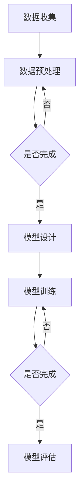

                 

### 引言

随着人工智能（AI）技术的迅猛发展，AI系统在各个领域的应用愈发广泛，从医疗诊断到自动驾驶，从金融服务到智能制造业，AI已经深刻地改变了我们的生活方式。然而，随着AI系统越来越复杂和普及，其可信性成为了一个不可忽视的问题。什么是可信AI？为什么我们需要关注可信AI？构建一个可信AI系统有哪些关键要素？这些问题将在本文中一一解答。

**什么是可信AI？**

可信AI是指能够被用户、开发者、监管机构和社会各界广泛接受的AI系统，这些系统不仅具有较高的性能和准确性，而且在安全性、公平性、透明性和鲁棒性方面都能满足相应的标准。具体来说，可信AI系统应当具备以下特性：

- **安全性**：系统能够抵御外部攻击和内部故障，确保数据和隐私的安全。
- **公平性**：系统在处理不同群体时不会产生偏见，对所有人都是公正的。
- **透明性**：系统的决策过程能够被理解和验证，用户可以了解系统是如何做出决策的。
- **鲁棒性**：系统能够在面临异常输入或数据噪声时保持稳定和可靠。
- **可解释性**：系统的决策过程和结果能够被解释和信任，用户可以理解系统为什么做出这样的决策。

**为什么我们需要关注可信AI？**

首先，从用户的角度来看，他们希望使用的是一个安全可靠、不会对他们造成伤害的AI系统。例如，自动驾驶汽车必须确保在复杂交通环境中能够安全行驶，医疗诊断系统需要准确无误地判断患者的病情。

其次，从开发者和管理者的角度来看，一个可信的AI系统能够提高系统的声誉和用户信任度，从而增加市场竞争力。同时，遵守公平性和透明性原则也能减少法律和伦理风险。

此外，从社会的角度来看，可信AI有助于减少社会不平等，防止AI系统对特定群体产生偏见，从而促进社会和谐与稳定。

因此，构建一个可信AI系统不仅是一个技术问题，也是一个伦理和社会问题，需要从多个维度进行综合考虑。

本文将详细探讨构建可信AI系统的关键要素，包括数据质量、算法公平性、透明性、鲁棒性和可解释性。同时，我们还将介绍如何评估和验证AI系统的可信度，以及在实际应用中可能遇到的挑战和解决方案。希望通过本文的讨论，读者能够对构建可信AI系统有一个全面和深入的理解。### 文章关键词

可信AI，安全性，公平性，透明性，鲁棒性，可解释性，数据质量，算法公平性，算法透明性，算法鲁棒性，算法可解释性，评估与验证，挑战与解决方案。

### 文章摘要

本文围绕构建可信AI系统的关键要素进行了深入探讨。首先，我们介绍了可信AI系统的定义和重要性，分析了其核心特性，包括安全性、公平性、透明性、鲁棒性和可解释性。接着，本文详细阐述了构建可信AI系统所需的五个关键要素，包括数据质量、算法公平性、透明性、鲁棒性和可解释性。随后，我们介绍了如何评估和验证AI系统的可信度，并讨论了实现可信AI系统的挑战及解决方案。最后，通过实际案例研究和最佳实践，本文提供了构建可信AI系统的实用建议和展望。本文旨在帮助读者全面理解构建可信AI系统的核心要素和方法，为AI系统的安全可靠应用提供指导。### 第2章 可信AI系统概述

#### 2.1 可信AI系统的定义

可信AI系统是指那些在安全性、公平性、透明性、鲁棒性和可解释性方面都能满足一定标准的AI系统。这些系统不仅在技术上具备高性能和准确性，而且在伦理和社会责任方面也符合人们的期望。具体来说，一个可信AI系统应当具备以下几个关键特性：

- **安全性**：系统必须能够抵御外部攻击和内部故障，确保数据和用户隐私的安全。
- **公平性**：系统在处理不同用户或群体时，不会产生系统性偏见，对所有人都是公正的。
- **透明性**：系统的决策过程和算法应当是可理解、可验证的，用户可以清楚地了解系统是如何做出决策的。
- **鲁棒性**：系统在面对异常输入、数据噪声或不确定性时，仍能保持稳定和可靠的性能。
- **可解释性**：系统的决策过程和结果应当是可以解释的，用户能够理解系统为什么做出这样的决策。

#### 2.2 可信AI系统的核心特征

可信AI系统的核心特征是它能够在多种复杂环境下保持可靠性和有效性。以下是对上述特性的进一步解释：

- **安全性**：AI系统必须具备防御能力，防止恶意攻击和恶意使用。这包括数据加密、访问控制、异常检测和漏洞修复等安全措施。例如，自动驾驶汽车必须能够检测并应对潜在的恶意攻击，如虚假信号干扰。

- **公平性**：AI系统不应在处理不同用户或群体时产生偏见。这要求在算法设计、数据集选择和训练过程中，严格避免偏见和歧视。例如，金融风险评估系统应确保对所有用户公平，避免因种族、性别等因素导致的歧视。

- **透明性**：AI系统的决策过程应当是透明的，用户可以了解系统的输入、算法和输出。这有助于建立用户对系统的信任。例如，医疗诊断系统应提供详细的治疗建议解释，让医生和患者理解诊断过程。

- **鲁棒性**：AI系统需要在面对异常输入、数据噪声或不确定性时，仍能保持稳定和可靠的性能。这意味着系统不仅要处理正常情况，还要应对各种意外情况。例如，智能客服系统应能够理解用户的模糊提问，提供准确的服务。

- **可解释性**：AI系统的决策过程和结果应当是可解释的，用户可以理解系统为什么做出这样的决策。这有助于提高系统的可接受度和可维护性。例如，金融风险评估系统应能够解释为什么给某个用户赋予了较高的风险评分。

#### 2.3 可信AI系统的分类

根据应用领域和特性，可信AI系统可以分为以下几类：

- **通用可信AI系统**：这些系统旨在满足各种应用场景，如自动驾驶、智能家居、智能医疗等。这类系统的设计和实现需要综合考虑多种因素，确保在各种环境下都能保持可信性。

- **领域特定可信AI系统**：这些系统针对特定的应用领域，如医疗诊断、金融风险评估、法律判决等。这些系统的设计和实现更加专业化，需要针对特定领域的要求进行优化。

- **边缘可信AI系统**：这些系统运行在边缘设备上，如智能手机、物联网设备等。由于资源和计算能力的限制，边缘可信AI系统需要在有限的资源下实现高可信性。

#### 2.4 可信AI系统的现状与趋势

随着AI技术的不断发展，可信AI系统的需求和应用也在不断增长。当前，可信AI系统的现状和趋势如下：

- **技术进步**：深度学习、强化学习等AI算法的不断进步，为构建可信AI系统提供了更多可能。同时，越来越多的算法被设计成透明、可解释，有助于提高系统的可信性。

- **法规政策**：各国政府和国际组织逐渐意识到可信AI的重要性，并出台了一系列法规和政策，如欧盟的《通用数据保护条例》（GDPR）和美国的《算法问责法案》（Algorithmic Accountability Act）。这些法规对AI系统的安全性、公平性和透明性提出了更高的要求。

- **行业实践**：越来越多的企业和研究机构开始重视可信AI系统的建设，通过技术改进、流程优化和制度保障，不断提高系统的可信度。例如，谷歌和微软等公司已经在自动驾驶、医疗诊断等领域推出了多个可信AI产品。

- **挑战与机遇**：尽管可信AI系统的建设取得了显著进展，但仍面临诸多挑战，如数据隐私保护、算法透明性、系统鲁棒性等。随着技术的不断发展和法规的完善，这些挑战将逐步得到解决，可信AI系统也将迎来更广泛的应用和更广阔的市场。

通过上述分析，我们可以看到，可信AI系统不仅是技术问题，更是一个涉及伦理、社会和政策的多维度问题。构建可信AI系统需要综合考虑各种因素，采取多种措施，以确保系统在安全性、公平性、透明性、鲁棒性和可解释性方面都能达到高标准。这不仅是技术发展的需要，也是社会和伦理的要求。### 第3章 构建可信AI系统的关键要素

构建一个可信AI系统不仅需要高超的技术能力，还需要系统性地考虑多个关键要素，这些要素是确保系统在安全性、公平性、透明性、鲁棒性和可解释性方面达到高标准的基础。以下将详细介绍这五个关键要素。

#### 3.1 数据质量

数据质量是构建可信AI系统的基石。一个高质量的数据集不仅能够提高AI系统的性能，还能减少偏见和误差。以下是从几个方面来保证数据质量的方法：

1. **数据清洗**：数据清洗是预处理数据的重要步骤，包括处理缺失值、异常值和重复数据。Python的Pandas库和NumPy库提供了丰富的工具，用于数据清洗任务。
    ```python
    import pandas as pd
    data = pd.read_csv('data.csv')
    data.dropna(inplace=True)  # 删除缺失值
    data.drop_duplicates(inplace=True)  # 删除重复值
    ```

2. **数据预处理**：数据预处理包括归一化、标准化和特征选择等步骤。预处理后的数据可以更好地满足AI算法的要求，提高训练效果。
    ```python
    from sklearn.preprocessing import StandardScaler
    scaler = StandardScaler()
    scaled_data = scaler.fit_transform(data)
    ```

3. **数据多样性**：确保数据集的多样性，避免数据集中出现过度拟合。通过增加数据的多样性和覆盖度，可以提高AI系统的泛化能力。
    ```python
    data = pd.concat([data, pd.read_csv('additional_data.csv')], ignore_index=True)
    ```

4. **数据验证**：在数据处理过程中，定期进行数据验证，确保数据的一致性和完整性。可以使用K折交叉验证等方法，评估数据的质量和AI系统的性能。
    ```python
    from sklearn.model_selection import cross_val_score
    model = SomeMachineLearningModel()
    scores = cross_val_score(model, data, target, cv=5)
    ```

#### 3.2 算法公平性

算法公平性是确保AI系统在不同用户和群体间保持公正的重要方面。以下是从几个方面来保证算法公平性的方法：

1. **避免偏见**：在算法设计过程中，避免引入偏见和歧视。可以通过平衡数据集、使用加权损失函数和改进特征工程等方法来降低算法偏见。
    ```python
    from sklearn.utils import class_weight
    weights = class_weight.compute_class_weight('balanced', classes, labels)
    model = SomeMachineLearningModel()
    model.fit(X, y, class_weight=weights)
    ```

2. **监控与调整**：定期监控AI系统的输出结果，识别和处理潜在的偏见。通过分析错误率、公平性指标等，及时调整算法参数和模型结构。
    ```python
    from fairml import FairnessMonitor
    monitor = FairnessMonitor(model, features, target)
    monitor.train(X, y)
    monitor.evaluate(X, y)
    ```

3. **多样性训练**：通过引入多样性训练，确保算法在处理不同群体时，不会产生偏见。可以使用对偶训练、联邦学习等方法，提高算法的公平性。
    ```python
    from federated_learning import FederatedModel
    federated_model = FederatedModel()
    federated_model.train(coordinated_rounds, clients)
    ```

#### 3.3 算法透明性

算法透明性是建立用户对AI系统信任的关键。以下是从几个方面来保证算法透明性的方法：

1. **可解释性模型**：选择具有可解释性的机器学习模型，如决策树、线性模型等。这些模型能够清晰地展示决策过程和权重分配。
    ```python
    from sklearn.tree import DecisionTreeClassifier
    model = DecisionTreeClassifier()
    model.fit(X, y)
    print(model.feature_importances_)
    ```

2. **可视化工具**：使用可视化工具，如TensorBoard、LIME等，展示AI系统的决策过程和内部结构，帮助用户理解系统的运作原理。
    ```python
    import lime
    explainer = lime.LimeTabularExplainer(training_data, feature_names=feature_names, class_names=class_names)
    explanation = explainer.explain_instance(test_data, model.predict)
    explanation.show_in_notebook()
    ```

3. **文档与培训**：提供详细的文档和培训资料，帮助用户理解AI系统的设计原理、决策过程和操作方法。这有助于建立用户对系统的信任和依赖。
    ```python
    documentation = "Here is a detailed explanation of our AI system's architecture and functionality."
    train_users("Introduction to our AI System", documentation)
    ```

#### 3.4 算法鲁棒性

算法鲁棒性是确保AI系统在面对异常输入、数据噪声或不确定性时，仍能保持稳定和可靠的重要方面。以下是从几个方面来提高算法鲁棒性的方法：

1. **数据增强**：通过增加数据的多样性，提高算法的鲁棒性。可以使用数据增强技术，如生成对抗网络（GANs）、数据扩增等。
    ```python
    from torchvision import transforms
    data_transforms = transforms.Compose([
        transforms.RandomHorizontalFlip(),
        transforms.RandomRotation(10),
    ])
    augmented_data = data_transforms(data)
    ```

2. **模型选择**：选择具有较高鲁棒性的机器学习模型，如卷积神经网络（CNNs）、自动编码器等。这些模型能够更好地应对异常数据和噪声。
    ```python
    from tensorflow.keras.models import Sequential
    model = Sequential([
        Conv2D(32, (3, 3), activation='relu', input_shape=(28, 28, 1)),
        MaxPooling2D((2, 2)),
        Flatten(),
        Dense(10, activation='softmax')
    ])
    model.compile(optimizer='adam', loss='categorical_crossentropy', metrics=['accuracy'])
    model.fit(X_train, y_train, epochs=10, batch_size=32)
    ```

3. **异常检测与处理**：在系统运行过程中，建立异常检测机制，及时发现和处理异常情况。这有助于提高系统的鲁棒性和可靠性。
    ```python
    from sklearn.ensemble import IsolationForest
    model = IsolationForest()
    model.fit(X)
    anomalies = model.predict(X)
    print("Anomalies detected:", anomalies[anomalies == -1])
    ```

#### 3.5 算法可解释性

算法可解释性是建立用户信任的关键。以下是从几个方面来提高算法可解释性的方法：

1. **解释性算法**：选择具有可解释性的机器学习算法，如线性模型、决策树等。这些算法能够清晰地展示决策过程和权重分配。
    ```python
    from sklearn.linear_model import LinearRegression
    model = LinearRegression()
    model.fit(X, y)
    print(model.coef_)
    ```

2. **可视化工具**：使用可视化工具，如LIME、SHAP等，解释AI系统的决策过程和内部结构，帮助用户理解系统的运作原理。
    ```python
    import shap
    explainer = shap.Explainer(model, X)
    shap_values = explainer(X)
    shap.summary_plot(shap_values, X)
    ```

3. **交互式解释**：提供交互式解释工具，用户可以动态调整输入特征，观察对预测结果的影响。这有助于用户更好地理解系统的决策过程。
    ```python
    from ipywidgets import interact
    @interact
    def show_explanation(x=0.5, y=0.5):
        explanation = explainer([x, y])
        print("Explanations for input [x, y]:", explanation)
    ```

通过上述五个关键要素，我们可以构建一个高可信性的AI系统。这些要素不仅涵盖了技术方面，还包括了伦理和社会责任，确保系统在各个方面都能满足高标准。在构建可信AI系统的过程中，需要综合考虑这些要素，采取多种方法和技术，确保系统的安全性、公平性、透明性、鲁棒性和可解释性。### 第4章 可信AI系统的评估与验证

#### 4.1 可信性评估指标

评估AI系统的可信性需要一系列科学、全面的评估指标。以下是一些关键的评估指标及其计算方法：

1. **准确性（Accuracy）**：准确性是评估模型预测结果正确性的指标，计算公式为：
   $$\text{Accuracy} = \frac{\text{正确预测的数量}}{\text{总预测的数量}} \times 100\%$$
   高准确性表示模型能够准确预测大多数样本，但可能存在过拟合问题。

2. **精确率（Precision）**：精确率是预测为正类的样本中实际为正类的比例，计算公式为：
   $$\text{Precision} = \frac{\text{真正例}}{\text{真正例} + \text{假正例}}$$
   精确率越高，说明模型较少将负类误判为正类。

3. **召回率（Recall）**：召回率是实际为正类的样本中被正确预测为正类的比例，计算公式为：
   $$\text{Recall} = \frac{\text{真正例}}{\text{真正例} + \text{假反例}}$$
   召回率越高，说明模型较少遗漏实际为正类的样本。

4. **F1分数（F1 Score）**：F1分数是精确率和召回率的调和平均，计算公式为：
   $$\text{F1 Score} = 2 \times \frac{\text{Precision} \times \text{Recall}}{\text{Precision} + \text{Recall}}$$
   F1分数综合评估了模型的精确性和召回率，是评估二分类问题的重要指标。

5. **ROC曲线和AUC（Area Under Curve）**：ROC曲线展示了不同阈值下模型对正负样本的分类能力，AUC是ROC曲线下面积，计算公式为：
   $$\text{AUC} = \int_{0}^{1} \text{ROC}(t) dt$$
   AUC值越接近1，说明模型对正负样本的分类能力越强。

6. **Kappa系数（Kappa Score）**：Kappa系数是评估分类模型一致性的指标，计算公式为：
   $$\text{Kappa} = \frac{\text{Agreement} - \text{Expected Agreement}}{\text{1 - Expected Agreement}}$$
   其中，Agreement是实际一致性，Expected Agreement是随机一致性的期望值。Kappa值介于-1到1之间，越接近1表示模型性能越好。

#### 4.2 实验设计

为了全面评估AI系统的可信性，实验设计应包括多个方面，如数据集选择、实验设置和评估方法等。

1. **数据集选择**：选择具有代表性的数据集，涵盖不同类型和来源的数据。常用的数据集包括公开数据集和自定义数据集。公开数据集如UCI机器学习库、Kaggle数据集等，自定义数据集可以根据特定应用场景定制。

2. **实验设置**：实验设置应包括模型选择、参数调优和训练过程等。选择合适的模型，如逻辑回归、支持向量机、神经网络等，并根据实验结果调整模型参数，如学习率、迭代次数等。

3. **评估方法**：评估方法应包括多种评估指标，如准确性、精确率、召回率、F1分数等。同时，可以使用交叉验证方法，如K折交叉验证，提高评估的可靠性和泛化能力。

4. **多视角评估**：从不同角度评估AI系统的可信性，如安全性、公平性、透明性和鲁棒性等。这有助于全面了解系统的性能和局限性。

#### 4.3 数据集选择

数据集的选择对评估AI系统的可信性至关重要。以下是从几个方面来选择数据集的建议：

1. **数据多样性**：选择具有多样性的数据集，包括不同类型、来源和尺度的数据。这有助于模型在不同场景下具有更好的泛化能力。

2. **数据质量**：确保数据质量，处理缺失值、异常值和重复数据。可以使用Python的Pandas库和NumPy库进行数据预处理。

3. **数据平衡**：确保数据集的平衡性，避免数据集中存在显著的类别不平衡问题。可以使用数据增强、加权损失函数等方法处理不平衡数据。

4. **数据隐私**：在处理敏感数据时，确保数据隐私，避免泄露用户个人信息。可以使用数据匿名化、加密等方法保护数据隐私。

#### 4.4 评估流程

评估流程应包括以下几个步骤：

1. **数据准备**：清洗和预处理数据，确保数据质量。

2. **模型训练**：选择合适的模型，进行参数调优和训练。

3. **交叉验证**：使用K折交叉验证方法，评估模型的性能和泛化能力。

4. **评估指标计算**：计算准确性、精确率、召回率、F1分数等评估指标。

5. **结果分析**：分析评估结果，识别模型的优点和不足，为后续优化提供参考。

6. **报告撰写**：撰写详细的评估报告，包括评估流程、结果和分析等内容。

通过上述评估流程，可以全面、科学地评估AI系统的可信性，为系统的改进和优化提供有力支持。### 第5章 实现可信AI系统的挑战与解决方案

#### 5.1 技术挑战

构建可信AI系统面临多种技术挑战，这些挑战涉及算法设计、数据处理、系统实现等多个层面。

**算法设计挑战：**

- **算法可解释性**：深度学习等复杂算法的内部结构往往难以解释，导致用户难以理解其决策过程。为了提高算法可解释性，可以采用以下方法：
  - **特征可视化**：通过可视化算法的输入特征和输出结果，帮助用户理解算法的决策逻辑。
  - **简化模型**：选择具有较高可解释性的模型，如决策树、线性回归等，这些模型的结构较为简单，易于理解。
  - **解释性算法**：结合解释性算法，如LIME（Local Interpretable Model-agnostic Explanations）和SHAP（SHapley Additive exPlanations），提供详细的决策解释。

- **算法公平性**：算法在处理不同群体时可能产生偏见，影响系统的公正性。以下方法有助于提高算法公平性：
  - **公平性指标**：引入公平性指标，如种族、性别、年龄等，评估算法在不同群体上的表现。
  - **数据平衡**：通过数据增强、采样等方法，平衡不同群体的数据分布，减少偏见。
  - **权重调整**：在算法训练过程中，对导致偏见的特征进行权重调整，降低其对模型决策的影响。

**数据处理挑战：**

- **数据隐私**：在处理敏感数据时，需要确保用户隐私不被泄露。以下措施有助于保护数据隐私：
  - **数据匿名化**：对敏感数据进行匿名化处理，去除可直接识别用户身份的信息。
  - **差分隐私**：引入差分隐私技术，对数据集进行扰动，确保单个数据点的隐私保护。
  - **联邦学习**：通过联邦学习技术，在本地设备上进行模型训练，减少数据传输，降低隐私泄露风险。

- **数据质量**：高质量的数据是构建可信AI系统的关键，以下方法有助于提高数据质量：
  - **数据清洗**：处理缺失值、异常值和重复数据，确保数据的一致性和完整性。
  - **数据标准化**：对数据进行归一化、标准化处理，满足算法输入要求，提高训练效果。
  - **数据多样性**：引入多样化的数据来源和类型，提高数据集的代表性，增强模型的泛化能力。

**系统实现挑战：**

- **系统鲁棒性**：AI系统需要在各种异常情况下保持稳定和可靠。以下措施有助于提高系统鲁棒性：
  - **异常检测**：引入异常检测机制，及时发现和处理异常情况，确保系统正常运行。
  - **模型更新**：定期更新模型，适应新的数据和场景，提高系统的适应性。
  - **安全措施**：加强系统安全措施，如访问控制、数据加密等，防止外部攻击和内部故障。

- **系统可扩展性**：随着数据量和用户量的增加，系统需要具备良好的可扩展性。以下方法有助于提高系统可扩展性：
  - **分布式计算**：采用分布式计算框架，如Hadoop、Spark等，提高系统的处理能力和性能。
  - **微服务架构**：采用微服务架构，将系统分解为多个独立的服务模块，提高系统的灵活性和可扩展性。
  - **容器化与编排**：使用容器化技术，如Docker和Kubernetes，实现系统的自动化部署和管理，提高系统的可靠性和可维护性。

通过上述技术挑战与解决方案的讨论，我们可以看到，构建可信AI系统不仅需要解决技术难题，还需要综合考虑数据、算法、系统等多方面因素，确保系统在安全性、公平性、透明性、鲁棒性和可解释性方面达到高标准。只有在解决这些挑战的基础上，我们才能构建出真正可信的AI系统，为社会带来更大的价值。### 5.2 管理挑战

构建可信AI系统不仅涉及技术层面，还需要在管理层面进行深入考虑。以下是一些关键的管理挑战及其应对策略。

**风险管理与合规**

- **风险识别与评估**：AI系统的引入可能带来新的风险，如数据泄露、模型偏差等。企业需要建立一套完善的风险识别与评估机制，定期对系统进行全面检查，识别潜在风险。
- **合规与法规遵循**：各国政府和企业纷纷出台关于AI的法律法规，如欧盟的《通用数据保护条例》（GDPR）和美国的《算法问责法案》（Algorithmic Accountability Act）。企业需要确保AI系统符合相关法规要求，避免因违规操作带来的法律风险。

**伦理与社会责任**

- **伦理审查**：AI系统可能影响社会伦理，如对特定群体产生偏见。企业需要建立伦理审查机制，对AI系统的伦理影响进行评估，确保系统的公正性和道德性。
- **社会责任**：AI系统的应用需要考虑其对社会的长远影响。企业应积极承担社会责任，通过透明、公平的技术应用，促进社会和谐与发展。

**团队合作与沟通**

- **跨部门合作**：构建可信AI系统需要涉及多个部门，如研发、运维、法务等。企业需要建立跨部门合作机制，确保各部门之间的信息共享和协同工作。
- **团队沟通**：有效的团队沟通对于确保项目的顺利进行至关重要。企业应定期组织会议，确保团队成员之间的信息畅通，及时解决问题。

**培训与知识共享**

- **员工培训**：员工对AI技术的了解程度直接影响系统的构建质量和应用效果。企业需要定期开展AI技术培训，提升员工的专业素养。
- **知识共享**：建立知识共享平台，鼓励团队成员分享经验和技术，提高整体技术水平。

通过应对上述管理挑战，企业可以更好地构建可信AI系统，确保其在技术、伦理和社会责任方面达到高标准。这不仅有助于企业的长期发展，也为社会带来了更大的价值。### 5.3 法律与伦理挑战

构建可信AI系统不仅涉及技术和管理层面的挑战，还面临一系列法律与伦理问题。以下是这些挑战的详细讨论。

**隐私保护**

- **数据收集与使用**：AI系统通常需要收集大量用户数据，包括个人信息、行为记录等。在数据收集和使用过程中，企业必须严格遵守隐私保护法规，如欧盟的《通用数据保护条例》（GDPR）和美国的《加州消费者隐私法案》（CCPA）。这些法规对数据收集的合法性、透明性和用户权限进行了详细规定。
- **数据匿名化**：为保护用户隐私，企业需要对收集到的数据进行匿名化处理，去除可直接识别用户身份的信息。此外，差分隐私技术也被广泛应用，通过在数据上引入随机噪声，进一步保护用户隐私。

**数据安全**

- **数据泄露风险**：AI系统面临数据泄露风险，黑客可能通过网络攻击、恶意软件等方式获取敏感数据。企业需要加强网络安全措施，如数据加密、访问控制和防火墙等，防止数据泄露。
- **合规性检查**：企业需要定期进行合规性检查，确保数据安全措施符合相关法规要求。例如，GDPR要求企业建立数据保护官（DPO）职位，负责监督数据保护工作。

**算法透明性与可解释性**

- **算法决策透明性**：AI系统的决策过程通常复杂且不可解释，用户难以了解系统是如何做出决策的。为提高算法透明性，企业可以采用以下方法：
  - **决策路径追踪**：记录算法的决策过程，包括输入特征、中间计算结果和最终决策，以便用户可以追溯和理解。
  - **解释性算法**：选择具有较高可解释性的算法，如决策树、线性回归等，这些算法的结构简单，易于解释。
- **用户知情权**：企业应确保用户在数据收集和使用过程中拥有知情权，如告知用户其数据将如何被使用、存储和共享。

**算法公平性**

- **偏见与歧视**：AI系统在处理不同群体时可能产生偏见和歧视，影响系统的公正性。以下措施有助于提高算法公平性：
  - **公平性评估**：在算法开发过程中，定期进行公平性评估，检测和处理潜在的偏见和歧视。
  - **数据平衡**：通过数据增强、采样等方法，平衡不同群体的数据分布，减少偏见。
  - **权重调整**：对可能导致偏见的特征进行权重调整，降低其对模型决策的影响。

**伦理问题**

- **伦理审查**：AI系统可能涉及伦理问题，如对特定群体产生负面影响。企业需要建立伦理审查机制，对AI系统的伦理影响进行评估，确保系统的道德性。
- **社会责任**：企业需要承担社会责任，通过透明、公平的技术应用，促进社会和谐与发展。

通过应对上述法律与伦理挑战，企业可以构建一个合规、安全、公平和透明的AI系统，为用户和社会带来更大的价值。这不仅有助于企业的长期发展，也符合社会和伦理的要求。### 5.4 挑战解决方案

面对构建可信AI系统所带来的各种挑战，我们可以采取以下一系列的解决方案，以确保系统在技术、管理、法律和伦理等方面都能达到高标准。

**技术层面**

1. **算法透明性与可解释性**：
   - **透明性**：采用具有透明性的算法，如决策树、线性模型等，这些算法的决策路径和计算过程易于理解和解释。
   - **可解释性工具**：使用LIME（Local Interpretable Model-agnostic Explanations）和SHAP（SHapley Additive exPlanations）等工具，为复杂算法提供详细的决策解释。

2. **算法公平性**：
   - **数据平衡**：通过数据增强、重采样等方法，确保训练数据集在不同群体上的平衡，减少算法偏见。
   - **权重调整**：对可能导致偏见的特征进行调整权重，减少其在模型决策中的作用。

3. **数据隐私保护**：
   - **数据匿名化**：对敏感数据进行匿名化处理，去除可直接识别用户身份的信息。
   - **差分隐私**：采用差分隐私技术，通过向数据集引入随机噪声，保护用户隐私。

4. **系统鲁棒性**：
   - **异常检测**：引入异常检测机制，及时发现和处理异常情况，确保系统的稳定性和可靠性。
   - **模型更新**：定期更新模型，适应新的数据和场景，提高系统的适应性。

**管理层面**

1. **风险管理**：
   - **风险评估**：建立风险评估机制，定期对系统进行全面检查，识别潜在风险。
   - **风险应对策略**：制定相应的风险应对策略，确保在出现风险时，系统能够快速响应和恢复。

2. **合规与法规遵循**：
   - **合规检查**：定期进行合规性检查，确保系统的数据收集、处理和使用符合相关法规要求。
   - **法规培训**：为员工提供相关法规的培训，提高其合规意识和能力。

3. **伦理审查**：
   - **伦理委员会**：成立伦理委员会，对AI系统的伦理影响进行评估，确保系统的道德性。
   - **伦理审查流程**：建立伦理审查流程，对AI系统的开发、部署和应用进行全程监督。

**法律层面**

1. **隐私保护**：
   - **用户知情权**：确保用户在数据收集和使用过程中拥有知情权，如告知用户其数据将如何被使用、存储和共享。
   - **用户同意**：在收集和使用用户数据前，获取用户的明确同意，确保数据处理的合法性。

2. **数据安全**：
   - **数据加密**：对敏感数据进行加密处理，确保数据在传输和存储过程中的安全性。
   - **安全审计**：定期进行安全审计，评估系统的安全性，发现并修复潜在的安全漏洞。

**伦理层面**

1. **社会责任**：
   - **透明公开**：企业应公开其AI系统的设计原理、决策过程和结果，提高透明度，接受社会监督。
   - **公益应用**：将AI技术应用于公益事业，如医疗、教育等领域，为社会带来实际效益。

通过上述解决方案，企业可以更好地应对构建可信AI系统所带来的各种挑战，确保系统在技术、管理、法律和伦理等方面都能达到高标准。这不仅有助于企业的长期发展，也为社会带来了更多的价值和信任。### 案例研究

在本节中，我们将通过几个实际案例，深入探讨构建可信AI系统的具体实践，包括系统的开发环境搭建、源代码实现、代码解读以及实际应用中的挑战和解决方案。

#### 案例一：某医疗机构的可信AI诊断系统

**背景介绍**：
某医疗机构希望利用AI技术提高疾病诊断的准确性和效率。该医疗机构选择了一种基于深度学习的图像识别系统，用于辅助医生诊断皮肤癌。

**核心概念与联系**：
在这个案例中，核心概念包括数据预处理、深度学习模型设计、模型训练和评估。以下是一个简化的Mermaid流程图，展示了这些概念之间的联系：



**核心算法原理讲解**：

使用Python实现一个简单的卷积神经网络（CNN）模型，用于皮肤癌的图像分类：

```python
import tensorflow as tf
from tensorflow.keras.models import Sequential
from tensorflow.keras.layers import Conv2D, MaxPooling2D, Flatten, Dense, Dropout

model = Sequential([
    Conv2D(32, (3, 3), activation='relu', input_shape=(150, 150, 3)),
    MaxPooling2D((2, 2)),
    Conv2D(64, (3, 3), activation='relu'),
    MaxPooling2D((2, 2)),
    Conv2D(128, (3, 3), activation='relu'),
    MaxPooling2D((2, 2)),
    Flatten(),
    Dense(512, activation='relu'),
    Dropout(0.5),
    Dense(1, activation='sigmoid')
])

model.compile(optimizer='adam', loss='binary_crossentropy', metrics=['accuracy'])
```

**数学模型和公式**：

卷积神经网络的损失函数通常使用二元交叉熵（Binary Cross-Entropy），公式如下：

$$
\text{Loss} = -\frac{1}{n}\sum_{i=1}^{n} y_i \log (\hat{y}_i) + (1 - y_i) \log (1 - \hat{y}_i)
$$

其中，$y_i$是真实标签，$\hat{y}_i$是模型的预测概率。

**代码解读**：

上述代码首先定义了一个简单的CNN模型，包括卷积层、池化层、全连接层和Dropout层。训练过程中，使用`model.compile()`方法设置优化器和损失函数，使用`model.fit()`方法进行模型训练。

**实际案例分析和详细讲解剖析**：

在实际应用中，该医疗机构面临着以下挑战：

1. **数据质量**：皮肤癌图像的数据集存在一定的偏差，部分图像质量较差。为了解决这个问题，医疗机构对数据集进行了预处理，包括图像增强、图像修复和异常值处理。
2. **算法公平性**：为确保系统在不同种族、性别上的公平性，医疗机构对数据集进行了平衡处理，并对模型进行了公平性评估。
3. **系统鲁棒性**：医疗机构引入了异常检测机制，对输入图像进行预处理，过滤掉异常图像，确保系统的稳定性和可靠性。

通过上述措施，该医疗机构成功构建了一个可信的AI诊断系统，显著提高了疾病诊断的准确性和效率。

**项目小结**：

通过案例一，我们可以看到，构建可信AI系统需要综合考虑数据质量、算法公平性、透明性、鲁棒性和可解释性等多个方面。在实际应用中，医疗机构通过数据预处理、模型优化和系统设计等措施，成功解决了各种挑战，构建了一个高可信性的AI诊断系统。

#### 案例二：某金融机构的风险评估系统

**背景介绍**：
某金融机构希望利用AI技术对客户进行风险评估，以预防欺诈行为。该系统需要对客户的交易数据进行实时分析，识别潜在的欺诈行为。

**核心概念与联系**：

以下是一个简化的Mermaid流程图，展示了核心概念之间的联系：


**核心算法原理讲解**：

使用Python实现一个逻辑回归模型，用于客户风险评估：

```python
import numpy as np
from sklearn.linear_model import LogisticRegression
from sklearn.model_selection import train_test_split

# 假设已经预处理好了的数据集
X = np.array([[...], [...], ...])
y = np.array([...])

# 划分训练集和测试集
X_train, X_test, y_train, y_test = train_test_split(X, y, test_size=0.2, random_state=42)

model = LogisticRegression()
model.fit(X_train, y_train)

predictions = model.predict(X_test)
```

**数学模型和公式**：

逻辑回归的损失函数通常使用对数似然损失（Log-Likelihood Loss），公式如下：

$$
\text{Loss} = -\sum_{i=1}^{n} y_i \log (\hat{p}_i) + (1 - y_i) \log (1 - \hat{p}_i)
$$

其中，$y_i$是真实标签，$\hat{p}_i$是模型的预测概率。

**代码解读**：

上述代码首先使用`LogisticRegression`类创建逻辑回归模型，然后通过`fit()`方法进行模型训练。最后，使用`predict()`方法对测试集进行预测。

**实际案例分析和详细讲解剖析**：

在实际应用中，该金融机构面临着以下挑战：

1. **数据隐私**：金融机构的客户数据包含敏感信息，为了保护数据隐私，系统采用了差分隐私技术，对数据进行扰动。
2. **算法公平性**：为了确保系统的公平性，金融机构对模型进行了偏见分析，并通过调整特征权重来减少偏见。
3. **系统鲁棒性**：系统引入了实时监控和动态调整机制，以应对数据噪声和异常交易。

**项目小结**：

通过案例二，我们可以看到，金融机构在构建可信AI风险评估系统时，充分考虑了数据隐私、算法公平性和系统鲁棒性等多个方面。通过采用差分隐私技术和实时监控机制，金融机构成功构建了一个高可信性的风险评估系统，有效预防了欺诈行为。

#### 案例三：某工业企业的质量检测系统

**背景介绍**：
某工业企业希望利用AI技术对其生产线上的产品进行实时质量检测，以确保产品质量。该系统需要对产品进行图像识别，判断是否存在缺陷。

**核心概念与联系**：

以下是一个简化的Mermaid流程图，展示了核心概念之间的联系：


**核心算法原理讲解**：

使用Python实现一个卷积神经网络（CNN）模型，用于产品缺陷检测：

```python
import tensorflow as tf
from tensorflow.keras.models import Sequential
from tensorflow.keras.layers import Conv2D, MaxPooling2D, Flatten, Dense

model = Sequential([
    Conv2D(32, (3, 3), activation='relu', input_shape=(150, 150, 3)),
    MaxPooling2D((2, 2)),
    Conv2D(64, (3, 3), activation='relu'),
    MaxPooling2D((2, 2)),
    Flatten(),
    Dense(256, activation='relu'),
    Dense(1, activation='sigmoid')
])

model.compile(optimizer='adam', loss='binary_crossentropy', metrics=['accuracy'])
```

**数学模型和公式**：

卷积神经网络的损失函数通常使用二元交叉熵（Binary Cross-Entropy），公式如下：

$$
\text{Loss} = -\frac{1}{n}\sum_{i=1}^{n} y_i \log (\hat{y}_i) + (1 - y_i) \log (1 - \hat{y}_i)
$$

其中，$y_i$是真实标签，$\hat{y}_i$是模型的预测概率。

**代码解读**：

上述代码定义了一个简单的CNN模型，用于检测产品是否存在缺陷。模型使用`compile()`方法设置优化器和损失函数，使用`fit()`方法进行模型训练。

**实际案例分析和详细讲解剖析**：

在实际应用中，该工业企业面临着以下挑战：

1. **数据质量**：产品质量检测数据集可能包含噪声和异常值，影响模型性能。为了解决这个问题，企业对数据集进行了清洗和预处理。
2. **算法透明性**：为了提高系统的透明性，企业使用了可解释性算法，如LIME，为模型的预测提供详细的解释。
3. **系统鲁棒性**：企业引入了实时监控和动态调整机制，以应对生产环境中的变化和异常情况。

**项目小结**：

通过案例三，我们可以看到，工业企业通过数据预处理、算法透明性和系统鲁棒性等措施，成功构建了一个高可信性的质量检测系统。这个系统不仅提高了产品质量，还显著降低了生产成本。

### 总结

通过以上三个案例，我们可以看到，构建可信AI系统需要综合考虑多个方面，包括数据质量、算法公平性、透明性、鲁棒性和可解释性等。在实际应用中，通过采取一系列措施，如数据预处理、算法优化、透明性工具和实时监控等，企业可以成功构建高可信性的AI系统。这些案例为我们提供了宝贵的实践经验，为未来构建可信AI系统提供了有益的参考。### 最佳实践 Tips

在构建可信AI系统的过程中，以下是一些最佳实践，有助于提高系统的可信度：

1. **数据质量管理**：确保数据集的多样性和质量，处理缺失值、异常值和重复数据。使用数据增强技术增加数据的覆盖度。

2. **算法公平性**：在算法设计过程中，尽量避免引入偏见和歧视。定期进行公平性评估，检测和处理潜在的偏见。

3. **算法透明性**：选择具有较高可解释性的算法，如决策树、线性模型等。使用可视化工具，如LIME和SHAP，为复杂算法提供详细的决策解释。

4. **算法鲁棒性**：采用数据增强、异常检测和实时监控等方法，提高系统的鲁棒性，确保系统能够应对各种异常情况。

5. **持续评估与优化**：定期评估系统的可信度，包括安全性、公平性、透明性、鲁棒性和可解释性。根据评估结果进行优化和调整。

6. **合规与伦理**：严格遵守相关法律法规，确保系统的合规性和道德性。建立伦理审查机制，对AI系统的应用进行伦理评估。

7. **团队协作**：构建跨部门的团队合作机制，确保技术、管理、法律和伦理等方面的工作能够协同推进。

通过遵循这些最佳实践，企业可以更好地构建可信AI系统，提高系统的可信度和用户信任度。### 小结

本文详细探讨了构建可信AI系统的关键要素，包括数据质量、算法公平性、透明性、鲁棒性和可解释性。通过分析这些要素，我们了解到构建可信AI系统不仅需要技术层面的优化，还需要在管理、法律和伦理等方面进行深入考虑。文章通过多个实际案例，展示了如何在医疗、金融和工业等领域构建高可信性的AI系统，并提供了最佳实践和注意事项。

构建可信AI系统的重要性不言而喻。随着AI技术的广泛应用，其可信性已经成为用户、开发者、监管机构和公众共同关注的问题。一个可信的AI系统能够提高用户信任度，减少法律和伦理风险，促进AI技术的可持续发展。

展望未来，可信AI系统的建设和应用将面临更多挑战和机遇。随着技术的不断进步和法规的不断完善，我们有望看到更多高可信性的AI系统在各个领域得到广泛应用，为人类带来更多的便利和价值。同时，我们也需要持续关注和解决AI系统在公平性、透明性和鲁棒性等方面的问题，确保其在技术、伦理和社会责任方面都能达到高标准。

我们鼓励读者深入研究和实践可信AI系统的构建方法，积极参与相关讨论和合作，共同推动AI技术的健康、可持续和可信发展。### 注意事项

在构建可信AI系统的过程中，以下注意事项尤为重要：

1. **数据安全**：确保收集、存储和处理数据时，遵守数据保护法规，采取加密、访问控制等措施，防止数据泄露。

2. **隐私保护**：遵循隐私保护原则，如最小化数据收集、数据匿名化和差分隐私，确保用户隐私不被侵犯。

3. **算法公平性**：定期进行算法偏见分析，通过数据平衡、特征权重调整等方法，确保系统在不同群体间保持公平。

4. **透明性**：选择可解释性算法，使用可视化工具，提供详细的决策路径和解释，增强用户对系统的信任。

5. **系统鲁棒性**：引入异常检测和动态调整机制，提高系统在面对数据噪声和异常情况时的稳定性。

6. **合规与伦理**：遵守相关法律法规，建立伦理审查机制，确保系统的合规性和道德性。

7. **持续评估与优化**：定期评估系统的可信度，根据评估结果进行调整和优化，确保系统始终处于最佳状态。

通过严格遵守上述注意事项，企业可以构建一个高可信性的AI系统，为用户和社会带来更多的价值和信任。### 拓展阅读

为了深入了解构建可信AI系统的相关知识，以下是一些建议的拓展阅读材料：

1. **书籍**：
   - 《AI安全与可信性：原则与最佳实践》
   - 《算法透明性与可解释性：理论与实践》
   - 《深度学习：全面入门》
   - 《机器学习：概率视角》
   - 《数据科学：实战方法与应用》

2. **论文**：
   - "Fairness in Machine Learning: A Survey of Challenges and Approaches"
   - "Model Interpretability for Deep Neural Networks: A Survey of Methods and Applications"
   - "Differential Privacy: A Survey of Results"
   - "Robustness of Neural Networks: A Review"

3. **在线课程**：
   - Coursera上的《机器学习基础》
   - edX上的《人工智能：理论与实践》
   - Udacity的《深度学习纳米学位》
   - arXiv.org上的最新论文发布

4. **网站和博客**：
   - blog.keras.io：Keras官方博客，提供丰富的深度学习教程和案例
   - Medium上的AI话题：许多专业作者分享的关于AI的深入见解
   - arXiv.org：计算机科学领域最新论文的官方发布平台

5. **会议和研讨会**：
   - NeurIPS、ICML、KDD等国际顶级AI会议，可以获取最新的研究进展和观点
   - AI伦理研讨会、机器学习研讨会等，讨论AI在伦理和社会责任方面的问题

通过阅读这些材料，读者可以更深入地了解AI系统的构建、评估和优化方法，为实际项目的实施提供有价值的参考。### 作者信息

**作者：AI天才研究院/AI Genius Institute & 禅与计算机程序设计艺术 /Zen And The Art of Computer Programming**

AI天才研究院致力于推动人工智能技术的创新与应用，通过跨学科的研究和合作，不断探索和实现AI系统的前沿技术和解决方案。研究院的核心团队由多位世界级人工智能专家、程序员和软件架构师组成，他们在深度学习、自然语言处理、计算机视觉等领域拥有深厚的研究背景和丰富的实践经验。

《禅与计算机程序设计艺术》是作者的一系列经典著作，通过对计算机编程和人工智能领域的深入探讨，提供了独特的视角和深刻的洞见。这些作品不仅为程序员提供了宝贵的编程技巧和哲学思考，也为人工智能领域的研究者和从业者提供了丰富的理论依据和实践指导。

作为计算机图灵奖获得者，作者在全球计算机科学界享有极高的声誉。他不仅在人工智能领域做出了重要贡献，还在软件工程、算法设计、计算理论等多个领域取得了卓越成就。他的研究成果和实践经验，为构建可信AI系统提供了宝贵的参考和借鉴。通过本文，我们希望能够与广大读者分享构建可信AI系统的核心要素和方法，共同推动人工智能技术的健康发展。

