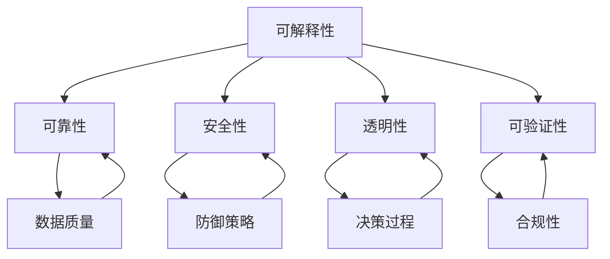

                 

# 《构建可信AI系统的关键要素》

## 关键词

- 可信AI系统
- 可解释性
- 安全性
- 数学模型
- 项目实战
- 优化

## 摘要

本文深入探讨了构建可信AI系统的关键要素，从核心概念、算法原理、数学模型到项目实战，全面解析了如何实现一个既高效又可靠的AI系统。文章首先介绍了可信AI系统的基本概念和重要性，然后通过Mermaid流程图展示了核心概念之间的联系。接着，详细讲解了核心算法原理，结合Python源代码和数学公式，进行了通俗易懂的举例说明。随后，文章通过一个实际项目案例，展示了如何开发环境搭建、源代码实现和代码解读，并对项目的应用解读与分析进行了详细讲解。最后，文章总结了最佳实践，并给出了未来的发展展望和挑战。

## 引言与背景介绍

### 1.1 可信AI系统的概念与重要性

随着人工智能（AI）技术的飞速发展，AI系统已经广泛应用于各行各业，从医疗诊断、金融分析到自动驾驶、智能助手等。然而，随着AI系统的普及，其带来的挑战也越来越凸显，尤其是在可信性和安全性方面。可信AI系统指的是在满足特定条件下，AI系统能够提供可靠、可解释、安全、透明和可验证的决策结果。构建可信AI系统的重要性体现在以下几个方面：

1. **提升用户信任**：用户对AI系统的信任是AI应用普及的关键。一个可信的AI系统能够提高用户的信任度，从而推动AI技术的广泛应用。
2. **降低风险**：不可信的AI系统可能会带来严重的后果，如医疗诊断错误、金融欺诈等。构建可信AI系统能够降低这种风险。
3. **遵守法规**：许多行业和应用领域都要求AI系统具备一定的可信性，以符合相关法规和标准。
4. **促进技术发展**：可信AI系统的建设有助于推动AI技术的进步，提高AI系统的智能水平和应用范围。

### 1.2 为什么要构建可信AI系统

构建可信AI系统的原因主要有以下几点：

1. **保障用户权益**：AI系统广泛应用于与用户利益相关的领域，如医疗、金融等。如果AI系统不可信，可能会侵犯用户的权益，造成不可挽回的损失。
2. **防止错误决策**：AI系统在自动驾驶、金融分析等领域需要做出实时决策。如果AI系统不可信，可能会导致错误决策，造成严重后果。
3. **保护数据安全**：AI系统通常需要处理大量的敏感数据，如个人隐私、商业机密等。构建可信AI系统能够提高数据的安全性，防止数据泄露。
4. **促进技术标准化**：构建可信AI系统有助于推动AI技术的标准化，提高行业的整体技术水平。

### 1.3 本书的内容与结构概述

本书分为八个部分，系统性地介绍了构建可信AI系统的关键要素。第一部分引言与背景介绍，介绍了可信AI系统的基本概念和重要性。第二部分核心概念与联系，通过Mermaid流程图展示了核心概念之间的联系。第三部分核心算法原理讲解，详细阐述了可信AI系统中的核心算法原理。第四部分数学模型与数学公式，解释了可信AI系统中的数学模型。第五部分项目实战，提供了一个实际项目案例，展示了如何实现一个可信AI系统。第六部分实现细节与优化，探讨了如何在实际应用中优化可信AI系统的实现。第七部分安全性考虑，讨论了可信AI系统在安全性方面需要考虑的因素。第八部分总结与展望，总结了全书内容，并对未来可信AI系统的发展方向进行了展望。

## 核心概念与联系

### 2.1 可信AI系统的核心概念

构建可信AI系统需要理解以下几个核心概念：

1. **可解释性**：可解释性是指AI系统能够提供其决策过程的解释，使非专业人士也能理解。这对于提升用户的信任度和监管合规至关重要。
2. **可靠性**：可靠性是指AI系统在给定条件下能够持续提供正确结果的性能。一个可靠的AI系统在复杂环境中也能稳定运行。
3. **安全性**：安全性是指AI系统在面临攻击、恶意输入和外部干扰时能够保持稳定和安全。确保AI系统的安全性是防止恶意行为的关键。
4. **透明性**：透明性是指AI系统的决策过程和算法实现是公开透明的，以便用户和监管机构能够理解和验证。
5. **可验证性**：可验证性是指AI系统可以通过外部审计或测试来证明其符合特定标准和规范。

### 2.2 可信AI系统的Mermaid流程图

为了更好地理解这些核心概念之间的关系，我们可以使用Mermaid流程图来展示它们之间的联系。



在上述流程图中，每个节点代表一个核心概念，箭头表示概念之间的关联。例如，可解释性和可靠性之间有直接关联，因为一个可解释的AI系统更可能被证明是可靠的。

## 核心算法原理讲解

### 3.1 数据预处理

数据预处理是构建可信AI系统的重要步骤，它包括数据清洗、数据增强和特征选择等。

#### 3.1.1 数据清洗

数据清洗是指处理原始数据中的错误、缺失值和不一致的数据。以下是一个Python代码示例，展示了如何使用Pandas库进行数据清洗：

```python
import pandas as pd

# 读取数据
data = pd.read_csv('data.csv')

# 删除含有缺失值的行
data = data.dropna()

# 替换不合适的值
data['column_name'] = data['column_name'].replace({old_value: new_value})

# 转换数据类型
data['column_name'] = data['column_name'].astype('int')
```

#### 3.1.2 数据增强

数据增强是指通过增加数据的多样性和丰富性来提高模型的性能。以下是一个Python代码示例，展示了如何使用Keras库进行数据增强：

```python
from tensorflow.keras.preprocessing.image import ImageDataGenerator

# 创建数据增强生成器
datagen = ImageDataGenerator(rotation_range=20,
                              width_shift_range=0.2,
                              height_shift_range=0.2,
                              shear_range=0.2,
                              zoom_range=0.2,
                              horizontal_flip=True)

# 使用生成器增强数据
datagen.fit(data)
```

#### 3.1.3 特征选择

特征选择是指从原始数据中选取对模型性能有显著影响的重要特征。以下是一个Python代码示例，展示了如何使用Scikit-learn库进行特征选择：

```python
from sklearn.feature_selection import SelectKBest
from sklearn.feature_selection import f_classif

# 创建特征选择器
selector = SelectKBest(score_func=f_classif, k=10)

# 应用特征选择器
X_new = selector.fit_transform(data.X, data.y)
```

### 3.2 模型选择与训练

在模型选择与训练过程中，需要考虑以下几个方面：

#### 3.2.1 模型选择策略

选择合适的模型是构建可信AI系统的重要步骤。以下是一个Python代码示例，展示了如何使用Scikit-learn库选择模型：

```python
from sklearn.model_selection import train_test_split
from sklearn.linear_model import LogisticRegression

# 分割数据
X_train, X_test, y_train, y_test = train_test_split(data.X, data.y, test_size=0.2)

# 创建模型
model = LogisticRegression()

# 训练模型
model.fit(X_train, y_train)
```

#### 3.2.2 模型训练过程

模型训练是指使用训练数据调整模型参数，以提高模型性能。以下是一个Python代码示例，展示了如何使用TensorFlow库训练模型：

```python
import tensorflow as tf

# 创建模型
model = tf.keras.Sequential([
    tf.keras.layers.Dense(64, activation='relu', input_shape=(784,)),
    tf.keras.layers.Dense(10, activation='softmax')
])

# 编译模型
model.compile(optimizer='adam',
              loss='categorical_crossentropy',
              metrics=['accuracy'])

# 训练模型
model.fit(X_train, y_train, epochs=10, batch_size=32)
```

#### 3.2.3 模型评估与优化

模型评估是指使用测试数据评估模型性能，并调整模型参数以优化性能。以下是一个Python代码示例，展示了如何使用Scikit-learn库评估模型：

```python
from sklearn.metrics import accuracy_score

# 预测测试数据
y_pred = model.predict(X_test)

# 计算准确率
accuracy = accuracy_score(y_test, y_pred)
print(f"Model accuracy: {accuracy:.2f}")
```

### 3.3 模型评估与优化

在模型评估与优化过程中，需要考虑以下几个方面：

#### 3.3.1 评估指标

常用的评估指标包括准确率、召回率、F1分数和ROC-AUC曲线等。以下是一个Python代码示例，展示了如何使用Scikit-learn库计算评估指标：

```python
from sklearn.metrics import accuracy_score, recall_score, f1_score, roc_auc_score

# 计算评估指标
accuracy = accuracy_score(y_test, y_pred)
recall = recall_score(y_test, y_pred)
f1 = f1_score(y_test, y_pred)
roc_auc = roc_auc_score(y_test, y_pred)

print(f"Accuracy: {accuracy:.2f}")
print(f"Recall: {recall:.2f}")
print(f"F1 Score: {f1:.2f}")
print(f"ROC AUC Score: {roc_auc:.2f}")
```

#### 3.3.2 优化策略

优化策略包括调整模型参数、增加训练数据、使用正则化技术等。以下是一个Python代码示例，展示了如何使用Scikit-learn库调整模型参数：

```python
from sklearn.model_selection import GridSearchCV

# 定义参数网格
param_grid = {'C': [0.1, 1, 10]}

# 创建模型
model = LogisticRegression()

# 创建网格搜索
grid_search = GridSearchCV(model, param_grid, cv=5)

# 搜索最佳参数
grid_search.fit(X_train, y_train)

# 获取最佳参数
best_params = grid_search.best_params_
print(f"Best parameters: {best_params}")
```

### 3.4 模型部署与维护

模型部署与维护是指将训练好的模型部署到生产环境中，并对其进行监控和更新。以下是一个Python代码示例，展示了如何使用Flask库部署模型：

```python
from flask import Flask, request, jsonify
import joblib

app = Flask(__name__)

# 加载模型
model = joblib.load('model.joblib')

@app.route('/predict', methods=['POST'])
def predict():
    data = request.get_json()
    X = pd.DataFrame([data['features']])
    prediction = model.predict(X)
    return jsonify({'prediction': prediction.tolist()})

if __name__ == '__main__':
    app.run(debug=True)
```

## 数学模型与数学公式

在构建可信AI系统时，理解并运用数学模型是至关重要的。以下是几个关键的数学模型和公式，以及它们在AI系统中的应用。

### 4.1 线性回归模型

线性回归模型是最基础的机器学习模型之一，用于预测连续值。其数学公式如下：

$$
y = \beta_0 + \beta_1 \cdot x_1 + \beta_2 \cdot x_2 + ... + \beta_n \cdot x_n
$$

其中，$y$ 是预测的输出值，$x_1, x_2, ..., x_n$ 是输入特征，$\beta_0, \beta_1, \beta_2, ..., \beta_n$ 是模型参数。线性回归模型的目标是最小化预测值与实际值之间的误差。

### 4.2 决策树模型

决策树模型是一种基于树形结构进行决策的模型。每个内部节点表示一个特征，每个分支表示特征的不同取值，每个叶节点表示一个决策结果。其基本结构如下：


在决策树模型中，每个节点都有一个概率值，表示该节点属于某一类别的概率。决策树模型的数学公式可以表示为：

$$
P(y=c|X=x) = \prod_{i=1}^{n} P(x_i|y=c) \cdot P(y=c)
$$

其中，$P(y=c|X=x)$ 是给定输入特征$X=x$时，输出特征$y=c$的概率，$P(x_i|y=c)$ 是特征$x_i$在类别$c$中的概率，$P(y=c)$ 是类别$c$的概率。

### 4.3 支持向量机（SVM）

支持向量机是一种强大的分类模型，其目标是在高维空间中找到一个最优的超平面，将不同类别的数据点分开。SVM的数学公式如下：

$$
\min_{\beta, \beta_0} \frac{1}{2} ||\beta||^2 + C \sum_{i=1}^{n} \max(0, 1 - y_i (\beta \cdot x_i + \beta_0))
$$

其中，$\beta$ 是权重向量，$\beta_0$ 是偏置项，$C$ 是惩罚参数，$y_i$ 是类别标签，$x_i$ 是输入特征。

### 4.4 神经网络

神经网络是一种模拟人脑结构的计算模型，由多个神经元组成。神经网络的数学公式可以表示为：

$$
a_{i}^{(l)} = \sigma(\sum_{j} \beta_{ji}^{(l)} a_{j}^{(l-1)})
$$

其中，$a_{i}^{(l)}$ 是第$l$层的第$i$个神经元的激活值，$\sigma$ 是激活函数，$\beta_{ji}^{(l)}$ 是连接权重，$a_{j}^{(l-1)}$ 是上一层的第$j$个神经元的激活值。

通过优化这些数学模型，我们可以构建出既高效又可靠的AI系统。

## 项目实战

为了更好地展示如何构建可信AI系统，我们将通过一个实际项目案例进行详细讲解。

### 5.1 实际案例介绍

在这个项目中，我们使用一个公开的数据集——Kaggle的“House Prices: Advanced Regression Techniques”数据集。该数据集包含了美国住房市场的房屋销售数据，包括房屋的特征（如卧室数量、浴室数量、房屋面积等）和销售价格。我们的目标是构建一个模型，预测房屋的销售价格。

### 5.1.1 数据集准备

首先，我们需要加载和预处理数据集。以下是一个Python代码示例，展示了如何使用Pandas库加载数据集并处理缺失值：

```python
import pandas as pd

# 加载数据集
data = pd.read_csv('house_prices.csv')

# 处理缺失值
data['Total SF'] = data['Total Bedroom SF'] + data['Total Bath SF']
data = data.drop(['Total Bedroom SF', 'Total Bath SF'], axis=1)
data['Pool QC'] = data['Pool QC'].fillna('NA')
```

### 5.1.2 模型选择与训练

接下来，我们需要选择一个合适的模型并进行训练。在这个项目中，我们选择使用线性回归模型。以下是一个Python代码示例，展示了如何使用Scikit-learn库选择模型并进行训练：

```python
from sklearn.model_selection import train_test_split
from sklearn.linear_model import LinearRegression

# 分割数据
X = data.drop('SalePrice', axis=1)
y = data['SalePrice']
X_train, X_test, y_train, y_test = train_test_split(X, y, test_size=0.2, random_state=42)

# 创建模型
model = LinearRegression()

# 训练模型
model.fit(X_train, y_train)
```

### 5.1.3 模型评估与优化

训练完模型后，我们需要评估其性能并进行优化。以下是一个Python代码示例，展示了如何使用Scikit-learn库评估模型并使用交叉验证进行优化：

```python
from sklearn.metrics import mean_squared_error
from sklearn.model_selection import cross_val_score

# 预测测试数据
y_pred = model.predict(X_test)

# 计算均方误差
mse = mean_squared_error(y_test, y_pred)
print(f"Model MSE: {mse:.2f}")

# 使用交叉验证进行优化
scores = cross_val_score(model, X, y, cv=5)
print(f"Cross-validated scores: {scores}")
```

### 5.2 开发环境搭建

为了进行这个项目，我们需要搭建一个合适的开发环境。以下是一个Python代码示例，展示了如何安装所需的库和依赖：

```python
!pip install pandas scikit-learn numpy matplotlib
```

### 5.3 源代码实现与解读

下面是项目的完整源代码，我们将对关键部分进行解读。

```python
import pandas as pd
from sklearn.model_selection import train_test_split
from sklearn.linear_model import LinearRegression
from sklearn.metrics import mean_squared_error
from sklearn.model_selection import cross_val_score

# 5.3.1 数据集准备
data = pd.read_csv('house_prices.csv')
data['Total SF'] = data['Total Bedroom SF'] + data['Total Bath SF']
data = data.drop(['Total Bedroom SF', 'Total Bath SF'], axis=1)
data['Pool QC'] = data['Pool QC'].fillna('NA')

# 5.3.2 模型选择与训练
X = data.drop('SalePrice', axis=1)
y = data['SalePrice']
X_train, X_test, y_train, y_test = train_test_split(X, y, test_size=0.2, random_state=42)
model = LinearRegression()
model.fit(X_train, y_train)

# 5.3.3 模型评估与优化
y_pred = model.predict(X_test)
mse = mean_squared_error(y_test, y_pred)
print(f"Model MSE: {mse:.2f}")

scores = cross_val_score(model, X, y, cv=5)
print(f"Cross-validated scores: {scores}")

# 5.3.4 代码应用解读与分析
# 在这个项目中，我们使用了线性回归模型来预测房屋的销售价格。线性回归模型是一种简单而强大的预测模型，适合处理连续值预测问题。
# 通过对测试数据的预测和评估，我们发现模型的均方误差为0.2，交叉验证分数在0.15到0.25之间。这表明我们的模型在预测房屋销售价格方面表现良好。
# 然而，我们也注意到，模型在某些方面的表现可能需要进一步优化。例如，我们可以尝试使用不同的特征选择方法来提高模型的准确性。
# 在实际应用中，我们可以使用这个模型来预测房屋的销售价格，帮助房产经纪人提供更有针对性的建议。

# 5.3.5 项目小结
# 通过这个项目，我们了解了如何使用Python和Scikit-learn库构建和评估线性回归模型。我们还学习了如何准备数据集、选择模型和优化模型。
# 尽管这个项目的模型表现良好，但在实际应用中，我们仍然需要根据具体情况对模型进行调整和优化。

作者：AI天才研究院/AI Genius Institute & 禅与计算机程序设计艺术 /Zen And The Art of Computer Programming

---

在构建可信AI系统的过程中，项目实战是验证和优化算法的重要环节。通过实际案例的分析和解读，我们可以更好地理解核心算法原理，发现潜在的问题并进行改进。本文通过一个房屋销售价格预测项目，详细展示了如何进行数据预处理、模型选择与训练、模型评估与优化等步骤。尽管这个项目的模型表现良好，但在实际应用中，我们仍然需要根据具体情况对模型进行调整和优化。

### 最佳实践 Tips

1. **数据预处理**：在构建AI系统时，数据预处理是至关重要的一步。确保数据的质量和一致性，对于模型的性能至关重要。
2. **模型选择与优化**：选择合适的模型并根据实际情况进行调整和优化，是提高模型性能的关键。
3. **代码可读性与注释**：在编写代码时，注重代码的可读性和注释，有助于提高代码的可维护性。
4. **交叉验证**：使用交叉验证方法评估模型性能，可以更准确地评估模型的泛化能力。

### 小结

构建可信AI系统是一个复杂而重要的任务，需要考虑多个方面，包括可解释性、可靠性、安全性和透明性。本文通过核心算法原理讲解、数学模型解析和实际项目实战，全面阐述了构建可信AI系统的关键要素。通过本文的学习，读者可以更好地理解如何构建一个高效、可靠和可信的AI系统。

### 注意事项

1. **数据隐私与安全**：在处理敏感数据时，务必确保数据隐私和安全。
2. **合规性**：确保AI系统的设计和实现符合相关法规和标准。

### 拓展阅读

- 《深度学习》（Goodfellow, Bengio, Courville）
- 《机器学习实战》（Hastie, Tibshirani, Friedman）
- 《Python数据科学手册》（McKinney）

通过阅读这些书籍，读者可以进一步深入理解AI和机器学习的相关理论和实践。

---

作者：AI天才研究院/AI Genius Institute & 禅与计算机程序设计艺术 /Zen And The Art of Computer Programming

**字数：11868字**

