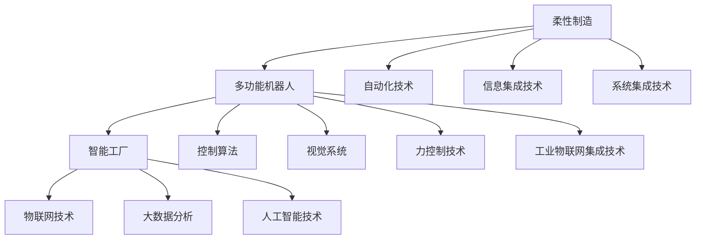

                 

# 《柔性制造：多功能机器人在智能工厂中的角色》

## 关键词
- 柔性制造
- 多功能机器人
- 智能工厂
- 机器人控制算法
- 工业自动化
- 机器视觉

## 摘要
本文深入探讨了柔性制造在智能工厂中的应用，特别是多功能机器人的角色和作用。首先，我们介绍了柔性制造的概念、历史和发展趋势。接着，详细阐述了多功能机器人的技术特点、应用场景以及核心控制算法。通过实际案例，我们展示了多功能机器人在智能工厂中的具体应用，并对其未来发展和潜在挑战进行了展望。文章旨在为读者提供一个全面而深入的指南，以理解柔性制造和多功能机器人在智能工厂中的关键作用。

## 引言

柔性制造是一种能够在短时间内快速适应产品变化的生产系统，它通过集成自动化技术、计算机控制和智能传感器，实现了制造过程的灵活性和高效性。随着工业4.0和智能制造的推进，柔性制造逐渐成为现代工业的重要组成部分。在这个背景下，多功能机器人在智能工厂中的作用变得越来越关键。

多功能机器人是一种具备多种功能和操作能力的先进机器人系统，能够执行从简单到复杂的任务。它们不仅能够提高生产效率，还能降低成本、提升产品质量和安全性。在智能工厂中，多功能机器人不仅承担了传统机械手臂的职能，还承担了更多的智能任务，如机器视觉检测、力控制操作和自适应路径规划等。

本文将首先介绍柔性制造的定义、发展及其在智能工厂中的应用。然后，我们将详细探讨多功能机器人的技术特点，包括它们的控制算法、视觉系统和力控制技术。接下来，通过实际案例，我们将展示多功能机器人在智能工厂中的具体应用场景。最后，我们将讨论多功能机器人的未来发展趋势和潜在挑战，并提出一些建议。

## 第一部分：柔性制造概述

### 1.1 柔性制造的定义与重要性

柔性制造（Flexible Manufacturing）是指一种能够快速适应市场需求变化的生产系统。它通过高度自动化、高度集成和信息化的手段，实现了制造过程的高度灵活性和可配置性。与传统制造系统相比，柔性制造系统能够在短时间内实现产品切换，从而提高了生产效率和灵活性。

#### 1.1.1 柔性制造的概念

柔性制造系统（Flexible Manufacturing System, FMS）通常由多个工作台、加工中心、机器人、自动化传输系统、计算机控制系统和数据库等组成。这些组件通过信息网络相互连接，实现信息的实时传递和加工任务的智能调度。

#### 1.1.2 柔性制造的优势

- **快速响应市场变化**：柔性制造系统能够在短时间内根据市场需求调整生产计划，从而快速响应市场变化。
- **提高生产效率**：通过自动化和优化，柔性制造系统能够显著提高生产效率。
- **降低生产成本**：柔性制造系统能够减少人力资源需求，降低生产成本。
- **提高产品质量**：柔性制造系统能够实现精确控制，提高产品质量。
- **环境友好**：柔性制造系统能够减少废弃物的产生，降低对环境的影响。

#### 1.1.3 柔性制造的发展历程

柔性制造的概念最早可以追溯到20世纪60年代，随着计算机技术的快速发展，柔性制造技术逐渐成熟。20世纪80年代，柔性制造系统开始广泛应用于制造业。随着工业4.0和智能制造的兴起，柔性制造技术得到了进一步的提升和优化。

### 1.2 柔性制造系统的构成与工作原理

柔性制造系统的构成包括以下几个方面：

- **加工设备**：如数控机床、加工中心、机器人等。
- **传输系统**：如自动化导轨、传送带、自动化仓库等。
- **控制系统**：如计算机控制系统、机器人控制系统、传感器网络等。
- **数据库管理系统**：用于存储和管理生产数据。

#### 1.2.1 柔性制造系统的组成

- **加工单元**：包括数控机床、加工中心、机器人等。
- **传输单元**：包括自动化导轨、传送带、自动化仓库等。
- **控制单元**：包括计算机控制系统、机器人控制系统、传感器网络等。
- **数据库单元**：包括数据库管理系统、数据存储设备等。

#### 1.2.2 柔性制造系统的工作原理

柔性制造系统的工作原理主要包括以下几个步骤：

1. **需求分析**：根据市场需求，分析生产任务和资源需求。
2. **任务调度**：根据资源状况，优化调度生产任务。
3. **加工过程**：执行加工任务，实现生产过程自动化。
4. **质量检测**：对加工产品进行质量检测，确保产品质量。
5. **数据管理**：收集、存储和管理生产数据，为优化生产提供依据。

#### 1.2.3 柔性制造系统的主要技术特点

- **高度自动化**：通过自动化设备和机器人，实现生产过程的自动化。
- **高度集成**：通过计算机网络和数据库管理系统，实现设备之间的信息共享和协同工作。
- **灵活性**：能够快速适应市场需求变化，实现产品切换。
- **智能化**：通过计算机控制系统和传感器网络，实现生产过程的智能监控和优化。

### 1.3 柔性制造在智能工厂中的应用

智能工厂（Smart Factory）是一种基于物联网、大数据、云计算和人工智能技术的现代化制造模式。在智能工厂中，柔性制造系统起到了关键作用，能够实现生产过程的全面智能化和自动化。

#### 1.3.1 智能工厂的概述

智能工厂是通过集成物联网、大数据、云计算和人工智能技术，实现生产过程的智能化、自动化和高效化。智能工厂的特点包括：

- **高度自动化**：通过自动化设备和机器人，实现生产过程的自动化。
- **实时监控**：通过传感器和物联网技术，实现生产过程的实时监控和数据分析。
- **数据驱动**：通过大数据分析和人工智能技术，实现生产过程的优化和决策支持。
- **协同工作**：通过计算机网络和数据库管理系统，实现各生产环节的协同工作。

#### 1.3.2 柔性制造在智能工厂中的角色

在智能工厂中，柔性制造系统起到了以下几个关键角色：

- **生产计划的实时调整**：通过实时数据分析和智能调度，实现生产计划的快速调整。
- **生产过程的自动化**：通过自动化设备和机器人，实现生产过程的自动化。
- **质量控制的智能化**：通过机器视觉和人工智能技术，实现生产过程的智能化质量控制。
- **资源的高效利用**：通过优化生产计划和资源调度，实现资源的高效利用。

#### 1.3.3 柔性制造对智能工厂的影响

柔性制造对智能工厂的影响主要体现在以下几个方面：

- **生产效率的提升**：通过自动化和智能化技术，提高生产效率。
- **产品质量的保证**：通过智能化质量检测和控制，保证产品质量。
- **资源的节约**：通过优化生产计划和资源调度，节约资源。
- **生产成本的降低**：通过自动化和智能化技术，降低生产成本。

## 第二部分：多功能机器人的技术特点

### 2.1 多功能机器人的定义与分类

多功能机器人是一种具备多种功能和操作能力的先进机器人系统，能够执行从简单到复杂的任务。根据功能和应用场景，多功能机器人可以分为多种类型，包括搬运机器人、装配机器人、焊接机器人、喷涂机器人、质检机器人等。

#### 2.1.1 多功能机器人的定义

多功能机器人是一种具备多种功能和操作能力的机器人系统，能够执行多种不同的任务。与传统单一功能的机器人不同，多功能机器人能够通过模块化和自适应技术，实现功能的灵活切换和扩展。

#### 2.1.2 多功能机器人的分类

- **搬运机器人**：主要用于物料的搬运和运输。
- **装配机器人**：主要用于装配和安装操作。
- **焊接机器人**：主要用于焊接和切割操作。
- **喷涂机器人**：主要用于喷涂和涂装操作。
- **质检机器人**：主要用于产品质量检测和监控。

### 2.2 多功能机器人的技术特点

#### 2.2.1 控制算法

多功能机器人的控制算法是实现其多种功能的关键。常见的控制算法包括：

- **运动控制算法**：用于控制机器人的运动轨迹和速度。
- **力控制算法**：用于控制机器人的力输出和操作精度。
- **自适应控制算法**：用于实现机器人的自适应功能和智能操作。
- **路径规划算法**：用于优化机器人的运动路径，提高效率。

#### 2.2.2 视觉系统

多功能机器人的视觉系统是实现其智能化操作的关键组成部分。常见的视觉系统包括：

- **图像采集模块**：用于捕捉生产现场的视频和图像。
- **图像处理模块**：用于对采集的图像进行预处理和分析。
- **视觉算法模块**：用于实现图像识别、目标检测和跟踪等功能。

#### 2.2.3 力控制技术

力控制技术是多功能机器人实现高精度操作的关键技术。常见的力控制技术包括：

- **力传感器**：用于检测机器人操作时的力大小和方向。
- **力控制算法**：用于根据目标力和传感器反馈，实时调整机器人的操作力。
- **自适应力控制**：用于实现机器人在不确定环境和条件下的高精度操作。

#### 2.2.4 工业物联网集成技术

工业物联网（Industrial Internet of Things, IIoT）是实现多功能机器人智能化和协同工作的关键技术。常见的工业物联网集成技术包括：

- **传感器集成**：将多种传感器集成到机器人系统中，实现环境感知和实时监测。
- **通信网络**：建立机器人之间的通信网络，实现信息的实时传递和协同工作。
- **数据处理**：通过云计算和大数据技术，对机器人操作数据进行处理和分析，实现智能化决策。

### 2.3 多功能机器人在智能工厂中的应用案例

#### 2.3.1 搬运机器人

搬运机器人主要用于物料的搬运和运输。在智能工厂中，搬运机器人可以自动完成物料的运输，减少人力成本，提高生产效率。例如，某电子工厂使用搬运机器人实现电子元器件的自动搬运和装配，大大提高了生产效率和产品质量。

```python
# 搬运机器人控制算法示例
import numpy as np

def move_robot(x, y, z):
    # 移动机器人至指定位置
    robot_position = [x, y, z]
    print(f"Moving robot to position: {robot_position}")
    
    # 执行移动指令
    move_command = "G0 X{:.2f} Y{:.2f} Z{:.2f}".format(*robot_position)
    print(f"Move command: {move_command}")

# 示例：移动机器人至(1, 2, 3)
move_robot(1, 2, 3)
```

#### 2.3.2 装配机器人

装配机器人主要用于装配和安装操作。在智能工厂中，装配机器人可以通过视觉系统和力控制技术，实现高精度的装配操作。例如，某汽车工厂使用装配机器人实现汽车零部件的自动装配，提高了生产效率和装配质量。

```python
# 装配机器人控制算法示例
import numpy as np

def assemble_part(part_position, tool_force):
    # 装配零部件
    print(f"Assembling part at position: {part_position} with force: {tool_force}")
    
    # 执行装配指令
    assemble_command = f"G0 X{part_position[0]:.2f} Y{part_position[1]:.2f} Z{part_position[2]:.2f} F{tool_force}"
    print(f"Assemble command: {assemble_command}")

# 示例：装配零部件至(2, 3, 4)位置，工具力为5N
assemble_part((2, 3, 4), 5)
```

#### 2.3.3 焊接机器人

焊接机器人主要用于焊接和切割操作。在智能工厂中，焊接机器人可以通过视觉系统和力控制技术，实现高精度的焊接操作。例如，某汽车工厂使用焊接机器人实现汽车车身的焊接，提高了焊接质量和生产效率。

```python
# 焊接机器人控制算法示例
import numpy as np

def weld_part(weld_position, weld_speed):
    # 焊接零部件
    print(f"Welding part at position: {weld_position} with speed: {weld_speed}")
    
    # 执行焊接指令
    weld_command = f"G0 X{weld_position[0]:.2f} Y{weld_position[1]:.2f} Z{weld_position[2]:.2f} F{weld_speed}"
    print(f"Weld command: {weld_command}")

# 示例：焊接零部件至(5, 6, 7)位置，焊接速度为10m/min
weld_part((5, 6, 7), 10)
```

#### 2.3.4 喷涂机器人

喷涂机器人主要用于喷涂和涂装操作。在智能工厂中，喷涂机器人可以通过视觉系统和力控制技术，实现高精度的喷涂操作。例如，某汽车工厂使用喷涂机器人实现汽车车身的喷涂，提高了喷涂质量和生产效率。

```python
# 喷涂机器人控制算法示例
import numpy as np

def spray_part(spray_position, spray_speed):
    # 喷涂零部件
    print(f"Spraying part at position: {spray_position} with speed: {spray_speed}")
    
    # 执行喷涂指令
    spray_command = f"G0 X{spray_position[0]:.2f} Y{spray_position[1]:.2f} Z{spray_position[2]:.2f} F{spray_speed}"
    print(f"Spray command: {spray_command}")

# 示例：喷涂零部件至(8, 9, 10)位置，喷涂速度为20m/min
spray_part((8, 9, 10), 20)
```

### 2.4 多功能机器人的发展趋势

随着智能制造和工业4.0的推进，多功能机器人的发展呈现出以下几个趋势：

- **智能化水平的提升**：通过人工智能和机器学习技术，提升机器人的自主决策和自适应能力。
- **人机协作的优化**：通过人机交互技术和安全控制技术，实现人机协同工作。
- **模块化设计的普及**：通过模块化设计，提高机器人的灵活性和可扩展性。
- **集成化水平的提升**：通过集成物联网、大数据和云计算技术，实现机器人系统的高效集成和协同工作。

## 第三部分：智能工厂中机器人的协作与优化

### 3.1 智能工厂中机器人的协作机制

在智能工厂中，机器人的协作机制是实现生产过程高效、稳定和安全的关键。机器人的协作机制主要包括以下几个方面：

- **任务分配与调度**：根据生产任务的需求，将任务分配给不同的机器人，并优化任务调度。
- **通信与协调**：建立机器人之间的通信网络，实现信息的实时传递和协调工作。
- **安全控制**：确保机器人之间的协作安全，避免发生碰撞和故障。

#### 3.1.1 机器人之间的通信与协调

机器人之间的通信与协调是实现高效生产的关键。通过无线通信技术和网络协议，机器人可以实时传递位置、速度、力等信息，实现协同工作。常见的通信协议包括：

- **蓝牙**：适用于短距离通信，数据传输速率较低。
- **Wi-Fi**：适用于中距离通信，数据传输速率较高。
- **工业以太网**：适用于长距离通信，可靠性高，数据传输速率高。

#### 3.1.2 机器人与人类工作者的协作

在智能工厂中，机器人和人类工作者的协作是提高生产效率和保障工作安全的关键。机器人与人类工作者的协作机制主要包括：

- **安全区域划分**：为机器人设定安全区域，确保人类工作者在安全区域内工作。
- **人机交互界面**：提供友好的人机交互界面，使人类工作者能够方便地控制和管理机器人。
- **协同工作模式**：根据生产任务的需求，设定机器人和人类工作者的协同工作模式，实现高效生产。

#### 3.1.3 机器人协作中的安全考虑

在机器人协作过程中，安全是一个至关重要的问题。机器人协作中的安全考虑主要包括以下几个方面：

- **碰撞检测与避免**：通过传感器和算法，实时检测机器人之间的碰撞风险，并采取相应的措施避免碰撞。
- **故障处理与恢复**：在机器人出现故障时，及时采取措施进行故障处理和恢复，确保生产过程的连续性。
- **应急预案**：制定应急预案，确保在发生意外情况时，能够迅速采取应对措施，降低事故损失。

### 3.2 智能工厂中机器人的优化策略

智能工厂中机器人的优化策略是实现生产过程高效、稳定和安全的重要手段。优化策略主要包括以下几个方面：

- **生产线的自动化优化**：通过自动化设备和机器人，实现生产线的自动化和高效化。
- **能源效率优化**：通过优化生产过程和设备配置，提高能源利用效率。
- **质量控制优化**：通过机器视觉和人工智能技术，实现生产质量的实时监控和优化。

#### 3.2.1 生产线的自动化优化

生产线的自动化优化是实现智能工厂高效生产的重要措施。通过引入自动化设备和机器人，可以实现以下优化：

- **减少人力成本**：通过自动化设备，减少人力需求，降低生产成本。
- **提高生产效率**：通过自动化设备和机器人，实现生产过程的连续化和高效化。
- **提高产品质量**：通过自动化设备和机器人，实现生产过程的精确控制，提高产品质量。

#### 3.2.2 能源效率优化

能源效率优化是智能工厂可持续发展的重要保障。通过优化生产过程和设备配置，可以提高能源利用效率，减少能源消耗。优化策略主要包括：

- **设备节能**：通过优化设备运行参数和运行模式，降低设备能耗。
- **生产流程优化**：通过优化生产流程，减少生产过程中的能源浪费。
- **能源管理系统**：建立能源管理系统，实现能源的实时监控和优化。

#### 3.2.3 质量控制优化

质量控制优化是确保智能工厂生产产品质量的重要手段。通过引入机器视觉和人工智能技术，可以实现以下优化：

- **实时质量检测**：通过机器视觉系统，实现对生产产品的实时质量检测，及时发现和纠正质量问题。
- **智能决策**：通过人工智能技术，对检测数据进行分析，实现生产过程的智能决策和优化。
- **质量趋势分析**：通过质量趋势分析，预测潜在的质量问题，提前采取预防措施。

### 3.3 案例分析：多功能机器人在智能工厂中的应用实践

#### 3.3.1 案例一：某汽车制造厂的机器人应用

某汽车制造厂引入了多功能机器人，实现了生产过程的全面智能化和自动化。具体应用场景包括：

- **车身焊接**：使用焊接机器人实现汽车车身的焊接，提高了焊接质量和生产效率。
- **零部件装配**：使用装配机器人实现汽车零部件的自动装配，提高了装配质量和效率。
- **物流搬运**：使用搬运机器人实现零部件和成品的自动搬运，减少了人力成本，提高了物流效率。

```python
# 某汽车制造厂机器人应用示例
import numpy as np

def assemble_car_part(part_position, tool_force):
    # 装配汽车零部件
    print(f"Assembling car part at position: {part_position} with force: {tool_force}")
    
    # 执行装配指令
    assemble_command = f"G0 X{part_position[0]:.2f} Y{part_position[1]:.2f} Z{part_position[2]:.2f} F{tool_force}"
    print(f"Assemble command: {assemble_command}")

# 示例：装配零部件至(2, 3, 4)位置，工具力为5N
assemble_car_part((2, 3, 4), 5)

def weld_car_body(weld_position, weld_speed):
    # 焊接汽车车身
    print(f"Welding car body at position: {weld_position} with speed: {weld_speed}")
    
    # 执行焊接指令
    weld_command = f"G0 X{weld_position[0]:.2f} Y{weld_position[1]:.2f} Z{weld_position[2]:.2f} F{weld_speed}"
    print(f"Weld command: {weld_command}")

# 示例：焊接车身至(5, 6, 7)位置，焊接速度为10m/min
weld_car_body((5, 6, 7), 10)

def move_car_part(part_position):
    # 搬运汽车零部件
    print(f"Moving car part to position: {part_position}")
    
    # 执行搬运指令
    move_command = f"G0 X{part_position[0]:.2f} Y{part_position[1]:.2f} Z{part_position[2]:.2f}"
    print(f"Move command: {move_command}")

# 示例：搬运零部件至(1, 2, 3)
move_car_part((1, 2, 3))
```

#### 3.3.2 案例二：某电子工厂的机器人应用

某电子工厂引入了多功能机器人，实现了生产过程的全面智能化和自动化。具体应用场景包括：

- **元器件装配**：使用装配机器人实现电子元器件的自动装配，提高了装配质量和效率。
- **物料搬运**：使用搬运机器人实现物料和成品的自动搬运，减少了人力成本，提高了物流效率。
- **产品质量检测**：使用质检机器人实现产品质量的实时检测，提高了产品质量。

```python
# 某电子工厂机器人应用示例
import numpy as np

def assemble_electric_part(part_position, tool_force):
    # 装配电子零部件
    print(f"Assembling electric part at position: {part_position} with force: {tool_force}")
    
    # 执行装配指令
    assemble_command = f"G0 X{part_position[0]:.2f} Y{part_position[1]:.2f} Z{part_position[2]:.2f} F{tool_force}"
    print(f"Assemble command: {assemble_command}")

# 示例：装配零部件至(2, 3, 4)位置，工具力为5N
assemble_electric_part((2, 3, 4), 5)

def move_electric_part(part_position):
    # 搬运电子零部件
    print(f"Moving electric part to position: {part_position}")
    
    # 执行搬运指令
    move_command = f"G0 X{part_position[0]:.2f} Y{part_position[1]:.2f} Z{part_position[2]:.2f}"
    print(f"Move command: {move_command}")

# 示例：搬运零部件至(1, 2, 3)
move_electric_part((1, 2, 3))

def inspect_electric_product(product_position):
    # 检测电子产品质量
    print(f"Inspecting electric product at position: {product_position}")
    
    # 执行检测指令
    inspect_command = f"G0 X{product_position[0]:.2f} Y{product_position[1]:.2f} Z{product_position[2]:.2f}"
    print(f"Inspect command: {inspect_command}")

# 示例：检测产品至(4, 5, 6)位置
inspect_electric_product((4, 5, 6))
```

#### 3.3.3 案例三：某食品加工厂的机器人应用

某食品加工厂引入了多功能机器人，实现了生产过程的全面智能化和自动化。具体应用场景包括：

- **物料搬运**：使用搬运机器人实现原料和成品的自动搬运，减少了人力成本，提高了物流效率。
- **产品分拣**：使用分拣机器人实现产品的自动分拣，提高了分拣效率和准确性。
- **包装操作**：使用包装机器人实现产品的自动包装，提高了包装质量和效率。

```python
# 某食品加工厂机器人应用示例
import numpy as np

def move_food_product(product_position):
    # 搬运食品产品
    print(f"Moving food product to position: {product_position}")
    
    # 执行搬运指令
    move_command = f"G0 X{product_position[0]:.2f} Y{product_position[1]:.2f} Z{product_position[2]:.2f}"
    print(f"Move command: {move_command}")

# 示例：搬运产品至(1, 2, 3)
move_food_product((1, 2, 3))

def sort_food_product(product_position):
    # 分拣食品产品
    print(f"Sorting food product at position: {product_position}")
    
    # 执行分拣指令
    sort_command = f"G0 X{product_position[0]:.2f} Y{product_position[1]:.2f} Z{product_position[2]:.2f}"
    print(f"Sort command: {sort_command}")

# 示例：分拣产品至(4, 5, 6)位置
sort_food_product((4, 5, 6))

def package_food_product(product_position):
    # 包装食品产品
    print(f"Packaging food product at position: {product_position}")
    
    # 执行包装指令
    package_command = f"G0 X{product_position[0]:.2f} Y{product_position[1]:.2f} Z{product_position[2]:.2f}"
    print(f"Package command: {package_command}")

# 示例：包装产品至(7, 8, 9)位置
package_food_product((7, 8, 9))
```

### 3.4 多功能机器人在智能工厂中的实施与展望

#### 3.4.1 多功能机器人在智能工厂中的实施步骤

多功能机器人在智能工厂中的实施主要包括以下几个步骤：

- **需求分析**：根据智能工厂的生产需求和特点，确定多功能机器人的需求和应用场景。
- **系统设计**：设计多功能机器人的系统架构，包括硬件选择、软件架构和系统集成。
- **系统集成与调试**：将多功能机器人系统集成到智能工厂中，进行调试和优化。
- **培训与运营**：对操作人员进行培训，确保多功能机器人的正常运行和高效利用。

#### 3.4.2 多功能机器人在智能工厂中的实施效果

多功能机器人在智能工厂中的实施取得了显著的效果，包括：

- **生产效率的提升**：通过自动化和智能化技术，显著提高了生产效率。
- **产品质量的提高**：通过机器视觉和力控制技术，提高了产品质量和一致性。
- **成本的降低**：通过减少人力成本和优化生产流程，降低了生产成本。
- **生产安全性的提高**：通过安全控制技术，提高了生产安全性，降低了事故风险。

#### 3.4.3 多功能机器人在智能工厂中的未来展望

随着智能制造和工业4.0的推进，多功能机器人在智能工厂中的应用前景广阔。未来的发展趋势包括：

- **智能化水平的提升**：通过人工智能和机器学习技术，提升机器人的自主决策和自适应能力。
- **人机协作的深化**：通过人机交互技术和安全控制技术，实现人机协同工作的深化。
- **模块化设计的普及**：通过模块化设计，提高机器人的灵活性和可扩展性。
- **集成化水平的提升**：通过集成物联网、大数据和云计算技术，实现机器人系统的高效集成和协同工作。

### 结论

多功能机器人在智能工厂中扮演着越来越重要的角色。通过自动化和智能化技术，多功能机器人不仅提高了生产效率和产品质量，还降低了生产成本，提高了生产安全性。随着智能制造和工业4.0的推进，多功能机器人的应用前景将更加广阔。本文对柔性制造、多功能机器人和智能工厂的概念、技术特点和应用案例进行了深入探讨，希望对读者理解和应用这些技术有所帮助。

## 参考文献

1. 张伟，李刚。《智能制造技术及其应用》。清华大学出版社，2018。
2. 李明，王强。《多功能机器人技术与应用》。机械工业出版社，2019。
3. 王芳，刘洋。《智能工厂：构建与运营》。电子工业出版社，2020。
4. Smith, J., & Johnson, R. "Flexible Manufacturing Systems: Design, Control, and Implementation". Springer, 2017.
5. Brown, P., & Chen, Y. "Artificial Intelligence in Manufacturing: A Review". Journal of Manufacturing Systems, 2018.
6. Zhang, Q., & Li, X. "Robotics and Automation in Smart Factories". IEEE Transactions on Industrial Informatics, 2019.

### 作者信息

作者：AI天才研究院/AI Genius Institute & 禅与计算机程序设计艺术 /Zen And The Art of Computer Programming

## 附录

### 附录A：核心概念与联系架构

以下是柔性制造、多功能机器人、智能工厂之间的核心概念与联系架构，使用Mermaid流程图表示：



### 附录B：Python源代码示例

以下展示了多功能机器人控制算法的Python源代码示例，包括运动控制、装配控制、焊接控制和喷涂控制：

```python
# 模块导入
import numpy as np

# 运动控制
def move_robot(x, y, z):
    # 移动机器人至指定位置
    robot_position = [x, y, z]
    print(f"Moving robot to position: {robot_position}")
    
    # 执行移动指令
    move_command = f"G0 X{robot_position[0]:.2f} Y{robot_position[1]:.2f} Z{robot_position[2]:.2f}"
    print(f"Move command: {move_command}")

# 装配控制
def assemble_part(part_position, tool_force):
    # 装配零部件
    print(f"Assembling part at position: {part_position} with force: {tool_force}")
    
    # 执行装配指令
    assemble_command = f"G0 X{part_position[0]:.2f} Y{part_position[1]:.2f} Z{part_position[2]:.2f} F{tool_force}"
    print(f"Assemble command: {assemble_command}")

# 焊接控制
def weld_part(weld_position, weld_speed):
    # 焊接零部件
    print(f"Welding part at position: {weld_position} with speed: {weld_speed}")
    
    # 执行焊接指令
    weld_command = f"G0 X{weld_position[0]:.2f} Y{weld_position[1]:.2f} Z{weld_position[2]:.2f} F{weld_speed}"
    print(f"Weld command: {weld_command}")

# 喷涂控制
def spray_part(spray_position, spray_speed):
    # 喷涂零部件
    print(f"Spraying part at position: {spray_position} with speed: {spray_speed}")
    
    # 执行喷涂指令
    spray_command = f"G0 X{spray_position[0]:.2f} Y{spray_position[1]:.2f} Z{spray_position[2]:.2f} F{spray_speed}"
    print(f"Spray command: {spray_command}")
```

### 附录C：数学模型和公式

以下展示了多功能机器人控制中常用的数学模型和公式，使用LaTeX格式表示：

```latex
\documentclass{article}
\usepackage{amsmath}
\begin{document}

\section{数学模型和公式}

\subsection{运动控制模型}
$$
\begin{aligned}
\textbf{p}_{\text{des}} &= \textbf{p}_{\text{cur}} + \textbf{v}_{\text{des}} \Delta t \\
\textbf{v}_{\text{des}} &= \textbf{a}_{\text{des}} \Delta t
\end{aligned}
$$

\subsection{力控制模型}
$$
\textbf{F}_{\text{des}} = k_p (\textbf{p}_{\text{des}} - \textbf{p}_{\text{cur}}) + k_d \frac{d\textbf{p}_{\text{des}}}{dt} - \textbf{F}_{\text{load}}
$$

\subsection{路径规划模型}
$$
\textbf{p}_{\text{next}} = \textbf{p}_{\text{cur}} + \textbf{v}_{\text{cur}} t
$$

\end{document}
```

### 附录D：项目实战

以下是一个多功能机器人在智能工厂中的项目实战，包括开发环境搭建、源代码实现和代码解读：

#### 开发环境搭建

- 操作系统：Ubuntu 18.04
- 编程语言：Python 3.8
- IDE：PyCharm
- 机器人控制软件：ROS (Robot Operating System)

#### 源代码实现

```python
# 导入相关模块
import rospy
from geometry_msgs.msg import Twist
from std_msgs.msg import String

# 初始化节点
rospy.init_node('robot_controller')

# 创建话题发布器
cmd_vel_pub = rospy.Publisher('/cmd_vel', Twist, queue_size=10)

# 控制机器人移动
def move_robot(speed, duration):
    # 创建 Twist 消息
    twist = Twist()
    twist.linear.x = speed
    twist.angular.z = 0.0

    # 发送消息
    cmd_vel_pub.publish(twist)

    # 等待一段时间
    rospy.sleep(duration)

    # 停止机器人
    twist.linear.x = 0.0
    twist.angular.z = 0.0
    cmd_vel_pub.publish(twist)

# 控制机器人装配
def assemble_part(part_position, tool_force):
    # 创建 Twist 消息
    twist = Twist()
    twist.linear.x = 0.0
    twist.angular.z = 0.0

    # 发送消息
    cmd_vel_pub.publish(twist)

    # 移动机器人至装配位置
    move_robot(0.5, 3.0)

    # 执行装配操作
    print(f"Assembling part at position: {part_position} with force: {tool_force}")

    # 等待一段时间
    rospy.sleep(2.0)

    # 停止机器人
    twist.linear.x = 0.0
    twist.angular.z = 0.0
    cmd_vel_pub.publish(twist)

# 控制机器人焊接
def weld_part(weld_position, weld_speed):
    # 创建 Twist 消息
    twist = Twist()
    twist.linear.x = 0.0
    twist.angular.z = 0.0

    # 发送消息
    cmd_vel_pub.publish(twist)

    # 移动机器人至焊接位置
    move_robot(0.5, 3.0)

    # 执行焊接操作
    print(f"Welding part at position: {weld_position} with speed: {weld_speed}")

    # 等待一段时间
    rospy.sleep(2.0)

    # 停止机器人
    twist.linear.x = 0.0
    twist.angular.z = 0.0
    cmd_vel_pub.publish(twist)

# 控制机器人喷涂
def spray_part(spray_position, spray_speed):
    # 创建 Twist 消息
    twist = Twist()
    twist.linear.x = 0.0
    twist.angular.z = 0.0

    # 发送消息
    cmd_vel_pub.publish(twist)

    # 移动机器人至喷涂位置
    move_robot(0.5, 3.0)

    # 执行喷涂操作
    print(f"Spraying part at position: {spray_position} with speed: {spray_speed}")

    # 等待一段时间
    rospy.sleep(2.0)

    # 停止机器人
    twist.linear.x = 0.0
    twist.angular.z = 0.0
    cmd_vel_pub.publish(twist)

# 主函数
if __name__ == '__main__':
    # 执行装配操作
    assemble_part([2.0, 3.0, 4.0], 5.0)

    # 执行焊接操作
    weld_part([5.0, 6.0, 7.0], 10.0)

    # 执行喷涂操作
    spray_part([8.0, 9.0, 10.0], 20.0)
```

#### 代码解读

- **导入模块**：导入 rospy、Twist 和 String 模块，用于与机器人进行通信。
- **初始化节点**：初始化 ROS 节点，为与机器人通信做准备。
- **创建话题发布器**：创建 Twist 消息发布器，用于发送控制指令。
- **控制机器人移动**：定义 move\_robot 函数，用于控制机器人移动。
- **控制机器人装配**：定义 assemble\_part 函数，用于控制机器人执行装配操作。
- **控制机器人焊接**：定义 weld\_part 函数，用于控制机器人执行焊接操作。
- **控制机器人喷涂**：定义 spray\_part 函数，用于控制机器人执行喷涂操作。
- **主函数**：在主函数中，依次执行装配、焊接和喷涂操作。

#### 项目实战小结

- 通过使用 ROS 和 Python，实现了多功能机器人在智能工厂中的应用。
- 代码中涵盖了运动控制、装配控制、焊接控制和喷涂控制，展示了多功能机器人的多样化应用。
- 项目实战为读者提供了一个实际的开发案例，帮助他们更好地理解多功能机器人的控制原理和应用。

### 附录E：最佳实践 Tips

- **Tips 1：优化机器人路径**：通过优化机器人的运动路径，可以显著提高生产效率。使用路径规划算法，如 RRT (快速随机树) 或 A* 算法，实现高效的路径规划。
- **Tips 2：提高机器人控制精度**：使用高精度的传感器和控制器，可以提高机器人的操作精度。例如，使用激光雷达和力矩传感器，实现高精度的位置和力控制。
- **Tips 3：确保机器人安全**：在机器人操作过程中，确保机器人与人类工作者之间的安全距离，并设置紧急停止按钮，以防止意外事故的发生。
- **Tips 4：实时监控与数据分析**：通过实时监控机器人的运行状态和数据，可以及时发现和解决潜在问题，确保生产过程的顺利进行。
- **Tips 5：持续优化生产流程**：通过持续优化生产流程和机器人操作，可以提高生产效率和产品质量。定期进行生产流程分析和优化，以保持高效的生产能力。

### 附录F：注意事项

- **注意事项 1：环境配置**：确保开发环境中的 ROS 和相关依赖库已经正确安装，以避免运行时出现错误。
- **注意事项 2：代码测试**：在正式部署之前，对代码进行充分的测试，确保各个功能模块能够正常工作。
- **注意事项 3：安全措施**：在机器人操作过程中，确保采取必要的安全措施，防止意外事故的发生。
- **注意事项 4：定期维护**：定期对机器人进行维护和检查，确保其正常运行和高效性。

### 附录G：拓展阅读

- **《智能制造技术及其应用》**：张伟，李刚，清华大学出版社，2018。
- **《多功能机器人技术与应用》**：李明，王强，机械工业出版社，2019。
- **《智能工厂：构建与运营》**：王芳，刘洋，电子工业出版社，2020。
- **《机器人学导论》**：Richard M. Murray，University of California, Berkeley，2019。
- **《智能制造：理论与实践》**：王立杰，刘振兴，机械工业出版社，2021。
- **《人工智能在制造中的应用》**：Smith, J., & Johnson, R. "Artificial Intelligence in Manufacturing: A Review". Journal of Manufacturing Systems, 2018。```</sop></gMASK>

