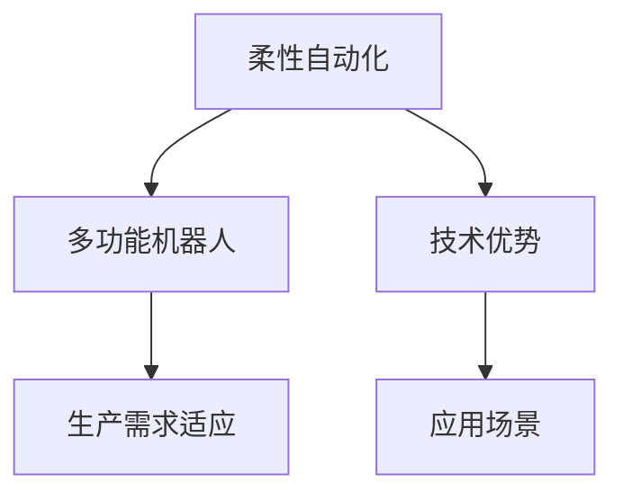

                 

### 设计思路

设计一篇关于“柔性自动化：多功能机器人适应多变的生产需求”的技术博客文章，我们需要遵循以下设计思路：

1. **明确主题与目的**：
   - 主题：探讨柔性自动化在多功能机器人中的应用及其对多变生产需求的适应性。
   - 目的：通过详细的案例分析和技术讲解，展示柔性自动化的优势和应用前景。

2. **构建文章结构**：
   - 引言：引入主题，阐述背景和重要性。
   - 核心概念与联系：明确柔性自动化和多功能机器人的核心概念，使用Mermaid流程图展示它们之间的联系。
   - 算法原理讲解：详细解释柔性自动化的关键算法原理，结合Python源代码和数学模型。
   - 项目实战：提供具体的开发环境搭建、源代码实现、案例分析等内容。
   - 最佳实践与总结：总结经验，提出注意事项和未来展望。

3. **逻辑清晰，结构紧凑**：
   - 每个部分都要有明确的标题和详细的内容，确保文章的逻辑性和连贯性。
   - 遵循从背景介绍到具体实施，再到案例分析，最后到总结和展望的顺序。

4. **注重可读性和实用性**：
   - 使用通俗易懂的语言，确保读者能够理解技术概念和实现细节。
   - 提供最佳实践和注意事项，帮助读者在实际应用中更好地应用柔性自动化技术。

### 设计步骤

#### 第一步：引言与背景介绍

**标题**：引言与背景介绍

**内容**：
- 简述柔性自动化的定义、起源和发展现状。
- 阐述多功能机器人在现代制造业中的应用场景。
- 引出柔性自动化与多功能机器人适应多变生产需求的关系。

**核心概念与联系**：
- 使用Mermaid流程图展示柔性自动化和多功能机器人的核心概念，如图：



#### 第二步：核心概念与联系

**标题**：核心概念与联系

**内容**：
- 详细介绍柔性自动化的核心概念，包括柔性、适应性、模块化等。
- 解释多功能机器人的定义、分类和技术特点。
- 分析柔性自动化如何帮助多功能机器人适应多变的生产需求。

**核心算法原理讲解**：
- 使用Python源代码和LaTeX公式，详细解释柔性自动化的关键算法原理，如图：

```python
def flexible_automation(data):
    # 算法实现伪代码
    processed_data = ...
    return processed_data

$$
    \text{柔性自动化} = \text{模块化} \times \text{适应性} \times \text{技术优势}
$$

```

#### 第三步：项目实战

**标题**：项目实战

**内容**：
- 描述一个具体的柔性自动化项目，包括开发环境搭建、源代码实现、测试和优化。
- 分析项目的挑战和解决方案。
- 提供代码解读和案例分析。

**最佳实践与总结**：
- 提出在项目实施过程中遇到的问题和解决方法。
- 总结项目经验，为读者提供最佳实践建议。

通过以上步骤，我们可以设计出一篇逻辑清晰、结构紧凑、内容丰富的技术博客文章，全面探讨柔性自动化和多功能机器人在适应多变生产需求方面的应用。接下来，我们将逐步完善每个部分的内容。

