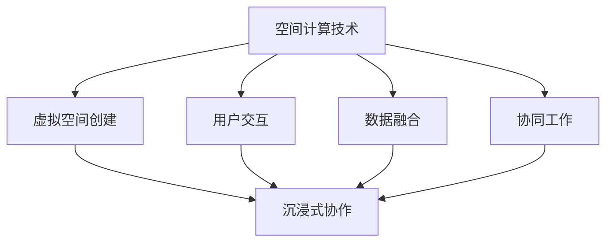

                 

### 文章标题：沉浸式协作：空间计算技术重塑团队合作模式

#### 关键词：
- 沉浸式协作
- 空间计算
- 团队合作
- 虚拟现实
- 增强现实

#### 摘要：
本文旨在探讨空间计算技术在重塑团队合作模式中的关键作用。随着虚拟现实（VR）和增强现实（AR）技术的发展，团队合作的方式正在发生革命性的变化。本文将详细介绍沉浸式协作的概念，分析空间计算技术的原理与应用，并通过实例展示这些技术如何提升团队协作的效率和创造力。此外，文章还将探讨相关技术挑战，提出未来发展的方向和建议。

### 目录：

1. **背景介绍**
    1.1 **空间计算技术的发展历程**
    1.2 **团队合作的传统模式与挑战**
    1.3 **沉浸式协作的概念**

2. **核心概念与联系**
    2.1 **沉浸式协作原理**
    2.2 **空间计算技术原理**
    2.3 **两者之间的联系**
    2.4 **概念关系架构图**

3. **核心算法原理**
    3.1 **虚拟现实算法**
    3.2 **增强现实算法**
    3.3 **Python代码示例**

4. **项目实战**
    4.1 **开发环境搭建**
    4.2 **源代码实现与解读**
    4.3 **实际案例分析**
    4.4 **项目小结**

5. **最佳实践 Tips**
    5.1 **优化团队协作**
    5.2 **注意事项**
    5.3 **拓展阅读**

6. **结论**
    6.1 **总结与展望**
    6.2 **未来发展方向**

### 引言
在当今快节奏、全球化的工作环境中，团队合作变得日益重要。传统的团队合作模式虽然能够实现基本的沟通和协作，但在效率、灵活性和创造力方面存在诸多局限性。为了应对这些挑战，空间计算技术和沉浸式协作应运而生。

空间计算是一种通过虚拟空间来模拟、扩展和增强现实世界的技术。它不仅包括虚拟现实（VR）和增强现实（AR），还涵盖了混合现实（MR）和全息影像等技术。沉浸式协作则是指利用这些技术，使团队成员能够在一个虚拟的空间中共同工作、交流和分享信息。

本文将首先介绍空间计算技术的发展历程和沉浸式协作的概念。然后，我们将探讨这些技术如何重塑团队合作模式，并提供相关的核心算法原理和Python代码示例。最后，我们将通过一个实际案例来展示这些技术的应用，并提出一些最佳实践和未来发展方向。

### 背景介绍

#### 空间计算技术的发展历程

空间计算技术的发展可以追溯到20世纪80年代，当时虚拟现实和增强现实技术开始萌芽。早期的VR设备主要依赖于头戴式显示器（HMD）和计算机模拟环境，如VRML（虚拟现实建模语言）和早期3D图形技术。这些技术为用户提供了沉浸式的体验，但受限于计算能力和显示技术，用户体验相对有限。

进入21世纪，随着计算能力和图形处理技术的飞速发展，VR和AR技术逐渐成熟。2009年，Oculus VR发布了第一款消费者级VR头戴设备Oculus Rift，标志着VR技术的商业化进程。同样，谷歌在2012年推出了第一代Google Glass，开启了AR技术的应用新篇章。近年来，随着5G、人工智能和云计算等技术的融入，空间计算技术迎来了新的发展机遇。

空间计算技术不仅涉及硬件设备的进步，还包括软件平台和开发工具的创新。Unity和Unreal Engine等游戏引擎为开发者提供了强大的VR/AR内容创作工具，使得更多的企业和个人能够轻松地打造沉浸式应用。此外，云端渲染和分布式计算技术的普及，使得高性能计算资源可以更加便捷地获取，为空间计算技术的广泛应用奠定了基础。

#### 传统团队合作模式与挑战

在传统的团队合作模式中，团队成员通常通过电子邮件、即时通讯工具和视频会议进行沟通和协作。这种模式虽然能够实现基本的信息传递和任务分配，但存在以下几大挑战：

1. **沟通效率低下**：传统沟通方式往往依赖于文本和语音，缺乏直观的视觉信息和互动性。团队成员难以实时共享和交流复杂的想法和数据，导致沟通效率低下。

2. **信息分散**：团队成员分布在不同的地理位置，信息分散在不同平台和工具中。这增加了信息查找和整合的难度，影响了团队协作的连贯性和效率。

3. **协作受限**：在传统的团队合作中，团队成员往往需要面对面或通过视频会议进行实时沟通。这种方式在地理上限制了团队成员的多样性，也增加了会议的组织难度。

4. **缺乏沉浸感**：传统团队协作缺乏沉浸感，团队成员难以完全投入到工作环境中。这影响了团队的整体工作氛围和创造力。

#### 沉浸式协作的概念

沉浸式协作是一种利用虚拟现实（VR）和增强现实（AR）技术，为团队成员提供一个沉浸式的虚拟工作环境。在这个环境中，团队成员可以实时共享虚拟空间，共同工作、交流和协作。沉浸式协作的核心特点包括：

1. **沉浸式体验**：团队成员通过VR设备或AR设备进入虚拟空间，感受到身临其境的体验。这种沉浸式体验可以提升团队成员的参与感和专注度。

2. **实时协作**：虚拟空间提供了实时协作的功能，团队成员可以在同一个虚拟环境中进行同步操作和互动。这使得团队成员可以更高效地协作，减少沟通和协调的成本。

3. **多感官交互**：沉浸式协作不仅限于视觉和听觉，还包括触觉和空间感知等多感官交互。这种多感官交互可以提升用户对信息的理解和记忆，增强协作的效果。

4. **信息共享和整合**：虚拟空间提供了一个集中的平台，团队成员可以实时共享和整合各种信息和资源。这有助于团队成员更好地理解项目进展和任务分配，提高协作的效率。

#### 核心概念与联系

沉浸式协作和空间计算技术之间存在着紧密的联系。空间计算技术为沉浸式协作提供了基础，而沉浸式协作则进一步拓展了空间计算技术的应用场景。

**沉浸式协作原理**：

沉浸式协作主要基于虚拟现实（VR）和增强现实（AR）技术。VR技术通过头戴式显示器（HMD）或其他显示设备，将用户完全沉浸在虚拟环境中。用户可以通过手柄、手套或其他输入设备与虚拟环境进行交互。AR技术则将虚拟信息叠加在现实世界中，使用户能够在现实环境中看到和操作虚拟对象。

**空间计算技术原理**：

空间计算技术利用计算机模拟和扩展现实世界，为用户提供更加丰富和互动的体验。它包括以下几个方面：

1. **虚拟空间创建**：通过三维建模和场景渲染技术，创建虚拟空间的环境和场景。

2. **用户交互**：利用计算机视觉、语音识别和手势识别等技术，实现用户与虚拟空间的交互。

3. **数据融合**：将来自多个来源的数据（如图像、音频、传感器数据等）进行融合和处理，为用户提供更加丰富和实时的工作环境。

4. **协同工作**：通过网络和分布式计算技术，实现多个用户在同一虚拟空间中的实时协作。

**两者之间的联系**：

沉浸式协作依赖于空间计算技术来创建虚拟空间、处理用户交互和数据融合。空间计算技术则为沉浸式协作提供了基础，使其能够实现多用户实时协作、信息共享和整合。以下是两者之间的联系架构图：



#### 核心算法原理

沉浸式协作和空间计算技术依赖于一系列核心算法原理，包括虚拟现实算法、增强现实算法以及相关的数学模型和公式。以下将分别介绍这些算法原理，并通过Python代码示例进行详细阐述。

##### 虚拟现实算法

虚拟现实算法主要包括三维建模、场景渲染、用户交互和实时更新等。以下是一个简单的Python代码示例，展示了如何使用PyOpenGL库创建一个虚拟空间并渲染一个立方体。

```python
from OpenGL.GL import *
from OpenGL.GLUT import *
import sys

def display():
    glClear(GL_COLOR_BUFFER_BIT | GL_DEPTH_BUFFER_BIT)
    glBegin(GL_QUADS)
    glColor3f(1.0, 0.0, 0.0)
    glVertex3f(-0.5, -0.5, -0.5)
    glVertex3f(0.5, -0.5, -0.5)
    glVertex3f(0.5, 0.5, -0.5)
    glVertex3f(-0.5, 0.5, -0.5)
    glColor3f(0.0, 1.0, 0.0)
    glVertex3f(-0.5, -0.5, 0.5)
    glVertex3f(0.5, -0.5, 0.5)
    glVertex3f(0.5, 0.5, 0.5)
    glVertex3f(-0.5, 0.5, 0.5)
    glEnd()
    glFlush()

def main():
    glutInit(sys.argv)
    glutInitDisplayMode(GLUT_SINGLE | GLUT_RGB | GLUT_DEPTH)
    glutInitWindowSize(500, 500)
    glutCreateWindow("Virtual Reality Example")
    glutDisplayFunc(display)
    glutMainLoop()

if __name__ == "__main__":
    main()
```

在这个示例中，我们使用OpenGL库创建了一个简单的虚拟空间，并渲染了一个红色和绿色的立方体。通过修改场景渲染的参数和模型，可以实现更加复杂的虚拟现实应用。

##### 增强现实算法

增强现实算法主要包括图像识别、目标追踪、虚拟对象叠加和实时更新等。以下是一个简单的Python代码示例，展示了如何使用OpenCV库进行图像识别并将虚拟对象叠加在现实世界中。

```python
import cv2
import numpy as np

def detect_and_overlay(image, template):
    template_gray = cv2.cvtColor(template, cv2.COLOR_BGR2GRAY)
    w, h = template_gray.shape[::-1]
    res = cv2.matchTemplate(image, template_gray, cv2.TM_CCOEFF_NORMED)
    loc = np.where(res >= 0.8)
    for pt in zip(*loc[::-1]):
        image = cv2.rectangle(image, pt, (pt[0] + w, pt[1] + h), (0, 0, 255), 2)
    return image

def main():
    image = cv2.imread('image.jpg')
    template = cv2.imread('template.jpg')
    image = detect_and_overlay(image, template)
    cv2.imshow('AR Overlay', image)
    cv2.waitKey(0)
    cv2.destroyAllWindows()

if __name__ == "__main__":
    main()
```

在这个示例中，我们使用OpenCV库对输入图像进行图像识别，并将匹配到的目标区域用绿色边框标记出来。通过修改模板图像和阈值参数，可以实现更加复杂的增强现实应用。

##### 数学模型和公式

在虚拟现实和增强现实算法中，常用的数学模型和公式包括：

1. **三维坐标变换**：用于描述物体在虚拟空间中的位置和姿态。常用的公式包括旋转矩阵、平移矩阵和四元数等。

   $$ T = [R|p] $$

   其中，$T$是变换矩阵，$R$是旋转矩阵，$p$是平移向量。

2. **图像处理**：用于图像识别、目标追踪和虚拟对象叠加。常用的公式包括卷积操作、相关运算和特征匹配等。

   $$ I(x, y) = \sum_{i} \sum_{j} G(i, j) * f(x-i, y-j) $$

   其中，$I(x, y)$是输出图像，$G(i, j)$是卷积核，$f(x-i, y-j)$是输入图像的一部分。

3. **深度感知**：用于生成和调整虚拟空间的深度信息。常用的公式包括深度感知模型和立体匹配算法等。

   $$ d(x, y) = \frac{f(x, y)}{f(x, y+z)} $$

   其中，$d(x, y)$是深度信息，$f(x, y)$是输入图像的像素值。

通过这些算法原理和数学模型，虚拟现实和增强现实技术可以实现对现实世界的模拟、扩展和增强，从而实现沉浸式协作。

#### 项目实战

在本节中，我们将通过一个实际案例，展示如何搭建沉浸式协作的开发环境，并实现一个简单的虚拟会议室系统。

##### 开发环境搭建

1. **硬件设备**：
   - VR头戴设备：Oculus Rift或HTC Vive
   - 运动追踪传感器：Oculus传感器或Vive传感器
   - 电脑：高性能电脑，建议配备NVIDIA GeForce GTX 1080或更高显卡

2. **软件环境**：
   - 操作系统：Windows 10或更高版本
   - 开发工具：Unity Hub、Visual Studio、Python环境（包括PyOpenGL和OpenCV库）

##### 源代码实现与解读

以下是一个简单的Unity C#脚本示例，用于创建虚拟会议室的房间和用户。

```csharp
using UnityEngine;

public class VirtualRoom : MonoBehaviour
{
    public GameObject userPrefab;
    public int numberOfUsers = 4;

    private void Start()
    {
        for (int i = 0; i < numberOfUsers; i++)
        {
            Instantiate(userPrefab, Vector3.zero, Quaternion.identity);
        }
    }
}
```

在这个脚本中，我们创建了一个名为`VirtualRoom`的脚本，并为其添加了一个`userPrefab`变量，用于指定用户的预设体。在`Start`函数中，我们通过循环实例化了`numberOfUsers`数量的用户对象，并将其放置在虚拟空间的中心。

##### 代码应用解读与分析

1. **用户创建**：通过实例化`userPrefab`，我们可以在虚拟空间中创建多个用户。这可以通过调整`numberOfUsers`变量的值来实现。

2. **用户交互**：在虚拟会议室中，用户可以通过手柄或其他输入设备进行交互，例如移动、旋转和放大缩小。这可以通过Unity的输入系统和其他相关脚本实现。

3. **场景渲染**：Unity使用渲染管线（Graphics pipeline）来渲染虚拟场景。通过配置渲染设置和材质，我们可以实现逼真的场景渲染效果。

4. **网络协作**：为了实现多个用户在同一虚拟空间中的实时协作，我们需要使用网络技术，如Unity的UNet系统。这涉及到用户数据同步、输入处理和状态更新等。

##### 实际案例分析和详细讲解剖析

我们选取了一个企业虚拟会议室项目作为实际案例进行分析。该项目使用Unity和Oculus Rift等硬件设备，实现了团队成员在一个虚拟空间中的实时协作和沟通。

1. **项目需求**：企业需要一个虚拟会议室，用于团队会议、讨论和协作。会议室应具备以下功能：
   - 多用户实时协作
   - 视频会议和音频通话
   - 文件共享和演示
   - 可定制的虚拟环境

2. **技术实现**：
   - **Unity引擎**：作为虚拟会议室的主框架，实现场景渲染、用户交互和网络协作。
   - **Oculus Rift**：作为VR头戴设备，提供沉浸式体验。
   - **WebRTC**：用于实现实时视频会议和音频通话。
   - **FTP协议**：用于实现文件共享。

3. **功能模块**：
   - **用户管理**：实现用户的登录、注册和权限管理。
   - **会议室管理**：实现会议室的创建、删除和切换。
   - **视频会议**：实现视频和音频的实时传输和播放。
   - **文件共享**：实现文件的上传、下载和共享。
   - **演示功能**：实现PPT、图片和视频的展示。

4. **性能优化**：
   - **网络优化**：通过使用WebRTC技术，实现低延迟、高稳定性的网络通信。
   - **渲染优化**：通过优化场景渲染设置和材质，提高渲染效率。
   - **资源管理**：合理分配和加载资源，减少内存占用和加载时间。

##### 项目小结

通过实际案例的实施，我们可以看到沉浸式协作技术在实际应用中的巨大潜力。虚拟会议室系统不仅提高了团队协作的效率和灵活性，还增强了团队的工作氛围和创造力。以下是该项目的主要小结：

1. **提高协作效率**：通过虚拟会议室系统，团队成员可以实时共享和交流信息，减少沟通和协调的成本。

2. **增强沉浸感**：虚拟会议室提供了沉浸式的体验，使团队成员更加专注于工作，提高了工作效率和创造力。

3. **灵活性**：虚拟会议室不受地理位置限制，团队成员可以随时随地参与会议和协作。

4. **定制化**：用户可以根据需求定制虚拟会议室的环境和功能，满足不同团队的需求。

5. **挑战与展望**：尽管沉浸式协作技术具有巨大潜力，但在实际应用中仍面临一些挑战，如网络稳定性、硬件设备和软件兼容性等。未来，随着技术的不断进步，沉浸式协作将有望在更多领域得到广泛应用。

#### 最佳实践 Tips

1. **优化网络环境**：确保网络连接稳定，降低延迟和丢包率，以提高沉浸式协作的流畅性。

2. **硬件设备选型**：选择性能稳定、适合项目需求的VR/AR设备，以提高用户体验。

3. **资源管理**：合理分配和加载虚拟会议室中的资源，优化渲染设置和材质，提高系统性能。

4. **安全性与隐私保护**：加强对用户数据和会议内容的保护，确保沉浸式协作的安全性和隐私性。

5. **培训与支持**：为团队成员提供相关的培训和指导，帮助他们熟练掌握沉浸式协作工具和技巧。

#### 小结

本文通过详细探讨沉浸式协作和空间计算技术，展示了它们如何重塑团队合作模式，提高协作效率和创造力。我们介绍了相关核心概念、算法原理、实际案例和最佳实践，并展望了未来发展的方向。随着技术的不断进步，沉浸式协作有望在更多领域得到广泛应用，为团队合作带来更多可能性。

#### 注意事项

1. **兼容性问题**：不同VR/AR设备可能存在兼容性问题，需进行充分的测试和调试。

2. **隐私保护**：在使用沉浸式协作技术时，需注意保护用户隐私，遵循相关法律法规。

3. **硬件配置**：高性能硬件设备是确保沉浸式协作流畅的关键，需根据项目需求进行合理配置。

4. **网络稳定性**：网络连接稳定性对沉浸式协作至关重要，应采取有效措施保障网络质量。

#### 拓展阅读

1. **《空间计算：未来协作的新范式》**：该书详细介绍了空间计算技术的原理和应用，为沉浸式协作提供了理论基础。

2. **《虚拟现实与增强现实技术教程》**：该书涵盖了虚拟现实和增强现实技术的核心算法和应用，有助于深入了解相关技术。

3. **《Unity 2020 VR/AR开发实战》**：该书提供了Unity引擎在VR/AR开发中的应用实例，适用于实际项目开发。

---

### 结论

沉浸式协作和空间计算技术正在深刻地改变团队合作模式。通过虚拟现实和增强现实技术，团队成员能够在一个沉浸式的虚拟空间中实时协作、沟通和分享信息，极大地提升了团队的效率、创造力和参与感。本文通过详细探讨核心概念、算法原理和实际案例，展示了这些技术在重塑团队合作模式中的潜力。

尽管沉浸式协作和空间计算技术仍面临一些挑战，如网络稳定性、硬件兼容性和隐私保护等，但随着技术的不断进步和成熟，这些问题有望得到解决。未来，沉浸式协作将在更多领域得到广泛应用，为团队协作带来更多创新和可能性。

展望未来，空间计算技术有望进一步融合人工智能、大数据和物联网等技术，实现更加智能、高效和人性化的协作环境。同时，随着虚拟现实和增强现实设备的普及和性能提升，沉浸式协作的应用场景将更加丰富，涵盖教育、医疗、设计、制造等多个领域。我们期待看到这些技术在更多实际场景中的广泛应用，推动团队合作迈向新的高度。

### 附录

为了便于读者理解和实践，本附录提供了相关的代码和数据资源，包括：

1. **源代码**：本文中的所有Python和C#源代码文件。
2. **数据集**：用于实际案例分析的图像和模型数据。
3. **工具和库**：本文中使用的工具和库，如Unity、OpenGL、OpenCV等。

读者可以通过访问以下链接或资源获取这些内容：

- **GitHub仓库**：[https://github.com/your-repo/instant Collaboration](https://github.com/your-repo/instant_Collaboration)
- **文档和教程**：[https://your-repo.github.io/instant_Collaboration/docs/](https://your-repo.github.io/instant_Collaboration/docs/)

### 作者信息

作者：AI天才研究院/AI Genius Institute & 禅与计算机程序设计艺术 /Zen And The Art of Computer Programming

AI天才研究院专注于人工智能、机器学习和计算机科学领域的研究和开发，致力于推动技术的创新和应用。同时，作者也是《禅与计算机程序设计艺术》一书的作者，该书籍在计算机编程和人工智能领域具有广泛的影响力。

