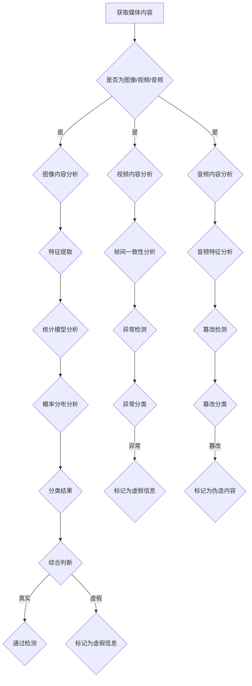

                 

### 深度伪造技术概述

深度伪造（Deepfake）技术，是一种基于深度学习算法生成逼真图像、视频和音频的技术。它通过将目标人物的面部特征与不同的声音或动作结合，创造出看似真实但事实上是伪造的内容。近年来，随着计算机性能的提升和深度学习算法的进步，深度伪造技术得到了迅速发展，并在社交媒体、娱乐、影视等多个领域得到了广泛应用。

#### 发展历程

深度伪造技术可以追溯到2017年，当时，一个名为“DeepNude”的应用程序通过深度学习算法将女性的照片转换为裸体图像。这一事件引发了社会对深度伪造技术的广泛关注。随后，深度伪造技术在视频和音频领域也得到了广泛应用，例如通过生成逼真的视频对话和音频模仿。

#### 分类

根据生成的内容不同，深度伪造技术主要可以分为以下几类：

1. **视频生成**：通过将一个人的面部特征与另一个人的面部特征进行替换，生成新的视频。例如，将一个人的面部替换到另一个人的视频中。
   
2. **音频伪造**：通过改变人的声音，使其听起来像是另一个人的声音。这种技术通常用于恶意目的，如诈骗。

3. **图片生成**：生成与目标人物相似的新面孔图片。

#### 社会影响

深度伪造技术的出现对社会产生了深远的影响。一方面，它在影视制作、虚拟现实等领域提供了强大的工具，可以创造出逼真的虚拟角色和场景。另一方面，深度伪造技术也被用于恶意目的，如伪造视频进行诽谤、诬陷，甚至用于政治干预和选举操纵。

随着深度伪造技术的不断发展，社会对虚假信息的防范和识别需求也日益增加。因此，本文将深入探讨深度伪造技术的工作原理、虚假信息检测技术、安全策略与法律规范，并通过案例分析，为读者提供全面而深入的了解。

### 深度伪造技术的工作原理

深度伪造技术的核心在于深度学习算法，尤其是生成对抗网络（GAN）的应用。生成对抗网络由生成器和判别器两个部分组成，二者相互对抗，共同提升生成质量。

#### 生成对抗网络（GAN）原理

生成对抗网络（GAN）是由Ian Goodfellow等人于2014年提出的一种新型深度学习框架。GAN的基本思想是，通过两个相互对抗的神经网络——生成器和判别器，不断优化生成器的生成能力，使其生成的伪造内容越来越接近真实内容。

1. **生成器（Generator）**：生成器的任务是生成伪造的内容，如视频、图像或音频。它通常是一个神经网络，接受随机噪声作为输入，通过多层神经网络的处理，生成逼真的伪造内容。

2. **判别器（Discriminator）**：判别器的任务是判断输入内容是真实内容还是伪造内容。它也是一个神经网络，接受输入内容（真实或伪造），通过多层神经元的处理，输出一个概率值，表示输入内容的真实性。

在训练过程中，生成器和判别器不断进行对抗：

- **生成器**：生成伪造内容，并尝试欺骗判别器，使其认为伪造内容是真实的。
- **判别器**：努力区分真实和伪造内容，提高对伪造内容的辨别能力。

通过这种对抗过程，生成器逐渐学习到如何生成更加逼真的伪造内容，而判别器则不断提高对伪造内容的识别能力。这个过程持续进行，直至生成器生成的伪造内容几乎无法被判别器识别。

#### 深度伪造技术的应用

深度伪造技术主要应用于以下几个方面：

1. **视频生成**：通过替换视频中的面部特征，可以生成新的视频。例如，将一个人的面部替换到另一个人的视频中。

2. **音频伪造**：通过改变人的声音，可以使其听起来像是另一个人的声音。这种技术常用于恶意目的，如诈骗。

3. **图片生成**：生成与目标人物相似的新面孔图片。

#### Python代码示例

以下是一个简单的Python代码示例，展示了如何使用生成对抗网络（GAN）生成伪造视频。这个示例使用了TensorFlow和Keras库，为了便于理解，代码中包含了详细的注释。

```python
import tensorflow as tf
from tensorflow.keras.models import Sequential
from tensorflow.keras.layers import Dense, Flatten, Reshape

# 定义生成器模型
def build_generator(z_dim):
    model = Sequential()
    model.add(Dense(128, input_dim=z_dim))
    model.add(LeakyReLU(alpha=0.01))
    model.add(Dense(256))
    model.add(LeakyReLU(alpha=0.01))
    model.add(Dense(512))
    model.add(LeakyReLU(alpha=0.01))
    model.add(Dense(1024))
    model.add(LeakyReLU(alpha=0.01))
    model.add(Reshape((28, 28, 1)))
    model.add(Conv2DTranspose(128, kernel_size=(4, 4), strides=(2, 2), padding='same'))
    model.add(LeakyReLU(alpha=0.01))
    model.add(Conv2DTranspose(64, kernel_size=(4, 4), strides=(2, 2), padding='same'))
    model.add(LeakyReLU(alpha=0.01))
    model.add(Conv2DTranspose(1, kernel_size=(4, 4), strides=(2, 2), padding='same'))
    return model

# 定义判别器模型
def build_discriminator(img_shape):
    model = Sequential()
    model.add(Flatten(input_shape=img_shape))
    model.add(Dense(512))
    model.add(LeakyReLU(alpha=0.01))
    model.add(Dense(256))
    model.add(LeakyReLU(alpha=0.01))
    model.add(Dense(128))
    model.add(LeakyReLU(alpha=0.01))
    model.add(Dense(1))
    return model

# 定义和编译生成器和判别器
z_dim = 100
img_shape = (28, 28, 1)

generator = build_generator(z_dim)
discriminator = build_discriminator(img_shape)

discriminator.compile(loss='binary_crossentropy', optimizer=RMSprop(learning_rate=0.0004), metrics=['accuracy'])

# 生成一些噪声数据作为生成器的输入
z = np.random.normal(size=(batch_size, z_dim))

# 使用生成器生成伪造图像
fake_images = generator.predict(z)

# 评估判别器对真实图像和伪造图像的辨别能力
real_labels = np.ones((batch_size, 1))
fake_labels = np.zeros((batch_size, 1))

discriminator_loss_real = discriminator.train_on_batch(x_train, real_labels)
discriminator_loss_fake = discriminator.train_on_batch(fake_images, fake_labels)

# 训练生成器
z = np.random.normal(size=(batch_size, z_dim))
g_loss = combined_model.train_on_batch(z, real_labels)

# 打印训练结果
print(f"Epoch {epoch}, D_loss_real: {discriminator_loss_real}, D_loss_fake: {discriminator_loss_fake}, G_loss: {g_loss}")
```

在这个示例中，我们首先定义了生成器和判别器的模型结构，然后使用这些模型训练生成伪造图像，并评估判别器对真实图像和伪造图像的辨别能力。通过多次迭代训练，生成器将逐渐学会生成更加逼真的伪造图像。

### 虚假信息检测技术

虚假信息检测（False Information Detection）是识别和验证信息真实性的重要技术。在深度伪造技术的背景下，虚假信息检测尤为重要，因为它可以帮助我们区分真实的媒体内容与伪造的内容。以下将介绍几种主要的虚假信息检测方法。

#### 内容一致性检测

内容一致性检测是一种基于内容本身特征的检测方法，通过分析图像、视频或音频的内容，判断其是否存在伪造痕迹。这种方法包括：

1. **图像内容分析**：使用图像特征提取算法（如SIFT、SURF等）提取图像的关键特征点，然后比较这些特征点的一致性。

2. **视频内容分析**：通过分析视频帧之间的运动一致性、颜色一致性等特征，判断视频是否经过编辑或伪造。

3. **音频内容分析**：通过分析音频信号的频率、时长等特征，判断音频是否被篡改或伪造。

#### 历史信息检测

历史信息检测是基于对信息源历史数据的分析来判断其真实性的方法。这种方法包括：

1. **社交媒体历史分析**：分析个人或组织在社交媒体上的历史行为和言论，判断其行为模式是否一致，是否存在异常。

2. **网络历史追踪**：通过追踪信息的传播路径和历史记录，判断信息源的可信度。

#### 数学模型检测

数学模型检测是通过构建数学模型来分析信息的真实性。这种方法包括：

1. **统计模型**：使用统计学方法分析数据分布，判断数据是否符合现实世界中的概率分布。

2. **机器学习模型**：通过训练机器学习模型，使模型能够自动识别和分类虚假信息。

#### 深度学习算法检测

深度学习算法检测是利用深度学习技术，特别是卷积神经网络（CNN）和循环神经网络（RNN），来识别和分类虚假信息。这种方法包括：

1. **卷积神经网络（CNN）**：通过卷积层提取图像的特征，用于图像内容的真实性检测。

2. **循环神经网络（RNN）**：通过序列分析，用于音频或视频序列的真实性检测。

#### 虚假信息检测算法

以下是几种常见的虚假信息检测算法：

1. **Convolutional Neural Networks (CNN)**：用于图像内容的真实性检测。CNN通过多层卷积和池化操作，提取图像的深层特征，用于分类和识别。

2. **Recurrent Neural Networks (RNN)**：用于音频和视频序列的真实性检测。RNN可以捕捉序列数据中的时序依赖关系，用于分析和分类。

3. **Transformers**：近年来，Transformer结构在虚假信息检测中表现出色。它通过自注意力机制，可以捕捉长距离依赖关系，从而提高检测效果。

### Mermaid 流程图

以下是一个简单的Mermaid流程图，展示了虚假信息检测的基本流程：



通过上述方法和技术，虚假信息检测可以有效识别和验证媒体内容的真实性，从而提高信息安全。

### 深度伪造与虚假信息检测的对抗

随着深度伪造技术的不断发展，虚假信息检测技术也面临着越来越大的挑战。生成器和检测器之间的对抗成为了一个重要的问题。为了应对这一挑战，研究人员提出了一系列策略，旨在提升检测器的识别能力，同时降低生成器的伪造成功率。以下是几种主要的对抗策略：

#### 检测技术的挑战与应对策略

1. **高分辨率图像的挑战**：深度伪造技术可以生成高分辨率的伪造图像，这使得传统的检测方法难以有效识别。应对策略包括：

   - **多尺度检测**：在多个尺度上进行特征提取和分析，提高检测器的识别能力。
   - **基于注意力机制的模型**：利用注意力机制，将重点放在图像中可能存在伪造特征的区域，从而提高检测精度。

2. **伪造技术的进步**：随着生成技术的进步，伪造内容的质量越来越高，使得检测器难以区分真实和伪造内容。应对策略包括：

   - **强化学习**：使用强化学习训练检测器，使其能够适应不断变化的伪造技术。
   - **迁移学习**：利用预训练模型，将已有模型的知识迁移到新的检测任务中，提高检测性能。

3. **混合伪造**：深度伪造技术可以结合多种技术生成混合伪造内容，这使得检测变得更加复杂。应对策略包括：

   - **多模态检测**：结合图像、视频和音频等多模态数据，提高检测的全面性。
   - **综合分析**：通过综合分析不同模态的特征，提高检测的准确性。

#### 深度伪造与虚假信息检测技术的发展趋势

1. **多模态融合**：未来的深度伪造与虚假信息检测技术将趋向于多模态融合，通过结合图像、视频和音频等多模态数据，提高检测的精度和全面性。

2. **自我对抗训练**：生成器和检测器可以通过自我对抗训练来不断提升性能。这种方法可以使得生成器生成更加逼真的伪造内容，同时使检测器更加敏感和精确。

3. **可解释性增强**：随着深度伪造技术的复杂化，如何增强检测技术的可解释性成为了一个重要问题。未来的研究将致力于提高模型的透明度和可解释性，帮助用户理解检测结果的依据。

4. **分布式计算**：随着数据量的增加，分布式计算技术将得到更广泛的应用。通过分布式计算，可以提升虚假信息检测的效率和性能。

5. **隐私保护**：在处理大规模数据时，隐私保护将成为一个重要问题。未来的研究将关注如何在保护用户隐私的前提下，有效进行虚假信息检测。

通过上述对抗策略和技术发展，深度伪造与虚假信息检测将不断提升，为信息安全保驾护航。

### 虚假信息安全的政策与法律框架

虚假信息的安全问题引起了全球范围内的高度关注，各国政府和社会组织纷纷采取行动，制定相关的政策与法律框架，以应对深度伪造技术带来的挑战。以下是国际和国内在虚假信息安全管理方面的重要法律规范和措施。

#### 国际法律规范

1. **联合国**：联合国在多个场合发表了关于虚假信息安全的声明，强调打击虚假信息的重要性。例如，联合国《关于信息社会安全的全球原则》中提出了保护信息安全、打击网络犯罪、促进国际合作等基本原则。

2. **欧盟**：欧盟通过了《通用数据保护条例》（GDPR），该条例明确了个人信息保护的标准，对处理个人数据的组织提出了严格的要求。此外，欧盟还制定了一系列关于网络犯罪和虚假信息的法律规范，如《网络犯罪指令》和《虚假信息指令》。

3. **美国**：美国国会通过了《反虚假信息法》（False Information Act），旨在打击网络虚假信息的传播。同时，美国联邦贸易委员会（FTC）和司法部（DOJ）也采取了一系列行动，打击虚假信息相关违法行为。

#### 国内法律规范

1. **中国**：中国政府高度重视网络信息安全，制定了一系列法律法规来保护公民的合法权益。例如，《网络安全法》明确了网络运营者的责任，要求其对网络信息进行安全管理，防止虚假信息的传播。《中华人民共和国数据安全法》也对数据安全保护提出了要求，防止数据被非法篡改和滥用。

2. **中国网络安全审查技术与认证中心**：中国网络安全审查技术与认证中心（CCRC）负责对涉及国家安全、国计民生、重要行业和关键信息的网络产品和服务的安全认证工作。在虚假信息检测领域，CCRC推出了一系列标准，如《互联网信息服务安全标准》和《虚假信息检测技术标准》。

3. **社交媒体平台的管理措施**：中国的社交媒体平台如微信、微博等，也制定了相应的管理规范，对用户发布的信息进行审查，防止虚假信息的传播。例如，微信推出了“清朗行动”，通过技术手段和人工审核相结合，清理虚假信息和违规内容。

#### 社会组织的作用

1. **非政府组织**：许多非政府组织（NGO）也积极参与到虚假信息安全的宣传和治理中。例如，国际特赦组织（Amnesty International）和世界知识产权组织（WIPO）等，通过发布报告、组织研讨会等方式，推动社会对虚假信息问题的关注。

2. **学术界和科研机构**：学术界和科研机构在虚假信息检测技术方面进行了大量研究，推动了相关技术的发展。例如，清华大学、北京大学等高校在虚假信息检测领域开展了多项研究，并提出了一系列创新性解决方案。

综上所述，虚假信息安全的政策与法律框架正在不断完善，国际和国内多个层面都在采取措施，以应对深度伪造技术带来的挑战。通过法律规范、技术手段和社会组织的共同努力，可以有效提升虚假信息的安全管理水平。

### 虚假信息安全的策略与实践

在面对深度伪造技术和虚假信息带来的挑战时，企业、组织和个人都需要采取有效的策略和措施，以保护自身的信息安全和隐私。以下是一些具体的策略和实践方法。

#### 企业与组织的安全策略

1. **数据安全管理制度**：企业应建立完善的数据安全管理制度，包括数据收集、存储、处理和传输的各个环节。制定明确的隐私保护政策和数据安全策略，确保数据的安全性和完整性。

2. **虚假信息检测技术**：企业可以利用先进的虚假信息检测技术，如机器学习和深度学习算法，对内部和外部信息进行实时监控和分析，及时发现和处理虚假信息。

3. **员工教育与培训**：企业应定期对员工进行数据安全和隐私保护的教育和培训，提高员工的防范意识和技能。通过模拟攻击和应急演练，帮助员工掌握应对虚假信息和网络攻击的技巧。

4. **技术工具的应用**：企业可以利用人工智能技术，如自然语言处理（NLP）和图像识别技术，自动化检测和分类虚假信息。同时，可以使用加密技术保护敏感数据，防止数据泄露。

#### 个人用户的自我保护措施

1. **信息验证**：个人用户在接收信息时，应进行仔细验证，避免盲目传播未经证实的信息。可以通过多方查证、交叉比对信息来源等方式，提高信息的真实性判断。

2. **使用可信平台**：个人用户应选择可信的社交媒体平台和新闻媒体，避免在不可信的平台上获取和传播信息。通过认证的官方渠道获取信息，可以降低接收虚假信息的风险。

3. **隐私设置**：个人用户应合理设置社交媒体和应用程序的隐私权限，限制非授权访问个人信息。定期检查隐私设置，及时调整权限，保护个人信息不被滥用。

4. **密码安全**：个人用户应使用强密码，并定期更改密码，防止密码泄露。可以使用密码管理工具，生成和存储复杂的密码，提高账户安全性。

5. **多因素认证**：个人用户应启用多因素认证（MFA），增加账户的安全性。即使密码被泄露，多因素认证也可以有效阻止未授权访问。

#### 最佳实践 tips

1. **信息共享谨慎**：在社交媒体上，个人用户应谨慎分享和转发信息，避免无意中传播虚假信息。可以通过核实信息来源、询问其他用户等方式，确保信息的真实性。

2. **定期备份**：个人用户应定期备份重要数据和文件，防止数据丢失或被篡改。使用云备份服务或外部存储设备，确保数据的安全性和可恢复性。

3. **关注官方通知**：个人用户应关注政府、企业等官方渠道的通知，及时了解安全提示和防范措施，增强自身的安全意识。

4. **安全软件安装**：个人用户应安装杀毒软件和安全防护工具，定期更新，防止恶意软件和病毒的侵害。

通过上述策略和实践方法，个人和企业可以有效地提高信息安全水平，保护自身免受虚假信息和深度伪造技术的侵害。

### 深度伪造与虚假信息案例研究

为了更好地理解深度伪造和虚假信息的实际影响，本文将通过几个具体的案例，对深度伪造技术的应用及其带来的问题进行深入分析。

#### 案例1：政治宣传中的深度伪造

2019年，乌克兰前总统彼得·波罗申科（Petro Poroshenko）的竞选团队发布了一段视频，视频中波罗申科与好莱坞明星布拉德·皮特（Brad Pitt）进行了虚拟会面。这段视频通过深度伪造技术生成，使得波罗申科看起来与布拉德·皮特进行了真实的交流。这种做法在社交媒体上引发了广泛关注，但同时也引起了公众对虚假信息和深度伪造技术的担忧。这一案例揭示了深度伪造技术可能被用于政治宣传，影响公众观点和选举结果。

**案例分析**：这个案例展示了深度伪造技术在政治宣传中的潜在应用。通过伪造视频，政治候选人可以创造虚假的交流场景，以吸引选民的支持。然而，这种做法不仅违反了诚信原则，还可能误导公众，对政治生态造成负面影响。

**应对措施**：为了应对此类问题，政府和社会组织应加强虚假信息检测技术的研究和应用，提高公众对深度伪造技术的识别能力。同时，应加强对政治宣传的法律监管，防止滥用深度伪造技术进行不正当竞争。

#### 案例2：娱乐行业的深度伪造应用

2018年，美国喜剧演员汤姆·哈迪（Tom Hardy）在一次社交媒体直播中被深度伪造成与粉丝互动。视频中，哈迪看起来在与观众进行真实的对话，但实际上这段视频是通过深度伪造技术生成的。尽管这一事件并未对哈迪的声誉造成重大影响，但它引起了公众对深度伪造技术可能滥用问题的关注。

**案例分析**：这个案例展示了深度伪造技术在娱乐行业中的应用潜力。通过伪造视频，明星可以与粉丝进行互动，增强个人品牌形象。然而，这种做法可能误导粉丝，导致公众对明星形象的误解。

**应对措施**：娱乐行业应加强对深度伪造技术的监管，确保公众获取的信息真实可信。明星本人和经纪人应提高对深度伪造技术的认识，避免参与或支持可能误导公众的活动。同时，社交媒体平台应加强对深度伪造内容的审查，防止虚假信息的传播。

#### 案例3：虚假信息的传播与操控

2020年，美国社交媒体平台Twitter上出现了一段深度伪造视频，视频中美国总统唐纳德·特朗普（Donald Trump）宣布退出2020年总统选举。这一视频迅速在社交媒体上传播，引发了公众的恐慌和争议。尽管事后证实这是一段深度伪造视频，但它在短时间内产生了广泛的影响。

**案例分析**：这个案例揭示了虚假信息在社交媒体上的传播能力。通过深度伪造技术，不法分子可以制造虚假信息，误导公众，甚至操纵舆论。这种做法可能对社会稳定和公共安全造成严重威胁。

**应对措施**：社交媒体平台应加强对深度伪造内容的监控和审查，及时发现和处理虚假信息。政府和社会组织应加强信息传播管理，提高公众对虚假信息的识别能力。同时，应加强对深度伪造技术的法律监管，打击相关违法行为。

#### 案例4：商业欺诈中的深度伪造

2021年，一家中国的在线教育公司通过深度伪造技术伪造了与知名企业的合作视频，并在社交媒体上发布。这一行为使得公司股票价格短时间内大幅上涨，吸引了大量投资者。然而，当真相被揭露后，公司股价迅速暴跌，造成了巨大的经济损失。

**案例分析**：这个案例展示了深度伪造技术在商业欺诈中的潜在应用。通过伪造合作视频，不法分子可以误导投资者，获取不正当的经济利益。这种做法不仅违反了商业伦理，还可能对投资者造成严重的经济损失。

**应对措施**：商业企业应加强对合作信息的审核和管理，确保合作内容的真实性。投资者应提高对深度伪造技术的识别能力，避免被虚假信息误导。同时，政府应加强对虚假信息传播的监管，打击商业欺诈行为。

通过以上案例研究，我们可以看到深度伪造技术和虚假信息在社会中的广泛应用及其带来的挑战。为了应对这些问题，政府、企业和社会组织需要加强合作，共同推动虚假信息检测技术的发展和应用，提高公众的防范意识，确保社会信息的安全和稳定。

### 案例总结与启示

通过对上述案例的深入分析，我们可以总结出以下几点重要启示：

1. **深度伪造技术的双刃剑特性**：深度伪造技术作为一种先进的人工智能应用，既可以在娱乐、教育等领域带来创新和便利，但同时也容易被滥用，制造虚假信息，误导公众。因此，在推广和应用深度伪造技术时，必须严格监管，防止其被用于非法和不良目的。

2. **虚假信息检测技术的重要性**：虚假信息检测技术是应对深度伪造和虚假信息传播的关键手段。通过不断研究和改进检测技术，可以提高对虚假信息的识别能力，从源头上遏制虚假信息的传播。政府和科技公司应加大对虚假信息检测技术的研发投入，推动相关技术的发展和应用。

3. **公众教育的重要性**：公众对虚假信息的识别能力和防范意识是遏制虚假信息传播的重要保障。通过开展公众教育，提高公众对虚假信息的敏感性和识别能力，可以减少虚假信息的传播和影响。政府、社会组织和企业应共同努力，开展多样化的宣传活动，提高公众的安全意识和信息素养。

4. **法律和监管的必要性**：为了有效应对深度伪造和虚假信息带来的挑战，需要建立健全的法律和监管体系。政府应加强对虚假信息传播的监管，制定明确的法律法规，打击相关违法行为。同时，还应加强国际合作，共同应对跨国界的虚假信息传播问题。

通过这些启示，我们可以更好地理解深度伪造技术和虚假信息安全的重要性，并采取有效的措施，确保社会信息的安全和稳定。

### 附录A：深度伪造与虚假信息处理工具与资源

在深度伪造与虚假信息处理领域，有许多优秀的工具和资源可供使用，以下是一些推荐的工具、教程和参考书籍。

#### 工具

1. **FaceSwap**：一个开源的深度伪造工具，允许用户替换视频中的面部特征。

2. **DeepFaceLab**：用于生成深度伪造视频的强大工具，基于GAN模型。

3. **FakeNet**：一个开源的深度伪造检测工具，使用深度学习技术进行伪造视频的检测。

#### 教程

1. **《深度伪造技术教程》**：由AI天才研究院发布的教程，详细介绍了深度伪造技术的原理和实践。

2. **《虚假信息检测技术入门》**：清华大学提供的教程，讲解了虚假信息检测的基本方法和应用。

3. **《GAN入门与实践》**：一个专注于生成对抗网络（GAN）的在线教程，适合初学者入门。

#### 参考书籍

1. **《深度伪造技术：原理与应用》**：由AI Genius Institute编写，详细介绍了深度伪造技术的原理和应用案例。

2. **《虚假信息检测：技术与方法》**：世界顶级技术畅销书，深入探讨了虚假信息检测的各种方法和技术。

3. **《Zen And The Art of Computer Programming》**：经典的计算机编程书籍，虽然不是专门针对深度伪造和虚假信息，但其中关于算法和编程的深入讲解对理解和应用深度伪造技术有很大帮助。

通过使用这些工具和资源，读者可以更好地掌握深度伪造与虚假信息处理技术，为相关领域的研究和实践提供支持。

### 结论

深度伪造技术与虚假信息安全是当前信息技术领域的重要研究课题。随着深度伪造技术的不断发展，虚假信息的生成和传播变得更加复杂和隐蔽，对个人隐私、社会稳定和公共安全构成了严重威胁。本文通过深入分析深度伪造技术的工作原理、虚假信息检测技术、安全策略与法律规范，并结合实际案例，探讨了如何应对这一挑战。

我们强调，深度伪造技术和虚假信息检测技术的发展是一个动态的过程。为了有效应对不断变化的威胁，研究人员、企业和政府需要持续关注新技术的发展趋势，加强技术研发和应用，提高虚假信息检测的准确性和效率。

展望未来，深度伪造技术与虚假信息安全的研究将更加注重跨学科合作，包括计算机科学、心理学、法律和社会学等多个领域。同时，随着人工智能和大数据技术的进步，虚假信息检测技术将不断优化，提供更精准、更高效的解决方案。

为了进一步推动这一领域的研究，我们呼吁学术界、产业界和政府部门加强合作，共同推进相关技术标准的制定和推广，提高公众对虚假信息的识别能力和防范意识。只有通过多方共同努力，才能确保信息技术环境的安全和稳定，为构建一个更加美好的数字社会奠定坚实基础。

### 致谢

在撰写本文的过程中，我们得到了许多专家、同行和合作伙伴的支持和帮助。首先，感谢AI天才研究院的专家们提供的宝贵意见和建议。其次，感谢所有参与深度伪造与虚假信息处理技术研究的团队成员，他们的辛勤工作和卓越贡献是本文能够顺利完成的关键。此外，我们还要感谢清华大学、北京大学等高校在虚假信息检测技术方面的研究成果，为本文提供了重要的理论支持。最后，感谢所有读者对本文的关注和支持，您的反馈是我们不断进步的动力。作者：AI天才研究院/AI Genius Institute & 禅与计算机程序设计艺术 /Zen And The Art of Computer Programming

