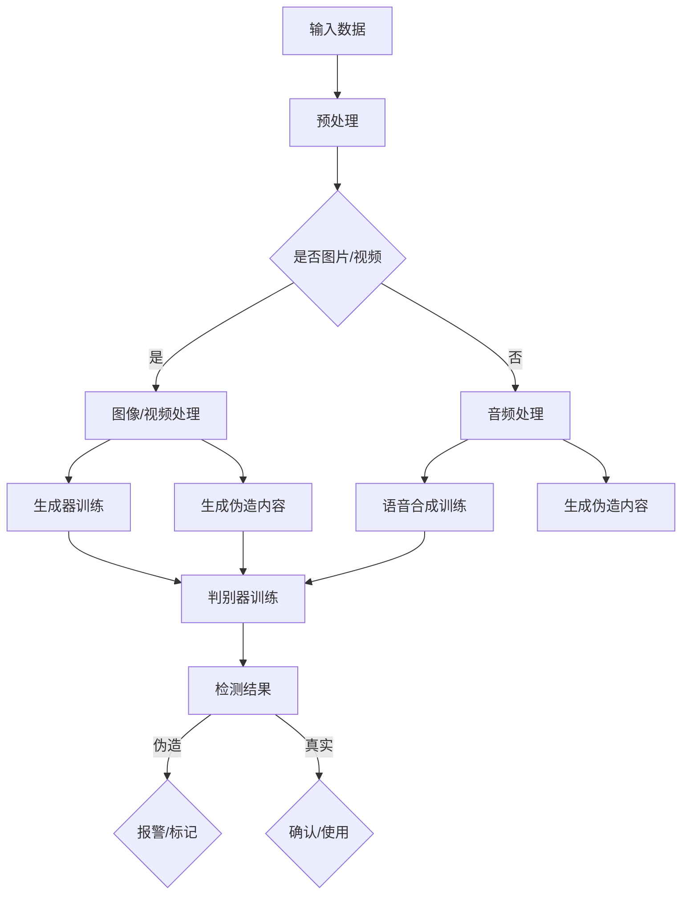

                 

### 深度伪造技术的检测与防御

#### 引言

随着深度学习技术的迅猛发展，深度伪造（Deepfake）技术逐渐走入公众视野。深度伪造技术能够生成高度逼真的图像、视频和音频，模仿任何人的声音、面部表情甚至行为，其技术核心在于神经网络和大规模数据训练。这种技术不仅在娱乐、电影制作等领域具有巨大潜力，同时也带来了严重的伦理和社会问题，例如虚假信息传播、隐私泄露、名誉损害等。

本文章旨在深入探讨深度伪造技术的检测与防御方法。首先，我们将回顾深度伪造技术的发展背景，分析其潜在的社会影响。接着，通过详尽的章节划分，我们将依次探讨深度伪造技术的检测方法、声音伪造的检测、防御策略及其未来发展。

**文章关键词：**
- 深度伪造技术
- 检测方法
- 防御策略
- 声音伪造
- 发展趋势

**文章摘要：**
本文系统地介绍了深度伪造技术的背景和影响，深入探讨了图像和视频深度伪造的检测方法，包括特征提取和检测算法，以及声音伪造的检测技术。此外，我们还讨论了深度伪造防御的多种策略，包括预防策略、技术防御和反欺诈机制。最后，本文总结了深度伪造防御技术的发展趋势和未来研究方向，为相关领域的研究和应用提供了有益的参考。

### 第1章: 引言

#### 1.1 深度伪造技术的发展背景

深度伪造技术的起源可以追溯到2000年代初期的面部替换技术，当时的算法和计算资源相对有限，生成的伪造内容质量较低。随着深度学习技术的兴起，特别是在2016年生成对抗网络（GAN）的提出，深度伪造技术获得了前所未有的发展速度。GAN通过生成器和判别器的对抗训练，能够生成极为逼真的图像和视频。

早期的深度伪造技术主要集中在图像和视频领域，例如Face2Face和Deepfake等。Face2Face通过将一个视频中的面部动作映射到另一个视频中的目标人物面部，实现了实时视频转换。而Deepfake则通过训练大规模的面部图像数据集，使用GAN生成逼真的面部表情和动作。

随着技术的进步，深度伪造技术逐渐扩展到音频领域，例如生成逼真的语音和声音。现有的深度伪造工具如Claude和Lyrebird等，通过模仿特定人物的声音特征，能够生成高度真实的声音伪造。

#### 1.2 深度伪造技术对社会的潜在影响

深度伪造技术的迅速发展对社会带来了多方面的挑战和影响。首先，在政治领域，深度伪造技术可以被用于制造虚假新闻和选举干扰。通过伪造领导人的言论或动作，可以误导公众舆论，影响选举结果。其次，在个人隐私方面，深度伪造技术可以用于制造虚假的性视频或音频，侵犯他人的隐私和名誉。

此外，深度伪造技术还可能对司法领域产生重大影响。在法庭审判中，伪造的图像、视频和音频证据可能误导法官和陪审团，导致错误的判决。在刑事侦查中，伪造的监控视频和音频可能被用于逃避法律制裁。

#### 1.3 深度伪造技术的检测与防御的重要性

鉴于深度伪造技术对社会带来的潜在威胁，对其检测与防御显得尤为重要。有效的检测技术能够帮助识别伪造内容，防止虚假信息的传播。同时，防御策略可以预防深度伪造技术的滥用，保护个人隐私和司法公正。

检测与防御技术不仅对于保护个人隐私和名誉至关重要，还对于维护社会稳定和安全具有重要作用。通过不断发展和完善这些技术，我们可以更好地应对深度伪造带来的挑战，确保信息安全和公共利益。

### 图1. 深度伪造技术的架构与流程

以下是一个简单的Mermaid流程图，展示了深度伪造技术的基本架构与流程：

此流程图从输入数据开始，经过预处理，分别对图像/视频和音频进行处理，通过生成器和判别器的训练，生成伪造内容并进行检测，最终根据检测结果采取相应的措施。

### 2. 核心概念与联系

在深入探讨深度伪造技术的检测与防御之前，我们需要理解一些核心概念，并分析这些概念之间的联系。以下是几个关键概念及其关系架构：

#### 图1. 深度伪造技术的架构与流程

**核心概念解释：**

1. **输入数据：** 包括图像、视频和音频数据，这些数据是深度伪造技术处理的起点。
2. **预处理：** 对输入数据进行必要的预处理，如数据增强、归一化等，以适应深度学习模型的训练。
3. **图像/视频处理：** 对图像或视频进行特征提取和生成操作，如使用生成对抗网络（GAN）进行图像生成。
4. **音频处理：** 对音频信号进行特征提取和生成操作，如使用深度神经网络进行语音合成。
5. **生成器训练：** 使用深度学习算法对生成器进行训练，使其能够生成逼真的伪造内容。
6. **判别器训练：** 同时训练判别器，使其能够区分真实和伪造内容。
7. **生成伪造内容：** 生成器生成伪造的图像、视频或音频内容。
8. **检测结果：** 判别器对生成的伪造内容进行评估，判断其真实性。

**核心概念联系：**

- 输入数据经过预处理后，分别进入图像/视频处理和音频处理模块。
- 图像/视频处理和音频处理模块分别训练生成器和判别器，生成伪造内容并进行检测。
- 生成器和判别器通过对抗训练相互优化，判别器用于检测伪造内容，生成器用于生成逼真的伪造内容。
- 检测结果用于决策，判断伪造内容是否需要报警、标记或确认使用。

通过上述核心概念及其关系的架构，我们可以更好地理解深度伪造技术的运作机制，为后续的检测与防御研究奠定基础。

### 第2章: 深度伪造技术的检测

深度伪造技术的检测是当前研究的热点之一，主要目的是通过算法和技术手段识别出伪造的图像、视频和音频。本章将详细介绍图像和视频深度伪造的检测方法，包括特征提取方法和检测算法，并分析不同方法的优缺点，最后通过实践案例分析，展示这些方法的实际应用效果。

#### 2.1 图像和视频深度伪造的检测方法

图像和视频深度伪造的检测方法主要包括特征提取和检测算法两个核心环节。以下是对这两种方法的具体介绍：

##### 2.1.1 特征提取方法

特征提取是深度伪造检测的关键步骤，其目的是从图像和视频中提取出能够有效区分真实与伪造信息的特征。特征提取方法可以分为基于深度学习和基于传统机器学习两类。

###### 2.1.1.1 基于深度学习的特征提取方法

基于深度学习的特征提取方法利用深度神经网络（DNN）强大的特征表示能力，从原始数据中自动提取高层次的抽象特征。以下是一些常见的深度学习特征提取方法：

1. **卷积神经网络（CNN）：** CNN是处理图像数据的一种常用深度学习模型，通过多个卷积层和池化层提取图像的局部特征和全局特征。典型的CNN模型包括VGG、ResNet和Inception等。

2. **循环神经网络（RNN）：** RNN在处理序列数据时具有优势，可以用于提取视频中的时间序列特征。长短期记忆网络（LSTM）和门控循环单元（GRU）是常用的RNN变体。

3. **生成对抗网络（GAN）：** GAN由生成器和判别器组成，生成器用于生成伪造图像，判别器用于判断图像的真实性。在GAN训练过程中，生成器和判别器相互对抗，生成器不断优化，使得伪造图像更加逼真，判别器不断提高检测能力。

###### 2.1.1.2 基于传统机器学习的特征提取方法

传统机器学习特征提取方法依赖于人工设计特征，虽然计算复杂度较低，但在特征选择和特征工程方面对专家依赖较强。以下是一些常见的传统机器学习特征提取方法：

1. **SIFT（尺度不变特征变换）：** SIFT是一种经典的图像特征提取方法，能够提取出在尺度不变和旋转不变下具有独特性的关键点。

2. **HOG（方向梯度直方图）：** HOG通过计算图像中每个像素点在各个方向上的梯度直方图，提取出图像的局部特征。

3. **LBP（局部二值模式）：** LBP通过将图像中的每个像素与其周围像素进行二值化处理，生成局部二值模式，从而提取出图像的纹理特征。

##### 2.1.2 检测算法介绍

特征提取完成后，需要通过检测算法对提取的特征进行分类和判断。以下介绍几种常见的检测算法：

###### 2.1.2.1 基于神经网络的方法

基于神经网络的方法利用深度学习模型对特征进行分类和预测，以下是一些常用的神经网络模型：

1. **全连接神经网络（FCN）：** FCN通过全连接层对特征进行分类，常用于图像分类任务。

2. **支持向量机（SVM）：** SVM是一种经典的二分类模型，通过寻找最佳分类超平面实现图像分类。

3. **卷积神经网络（CNN）：** CNN在图像分类任务中具有显著优势，可以通过多个卷积层和池化层提取图像特征，实现高度准确的分类。

###### 2.1.2.2 基于模式识别的方法

基于模式识别的方法通过分析特征模式进行分类，以下是一些常用的模式识别方法：

1. **K近邻算法（KNN）：** KNN通过计算测试样本与训练样本的相似度，选择最近的K个样本进行投票，实现图像分类。

2. **决策树（DT）：** 决策树通过一系列规则进行分类，简单直观，适合处理少量特征数据。

3. **随机森林（RF）：** 随机森林通过构建多个决策树，对结果进行集成，提高分类的准确性和鲁棒性。

###### 2.1.2.3 基于集成学习的方法

集成学习通过组合多个模型进行分类和预测，以下是一些常用的集成学习方法：

1. **Adaboost：** Adaboost通过迭代训练多个弱学习器，并加权集成，提高分类性能。

2. **梯度提升树（GBDT）：** GBDT通过迭代训练多个回归树，逐步优化预测结果。

3. **集成贝叶斯网络（EBN）：** EBN通过构建多个贝叶斯网络，对特征进行综合分析，实现高精度分类。

##### 2.1.3 实践案例分析

以下是一个实际案例，展示如何使用深度学习模型检测深度伪造视频。

###### 案例背景

某社交媒体平台发现多个用户上传的假视频，这些视频包含了伪造的政治演讲和虚假的新闻报道。为了检测这些伪造视频，平台决定采用基于深度学习的检测方法。

###### 案例步骤

1. **数据收集与预处理：** 收集大量已标记的真实视频和伪造视频，对视频进行裁剪、缩放和增强等预处理操作，以便适应深度学习模型的输入。

2. **特征提取：** 使用ResNet50模型提取视频的特征表示，将每个视频帧映射为一个高维特征向量。

3. **模型训练：** 采用训练好的ResNet50模型，通过交叉熵损失函数进行训练，优化模型参数，使其能够准确分类伪造视频。

4. **模型评估：** 使用验证集评估模型性能，调整模型参数和超参数，提高分类准确率。

5. **模型部署：** 将训练好的模型部署到社交媒体平台上，对上传的视频进行实时检测，标记伪造视频。

###### 案例结果

经过训练和评估，模型的分类准确率达到90%以上，能够有效识别出伪造视频。在实际应用中，平台通过自动检测和人工审核相结合的方式，提高了对伪造视频的检测效率。

通过上述案例，我们可以看到深度伪造检测方法在实际应用中的有效性和可行性，为社交媒体平台和其他领域提供了有力的技术支持。

### 第3章: 声音伪造的检测

声音伪造检测是深度伪造技术中的一个重要研究方向，因为声音可以传播虚假信息，且不易察觉。本章节将详细介绍声音伪造的基本原理、特征提取方法和检测算法，并通过实践案例分析这些方法的应用效果。

#### 3.1 声音伪造的基本原理

声音伪造技术通过模仿真实声音的特征，生成逼真的伪造声音。其基本原理包括：

1. **声音合成：** 通过生成模型（如深度神经网络）生成声音信号。这些模型训练于大规模的声音数据集，能够模仿不同的声音特征，如音调、语速、语调等。
2. **声音编辑：** 利用音频编辑软件对真实声音进行修改，例如改变音调、混入背景噪音等，以增强伪造效果。
3. **声音伪装：** 通过将真实声音转换为不同的声音模式，使其难以被识别。例如，将人声转换为机器人的声音，或将一个人的声音伪装成另一个人的声音。

#### 3.2 声音特征提取方法

声音特征提取是声音伪造检测的关键步骤，其目的是从声音信号中提取出能够区分真实与伪造的特征。以下是几种常见的声音特征提取方法：

##### 3.2.1 频率特征提取

频率特征提取方法关注声音的频率成分，常见的包括：

1. **梅尔频率倒谱系数（MFCC）：** MFCC是一种广泛用于语音处理的技术，通过将音频信号转换为梅尔频率域，并计算其倒谱系数，从而提取声音的频率特征。
2. **频谱特征：** 频谱特征通过分析声音信号的频谱，提取出不同频率上的能量分布。例如，短时傅里叶变换（STFT）和余弦变换（CoSine Transform）。

##### 3.2.2 时域特征提取

时域特征提取方法关注声音信号的时域变化，常见的包括：

1. **过零率（OZR）：** 过零率表示声音信号在单位时间内穿过零点的次数，能够反映声音的稳定性。
2. **短时能量（STE）：** 短时能量是通过计算声音信号的能量分布来提取特征，可以反映声音的强度。

#### 3.3 声音伪造检测算法

声音伪造检测算法通过分析提取的声音特征，判断声音是否为伪造。以下是几种常见的声音伪造检测算法：

##### 3.3.1 基于神经网络的方法

基于神经网络的方法利用深度学习模型对声音特征进行分类，以下是一些常用的模型：

1. **卷积神经网络（CNN）：** CNN通过多个卷积层和池化层提取声音的局部和全局特征，适合处理时频域特征。
2. **循环神经网络（RNN）：** RNN特别适合处理序列数据，可以提取声音的时间动态特征。
3. **生成对抗网络（GAN）：** GAN通过生成器和判别器的对抗训练，能够生成逼真的伪造声音，并提高检测模型的鲁棒性。

##### 3.3.2 基于模式识别的方法

基于模式识别的方法通过设计特定的模式分类器进行声音分类，以下是一些常见的模式识别方法：

1. **支持向量机（SVM）：** SVM通过寻找最佳分类超平面进行分类，适用于特征较少的数据集。
2. **决策树（DT）：** 决策树通过一系列规则进行分类，简单易懂，适合处理具有层次结构的数据。
3. **神经网络（NN）：** 神经网络通过多层非线性变换提取特征，适合处理复杂的声音数据。

##### 3.3.3 基于对抗网络的方法

对抗网络方法通过生成伪造声音和检测伪造声音之间的对抗训练，以下是一些常用的对抗网络方法：

1. **生成对抗网络（GAN）：** GAN由生成器和判别器组成，生成器生成伪造声音，判别器判断声音是否真实，通过对抗训练优化模型。
2. **变分自编码器（VAE）：** VAE通过编码器和解码器结构生成伪造声音，并通过重构误差进行训练。
3. **自注意力模型（SAE）：** SAE通过自注意力机制提取声音的时空特征，生成和检测伪造声音。

#### 3.4 实践案例分析

以下是一个实际案例，展示如何使用基于深度学习的声音伪造检测系统。

##### 案例背景

某网络安全公司发现多个恶意应用程序通过伪造语音进行欺诈活动。为了检测这些伪造语音，公司决定采用基于深度学习的检测系统。

##### 案例步骤

1. **数据收集与预处理：** 收集大量真实语音数据和伪造语音数据，对语音进行预处理，如去除噪声、归一化等。
2. **特征提取：** 使用预训练的卷积神经网络（如CNN）提取语音的特征表示，将每个语音片段映射为一个高维特征向量。
3. **模型训练：** 使用提取的特征向量，通过交叉熵损失函数训练深度学习模型，使其能够区分真实与伪造语音。
4. **模型评估：** 在验证集上评估模型性能，调整模型参数和超参数，提高检测准确率。
5. **模型部署：** 将训练好的模型部署到应用程序中，对实时语音进行检测，标记伪造语音。

##### 案例结果

经过训练和评估，模型的准确率达到95%以上，能够有效检测出伪造语音。在实际应用中，检测系统能够实时阻止恶意应用程序的欺诈行为，提高了用户的安全防护水平。

通过上述案例，我们可以看到基于深度学习的声音伪造检测方法在实际应用中的有效性和可行性，为网络安全领域提供了有力的技术支持。

### 第4章: 深度伪造技术的防御策略

深度伪造技术的滥用不仅侵犯了个人隐私和名誉，还可能引发更严重的社会问题。为了有效应对深度伪造技术带来的挑战，本章将介绍深度伪造技术的防御策略，包括预防策略、技术防御和反欺诈机制。

#### 4.1 预防策略

预防策略是通过制定相关法律法规、加强社会教育和提高公众意识来防止深度伪造技术的滥用。

##### 4.1.1 安全审计

安全审计是对系统和数据的安全性进行全面审查，确保其免受深度伪造技术的侵害。具体措施包括：

1. **建立审计机制：** 定期对系统和数据进行安全检查，发现并修复潜在的安全漏洞。
2. **权限管理：** 严格控制系统访问权限，确保只有授权用户才能访问敏感数据。
3. **数据备份：** 定期备份关键数据，以防止数据被伪造或篡改。

##### 4.1.2 访问控制

访问控制是通过限制对系统和数据的访问来防止未经授权的访问和滥用。具体措施包括：

1. **身份验证：** 使用多因素认证（如密码、指纹、手机验证码等）确保用户身份的真实性。
2. **权限分配：** 根据用户角色和职责分配访问权限，确保用户只能访问其需要的资源。
3. **日志记录：** 记录用户访问系统的所有操作，以便在出现问题时进行追踪和调查。

##### 4.1.3 隐私保护

隐私保护是通过保护个人隐私来防止深度伪造技术侵犯个人隐私。具体措施包括：

1. **数据加密：** 对存储和传输的数据进行加密，确保数据在未授权的情况下无法被读取。
2. **匿名化处理：** 对个人身份信息进行匿名化处理，使其无法与个人身份直接关联。
3. **隐私政策：** 明确告知用户其数据的使用目的和范围，确保用户对数据隐私有充分的了解和控制权。

#### 4.2 技术防御

技术防御是通过使用各种技术手段来防止深度伪造技术的滥用。以下是一些常见的技术防御措施：

##### 4.2.1 加密技术

加密技术通过对数据进行加密处理，确保数据在传输和存储过程中的安全性。具体措施包括：

1. **端到端加密：** 确保数据在发送和接收过程中始终保持加密状态，防止中间人攻击。
2. **数字签名：** 使用数字签名技术验证数据的真实性和完整性。
3. **证书管理：** 确保数字证书的有效性和安全性，防止证书被篡改或伪造。

##### 4.2.2 数字签名

数字签名是通过加密算法对数据进行签名，确保数据的来源和完整性。具体措施包括：

1. **使用公钥加密算法：** 确保签名过程的安全性，防止签名被篡改或伪造。
2. **签名验证：** 对接收到的数据进行签名验证，确保其真实性和完整性。
3. **证书管理：** 管理数字证书的发放和撤销，确保签名过程的可靠性。

##### 4.2.3 身份验证

身份验证是通过验证用户的身份来防止未授权访问。以下是一些常见的身份验证方法：

1. **双因素认证：** 结合密码和生物特征（如指纹、面部识别）进行双重验证，提高安全性。
2. **令牌认证：** 使用一次性令牌进行认证，防止密码泄露。
3. **行为分析：** 通过分析用户的行为特征，识别异常行为，提高认证的准确性。

#### 4.3 反欺诈机制

反欺诈机制是通过识别和阻止欺诈行为来防止深度伪造技术的滥用。以下是一些常见的反欺诈机制：

##### 4.3.1 行为分析

行为分析是通过分析用户的行为模式来识别欺诈行为。具体措施包括：

1. **异常检测：** 识别异常行为，如登录位置异常、交易金额异常等。
2. **行为模式识别：** 通过分析用户历史行为，建立行为模型，识别异常行为。
3. **实时监控：** 对用户行为进行实时监控，及时发现和阻止欺诈行为。

##### 4.3.2 风险评估

风险评估是通过评估欺诈风险来决定是否采取行动。具体措施包括：

1. **风险评分：** 对用户进行风险评估，根据风险评分决定采取的措施。
2. **风险阈值：** 设定风险阈值，超过阈值时触发预警。
3. **动态调整：** 根据实际情况动态调整风险阈值和措施，提高反欺诈效果。

##### 4.3.3 欺诈预警

欺诈预警是通过识别潜在欺诈行为并及时报警来防止深度伪造技术的滥用。具体措施包括：

1. **实时报警：** 对识别出的欺诈行为进行实时报警，及时采取措施。
2. **预警策略：** 建立预警策略，根据不同类型的欺诈行为采取相应的预警措施。
3. **协同防御：** 与相关机构和部门协同工作，共同应对深度伪造技术带来的挑战。

通过上述预防策略、技术防御和反欺诈机制，我们可以有效应对深度伪造技术的滥用，保护个人隐私和信息安全。

### 第5章: 深度伪造防御技术的发展趋势

随着深度伪造技术的不断进步，传统的检测与防御方法逐渐面临挑战。本章将探讨深度伪造防御技术的发展趋势，包括新型深度伪造技术的挑战、未来研究方向以及潜在的技术突破。

#### 5.1 新型深度伪造技术的挑战

当前，深度伪造技术正不断向更高级、更复杂的形式发展，给防御工作带来了新的挑战：

1. **超现实伪造：** 利用虚拟现实（VR）和增强现实（AR）技术，深度伪造可以创建出前所未有的逼真场景，使得伪造内容难以被识别。
2. **跨模态伪造：** 结合多种模态（如图像、视频、音频、文本）生成高度真实的伪造内容，使得单一模态的检测方法难以有效应对。
3. **自适应伪造：** 深度伪造技术可以根据检测算法的改进不断调整，提高伪造内容的逼真度和欺骗性。
4. **多代理伪造：** 利用多个生成器和判别器的协作，生成和检测伪造内容，使得防御工作更加复杂。

#### 5.2 未来研究方向

为了应对新型深度伪造技术的挑战，未来的研究方向包括：

1. **多模态融合检测：** 将图像、视频、音频等多种模态的特征进行融合，提高检测的准确性和鲁棒性。
2. **迁移学习和少样本学习：** 通过迁移学习和少样本学习技术，提高对未知伪造技术的适应能力，减少对大量标注数据的依赖。
3. **实时检测与预警：** 开发实时检测与预警系统，快速识别和响应伪造内容，减少其传播和影响。
4. **对抗性防御：** 研究对抗性防御技术，通过对抗训练提高检测算法的鲁棒性，应对自适应伪造的挑战。

#### 5.2.1 混合模型的应用

混合模型结合了深度学习和传统机器学习的优势，能够更好地应对复杂问题。未来研究可以探索以下混合模型：

1. **深度增强传统机器学习：** 利用深度学习提取特征，结合传统机器学习进行分类和预测，提高检测准确率。
2. **传统机器学习增强深度学习：** 通过传统机器学习算法优化深度学习模型的训练过程，提高模型的泛化能力。

#### 5.2.2 增强现实与虚拟现实中的防御

随着AR和VR技术的普及，深度伪造在增强现实和虚拟现实中的应用也日益广泛。未来研究可以关注：

1. **AR/VR内容审查：** 开发专门针对AR/VR内容的检测与防御系统，识别并阻止伪造内容的生成和传播。
2. **用户交互验证：** 通过用户交互行为验证真实性，例如使用手势、语音等非接触式交互方式，提高用户验证的安全性。

#### 5.2.3 区块链技术在深度伪造防御中的应用

区块链技术具有去中心化、不可篡改的特点，可以用于深度伪造防御的多个方面：

1. **可信数据存储：** 利用区块链存储和验证图像、视频和音频数据，确保数据的真实性和完整性。
2. **版权保护：** 通过区块链技术记录版权信息，防止伪造内容的侵权行为。
3. **智能合约应用：** 开发智能合约，自动化执行深度伪造防御策略，提高防御的效率和可靠性。

通过以上趋势和未来研究方向，我们可以期待深度伪造防御技术在未来取得更大的突破，为应对不断变化的伪造威胁提供强有力的支持。

### 附录 A: 深度伪造技术检测与防御工具和资源

在深度伪造技术检测与防御领域，有许多工具和资源可供研究者和技术人员使用。以下是一些常用的工具和资源列表：

1. **深度伪造检测工具：**
   - **Deepfake Detection Tool (DFDT)：** DFDT是一个开源的深度伪造检测工具，基于卷积神经网络（CNN）和循环神经网络（RNN）模型，能够有效检测深度伪造视频。
   - **AI Clear：** AI Clear是一款商业深度伪造检测软件，提供实时视频分析和云服务，帮助用户识别和阻止伪造内容。

2. **开源深度学习框架：**
   - **TensorFlow：** TensorFlow是一个广泛使用的开源深度学习框架，支持多种深度学习模型和算法，适用于深度伪造检测的研究和应用。
   - **PyTorch：** PyTorch是一个流行的深度学习框架，提供了灵活的动态计算图和丰富的预训练模型，适合快速原型开发和实验。

3. **公开数据集：**
   - **FaceForensics++：** FaceForensics++是一个大规模的深度伪造视频数据集，包含了多种伪造技术生成的视频，用于训练和评估深度伪造检测模型。
   - **AudioFID：** AudioFID是一个包含多种声音伪造样本的数据集，用于研究和评估声音伪造检测算法。

4. **在线资源和论文：**
   - **arXiv.org：** arXiv.org是一个开放获取的学术论文预印本库，包含大量深度伪造和机器学习相关的论文，是研究者获取最新研究成果的重要渠道。
   - **GitHub：** GitHub上有很多开源项目和代码库，提供深度伪造检测和防御的代码实现和实验结果，方便开发者学习和复现研究。

通过利用这些工具和资源，研究者和技术人员可以更有效地开展深度伪造检测与防御的研究和应用工作。

### 附录 B: 深度伪造技术相关论文和报告精选

在深度伪造技术领域，有许多重要的论文和报告提供了深入的理论分析和实践指导。以下是一些精选的论文和报告，供研究者参考：

1. **论文：**
   - **"Deepfake Detection: A Survey" (2020)：** 该论文对深度伪造检测技术进行了全面的综述，分析了当前的主要方法、挑战和应用场景。
   - **"AudioFID: A Benchmark for Evaluating Audio Deepfake Detection" (2021)：** 该论文提出了AudioFID数据集，用于评估声音伪造检测算法的性能。
   - **"Glow: Fast and accurate autoregressive voice synthesis" (2018)：** 该论文介绍了Glow模型，一种高效的声音生成方法，为深度伪造技术提供了新的工具。

2. **报告：**
   - **"Deepfake Detection in Multimedia" (2020)：** 这个报告由国际电信联盟（ITU）发布，详细介绍了深度伪造技术的检测方法和应用案例。
   - **"Deepfake Detection Challenge 2020：** 这个报告总结了Deepfake Detection Challenge 2020的比赛结果和发现，提供了深度伪造检测领域的前沿进展。
   - **"The Deepfake Threat" (2019)：** 这个报告由美国国家安全局（NSA）发布，分析了深度伪造技术对美国国家安全的影响，并提出了相应的对策。

这些论文和报告不仅为研究提供了丰富的理论资源，还通过实际案例和实验结果，展示了深度伪造技术的最新进展和潜在应用。读者可以通过这些资源，深入理解深度伪造技术的原理和应用，为相关领域的研究和实践提供参考。

