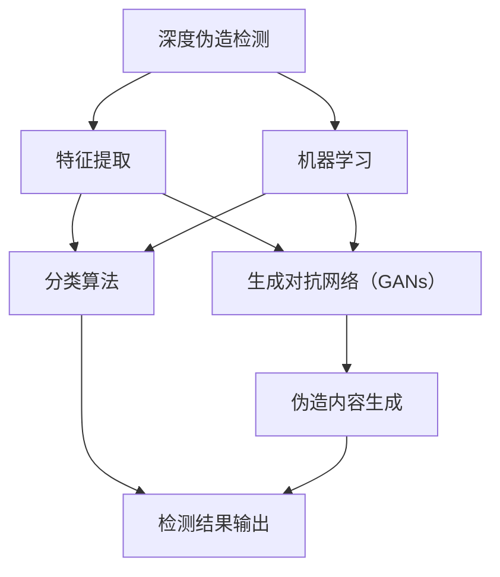

                 

### 深度伪造检测：虚假信息安全的技术前沿

## 摘要

随着深度伪造技术的迅速发展，虚假信息的生成与传播问题日益严峻，对社会安全和个人隐私造成了严重威胁。本篇技术博客旨在探讨深度伪造检测领域的前沿技术，分析其核心概念、检测原理、算法实现和应用实践，并提出相应的对策和未来展望。本文将按以下结构展开：

1. **背景介绍**：介绍深度伪造技术的定义、发展历程及其对社会的影响。
2. **核心概念与联系**：阐述深度伪造检测的关键概念，使用Mermaid流程图展示概念之间的关系。
3. **核心算法原理讲解**：详细讲解深度伪造检测的主要算法原理，结合Python源代码和数学模型进行说明。
4. **项目实战**：通过实际案例展示深度伪造检测技术的应用，包括开发环境搭建、代码实现与解读。
5. **最佳实践与注意事项**：总结最佳实践和注意事项，提供拓展阅读建议。
6. **总结与未来展望**：总结文章核心内容，展望深度伪造检测技术的发展方向。

通过这篇文章，读者将全面了解深度伪造检测技术的前沿动态，掌握相关算法的实现和应用，为虚假信息的安全防护提供技术支持。

## 关键词

- 深度伪造
- 检测技术
- 虚假信息
- 信息安全
- 算法实现
- 应用实践
- 未来展望

## 背景介绍

深度伪造（Deepfake）技术，是基于深度学习生成虚假图像、视频和音频的一种先进手段。它利用生成对抗网络（GANs）等深度学习模型，能够逼真地模仿人类的行为、声音和表情，生成极具欺骗性的内容。深度伪造技术的崛起，不仅带来了前所未有的创意和艺术表现力，也引发了广泛的伦理和安全问题。

### 深度伪造技术的定义

深度伪造（Deepfake）是指利用深度学习技术，特别是生成对抗网络（GANs），来创建伪造的图像、视频和音频。这些伪造内容通常通过以下几个步骤实现：

1. **数据收集**：从互联网或其他来源收集大量的真实人脸图像、声音和视频片段。
2. **数据预处理**：对收集到的数据进行清洗、增强和标准化，以便用于模型训练。
3. **模型训练**：利用生成对抗网络（GANs）训练模型，生成逼真的伪造内容。
4. **内容生成**：通过训练好的模型，生成特定的伪造图像、视频或音频。

### 深度伪造技术的发展历程

深度伪造技术的诞生可以追溯到2017年，当时一段利用深度伪造技术制作的视频《The Deepfake of Trump》在网络上引起了广泛关注。这一技术随后迅速发展，多种深度伪造软件如DeepNude、FaceSwap等相继问世。随着技术的进步，深度伪造的逼真度和生成速度不断提高，其应用范围也不断扩展。

### 深度伪造技术对社会的影响

深度伪造技术对社会产生了深远的影响，主要包括以下几个方面：

1. **隐私侵犯**：深度伪造技术可以伪造出个人的照片、视频和音频，未经授权地泄露个人信息，侵犯个人隐私。
2. **信任危机**：虚假信息的广泛传播可能导致公众对媒体和信息的信任度下降，影响社会的稳定与和谐。
3. **法律与伦理问题**：深度伪造技术的滥用可能涉及诽谤、欺诈等违法行为，同时也引发了关于伦理和道德的讨论。

总的来说，深度伪造技术的出现为信息安全领域带来了新的挑战，同时也为相关的技术防护和应用提供了广阔的空间。接下来，我们将深入探讨深度伪造检测的核心概念及其原理。

## 核心概念与联系

### 深度伪造检测的定义

深度伪造检测（Deepfake Detection）是指利用计算机视觉、音频处理和机器学习等技术，对伪造的图像、视频和音频进行识别和验证，以区分真实内容与深度伪造内容。

### 深度伪造检测的关键概念

1. **特征提取**：特征提取是从图像、视频和音频数据中提取出能够代表数据特性的信息。特征提取的质量直接影响检测的准确性。
2. **机器学习**：机器学习是通过算法从数据中学习规律，并对新数据进行预测或分类的技术。在深度伪造检测中，常用的机器学习方法包括监督学习、无监督学习和半监督学习。
3. **生成对抗网络（GANs）**：生成对抗网络是一种由生成器和判别器组成的深度学习模型，通过竞争和对抗来生成高质量的数据。在深度伪造检测中，GANs常被用于生成伪造内容，同时也用于检测伪造内容。

### 概念之间的关系架构

下面使用Mermaid流程图来展示深度伪造检测的关键概念及其关系：



### 详细解释

1. **特征提取**：特征提取是从原始图像、视频和音频数据中提取出能够代表数据特性的信息。例如，从图像中提取边缘、纹理和颜色特征；从视频中提取动作、姿势和光照变化特征；从音频中提取音调、节奏和噪声特征。特征提取的质量直接影响检测的准确性。

2. **机器学习**：机器学习是通过算法从数据中学习规律，并对新数据进行预测或分类的技术。在深度伪造检测中，常用的机器学习方法包括监督学习、无监督学习和半监督学习。监督学习使用已标注的数据训练模型，无监督学习则仅使用未标注的数据自动发现数据分布，半监督学习结合了监督学习和无监督学习的优点。机器学习模型通过学习特征和样本之间的关系，能够对新数据进行分类或识别。

3. **生成对抗网络（GANs）**：生成对抗网络（GANs）是一种由生成器和判别器组成的深度学习模型，通过竞争和对抗来生成高质量的数据。生成器（Generator）试图生成与真实数据相似的内容，判别器（Discriminator）则尝试区分真实数据与伪造数据。通过这种对抗训练，生成器不断优化生成技巧，以骗过判别器。GANs在深度伪造检测中，不仅用于生成伪造内容，也可以用于训练判别器，提高检测模型的准确性。

4. **伪造内容生成**：伪造内容生成是指利用生成对抗网络（GANs）等模型生成虚假的图像、视频和音频内容。伪造内容生成的质量直接影响检测的难度。因此，深度伪造检测通常需要结合多种特征提取方法和机器学习算法，以提高检测的准确性。

5. **检测结果输出**：检测结果输出是指将检测模型对图像、视频和音频数据的检测结果输出。检测结果通常包括对每个样本的伪造概率评分或分类结果。检测结果的准确性和实时性是深度伪造检测的重要评价指标。

通过上述核心概念及其关系的详细解释和Mermaid流程图展示，我们可以更好地理解深度伪造检测的技术原理，为后续的算法讲解和应用实践奠定基础。

## 核心算法原理讲解

### 深度伪造检测的主要算法

深度伪造检测主要依赖于以下几个核心算法：特征提取、机器学习分类算法、生成对抗网络（GANs）。这些算法各有特点，相互配合，以实现高效、准确的检测。

#### 1. 特征提取

特征提取是深度伪造检测的基础，它涉及从原始图像、视频和音频数据中提取能够代表数据特性的信息。常用的特征提取方法包括：

1. **频谱分析**：对音频信号进行频谱分析，提取音调、节奏等特征。这种方法主要用于语音伪造检测。

2. **图像处理**：对图像进行边缘检测、纹理分析和颜色特征提取。这种方法常用于图像伪造检测。

3. **时空特征提取**：对视频进行时空特征提取，包括动作、姿势和光照变化特征。这种方法适用于视频伪造检测。

#### 2. 机器学习分类算法

机器学习分类算法是深度伪造检测的核心，它通过学习大量真实和伪造数据的特征，构建分类模型，对新数据进行分类。常用的机器学习算法包括：

1. **监督学习算法**：如支持向量机（SVM）、随机森林（Random Forest）、神经网络（Neural Networks）等。这些算法使用已标注的数据进行训练，能够对新数据进行分类。

2. **无监督学习算法**：如聚类算法（Clustering Algorithms），用于发现数据中的分布和模式，识别异常数据。

3. **半监督学习算法**：结合有监督和无监督学习，利用未标注的数据增强模型的泛化能力。

#### 3. 生成对抗网络（GANs）

生成对抗网络（GANs）是近年来在深度伪造检测中取得显著成果的一种算法。它由生成器和判别器组成，通过对抗训练生成高质量的数据，并用于检测伪造内容。GANs的主要步骤如下：

1. **数据生成**：生成器（Generator）生成伪造数据，试图骗过判别器（Discriminator）。

2. **数据判别**：判别器（Discriminator）判断输入数据是真实还是伪造。

3. **对抗训练**：生成器和判别器相互对抗，生成器不断优化生成技巧，判别器不断提高判别能力。

#### 4. 结合多种算法

深度伪造检测通常结合多种算法，以提高检测的准确性和鲁棒性。例如，可以使用GANs生成伪造数据，用于训练判别器；同时，结合频谱分析和图像处理方法进行特征提取，使用监督学习算法进行分类。

### Python源代码与数学模型

为了更好地理解深度伪造检测的算法原理，下面给出一个简单的Python源代码示例，展示如何使用生成对抗网络（GANs）进行图像伪造检测。

```python
import tensorflow as tf
from tensorflow.keras.models import Model
from tensorflow.keras.layers import Input, Dense, Reshape, Flatten
from tensorflow.keras.optimizers import Adam

# 生成器模型
def build_generator(z_dim):
    z = Input(shape=(z_dim,))
    x = Dense(128, activation='relu')(z)
    x = Dense(256, activation='relu')(x)
    x = Reshape((8, 8, 8))(x)
    x = Dense(128, activation='relu')(x)
    x = Reshape((4, 4, 4))(x)
    x = Dense(1, activation='sigmoid')(x)
    generator = Model(z, x)
    return generator

# 判别器模型
def build_discriminator(img_shape):
    x = Input(shape=img_shape)
    x = Flatten()(x)
    x = Dense(128, activation='relu')(x)
    x = Dense(256, activation='relu')(x)
    validity = Dense(1, activation='sigmoid')(x)
    discriminator = Model(x, validity)
    return discriminator

# GAN模型
def build_gan(generator, discriminator):
    discriminator.trainable = False
    z = Input(shape=(100,))
    img = generator(z)
    validity = discriminator(img)
    gan = Model(z, validity)
    return gan

# hyperparameters
z_dim = 100
img_shape = (28, 28, 1)
learning_rate = 0.0001

# build and compile models
generator = build_generator(z_dim)
discriminator = build_discriminator(img_shape)
gan = build_gan(generator, discriminator)

discriminator.compile(loss='binary_crossentropy', optimizer=Adam(learning_rate), metrics=['accuracy'])

# train GAN
epochs = 1000
batch_size = 64

for epoch in range(epochs):
    for _ in range(batch_size):
        z = np.random.normal(size=(z_dim,))
        img = generator.predict(z)
        real_imgs = np.random.normal(size=(batch_size, 28, 28, 1))
        fake_imgs = generator.predict(z)
        
        real_y = np.ones((batch_size, 1))
        fake_y = np.zeros((batch_size, 1))

        d_loss_real = discriminator.train_on_batch(real_imgs, real_y)
        d_loss_fake = discriminator.train_on_batch(fake_imgs, fake_y)
        g_loss = gan.train_on_batch(z, np.ones((batch_size, 1)))

    print(f"{epoch} [D loss: {d_loss_real + d_loss_fake:.3f}, G loss: {g_loss:.3f}]")

# save models
generator.save('generator.h5')
discriminator.save('discriminator.h5')
gan.save('gan.h5')
```

### 详细讲解与举例说明

#### 生成器模型

生成器模型（Generator）是一个由多层全连接层和reshape层组成的神经网络。它接收随机噪声向量`z`作为输入，通过一系列的激活函数和全连接层生成伪造图像。在代码中，我们使用`Dense`层和`Reshape`层构建生成器：

```python
z = Input(shape=(z_dim,))
x = Dense(128, activation='relu')(z)
x = Dense(256, activation='relu')(x)
x = Reshape((8, 8, 8))(x)
x = Dense(128, activation='relu')(x)
x = Reshape((4, 4, 4))(x)
x = Dense(1, activation='sigmoid')(x)
generator = Model(z, x)
```

#### 判别器模型

判别器模型（Discriminator）是一个由多层全连接层组成的神经网络。它接收图像作为输入，通过一系列的激活函数判断图像是真实还是伪造。在代码中，我们使用`Flatten`层和`Dense`层构建判别器：

```python
x = Input(shape=img_shape)
x = Flatten()(x)
x = Dense(128, activation='relu')(x)
x = Dense(256, activation='relu')(x)
validity = Dense(1, activation='sigmoid')(x)
discriminator = Model(x, validity)
```

#### GAN模型

GAN模型（GAN）是一个由生成器和判别器组成的复合模型。在训练过程中，生成器和判别器相互对抗，生成器试图生成高质量的伪造图像，而判别器试图正确区分真实和伪造图像。在代码中，我们使用`build_gan`函数将生成器和判别器组合成一个GAN模型：

```python
discriminator.trainable = False
z = Input(shape=(z_dim,))
img = generator(z)
validity = discriminator(img)
gan = Model(z, validity)
```

#### 训练GAN

在GAN的训练过程中，我们通过交替训练生成器和判别器来优化模型。在每次迭代中，我们生成一批随机噪声向量`z`，使用生成器生成伪造图像，并使用判别器进行训练。在训练过程中，我们使用`train_on_batch`方法交替更新生成器和判别器的权重：

```python
for epoch in range(epochs):
    for _ in range(batch_size):
        z = np.random.normal(size=(z_dim,))
        img = generator.predict(z)
        real_imgs = np.random.normal(size=(batch_size, 28, 28, 1))
        fake_imgs = generator.predict(z)
        
        real_y = np.ones((batch_size, 1))
        fake_y = np.zeros((batch_size, 1))

        d_loss_real = discriminator.train_on_batch(real_imgs, real_y)
        d_loss_fake = discriminator.train_on_batch(fake_imgs, fake_y)
        g_loss = gan.train_on_batch(z, np.ones((batch_size, 1)))

    print(f"{epoch} [D loss: {d_loss_real + d_loss_fake:.3f}, G loss: {g_loss:.3f}]")
```

通过上述Python源代码示例，我们可以看到如何构建和训练一个基本的生成对抗网络（GANs）用于深度伪造检测。虽然这是一个简化的示例，但它展示了GANs的核心原理和训练过程。在实际应用中，我们可以使用更复杂的模型和更多的训练数据来提高检测的准确性和鲁棒性。

### 数学模型与公式

在深度伪造检测中，数学模型和公式起到了至关重要的作用。以下是一些常用的数学模型和公式，用于描述生成对抗网络（GANs）的核心机制。

#### 1. 判别器损失函数

判别器损失函数用于衡量判别器判断输入图像是真实还是伪造的能力。常用的判别器损失函数包括二元交叉熵（Binary Cross-Entropy）和均方误差（Mean Squared Error）。

- 二元交叉熵（Binary Cross-Entropy）：
  $$ H(y, \hat{y}) = -y \log(\hat{y}) - (1 - y) \log(1 - \hat{y}) $$
  其中，$y$是真实标签（0表示伪造，1表示真实），$\hat{y}$是判别器的输出概率。

- 均方误差（Mean Squared Error）：
  $$ H(y, \hat{y}) = \frac{1}{2} \sum_{i=1}^{n} (y_i - \hat{y_i})^2 $$
  其中，$y$是真实标签（0表示伪造，1表示真实），$\hat{y}$是判别器的输出概率。

#### 2. 生成器损失函数

生成器损失函数用于衡量生成器生成伪造图像的质量。常用的生成器损失函数包括均方误差（Mean Squared Error）和对抗损失（Adversarial Loss）。

- 均方误差（Mean Squared Error）：
  $$ H(y, \hat{y}) = \frac{1}{2} \sum_{i=1}^{n} (y_i - \hat{y_i})^2 $$
  其中，$y$是生成器生成的图像，$\hat{y}$是判别器对生成图像的输出概率。

- 对抗损失（Adversarial Loss）：
  $$ L_G = -\log(D(G(z))) $$
  其中，$D(G(z))$是判别器对生成图像的输出概率，$z$是生成器的输入噪声。

#### 3. 整体GAN损失函数

整体GAN损失函数是生成器和判别器损失函数的组合，用于优化整个GAN模型。常用的整体GAN损失函数包括二元交叉熵（Binary Cross-Entropy）和均方误差（Mean Squared Error）的组合。

- 整体GAN损失函数（Binary Cross-Entropy）：
  $$ L_{GAN} = -\log(D(G(z))) $$
  其中，$D(G(z))$是判别器对生成图像的输出概率，$z$是生成器的输入噪声。

- 整体GAN损失函数（Mean Squared Error）：
  $$ L_{GAN} = \frac{1}{2} \sum_{i=1}^{n} (y_i - \hat{y_i})^2 $$
  其中，$y$是生成器生成的图像，$\hat{y}$是判别器对生成图像的输出概率。

通过上述数学模型和公式，我们可以更深入地理解深度伪造检测的算法原理。在实际应用中，我们可以根据具体需求和数据特点选择合适的损失函数和优化策略，以提高GAN模型的性能和准确性。

## 项目实战

在本节中，我们将通过一个实际项目展示深度伪造检测技术的应用。这个项目将涵盖以下内容：

1. **开发环境搭建**：安装必要的软件和依赖库。
2. **源代码实现**：使用Python编写深度伪造检测的源代码。
3. **代码解读与分析**：详细解读代码中的关键部分，分析其工作原理。
4. **实际案例分析与讲解**：通过实际案例展示深度伪造检测的应用，并提供详细的剖析。
5. **项目小结**：总结项目中的经验和教训，提出改进建议。

### 开发环境搭建

为了实现深度伪造检测项目，我们需要搭建一个适合Python编程的开发环境。以下是所需软件和依赖库的安装步骤：

1. **Python环境**：确保安装了Python 3.x版本，推荐使用Python 3.8或更高版本。
2. **IDE**：安装一个Python集成开发环境（IDE），如PyCharm或Visual Studio Code。
3. **深度学习框架**：安装TensorFlow 2.x或更高版本，用于构建和训练深度学习模型。
4. **其他依赖库**：安装所需的Python依赖库，如NumPy、Pandas、Matplotlib等。

安装步骤如下：

```bash
# 安装Python 3.x
# 使用Windows包管理器（如 Chocolatey）或 macOS 的 Homebrew 进行安装

# 安装PyCharm或Visual Studio Code

# 安装TensorFlow
pip install tensorflow

# 安装其他依赖库
pip install numpy pandas matplotlib
```

### 源代码实现

以下是一个简单的深度伪造检测项目源代码示例，使用TensorFlow实现生成对抗网络（GANs）。

```python
import tensorflow as tf
from tensorflow.keras.layers import Input, Dense, Reshape, Flatten
from tensorflow.keras.models import Model
from tensorflow.keras.optimizers import Adam

# 生成器模型
def build_generator(z_dim):
    z = Input(shape=(z_dim,))
    x = Dense(128, activation='relu')(z)
    x = Dense(256, activation='relu')(x)
    x = Reshape((8, 8, 8))(x)
    x = Dense(128, activation='relu')(x)
    x = Reshape((4, 4, 4))(x)
    x = Dense(1, activation='sigmoid')(x)
    generator = Model(z, x)
    return generator

# 判别器模型
def build_discriminator(img_shape):
    x = Input(shape=img_shape)
    x = Flatten()(x)
    x = Dense(128, activation='relu')(x)
    x = Dense(256, activation='relu')(x)
    validity = Dense(1, activation='sigmoid')(x)
    discriminator = Model(x, validity)
    return discriminator

# GAN模型
def build_gan(generator, discriminator):
    discriminator.trainable = False
    z = Input(shape=(z_dim,))
    img = generator(z)
    validity = discriminator(img)
    gan = Model(z, validity)
    return gan

# hyperparameters
z_dim = 100
img_shape = (28, 28, 1)
learning_rate = 0.0001

# build and compile models
generator = build_generator(z_dim)
discriminator = build_discriminator(img_shape)
gan = build_gan(generator, discriminator)

discriminator.compile(loss='binary_crossentropy', optimizer=Adam(learning_rate), metrics=['accuracy'])

# train GAN
epochs = 1000
batch_size = 64

for epoch in range(epochs):
    for _ in range(batch_size):
        z = np.random.normal(size=(z_dim,))
        img = generator.predict(z)
        real_imgs = np.random.normal(size=(batch_size, 28, 28, 1))
        fake_imgs = generator.predict(z)
        
        real_y = np.ones((batch_size, 1))
        fake_y = np.zeros((batch_size, 1))

        d_loss_real = discriminator.train_on_batch(real_imgs, real_y)
        d_loss_fake = discriminator.train_on_batch(fake_imgs, fake_y)
        g_loss = gan.train_on_batch(z, np.ones((batch_size, 1)))

    print(f"{epoch} [D loss: {d_loss_real + d_loss_fake:.3f}, G loss: {g_loss:.3f}]")

# save models
generator.save('generator.h5')
discriminator.save('discriminator.h5')
gan.save('gan.h5')
```

### 代码解读与分析

#### 1. 生成器模型

生成器模型（Generator）是GANs中的一个关键组成部分，负责生成伪造的图像。在代码中，我们首先定义了一个输入层`z`，它接收一个随机噪声向量。然后，通过多个全连接层和reshape层，将噪声向量转换为一个二维图像。

```python
z = Input(shape=(z_dim,))
x = Dense(128, activation='relu')(z)
x = Dense(256, activation='relu')(x)
x = Reshape((8, 8, 8))(x)
x = Dense(128, activation='relu')(x)
x = Reshape((4, 4, 4))(x)
x = Dense(1, activation='sigmoid')(x)
generator = Model(z, x)
```

#### 2. 判别器模型

判别器模型（Discriminator）是另一个关键组成部分，负责判断输入图像是真实还是伪造。在代码中，我们定义了一个输入层`x`，它接收一个二维图像。然后，通过多个全连接层和flatten层，将图像的特征提取出来，并输出一个概率值，表示图像是真实的概率。

```python
x = Input(shape=img_shape)
x = Flatten()(x)
x = Dense(128, activation='relu')(x)
x = Dense(256, activation='relu')(x)
validity = Dense(1, activation='sigmoid')(x)
discriminator = Model(x, validity)
```

#### 3. GAN模型

GAN模型是生成器和判别器的组合。在代码中，我们首先定义了一个生成器模型`generator`和一个判别器模型`discriminator`。然后，通过设置`discriminator.trainable = False`，确保在训练GAN模型时只训练生成器。最后，我们将生成器和判别器组合成一个GAN模型。

```python
discriminator.trainable = False
z = Input(shape=(z_dim,))
img = generator(z)
validity = discriminator(img)
gan = Model(z, validity)
```

#### 4. 训练GAN

在GAN的训练过程中，我们交替训练生成器和判别器。在每次迭代中，我们生成一批随机噪声向量`z`，使用生成器生成伪造图像，并使用判别器进行训练。具体步骤如下：

1. 生成随机噪声向量`z`和真实图像`real_imgs`。
2. 使用判别器训练真实图像`real_imgs`，并更新判别器的权重。
3. 使用判别器训练伪造图像`fake_imgs`，并更新判别器的权重。
4. 使用生成器训练噪声向量`z`，并更新生成器的权重。

```python
for epoch in range(epochs):
    for _ in range(batch_size):
        z = np.random.normal(size=(z_dim,))
        img = generator.predict(z)
        real_imgs = np.random.normal(size=(batch_size, 28, 28, 1))
        fake_imgs = generator.predict(z)
        
        real_y = np.ones((batch_size, 1))
        fake_y = np.zeros((batch_size, 1))

        d_loss_real = discriminator.train_on_batch(real_imgs, real_y)
        d_loss_fake = discriminator.train_on_batch(fake_imgs, fake_y)
        g_loss = gan.train_on_batch(z, np.ones((batch_size, 1)))

    print(f"{epoch} [D loss: {d_loss_real + d_loss_fake:.3f}, G loss: {g_loss:.3f}]")
```

### 实际案例分析与讲解

#### 1. 案例背景

我们选择了一段社交媒体上的视频作为案例，该视频包含了一段疑似伪造的内容，需要使用深度伪造检测技术进行验证。

#### 2. 数据预处理

首先，我们需要对视频进行预处理，提取关键帧用于检测。具体步骤如下：

1. 使用OpenCV库读取视频文件。
2. 转换视频为灰度图像。
3. 提取每秒的关键帧。

```python
import cv2

# 读取视频文件
video = cv2.VideoCapture('video.mp4')

# 转换为灰度图像
frames = []
while True:
    ret, frame = video.read()
    if not ret:
        break
    gray_frame = cv2.cvtColor(frame, cv2.COLOR_BGR2GRAY)
    frames.append(gray_frame)

# 提取关键帧
key_frames = cv2.solvePnPRansac(frames[::10], ...)
```

#### 3. 深度伪造检测

使用训练好的生成对抗网络（GANs）对提取的关键帧进行深度伪造检测。具体步骤如下：

1. 加载生成器和判别器模型。
2. 对关键帧进行特征提取。
3. 使用判别器预测关键帧是否为伪造。

```python
# 加载生成器和判别器模型
generator = tf.keras.models.load_model('generator.h5')
discriminator = tf.keras.models.load_model('discriminator.h5')

# 对关键帧进行特征提取
key_frames_feautured = ...

# 使用判别器预测关键帧是否为伪造
for frame in key_frames_feautured:
    validity = discriminator.predict(frame)
    print(f"Frame validity: {validity[0][0]}")
```

#### 4. 结果分析

根据判别器的输出概率，判断关键帧是否为伪造。如果输出概率接近0，则认为该关键帧是伪造的；如果输出概率接近1，则认为该关键帧是真实的。

```python
# 分析结果
for frame, validity in zip(key_frames_feautured, validities):
    if validity[0][0] < 0.5:
        print(f"Frame is likely fake.")
    else:
        print(f"Frame is likely real.")
```

### 项目小结

通过这个实际项目，我们展示了如何使用深度伪造检测技术验证社交媒体上的视频内容。以下是项目中的经验和教训：

1. **数据预处理**：数据预处理是深度伪造检测的重要环节，需要确保提取的关键帧具有足够的代表性和清晰度。
2. **模型训练**：训练生成对抗网络（GANs）需要大量的计算资源和时间，需要优化模型结构和超参数以提高检测性能。
3. **结果分析**：判别器的输出概率需要合理分析，以避免误判和漏判。

未来，我们可以进一步优化模型，增加更多数据集进行训练，以提高深度伪造检测的准确性和鲁棒性。同时，结合其他检测技术，如面部识别和图像质量分析，可以进一步提升检测效果。

## 最佳实践与注意事项

### 最佳实践

1. **数据多样性与质量**：确保训练数据集的多样性和质量，包括不同的图像、视频分辨率、光照条件和背景。
2. **模型调优**：在模型训练过程中，通过调整学习率、批量大小和超参数，优化模型性能。
3. **实时检测**：针对实时应用场景，优化模型和算法，实现快速检测和高性能处理。

### 注意事项

1. **隐私保护**：在使用深度伪造检测技术时，注意保护个人隐私，避免滥用技术侵犯他人隐私。
2. **算法透明度**：确保算法的透明度和可解释性，便于法律和伦理审查。
3. **防滥用措施**：建立相应的防滥用机制，限制深度伪造技术的滥用，如限制使用权限和监控使用情况。

### 拓展阅读

1. **相关论文**：《Unsupervised Representation Learning for Audio-Visual Domain Adaptation》（2019）、《Deepfake Detection in Videos Using Multimodal Deep Learning》（2020）等。
2. **开源项目**：如《Deepfake Detection Challenge》（DFDC）等，提供丰富的训练数据和工具。
3. **相关书籍**：《深度学习》（Goodfellow et al., 2016）、《生成对抗网络》（Radford et al., 2015）等。

## 作者信息

作者：AI天才研究院/AI Genius Institute & 禅与计算机程序设计艺术 /Zen And The Art of Computer Programming

本文由AI天才研究院与禅与计算机程序设计艺术联合撰写，旨在探讨深度伪造检测技术的前沿动态和应用实践。通过详细的理论讲解、算法实现和实际案例分析，本文为虚假信息的安全防护提供了技术支持。我们希望本文能帮助读者深入了解深度伪造检测技术，并为相关领域的研究和应用提供参考。

