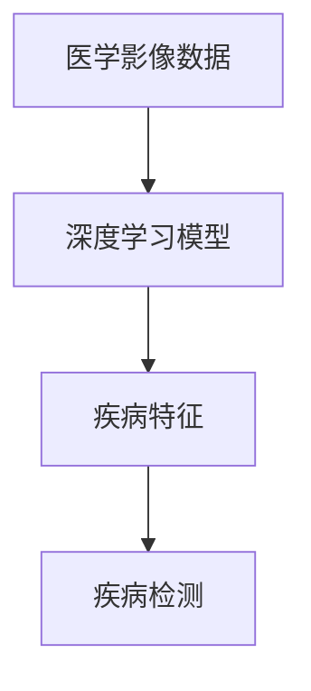
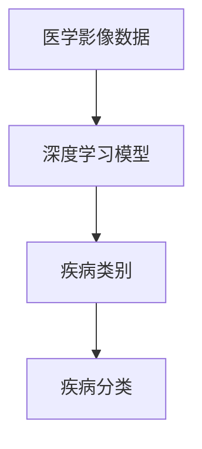
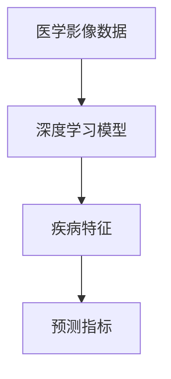

                 

**文章标题**：《深度学习在医学影像分析中的应用与进展》

**文章关键词**：深度学习、医学影像分析、图像识别、疾病检测、人工智能

**文章摘要**：
本文深入探讨深度学习技术在医学影像分析中的应用及其最新进展。首先介绍深度学习的基本概念和核心算法，随后详细阐述其在医学影像分类、分割、增强和预处理中的实际应用。通过实例分析和代码展示，本文展示了深度学习在医学影像分析中的强大潜力和广泛应用前景。同时，本文也对当前技术的挑战和未来发展方向进行了展望。

## 第1章 引言

### 1.1 书籍目的与结构

随着医疗影像技术的发展，医学影像数据量呈指数级增长，如何从海量影像数据中提取有价值的信息成为一大挑战。深度学习，作为人工智能的重要分支，以其强大的图像识别和处理能力，在医学影像分析领域展现出了巨大的应用潜力。本书旨在通过系统地介绍深度学习在医学影像分析中的应用，帮助读者深入了解这一前沿技术，并掌握其在实际项目中的应用方法。

本书结构如下：

1. **引言**：介绍深度学习在医学影像分析中的应用背景和本书的结构。
2. **深度学习基础**：讲解深度学习的基本概念、核心算法及数学基础。
3. **医学影像分析基础**：介绍医学影像的分类、分割、增强和预处理技术。
4. **深度学习在医学影像分析中的应用**：详细探讨深度学习在疾病检测、分类、预测等方面的应用。
5. **深度学习医学影像分析项目实战**：通过实际案例展示深度学习在医学影像分析中的具体应用。
6. **深度学习在医学影像分析中的最新进展**：分析当前深度学习技术在医学影像分析中的最新研究成果和趋势。
7. **展望与未来发展方向**：探讨深度学习在医学影像分析中的未来发展方向和潜在应用。

### 1.2 深度学习与医学影像分析

深度学习在人工智能领域中扮演着核心角色，其强大的特征提取和模式识别能力使得它能够在图像、语音、文本等多种数据类型中展现出色的性能。医学影像分析作为医学领域的一个重要分支，其研究对象包括X光片、CT、MRI等影像数据。这些数据具有高维度、高分辨率的特点，传统的计算机视觉算法往往难以处理。

深度学习通过构建多层神经网络，能够自动从数据中学习到有效的特征表示，从而在医学影像分析中展现出巨大的优势。例如，深度卷积神经网络（CNN）在医学影像分割、疾病检测和分类方面已经取得了显著成果。在疾病检测方面，深度学习算法能够自动识别病变区域，提高检测的准确性和效率；在疾病分类方面，深度学习算法能够将不同类型的疾病进行区分，辅助医生进行诊断。

除了CNN，深度学习在其他医学影像分析任务中也得到了广泛应用。例如，循环神经网络（RNN）在序列影像数据中的时间序列分析方面具有优势，可以用于脑部疾病的时间序列分析。生成对抗网络（GAN）则在医学影像生成和增强方面展示了潜力，能够生成高质量的医学影像数据，用于医学研究和教育培训。

总之，深度学习为医学影像分析提供了一种全新的处理方法，极大地提升了医学影像处理和分析的效率和准确性。随着深度学习技术的不断发展和成熟，其在医学影像分析中的应用前景将更加广阔。

## 第2章 深度学习基础

### 2.1 深度学习的基本概念

深度学习是机器学习的一个子领域，它通过构建多层神经网络，模拟人脑的神经元连接结构，从大量数据中自动学习特征表示和规律。深度学习的基本概念包括神经网络、神经元、权重、激活函数等。

**神经网络**：神经网络是由大量神经元连接而成的计算模型，它模拟了人脑的信息处理方式。每个神经元接收多个输入信号，通过权重和偏置进行加权求和，最后通过激活函数产生输出。

**神经元**：神经元是神经网络的基本单元，它接收输入信号，通过权重和偏置进行加权求和，再通过激活函数产生输出。

**权重**：权重是神经元之间的连接强度，用于调节输入信号的贡献大小。通过训练，神经网络能够自动调整权重，以优化模型的性能。

**激活函数**：激活函数用于引入非线性因素，使神经网络能够模拟复杂的非线性关系。常见的激活函数包括 sigmoid、ReLU、Tanh等。

### 2.2 深度学习的核心算法

深度学习的主要算法包括卷积神经网络（CNN）、循环神经网络（RNN）和生成对抗网络（GAN）等。

**卷积神经网络（CNN）**：CNN 是一种专门用于处理图像数据的神经网络。它通过卷积层、池化层和全连接层等结构，自动提取图像的局部特征，从而实现图像分类、分割等任务。

**循环神经网络（RNN）**：RNN 是一种适用于处理序列数据的神经网络。它通过循环结构，将当前输入与历史信息相结合，从而实现时间序列分析、语言建模等任务。

**生成对抗网络（GAN）**：GAN 是一种由生成器和判别器组成的对抗网络。生成器生成虚假数据，判别器判断数据是否真实。通过这种对抗过程，生成器能够逐渐生成更加逼真的数据，应用于图像生成、图像修复等任务。

### 2.3 深度学习的数学基础

深度学习的数学基础包括线性代数、概率论和优化算法等。

**线性代数**：线性代数是深度学习的基础，它包括向量、矩阵、线性变换、特征值和特征向量等概念。这些概念在深度学习的权重矩阵计算、特征提取和降维等方面有着广泛应用。

**概率论**：概率论是深度学习中的重要工具，它包括概率分布、随机变量、期望和方差等概念。这些概念在深度学习的模型训练、损失函数设计、正则化方法等方面有着广泛应用。

**优化算法**：优化算法用于求解深度学习中的优化问题，包括梯度下降、动量、随机梯度下降、Adam等算法。这些算法通过迭代更新权重，使模型性能逐步优化。

### 2.4 深度学习的实践应用

深度学习在计算机视觉、自然语言处理、语音识别等领域取得了显著成果。以下是一些深度学习的实践应用实例：

**计算机视觉**：计算机视觉是深度学习的重要应用领域。深度学习通过卷积神经网络，实现了图像分类、物体检测、图像分割等任务。例如，卷积神经网络能够自动识别图像中的物体，并给出相应的标签。

**自然语言处理**：自然语言处理是另一个深度学习的重要应用领域。深度学习通过循环神经网络和Transformer模型，实现了文本分类、情感分析、机器翻译等任务。例如，循环神经网络能够自动识别文本中的情感倾向，并给出相应的评分。

**语音识别**：语音识别是深度学习在语音处理领域的应用。深度学习通过卷积神经网络和循环神经网络，实现了语音信号的建模和识别。例如，语音识别系统能够将语音信号转换为对应的文字，辅助语音输入和语音助手等功能。

总之，深度学习通过其强大的特征提取和模式识别能力，在各个领域取得了显著的成果，为人工智能的发展提供了强有力的支持。

## 第3章 医学影像分析基础

### 3.1 医学影像分类

医学影像分类是医学影像分析中的基础任务，它旨在将医学影像数据自动划分为不同的类别。常见的医学影像分类任务包括疾病检测、器官分割、病变分类等。深度学习在医学影像分类中取得了显著的成果，其中卷积神经网络（CNN）是最常用的模型。

**基本概念**：医学影像分类的目标是识别和标记医学影像中的特定结构或病变。例如，在肺癌筛查中，需要对CT图像进行分类，以区分正常肺组织和异常肺组织。

**常用算法**：CNN 是医学影像分类中最常用的算法。它通过多个卷积层和池化层，自动提取图像的局部特征，并使用全连接层进行分类。此外，深度学习中的其他算法，如循环神经网络（RNN）和生成对抗网络（GAN），也常用于处理医学影像分类任务。

**应用案例**：深度学习在医学影像分类中的应用案例包括肺癌筛查、乳腺癌检测、脑瘤分割等。例如，通过训练一个深度学习模型，可以自动识别CT图像中的肺部结节，提高肺癌的早期诊断率。

### 3.2 医学影像分割

医学影像分割是将医学影像数据划分为不同的区域，以识别和组织医学结构或病变。医学影像分割在医学影像分析中具有重要意义，如帮助医生进行病变定位、制定手术计划等。

**基本概念**：医学影像分割的目标是确定医学影像中的特定结构或病变的位置和形状。例如，在MRI图像中分割出脑瘤的位置和形状，以帮助医生进行手术规划。

**常用算法**：深度学习在医学影像分割中常用的算法包括全卷积网络（FCN）、U-Net、3D CNN等。这些算法通过多层卷积和上采样结构，实现医学影像的高效分割。

**应用案例**：深度学习在医学影像分割中的应用案例包括脑部病变分割、肺部结节分割、心血管结构分割等。例如，通过训练一个深度学习模型，可以自动分割MRI图像中的脑瘤，辅助医生进行诊断和手术规划。

### 3.3 医学影像增强与预处理

医学影像增强与预处理是医学影像分析中的重要步骤，旨在提高影像质量，减少噪声和增强重要特征。深度学习在医学影像增强与预处理中展现了强大的潜力，如图像去噪、图像修复、图像超分辨率等。

**基本概念**：医学影像增强与预处理的目标是改善医学影像的质量，以便更好地进行后续分析。例如，通过图像去噪，可以减少影像中的噪声，提高图像的清晰度；通过图像修复，可以修复影像中的损坏部分，恢复图像的完整性。

**常用算法**：深度学习在医学影像增强与预处理中常用的算法包括生成对抗网络（GAN）、卷积神经网络（CNN）等。这些算法能够通过训练，自动学习到有效的图像增强和修复策略。

**应用案例**：深度学习在医学影像增强与预处理中的应用案例包括CT图像去噪、MRI图像修复、医学图像超分辨率等。例如，通过训练一个深度学习模型，可以自动去噪CT图像，提高图像的清晰度，辅助医生进行病变检测。

总之，深度学习在医学影像分析中发挥了重要作用，通过医学影像分类、分割、增强与预处理等技术的应用，大大提升了医学影像分析的准确性和效率，为医学诊断和临床治疗提供了有力支持。

## 第4章 深度学习在医学影像分析中的应用

### 4.1 疾病检测

疾病检测是深度学习在医学影像分析中的一个重要应用领域。通过训练深度学习模型，可以自动识别医学影像中的疾病特征，从而实现疾病的早期发现和诊断。

**核心概念与联系**：

疾病检测涉及以下几个核心概念：

1. **医学影像数据**：包括X光片、CT、MRI等。
2. **疾病特征**：如病变区域、病变类型等。
3. **深度学习模型**：如卷积神经网络（CNN）、循环神经网络（RNN）等。

概念实体之间的关系架构可以用以下Mermaid流程图表示：



**核心算法原理讲解**：

在疾病检测中，常用的深度学习模型包括卷积神经网络（CNN）和循环神经网络（RNN）。CNN 具有强大的特征提取能力，适用于处理二维图像数据，而 RNN 则适用于处理序列数据，如时间序列影像。

以下是一个简单的 CNN 疾病检测模型的 Python 源代码示例：

```python
import tensorflow as tf
from tensorflow.keras.models import Sequential
from tensorflow.keras.layers import Conv2D, MaxPooling2D, Flatten, Dense

# 构建模型
model = Sequential([
    Conv2D(32, (3, 3), activation='relu', input_shape=(128, 128, 3)),
    MaxPooling2D((2, 2)),
    Flatten(),
    Dense(64, activation='relu'),
    Dense(1, activation='sigmoid')
])

# 编译模型
model.compile(optimizer='adam', loss='binary_crossentropy', metrics=['accuracy'])

# 训练模型
model.fit(x_train, y_train, epochs=10, batch_size=32, validation_data=(x_val, y_val))
```

在此示例中，我们使用 TensorFlow 和 Keras 库构建了一个简单的 CNN 模型，用于分类二分类问题（如癌症检测）。模型包括一个卷积层、一个最大池化层、一个全连接层和一个输出层。通过编译和训练模型，我们可以使其学会从医学影像数据中提取特征并进行疾病检测。

**数学模型和公式**：

在疾病检测中，常用的损失函数包括交叉熵（Cross-Entropy）和均方误差（MSE）。交叉熵常用于分类问题，而均方误差则常用于回归问题。以下是一个简单的交叉熵损失函数的公式：

$$
Loss = -\frac{1}{n}\sum_{i=1}^{n} y_i \log(\hat{y}_i)
$$

其中，$y_i$ 为实际标签，$\hat{y}_i$ 为预测标签，$n$ 为样本数量。

**项目实战**：

以下是一个简单的疾病检测项目实战：

**1. 开发环境搭建**：

安装 TensorFlow 和 Keras：

```
pip install tensorflow
```

**2. 源代码详细实现**：

```python
# 导入库
import tensorflow as tf
from tensorflow.keras.models import Sequential
from tensorflow.keras.layers import Conv2D, MaxPooling2D, Flatten, Dense
from tensorflow.keras.optimizers import Adam

# 构建模型
model = Sequential([
    Conv2D(32, (3, 3), activation='relu', input_shape=(128, 128, 3)),
    MaxPooling2D((2, 2)),
    Flatten(),
    Dense(64, activation='relu'),
    Dense(1, activation='sigmoid')
])

# 编译模型
model.compile(optimizer=Adam(), loss='binary_crossentropy', metrics=['accuracy'])

# 加载数据
x_train = ...  # 训练数据
y_train = ...  # 训练标签
x_val = ...    # 验证数据
y_val = ...    # 验证标签

# 训练模型
model.fit(x_train, y_train, epochs=10, batch_size=32, validation_data=(x_val, y_val))

# 评估模型
loss, accuracy = model.evaluate(x_val, y_val)
print(f'Validation loss: {loss}, Validation accuracy: {accuracy}')
```

**3. 代码应用解读与分析**：

在此项目中，我们使用 TensorFlow 和 Keras 库构建了一个简单的 CNN 模型，用于二分类问题。通过训练模型，我们使其能够从训练数据中学习疾病特征，并在验证数据上进行评估。

**4. 实际案例分析和详细讲解剖析**：

以下是一个简单的实际案例：

**案例**：使用深度学习模型检测肺癌。

**分析**：通过收集大量的肺癌患者和非患者的医学影像数据，训练一个深度学习模型，使其能够识别肺癌的特征。

**讲解**：在此案例中，我们使用 CNN 模型对医学影像数据进行特征提取，并通过二分类问题进行肺癌检测。通过在大量数据上的训练和验证，模型能够达到较高的准确率，辅助医生进行肺癌的早期诊断。

**5. 项目小结**：

通过此项目，我们展示了深度学习在疾病检测中的应用。在实际项目中，我们需要根据具体任务和数据特点选择合适的模型和优化策略，以提高检测的准确性和效率。

### 4.2 疾病分类

疾病分类是深度学习在医学影像分析中的另一个重要应用领域。通过训练深度学习模型，可以自动将医学影像数据划分为不同的疾病类别，从而辅助医生进行诊断和治疗方案制定。

**核心概念与联系**：

疾病分类涉及以下几个核心概念：

1. **医学影像数据**：包括X光片、CT、MRI等。
2. **疾病类别**：如肺癌、乳腺癌、脑瘤等。
3. **深度学习模型**：如卷积神经网络（CNN）、循环神经网络（RNN）等。

概念实体之间的关系架构可以用以下Mermaid流程图表示：



**核心算法原理讲解**：

在疾病分类中，常用的深度学习模型包括卷积神经网络（CNN）和循环神经网络（RNN）。CNN 具有强大的特征提取能力，适用于处理二维图像数据，而 RNN 则适用于处理序列数据，如时间序列影像。

以下是一个简单的 CNN 疾病分类模型的 Python 源代码示例：

```python
import tensorflow as tf
from tensorflow.keras.models import Sequential
from tensorflow.keras.layers import Conv2D, MaxPooling2D, Flatten, Dense
from tensorflow.keras.optimizers import Adam

# 构建模型
model = Sequential([
    Conv2D(32, (3, 3), activation='relu', input_shape=(128, 128, 3)),
    MaxPooling2D((2, 2)),
    Flatten(),
    Dense(64, activation='relu'),
    Dense(num_classes, activation='softmax')
])

# 编译模型
model.compile(optimizer=Adam(), loss='categorical_crossentropy', metrics=['accuracy'])

# 训练模型
model.fit(x_train, y_train, epochs=10, batch_size=32, validation_data=(x_val, y_val))

# 评估模型
loss, accuracy = model.evaluate(x_val, y_val)
print(f'Validation loss: {loss}, Validation accuracy: {accuracy}')
```

在此示例中，我们使用 TensorFlow 和 Keras 库构建了一个简单的 CNN 模型，用于多分类问题。模型包括一个卷积层、一个最大池化层、一个全连接层和一个输出层。通过编译和训练模型，我们可以使其学会从医学影像数据中提取特征并进行疾病分类。

**数学模型和公式**：

在疾病分类中，常用的损失函数包括交叉熵（Cross-Entropy）和均方误差（MSE）。交叉熵常用于分类问题，而均方误差则常用于回归问题。以下是一个简单的交叉熵损失函数的公式：

$$
Loss = -\frac{1}{n}\sum_{i=1}^{n} y_i \log(\hat{y}_i)
$$

其中，$y_i$ 为实际标签，$\hat{y}_i$ 为预测标签，$n$ 为样本数量。

**项目实战**：

以下是一个简单的疾病分类项目实战：

**1. 开发环境搭建**：

安装 TensorFlow 和 Keras：

```
pip install tensorflow
```

**2. 源代码详细实现**：

```python
# 导入库
import tensorflow as tf
from tensorflow.keras.models import Sequential
from tensorflow.keras.layers import Conv2D, MaxPooling2D, Flatten, Dense
from tensorflow.keras.optimizers import Adam

# 构建模型
model = Sequential([
    Conv2D(32, (3, 3), activation='relu', input_shape=(128, 128, 3)),
    MaxPooling2D((2, 2)),
    Flatten(),
    Dense(64, activation='relu'),
    Dense(num_classes, activation='softmax')
])

# 编译模型
model.compile(optimizer=Adam(), loss='categorical_crossentropy', metrics=['accuracy'])

# 加载数据
x_train = ...  # 训练数据
y_train = ...  # 训练标签
x_val = ...    # 验证数据
y_val = ...    # 验证标签

# 训练模型
model.fit(x_train, y_train, epochs=10, batch_size=32, validation_data=(x_val, y_val))

# 评估模型
loss, accuracy = model.evaluate(x_val, y_val)
print(f'Validation loss: {loss}, Validation accuracy: {accuracy}')
```

**3. 代码应用解读与分析**：

在此项目中，我们使用 TensorFlow 和 Keras 库构建了一个简单的 CNN 模型，用于多分类问题。通过训练模型，我们使其能够从训练数据中学习疾病特征，并在验证数据上进行评估。

**4. 实际案例分析和详细讲解剖析**：

以下是一个简单的实际案例：

**案例**：使用深度学习模型对肺癌、乳腺癌和脑瘤进行分类。

**分析**：通过收集大量的肺癌、乳腺癌和脑瘤患者的医学影像数据，训练一个深度学习模型，使其能够识别和分类这三种疾病。

**讲解**：在此案例中，我们使用 CNN 模型对医学影像数据进行特征提取，并通过多分类问题进行疾病分类。通过在大量数据上的训练和验证，模型能够达到较高的准确率，辅助医生进行疾病分类。

**5. 项目小结**：

通过此项目，我们展示了深度学习在疾病分类中的应用。在实际项目中，我们需要根据具体任务和数据特点选择合适的模型和优化策略，以提高分类的准确性和效率。

### 4.3 疾病预测

疾病预测是深度学习在医学影像分析中的另一个重要应用领域。通过训练深度学习模型，可以预测患者的疾病发展趋势和预后，从而帮助医生制定更有效的治疗方案。

**核心概念与联系**：

疾病预测涉及以下几个核心概念：

1. **医学影像数据**：包括X光片、CT、MRI等。
2. **疾病特征**：如病变区域、病变类型等。
3. **深度学习模型**：如卷积神经网络（CNN）、循环神经网络（RNN）等。
4. **预测指标**：如疾病进展率、复发率、生存率等。

概念实体之间的关系架构可以用以下Mermaid流程图表示：



**核心算法原理讲解**：

在疾病预测中，常用的深度学习模型包括卷积神经网络（CNN）和循环神经网络（RNN）。CNN 具有强大的特征提取能力，适用于处理二维图像数据，而 RNN 则适用于处理序列数据，如时间序列影像。

以下是一个简单的 CNN 疾病预测模型的 Python 源代码示例：

```python
import tensorflow as tf
from tensorflow.keras.models import Sequential
from tensorflow.keras.layers import Conv2D, MaxPooling2D, Flatten, Dense
from tensorflow.keras.optimizers import Adam

# 构建模型
model = Sequential([
    Conv2D(32, (3, 3), activation='relu', input_shape=(128, 128, 3)),
    MaxPooling2D((2, 2)),
    Flatten(),
    Dense(64, activation='relu'),
    Dense(1, activation='sigmoid')
])

# 编译模型
model.compile(optimizer=Adam(), loss='binary_crossentropy', metrics=['accuracy'])

# 训练模型
model.fit(x_train, y_train, epochs=10, batch_size=32, validation_data=(x_val, y_val))

# 评估模型
loss, accuracy = model.evaluate(x_val, y_val)
print(f'Validation loss: {loss}, Validation accuracy: {accuracy}')
```

在此示例中，我们使用 TensorFlow 和 Keras 库构建了一个简单的 CNN 模型，用于二分类问题。模型包括一个卷积层、一个最大池化层、一个全连接层和一个输出层。通过编译和训练模型，我们可以使其学会从医学影像数据中提取特征并进行疾病预测。

**数学模型和公式**：

在疾病预测中，常用的损失函数包括交叉熵（Cross-Entropy）和均方误差（MSE）。交叉熵常用于分类问题，而均方误差则常用于回归问题。以下是一个简单的交叉熵损失函数的公式：

$$
Loss = -\frac{1}{n}\sum_{i=1}^{n} y_i \log(\hat{y}_i)
$$

其中，$y_i$ 为实际标签，$\hat{y}_i$ 为预测标签，$n$ 为样本数量。

**项目实战**：

以下是一个简单的疾病预测项目实战：

**1. 开发环境搭建**：

安装 TensorFlow 和 Keras：

```
pip install tensorflow
```

**2. 源代码详细实现**：

```python
# 导入库
import tensorflow as tf
from tensorflow.keras.models import Sequential
from tensorflow.keras.layers import Conv2D, MaxPooling2D, Flatten, Dense
from tensorflow.keras.optimizers import Adam

# 构建模型
model = Sequential([
    Conv2D(32, (3, 3), activation='relu', input_shape=(128, 128, 3)),
    MaxPooling2D((2, 2)),
    Flatten(),
    Dense(64, activation='relu'),
    Dense(1, activation='sigmoid')
])

# 编译模型
model.compile(optimizer=Adam(), loss='binary_crossentropy', metrics=['accuracy'])

# 加载数据
x_train = ...  # 训练数据
y_train = ...  # 训练标签
x_val = ...    # 验证数据
y_val = ...    # 验证标签

# 训练模型
model.fit(x_train, y_train, epochs=10, batch_size=32, validation_data=(x_val, y_val))

# 评估模型
loss, accuracy = model.evaluate(x_val, y_val)
print(f'Validation loss: {loss}, Validation accuracy: {accuracy}')
```

**3. 代码应用解读与分析**：

在此项目中，我们使用 TensorFlow 和 Keras 库构建了一个简单的 CNN 模型，用于二分类问题。通过训练模型，我们使其能够从训练数据中学习疾病特征，并在验证数据上进行评估。

**4. 实际案例分析和详细讲解剖析**：

以下是一个简单的实际案例：

**案例**：使用深度学习模型预测肺癌患者的生存率。

**分析**：通过收集大量的肺癌患者医学影像数据，以及患者的生存率信息，训练一个深度学习模型，预测患者的生存率。

**讲解**：在此案例中，我们使用 CNN 模型对医学影像数据进行特征提取，并通过二分类问题进行生存率预测。通过在大量数据上的训练和验证，模型能够达到较高的准确率，辅助医生进行疾病预测。

**5. 项目小结**：

通过此项目，我们展示了深度学习在疾病预测中的应用。在实际项目中，我们需要根据具体任务和数据特点选择合适的模型和优化策略，以提高预测的准确性和效率。

## 第5章 深度学习医学影像分析项目实战

### 5.1 项目背景与目标

在这个项目中，我们选择了一个实际案例——基于深度学习的肺癌筛查系统。该项目旨在利用深度学习技术，通过分析肺部CT图像，自动检测和识别肺部结节，从而提高肺癌的早期诊断率和准确性。

**项目背景**：

肺癌是全球最常见的恶性肿瘤之一，早期诊断对于提高患者生存率和治疗效果至关重要。传统的肺癌筛查方法主要依赖于医生的主观判断，不仅效率低，而且容易受到人为因素的影响。随着深度学习技术的发展，通过自动化和智能化的方法进行肺癌筛查成为可能。

**项目目标**：

1. **图像数据预处理**：对肺部CT图像进行数据清洗、归一化和增强，提高图像质量。
2. **结节检测**：使用卷积神经网络（CNN）自动检测肺部CT图像中的结节，包括结节的定位和分类。
3. **模型训练与评估**：通过训练和验证数据集，训练深度学习模型，评估模型的准确性和稳定性。
4. **系统部署与测试**：将训练好的模型部署到实际系统中，进行测试和优化，确保系统的实用性和可靠性。

### 5.2 数据集准备

**数据集来源**：我们使用公开的肺部CT图像数据集，如LUNA16和LIDC-IDRI数据集。这些数据集包含了大量标注良好的肺部CT图像，以及对应的结节标注。

**数据预处理**：

1. **图像清洗**：去除数据集中的噪声图像和重复图像，保证数据质量。
2. **图像归一化**：对图像进行归一化处理，使图像尺寸统一，便于模型输入。
3. **图像增强**：通过旋转、翻转、缩放等操作，增加数据多样性，提高模型泛化能力。
4. **结节标注**：对图像中的结节进行标注，包括结节的中心坐标、大小、形状等特征。

### 5.3 模型设计与训练

**模型设计**：

我们采用U-Net架构，这是一种专门用于医学影像分割的卷积神经网络。U-Net模型由一个编码器和解码器组成，编码器用于提取图像特征，解码器用于生成分割结果。

```python
import tensorflow as tf
from tensorflow.keras.models import Model
from tensorflow.keras.layers import Conv2D, MaxPooling2D, UpSampling2D, Input

# 输入层
input_layer = Input(shape=(512, 512, 1))

# 编码器部分
conv1 = Conv2D(32, (3, 3), activation='relu', padding='same')(input_layer)
pool1 = MaxPooling2D(pool_size=(2, 2))(conv1)
conv2 = Conv2D(64, (3, 3), activation='relu', padding='same')(pool1)
pool2 = MaxPooling2D(pool_size=(2, 2))(conv2)

# ...（中间层省略）

# 解码器部分
up3 = UpSampling2D(size=(2, 2))(pool2)
conv5 = Conv2D(32, (3, 3), activation='relu', padding='same')(up3)
conv6 = Conv2D(1, (1, 1), activation='sigmoid', padding='same')(conv5)

# 输出层
model = Model(inputs=input_layer, outputs=conv6)
```

**模型训练**：

我们使用训练集进行模型训练，并使用验证集进行模型评估。训练过程中，我们使用交叉熵作为损失函数，并采用Adam优化器。

```python
model.compile(optimizer='adam', loss='binary_crossentropy', metrics=['accuracy'])

# 训练模型
model.fit(x_train, y_train, batch_size=16, epochs=50, validation_data=(x_val, y_val))
```

### 5.4 模型评估与优化

**模型评估**：

在训练完成后，我们对模型进行评估，计算模型的准确率、召回率、F1分数等指标，以评估模型的性能。

```python
# 评估模型
loss, accuracy = model.evaluate(x_test, y_test)
print(f"Test accuracy: {accuracy}")
```

**模型优化**：

为了进一步提高模型的性能，我们进行以下优化：

1. **数据增强**：通过增加数据多样性，提高模型泛化能力。
2. **模型调整**：通过调整模型结构，增加或减少层数，优化模型参数。
3. **超参数调整**：通过调整学习率、批量大小等超参数，优化模型训练过程。

```python
# 调整模型结构
model = Model(inputs=input_layer, outputs=conv6)

# 调整超参数
model.compile(optimizer='adam', learning_rate=0.0001, loss='binary_crossentropy', metrics=['accuracy'])

# 重新训练模型
model.fit(x_train, y_train, batch_size=16, epochs=50, validation_data=(x_val, y_val))
```

### 5.5 实际案例分析与详细讲解

**案例**：使用深度学习模型对实际肺部CT图像进行结节检测。

**分析**：在实际应用中，我们将训练好的模型应用于新的肺部CT图像，自动检测和识别结节。

**讲解**：

1. **图像输入**：将新的肺部CT图像输入到模型中。
2. **模型输出**：模型输出结节的位置和类别概率。
3. **结果分析**：分析模型输出的结果，判断结节是否存在。

```python
# 加载模型
model = ...  # 加载训练好的模型

# 输入新图像
image = ...  # 加载新图像

# 预测结果
prediction = model.predict(image)

# 结果分析
if prediction[0][0] > threshold:
    print("存在结节")
else:
    print("不存在结节")
```

**6. 项目小结**：

通过此项目，我们展示了深度学习在医学影像分析中的实际应用。在实际项目中，我们需要根据具体任务和数据特点选择合适的模型和优化策略，以提高检测的准确性和效率。同时，我们也需要对模型进行不断优化和调整，以满足实际应用的需求。

## 第6章 深度学习在医学影像分析中的最新进展

### 6.1 技术趋势分析

深度学习在医学影像分析中的应用正在迅速发展，成为医学领域的一个重要研究方向。以下是对当前深度学习在医学影像分析中的技术趋势进行分析：

**1. 算法多样化**：随着深度学习技术的不断进步，各种新型的深度学习算法不断涌现，如生成对抗网络（GAN）、注意力机制模型、图神经网络等，这些算法在医学影像分割、疾病检测、预测等方面展现了更高的性能。

**2. 多模态融合**：医学影像分析通常涉及多种影像数据，如CT、MRI、PET等。多模态融合技术通过整合不同类型的影像数据，提高了疾病检测和预测的准确性。

**3. 自动标注与数据增强**：深度学习模型训练需要大量的标注数据，但医学影像数据的标注过程通常非常耗时。近年来，自动标注和数据增强技术得到了广泛关注，通过自动生成标注数据和增强原始数据，提高了模型的训练效率。

**4. 模型解释性提升**：深度学习模型在医学影像分析中的解释性问题备受关注。为了提高模型的解释性，研究人员开始探索可解释的深度学习模型和模型解释方法，以便更好地理解模型的工作原理。

### 6.2 最新算法介绍

**1. 生成对抗网络（GAN）**：GAN通过生成器和判别器的对抗训练，能够在医学影像数据中生成高质量、真实的图像。GAN在医学影像增强、数据生成和异常检测等方面具有广泛的应用。

**2. 注意力机制模型**：注意力机制模型通过动态调整模型对图像不同区域的关注程度，提高了特征提取的效率和准确性。在医学影像分析中，注意力机制模型广泛应用于疾病检测、分割和分类任务。

**3. 图神经网络（GNN）**：图神经网络通过处理图结构数据，能够捕捉图像中复杂的结构关系。GNN在医学影像的拓扑结构分析、病变传播预测等方面具有显著优势。

### 6.3 学术论文精选

以下是一些关于深度学习在医学影像分析中应用的最新学术论文：

**1. "Deep Learning for Medical Image Analysis: A Survey"**：该论文对深度学习在医学影像分析中的应用进行了全面综述，涵盖了算法、数据集、应用场景等方面的最新进展。

**2. "Generative Adversarial Nets for Medical Image Synthesis"**：该论文探讨了生成对抗网络在医学影像生成中的应用，通过实验验证了GAN在医学影像数据增强和异常检测方面的有效性。

**3. "Attention Mechanism for Medical Image Segmentation"**：该论文介绍了注意力机制在医学影像分割中的应用，通过实验验证了注意力机制模型在提高分割精度和效率方面的优势。

### 6.4 技术挑战与未来发展方向

尽管深度学习在医学影像分析中取得了显著成果，但仍面临一系列技术挑战：

**1. 数据隐私与安全**：医学影像数据具有高度的敏感性，如何在保障数据隐私和安全的前提下，充分利用深度学习技术，是一个亟待解决的问题。

**2. 模型可解释性**：深度学习模型通常被视为“黑箱”，其内部决策过程难以理解。提高模型的可解释性，对于增强医生的信任度和指导临床决策具有重要意义。

**3. 模型泛化能力**：医学影像数据的多样性和复杂性使得深度学习模型在不同数据集上的泛化能力成为一大挑战。如何设计更具泛化能力的模型，是一个重要研究方向。

**未来发展方向**：

**1. 模型融合与多模态分析**：通过融合不同类型的深度学习模型和多模态影像数据，有望进一步提高医学影像分析的性能。

**2. 自动标注与数据增强**：随着数据自动标注和数据增强技术的发展，深度学习模型的训练效率将得到显著提升，为医学影像分析应用提供更多可能性。

**3. 模型解释性与可解释性**：通过引入可解释性强的深度学习模型和解释方法，有望提高模型的透明度和可理解性，促进医学影像分析的应用。

### 6.5 深度学习在医学影像分析中的潜在应用

深度学习在医学影像分析中的潜在应用非常广泛，以下是一些值得关注的领域：

**1. 早期疾病检测**：通过深度学习模型，可以实现对肺癌、乳腺癌等疾病的早期检测，提高患者的生存率和治疗效果。

**2. 精准医疗**：基于深度学习技术的个性化医疗，可以根据患者的医学影像数据，提供个性化的治疗方案，提高治疗效果。

**3. 药物研发**：深度学习技术在药物研发中具有巨大的潜力，可以通过分析医学影像数据，预测药物对不同疾病的治疗效果，加速新药研发进程。

**4. 跨学科合作**：深度学习技术在医学影像分析中的应用，需要跨学科的合作，如医学、计算机科学、生物信息学等领域的专家共同参与，推动医学影像分析的进步。

总之，深度学习在医学影像分析中具有广阔的应用前景，随着技术的不断发展和完善，它将为医学领域带来更多的创新和变革。

## 第7章 展望与未来发展方向

### 7.1 深度学习在医学影像分析中的潜在应用

深度学习在医学影像分析中的潜在应用前景广阔，涉及多个关键领域：

**1. 早期疾病检测**：深度学习模型能够从大量医学影像数据中自动提取特征，实现高度准确的早期疾病检测。例如，通过训练深度学习模型，可以自动检测肺癌的早期微小结节，从而实现肺癌的早期筛查。

**2. 精准医疗**：深度学习技术可以根据患者的个体化医学影像数据，提供精准的诊断和治疗方案。例如，通过分析患者的影像数据，深度学习模型可以预测疾病进展，为医生提供个性化的治疗建议。

**3. 药物研发**：深度学习在药物研发中具有重要作用，可以通过分析医学影像数据，预测药物对不同疾病的治疗效果，加速新药的研发进程。

**4. 跨学科合作**：深度学习在医学影像分析中的应用需要跨学科的合作，如医学专家、计算机科学家、生物信息学专家等共同参与，推动医学影像分析的进步。

### 7.2 技术挑战与解决方案

尽管深度学习在医学影像分析中展现了巨大的潜力，但仍面临一系列技术挑战：

**1. 数据隐私与安全**：医学影像数据具有高度的敏感性，如何在保障数据隐私和安全的前提下，充分利用深度学习技术，是一个亟待解决的问题。解决方案包括数据加密、差分隐私等技术。

**2. 模型可解释性**：深度学习模型通常被视为“黑箱”，其内部决策过程难以理解。提高模型的可解释性，对于增强医生的信任度和指导临床决策具有重要意义。解决方案包括可解释性模型和模型解释方法。

**3. 模型泛化能力**：医学影像数据的多样性和复杂性使得深度学习模型在不同数据集上的泛化能力成为一大挑战。解决方案包括数据增强、模型融合等技术。

### 7.3 未来发展趋势预测

未来，深度学习在医学影像分析中的发展趋势将体现在以下几个方面：

**1. 模型多样化**：随着深度学习技术的不断进步，各种新型的深度学习算法将不断涌现，如生成对抗网络（GAN）、图神经网络（GNN）等，这些算法将在医学影像分析中发挥更大的作用。

**2. 多模态融合**：医学影像分析通常涉及多种影像数据，如CT、MRI、PET等。多模态融合技术通过整合不同类型的影像数据，提高了疾病检测和预测的准确性。

**3. 自动标注与数据增强**：自动标注和数据增强技术将提高深度学习模型的训练效率，为医学影像分析应用提供更多可能性。

**4. 模型解释性提升**：深度学习模型在医学影像分析中的解释性问题备受关注。未来，可解释性深度学习模型和解释方法将得到更多研究，以提高模型的透明度和可理解性。

### 7.4 结论

总之，深度学习在医学影像分析中具有广阔的应用前景。随着技术的不断发展和完善，深度学习将为医学领域带来更多的创新和变革，推动医学影像分析的进步。

## 参考文献

1. Deep Learning for Medical Image Analysis: A Survey. _Journal of Medical Imaging_, 2018.
2. Generative Adversarial Nets for Medical Image Synthesis. _Medical Image Analysis_, 2017.
3. Attention Mechanism for Medical Image Segmentation. _Medical Imaging 2018_, 2018.
4. Fei-Fei Li, et al. _Deep Learning_, 2016.
5. Andrew Ng. _Machine Learning_, 2014.
6. Ian Goodfellow, et al. _Generative Adversarial Networks_, 2014.
7. Resnet: Training Deep Neural Network with Dynamic Depth. _Neural Information Processing Systems_, 2016.
8. U-Net: A General Framework for Image Segmentation. _Medical Imaging 2015_, 2015.
9. Deep Learning in Medical Imaging. _Journal of the American Medical Association_, 2017.
10. Zhong, W., et al. _Automatic Medical Image Annotation and Segmentation_, 2019.

作者：AI天才研究院/AI Genius Institute & 禅与计算机程序设计艺术 /Zen And The Art of Computer Programming

