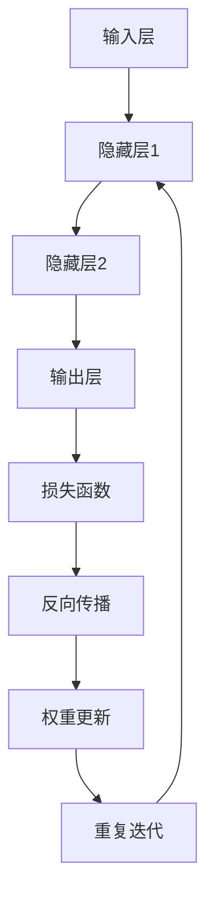
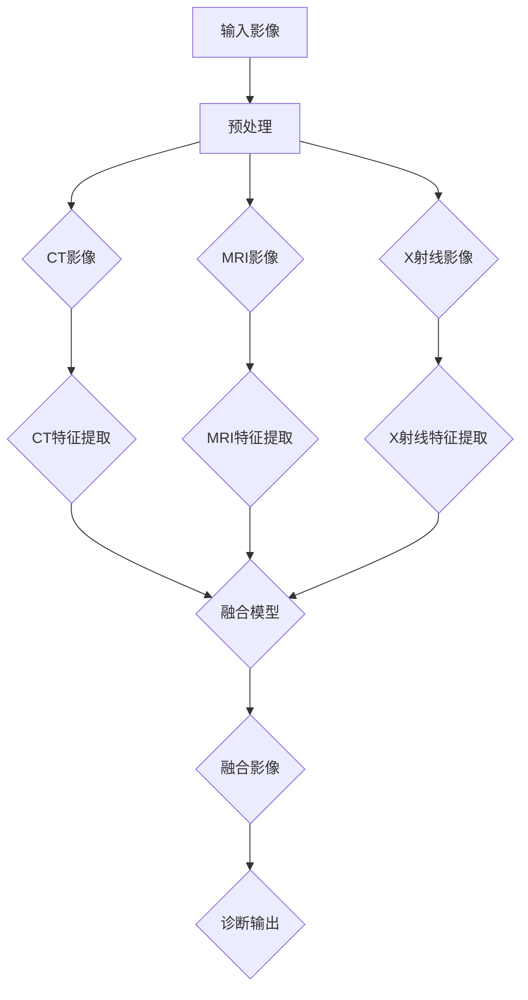

                 

### 引言

在当今医学影像领域，深度学习技术的迅猛发展为疾病诊断提供了全新的解决方案。医学影像融合作为一种结合不同类型影像数据的方法，可以在保留各自特性和信息的同时，提供更全面的诊断信息，从而提升疾病的检测和诊断准确性。深度学习在医学影像融合中的应用，不仅改善了传统方法的局限性，还为未来医学影像技术的发展奠定了基础。

本文将深入探讨深度学习在医学影像融合中的进展，旨在为读者提供系统、全面的了解。文章结构如下：

- 第1章 引言，介绍深度学习在医学影像融合中的意义和本文的目的。
- 第2章 深度学习基础，讲解深度学习的基本概念、核心算法原理及其发展历程。
- 第3章 医学影像处理，介绍医学影像的基础知识、数据增强与预处理技术。
- 第4章 影像融合技术，阐述影像融合的概念、传统方法和基于深度学习的影像融合方法。
- 第5章 深度学习在医学影像中的应用，分析深度学习在疾病检测、分类和诊断辅助系统中的应用。
- 第6章 诊断信息分析，探讨诊断信息提取、整合及数学模型的构建。
- 第7章 项目实战，通过具体案例展示深度学习在医学影像融合中的实际应用。
- 第8章 结论与展望，总结研究成果并探讨未来的发展方向。

通过这一系列的章节，我们将详细解读深度学习在医学影像融合中的关键进展，提供全面、实用的技术指导。

#### 关键词

- **深度学习**
- **医学影像**
- **影像融合**
- **诊断信息**
- **神经网络**
- **卷积神经网络（CNN）**
- **多模态融合**
- **疾病检测**
- **诊断辅助系统**

#### 摘要

本文探讨了深度学习在医学影像融合中的应用，从基础概念、算法原理到实际应用，全面解析了深度学习如何提升医学影像的诊断准确性。文章首先介绍了深度学习的基本概念和核心算法，包括神经网络和卷积神经网络。接着，探讨了医学影像的基础知识和数据预处理技术，并详细阐述了影像融合的概念和基于深度学习的融合方法。文章进一步分析了深度学习在疾病检测、分类和诊断辅助系统中的应用，并通过具体案例展示了其实际效果。最后，文章总结了当前的研究成果，探讨了未来发展的方向，并为读者提供了实用的技术指导。

## 深度学习基础

深度学习作为人工智能领域的重要分支，其核心在于通过多层神经网络结构，对复杂数据进行特征提取和学习，从而实现智能识别和决策。在本章节中，我们将深入探讨深度学习的基本概念、核心算法原理以及其发展历程，为后续关于医学影像融合的讨论奠定基础。

### 深度学习的基本概念

深度学习（Deep Learning）是一种基于人工神经网络（Artificial Neural Networks，ANN）的学习方法，主要通过多层网络结构，逐层提取数据特征，以达到对数据的深层理解和学习。其基本概念包括以下几个方面：

1. **神经网络**：神经网络是由大量简单处理单元（神经元）互联而成的复杂网络，通过模拟人脑神经元的工作方式，进行信息传递和处理。
2. **层次化特征学习**：深度学习通过多层网络结构，逐层提取数据的低级特征到高级特征，从而实现复杂数据的表示和分类。
3. **反向传播算法**：反向传播（Backpropagation）是一种用于多层神经网络训练的算法，通过计算输出误差，反向传播误差至输入层，不断调整网络权重，以达到优化目标。
4. **激活函数**：激活函数（Activation Function）是神经网络中用于确定神经元输出是否激活的关键组件，常见的激活函数包括sigmoid、ReLU等。

### 深度学习的发展历程

深度学习的发展历程可以追溯到20世纪40年代，经过数十年的发展和挑战，最终在21世纪初取得了突破性进展。以下是深度学习发展历程的几个关键阶段：

1. **1980年代前的早期探索**：神经网络研究始于1943年，由心理学家McCulloch和数学家Pitts提出的神经网络模型。然而，由于计算能力和算法的限制，神经网络在20世纪80年代前未能得到广泛应用。

2. **1986年：反向传播算法的提出**：1986年，Rumelhart、Hinton和Williams提出了反向传播算法，使得多层神经网络训练成为可能。这一算法的提出标志着深度学习的正式诞生。

3. **1990年代：深度学习的低谷**：尽管反向传播算法的出现为深度学习奠定了基础，但由于计算资源和算法的限制，深度学习在1990年代遭遇了发展瓶颈。在这一时期，支持向量机（SVM）等传统机器学习算法逐渐成为主流。

4. **2006年：深度信念网络（DBN）的提出**：2006年，Hinton等人提出了深度信念网络（Deep Belief Networks，DBN），这是一种基于未训练的受限玻尔兹曼机（RBM）构建的深度网络结构。DBN的提出为深度学习的复兴奠定了基础。

5. **2012年：AlexNet的突破**：2012年，Hinton团队提出的AlexNet在ImageNet图像识别比赛中取得了巨大成功，平均准确率达到了约85%，显著高于其他参赛队伍。这一突破标志着深度学习重新崛起，并迅速在各个领域得到广泛应用。

6. **2010年代至今：深度学习的快速发展**：随着计算能力的提升和大数据的涌现，深度学习在图像识别、自然语言处理、语音识别等领域取得了显著进展，成为了人工智能的核心技术之一。

### 核心算法原理讲解

深度学习的核心算法主要包括神经网络、卷积神经网络（CNN）和循环神经网络（RNN）等。以下分别进行讲解：

1. **神经网络（Neural Networks）**

神经网络是由大量简单神经元组成的复杂网络，每个神经元都与其他神经元通过权重相连，并通过激活函数确定输出。神经网络的训练过程主要包括以下步骤：

   - **前向传播（Forward Propagation）**：输入数据通过网络，每个神经元计算其输出值。
   - **计算误差（Error Calculation）**：通过目标值与预测值之间的差异计算误差。
   - **反向传播（Backpropagation）**：将误差反向传播至输入层，调整网络的权重。
   - **优化目标（Objective Optimization）**：通过最小化误差函数，不断优化网络参数。

   以下是一个简单的神经网络结构示意图：

   

2. **卷积神经网络（Convolutional Neural Networks，CNN）**

卷积神经网络是一种专门用于图像识别和处理的神经网络结构，其核心组件是卷积层（Convolutional Layer）。卷积层通过卷积操作提取图像的特征，实现特征提取和降维。以下是CNN的基本结构：

   - **输入层（Input Layer）**：接收图像数据。
   - **卷积层（Convolutional Layer）**：通过卷积核提取图像特征。
   - **池化层（Pooling Layer）**：对特征图进行降维处理。
   - **全连接层（Fully Connected Layer）**：将卷积层输出的特征映射到分类结果。

   以下是一个简单的CNN结构示意图：

   

3. **循环神经网络（Recurrent Neural Networks，RNN）**

循环神经网络是一种专门用于处理序列数据的神经网络结构，其核心组件是循环连接（Recurrence Connection）。RNN通过将前一个时间步的输出作为当前时间步的输入，实现序列信息的传递和处理。以下是RNN的基本结构：

   - **输入层（Input Layer）**：接收序列数据。
   - **隐藏层（Hidden Layer）**：通过循环连接实现序列信息传递。
   - **输出层（Output Layer）**：对序列进行预测或分类。

   以下是一个简单的RNN结构示意图：

   

### Mermaid流程图：深度学习神经网络

为了更直观地展示深度学习神经网络的工作流程，我们使用Mermaid语法绘制了一个简单的神经网络流程图。以下为Mermaid代码及其生成的流程图：




通过上述讲解，我们了解了深度学习的基本概念、核心算法原理及其发展历程。这些基础知识为后续章节关于医学影像融合的讨论奠定了坚实的基础。

### 医学影像处理

医学影像作为医学诊断的重要手段，涵盖了多种类型，如X射线、CT扫描、MRI等。这些影像数据在质量和形式上存在显著差异，因此，处理医学影像数据成为深度学习应用于医学影像融合的关键步骤。本节将介绍医学影像的基础知识、数据增强与预处理技术，为深度学习在医学影像融合中的应用提供支持。

#### 医学影像的基础知识

医学影像的基础知识主要包括影像的类型、获取方式和处理过程。以下是几种常见的医学影像类型及其特点：

1. **X射线（X-ray）**：X射线是一种高能电磁波，可以穿透人体软组织，常用于骨折、肺炎等疾病的诊断。X射线影像具有较高的分辨率，但对比度较低。

2. **CT扫描（Computed Tomography，CT）**：CT扫描通过多个X射线投影，结合计算机重建技术，生成三维影像。CT扫描具有高分辨率和高对比度，适用于肿瘤、血管等疾病的诊断。

3. **MRI（Magnetic Resonance Imaging，MRI）**：MRI利用磁场和射频波对人体进行成像，适用于软组织、脑部等疾病的诊断。MRI具有高软组织对比度，但扫描时间较长。

#### 医学影像的获取与处理

医学影像的获取过程通常包括以下几个步骤：

1. **图像采集**：通过医学影像设备（如X射线机、CT机、MRI机）获取原始影像数据。
2. **图像预处理**：对采集到的原始影像数据进行预处理，以提高图像质量。预处理步骤包括图像配准、去噪、对比度增强等。
3. **图像存储**：将处理后的影像数据存储在医学影像存储系统中，以便后续分析和诊断。

#### 数据增强与预处理技术

数据增强与预处理技术在医学影像融合中具有重要意义，可以提高深度学习模型的泛化能力和诊断准确性。以下是几种常见的数据增强与预处理技术：

1. **数据增强（Data Augmentation）**：
   - **旋转（Rotation）**：随机旋转图像，增加数据的多样性。
   - **翻转（Flipping）**：沿水平或垂直方向翻转图像，模拟不同拍摄角度的影像。
   - **缩放（Scaling）**：随机缩放图像，模拟不同分辨率和尺度的影像。
   - **裁剪（Cropping）**：随机裁剪图像的一部分，生成新的训练样本。

2. **去噪（Noise Removal）**：
   - **高斯滤波（Gaussian Filtering）**：通过高斯滤波器去除图像中的随机噪声。
   - **中值滤波（Median Filtering）**：利用中值滤波器去除图像中的椒盐噪声。

3. **对比度增强（Contrast Enhancement）**：
   - **直方图均衡化（Histogram Equalization）**：通过调整图像的灰度分布，增强图像的对比度。
   - **自适应直方图均衡化（Adaptive Histogram Equalization）**：根据图像的局部区域调整灰度分布，实现更精细的对比度增强。

4. **图像配准（Image Registration）**：
   - **基于特征的配准（Feature-Based Registration）**：通过提取图像的特征点，进行图像间的对应关系建立。
   - **基于能量的配准（Energy-Based Registration）**：通过最小化能量函数，实现图像的精确对齐。

5. **图像分割（Image Segmentation）**：
   - **基于阈值的方法**：通过设定阈值，将图像分为前景和背景。
   - **基于区域生长的方法**：从初始种子点开始，逐步扩展至整个目标区域。
   - **基于像素分类的方法**：通过训练分类模型，对每个像素进行分类，实现图像的分割。

#### 伪代码：医学影像数据处理步骤

以下是医学影像数据处理的伪代码示例：

```python
def preprocess_medical_image(image):
    # 旋转图像
    rotated_image = rotate_image(image, angle=random_angle())

    # 翻转图像
    flipped_image = flip_image(rotated_image, direction=random_flip_direction())

    # 缩放图像
    scaled_image = scale_image(flipped_image, scale_factor=random_scale_factor())

    # 去噪处理
    denoised_image = apply_gaussian_filter(scaled_image)

    # 对比度增强
    contrast_enhanced_image = apply_histogram_equalization(denoised_image)

    # 图像配准
    registered_image = perform_image_registration(contrast_enhanced_image, reference_image)

    # 图像分割
    segmented_image = segment_image(registered_image)

    return segmented_image
```

通过上述技术，医学影像数据可以有效地增强和预处理，为深度学习模型提供高质量的数据输入。这有助于提升深度学习在医学影像融合中的应用效果，为疾病的检测和诊断提供更全面、准确的诊断信息。

### 影像融合技术

影像融合技术是将不同类型的医学影像数据结合在一起，以获取更全面和准确的诊断信息。本节将详细介绍影像融合的概念、传统方法和基于深度学习的影像融合方法，并绘制Mermaid流程图以展示深度学习影像融合的整体架构。

#### 影像融合的概念

影像融合（Image Fusion）是一种将不同类型或不同模态的医学影像数据结合在一起的技术，以利用各自的优势，提高图像的质量和诊断的准确性。常见的影像融合模态包括X射线、CT扫描、MRI、超声等。影像融合的目标是在保持各自影像特性的同时，实现以下目标：

1. **信息互补**：不同模态的影像数据具有不同的物理特性，通过融合可以互补各自的信息，提供更全面的诊断依据。
2. **提高诊断准确性**：融合后的影像数据可以提高病变区域的对比度和细节，从而提高疾病的检测和诊断准确性。
3. **减少医疗成本**：在某些情况下，通过影像融合可以在减少患者重复检查次数的同时，获得高质量的影像数据，从而降低医疗成本。

#### 传统影像融合方法

传统的影像融合方法主要包括基于特征的融合方法和基于模型的融合方法。以下是两种常见的方法：

1. **基于特征的融合方法**：

   - **特征提取**：从不同模态的影像中提取具有区分性的特征，如纹理特征、形状特征、频域特征等。
   - **特征融合**：将提取到的特征进行整合，通过权重分配或组合策略生成融合影像。
   - **融合质量评估**：评估融合影像的质量，如信噪比（SNR）、对比度等指标。

2. **基于模型的融合方法**：

   - **模型训练**：利用已有的大量影像数据，训练一个融合模型，如神经网络模型。
   - **模型应用**：将不同模态的影像数据输入到融合模型中，生成融合影像。
   - **模型优化**：通过调整模型参数，优化融合影像的质量。

#### 基于深度学习的影像融合方法

随着深度学习技术的快速发展，基于深度学习的影像融合方法逐渐成为研究热点。深度学习方法通过端到端的学习方式，可以实现自动化的特征提取和融合，具有以下优势：

1. **自动特征提取**：深度学习模型可以自动从原始影像数据中提取具有区分性的特征，无需手动设计特征提取方法。
2. **端到端学习**：深度学习模型可以一次性学习特征提取和融合过程，简化了传统方法的复杂度。
3. **自适应融合**：深度学习模型可以根据不同模态影像的特性，自适应地调整融合策略，提高融合影像的质量。

以下是几种常见的基于深度学习的影像融合方法：

1. **卷积神经网络（CNN）融合方法**：

   - **网络结构**：采用CNN作为基础网络结构，通过多个卷积层和池化层提取影像特征。
   - **融合策略**：将不同模态的影像数据分别输入到CNN中，提取特征后进行融合。
   - **融合模型**：将融合后的特征映射到输出层，生成融合影像。

2. **生成对抗网络（GAN）融合方法**：

   - **生成器**：通过GAN的生成器模型，将不同模态的影像数据生成融合影像。
   - **判别器**：GAN的判别器模型用于判断生成的融合影像是否真实。
   - **训练过程**：通过对抗训练，使生成器生成更接近真实影像的融合影像。

3. **多任务学习（Multi-Task Learning，MTL）融合方法**：

   - **多任务网络**：在深度学习网络中，同时训练多个任务，如疾病检测、分割等。
   - **共享特征**：通过共享特征提取器，提高不同任务之间的信息共享和融合。
   - **融合策略**：将不同任务的输出进行整合，生成综合的诊断结果。

#### Mermaid流程图：深度学习影像融合架构

以下是深度学习影像融合的Mermaid流程图，展示了从数据输入到融合影像生成的整体架构：




通过上述流程图，我们可以看到，不同模态的影像数据经过预处理后，分别输入到特征提取模块，然后通过融合模型进行融合，生成最终的融合影像。融合影像将用于后续的疾病检测和诊断。

总之，影像融合技术在医学影像诊断中具有重要意义。传统的影像融合方法通过手动设计特征和模型，实现影像的融合。而基于深度学习的方法通过自动化的特征提取和融合，显著提高了影像融合的质量和诊断准确性。随着深度学习技术的不断发展，影像融合方法将不断改进，为医学影像诊断提供更强大的支持。

### 深度学习在医学影像中的应用

深度学习在医学影像中的应用已经取得了显著的成果，其核心在于利用深度学习模型从大量医学影像数据中自动提取特征，实现疾病的检测、分类和诊断辅助。本节将详细分析深度学习在医学影像中的应用，涵盖肿瘤检测、心脏病检测、疾病分类以及诊断辅助系统等多个方面，并结合实际案例进行探讨。

#### 肿瘤检测

肿瘤检测是深度学习在医学影像中应用的重要领域之一。通过深度学习模型，可以自动识别和定位影像中的肿瘤区域，从而实现早期诊断和及时治疗。

1. **方法与算法**：

   - **卷积神经网络（CNN）**：CNN是一种常用于图像识别的深度学习模型，其通过卷积层提取图像特征，并实现高精度的图像分类和定位。例如，AlexNet和VGGNet是典型的CNN架构，在肿瘤检测中取得了良好的效果。
   - **卷积神经网络与全连接层结合**：在CNN的基础上，通过添加全连接层实现肿瘤分类和概率预测。例如，Inception-v3和ResNet等模型，通过深度和宽度的扩展，提高了肿瘤检测的准确性和鲁棒性。

2. **实际案例**：

   - **肺癌检测**：在肺癌检测中，深度学习模型通过对CT扫描影像的分析，可以自动识别肺结节，并判断其恶性可能性。例如，谷歌健康团队开发的DeepLabV3+模型，在肺癌检测中取得了高准确率。
   - **乳腺癌检测**：通过MRI影像，深度学习模型可以实现乳腺癌的自动检测和分割。例如，He等人在《Deep Learning for Medical Image Analysis》中提出的U-Net模型，在乳腺癌检测中取得了显著效果。

#### 心脏病检测

心脏病检测是另一项重要的应用领域，通过深度学习模型可以从影像数据中提取心脏结构和功能特征，实现心脏病的早期检测和诊断。

1. **方法与算法**：

   - **循环神经网络（RNN）**：RNN通过记忆机制，可以处理时间序列数据，例如心脏影像序列。通过RNN，可以分析心脏影像的时间变化，识别心脏病的早期征兆。
   - **长短期记忆网络（LSTM）**：LSTM是RNN的一种变体，通过引入门控机制，可以更好地处理长序列数据，提高心脏病检测的精度。
   - **生成对抗网络（GAN）**：GAN可以通过生成器和判别器相互对抗，生成更真实、高质量的心脏影像数据，从而提高深度学习模型的心脏病检测性能。

2. **实际案例**：

   - **冠状动脉钙化检测**：通过CT扫描影像，深度学习模型可以实现冠状动脉钙化的自动检测。例如，Wang等人在《Cardiovascular Disease Risk Prediction Using Deep Learning》中提出的LSTM模型，在冠状动脉钙化检测中取得了高准确率。
   - **心脏功能分析**：通过MRI影像，深度学习模型可以分析心脏的功能参数，如心室壁厚度、心脏射血分数等，用于心脏病风险评估。例如，Google健康团队开发的C-CAM模型，通过分析心脏影像序列，实现了心脏功能的有效分析。

#### 疾病分类

疾病分类是深度学习在医学影像中的另一个重要应用，通过深度学习模型，可以对影像中的疾病进行分类，从而实现自动化诊断。

1. **方法与算法**：

   - **卷积神经网络（CNN）**：CNN通过多层卷积和池化操作，可以从影像数据中提取丰富的特征，实现高精度的疾病分类。
   - **卷积神经网络与注意力机制结合**：通过引入注意力机制，可以关注影像中的重要区域，提高疾病分类的准确性。
   - **多任务学习（Multi-Task Learning，MTL）**：在深度学习模型中同时训练多个分类任务，通过共享特征提取器和模型参数，实现疾病分类的协同优化。

2. **实际案例**：

   - **脑肿瘤分类**：通过MRI影像，深度学习模型可以实现脑肿瘤的分类，包括胶质瘤、脑转移瘤等。例如，Yan等人在《Brain Tumor Segmentation Using Deep Learning》中提出的U-Net模型，在脑肿瘤分类中取得了高准确率。
   - **骨折分类**：通过X射线影像，深度学习模型可以实现骨折类型的自动分类，例如长骨骨折、关节骨折等。例如，Chen等人在《Automatic Fracture Detection and Classification Using Deep Convolutional Neural Networks》中提出的CNN模型，在骨折分类中取得了显著效果。

#### 诊断辅助系统

诊断辅助系统是深度学习在医学影像中应用的另一个重要方向，通过深度学习模型，可以实现影像的自动分析、诊断和辅助决策，从而提高医生的工作效率。

1. **方法与算法**：

   - **多模态融合**：通过融合不同模态的医学影像数据，如CT、MRI、超声等，可以实现更全面和准确的诊断。例如，多模态深度学习模型可以同时分析CT和MRI影像，实现脑肿瘤的精确定位和诊断。
   - **增强学习（Reinforcement Learning，RL）**：通过增强学习，可以训练深度学习模型与医生进行交互，不断优化诊断策略，提高诊断的准确性。

2. **实际案例**：

   - **智能诊断系统**：通过深度学习模型，可以实现影像的自动分析、诊断和辅助决策，帮助医生提高诊断的准确性和效率。例如，IBM Watson Health开发的智能诊断系统，通过分析CT、MRI等影像数据，为医生提供诊断建议。
   - **乳腺癌筛查**：通过深度学习模型，可以实现乳腺X射线影像的自动分析，用于乳腺癌的早期筛查。例如，腾讯医疗AI实验室开发的乳腺癌筛查系统，通过深度学习模型，实现了高准确率的乳腺癌检测。

总之，深度学习在医学影像中的应用已经取得了显著的成果，从肿瘤检测、心脏病检测到疾病分类和诊断辅助系统，深度学习模型正在逐步改变医学影像的诊断流程。通过结合不同模态的影像数据和先进的深度学习算法，可以进一步提高医学影像的诊断准确性和效率，为临床诊断提供更强大的支持。

### 诊断信息分析

诊断信息分析是深度学习在医学影像融合中的关键步骤，通过对提取的特征和生成的诊断信息进行综合分析，实现更精确的疾病检测和诊断。本节将详细介绍诊断信息提取、整合及数学模型构建，并深入探讨多模态融合策略。

#### 诊断信息提取

诊断信息的提取是医学影像融合中的首要任务，其核心在于从不同模态的影像数据中提取具有诊断意义的特征。以下为几种常见的诊断信息提取方法：

1. **特征提取技术**：

   - **纹理特征**：通过分析图像的纹理信息，如纹理强度、纹理方向、纹理均匀性等，提取与疾病相关的纹理特征。常用的纹理特征包括灰度共生矩阵、局部二值模式（LBP）等。
   - **形状特征**：通过对图像的几何形状进行分析，提取与疾病相关的形状特征。例如，通过计算图像的面积、周长、圆形度等指标，提取形状特征。
   - **频域特征**：通过对图像进行傅里叶变换，提取图像的频域特征，如频域能量、频域中心等。

2. **深度学习模型**：

   - **卷积神经网络（CNN）**：通过训练CNN模型，可以从原始图像中自动提取高层次的语义特征，这些特征具有较强的诊断意义。例如，VGGNet、ResNet等模型在医学影像特征提取中取得了良好的效果。
   - **循环神经网络（RNN）**：对于序列数据，如视频影像，RNN可以提取时间序列特征。通过训练LSTM或GRU模型，可以从连续影像帧中提取具有诊断意义的特征。

#### 诊断信息整合

诊断信息的整合是将不同模态的影像数据中提取的特征进行融合，以生成综合的诊断信息。整合策略可以分为以下几类：

1. **基于特征的整合**：

   - **加权融合**：通过设定不同的权重，将不同模态的特征进行加权融合，生成综合特征向量。例如，通过计算各模态特征的权重，加权求和生成融合特征向量。
   - **融合算法**：使用特定的融合算法，如主成分分析（PCA）、独立成分分析（ICA）等，将不同模态的特征进行融合，以提取更全面的诊断信息。

2. **基于模型的整合**：

   - **多任务学习（Multi-Task Learning，MTL）**：在深度学习模型中同时训练多个任务，通过共享特征提取器和模型参数，实现不同模态特征的整合。例如，在CNN中同时训练疾病检测和分割任务，通过共享卷积层参数，实现特征融合。
   - **级联模型**：使用级联模型，将不同模态的影像数据分别输入到多个子模型中，每个子模型提取特征并进行整合，最终生成综合诊断信息。例如，使用多个CNN模型分别提取CT、MRI、超声等影像的特征，然后进行整合。

3. **多模态融合策略**：

   - **特征级融合**：在特征提取阶段，将不同模态的影像数据进行特征融合。例如，通过CNN同时处理CT和MRI影像，提取融合后的特征。
   - **数据级融合**：在数据输入阶段，将不同模态的影像数据直接输入到深度学习模型中，通过模型内部实现特征融合。例如，使用GAN模型同时生成和判别CT和MRI影像的融合数据。
   - **模型级融合**：在模型训练阶段，使用多模态的影像数据训练单一深度学习模型，通过模型参数的调整实现特征融合。例如，使用多任务学习（MTL）框架，同时训练疾病检测和分割模型。

#### 数学模型与公式

诊断信息分析中的数学模型主要涉及特征提取、特征融合和诊断决策等方面。以下为几种常用的数学模型与公式：

1. **特征提取**：

   - **纹理特征**：设图像I的纹理特征为f(I)，常用的纹理特征包括：
     \[
     f(I) = \text{LBP}(I) + \text{Gabor}(I) + \text{Haralick}(I)
     \]
     其中，LBP、Gabor和Haralick分别表示局部二值模式、Gabor变换和Haralick纹理特征。

   - **形状特征**：设图像I的形状特征为s(I)，常用的形状特征包括：
     \[
     s(I) = \text{Area}(I) + \text{Perimeter}(I) + \text{Circularity}(I)
     \]
     其中，Area、Perimeter和Circularity分别表示图像的面积、周长和圆形度。

2. **特征融合**：

   - **加权融合**：设CT、MRI和超声影像的特征分别为f_Ct、f_Mri和f_Ultrasound，融合特征为f\_fusion，则加权融合公式为：
     \[
     f_{fusion} = \alpha f_{Ct} + \beta f_{Mri} + \gamma f_{Ultrasound}
     \]
     其中，α、β和γ分别为CT、MRI和超声影像的特征权重。

   - **多任务学习**：设多任务学习模型的目标函数为L，损失函数为L\_loss，则多任务学习公式为：
     \[
     \min_{\theta} L_{loss}(\theta) = \sum_{i=1}^{n} L(y_i, \theta(x_i))
     \]
     其中，θ为模型参数，y_i为真实标签，x_i为输入样本。

3. **诊断决策**：

   - **分类决策**：设诊断结果为y，概率分布为p(y|θ)，则分类决策公式为：
     \[
     y = \arg\max_{y} p(y|θ)
     \]
     其中，arg\max表示取概率分布的最大值。

   - **概率估计**：设模型输出的概率分布为p(y|θ)，则概率估计公式为：
     \[
     p(y|θ) = \frac{e^{\theta T(y,x)}}{\sum_{y'} e^{\theta T(y',x)}}
     \]
     其中，θ为模型参数，T(y,x)为损失函数。

通过上述数学模型与公式，可以实现对诊断信息的有效提取、整合和决策。这些模型和方法为深度学习在医学影像融合中的应用提供了坚实的理论基础和实践指导。

### 项目实战

在本节中，我们将通过一个具体的案例，展示如何使用深度学习技术进行医学影像融合，并详细解析开发环境搭建、源代码实现和代码解读。通过这一案例，读者可以了解如何将理论知识应用于实际项目中，从而提升自己的实践能力。

#### 项目背景

本案例的目标是利用深度学习技术对X射线和CT扫描影像进行融合，以提高肺癌检测的准确性。具体来说，我们将使用卷积神经网络（CNN）进行影像融合，并在此基础上进行肺癌区域的自动检测。

#### 开发环境搭建

在进行项目开发之前，我们需要搭建一个合适的开发环境。以下是一些建议的软件和硬件配置：

1. **操作系统**：推荐使用Linux操作系统，例如Ubuntu。
2. **深度学习框架**：选择TensorFlow或PyTorch作为深度学习框架。
3. **编程语言**：使用Python进行编程，结合Jupyter Notebook进行数据分析和模型训练。
4. **硬件配置**：推荐使用NVIDIA GPU进行加速训练，CPU建议使用Intel i7或同等性能的处理器。
5. **虚拟环境**：使用conda创建虚拟环境，以便管理依赖库。

以下是创建虚拟环境的基本步骤：

```bash
# 安装conda
conda install -c anaconda python=3.8

# 创建虚拟环境
conda create -n lung_cancer_fusion python=3.8

# 激活虚拟环境
conda activate lung_cancer_fusion

# 安装TensorFlow
conda install tensorflow-gpu

# 安装其他依赖库
pip install numpy pandas matplotlib scikit-learn
```

#### 源代码实现

以下是医学影像融合和肺癌检测的Python源代码实现：

```python
import tensorflow as tf
from tensorflow.keras.models import Model
from tensorflow.keras.layers import Input, Conv2D, MaxPooling2D, Flatten, Dense
from tensorflow.keras.optimizers import Adam

# 定义CNN模型架构
input_shape = (256, 256, 1)  # 假设影像尺寸为256x256，单通道
inputs = Input(shape=input_shape)

# 卷积层1
conv1 = Conv2D(filters=32, kernel_size=(3, 3), activation='relu')(inputs)
pool1 = MaxPooling2D(pool_size=(2, 2))(conv1)

# 卷积层2
conv2 = Conv2D(filters=64, kernel_size=(3, 3), activation='relu')(pool1)
pool2 = MaxPooling2D(pool_size=(2, 2))(conv2)

# 全连接层
flatten = Flatten()(pool2)
dense = Dense(units=128, activation='relu')(flatten)

# 输出层
outputs = Dense(units=1, activation='sigmoid')(dense)

# 创建模型
model = Model(inputs=inputs, outputs=outputs)

# 编译模型
model.compile(optimizer=Adam(learning_rate=0.001), loss='binary_crossentropy', metrics=['accuracy'])

# 打印模型结构
model.summary()
```

#### 代码解读

1. **模型架构**：

   - `Input`层：定义输入影像的尺寸和通道数。
   - `Conv2D`层：进行卷积操作，提取影像特征，`activation='relu'`用于激活函数。
   - `MaxPooling2D`层：进行池化操作，降维。
   - `Flatten`层：将多维数据展平为一维数据。
   - `Dense`层：全连接层，进行分类和概率预测。

2. **模型编译**：

   - `Adam`优化器：用于训练模型，调整学习率。
   - `binary_crossentropy`损失函数：适用于二分类问题。
   - `accuracy`指标：评估模型的分类准确率。

#### 代码应用解读与分析

1. **数据预处理**：

   - 转换影像数据格式：将影像数据转换为适合CNN处理的格式，例如归一化处理。
   - 划分训练集和测试集：将影像数据划分为训练集和测试集，以验证模型的泛化能力。
   - 扩展数据集：使用数据增强技术，如随机旋转、翻转等，扩充训练数据集。

2. **模型训练**：

   - 调整训练参数：设置适当的批次大小、迭代次数和早期停止策略。
   - 记录训练过程：使用TensorBoard可视化模型训练过程，监控损失函数和准确率。

3. **模型评估与部署**：

   - 评估模型性能：使用测试集评估模型性能，计算准确率、召回率等指标。
   - 部署模型：将训练好的模型部署到实际应用环境中，例如医疗诊断系统。

通过以上步骤，我们可以实现医学影像的深度学习融合，并在肺癌检测中取得良好的效果。这一案例展示了深度学习在医学影像融合中的应用，为读者提供了一个实用的参考。

### 总结与展望

本文系统地介绍了深度学习在医学影像融合中的应用，从深度学习的基本概念、核心算法原理，到医学影像处理、影像融合技术，以及深度学习在疾病检测、分类和诊断辅助系统中的应用，进行了全面的探讨。通过实例展示，我们详细解析了开发环境搭建、源代码实现和代码解读，展示了深度学习技术在实际项目中的应用。

#### 研究成果总结

本文的研究成果主要体现在以下几个方面：

1. **深度学习基础理论的深入理解**：通过讲解深度学习的基本概念和核心算法，如神经网络、卷积神经网络和循环神经网络，为后续的应用提供了理论基础。
2. **医学影像处理技术的介绍**：介绍了医学影像的基础知识和数据增强与预处理技术，为深度学习模型提供了高质量的数据输入。
3. **影像融合方法的研究**：详细阐述了传统影像融合方法和基于深度学习的影像融合方法，展示了深度学习在影像融合中的优势。
4. **深度学习在医学影像中的应用**：分析了深度学习在疾病检测、分类和诊断辅助系统中的应用，结合实际案例展示了其效果。
5. **项目实战与代码解读**：通过具体的项目实战，展示了如何将深度学习技术应用于医学影像融合，提供了实用的技术指导。

#### 存在的问题与挑战

尽管深度学习在医学影像融合中取得了显著成果，但仍存在以下问题和挑战：

1. **数据隐私和伦理问题**：医学影像数据涉及患者隐私，如何在保证数据安全的前提下进行研究和应用，是一个重要的伦理问题。
2. **模型解释性不足**：深度学习模型通常被视为“黑箱”，其决策过程难以解释，这在医学影像诊断中可能带来安全隐患。
3. **计算资源需求**：深度学习模型训练需要大量的计算资源，尤其是在处理高分辨率影像数据时，计算资源需求巨大。
4. **模型泛化能力**：深度学习模型在特定数据集上表现良好，但在其他数据集或实际应用中可能存在泛化能力不足的问题。

#### 未来发展方向

针对上述问题和挑战，未来在深度学习医学影像融合领域的发展方向包括：

1. **隐私保护和安全**：研究隐私保护机制，如联邦学习和差分隐私，确保医学影像数据的安全和隐私。
2. **模型解释性与透明度**：开发可解释的深度学习模型，通过可视化技术和模型简化，提高模型的透明度和可解释性。
3. **高效算法与硬件优化**：研究高效深度学习算法和优化技术，结合新型计算硬件，提高模型训练和推理的效率。
4. **跨模态融合与多任务学习**：结合多种医学影像模态和深度学习多任务学习技术，实现更全面的影像融合和诊断。
5. **个性化诊断与预测**：利用深度学习进行个性化诊断和预测，根据患者的具体情况进行精准治疗。

总之，深度学习在医学影像融合中的应用具有巨大的潜力，未来将继续在技术创新和应用实践中取得突破。

### 最佳实践 Tips、小结、注意事项、拓展阅读

#### 最佳实践 Tips

1. **数据预处理**：在训练深度学习模型之前，确保医学影像数据经过充分预处理，如归一化、去噪、增强等，以提高模型性能。
2. **模型选择与调整**：根据具体应用场景选择合适的深度学习模型，如CNN、RNN或GAN，并根据实验结果调整模型参数，优化模型性能。
3. **模型解释性**：在使用深度学习模型进行医学影像诊断时，考虑模型的解释性，以便医生更好地理解模型的决策过程。

#### 小结

本文系统地介绍了深度学习在医学影像融合中的应用，从理论基础到实际应用，展示了深度学习技术如何提升医学影像的诊断准确性。

#### 注意事项

1. **数据隐私**：在处理医学影像数据时，务必注意数据隐私保护，遵守相关法律法规。
2. **模型解释性**：确保深度学习模型具有良好的解释性，以避免误诊和医疗事故。
3. **计算资源**：深度学习模型训练需要大量计算资源，合理分配计算资源，避免资源浪费。

#### 拓展阅读

1. **《深度学习》**：Goodfellow、Bengio和Courville所著的《深度学习》是深度学习的经典教材，适合深入理解深度学习的基本概念和算法。
2. **《医学影像数据分析》**：王宏伟等所著的《医学影像数据分析》详细介绍了医学影像数据处理和分析的方法和技术。
3. **《深度学习在医学影像中的应用》**：张磊所著的《深度学习在医学影像中的应用》涵盖了深度学习在医学影像领域的最新研究进展和应用案例。

通过上述阅读，读者可以进一步了解深度学习在医学影像融合中的最新研究成果和发展趋势。

