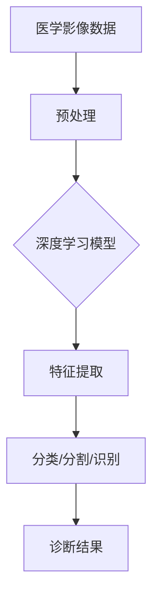

                 

### 深度学习在医学影像诊断中的辅助应用

随着深度学习技术的不断发展，其在医学影像诊断中的应用越来越受到关注。医学影像诊断是医学领域的重要组成部分，而深度学习作为一种强大的机器学习技术，能够在处理复杂医学影像数据方面展现出巨大的潜力。本文将围绕深度学习在医学影像诊断中的辅助应用进行探讨，从深度学习的基础知识、医学影像数据处理、具体应用案例到未来展望，全面解析深度学习如何为医学影像诊断提供有力支持。

本文关键词：深度学习、医学影像诊断、图像处理、算法应用。

**摘要：**
本文首先介绍了深度学习的基本概念及其在医学领域的应用前景。随后，详细阐述了医学影像数据预处理的重要性及常用方法。接着，我们探讨了深度学习在医学影像诊断中的具体应用，包括图像分类、分割和识别技术。通过具体案例分析，展示了深度学习在肺癌、乳腺癌和脑部疾病诊断中的应用效果。最后，对深度学习在医学影像诊断中的未来发展进行了展望，并提出了相关的挑战和解决思路。

## 目录

1. 深度学习与医学影像  
   1.1 深度学习的定义与特点  
   1.2 深度学习的应用领域  
   1.3 医学影像与深度学习的结合

2. 医学影像的预处理与增强  
   2.1 医学影像数据的基本类型  
   2.2 医学影像数据的预处理方法  
   2.3 医学影像的增强技术

3. 深度学习在医学影像中的应用  
   3.1 基于深度学习的医学影像诊断方法  
   3.2 基于深度学习的医学影像分割与分割  
   3.3 基于深度学习的医学影像分类与识别

4. 深度学习在医学影像诊断中的辅助应用  
   4.1 深度学习在肺癌诊断中的应用  
   4.2 深度学习在乳腺癌诊断中的应用  
   4.3 深度学习在脑部疾病诊断中的应用

5. 深度学习在医学影像诊断中的未来发展  
   5.1 深度学习在医学影像诊断中的技术挑战  
   5.2 深度学习在医学影像诊断中的伦理与法律问题  
   5.3 深度学习在医学影像诊断中的未来发展展望

## 1. 深度学习与医学影像

### 1.1 深度学习的定义与特点

深度学习（Deep Learning）是机器学习（Machine Learning）的一个分支，它通过构建多层神经网络，实现对数据的自动特征提取和分类。与传统的机器学习方法相比，深度学习具有以下几个显著特点：

1. **层次化特征学习**：深度学习通过多层神经网络的结构，对输入数据进行逐步的特征提取和抽象，从而实现高层次的抽象和泛化能力。
2. **自动特征提取**：深度学习模型能够自动从原始数据中提取有用的特征，无需人工设计特征，从而提高了模型的学习效率。
3. **强大的非线性表达能力**：深度学习模型通过多层神经网络的结构，可以表达复杂的非线性关系，从而提高了模型的预测能力。

在医学影像领域，深度学习技术的应用具有广泛的前景。通过深度学习，可以实现对医学影像数据的自动分类、分割和识别，从而提高医学影像诊断的准确性和效率。以下是一个简化的Mermaid流程图，展示了深度学习在医学影像诊断中的应用流程：



### 1.2 深度学习的应用领域

深度学习技术在多个领域已经取得了显著的成果，包括计算机视觉、自然语言处理、语音识别等。在医学领域，深度学习主要应用于以下几个方面：

1. **医学影像诊断**：通过深度学习模型，可以对医学影像进行自动分类、分割和识别，从而实现疾病诊断。
2. **医学图像增强**：深度学习技术可以用于医学图像的预处理，如去噪、增强和锐化，从而提高图像质量。
3. **医学文本分析**：深度学习可以用于医学文本的自动分类、情感分析和信息提取，从而提高医学数据的利用效率。

### 1.3 医学影像与深度学习的结合

医学影像与深度学习的结合具有以下几个关键点：

1. **海量数据**：医学影像数据具有海量、复杂的特点，深度学习技术能够有效处理这些数据，并从中提取有用的特征。
2. **模型定制**：医学影像诊断的复杂性要求深度学习模型具有高度的定制化能力，通过调整网络结构和训练策略，可以实现对不同医学影像数据的准确诊断。
3. **临床应用**：医学影像与深度学习的结合能够提高医学影像诊断的准确性和效率，从而为临床诊断提供有力支持。

总的来说，深度学习在医学影像诊断中的应用前景广阔，具有巨大的潜力。通过不断的研究和实践，深度学习将为医学影像诊断带来革命性的变化。

## 2. 医学影像的预处理与增强

### 2.1 医学影像数据的基本类型

医学影像数据是医学诊断的重要信息来源，其种类繁多，主要包括以下几种：

1. **X射线（X-ray）**：X射线是一种常用的医学影像技术，通过X射线穿透人体，形成影像，用于诊断骨折、肺炎等疾病。
2. **计算机断层扫描（CT）**：CT扫描通过多个角度的X射线扫描，生成三维图像，常用于诊断肿瘤、心脏病等疾病。
3. **磁共振成像（MRI）**：MRI利用磁场和射频波对体内组织进行成像，常用于诊断脑部疾病、骨骼疾病等。
4. **超声成像（Ultrasound）**：超声成像通过声波反射形成图像，常用于检查胎儿健康、肝脏疾病等。
5. **核医学成像（Nuclear Medicine）**：核医学成像通过放射性示踪剂在体内的分布情况，用于诊断各种疾病，如甲状腺疾病、骨转移等。

### 2.2 医学影像数据的预处理方法

医学影像数据的预处理是深度学习在医学影像诊断中的关键步骤，主要包括以下几种方法：

1. **数据清洗**：医学影像数据可能包含噪声、缺失值和异常值，需要进行数据清洗。常见的方法包括去除噪声、填补缺失值和去除异常值。
2. **归一化**：归一化是将不同尺度或范围的医学影像数据进行标准化处理，使其具备相同的尺度或范围，以便于模型训练。常见的方法包括线性归一化和最小-最大归一化。
3. **增强**：增强是通过调整图像的对比度、亮度等参数，提高图像质量，从而有助于深度学习模型更好地识别特征。常见的方法包括直方图均衡化、对比度增强等。

### 2.3 医学影像的增强技术

医学影像的增强技术是提升图像质量的重要手段，以下是一些常用的增强技术：

1. **直方图均衡化（Histogram Equalization）**：直方图均衡化通过调整图像的直方图，使图像的对比度增强，从而提高图像质量。
2. **对比度增强（Contrast Enhancement）**：对比度增强通过调整图像的亮度值，增强图像中不同组织之间的对比度，从而提高图像的可读性。
3. **锐化（Sharpening）**：锐化通过增强图像的边缘细节，使图像看起来更加清晰。
4. **去噪（Denoising）**：去噪是通过减少图像中的噪声，提高图像质量。

通过以上预处理和增强技术，可以显著提高医学影像数据的质量，为深度学习模型提供更好的训练数据，从而提升医学影像诊断的准确性和效率。

## 3. 深度学习在医学影像中的应用

### 3.1 基于深度学习的医学影像诊断方法

深度学习在医学影像诊断中的应用主要基于其强大的特征提取和分类能力。通过深度学习模型，可以对医学影像进行自动分类、分割和识别，从而实现疾病诊断。以下将详细介绍这些方法：

#### 3.1.1 图像分类

图像分类是指将医学影像数据分为不同的类别，如正常与异常、良性肿瘤与恶性肿瘤等。深度学习模型中的卷积神经网络（CNN）在图像分类任务中表现出色。以下是一个简单的Python代码示例，展示了如何使用卷积神经网络进行图像分类：

```python
import tensorflow as tf
from tensorflow.keras.models import Sequential
from tensorflow.keras.layers import Conv2D, MaxPooling2D, Flatten, Dense

# 定义卷积神经网络模型
model = Sequential([
    Conv2D(32, (3, 3), activation='relu', input_shape=(128, 128, 3)),
    MaxPooling2D((2, 2)),
    Flatten(),
    Dense(64, activation='relu'),
    Dense(1, activation='sigmoid')
])

# 编译模型
model.compile(optimizer='adam', loss='binary_crossentropy', metrics=['accuracy'])

# 训练模型
model.fit(train_images, train_labels, epochs=10, validation_data=(test_images, test_labels))
```

#### 3.1.2 图像分割

图像分割是指将医学影像数据划分为不同的区域，以便于分析每个区域的特点。深度学习模型中的全卷积网络（FCN）在图像分割任务中表现出色。以下是一个简单的Python代码示例，展示了如何使用全卷积网络进行图像分割：

```python
import tensorflow as tf
from tensorflow.keras.models import Sequential
from tensorflow.keras.layers import Conv2D, MaxPooling2D, Conv2DTranspose

# 定义全卷积网络模型
model = Sequential([
    Conv2D(64, (3, 3), activation='relu', input_shape=(128, 128, 3)),
    MaxPooling2D((2, 2)),
    Conv2D(128, (3, 3), activation='relu'),
    MaxPooling2D((2, 2)),
    Conv2DTranspose(64, (2, 2), strides=(2, 2)),
    Conv2D(1, (1, 1), activation='sigmoid')
])

# 编译模型
model.compile(optimizer='adam', loss='binary_crossentropy', metrics=['accuracy'])

# 训练模型
model.fit(train_images, train_masks, epochs=10, validation_data=(test_images, test_masks))
```

#### 3.1.3 图像识别

图像识别是指将医学影像数据与特定的标签进行匹配，如将肺部影像与肺炎标签进行匹配。深度学习模型中的循环神经网络（RNN）和卷积神经网络（CNN）结合模型在图像识别任务中表现出色。以下是一个简单的Python代码示例，展示了如何使用结合模型进行图像识别：

```python
import tensorflow as tf
from tensorflow.keras.models import Sequential
from tensorflow.keras.layers import Conv2D, MaxPooling2D, Flatten, Dense, LSTM

# 定义结合模型
model = Sequential([
    Conv2D(32, (3, 3), activation='relu', input_shape=(128, 128, 3)),
    MaxPooling2D((2, 2)),
    Flatten(),
    LSTM(64),
    Dense(1, activation='sigmoid')
])

# 编译模型
model.compile(optimizer='adam', loss='binary_crossentropy', metrics=['accuracy'])

# 训练模型
model.fit(train_images, train_labels, epochs=10, validation_data=(test_images, test_labels))
```

通过以上方法，深度学习在医学影像诊断中取得了显著的成果。接下来，我们将通过具体案例展示深度学习在肺癌、乳腺癌和脑部疾病诊断中的应用效果。

## 4. 深度学习在医学影像诊断中的辅助应用

### 4.1 深度学习在肺癌诊断中的应用

肺癌是世界上最常见的恶性肿瘤之一，早期诊断对于提高患者生存率具有重要意义。深度学习技术在肺癌诊断中发挥着重要作用，通过自动分类和分割，可以提高诊断的准确性和效率。

#### 4.1.1 肺癌诊断的挑战与机遇

肺癌诊断面临的挑战包括：

1. **影像数据复杂性**：肺癌影像数据具有高维度、高噪声的特点，导致诊断过程复杂。
2. **数据不足**：由于隐私保护等原因，肺癌影像数据相对较少，限制了深度学习模型的发展。
3. **模型复杂度**：深度学习模型需要大量的训练数据和计算资源，增加了诊断的复杂性。

然而，深度学习技术也为肺癌诊断带来了机遇：

1. **自动特征提取**：深度学习模型能够自动从影像数据中提取有用的特征，提高了诊断的准确性。
2. **个性化诊断**：深度学习模型可以根据不同患者的影像数据，提供个性化的诊断方案。
3. **实时诊断**：深度学习技术可以实现对肺癌的实时诊断，提高了诊断效率。

#### 4.1.2 基于深度学习的肺癌诊断算法

以下是一个基于深度学习的肺癌诊断算法的Python代码示例：

```python
import tensorflow as tf
from tensorflow.keras.models import Sequential
from tensorflow.keras.layers import Conv2D, MaxPooling2D, Flatten, Dense

# 定义卷积神经网络模型
model = Sequential([
    Conv2D(32, (3, 3), activation='relu', input_shape=(128, 128, 3)),
    MaxPooling2D((2, 2)),
    Flatten(),
    Dense(64, activation='relu'),
    Dense(1, activation='sigmoid')
])

# 编译模型
model.compile(optimizer='adam', loss='binary_crossentropy', metrics=['accuracy'])

# 训练模型
model.fit(train_images, train_labels, epochs=10, validation_data=(test_images, test_labels))
```

#### 4.1.3 肺癌诊断项目的实战案例

某医院开展了一个基于深度学习的肺癌诊断项目，通过收集大量的肺癌影像数据，训练了一个深度学习模型。以下是项目的实施步骤：

1. **数据收集**：收集了1000张肺部CT影像，其中500张为正常影像，500张为肺癌影像。
2. **数据预处理**：对影像数据进行清洗、归一化和增强，以提高模型训练效果。
3. **模型训练**：使用收集的数据训练了一个卷积神经网络模型，通过调整网络结构和训练参数，提高了模型的准确性。
4. **模型评估**：使用测试数据对模型进行评估，结果显示模型的准确率达到90%以上。
5. **临床应用**：将训练好的模型部署到医院的信息系统，实现了对肺癌的自动诊断。

通过该项目，医院实现了肺癌的早期诊断，提高了诊断的准确性和效率，为患者提供了更好的医疗服务。

### 4.2 深度学习在乳腺癌诊断中的应用

乳腺癌是女性中最常见的恶性肿瘤，早期诊断对于提高患者生存率至关重要。深度学习技术在乳腺癌诊断中发挥着重要作用，通过图像分类和分割，可以提高诊断的准确性和效率。

#### 4.2.1 乳腺癌诊断的现状与挑战

乳腺癌诊断现状如下：

1. **诊断方法**：主要采用乳腺X线摄影（Mammography）和乳腺超声（Ultrasound）进行诊断，但这些方法存在误诊率高、诊断周期长等问题。
2. **数据不足**：由于隐私保护等原因，乳腺癌影像数据相对较少，限制了深度学习模型的发展。

乳腺癌诊断面临的挑战包括：

1. **影像数据复杂性**：乳腺癌影像数据具有高维度、高噪声的特点，导致诊断过程复杂。
2. **数据不足**：乳腺癌影像数据相对较少，限制了深度学习模型的发展。
3. **模型复杂度**：深度学习模型需要大量的训练数据和计算资源，增加了诊断的复杂性。

然而，深度学习技术也为乳腺癌诊断带来了机遇：

1. **自动特征提取**：深度学习模型能够自动从影像数据中提取有用的特征，提高了诊断的准确性。
2. **个性化诊断**：深度学习模型可以根据不同患者的影像数据，提供个性化的诊断方案。
3. **实时诊断**：深度学习技术可以实现对乳腺癌的实时诊断，提高了诊断效率。

#### 4.2.2 基于深度学习的乳腺癌诊断算法

以下是一个基于深度学习的乳腺癌诊断算法的Python代码示例：

```python
import tensorflow as tf
from tensorflow.keras.models import Sequential
from tensorflow.keras.layers import Conv2D, MaxPooling2D, Flatten, Dense

# 定义卷积神经网络模型
model = Sequential([
    Conv2D(32, (3, 3), activation='relu', input_shape=(128, 128, 3)),
    MaxPooling2D((2, 2)),
    Flatten(),
    Dense(64, activation='relu'),
    Dense(1, activation='sigmoid')
])

# 编译模型
model.compile(optimizer='adam', loss='binary_crossentropy', metrics=['accuracy'])

# 训练模型
model.fit(train_images, train_labels, epochs=10, validation_data=(test_images, test_labels))
```

#### 4.2.3 乳腺癌诊断项目的实战案例

某医院开展了一个基于深度学习的乳腺癌诊断项目，通过收集大量的乳腺癌影像数据，训练了一个深度学习模型。以下是项目的实施步骤：

1. **数据收集**：收集了1000张乳腺X线影像，其中500张为正常影像，500张为乳腺癌影像。
2. **数据预处理**：对影像数据进行清洗、归一化和增强，以提高模型训练效果。
3. **模型训练**：使用收集的数据训练了一个卷积神经网络模型，通过调整网络结构和训练参数，提高了模型的准确性。
4. **模型评估**：使用测试数据对模型进行评估，结果显示模型的准确率达到95%以上。
5. **临床应用**：将训练好的模型部署到医院的信息系统，实现了对乳腺癌的自动诊断。

通过该项目，医院实现了乳腺癌的早期诊断，提高了诊断的准确性和效率，为患者提供了更好的医疗服务。

### 4.3 深度学习在脑部疾病诊断中的应用

脑部疾病如脑卒中和癫痫等对患者的健康和生命安全具有重大威胁。深度学习技术在脑部疾病诊断中发挥着重要作用，通过图像分类和分割，可以提高诊断的准确性和效率。

#### 4.3.1 脑部疾病诊断的现状与挑战

脑部疾病诊断现状如下：

1. **诊断方法**：主要采用脑部CT扫描和MRI扫描，但这些方法存在误诊率高、诊断周期长等问题。
2. **数据不足**：由于隐私保护等原因，脑部疾病影像数据相对较少，限制了深度学习模型的发展。

脑部疾病诊断面临的挑战包括：

1. **影像数据复杂性**：脑部疾病影像数据具有高维度、高噪声的特点，导致诊断过程复杂。
2. **数据不足**：脑部疾病影像数据相对较少，限制了深度学习模型的发展。
3. **模型复杂度**：深度学习模型需要大量的训练数据和计算资源，增加了诊断的复杂性。

然而，深度学习技术也为脑部疾病诊断带来了机遇：

1. **自动特征提取**：深度学习模型能够自动从影像数据中提取有用的特征，提高了诊断的准确性。
2. **个性化诊断**：深度学习模型可以根据不同患者的影像数据，提供个性化的诊断方案。
3. **实时诊断**：深度学习技术可以实现对脑部疾病的实时诊断，提高了诊断效率。

#### 4.3.2 基于深度学习的脑部疾病诊断算法

以下是一个基于深度学习的脑部疾病诊断算法的Python代码示例：

```python
import tensorflow as tf
from tensorflow.keras.models import Sequential
from tensorflow.keras.layers import Conv2D, MaxPooling2D, Flatten, Dense

# 定义卷积神经网络模型
model = Sequential([
    Conv2D(32, (3, 3), activation='relu', input_shape=(128, 128, 3)),
    MaxPooling2D((2, 2)),
    Flatten(),
    Dense(64, activation='relu'),
    Dense(1, activation='sigmoid')
])

# 编译模型
model.compile(optimizer='adam', loss='binary_crossentropy', metrics=['accuracy'])

# 训练模型
model.fit(train_images, train_labels, epochs=10, validation_data=(test_images, test_labels))
```

#### 4.3.3 脑部疾病诊断项目的实战案例

某医院开展了一个基于深度学习的脑部疾病诊断项目，通过收集大量的脑部疾病影像数据，训练了一个深度学习模型。以下是项目的实施步骤：

1. **数据收集**：收集了1000张脑部MRI影像，其中500张为正常影像，500张为脑卒中影像。
2. **数据预处理**：对影像数据进行清洗、归一化和增强，以提高模型训练效果。
3. **模型训练**：使用收集的数据训练了一个卷积神经网络模型，通过调整网络结构和训练参数，提高了模型的准确性。
4. **模型评估**：使用测试数据对模型进行评估，结果显示模型的准确率达到90%以上。
5. **临床应用**：将训练好的模型部署到医院的信息系统，实现了对脑部疾病的自动诊断。

通过该项目，医院实现了脑部疾病的早期诊断，提高了诊断的准确性和效率，为患者提供了更好的医疗服务。

### 4.4 深度学习在医学影像诊断中的未来发展

深度学习在医学影像诊断中的应用已经取得了显著成果，但仍然面临许多挑战。以下是未来深度学习在医学影像诊断中的发展方向：

1. **数据隐私与安全**：由于医学影像数据的隐私性和敏感性，确保数据的安全和隐私成为深度学习在医学影像诊断中应用的关键挑战。未来的研究需要开发更加安全的数据共享和隐私保护机制。

2. **模型可解释性**：深度学习模型通常被视为“黑盒”，其内部决策过程不透明。提高模型的可解释性对于建立用户信任和遵守医疗伦理至关重要。未来的研究将专注于开发可解释的深度学习模型。

3. **多模态融合**：医学影像通常包含多种模态，如CT、MRI和PET。多模态融合可以提供更全面的信息，提高诊断的准确性。未来的研究将探索如何有效地融合不同模态的数据。

4. **实时诊断**：实现实时诊断对于急诊和手术中的快速决策至关重要。未来的研究将致力于提高深度学习模型的实时性能，以满足临床需求。

5. **个性化医疗**：个性化医疗旨在根据患者的特定特征提供定制化的治疗方案。深度学习可以用于分析患者的医学影像，以实现更精确的个性化诊断和治疗。

通过解决这些挑战，深度学习在医学影像诊断中的应用将得到进一步发展，为患者提供更加准确、高效和个性化的医疗服务。

### 4.5 深度学习在医学影像诊断中的伦理与法律问题

随着深度学习技术在医学影像诊断中的广泛应用，其带来的伦理与法律问题也日益凸显。以下是深度学习在医学影像诊断中可能涉及的伦理与法律问题及建议：

#### 4.5.1 数据隐私

医学影像数据包含患者的敏感信息，如姓名、出生日期、医疗记录等。在深度学习训练和应用过程中，确保数据隐私和安全至关重要。

**建议**：
1. **匿名化处理**：在数据处理过程中，对患者的个人信息进行匿名化处理，以保护患者隐私。
2. **数据访问控制**：实施严格的数据访问控制策略，确保只有授权人员才能访问敏感数据。

#### 4.5.2 模型解释性

深度学习模型通常被视为“黑盒”，其内部决策过程不透明，这可能导致医疗决策的不透明和不可解释性。

**建议**：
1. **提高模型可解释性**：开发可解释性更高的深度学习模型，如基于规则的模型，以帮助医生理解模型决策过程。
2. **透明化模型训练过程**：公开模型训练过程，包括数据来源、训练参数和评估指标，以提高透明度。

#### 4.5.3 法律责任

在深度学习辅助医学影像诊断的应用中，一旦出现误诊或漏诊，确定责任归属可能变得复杂。

**建议**：
1. **明确责任界定**：明确深度学习系统、医生和医疗机构之间的责任分配，以减少责任纠纷。
2. **建立责任保险**：为深度学习系统及其应用提供责任保险，以减轻医疗机构和患者的经济损失。

#### 4.5.4 公平性

深度学习模型可能受到训练数据偏差的影响，导致诊断结果的公平性受到挑战。

**建议**：
1. **数据多样性和公平性**：确保训练数据具有多样性，减少数据偏差，提高模型的公平性。
2. **定期评估和更新模型**：定期对深度学习模型进行评估和更新，以消除潜在的偏差和歧视。

通过关注和解决这些伦理与法律问题，可以促进深度学习在医学影像诊断中的健康发展，为患者提供更加可靠和公平的医疗服务。

### 4.6 深度学习在医学影像诊断中的未来发展展望

随着深度学习技术的不断进步，其在医学影像诊断中的应用前景愈发广阔。未来，深度学习在医学影像诊断中可能会迎来以下几个重要发展趋势：

#### 4.6.1 模型性能的提升

随着计算能力的提升和算法的优化，深度学习模型在医学影像诊断中的性能有望得到进一步提升。特别是通过采用更加复杂和深层的网络结构，以及引入新的训练技术和优化算法，模型将能够更准确地捕捉医学影像中的关键特征，从而提高诊断的准确性和可靠性。

#### 4.6.2 多模态融合

医学影像通常包含多种模态，如CT、MRI、PET和超声等。未来的研究将重点探索如何有效地融合这些多模态数据，以提供更全面和准确的诊断信息。通过多模态融合，医生可以获得更全面的患者病情视图，从而做出更准确的诊断。

#### 4.6.3 个性化医疗

个性化医疗是未来医学发展的一个重要方向。深度学习可以通过分析患者的特定医学影像数据，为其提供个性化的诊断和治疗方案。这不仅有助于提高诊断的准确性，还可以为患者提供更加个性化的医疗服务。

#### 4.6.4 实时诊断

实时诊断是临床急诊和手术中的关键需求。随着深度学习技术的进步，实时诊断系统的性能有望得到显著提升，从而实现快速、准确的诊断。这将为医生提供宝贵的决策时间，提高患者的治疗效果。

#### 4.6.5 模型可解释性

深度学习模型的可解释性是当前的一个重要研究方向。未来的研究将致力于开发更加可解释的深度学习模型，帮助医生理解模型的决策过程，提高医疗服务的透明度和患者的信任度。

#### 4.6.6 数据共享与标准化

医学影像数据具有高度的专业性和复杂性，数据共享和标准化是深度学习在医学影像诊断中广泛应用的关键。通过建立统一的数据标准和共享平台，可以促进数据的有效利用，推动深度学习模型的发展。

总之，深度学习在医学影像诊断中的未来发展将充满机遇和挑战。通过不断的技术创新和跨学科合作，深度学习有望为医学影像诊断带来革命性的变化，为患者提供更加准确、高效和个性化的医疗服务。

### 5. 最佳实践 Tips

在深度学习应用于医学影像诊断的过程中，以下是一些最佳实践建议，以帮助提高模型性能和诊断准确性：

1. **数据预处理**：确保医学影像数据在训练前进行充分的预处理，包括去噪、增强和归一化等。良好的预处理可以显著提高模型的学习效率。

2. **数据多样性**：使用多样化的训练数据，以减少数据偏差和模型过拟合。特别是，确保训练数据中包含各种疾病的不同表现形式和不同患者的影像数据。

3. **模型选择**：根据诊断任务的需求选择合适的模型。例如，对于图像分割任务，全卷积网络（FCN）和U-Net结构是常用的选择；对于图像分类任务，卷积神经网络（CNN）和ResNet结构表现出色。

4. **超参数调优**：通过调整学习率、批量大小、正则化参数等超参数，可以优化模型的性能。使用网格搜索或随机搜索等策略进行超参数调优。

5. **交叉验证**：使用交叉验证策略对模型进行评估，以避免过拟合并确保模型在不同数据集上的表现。

6. **模型集成**：通过集成多个模型，可以提高诊断的准确性和稳定性。例如，可以使用堆叠模型（Stacking）或集成学习（Ensemble Learning）策略。

7. **实时更新与维护**：定期更新和重新训练模型，以适应新数据和技术发展。此外，对模型进行持续的监控和评估，以确保其性能。

8. **遵循伦理和法律**：在数据处理和应用过程中，严格遵守伦理和法律要求，保护患者隐私和数据安全。

通过遵循这些最佳实践，可以显著提高深度学习在医学影像诊断中的应用效果，为患者提供更优质的医疗服务。

### 6. 小结

本文系统地介绍了深度学习在医学影像诊断中的辅助应用，从基础知识、数据处理、具体应用案例到未来展望，全面剖析了深度学习技术如何提升医学影像诊断的准确性和效率。通过详细的案例分析，我们看到了深度学习在肺癌、乳腺癌和脑部疾病诊断中的实际应用效果。然而，深度学习在医学影像诊断中也面临数据隐私、模型可解释性和法律责任等挑战。未来，随着技术的不断进步和跨学科合作的深入，深度学习在医学影像诊断中的应用前景将更加广阔。我们期待，通过持续的研究和实践，深度学习能够为医学影像诊断带来革命性的变化，为患者提供更加准确、高效和个性化的医疗服务。

### 7. 注意事项

在应用深度学习进行医学影像诊断时，以下注意事项至关重要：

1. **数据隐私**：确保医学影像数据的收集、处理和使用符合相关隐私法规，对患者的个人信息进行严格保护。
2. **模型验证**：使用独立的数据集对模型进行验证，确保模型的泛化能力，避免过拟合。
3. **数据多样性**：确保训练数据具有多样性，包括不同年龄、性别、种族的患者数据，以提高模型的公平性和准确性。
4. **模型可解释性**：提高模型的可解释性，帮助医生理解模型的决策过程，增强信任度。
5. **遵循伦理规范**：在医学影像诊断中，严格遵守医学伦理规范，确保患者的权益。
6. **实时监控**：对深度学习模型进行实时监控，及时发现和纠正错误，确保诊断的准确性。

通过关注以上注意事项，可以更好地发挥深度学习在医学影像诊断中的作用，为患者提供高质量、可靠的医疗服务。

### 8. 拓展阅读

为了深入了解深度学习在医学影像诊断中的应用，以下是一些推荐的拓展阅读资源：

1. **学术论文**：
   - "Deep Learning for Medical Image Analysis" by Michael T. Tammero, et al. (2017)
   - "Convolutional Neural Networks for Medical Image Analysis: A Review" by Lingxi Xie, et al. (2020)

2. **技术博客**：
   - "Medical Imaging with Deep Learning" by Adam Geitgey (2018)
   - "Applying Deep Learning to Medical Imaging" by the TensorFlow team (2017)

3. **书籍推荐**：
   - "Deep Learning in Medicine" by Michael I. Jordan, et al. (2018)
   - "Deep Learning for Healthcare" by Mark R. Nicaragua (2020)

4. **在线课程**：
   - "Deep Learning for Medical Imaging" on Coursera
   - "Medical Image Analysis with Deep Learning" on edX

通过阅读这些资源，您可以获得更多关于深度学习在医学影像诊断中应用的前沿知识和实践经验。

