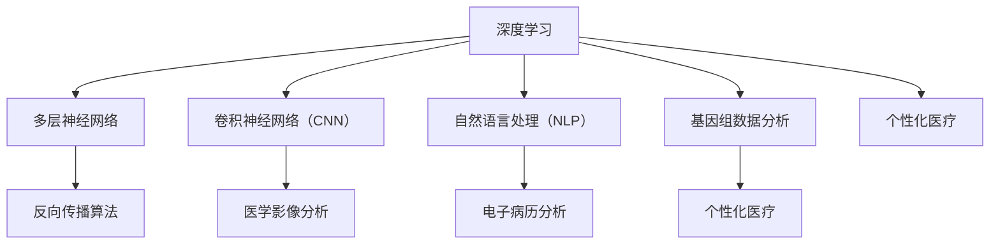

                 

## 引言

深度学习作为人工智能领域的关键技术，近年来在各个行业都展现出了巨大的潜力。医学诊断作为人类健康的重要环节，自然也不可避免地受到了深度学习的冲击。通过深度学习算法，医生和研究人员可以更加准确地分析医学数据，提高诊断的效率和准确性。

### 为什么深度学习在医学诊断中具有重要意义？

深度学习通过模仿人脑的学习方式，对大量数据进行自动学习和模式识别，从而在医学诊断中展现出独特的优势。首先，深度学习可以处理复杂的高维数据，如医学影像和生物序列数据，这些数据往往包含了大量的细微信息，对人类的分析和处理难度极大。其次，深度学习算法可以自动提取数据中的特征，减少人为干预，提高诊断的客观性和一致性。最后，深度学习具有强大的泛化能力，能够对新的病例进行准确的预测和诊断，适应医学领域的不断发展。

### 深度学习在医学诊断中的典型应用

深度学习在医学诊断中的应用范围广泛，涵盖了从图像处理到文本分析等多个方面。其中，最为典型的应用包括：

- **医学影像分析**：通过卷积神经网络（CNN）对医学影像（如X光、CT、MRI）进行自动分析和诊断，提高了早期癌症和其他疾病的检测率。

- **电子病历分析**：利用自然语言处理（NLP）技术，对医生的病历记录进行自动分析和分类，辅助医生进行临床决策。

- **基因组数据分析**：通过深度学习算法，对大量的基因组数据进行解析，帮助医生识别遗传病和个性化治疗方案。

- **药物研发**：利用深度学习预测药物与靶点的相互作用，加速新药的发现过程。

本文将围绕深度学习在医学诊断中的辅助应用，逐步探讨其基础理论、技术实现以及实际应用案例，最终讨论深度学习在医学诊断中面临的挑战与未来发展方向。

## 文章关键词

- 深度学习
- 医学诊断
- 医学影像分析
- 电子病历分析
- 基因组数据
- 卷积神经网络（CNN）
- 自然语言处理（NLP）

## 摘要

本文旨在探讨深度学习在医学诊断中的辅助应用。文章首先介绍了深度学习的基本概念和医学诊断的重要性，随后详细阐述了深度学习在医学影像分析、电子病历分析、基因组数据分析和药物研发等领域的具体应用。通过多个实际案例，文章展示了深度学习在提高医学诊断准确性、效率和个性化医疗方面的潜力。最后，文章讨论了深度学习在医学诊断中面临的挑战，并对未来发展方向进行了展望。

## 背景介绍

深度学习作为一种机器学习的重要分支，其发展可以追溯到20世纪80年代。然而，由于计算能力和数据资源的限制，深度学习在早期的进展较为缓慢。直到近年来，随着计算能力的显著提升和数据资源的丰富，深度学习开始在全球范围内迅速发展，并在各个领域取得了显著的成果。

### 深度学习的发展历程

- **1986年**：Geoff Hinton等人提出了反向传播算法（Backpropagation），这是深度学习的核心算法之一，使得多层神经网络训练成为可能。

- **1990年代**：支持向量机（SVM）和决策树等传统机器学习算法逐渐成为主流，深度学习的研究和应用一度陷入低谷。

- **2006年**：Geoff Hinton等人再次提出深度置信网络（Deep Belief Network，DBN），并在此基础上开发出了深度学习算法，使得深度学习开始重新受到关注。

- **2012年**：AlexNet在ImageNet竞赛中取得了突破性的成绩，将深度学习推向了公众视野。

- **2010年代**：随着GPU的普及和深度学习框架（如TensorFlow和PyTorch）的出现，深度学习在计算机视觉、自然语言处理和其他领域取得了显著进展。

### 深度学习的基本原理

深度学习是一种模拟人脑结构和功能的计算模型，主要通过多层神经网络（Neural Networks）进行数据建模和特征学习。其基本原理包括：

- **神经网络**：神经网络是由大量简单处理单元（神经元）组成的计算模型，每个神经元接收多个输入，并通过权重（weights）和偏置（bias）进行加权求和处理，最后输出一个结果。

- **激活函数**：激活函数用于引入非线性特性，使得神经网络能够模拟复杂的映射关系。常见的激活函数包括Sigmoid、ReLU和Tanh。

- **反向传播算法**：反向传播算法是一种用于训练神经网络的优化算法，通过不断调整网络中的权重和偏置，使得网络输出逐渐接近期望值。

### 深度学习在医学领域的应用

深度学习在医学领域的应用非常广泛，主要包括以下几类：

- **医学影像分析**：深度学习可以自动分析医学影像，如X光、CT、MRI等，帮助医生诊断疾病。例如，通过卷积神经网络（CNN）可以实现肺癌、乳腺癌等早期癌症的自动检测。

- **电子病历分析**：深度学习可以处理和分析大量的电子病历数据，辅助医生进行诊断和预测。例如，自然语言处理（NLP）技术可以用于自动提取病历中的关键信息，帮助医生进行临床决策。

- **基因组数据分析**：深度学习可以对大量的基因组数据进行解析，识别与疾病相关的基因突变和遗传模式。这对于个性化医疗和疾病预防具有重要意义。

- **药物研发**：深度学习可以预测药物与靶点的相互作用，加速新药的发现过程。例如，通过深度学习算法可以发现潜在的药物靶点，提高药物研发的效率。

综上所述，深度学习在医学领域具有广泛的应用前景和巨大的潜力，通过不断的技术创新和实际应用，有望为医学诊断和疾病治疗带来革命性的变革。

## 核心概念与联系

在深入探讨深度学习在医学诊断中的应用之前，我们需要明确一些核心概念，并分析它们之间的联系。以下是几个关键概念及其相互关系：

### 深度学习与医学影像

- **深度学习**：深度学习是一种通过多层神经网络进行数据建模和特征学习的算法。其核心思想是模仿人脑的结构和功能，通过训练自动提取数据中的特征，实现复杂模式的识别。

- **医学影像**：医学影像包括X光、CT、MRI等，它们是医生诊断疾病的重要工具。医学影像数据具有高维、高分辨率和复杂的结构，适合用深度学习算法进行处理。

- **联系**：深度学习算法可以自动分析医学影像，提取其中的特征，如病灶的位置、形态和密度。通过卷积神经网络（CNN）等深度学习模型，医生可以更加准确地诊断疾病，提高诊断的效率和准确性。

### 自然语言处理（NLP）与电子病历

- **自然语言处理（NLP）**：NLP是一种让计算机理解和处理自然语言的技术。它包括文本分类、实体识别、情感分析等任务，广泛应用于语音识别、机器翻译等领域。

- **电子病历**：电子病历（EHR）是医疗记录的数字化形式，包含患者的基本信息、病史、检查结果、治疗方案等。这些信息通常以自然语言的形式存在，难以被计算机直接处理。

- **联系**：NLP技术可以用于分析和理解电子病历中的自然语言文本，提取关键信息，如诊断结果、药物名称和治疗方案。这有助于医生进行临床决策，提高医疗服务的质量和效率。

### 基因组数据分析与深度学习

- **基因组数据**：基因组数据包含个体的基因序列信息，是研究遗传病和个性化医疗的重要资源。基因组数据通常以序列形式存在，具有高维和复杂数据结构。

- **深度学习**：深度学习算法可以自动处理和分析基因组数据，提取特征，识别与疾病相关的基因突变和遗传模式。

- **联系**：深度学习与基因组数据的结合可以用于疾病预测、风险评估和个性化医疗。通过深度学习模型，研究人员可以更准确地识别疾病相关的基因，为疾病的治疗和预防提供科学依据。

### 深度学习与个性化医疗

- **个性化医疗**：个性化医疗是一种根据患者的个体差异（如基因、环境、生活习惯等）制定个性化治疗方案的方法。

- **深度学习**：深度学习可以通过分析大量患者数据，识别出与疾病相关的特征，为个性化医疗提供科学依据。

- **联系**：深度学习与个性化医疗的结合可以实现个性化诊断和治疗方案的设计，提高医疗的精准性和有效性。

### 核心概念实体之间的关系架构

为了更清晰地展示这些核心概念之间的联系，可以使用Mermaid流程图进行描述：



通过这个Mermaid流程图，我们可以清晰地看到深度学习与医学影像、电子病历、基因组数据以及个性化医疗之间的联系，这为我们进一步探讨深度学习在医学诊断中的应用奠定了基础。

### 深度学习的基本算法原理

在深入探讨深度学习在医学诊断中的应用之前，了解深度学习的基本算法原理是非常重要的。本文将首先介绍卷积神经网络（CNN）的基本原理，然后详细讲解反向传播算法（Backpropagation），并结合Python源代码进行说明。

#### 卷积神经网络（CNN）

卷积神经网络（Convolutional Neural Network，CNN）是一种专门用于处理图像数据的深度学习模型。其核心思想是通过卷积操作和池化操作逐步提取图像中的特征，从而实现图像分类、目标检测等任务。

1. **卷积操作**：
   卷积操作是CNN中最基本的操作之一，通过在图像上滑动一个卷积核（一个小的滤波器）并计算局部特征图，从而提取图像中的纹理和结构信息。卷积操作的公式如下：

   $$
   \text{output}(i, j) = \sum_{m=1}^{M} \sum_{n=1}^{N} \text{weight}(m, n) \times \text{input}(i - m + 1, j - n + 1) + \text{bias}
   $$

   其中，output表示输出特征图，input表示输入图像，weight表示卷积核的权重，bias表示偏置。

2. **池化操作**：
   池化操作用于减少特征图的维度和参数数量，同时保持重要特征。常见的池化操作包括最大池化和平均池化。最大池化选择每个局部区域中的最大值，而平均池化则计算局部区域的平均值。

   $$
   \text{pool}(i, j) = \begin{cases}
   \frac{1}{K} \sum_{m=1}^{K} \sum_{n=1}^{K} \text{input}(i + m - 1, j + n - 1) & \text{平均池化} \\
   \max \left( \text{input}(i + m - 1, j + n - 1) \right) & \text{最大池化}
   \end{cases}
   $$

   其中，pool表示输出特征图，input表示输入图像，K表示池化窗口的大小。

3. **卷积神经网络结构**：
   CNN通常由多个卷积层、池化层和全连接层组成。卷积层用于提取特征，池化层用于降维和增强特征，全连接层用于分类和回归。

#### 反向传播算法（Backpropagation）

反向传播算法是深度学习训练过程中最重要的算法之一，用于计算网络中的梯度并更新权重。其基本思想是将输出误差反向传播到输入层，逐步计算每个层的梯度。

1. **前向传播**：
   在前向传播过程中，输入数据通过网络逐层传递，每个层的输出通过激活函数和卷积/池化操作进行处理，最终得到网络的输出。

2. **计算损失**：
   计算损失函数（如均方误差MSE或交叉熵损失）的值，衡量网络输出与真实值之间的差距。

3. **反向传播**：
   从输出层开始，将误差反向传播到输入层，计算每个层的梯度。具体步骤如下：

   - **计算输出层梯度**：
     $$
     \frac{\partial \text{loss}}{\partial \text{output}} = -\frac{1}{m} \sum_{i=1}^{m} \frac{\partial \text{output}_i}{\partial \text{output}} \cdot \text{label}_i
     $$

   - **计算隐藏层梯度**：
     对于每个隐藏层，计算前一层输出与当前层权重的乘积，并累加到当前层的梯度上。

     $$
     \frac{\partial \text{loss}}{\partial \text{weight}} = \sum_{i=1}^{n} \frac{\partial \text{loss}}{\partial \text{output}_i} \cdot \text{output}_{i-1}
     $$

     $$
     \frac{\partial \text{loss}}{\partial \text{bias}} = \sum_{i=1}^{n} \frac{\partial \text{loss}}{\partial \text{output}_i}
     $$

   - **权重更新**：
     使用梯度下降（Gradient Descent）或其变体（如Adam优化器）更新权重和偏置，以减少损失函数的值。

     $$
     \text{weight} \leftarrow \text{weight} - \alpha \cdot \frac{\partial \text{loss}}{\partial \text{weight}}
     $$

     $$
     \text{bias} \leftarrow \text{bias} - \alpha \cdot \frac{\partial \text{loss}}{\partial \text{bias}}
     $$

   其中，$\alpha$为学习率。

#### Python源代码示例

以下是一个简单的CNN模型，用于手写数字识别（MNIST数据集）的Python代码示例，展示了卷积层、池化层和全连接层的应用，以及反向传播算法的基本流程：

```python
import tensorflow as tf
from tensorflow.keras import layers
from tensorflow.keras.datasets import mnist
import numpy as np

# 加载MNIST数据集
(x_train, y_train), (x_test, y_test) = mnist.load_data()
x_train = x_train.astype("float32") / 255.0
x_test = x_test.astype("float32") / 255.0
y_train = np.eye(10)[y_train]
y_test = np.eye(10)[y_test]

# 构建CNN模型
model = tf.keras.Sequential([
    layers.Conv2D(32, (3, 3), activation='relu', input_shape=(28, 28, 1)),
    layers.MaxPooling2D((2, 2)),
    layers.Conv2D(64, (3, 3), activation='relu'),
    layers.MaxPooling2D((2, 2)),
    layers.Conv2D(64, (3, 3), activation='relu'),
    layers.Flatten(),
    layers.Dense(64, activation='relu'),
    layers.Dense(10, activation='softmax')
])

# 编译模型
model.compile(optimizer='adam',
              loss='categorical_crossentropy',
              metrics=['accuracy'])

# 训练模型
model.fit(x_train, y_train, epochs=5, batch_size=32, validation_split=0.1)

# 评估模型
test_loss, test_acc = model.evaluate(x_test, y_test)
print(f"Test accuracy: {test_acc:.3f}")
```

在这个示例中，我们首先加载了MNIST数据集，并对数据进行预处理。然后，我们构建了一个包含卷积层、池化层和全连接层的简单CNN模型，并使用反向传播算法进行训练。最后，我们评估了模型的性能，展示了深度学习模型在图像识别任务中的有效性。

通过上述讲解和示例，我们可以看到深度学习的基本算法原理及其在医学诊断中的应用潜力。接下来，我们将进一步探讨深度学习在医学影像分析、电子病历分析和基因组数据分析等具体领域的应用。

### 深度学习在医学影像分析中的应用

医学影像分析是深度学习在医学诊断中的重要应用之一。通过深度学习模型，医生可以更加准确地分析医学影像，提高诊断的效率和准确性。以下将详细探讨深度学习在医学影像分析中的应用，包括技术实现、优势与挑战。

#### 技术实现

1. **数据预处理**：
   在进行医学影像分析之前，需要对图像进行预处理。这包括图像归一化、去噪、增强等步骤。归一化可以调整图像的像素值范围，使其适应深度学习模型的输入要求。去噪和增强则可以改善图像质量，提高模型的识别效果。

2. **模型选择**：
   常见的深度学习模型包括卷积神经网络（CNN）、循环神经网络（RNN）和生成对抗网络（GAN）等。在医学影像分析中，CNN因其强大的特征提取能力而广泛应用。例如，卷积神经网络可以用于图像分类、目标检测和分割等任务。

3. **模型训练**：
   使用预处理的医学影像数据进行模型训练。在训练过程中，通过反向传播算法不断调整模型的权重和偏置，使其能够更好地拟合训练数据。训练数据通常包括大量的标注样本，如正常影像和病变影像。

4. **模型评估**：
   通过在测试集上的表现来评估模型的性能。常见的评估指标包括准确率、召回率、精确率、F1分数等。这些指标可以综合反映模型的诊断能力和稳定性。

#### 应用案例

1. **肺癌筛查**：
   通过深度学习模型分析肺部CT影像，可以早期发现肺癌。例如，使用CNN模型对肺部结节进行检测和分类，可以大大提高早期肺癌的检测率。

2. **乳腺癌检测**：
   深度学习模型可以用于乳腺X光影像的自动分析。通过分析乳腺X光片，模型可以识别出乳腺癌的典型特征，帮助医生进行早期诊断。

3. **脑部病变检测**：
   深度学习模型可以分析MRI影像，检测脑部病变，如脑肿瘤和脑出血。通过分割技术，模型可以准确识别病变区域，为医生提供详细的诊断信息。

#### 优势与挑战

1. **优势**：
   - **高准确性**：深度学习模型通过大量数据训练，能够提取出医学影像中的细微特征，提高诊断的准确性。
   - **高效率**：深度学习模型可以自动处理大量影像数据，大大提高了诊断的效率。
   - **可重复性**：深度学习模型在相同条件下能够产生一致的结果，提高了诊断的可重复性。

2. **挑战**：
   - **数据隐私**：医学影像数据包含患者的隐私信息，如何在保证数据安全的前提下进行模型训练和部署是一个重要挑战。
   - **模型解释性**：深度学习模型通常被视为“黑箱”，难以解释其决策过程。这在医学诊断中可能引发信任问题。
   - **模型可重复性**：不同数据集和模型版本可能导致不同的诊断结果，影响模型的实际应用效果。

#### 实际案例分析与代码解读

以肺癌筛查为例，我们可以通过以下步骤进行深度学习模型的实现和代码解读：

1. **数据准备**：
   准备肺部CT影像数据集，包括正常影像和肺癌影像。数据集通常需要进行预处理，如图像归一化和数据增强。

2. **模型构建**：
   使用卷积神经网络（CNN）模型进行构建，包括多个卷积层和池化层。以下是一个简单的CNN模型代码示例：

   ```python
   from tensorflow.keras.models import Sequential
   from tensorflow.keras.layers import Conv2D, MaxPooling2D, Flatten, Dense

   model = Sequential([
       Conv2D(32, (3, 3), activation='relu', input_shape=(128, 128, 1)),
       MaxPooling2D((2, 2)),
       Conv2D(64, (3, 3), activation='relu'),
       MaxPooling2D((2, 2)),
       Flatten(),
       Dense(64, activation='relu'),
       Dense(1, activation='sigmoid')
   ])
   ```

3. **模型训练**：
   使用训练数据和标签进行模型训练。以下是一个简单的训练代码示例：

   ```python
   model.compile(optimizer='adam',
                 loss='binary_crossentropy',
                 metrics=['accuracy'])

   model.fit(x_train, y_train, epochs=10, batch_size=32, validation_data=(x_val, y_val))
   ```

4. **模型评估**：
   使用测试集评估模型性能，以下是一个简单的评估代码示例：

   ```python
   test_loss, test_acc = model.evaluate(x_test, y_test)
   print(f"Test accuracy: {test_acc:.3f}")
   ```

5. **结果分析**：
   根据模型的预测结果，分析模型的诊断准确性和召回率等指标，以下是一个简单的结果分析代码示例：

   ```python
   y_pred = model.predict(x_test)
   y_pred = (y_pred > 0.5)

   from sklearn.metrics import accuracy_score, recall_score
   accuracy = accuracy_score(y_test, y_pred)
   recall = recall_score(y_test, y_pred)
   print(f"Accuracy: {accuracy:.3f}")
   print(f"Recall: {recall:.3f}")
   ```

通过上述步骤，我们可以实现一个基本的深度学习模型，用于肺癌筛查。实际应用中，需要根据具体的数据集和任务进行调整和优化，以提高模型的性能和可解释性。

总之，深度学习在医学影像分析中具有广泛的应用前景，通过技术实现和实际案例分析，我们可以看到其带来的高效和准确。然而，仍需解决数据隐私、模型解释性等挑战，以推动深度学习在医学诊断中的广泛应用。

### 深度学习在电子病历分析中的应用

电子病历（Electronic Health Records，EHR）是现代医学中不可或缺的一部分，包含了患者的基本信息、病史、检查结果、治疗方案等关键信息。深度学习在电子病历分析中展现了巨大的潜力，通过自然语言处理（Natural Language Processing，NLP）技术，可以自动化地提取和分析病历中的关键信息，辅助医生进行临床决策和疾病预测。

#### 技术实现

1. **数据预处理**：
   在进行电子病历分析之前，需要对文本数据（病历记录）进行预处理。预处理步骤包括文本清洗、分词、去停用词、词干提取等。清洗文本数据可以去除无用的标点和特殊字符，分词可以将文本拆分为词或短语，去停用词可以去除常见的无意义词汇，词干提取可以归并不同形式的同义词。

2. **词向量表示**：
   为了将文本数据转化为深度学习模型可以处理的格式，通常需要使用词向量（Word Vectors）进行表示。常见的词向量模型包括Word2Vec、GloVe和BERT等。词向量可以捕捉文本中的语义信息，使得文本数据具有数值特性，便于模型处理。

3. **文本分类与回归**：
   在电子病历分析中，常见的任务包括文本分类和回归。文本分类任务可以用于判断病历记录中的症状、诊断或治疗措施等。回归任务则可以用于预测患者的疾病风险或治疗结果。深度学习模型，如卷积神经网络（CNN）和循环神经网络（RNN），可以用于这些任务。

4. **模型训练与评估**：
   使用预处理的电子病历数据和标注结果进行模型训练。在训练过程中，通过反向传播算法调整模型参数，使其能够更好地拟合训练数据。训练完成后，使用测试集评估模型的性能，常用的评估指标包括准确率、召回率、精确率等。

#### 应用案例

1. **症状提取**：
   通过深度学习模型，可以自动化地提取病历中的关键症状信息，如“咳嗽”、“发热”、“头痛”等。这有助于医生快速了解患者的病情，制定合理的治疗方案。

2. **诊断预测**：
   深度学习模型可以分析病历记录，预测患者可能的诊断结果。例如，通过对流感病例的病历记录进行分析，模型可以预测患者是否患有流感。

3. **药物剂量优化**：
   电子病历中包含患者的药物使用历史，通过深度学习模型，可以分析这些数据，为医生提供药物剂量优化的建议。例如，根据患者的年龄、体重和疾病状况，模型可以预测最佳的药物剂量。

4. **疾病风险评估**：
   深度学习模型可以分析病历记录和基因数据，预测患者患某种疾病的风险。这有助于医生进行早期预防和干预，降低疾病的发生率。

#### 实际案例分析与代码解读

以下是一个电子病历文本分类的简单示例，展示了深度学习模型在电子病历分析中的应用：

1. **数据准备**：
   准备一个包含病历记录和诊断结果的电子病历数据集。数据集需要进行预处理，包括文本清洗和分词。

2. **模型构建**：
   使用词向量模型（如Word2Vec）将文本数据转化为向量表示。然后，构建一个简单的卷积神经网络（CNN）模型，用于文本分类。

   ```python
   from tensorflow.keras.models import Sequential
   from tensorflow.keras.layers import Embedding, Conv1D, MaxPooling1D, Flatten, Dense

   model = Sequential([
       Embedding(vocab_size, embedding_dim, input_length=max_sequence_length),
       Conv1D(128, 5, activation='relu'),
       MaxPooling1D(5),
       Conv1D(128, 5, activation='relu'),
       MaxPooling1D(5),
       Flatten(),
       Dense(128, activation='relu'),
       Dense(num_classes, activation='softmax')
   ])

   model.compile(optimizer='adam',
                 loss='categorical_crossentropy',
                 metrics=['accuracy'])
   ```

3. **模型训练**：
   使用预处理的数据和标签进行模型训练。以下是一个简单的训练代码示例：

   ```python
   model.fit(x_train, y_train, epochs=10, batch_size=32, validation_data=(x_val, y_val))
   ```

4. **模型评估**：
   使用测试集评估模型的性能，以下是一个简单的评估代码示例：

   ```python
   test_loss, test_acc = model.evaluate(x_test, y_test)
   print(f"Test accuracy: {test_acc:.3f}")
   ```

5. **结果分析**：
   根据模型的预测结果，分析模型的诊断准确性和召回率等指标，以下是一个简单的结果分析代码示例：

   ```python
   y_pred = model.predict(x_test)
   y_pred = np.argmax(y_pred, axis=1)

   from sklearn.metrics import accuracy_score, recall_score
   accuracy = accuracy_score(y_test, y_pred)
   recall = recall_score(y_test, y_pred)
   print(f"Accuracy: {accuracy:.3f}")
   print(f"Recall: {recall:.3f}")
   ```

通过上述步骤，我们可以实现一个基本的深度学习模型，用于电子病历文本分类。实际应用中，需要根据具体的数据集和任务进行调整和优化，以提高模型的性能和实用性。

总之，深度学习在电子病历分析中具有广泛的应用前景，通过技术实现和实际案例分析，我们可以看到其带来的高效和准确。然而，仍需解决数据隐私、模型解释性等挑战，以推动深度学习在临床决策和疾病预测中的广泛应用。

### 深度学习在基因组数据分析中的应用

基因组数据分析是深度学习在医学诊断中的另一个重要应用领域。通过深度学习算法，研究人员可以更准确地解析大量的基因组数据，识别与疾病相关的基因突变和遗传模式，为个性化医疗和疾病预防提供科学依据。

#### 技术实现

1. **数据预处理**：
   在进行基因组数据分析之前，需要对基因组数据进行预处理。预处理步骤包括数据清洗、数据标准化和特征提取。数据清洗可以去除低质量的序列数据，数据标准化可以调整数据尺度，使其适合深度学习模型处理。特征提取可以提取基因序列中的关键特征，如基因表达水平、突变频率等。

2. **模型选择**：
   基因组数据分析通常使用深度学习中的序列模型，如长短期记忆网络（LSTM）和变换器（Transformer）。这些模型能够捕捉基因组数据中的序列依赖关系，从而更好地识别突变和遗传模式。

3. **模型训练**：
   使用预处理的数据和标注结果进行模型训练。在训练过程中，通过反向传播算法不断调整模型参数，使其能够更好地拟合训练数据。深度学习模型通常需要进行多轮训练和验证，以优化模型性能。

4. **模型评估**：
   通过在测试集上的表现来评估模型的性能。常用的评估指标包括准确率、召回率、精确率等。评估结果可以帮助研究人员判断模型在基因组数据分析中的有效性。

#### 应用案例

1. **基因突变检测**：
   通过深度学习模型，可以自动化地检测基因组数据中的突变。例如，使用LSTM模型分析癌症患者的基因序列，可以识别出与癌症相关的突变位点。

2. **遗传病预测**：
   深度学习模型可以分析个体的基因组数据，预测其患某种遗传病的风险。通过分析大量的基因数据，模型可以识别出与遗传病相关的基因变异模式，从而为疾病的早期预防和干预提供依据。

3. **个性化医疗**：
   深度学习可以帮助医生根据患者的基因数据制定个性化的治疗方案。例如，通过分析患者的基因组数据和疾病历史，模型可以预测患者对不同药物的反应，为医生提供治疗建议。

#### 实际案例分析与代码解读

以下是一个基因突变检测的简单示例，展示了深度学习模型在基因组数据分析中的应用：

1. **数据准备**：
   准备一个包含基因序列和突变位点的基因组数据集。数据集需要进行预处理，包括数据清洗和特征提取。

2. **模型构建**：
   使用LSTM模型进行基因突变检测。以下是一个简单的LSTM模型代码示例：

   ```python
   from tensorflow.keras.models import Sequential
   from tensorflow.keras.layers import LSTM, Dense

   model = Sequential([
       LSTM(128, activation='relu', input_shape=(sequence_length, feature_size)),
       Dense(1, activation='sigmoid')
   ])

   model.compile(optimizer='adam',
                 loss='binary_crossentropy',
                 metrics=['accuracy'])
   ```

3. **模型训练**：
   使用预处理的数据和标签进行模型训练。以下是一个简单的训练代码示例：

   ```python
   model.fit(x_train, y_train, epochs=10, batch_size=32, validation_data=(x_val, y_val))
   ```

4. **模型评估**：
   使用测试集评估模型的性能，以下是一个简单的评估代码示例：

   ```python
   test_loss, test_acc = model.evaluate(x_test, y_test)
   print(f"Test accuracy: {test_acc:.3f}")
   ```

5. **结果分析**：
   根据模型的预测结果，分析模型的诊断准确性和召回率等指标，以下是一个简单的结果分析代码示例：

   ```python
   y_pred = model.predict(x_test)
   y_pred = (y_pred > 0.5)

   from sklearn.metrics import accuracy_score, recall_score
   accuracy = accuracy_score(y_test, y_pred)
   recall = recall_score(y_test, y_pred)
   print(f"Accuracy: {accuracy:.3f}")
   print(f"Recall: {recall:.3f}")
   ```

通过上述步骤，我们可以实现一个基本的深度学习模型，用于基因突变检测。实际应用中，需要根据具体的数据集和任务进行调整和优化，以提高模型的性能和准确性。

总之，深度学习在基因组数据分析中具有广泛的应用前景，通过技术实现和实际案例分析，我们可以看到其带来的高效和准确。然而，仍需解决数据隐私、模型解释性等挑战，以推动深度学习在个性化医疗和疾病预防中的广泛应用。

### 深度学习在药物研发中的应用

深度学习在药物研发中的应用正逐渐成为热点，通过模拟和预测药物与生物分子之间的相互作用，可以显著加速新药的发现过程。以下将详细探讨深度学习在药物研发中的应用，包括技术实现、优势与挑战。

#### 技术实现

1. **数据预处理**：
   在进行药物研发之前，需要对大量的生物数据和化学数据进行预处理。预处理步骤包括数据清洗、数据标准化和特征提取。数据清洗可以去除低质量的样本和异常值，数据标准化可以调整数据尺度，使其适合深度学习模型处理。特征提取可以提取分子结构、化学性质和生物活性等关键特征。

2. **模型选择**：
   常见的深度学习模型包括生成对抗网络（GAN）、卷积神经网络（CNN）和循环神经网络（RNN）等。在药物研发中，CNN和RNN因其强大的特征提取和序列建模能力而广泛应用。例如，CNN可以用于分析分子结构，而RNN可以用于模拟药物与靶点的相互作用。

3. **模型训练**：
   使用预处理的数据和标注结果进行模型训练。在训练过程中，通过反向传播算法不断调整模型参数，使其能够更好地拟合训练数据。深度学习模型通常需要进行多轮训练和验证，以优化模型性能。

4. **模型评估**：
   通过在测试集上的表现来评估模型的性能。常用的评估指标包括准确率、召回率、精确率等。评估结果可以帮助研究人员判断模型在药物研发中的有效性。

#### 应用案例

1. **药物靶点预测**：
   通过深度学习模型，可以预测药物与靶点之间的相互作用。例如，通过分析药物分子和基因序列，模型可以识别出潜在的药物靶点，从而加速新药的发现过程。

2. **药物副作用预测**：
   深度学习模型可以分析药物分子和生物数据，预测药物可能产生的副作用。这有助于医生和患者在用药过程中进行风险评估和预防。

3. **药物组合优化**：
   深度学习可以帮助研究人员优化药物组合，以提高治疗效果和降低副作用。通过分析大量的药物数据，模型可以识别出最佳药物组合，从而为个性化治疗提供依据。

#### 实际案例分析与代码解读

以下是一个药物靶点预测的简单示例，展示了深度学习模型在药物研发中的应用：

1. **数据准备**：
   准备一个包含药物分子和基因序列的数据集。数据集需要进行预处理，包括数据清洗和特征提取。

2. **模型构建**：
   使用卷积神经网络（CNN）进行药物靶点预测。以下是一个简单的CNN模型代码示例：

   ```python
   from tensorflow.keras.models import Sequential
   from tensorflow.keras.layers import Conv2D, MaxPooling2D, Flatten, Dense

   model = Sequential([
       Conv2D(32, (3, 3), activation='relu', input_shape=(molecule_height, molecule_width, channels)),
       MaxPooling2D((2, 2)),
       Flatten(),
       Dense(64, activation='relu'),
       Dense(1, activation='sigmoid')
   ])

   model.compile(optimizer='adam',
                 loss='binary_crossentropy',
                 metrics=['accuracy'])
   ```

3. **模型训练**：
   使用预处理的数据和标签进行模型训练。以下是一个简单的训练代码示例：

   ```python
   model.fit(x_train, y_train, epochs=10, batch_size=32, validation_data=(x_val, y_val))
   ```

4. **模型评估**：
   使用测试集评估模型的性能，以下是一个简单的评估代码示例：

   ```python
   test_loss, test_acc = model.evaluate(x_test, y_test)
   print(f"Test accuracy: {test_acc:.3f}")
   ```

5. **结果分析**：
   根据模型的预测结果，分析模型的诊断准确性和召回率等指标，以下是一个简单的结果分析代码示例：

   ```python
   y_pred = model.predict(x_test)
   y_pred = (y_pred > 0.5)

   from sklearn.metrics import accuracy_score, recall_score
   accuracy = accuracy_score(y_test, y_pred)
   recall = recall_score(y_test, y_pred)
   print(f"Accuracy: {accuracy:.3f}")
   print(f"Recall: {recall:.3f}")
   ```

通过上述步骤，我们可以实现一个基本的深度学习模型，用于药物靶点预测。实际应用中，需要根据具体的数据集和任务进行调整和优化，以提高模型的性能和实用性。

#### 优势与挑战

1. **优势**：
   - **高效性**：深度学习模型可以处理大量复杂的生物数据和化学数据，提高药物研发的效率。
   - **准确性**：深度学习模型通过学习大量的数据，可以准确预测药物与靶点的相互作用，降低研发风险。
   - **自动化**：深度学习模型可以实现药物研发的自动化，减少人为干预，提高研发过程的可控性和重复性。

2. **挑战**：
   - **数据隐私**：药物研发数据通常包含敏感信息，如何保证数据安全和隐私是一个重要挑战。
   - **模型解释性**：深度学习模型通常被视为“黑箱”，难以解释其预测过程，这在药物研发中可能引发信任问题。
   - **数据多样性**：药物研发需要多样化的数据，如何获取和整合这些数据是一个挑战。

总之，深度学习在药物研发中具有广泛的应用前景，通过技术实现和实际案例分析，我们可以看到其带来的高效和准确。然而，仍需解决数据隐私、模型解释性等挑战，以推动深度学习在药物研发中的广泛应用。

### 深度学习医学诊断的应用挑战与未来发展方向

深度学习在医学诊断中的应用虽然展现出了巨大的潜力，但在实际应用过程中仍面临诸多挑战。本文将总结深度学习在医学诊断中的主要应用挑战，并探讨未来可能的发展方向。

#### 数据隐私

医学诊断数据通常包含患者的敏感个人信息，如病史、基因数据等。如何确保数据的安全和隐私是深度学习在医学诊断中面临的首要挑战。一方面，深度学习模型在训练过程中需要大量真实数据，而这些数据可能涉及患者的隐私。另一方面，即使在模型部署后，如何保护患者数据不被非法访问或泄露也是一个重要问题。为了解决这一挑战，研究者可以采用以下方法：

1. **数据加密**：对原始数据进行加密处理，确保数据在传输和存储过程中不被非法访问。
2. **隐私保护算法**：如差分隐私（Differential Privacy）和同态加密（Homomorphic Encryption）等技术，可以在数据隐私保护的同时进行深度学习模型训练。
3. **匿名化数据**：对诊断数据进行匿名化处理，去除或模糊化可能识别患者身份的信息。

#### 模型解释性

深度学习模型通常被视为“黑箱”，其内部决策过程难以解释。这在医学诊断中可能导致医生和患者对模型的信任度下降。模型解释性是深度学习在医学诊断中面临的另一个重要挑战。为了提升模型解释性，研究者可以采取以下措施：

1. **可解释的深度学习模型**：如决策树、线性模型等，这些模型相对简单，更容易解释其内部决策过程。
2. **模型可视化**：通过可视化技术，如热力图（Heatmaps）和神经元激活可视化，可以帮助理解模型如何处理特定输入。
3. **模型解释工具**：开发专门的工具和框架，如LIME（Local Interpretable Model-agnostic Explanations）和SHAP（SHapley Additive exPlanations），帮助解释模型的预测结果。

#### 模型可重复性

深度学习模型的性能往往依赖于训练数据集的质量和规模。不同数据集可能导致不同的模型性能，影响模型的泛化能力和可重复性。为了提高模型的可重复性，研究者可以采取以下措施：

1. **标准化数据集**：建立统一的医学诊断数据集，确保模型在不同数据集上的表现具有可比性。
2. **跨数据集验证**：在多个数据集上进行验证，确保模型在不同数据集上的性能稳定。
3. **数据增强**：通过数据增强技术，如生成对抗网络（GAN）和数据扩充，增加训练数据集的多样性和质量。

#### 未来发展方向

随着技术的不断进步，深度学习在医学诊断中的应用有望取得更多突破。以下是几个可能的发展方向：

1. **多模态数据融合**：将不同类型的数据（如医学影像、基因组数据、电子病历）进行融合，利用深度学习模型提取更多维度的特征，提高诊断准确性。
2. **实时诊断系统**：开发实时诊断系统，通过连续监测患者数据，实现早期预警和快速诊断，提高医疗服务的质量和效率。
3. **个性化医疗**：结合深度学习和大数据分析技术，为每位患者提供个性化的诊断和治疗方案，实现精准医疗。
4. **伦理和法规**：制定严格的伦理和法规标准，确保深度学习在医学诊断中的合法合规，保护患者权益。

总之，深度学习在医学诊断中虽然面临诸多挑战，但通过技术创新和实际应用，有望为医学诊断带来革命性的变革。未来的发展将更加注重数据隐私保护、模型解释性和可重复性，实现深度学习在医学诊断中的广泛应用。

### 总结

本文全面探讨了深度学习在医学诊断中的辅助应用，从基本概念、技术实现、应用案例到挑战与未来方向进行了详细分析。深度学习以其强大的数据处理能力和模式识别能力，在医学影像分析、电子病历分析、基因组数据分析、药物研发等领域展现了巨大的潜力。

首先，我们介绍了深度学习的基本原理，包括卷积神经网络（CNN）和反向传播算法等核心算法，并通过Python代码示例进行了详细讲解。接着，我们讨论了深度学习在医学影像分析、电子病历分析、基因组数据分析以及药物研发中的具体应用，展示了这些技术在提高诊断准确性、效率和个人化医疗方面的优势。

然而，深度学习在医学诊断中仍面临诸多挑战，如数据隐私、模型解释性和模型可重复性等。针对这些挑战，我们提出了可能的解决方案和未来发展方向，包括多模态数据融合、实时诊断系统、个性化医疗以及严格的伦理和法规标准。

展望未来，随着技术的不断进步和实际应用的深入，深度学习有望在医学诊断中发挥更大的作用，推动医疗行业迈向更加智能和精准的未来。通过持续的研究和技术创新，我们可以期待深度学习为医学诊断带来更多的突破和变革。

### 最佳实践 Tips、小结、注意事项、拓展阅读

#### 最佳实践 Tips

1. **数据预处理**：确保数据质量是深度学习应用成功的关键。进行数据清洗、归一化和特征提取时，要特别注意去除噪声和异常值，以提高模型的训练效果。

2. **模型选择**：根据具体任务选择合适的深度学习模型。对于图像分析任务，CNN通常表现良好；对于序列数据，RNN或Transformer更适合。

3. **模型解释性**：为了提高模型的可解释性，可以结合可视化工具（如热力图、神经元激活图）和可解释的深度学习模型（如决策树、线性模型）。

4. **数据增强**：通过数据增强技术（如翻转、旋转、裁剪等）增加训练数据的多样性，有助于提升模型的泛化能力。

5. **持续优化**：定期评估模型性能，并调整模型结构和参数，以实现持续的性能提升。

#### 小结

深度学习在医学诊断中的应用具有广泛的前景和潜力。通过本文的探讨，我们了解了深度学习的基本原理、技术实现和应用案例，以及面临的挑战和未来发展方向。深度学习在提高诊断准确性、效率和个性化医疗方面发挥了重要作用，但仍需关注数据隐私、模型解释性和可重复性等问题。

#### 注意事项

1. **数据隐私**：在处理医学数据时，必须严格遵守数据隐私法规，采取适当的数据加密和匿名化措施。

2. **模型解释性**：确保模型解释性，以增强医生和患者的信任，尤其是在临床决策中。

3. **数据质量**：确保数据质量，避免因数据质量问题导致模型性能不佳。

4. **技术更新**：随着技术的发展，定期更新模型和技术，以保持其在医学诊断中的最佳性能。

#### 拓展阅读

1. **深度学习基础**：
   - 《深度学习》（Ian Goodfellow, Yoshua Bengio, Aaron Courville著）
   - 《神经网络与深度学习》（邱锡鹏著）

2. **医学影像分析**：
   - 《医学影像深度学习教程》（蒋兴伟著）
   - 《深度学习在医学影像中的应用》（刘铁岩著）

3. **电子病历分析**：
   - 《自然语言处理入门与实践》（刘知远著）
   - 《基于深度学习的电子病历信息抽取研究》（李明杰著）

4. **基因组数据分析**：
   - 《深度学习与基因组学》（Brendan Frey、Robert C. Jacks著）
   - 《深度学习在基因组数据分析中的应用》（徐宗本著）

5. **药物研发**：
   - 《深度学习在药物设计中的应用》（Alexandre V. Morozov著）
   - 《药物研发中的机器学习》（James M. Wells著）

通过以上拓展阅读，可以进一步深入了解深度学习在医学诊断中的具体应用和前沿研究。作者：AI天才研究院/AI Genius Institute & 禅与计算机程序设计艺术 /Zen And The Art of Computer Programming。

