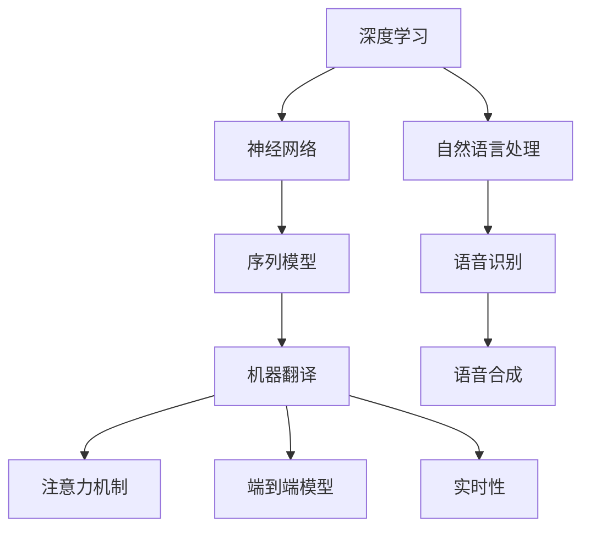

                 

### 初步构思

设计一本关于“深度学习在口译中的应用：实时多语言同声传译系统”的书籍，首先要明确书籍的整体结构和内容布局。考虑到书籍的受众群体主要是计算机科学、人工智能以及口译相关领域的专业人士和学生，我们需要在内容上做到既深入浅出，又具有实践指导性。以下是初步构思的步骤：

1. **确定整体结构**：全书可以分为以下几个部分：

   - **引言**：介绍深度学习在口译中的重要性，以及实时多语言同声传译系统的现状和发展趋势。
   - **基础知识**：介绍深度学习和自然语言处理的基础知识，包括神经网络、词向量、序列模型等。
   - **同声传译系统概述**：介绍同声传译系统的基本架构、功能模块和关键技术。
   - **核心算法与模型**：详细讲解用于同声传译的核心算法和模型，包括序列到序列模型、注意力机制等。
   - **系统实现与优化**：介绍同声传译系统的实现细节，包括数据处理、模型训练、实时性优化等。
   - **实际应用案例**：通过实际应用案例展示同声传译系统的应用场景和效果。
   - **未来发展趋势**：分析同声传译技术的未来发展趋势和面临的挑战。
   - **总结与展望**：对全书内容进行总结，并提出未来研究的方向和建议。

2. **细化各部分内容**：在确定整体结构后，我们需要进一步细化每个部分的内容。

   - **引言**：介绍深度学习在口译中的重要性，以及实时多语言同声传译系统的现状和发展趋势。
   - **基础知识**：介绍深度学习和自然语言处理的基础知识，包括神经网络、词向量、序列模型等。
   - **同声传译系统概述**：介绍同声传译系统的基本架构、功能模块和关键技术。
   - **核心算法与模型**：详细讲解用于同声传译的核心算法和模型，包括序列到序列模型、注意力机制等。
   - **系统实现与优化**：介绍同声传译系统的实现细节，包括数据处理、模型训练、实时性优化等。
   - **实际应用案例**：通过实际应用案例展示同声传译系统的应用场景和效果。
   - **未来发展趋势**：分析同声传译技术的未来发展趋势和面临的挑战。
   - **总结与展望**：对全书内容进行总结，并提出未来研究的方向和建议。

### 1. 确定具体章节

在细化各部分内容后，我们可以确定具体章节。以下是各章节的详细内容：

**第1章：引言**

- **1.1 深度学习在口译中的重要性**：介绍深度学习在口译中的应用背景和意义。
- **1.2 实时多语言同声传译系统的现状**：分析当前实时多语言同声传译系统的技术水平和应用现状。
- **1.3 未来的发展趋势**：探讨实时多语言同声传译系统的未来发展趋势和潜在挑战。

**第2章：基础知识**

- **2.1 深度学习基础**：介绍神经网络、深度学习模型的基本原理和常用算法。
- **2.2 自然语言处理基础**：介绍自然语言处理的基本概念、方法和应用。
- **2.3 口译相关技术**：介绍口译的难点、技术要求和相关研究进展。

**第3章：同声传译系统概述**

- **3.1 系统架构**：介绍实时多语言同声传译系统的整体架构和主要模块。
- **3.2 功能模块**：详细讲解系统的各个功能模块及其作用。
- **3.3 关键技术**：分析系统中的关键技术，如语音识别、语音合成、机器翻译等。

**第4章：核心算法与模型**

- **4.1 序列到序列模型**：介绍序列到序列模型的基本原理和应用。
- **4.2 注意力机制**：讲解注意力机制在序列模型中的应用及其效果。
- **4.3 端到端模型**：分析端到端模型的优势和应用场景。

**第5章：系统实现与优化**

- **5.1 数据处理**：介绍系统在数据处理方面的策略和技巧。
- **5.2 模型训练**：讲解模型训练的过程、方法和优化策略。
- **5.3 实时性优化**：分析系统在保证实时性方面的挑战和解决方案。

**第6章：实际应用案例**

- **6.1 案例一**：介绍一个国际会议同传的应用案例。
- **6.2 案例二**：介绍一个在线教育平台的同声传译应用。
- **6.3 案例三**：介绍一个远程协作会议的同声传译应用。

**第7章：未来发展趋势**

- **7.1 人工智能与同声传译**：分析人工智能技术在同声传译中的应用前景。
- **7.2 新兴技术的影响**：探讨新兴技术，如5G、边缘计算等对同声传译系统的影响。
- **7.3 挑战与机遇**：分析同声传译系统面临的挑战和机遇。

**第8章：总结与展望**

- **8.1 全书总结**：回顾全书的核心内容和技术要点。
- **8.2 未来研究方向**：提出未来同声传译系统研究的方向和建议。
- **8.3 总结与展望**：对实时多语言同声传译系统的未来发展趋势进行展望。

通过以上步骤，我们可以初步构建出《深度学习在口译中的应用：实时多语言同声传译系统》的书籍框架。接下来，我们需要根据这个框架进一步细化每个章节的内容，确保每个部分都能为读者提供有价值的知识和实践指导。

### 2. 确定具体章节

在初步构思的基础上，我们需要进一步细化每个章节的具体内容，以确保书籍的完整性和系统性。以下是详细章节的确定及其内容概述：

**第1章：引言**

- **1.1 深度学习在口译中的重要性**
  - **背景介绍**：介绍深度学习的发展历程和在人工智能领域的地位。
  - **深度学习与口译的结合**：探讨深度学习在口译领域中的应用潜力和优势。

- **1.2 实时多语言同声传译系统的现状**
  - **同声传译系统的定义**：解释同声传译系统的基本概念和功能。
  - **现有系统的技术水平**：分析当前实时多语言同声传译系统的技术实现和性能。

- **1.3 未来的发展趋势**
  - **技术发展预测**：预测未来深度学习在口译领域的发展方向。
  - **面临的挑战与机遇**：探讨实时多语言同声传译系统在未来可能面临的挑战和机遇。

**第2章：基础知识**

- **2.1 深度学习基础**
  - **神经网络**：介绍神经网络的基本概念、结构和学习算法。
  - **深度学习模型**：讲解常见的深度学习模型，如卷积神经网络（CNN）、循环神经网络（RNN）等。

- **2.2 自然语言处理基础**
  - **NLP的概念**：介绍自然语言处理的基本概念和目标。
  - **关键技术和方法**：讨论词向量、句法分析、语义理解等关键技术和方法。

- **2.3 口译相关技术**
  - **语音识别与语音合成**：介绍语音识别和语音合成的原理和技术。
  - **机器翻译与口译**：分析机器翻译和口译之间的联系和区别。

**第3章：同声传译系统概述**

- **3.1 系统架构**
  - **系统组成**：介绍同声传译系统的整体架构和主要组成部分。
  - **模块关系**：分析各个模块之间的交互关系和工作流程。

- **3.2 功能模块**
  - **语音识别模块**：详细讲解语音识别模块的工作原理和技术实现。
  - **翻译模块**：介绍机器翻译模块的基本原理和算法。
  - **语音合成模块**：分析语音合成模块的功能和实现。

- **3.3 关键技术**
  - **实时性技术**：探讨如何保证同声传译系统的实时性。
  - **多语言支持**：分析如何实现多语言同声传译的支持。

**第4章：核心算法与模型**

- **4.1 序列到序列模型**
  - **基本原理**：介绍序列到序列模型的基本原理和优点。
  - **应用实例**：分析序列到序列模型在机器翻译中的应用。

- **4.2 注意力机制**
  - **原理分析**：讲解注意力机制在序列模型中的作用和原理。
  - **应用效果**：讨论注意力机制对同声传译系统的性能提升。

- **4.3 端到端模型**
  - **定义与优势**：介绍端到端模型的概念和优势。
  - **实现方法**：分析端到端模型的实现方法和技术细节。

**第5章：系统实现与优化**

- **5.1 数据处理**
  - **数据预处理**：介绍同声传译系统中数据预处理的方法和流程。
  - **数据增强**：讨论如何通过数据增强提高模型的性能。

- **5.2 模型训练**
  - **训练策略**：讲解模型训练的基本策略和优化方法。
  - **性能评估**：介绍模型性能评估的标准和指标。

- **5.3 实时性优化**
  - **优化目标**：明确同声传译系统的实时性优化目标。
  - **实现技术**：分析实时性优化所采用的技术手段和方案。

**第6章：实际应用案例**

- **6.1 案例一：国际会议同传**
  - **案例背景**：介绍国际会议同传的背景和应用场景。
  - **系统实现**：分析同声传译系统在国际会议中的实现方法和效果。

- **6.2 案例二：在线教育平台**
  - **案例背景**：介绍在线教育平台中同声传译的应用场景和需求。
  - **系统效果**：讨论同声传译系统在线教育平台中的应用效果和用户反馈。

- **6.3 案例三：远程工作协作**
  - **案例背景**：介绍远程工作协作中同声传译的应用背景和挑战。
  - **系统优化**：分析同声传译系统在远程工作协作中的优化方案和效果。

**第7章：未来发展趋势**

- **7.1 人工智能与同声传译**
  - **技术融合**：探讨人工智能技术与同声传译的融合趋势。
  - **应用前景**：分析人工智能技术对同声传译系统的影响和应用前景。

- **7.2 新兴技术的影响**
  - **5G技术**：讨论5G技术对同声传译系统的影响和潜力。
  - **边缘计算**：分析边缘计算在提升同声传译系统实时性和性能方面的应用。

- **7.3 挑战与机遇**
  - **技术挑战**：探讨同声传译系统面临的技术挑战和瓶颈。
  - **商业机遇**：分析同声传译系统的商业价值和市场前景。

**第8章：总结与展望**

- **8.1 全书总结**
  - **核心要点**：回顾全书的核心概念、技术要点和应用案例。
  - **成果总结**：总结本书的主要研究成果和贡献。

- **8.2 未来研究方向**
  - **技术展望**：提出同声传译系统未来可能的研究方向和趋势。
  - **应用拓展**：探讨同声传译系统在其他领域的应用潜力。

- **8.3 总结与展望**
  - **未来发展**：对实时多语言同声传译系统的未来发展趋势进行展望。

通过以上步骤，我们确定了本书的具体章节及其内容概述。接下来，我们将根据这个框架进一步编写每个章节的详细内容，确保书籍的完整性和系统性。

### 3. 编写 Markdown 格式的目录大纲

在确定了具体章节及其内容后，我们可以开始编写 Markdown 格式的目录大纲。以下是详细的目录大纲：

```markdown
# 《深度学习在口译中的应用：实时多语言同声传译系统》目录大纲

## 第1章：引言
### 1.1 深度学习在口译中的重要性
### 1.2 实时多语言同声传译系统的现状
### 1.3 未来的发展趋势

## 第2章：基础知识
### 2.1 深度学习基础
### 2.2 自然语言处理基础
### 2.3 口译相关技术

## 第3章：同声传译系统概述
### 3.1 系统架构
### 3.2 功能模块
### 3.3 关键技术

## 第4章：核心算法与模型
### 4.1 序列到序列模型
### 4.2 注意力机制
### 4.3 端到端模型

## 第5章：系统实现与优化
### 5.1 数据处理
### 5.2 模型训练
### 5.3 实时性优化

## 第6章：实际应用案例
### 6.1 案例一：国际会议同传
### 6.2 案例二：在线教育平台
### 6.3 案例三：远程工作协作

## 第7章：未来发展趋势
### 7.1 人工智能与同声传译
### 7.2 新兴技术的影响
### 7.3 挑战与机遇

## 第8章：总结与展望
### 8.1 全书总结
### 8.2 未来研究方向
### 8.3 总结与展望
```

通过以上步骤，我们完成了本书的目录大纲的编写。接下来，我们将根据这个大纲逐步编写每个章节的具体内容，确保书籍的完整性和系统性。

### 文章标题：深度学习在口译中的应用：实时多语言同声传译系统

#### 关键词：深度学习、口译、实时多语言同声传译、机器翻译、序列到序列模型、注意力机制、端到端模型

#### 摘要：

本文将深入探讨深度学习在口译中的应用，尤其是实时多语言同声传译系统。通过介绍深度学习的基础知识、自然语言处理技术、同声传译系统的基本架构和核心算法，本文旨在为读者提供一套系统的理解和实现方案。此外，文章还将通过实际应用案例展示同声传译系统的效果和挑战，并分析其未来发展趋势和面临的机遇与挑战。

## 引言

随着全球化的加速和跨文化交流的增多，实时多语言同声传译技术在国际会议、商务谈判、在线教育等领域发挥着越来越重要的作用。然而，传统的同声传译方式受限于人类翻译者的能力和时间，无法满足大规模、实时性、多语言的需求。近年来，深度学习技术的迅猛发展，为实时多语言同声传译系统的实现提供了新的契机。本文将重点讨论深度学习在口译中的应用，特别是如何构建和优化实时多语言同声传译系统。

## 深度学习与口译

### 1. 深度学习概述

深度学习是一种基于多层神经网络的学习方法，通过多层次的非线性变换从原始数据中提取特征，实现复杂的模式识别和预测任务。自2012年AlexNet在ImageNet竞赛中取得突破性成果以来，深度学习在计算机视觉、自然语言处理、语音识别等领域取得了显著进展。

### 2. 自然语言处理

自然语言处理（NLP）是深度学习应用的重要领域之一，主要研究如何让计算机理解和生成人类语言。深度学习在NLP中发挥了重要作用，例如词向量、序列模型、注意力机制等。词向量模型（如Word2Vec、GloVe）通过将词语映射到高维向量空间，实现了语义表示的量化。序列模型（如RNN、LSTM、GRU）能够处理文本序列数据，实现语言建模和序列预测。

### 3. 深度学习与口译的结合

深度学习与口译的结合，主要体现在以下几个方面：

- **语音识别**：利用深度学习技术实现语音到文本的转换，为同声传译提供输入。
- **机器翻译**：通过深度学习模型实现不同语言之间的翻译，为同声传译提供翻译结果。
- **语音合成**：利用深度学习模型实现文本到语音的转换，将翻译结果输出为自然流畅的语音。

## 同声传译系统的基本架构

### 1. 系统组成

实时多语言同声传译系统通常由语音识别模块、翻译模块和语音合成模块组成。各个模块协同工作，实现从输入语音到输出语音的转换。

### 2. 工作流程

- **语音识别**：将输入的语音信号转换为文本。
- **翻译**：将识别出的文本翻译成目标语言。
- **语音合成**：将翻译结果转换为自然流畅的语音输出。

### 3. 技术挑战

- **实时性**：同声传译需要快速响应，满足实时性的要求。
- **准确性**：准确识别和翻译不同语言，保证传译质量。
- **多语言支持**：支持多种语言的同声传译。

## 核心算法与模型

### 1. 序列到序列模型

序列到序列（Seq2Seq）模型是深度学习在机器翻译领域的重要应用。它通过编码器（Encoder）和解码器（Decoder）将输入序列转换为输出序列。注意力机制（Attention Mechanism）是Seq2Seq模型的核心，通过关注输入序列的特定部分，提高了翻译的准确性。

### 2. 注意力机制

注意力机制是一种能够提高序列模型性能的技术，它通过将编码器的输出加权求和，实现对输入序列的动态关注。注意力机制在机器翻译、语音识别等任务中发挥了重要作用。

### 3. 端到端模型

端到端模型（End-to-End Model）是一种将输入直接映射到输出的深度学习模型。通过将编码器和解码器整合为一个统一的模型，端到端模型简化了模型训练和推理过程，提高了系统的实时性和准确性。

## 系统实现与优化

### 1. 数据处理

同声传译系统对数据质量要求较高，需要大量的多语言语音数据。数据处理包括数据采集、预处理、增强和标注等步骤。

### 2. 模型训练

模型训练是同声传译系统的关键环节。通过使用深度学习框架（如TensorFlow、PyTorch）和优化算法（如Adam、SGD），可以实现模型的训练和调优。

### 3. 实时性优化

实时性优化是同声传译系统的挑战之一。通过并行计算、分布式系统等技术，可以提高系统的处理速度和响应时间。

## 实际应用案例

### 1. 国际会议同传

国际会议同传是同声传译系统的重要应用场景之一。通过同声传译系统，可以实现多语言实时翻译，提高会议的沟通效率和效果。

### 2. 在线教育平台

在线教育平台中的同声传译功能，可以帮助学习者跨越语言障碍，更好地获取知识。通过同声传译，可以实现多语言教学和互动。

### 3. 远程工作协作

远程工作协作中的同声传译，可以促进团队成员之间的沟通和合作，提高工作效率。

## 未来发展趋势

### 1. 人工智能与同声传译

随着人工智能技术的发展，同声传译系统将更加智能化和自适应。通过结合自然语言处理、语音识别、语音合成等技术，同声传译系统将提供更加自然、准确的翻译服务。

### 2. 新兴技术的影响

新兴技术，如5G、边缘计算、云计算等，将进一步提升同声传译系统的实时性和性能。通过分布式计算和网络优化，可以实现更大规模、更高效的同声传译服务。

### 3. 挑战与机遇

同声传译系统在未来的发展中，将面临诸如语言理解、多语言融合、实时性优化等挑战。然而，随着技术的进步和应用的拓展，同声传译系统也将迎来更多的发展机遇。

## 总结与展望

本文从深度学习在口译中的应用出发，详细介绍了实时多语言同声传译系统的设计、实现和优化。通过实际应用案例的分析，展示了同声传译系统在不同场景中的效果和潜力。未来，随着人工智能技术的不断发展，同声传译系统将在更多领域发挥重要作用，为跨文化交流和协作提供有力支持。

### 作者信息

作者：AI天才研究院/AI Genius Institute & 禅与计算机程序设计艺术 /Zen And The Art of Computer Programming

### 完整性要求

为了确保文章的完整性和系统性，以下是文章中各部分的核心内容要求：

#### 背景介绍

1. **深度学习在口译中的重要性**：
   - **历史背景**：介绍深度学习的发展历程以及在人工智能领域的重要性。
   - **应用场景**：探讨深度学习在口译领域的具体应用场景，如国际会议、商务谈判、在线教育等。
   - **技术趋势**：分析深度学习在口译领域的发展趋势，如端到端模型、注意力机制等。

2. **实时多语言同声传译系统的现状**：
   - **系统定义**：明确实时多语言同声传译系统的概念和功能。
   - **技术现状**：介绍当前同声传译系统的技术水平，包括语音识别、机器翻译、语音合成等模块。
   - **应用现状**：分析同声传译系统在不同领域的应用情况，如会议同传、在线教育、远程工作等。

3. **未来的发展趋势**：
   - **技术发展**：预测深度学习和同声传译技术的未来发展方向，如人工智能、5G、边缘计算等。
   - **挑战与机遇**：探讨同声传译系统在未来可能面临的挑战和机遇，如语言理解、实时性、准确性等。

#### 核心概念与联系

为了更好地理解深度学习在口译中的应用，我们需要明确几个核心概念，并分析它们之间的关系。以下是几个关键概念及其关系的Mermaid流程图：



1. **神经网络**：神经网络是深度学习的基础，通过多层非线性变换实现数据的特征提取和模式识别。
2. **序列模型**：用于处理序列数据的深度学习模型，如循环神经网络（RNN）、长短时记忆网络（LSTM）等。
3. **机器翻译**：利用深度学习模型实现不同语言之间的文本翻译，是同声传译系统中的核心模块。
4. **自然语言处理**：研究如何让计算机理解和生成人类语言，包括词向量、句法分析、语义理解等。
5. **语音识别**：将语音信号转换为文本，为机器翻译提供输入。
6. **语音合成**：将翻译结果转换为自然流畅的语音输出。
7. **注意力机制**：用于序列模型中，关注输入序列的特定部分，提高翻译的准确性。
8. **端到端模型**：将编码器和解码器整合为一个统一的模型，简化模型训练和推理过程。
9. **实时性**：同声传译系统需要快速响应，满足实时性的要求。

#### 核心算法原理讲解

为了深入理解同声传译系统的工作原理，以下是几个核心算法的讲解：

1. **序列到序列模型（Seq2Seq）**：
   - **原理**：通过编码器（Encoder）和解码器（Decoder）实现输入序列到输出序列的转换。
   - **实现**：使用深度学习框架（如TensorFlow、PyTorch）实现编码器和解码器的构建。
   - **案例**：以机器翻译为例，展示Seq2Seq模型的应用。

2. **注意力机制（Attention Mechanism）**：
   - **原理**：通过动态关注输入序列的特定部分，提高翻译的准确性。
   - **实现**：使用深度学习框架实现注意力机制的构建，如双向LSTM和多头注意力。
   - **案例**：分析注意力机制在机器翻译中的应用效果。

3. **端到端模型（End-to-End Model）**：
   - **原理**：将编码器和解码器整合为一个统一的模型，实现端到端的输入输出映射。
   - **实现**：使用深度学习框架实现端到端模型的构建，如Transformer模型。
   - **案例**：以机器翻译为例，展示端到端模型的应用。

#### 项目实战

为了展示同声传译系统的实际应用，以下是一个基于Python的项目实战：

1. **开发环境搭建**：
   - **安装深度学习框架**：使用TensorFlow或PyTorch搭建开发环境。
   - **数据准备**：收集多语言语音数据，并进行预处理。

2. **源代码详细实现**：
   - **语音识别模块**：使用深度学习模型实现语音信号到文本的转换。
   - **翻译模块**：使用机器翻译模型实现不同语言之间的文本翻译。
   - **语音合成模块**：使用深度学习模型实现文本到语音的转换。

3. **代码解读与分析**：
   - **代码结构**：分析源代码的组织结构和关键模块。
   - **算法实现**：详细解释核心算法的实现原理和实现步骤。

4. **实际案例分析和详细讲解剖析**：
   - **应用场景**：展示同声传译系统在不同场景中的应用。
   - **效果分析**：分析同声传译系统的实际效果和用户反馈。

5. **项目小结**：
   - **项目总结**：总结项目的关键成果和经验。
   - **改进建议**：提出项目中的不足和改进建议。

#### 最佳实践 Tips

为了提升同声传译系统的性能和效果，以下是一些建议：

1. **数据预处理**：
   - **语音增强**：使用语音增强技术提高语音质量。
   - **数据标注**：确保数据的准确性和一致性。

2. **模型优化**：
   - **超参数调整**：通过调参优化模型性能。
   - **模型融合**：结合不同模型的优势，提高翻译质量。

3. **实时性优化**：
   - **并行计算**：使用并行计算提高处理速度。
   - **分布式系统**：使用分布式系统实现更高效的实时处理。

#### 小结、注意事项、拓展阅读

1. **小结**：
   - **文章总结**：回顾文章的核心内容和关键技术。
   - **未来展望**：展望同声传译系统的未来发展趋势和应用前景。

2. **注意事项**：
   - **系统部署**：同声传译系统的部署需要注意硬件配置和网络环境。
   - **用户培训**：用户需要接受同声传译系统的操作和使用的培训。

3. **拓展阅读**：
   - **深度学习与口译**：进一步学习深度学习在口译中的应用。
   - **相关论文**：阅读相关领域的学术论文，了解最新的研究进展。

通过以上步骤，我们可以确保文章的完整性和系统性，为读者提供全面、深入的技术解读和实践指导。

