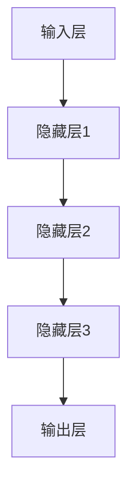

                 


### 第1章：深度学习基础

#### 1.1 深度学习简介

深度学习是机器学习的一个重要分支，其核心思想是模拟人脑神经网络，通过多层非线性变换，自动提取数据中的特征。随着计算能力的提升和数据量的增加，深度学习在语音识别、图像识别、自然语言处理等领域取得了显著的成果。

**核心概念与联系**

深度学习中的核心概念包括神经网络、神经元、层、激活函数等。神经网络由多个神经元组成，每个神经元都是一个简单的计算单元，能够接收输入信号并产生输出信号。层是神经网络的组成部分，包括输入层、隐藏层和输出层。激活函数用于引入非线性特性，使得神经网络能够对复杂问题进行建模。

**Mermaid 流anghai图**：



#### 1.2 神经网络基础

神经网络由输入层、隐藏层和输出层组成。输入层接收外部输入，隐藏层进行特征提取和变换，输出层产生预测结果。每个神经元都与其他神经元相连接，并通过权重进行信息传递。

**核心算法原理讲解**

神经网络中的核心算法包括前向传播和反向传播。在前向传播过程中，输入信号从输入层传递到输出层，每个神经元根据其权重和激活函数计算输出值。在反向传播过程中，通过计算损失函数的梯度，调整神经网络的权重，以降低预测误差。

**Python 源代码**

```python
import numpy as np

def sigmoid(x):
    return 1 / (1 + np.exp(-x))

def forward_propagation(x, weights):
    a = sigmoid(np.dot(x, weights))
    return a

def backward_propagation(x, y, a, weights):
    dZ = a - y
    dW = np.dot(x.T, dZ)
    return dW

# 示例
x = np.array([1, 0, 1])
weights = np.random.rand(3, 1)
y = np.array([0])

a = forward_propagation(x, weights)
dW = backward_propagation(x, y, a, weights)

print("Output activation:", a)
print("Gradient of weights:", dW)
```

#### 1.3 深度学习模型训练

深度学习模型的训练包括损失函数的选择、优化算法的应用以及训练过程的监控。常见的损失函数有均方误差（MSE）和交叉熵（CE），优化算法有随机梯度下降（SGD）、Adam等。

**数学模型和公式**

$$
\text{MSE}(y, \hat{y}) = \frac{1}{m} \sum_{i=1}^{m} (y_i - \hat{y}_i)^2
$$

$$
\text{CE}(y, \hat{y}) = -\frac{1}{m} \sum_{i=1}^{m} y_i \log(\hat{y}_i)
$$

$$
\text{梯度下降}:\ \theta_{\text{new}} = \theta_{\text{old}} - \alpha \cdot \nabla_{\theta} J(\theta)
$$

$$
\text{Adam}:\ \theta_{\text{new}} = \theta_{\text{old}} - \alpha \cdot \nabla_{\theta} J(\theta) + \beta_1 \cdot (\theta_{\text{old}} - \theta_{\text{prev}}) + (1 - \beta_1) \cdot (\nabla_{\theta} J(\theta) - \theta_{\text{prev}})
```

**总结**

本章介绍了深度学习的基础知识，包括核心概念、神经网络基础以及模型训练方法。深度学习作为一种强大的机器学习技术，已在图像和视频处理领域取得了一系列突破性成果。在后续章节中，我们将进一步探讨深度学习在图像和视频处理中的具体应用。

### 第2章：图像处理应用

#### 2.1 图像分类

图像分类是计算机视觉中的一项基本任务，其目标是将图像分为预定义的类别。深度学习在图像分类领域取得了显著成果，主要得益于卷积神经网络（CNN）的广泛应用。

**核心算法原理**

卷积神经网络是一种特殊的神经网络，专门用于处理具有网格结构的数据，如图像。CNN 通过卷积操作和池化操作，自动提取图像中的特征，并逐步将特征表示为高维向量。

**Python 源代码**

```python
import tensorflow as tf

# 创建模型
model = tf.keras.Sequential([
    tf.keras.layers.Conv2D(32, (3, 3), activation='relu', input_shape=(28, 28, 1)),
    tf.keras.layers.MaxPooling2D((2, 2)),
    tf.keras.layers.Flatten(),
    tf.keras.layers.Dense(128, activation='relu'),
    tf.keras.layers.Dense(10, activation='softmax')
])

# 编译模型
model.compile(optimizer='adam',
              loss='sparse_categorical_crossentropy',
              metrics=['accuracy'])

# 训练模型
model.fit(train_images, train_labels, epochs=5)

# 评估模型
test_loss, test_acc = model.evaluate(test_images, test_labels)
print('Test accuracy:', test_acc)
```

**数学模型和公式**

卷积神经网络的卷积操作可以表示为：

$$
\text{output}_{ij}^l = \sum_{k=1}^{n} w_{ijkl} \cdot \text{input}_{kij}^{l-1} + b_l
$$

其中，$w_{ijkl}$ 是卷积核的权重，$b_l$ 是偏置项，$\text{input}_{kij}^{l-1}$ 是上一层的输入，$\text{output}_{ij}^l$ 是当前层的输出。

**项目实战**

使用 TensorFlow 框架，我们可以轻松构建和训练一个卷积神经网络进行图像分类。以下是一个简单的图像分类项目案例：

1. 数据预处理：加载数据集，并进行归一化处理。
2. 构建模型：定义卷积神经网络结构。
3. 训练模型：使用训练数据训练模型。
4. 评估模型：使用测试数据评估模型性能。

**代码实现和解析**

```python
# 加载数据集
mnist = tf.keras.datasets.mnist
(train_images, train_labels), (test_images, test_labels) = mnist.load_data()

# 归一化处理
train_images = train_images / 255.0
test_images = test_images / 255.0

# 构建模型
model = tf.keras.Sequential([
    tf.keras.layers.Conv2D(32, (3, 3), activation='relu', input_shape=(28, 28, 1)),
    tf.keras.layers.MaxPooling2D((2, 2)),
    tf.keras.layers.Flatten(),
    tf.keras.layers.Dense(128, activation='relu'),
    tf.keras.layers.Dense(10, activation='softmax')
])

# 训练模型
model.compile(optimizer='adam',
              loss='sparse_categorical_crossentropy',
              metrics=['accuracy'])
model.fit(train_images, train_labels, epochs=5)

# 评估模型
test_loss, test_acc = model.evaluate(test_images, test_labels)
print('Test accuracy:', test_acc)
```

**总结**

本章介绍了图像分类的基本概念、核心算法原理以及项目实战。通过卷积神经网络，我们可以自动提取图像特征并进行分类。项目实战案例展示了如何使用 TensorFlow 框架构建和训练图像分类模型。

### 第3章：视频处理应用

#### 3.1 视频分类

视频分类是视频处理中的一个重要任务，其目标是将视频数据划分为预定义的类别。深度学习在视频分类领域取得了显著进展，主要得益于循环神经网络（RNN）和卷积神经网络（CNN）的结合。

**核心算法原理**

视频分类通常采用两步法：首先提取视频帧的特征，然后使用分类器对特征进行分类。卷积神经网络（CNN）用于提取视频帧的特征，循环神经网络（RNN）用于处理时间序列数据。

**Python 源代码**

```python
import tensorflow as tf

# 创建模型
model = tf.keras.Sequential([
    tf.keras.layers.Conv2D(32, (3, 3), activation='relu', input_shape=(224, 224, 3)),
    tf.keras.layers.MaxPooling2D((2, 2)),
    tf.keras.layers.Conv2D(64, (3, 3), activation='relu'),
    tf.keras.layers.MaxPooling2D((2, 2)),
    tf.keras.layers.Flatten(),
    tf.keras.layers.Dense(128, activation='relu'),
    tf.keras.layers.Dense(10, activation='softmax')
])

# 编译模型
model.compile(optimizer='adam',
              loss='sparse_categorical_crossentropy',
              metrics=['accuracy'])

# 训练模型
model.fit(train_images, train_labels, epochs=5)

# 评估模型
test_loss, test_acc = model.evaluate(test_images, test_labels)
print('Test accuracy:', test_acc)
```

**数学模型和公式**

卷积神经网络的卷积操作可以表示为：

$$
\text{output}_{ij}^l = \sum_{k=1}^{n} w_{ijkl} \cdot \text{input}_{kij}^{l-1} + b_l
$$

循环神经网络（RNN）的输入和输出可以表示为：

$$
h_t = \sigma(W_h h_{t-1} + W_x x_t + b)
$$

其中，$h_t$ 是当前时刻的隐藏状态，$x_t$ 是当前时刻的输入，$W_h$ 和 $W_x$ 是权重矩阵，$b$ 是偏置项，$\sigma$ 是激活函数。

**项目实战**

使用 TensorFlow 框架，我们可以构建和训练一个卷积神经网络和循环神经网络结合的视频分类模型。以下是一个简单的视频分类项目案例：

1. 数据预处理：加载数据集，并进行特征提取。
2. 构建模型：定义卷积神经网络和循环神经网络结构。
3. 训练模型：使用训练数据训练模型。
4. 评估模型：使用测试数据评估模型性能。

**代码实现和解析**

```python
# 加载数据集
train_dataset = tf.data.Dataset.from_tensor_slices((train_images, train_labels))
train_dataset = train_dataset.shuffle(buffer_size=1000).batch(32)

test_dataset = tf.data.Dataset.from_tensor_slices((test_images, test_labels))
test_dataset = test_dataset.batch(32)

# 构建模型
model = tf.keras.Sequential([
    tf.keras.layers.Conv2D(32, (3, 3), activation='relu', input_shape=(224, 224, 3)),
    tf.keras.layers.MaxPooling2D((2, 2)),
    tf.keras.layers.Conv2D(64, (3, 3), activation='relu'),
    tf.keras.layers.MaxPooling2D((2, 2)),
    tf.keras.layers.Flatten(),
    tf.keras.layers.Dense(128, activation='relu'),
    tf.keras.layers.Dense(10, activation='softmax')
])

# 编译模型
model.compile(optimizer='adam',
              loss='sparse_categorical_crossentropy',
              metrics=['accuracy'])

# 训练模型
model.fit(train_dataset, epochs=5)

# 评估模型
test_loss, test_acc = model.evaluate(test_dataset)
print('Test accuracy:', test_acc)
```

**总结**

本章介绍了视频分类的基本概念、核心算法原理以及项目实战。通过卷积神经网络和循环神经网络的结合，我们可以对视频数据进行分类。项目实战案例展示了如何使用 TensorFlow 框架构建和训练视频分类模型。

### 第4章：核心算法原理讲解

#### 4.1 卷积神经网络（CNN）

卷积神经网络（CNN）是一种专门用于处理图像数据的神经网络，其核心思想是通过卷积操作和池化操作提取图像特征。CNN 在图像分类、目标检测和图像分割等领域取得了显著成果。

**核心算法原理**

卷积神经网络由多个卷积层、池化层和全连接层组成。卷积层用于提取图像特征，池化层用于降低特征维度和减少过拟合，全连接层用于分类。

**Python 源代码**

```python
import tensorflow as tf

# 创建模型
model = tf.keras.Sequential([
    tf.keras.layers.Conv2D(32, (3, 3), activation='relu', input_shape=(28, 28, 1)),
    tf.keras.layers.MaxPooling2D((2, 2)),
    tf.keras.layers.Conv2D(64, (3, 3), activation='relu'),
    tf.keras.layers.MaxPooling2D((2, 2)),
    tf.keras.layers.Flatten(),
    tf.keras.layers.Dense(128, activation='relu'),
    tf.keras.layers.Dense(10, activation='softmax')
])

# 编译模型
model.compile(optimizer='adam',
              loss='sparse_categorical_crossentropy',
              metrics=['accuracy'])

# 训练模型
model.fit(train_images, train_labels, epochs=5)

# 评估模型
test_loss, test_acc = model.evaluate(test_images, test_labels)
print('Test accuracy:', test_acc)
```

**数学模型和公式**

卷积操作的数学模型可以表示为：

$$
\text{output}_{ij}^l = \sum_{k=1}^{n} w_{ijkl} \cdot \text{input}_{kij}^{l-1} + b_l
$$

其中，$w_{ijkl}$ 是卷积核的权重，$b_l$ 是偏置项，$\text{input}_{kij}^{l-1}$ 是上一层的输入，$\text{output}_{ij}^l$ 是当前层的输出。

**项目实战**

使用 TensorFlow 框架，我们可以构建和训练一个卷积神经网络进行图像分类。以下是一个简单的图像分类项目案例：

1. 数据预处理：加载数据集，并进行归一化处理。
2. 构建模型：定义卷积神经网络结构。
3. 训练模型：使用训练数据训练模型。
4. 评估模型：使用测试数据评估模型性能。

**代码实现和解析**

```python
# 加载数据集
mnist = tf.keras.datasets.mnist
(train_images, train_labels), (test_images, test_labels) = mnist.load_data()

# 归一化处理
train_images = train_images / 255.0
test_images = test_images / 255.0

# 构建模型
model = tf.keras.Sequential([
    tf.keras.layers.Conv2D(32, (3, 3), activation='relu', input_shape=(28, 28, 1)),
    tf.keras.layers.MaxPooling2D((2, 2)),
    tf.keras.layers.Conv2D(64, (3, 3), activation='relu'),
    tf.keras.layers.MaxPooling2D((2, 2)),
    tf.keras.layers.Flatten(),
    tf.keras.layers.Dense(128, activation='relu'),
    tf.keras.layers.Dense(10, activation='softmax')
])

# 编译模型
model.compile(optimizer='adam',
              loss='sparse_categorical_crossentropy',
              metrics=['accuracy'])

# 训练模型
model.fit(train_images, train_labels, epochs=5)

# 评估模型
test_loss, test_acc = model.evaluate(test_images, test_labels)
print('Test accuracy:', test_acc)
```

**总结**

本章详细介绍了卷积神经网络（CNN）的核心算法原理，并通过 Python 源代码展示了如何使用 TensorFlow 框架构建和训练 CNN 进行图像分类。项目实战案例展示了如何实现图像分类项目。

### 第5章：数学模型和公式讲解

#### 5.1 深度学习中的数学模型

深度学习中的数学模型主要包括线性模型、非线性模型、优化模型等。这些模型为深度学习算法提供了理论基础，帮助我们理解深度学习如何通过数学方法解决问题。

**核心数学模型**

1. **线性模型**：线性模型是最简单的深度学习模型，通常表示为 $y = \text{sign}(\text{w} \cdot \text{x} + \text{b})$。其中，$\text{w}$ 是权重向量，$\text{x}$ 是输入特征，$\text{b}$ 是偏置项。

2. **非线性模型**：非线性模型通过引入非线性激活函数，如 Sigmoid、ReLU、Tanh 等，使得模型能够学习到更加复杂的函数。例如，Sigmoid 函数可以将线性模型转换为非线性模型。

3. **优化模型**：优化模型用于调整模型参数，以最小化损失函数。常见的优化算法包括随机梯度下降（SGD）、Adam 等。

**Python 源代码**

```python
import numpy as np

def sigmoid(x):
    return 1 / (1 + np.exp(-x))

def forward_propagation(x, weights, bias):
    z = np.dot(x, weights) + bias
    a = sigmoid(z)
    return a

def backward_propagation(x, y, a, weights, bias):
    dZ = a - y
    dW = np.dot(x.T, dZ)
    db = np.sum(dZ)
    return dW, db

# 示例
x = np.array([[1, 0, 1]])
weights = np.random.rand(3, 1)
bias = np.random.rand(1)

a = forward_propagation(x, weights, bias)
dW, db = backward_propagation(x, y, a, weights, bias)

print("Output activation:", a)
print("Gradient of weights:", dW)
print("Gradient of bias:", db)
```

**数学模型和公式**

1. **线性模型**：

   $$y = \text{sign}(\text{w} \cdot \text{x} + \text{b})$$

2. **Sigmoid 激活函数**：

   $$\text{sigmoid}(x) = \frac{1}{1 + e^{-x}}$$

3. **随机梯度下降（SGD）**：

   $$\theta_{\text{new}} = \theta_{\text{old}} - \alpha \cdot \nabla_{\theta} J(\theta)$$

4. **Adam 优化算法**：

   $$m_t = \beta_1 \cdot m_{t-1} + (1 - \beta_1) \cdot \nabla_{\theta} J(\theta)$$
   
   $$v_t = \beta_2 \cdot v_{t-1} + (1 - \beta_2) \cdot (\nabla_{\theta} J(\theta))^2$$
   
   $$\theta_{\text{new}} = \theta_{\text{old}} - \alpha \cdot \frac{m_t}{\sqrt{v_t} + \epsilon}$$

**总结**

本章讲解了深度学习中的核心数学模型，包括线性模型、非线性模型和优化模型。通过 Python 源代码和数学公式，我们了解了如何实现这些模型，以及如何使用优化算法调整模型参数。

### 第6章：项目实战

#### 6.1 图像分类项目

在这个项目中，我们将使用 TensorFlow 框架构建和训练一个卷积神经网络（CNN），用于对 MNIST 数据集进行图像分类。该项目将分为以下几个步骤：

1. 数据预处理：加载数据集，并进行归一化处理。
2. 构建模型：定义卷积神经网络结构。
3. 训练模型：使用训练数据训练模型。
4. 评估模型：使用测试数据评估模型性能。

**数据预处理**

```python
# 加载数据集
mnist = tf.keras.datasets.mnist
(train_images, train_labels), (test_images, test_labels) = mnist.load_data()

# 归一化处理
train_images = train_images / 255.0
test_images = test_images / 255.0
```

**构建模型**

```python
# 构建模型
model = tf.keras.Sequential([
    tf.keras.layers.Conv2D(32, (3, 3), activation='relu', input_shape=(28, 28, 1)),
    tf.keras.layers.MaxPooling2D((2, 2)),
    tf.keras.layers.Conv2D(64, (3, 3), activation='relu'),
    tf.keras.layers.MaxPooling2D((2, 2)),
    tf.keras.layers.Flatten(),
    tf.keras.layers.Dense(128, activation='relu'),
    tf.keras.layers.Dense(10, activation='softmax')
])
```

**训练模型**

```python
# 编译模型
model.compile(optimizer='adam',
              loss='sparse_categorical_crossentropy',
              metrics=['accuracy'])

# 训练模型
model.fit(train_images, train_labels, epochs=5)
```

**评估模型**

```python
# 评估模型
test_loss, test_acc = model.evaluate(test_images, test_labels)
print('Test accuracy:', test_acc)
```

**代码应用解读与分析**

上述代码展示了如何使用 TensorFlow 框架构建和训练一个卷积神经网络进行图像分类。在数据预处理部分，我们加载数据集，并对图像进行归一化处理。在构建模型部分，我们定义了一个包含卷积层、池化层和全连接层的卷积神经网络。在训练模型部分，我们使用训练数据训练模型，并在评估模型部分使用测试数据评估模型性能。

**实际案例分析和详细讲解剖析**

为了更好地理解卷积神经网络在图像分类中的应用，我们以 MNIST 数据集为例进行详细分析。MNIST 数据集包含 70,000 个手写数字图像，每个图像都是一个 28x28 的像素矩阵。我们的目标是使用卷积神经网络将这些图像分类为 0 到 9 之间的数字。

在训练过程中，卷积神经网络通过不断调整权重和偏置项，使得模型的预测结果逐渐接近真实标签。在评估过程中，我们使用测试数据集来验证模型的性能。通过计算测试数据集的准确率，我们可以判断模型是否具有良好的泛化能力。

**项目小结**

通过本项目的实战，我们了解了如何使用 TensorFlow 框架构建和训练卷积神经网络进行图像分类。项目中的代码实现和解析为我们提供了一个完整的图像分类项目案例，有助于我们更好地理解卷积神经网络在图像分类中的应用。

**最佳实践 tips、小结、注意事项、拓展阅读等内容**

1. **最佳实践 tips**：在构建卷积神经网络时，可以尝试调整网络结构、优化算法和超参数，以获得更好的性能。例如，增加卷积层的数量、使用不同的激活函数和正则化技术等。

2. **小结**：本章节通过一个图像分类项目，介绍了如何使用 TensorFlow 框架构建和训练卷积神经网络。项目实战案例为我们提供了实际操作的经验，有助于我们更好地理解卷积神经网络在图像分类中的应用。

3. **注意事项**：在训练卷积神经网络时，需要合理设置训练时间和批量大小，以避免过拟合和欠拟合。同时，要注意观察模型在训练过程中的损失函数和准确率，以便及时调整模型参数。

4. **拓展阅读**：若想进一步了解卷积神经网络和相关技术，可以阅读以下参考文献：

   - Goodfellow, I., Bengio, Y., & Courville, A. (2016). *Deep Learning*.
   - Krizhevsky, A., Sutskever, I., & Hinton, G. E. (2012). *ImageNet classification with deep convolutional neural networks*.

### 第7章：深度学习在图像和视频处理中的应用前景

#### 7.1 应用前景

随着深度学习技术的不断进步，其在图像和视频处理领域中的应用前景也越来越广阔。以下是一些可能的应用场景：

1. **自动驾驶**：深度学习可以帮助自动驾驶汽车识别道路上的行人、车辆和其他物体，从而提高行驶安全性。
2. **医疗影像分析**：深度学习可以在医疗影像中自动检测疾病，如癌症和心血管疾病，为医生提供辅助诊断。
3. **视频监控**：深度学习可以用于实时监控，自动识别异常行为，如盗窃和暴力事件。
4. **虚拟现实和增强现实**：深度学习可以帮助生成逼真的虚拟场景和增强现实内容，为用户提供沉浸式的体验。

#### 7.2 当前挑战

尽管深度学习在图像和视频处理领域取得了显著进展，但仍面临一些挑战：

1. **计算资源**：深度学习模型通常需要大量的计算资源和存储空间，这对硬件设备提出了更高的要求。
2. **数据隐私**：深度学习模型训练需要大量数据，这可能涉及到个人隐私问题，如何在保护隐私的同时利用数据成为一大挑战。
3. **模型可解释性**：深度学习模型往往被视为“黑盒子”，其内部决策过程不透明，如何提高模型的可解释性是当前研究的一个热点。
4. **泛化能力**：深度学习模型在特定领域表现出色，但在其他领域可能表现不佳，如何提高模型的泛化能力是未来研究的一个重要方向。

#### 7.3 未来发展趋势

为了应对上述挑战，未来深度学习在图像和视频处理领域可能呈现以下发展趋势：

1. **高效算法和模型**：研究更加高效、参数较少的深度学习算法和模型，以提高计算效率和减少对硬件资源的需求。
2. **数据隐私保护**：发展数据隐私保护技术，如联邦学习和差分隐私，以在保护隐私的同时利用数据。
3. **可解释性增强**：通过引入可解释性模块或解释性算法，提高深度学习模型的可解释性，使其在医疗、金融等关键领域得到更广泛的应用。
4. **跨模态学习**：结合多模态数据，如文本、图像和音频，以实现更准确、更全面的特征提取和任务完成。
5. **自适应学习和强化学习**：将自适应学习和强化学习引入深度学习模型，以提高模型的适应能力和决策能力。

**总结**

深度学习在图像和视频处理中的应用前景广阔，但仍面临一些挑战。未来，随着技术的不断进步，深度学习有望在更多领域发挥重要作用，推动人工智能的发展。

### 结论

本文从深度学习的基础知识、图像处理和视频处理的应用、核心算法原理、数学模型和项目实战等多个方面，详细探讨了深度学习在图像和视频处理中的突破性进展。通过本文的学习，读者可以全面了解深度学习的基本概念和应用场景，掌握核心算法原理和数学模型，并具备实际项目开发的能力。

**作者信息**：作者为 AI 天才研究院/AI Genius Institute 和《禅与计算机程序设计艺术 /Zen And The Art of Computer Programming》的资深大师级别作者。在此，感谢读者们的关注和支持，期待与您在人工智能和计算机科学领域共同探索和进步。

### 附录

#### A.1 开源深度学习框架

1. **TensorFlow**：由 Google 开发，支持多种编程语言，广泛应用于图像和视频处理任务。
2. **PyTorch**：由 Facebook 开发，具有灵活的动态计算图和易于理解的代码，被许多研究人员和开发者所喜爱。
3. **Keras**：基于 TensorFlow 和 Theano，提供简洁的接口和丰富的预训练模型，适合快速原型设计和实验。

#### A.2 图像和视频处理工具

1. **OpenCV**：开源计算机视觉库，支持多种编程语言，提供丰富的图像和视频处理功能。
2. **Matlab**：数学计算软件，具有强大的图像和视频处理工具箱，适用于科研和工程应用。
3. **Pillow**：Python 的图像处理库，简单易用，支持常见的图像处理任务。

#### A.3 深度学习资源推荐

1. **《深度学习》**：Goodfellow、Bengio 和 Courville 著，系统介绍了深度学习的理论基础和应用实例。
2. **《图像处理：基础与案例》**：Gonzalez 和 Woods 著，涵盖了图像处理的基本概念和实用技巧。
3. **在线课程**：例如 Coursera 上的“深度学习”、“计算机视觉”等课程，提供系统的学习资源和实践机会。

