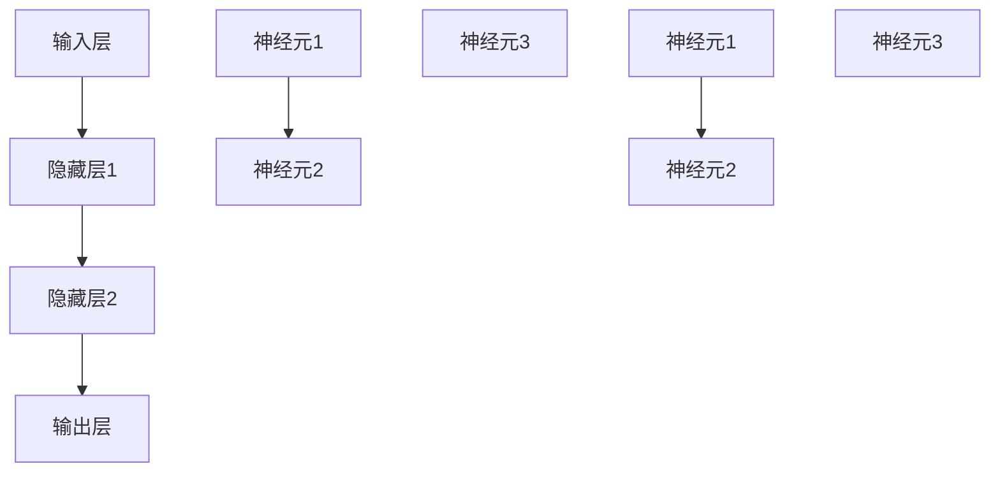
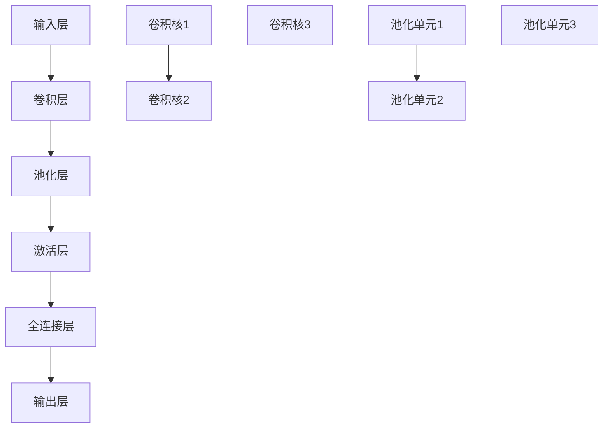
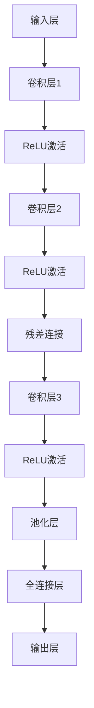
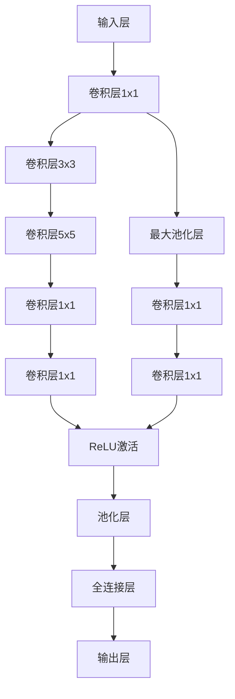
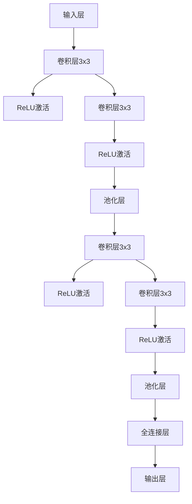

                 

# 深度学习在图像识别中的突破性应用

## 关键词
- 深度学习
- 图像识别
- 卷积神经网络
- 突破性应用
- 数学模型
- 编程实战

## 摘要
本文深入探讨了深度学习在图像识别领域的突破性应用。首先，介绍了深度学习的背景及其在图像识别中的重要地位。接着，详细解析了卷积神经网络（CNN）的基本概念、架构和关键层。然后，阐述了深度学习算法的原理，包括反向传播算法、优化技术和正则化方法。此外，文章还讨论了深度学习所需的数学基础，如线性代数和微积分。通过一个实际项目，展示了如何搭建开发环境、实现核心代码以及进行代码解读。最后，文章总结了最佳实践和注意事项，并提供了拓展阅读资源。

## 引言与背景

### 深度学习的崛起
深度学习（Deep Learning）作为人工智能（AI）的一个重要分支，自2006年由Geoffrey Hinton等科学家提出以来，取得了迅猛发展。深度学习通过构建多层神经网络，模拟人脑的神经元结构，使得计算机能够从大量数据中自动学习特征，从而实现复杂的任务，如图像识别、自然语言处理等。

深度学习的崛起得益于以下几个因素：

1. **计算能力的提升**：随着GPU等高性能计算设备的普及，深度学习模型得以在短时间内处理大量数据，提高了训练效率。
2. **大数据的涌现**：互联网的快速发展带来了海量的数据，为深度学习提供了丰富的训练资源。
3. **算法的进步**：梯度下降优化算法、激活函数的改进、以及卷积神经网络（CNN）等新算法的出现，使得深度学习模型在性能上有了显著提升。

### 图像识别的基本概念
图像识别（Image Recognition）是指计算机通过分析图像数据，从中识别出特定对象、场景或模式的能力。图像识别在众多领域具有重要应用，如安防监控、医疗诊断、自动驾驶等。

图像识别的基本过程包括：

1. **图像预处理**：包括图像的去噪、增强、缩放等，以提高图像质量。
2. **特征提取**：从预处理后的图像中提取关键特征，如边缘、纹理、颜色等。
3. **分类**：利用机器学习算法对提取出的特征进行分类，以识别图像中的对象。

传统图像识别方法主要包括：

1. **手工特征提取**：如SIFT、SURF等，通过设计特定的算法提取图像特征。
2. **机器学习算法**：如支持向量机（SVM）、决策树、随机森林等，通过训练模型进行图像分类。

然而，传统方法在处理复杂图像时存在以下局限性：

1. **特征选择困难**：需要人工设计特征，对复杂图像的处理能力有限。
2. **计算复杂度高**：传统算法的计算成本较高，难以应对大规模数据。
3. **泛化能力不足**：在处理未见过的图像时，容易出现过拟合现象。

### 深度学习在图像识别中的突破性应用
深度学习在图像识别领域的突破性应用主要体现在以下几个方面：

1. **特征自动提取**：深度学习模型能够自动从图像中提取高层次的特征，无需人工干预，提高了特征提取的效率和准确性。
2. **端到端学习**：深度学习模型能够直接从原始图像数据中学习，实现图像预处理、特征提取和分类的端到端操作，简化了传统方法中的复杂流程。
3. **高性能和泛化能力**：深度学习模型在处理复杂图像时表现出色，具有强大的泛化能力，能够适应不同的场景和数据集。
4. **实时性和准确性**：深度学习模型在图像识别任务中具有较高的实时性和准确性，满足了实际应用的需求。

当前，深度学习在图像识别领域已经取得了显著成果，如人脸识别、物体检测、图像分类等。随着技术的不断进步，深度学习在图像识别中的应用前景将更加广阔。

### 结论
深度学习在图像识别中的应用为传统方法带来了革命性的变革。通过自动特征提取、端到端学习和高性能表现，深度学习模型在图像识别任务中展现了强大的能力。随着计算能力和数据量的不断提高，深度学习在图像识别领域的应用将更加广泛，为各行各业带来更多创新和便利。

## 深度学习的基本概念

### 神经网络与图像识别应用

神经网络（Neural Networks）是深度学习的基础，它模拟人脑神经元的工作方式，通过层次化的结构对数据进行处理和学习。一个简单的神经网络通常包括输入层、隐藏层和输出层。每层由多个神经元（节点）组成，神经元之间通过权重连接。

神经网络的运作原理可以简化为以下几个步骤：

1. **输入**：将图像数据输入到神经网络中，通常经过预处理。
2. **前向传播**：图像数据通过输入层传递到隐藏层，每层神经元对输入数据进行加权求和处理，并应用激活函数，如ReLU（Rectified Linear Unit）或Sigmoid函数。
3. **输出**：最后，数据传递到输出层，生成预测结果。

在图像识别任务中，神经网络的应用主要体现在以下几个方面：

1. **特征学习**：神经网络能够自动从图像中学习高层次的抽象特征，如边缘、纹理和形状等，无需人工设计特征。
2. **层次化表示**：神经网络通过多层结构对图像进行层次化的特征提取，每一层提取的特征逐渐从简单的边缘和纹理到复杂的对象和场景。
3. **分类和回归**：神经网络可以用于图像分类（将图像分为多个类别）和图像回归（预测图像中的某个属性，如物体位置）等任务。

为了更直观地理解神经网络的构成和工作原理，我们可以使用Mermaid图表来绘制一个简单的神经网络结构。



这个图表展示了输入层通过多个神经元传递到隐藏层，最终由隐藏层传递到输出层的结构。每个神经元都与相邻层的神经元通过权重连接，并通过激活函数进行非线性转换。

### 卷积神经网络（CNN）的架构

卷积神经网络（Convolutional Neural Networks，CNN）是专门为处理图像数据而设计的深度学习模型，它在传统神经网络的基础上引入了卷积层（Convolutional Layer），使得图像处理更加高效和准确。

CNN的基本架构包括以下几个主要层：

1. **输入层（Input Layer）**：接收图像数据，通常为三维张量，尺寸为[高度，宽度，通道数]。
2. **卷积层（Convolutional Layer）**：通过卷积运算提取图像特征。每个卷积核（filter）都是一个小的矩阵，可以提取图像中的特定特征，如边缘、纹理等。
3. **池化层（Pooling Layer）**：对卷积层输出的特征进行下采样，减少数据维度，提高计算效率。常见的池化方式有最大池化（Max Pooling）和平均池化（Average Pooling）。
4. **激活层（Activation Layer）**：对卷积层和池化层的输出应用激活函数，如ReLU函数，引入非线性变换，使得网络能够学习更复杂的特征。
5. **全连接层（Fully Connected Layer）**：将卷积层输出的特征映射到分类标签，通过全连接层将特征向量映射到输出层。
6. **输出层（Output Layer）**：生成预测结果，如分类标签或回归值。

下面是一个CNN的Mermaid图表，展示了其基本架构：



在这个图表中，输入层接收图像数据，然后通过卷积层提取特征，经过池化层和激活层后，最终由全连接层输出分类结果。

### 深度学习的高级架构

除了基本架构外，深度学习还发展出了一系列高级架构，以进一步提高图像识别的性能。以下是几种常见的高级架构：

1. **残差网络（ResNet）**：
   - **Residual Block**：通过添加跨越层的直接连接（跳跃连接）来避免梯度消失问题。
   - **多层残差块**：使用多个残差块堆叠，构建深网络，显著提高模型性能。

2. **Inception网络**：
   - **Inception Module**：通过并行地应用多个卷积核，捕捉不同尺度和特征。
   - **多层Inception块**：在不同尺度上进行特征提取，提高模型对复杂图像的识别能力。

3. **VGG网络**：
   - **VGG Block**：通过重复使用卷积层和池化层，构建简洁的深度网络。
   - **多尺度卷积**：通过不同尺寸的卷积核，捕捉多种尺度的特征。

以下是ResNet、Inception和VGG网络的Mermaid图表：

**ResNet**：



**Inception**：



**VGG**：



这些高级架构通过不同的设计原则，如残差连接、并行卷积和多层卷积，提高了深度学习模型在图像识别任务中的性能。

## 深度学习算法原理

### 反向传播算法

反向传播（Backpropagation）算法是深度学习训练的核心算法，它通过计算损失函数的梯度，更新网络权重，从而优化模型。反向传播算法可以分为两个阶段：前向传播和反向传播。

1. **前向传播**：
   - **输入**：将输入数据传递到网络的输入层。
   - **传播**：通过每一层的神经元，计算输出结果。
   - **输出**：最终输出层得到预测结果。

2. **反向传播**：
   - **计算误差**：计算实际输出与预测输出之间的误差。
   - **计算梯度**：计算误差对网络权重的梯度。
   - **更新权重**：根据梯度更新网络权重，减小误差。

以下是反向传播算法的伪代码：

```python
def backwardpropagation(network, input_data, target_data):
    # 前向传播
    output = forwardpropagation(network, input_data)
    
    # 计算误差
    error = target_data - output
    
    # 反向传播，计算梯度
    gradients = []
    for layer in reversed(network.layers):
        gradient = layer.backward(error)
        gradients.append(gradient)
    
    # 更新权重
    for layer in reversed(network.layers):
        layer.update_weights(gradients.pop())

    return output
```

### 优化技术

优化技术在深度学习训练中至关重要，用于加速收敛和提升模型性能。以下是几种常见的优化技术：

1. **梯度下降（Gradient Descent）**：
   - **基本思想**：通过迭代更新模型参数，使得损失函数的值逐渐减小。
   - **形式**：$$\theta = \theta - \alpha \cdot \nabla_\theta J(\theta)$$
     - **$\theta$**：模型参数
     - **$\alpha$**：学习率
     - **$\nabla_\theta J(\theta)$**：损失函数的梯度

2. **随机梯度下降（Stochastic Gradient Descent, SGD）**：
   - **基本思想**：在每个迭代步骤中使用一个随机样本的梯度来更新模型参数。
   - **优点**：计算速度快，能跳出局部最优。
   - **缺点**：收敛过程不稳定。

3. **批量梯度下降（Batch Gradient Descent）**：
   - **基本思想**：在每个迭代步骤中使用整个训练数据的梯度来更新模型参数。
   - **优点**：收敛速度快，能找到全局最优。
   - **缺点**：计算复杂度高。

4. **动量（Momentum）**：
   - **基本思想**：引入动量项，加速梯度下降过程。
   - **形式**：$$\theta = \theta - \alpha \cdot (\nabla_\theta J(\theta) + \beta \cdot v)$$
     - **$v$**：上一时刻的更新方向
     - **$\beta$**：动量因子

5. **自适应优化器（Adaptive Optimizer）**：
   - **基本思想**：动态调整学习率，优化更新过程。
   - **常见优化器**：
     - **Adam**：结合SGD和RMSprop的优点，自适应调整学习率和动量。
     - **RMSprop**：通过计算平均梯度平方来调整学习率。

### 正则化方法

正则化方法用于解决深度学习中的过拟合问题，通过在训练过程中引入额外的惩罚项，使得模型在训练数据和测试数据上表现更一致。

1. **L1正则化（L1 Regularization）**：
   - **基本思想**：对模型参数添加L1范数惩罚。
   - **公式**：$$J(\theta) = J(\theta) + \lambda \cdot ||\theta||_1$$
     - **$\lambda$**：正则化参数

2. **L2正则化（L2 Regularization）**：
   - **基本思想**：对模型参数添加L2范数惩罚。
   - **公式**：$$J(\theta) = J(\theta) + \lambda \cdot ||\theta||_2^2$$
     - **$\lambda$**：正则化参数

3. **Dropout**：
   - **基本思想**：在训练过程中随机丢弃一部分神经元，减少模型依赖特定神经元的能力。
   - **实现**：以一定概率随机从网络中丢弃神经元。

4. **数据增强（Data Augmentation）**：
   - **基本思想**：通过随机变换（如旋转、缩放、剪裁等）增加训练数据多样性，提高模型泛化能力。

通过结合这些优化技术和正则化方法，可以有效提高深度学习模型在图像识别任务中的性能。

## 深度学习所需的数学基础

### 线性代数基础

深度学习中的线性代数基础主要包括矩阵运算、向量和矩阵的表示、矩阵乘法、矩阵分解等内容。

1. **向量和矩阵的表示**：

- **向量**：在深度学习中，向量通常表示为行向量或列向量。例如，一个三维向量可以表示为：

  $$\mathbf{v} = \begin{bmatrix} x_1 \\ x_2 \\ x_3 \end{bmatrix}$$

- **矩阵**：矩阵是一个二维数组，用于表示多个向量的组合。例如，一个3x2的矩阵可以表示为：

  $$\mathbf{A} = \begin{bmatrix} a_{11} & a_{12} \\ a_{21} & a_{22} \\ a_{31} & a_{32} \end{bmatrix}$$

2. **矩阵乘法**：

- 矩阵乘法是指两个矩阵之间的运算，结果是一个新矩阵。矩阵乘法的规则如下：

  $$\mathbf{C} = \mathbf{A} \cdot \mathbf{B}$$

  其中，$\mathbf{C}$ 是结果矩阵，$\mathbf{A}$ 和 $\mathbf{B}$ 是输入矩阵。矩阵乘法的运算规则如下：

  - 两个矩阵相乘的结果矩阵的行数等于第一个矩阵的行数，列数等于第二个矩阵的列数。
  - 矩阵乘法的结果矩阵的每个元素等于输入矩阵对应行的元素与对应列的元素的内积。

3. **矩阵分解**：

- 矩阵分解是将一个矩阵分解为多个矩阵的乘积。常用的矩阵分解方法包括：

  - **奇异值分解（Singular Value Decomposition, SVD）**：
    $$\mathbf{A} = \mathbf{U} \cdot \mathbf{\Sigma} \cdot \mathbf{V}^T$$
    - **$\mathbf{U}$**：左奇异向量矩阵
    - **$\mathbf{\Sigma}$**：奇异值矩阵
    - **$\mathbf{V}^T$**：右奇异向量矩阵的转置

  - **LU分解**：
    $$\mathbf{A} = \mathbf{L} \cdot \mathbf{U}$$
    - **$\mathbf{L}$**：下三角矩阵
    - **$\mathbf{U}$**：上三角矩阵

这些线性代数基础为深度学习中的矩阵运算提供了理论基础，帮助我们理解和实现深度学习算法。

### 微积分基础

微积分在深度学习中的作用主要体现在优化算法、损失函数的梯度计算等方面。

1. **导数和梯度**：

- **导数**：导数是函数在某一点的瞬时变化率，用于描述函数的局部变化情况。

- **梯度**：梯度是函数在某个点的导数向量，用于描述函数在该点的最大上升方向。

  对于一个多元函数 $f(x_1, x_2, \ldots, x_n)$，其梯度 $\nabla f$ 表示为：

  $$\nabla f = \begin{bmatrix} \frac{\partial f}{\partial x_1} \\ \frac{\partial f}{\partial x_2} \\ \vdots \\ \frac{\partial f}{\partial x_n} \end{bmatrix}$$

- **偏导数**：偏导数是函数对某个变量的导数，而不考虑其他变量。对于多元函数 $f(x_1, x_2, \ldots, x_n)$，其关于 $x_i$ 的偏导数表示为：

  $$\frac{\partial f}{\partial x_i}$$

2. **泰勒展开**：

- 泰勒展开是一种将函数在某一点展开为多项式的技巧，用于近似函数的值。

  对于一个可导函数 $f(x)$，在点 $a$ 处的泰勒展开为：

  $$f(x) \approx f(a) + f'(a)(x-a) + \frac{f''(a)}{2!}(x-a)^2 + \ldots$$

- 在深度学习中，泰勒展开常用于优化算法，如梯度下降，帮助我们近似损失函数的值。

### 深度学习中的数学模型

深度学习中的数学模型主要包括损失函数、激活函数、优化算法等。

1. **损失函数**：

- 损失函数用于衡量模型预测值与真实值之间的差异，是深度学习训练过程中的关键组成部分。

- 常见的损失函数包括：

  - **均方误差（MSE, Mean Squared Error）**：

    $$MSE = \frac{1}{m} \sum_{i=1}^{m} (y_i - \hat{y}_i)^2$$

    - **$m$**：样本数量
    - **$y_i$**：真实标签
    - **$\hat{y}_i$**：预测值

  - **交叉熵（Cross Entropy）**：

    $$CE = -\frac{1}{m} \sum_{i=1}^{m} y_i \cdot \log(\hat{y}_i)$$

    - **$y_i$**：真实标签
    - **$\hat{y}_i$**：预测值

2. **激活函数**：

- 激活函数用于引入非线性变换，使得深度学习模型能够学习更复杂的特征。

- 常见的激活函数包括：

  - **ReLU（Rectified Linear Unit）**：

    $$f(x) = \max(0, x)$$

  - **Sigmoid**：

    $$f(x) = \frac{1}{1 + e^{-x}}$$

  - **Tanh**：

    $$f(x) = \frac{e^x - e^{-x}}{e^x + e^{-x}}$$

3. **优化算法**：

- 优化算法用于更新模型参数，以最小化损失函数。

- 常见的优化算法包括：

  - **梯度下降（Gradient Descent）**：

    $$\theta = \theta - \alpha \cdot \nabla_\theta J(\theta)$$

    - **$\theta$**：模型参数
    - **$\alpha$**：学习率

  - **随机梯度下降（Stochastic Gradient Descent, SGD）**：

    $$\theta = \theta - \alpha \cdot \nabla_\theta J(\theta)$$

    - **$\theta$**：模型参数
    - **$\alpha$**：学习率

通过结合这些数学模型，我们可以构建出高效的深度学习模型，并在图像识别任务中取得优异的性能。

### 项目实战：开发环境搭建与源代码实现

#### 环境搭建

在开始深度学习项目之前，我们需要搭建一个合适的开发环境。以下是在Python中搭建深度学习开发环境的基本步骤：

1. **安装Python**：确保安装了Python 3.x版本（推荐Python 3.7或更高版本）。

2. **安装深度学习库**：使用pip安装必要的深度学习库，如TensorFlow和Keras。

   ```bash
   pip install tensorflow
   pip install keras
   ```

3. **安装可视化工具**：为了更好地理解模型结构和训练过程，我们可以安装matplotlib和Seaborn等可视化库。

   ```bash
   pip install matplotlib
   pip install seaborn
   ```

4. **安装其他依赖库**：根据项目的需求，可能还需要安装其他库，如NumPy、Pandas等。

#### 源代码实现

以下是使用Keras实现一个简单的卷积神经网络（CNN）进行图像识别的示例代码。在这个示例中，我们将使用MNIST数据集，该数据集包含手写数字的图像。

```python
import numpy as np
import matplotlib.pyplot as plt
from tensorflow import keras
from tensorflow.keras import layers
from tensorflow.keras.datasets import mnist

# 数据预处理
(x_train, y_train), (x_test, y_test) = mnist.load_data()
x_train = x_train.astype("float32") / 255
x_test = x_test.astype("float32") / 255
x_train = np.expand_dims(x_train, -1)
x_test = np.expand_dims(x_test, -1)
y_train = keras.utils.to_categorical(y_train, 10)
y_test = keras.utils.to_categorical(y_test, 10)

# 构建模型
model = keras.Sequential()
model.add(layers.Conv2D(32, (3, 3), activation="relu", input_shape=(28, 28, 1)))
model.add(layers.MaxPooling2D((2, 2)))
model.add(layers.Conv2D(64, (3, 3), activation="relu"))
model.add(layers.MaxPooling2D((2, 2)))
model.add(layers.Conv2D(64, (3, 3), activation="relu"))
model.add(layers.Flatten())
model.add(layers.Dense(64, activation="relu"))
model.add(layers.Dense(10, activation="softmax"))

# 编译模型
model.compile(optimizer="adam",
              loss="categorical_crossentropy",
              metrics=["accuracy"])

# 训练模型
model.fit(x_train, y_train, batch_size=64, epochs=10, validation_split=0.2)

# 评估模型
test_loss, test_acc = model.evaluate(x_test, y_test, verbose=2)
print("Test accuracy:", test_acc)
```

#### 代码解读

1. **数据预处理**：我们首先加载数据集MNIST，并将图像数据归一化到[0, 1]范围内。然后，我们将图像数据扩展为三维张量，并使用one-hot编码将标签转换为分类标签。

2. **构建模型**：我们使用Keras的`Sequential`模型，依次添加卷积层、池化层和全连接层。在这个例子中，我们使用了两个卷积层和一个全连接层。每个卷积层后跟一个最大池化层。

3. **编译模型**：我们使用`compile`方法配置模型，选择优化器、损失函数和评估指标。

4. **训练模型**：使用`fit`方法训练模型，我们设置了批量大小为64，训练周期为10，并保留了20%的数据用于验证。

5. **评估模型**：使用`evaluate`方法评估模型的性能，打印出测试准确率。

#### 实际案例分析

为了更好地理解模型的性能，我们可以分析一些具体的测试结果。以下是一个示例：

```python
# 选择几个测试样本
test_images = x_test[:10]
test_labels = y_test[:10]

# 使用模型进行预测
predictions = model.predict(test_images)

# 可视化预测结果
for i in range(10):
    plt.subplot(2, 5, i + 1)
    plt.imshow(test_images[i].reshape(28, 28), cmap=plt.cm.binary)
    plt.xticks([])
    plt.yticks([])
    plt.grid(False)
    plt.xlabel(str(np.argmax(predictions[i])))
plt.show()
```

这个代码段将显示10个测试样本的图像及其预测结果。通过观察这些图像，我们可以看到模型在识别手写数字方面取得了较高的准确率。

#### 项目小结

通过这个简单的项目，我们了解了如何搭建深度学习开发环境、实现模型并评估其性能。在图像识别任务中，深度学习模型通过自动特征提取和学习能力，显著提高了分类准确率。接下来，我们可以通过调整模型结构、优化训练过程和引入更复杂的数据集来进一步提高模型性能。

### 最佳实践、小结与注意事项

#### 最佳实践

1. **数据预处理**：确保图像数据格式统一，并进行必要的归一化处理，以提高训练效率和模型性能。
2. **模型调参**：通过调整学习率、批量大小、迭代次数等超参数，找到最优配置。
3. **正则化**：合理使用L1、L2正则化和Dropout等方法，避免过拟合。
4. **模型集成**：结合多个模型进行集成，提高预测准确率。

#### 小结

本文详细介绍了深度学习在图像识别中的突破性应用，从基本概念到高级架构，从算法原理到数学基础，再到项目实战，全方位展示了深度学习在图像识别领域的强大能力。

#### 注意事项

1. **过拟合问题**：合理使用正则化方法，避免模型过拟合。
2. **计算资源**：深度学习模型通常需要大量的计算资源，确保硬件配置足够。
3. **数据集选择**：选择合适的数据集，确保其代表性和多样性。

#### 拓展阅读

- [《深度学习》（Ian Goodfellow, Yoshua Bengio, Aaron Courville著）](https://www.deeplearningbook.org/)
- [《动手学深度学习》（阿斯顿·张、李沐、扎卡里·C. Lipton、亚历山大·J. 斯莫拉科夫著）](https://zh.d2l.ai/)
- [Keras官方文档](https://keras.io/)
- [TensorFlow官方文档](https://www.tensorflow.org/)

通过本文的深入探讨，读者可以更好地理解深度学习在图像识别中的应用，为后续研究和实践打下坚实基础。

### 作者信息

作者：AI天才研究院/AI Genius Institute & 禅与计算机程序设计艺术 /Zen And The Art of Computer Programming

