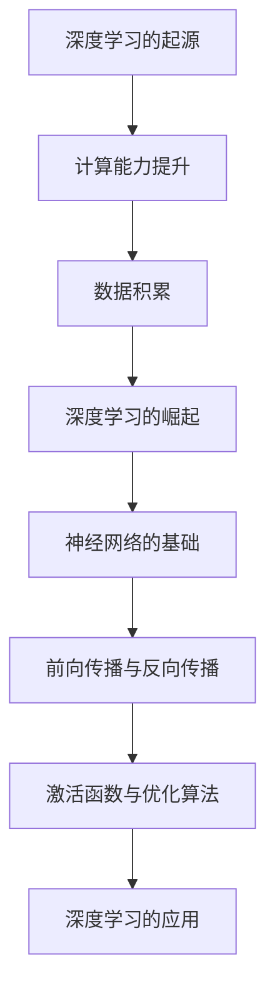
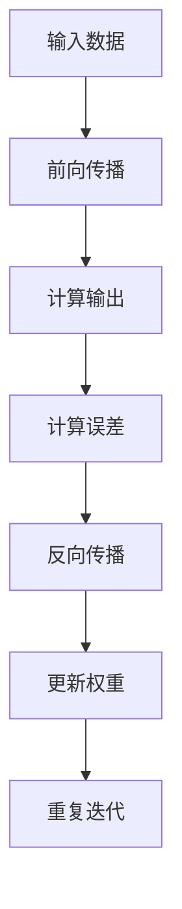
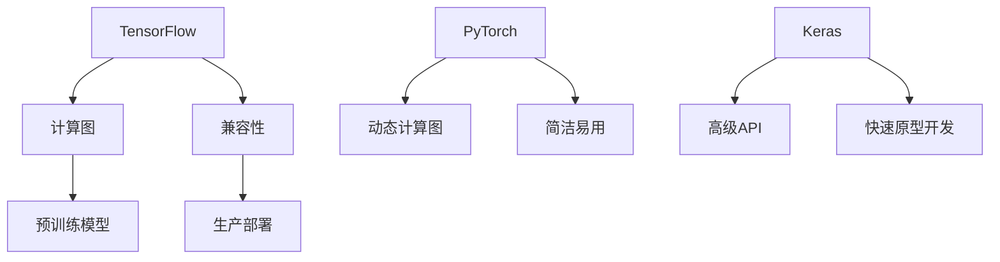
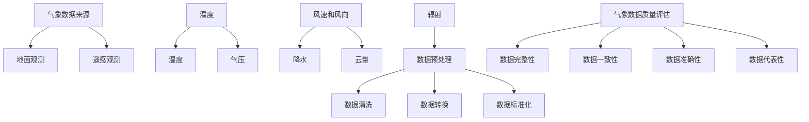
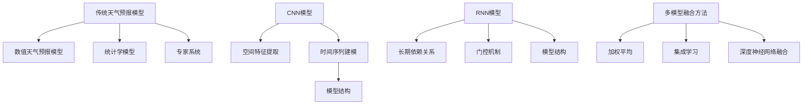
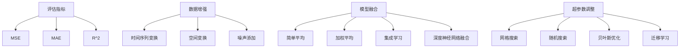
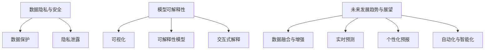

                 

### 文章标题

“深度学习在天气预报中的应用：提高短期预报准确性”

#### 关键词

- 深度学习
- 天气预报
- 短期预报
- CNN
- RNN
- 气象数据分析
- 模型优化

#### 摘要

本文旨在探讨深度学习在天气预报中的应用，特别是如何通过深度学习模型提高短期预报的准确性。首先，我们将回顾深度学习的基础知识，包括神经网络的基本原理和深度学习框架的使用。接着，我们将深入探讨气象数据分析的方法，以及如何利用深度学习模型处理和预测气象数据。本文还将详细介绍如何使用卷积神经网络（CNN）和循环神经网络（RNN）进行天气预报，以及如何通过多模型融合方法进一步提高预报的准确性。最后，我们将分析深度学习在天气预报中的挑战，并提出未来发展的展望。

---

## 第一部分：深度学习基础

深度学习是机器学习的一个子领域，它通过模仿人脑的神经网络结构和功能，从大量数据中自动学习和提取特征。深度学习在图像识别、语音识别、自然语言处理等领域取得了显著的成果。本部分将首先介绍深度学习的基本概念和发展历程，然后详细讲解神经网络的基础知识，包括神经元模型、前向传播和反向传播算法、激活函数以及优化算法。此外，我们还将讨论几种常用的深度学习框架，如TensorFlow和PyTorch，以及如何选择合适的深度学习框架。

### 第1章：深度学习概述

#### 1.1 深度学习的起源与发展

深度学习（Deep Learning）的概念最早由心理学家弗兰克·罗蒙德（Frank Rosenblatt）在1957年提出，他发明了感知机（Perceptron）这一简单的人工神经网络模型。然而，由于当时计算机性能的限制和数学上的难题，深度学习并未得到广泛的应用。直到1980年代后期，随着计算能力的提升和海量数据的积累，深度学习开始逐渐崛起。

1990年代，深度信念网络（Deep Belief Networks，DBN）和堆叠自编码器（Stacked Autoencoders）等模型被提出，标志着深度学习的再次兴起。特别是在2006年，Geoffrey Hinton等研究者提出了深度卷积神经网络（Deep Convolutional Neural Network，DCNN），并在图像识别任务中取得了突破性的成果。

进入21世纪，随着GPU（图形处理单元）的出现和深度学习框架如Theano、TensorFlow、PyTorch的推出，深度学习迎来了快速发展。深度学习不仅在学术界取得了显著的成果，也在工业界得到了广泛应用，如自动驾驶、语音识别、医疗诊断等领域。

#### 1.2 深度学习的关键概念

深度学习涉及许多关键概念，以下是一些主要的概念：

- **神经网络（Neural Network）**：神经网络是深度学习的基础，它由大量相互连接的神经元组成，每个神经元都是一个简单的计算单元，通过学习输入数据来产生输出。

- **深度（Depth）**：深度指的是神经网络中的层次结构。一个深度为\(L\)的神经网络包含\(L\)个层次，包括输入层、多个隐藏层和输出层。

- **前向传播（Forward Propagation）**：前向传播是指在神经网络中，将输入数据逐层传递到网络的下一层，并计算每个神经元的输出。

- **反向传播（Back Propagation）**：反向传播是神经网络训练的核心算法，用于计算网络误差，并通过反向传播更新网络中的权重。

- **激活函数（Activation Function）**：激活函数用于引入非线性特性到神经网络中。常见的激活函数有Sigmoid、ReLU、Tanh等。

- **优化算法（Optimization Algorithm）**：优化算法用于调整网络中的权重，以最小化预测误差。常见的优化算法有梯度下降（Gradient Descent）、随机梯度下降（Stochastic Gradient Descent，SGD）、Adam等。

#### 1.3 深度学习的优势与局限性

深度学习的优势主要包括：

- **强大的特征学习能力**：深度学习能够自动从大量数据中学习复杂的特征，这使得它在处理复杂数据时具有显著优势。

- **高准确率**：在许多任务中，深度学习模型的表现已经超过了传统机器学习模型。

- **自适应能力**：深度学习模型可以通过调整网络结构和超参数，适应不同的任务和数据集。

然而，深度学习也存在一些局限性：

- **数据需求量大**：深度学习通常需要大量的数据进行训练，这使得它在处理小数据集时效果不佳。

- **模型可解释性差**：深度学习模型往往被视为“黑盒子”，难以解释其决策过程。

- **计算资源消耗大**：深度学习模型需要大量的计算资源和时间进行训练。

### Mermaid 流程图



### Python 源代码

```python
import tensorflow as tf

# 定义简单的神经网络
model = tf.keras.Sequential([
    tf.keras.layers.Dense(128, activation='relu', input_shape=(784,)),
    tf.keras.layers.Dense(10, activation='softmax')
])

# 编译模型
model.compile(optimizer='adam',
              loss='categorical_crossentropy',
              metrics=['accuracy'])

# 模型训练
model.fit(x_train, y_train, batch_size=128, epochs=10)
```

### 数学模型和公式

$$
\text{激活函数} f(x) = \frac{1}{1 + e^{-x}}
$$

### 项目实战

在实际应用中，我们可以使用TensorFlow框架构建一个简单的神经网络，用于手写数字识别。以下是具体步骤：

1. **环境搭建**：安装TensorFlow和相关依赖。
2. **数据准备**：加载MNIST数据集。
3. **模型构建**：定义输入层、隐藏层和输出层。
4. **模型训练**：编译和训练模型。
5. **评估与测试**：评估模型性能并测试。

```python
import tensorflow as tf
from tensorflow.keras import layers

# 加载MNIST数据集
mnist = tf.keras.datasets.mnist
(x_train, y_train), (x_test, y_test) = mnist.load_data()

# 数据预处理
x_train = x_train / 255.0
x_test = x_test / 255.0
x_train = x_train.reshape(-1, 784)
x_test = x_test.reshape(-1, 784)

# 定义模型
model = tf.keras.Sequential([
    layers.Dense(128, activation='relu', input_shape=(784,)),
    layers.Dense(10, activation='softmax')
])

# 编译模型
model.compile(optimizer='adam',
              loss='sparse_categorical_crossentropy',
              metrics=['accuracy'])

# 训练模型
model.fit(x_train, y_train, epochs=5)

# 评估模型
model.evaluate(x_test, y_test)
```

### 小结

本章介绍了深度学习的基础知识，包括其起源与发展、关键概念、优势和局限性。通过一个简单的手写数字识别项目，我们展示了如何使用TensorFlow框架构建和训练神经网络。在下一章，我们将深入探讨神经网络的基础知识，包括神经元模型、前向传播和反向传播算法、激活函数以及优化算法。

---

## 第2章：神经网络基础

神经网络（Neural Network，NN）是深度学习的基础，它由大量相互连接的神经元组成。每个神经元都是一个简单的计算单元，通过接收输入、进行计算并输出结果，从而实现数据的学习和处理。本章将详细讲解神经网络的基础知识，包括神经元模型、前向传播与反向传播算法、激活函数以及优化算法。

### 2.1 神经元模型

神经元模型是神经网络的基本构建块。一个简单的神经元模型通常包含以下几个部分：

1. **输入层**：输入层接收外部输入数据，每个输入数据对应一个神经元。
2. **权重（Weights）**：每个输入数据通过一个权重与下一个神经元的输入相乘。
3. **偏置（Bias）**：偏置是一个加性常数，用于调整神经元的输出。
4. **激活函数**：激活函数用于引入非线性特性，决定神经元是否“激活”。
5. **输出层**：输出层的神经元产生最终输出。

一个简单的神经元模型可以表示为：

$$
z = \sum_{i=1}^{n} w_i x_i + b \\
a = f(z)
$$

其中，\(z\)是神经元的净输入，\(w_i\)是输入数据的权重，\(b\)是偏置，\(f\)是激活函数，\(a\)是神经元的输出。

### 2.2 前向传播与反向传播算法

神经网络通过前向传播和反向传播算法进行训练。前向传播是将输入数据通过神经网络，计算每个神经元的输出；反向传播是计算网络误差，并更新网络中的权重和偏置。

**前向传播**：

1. **输入层**：输入数据通过输入层传递到第一个隐藏层。
2. **隐藏层**：每个隐藏层的神经元接收前一层的输出，计算净输入，并应用激活函数。
3. **输出层**：输出层的神经元产生最终输出。

**反向传播**：

1. **计算误差**：计算输出层实际输出与预期输出之间的误差。
2. **误差传播**：误差从输出层反向传播到每个隐藏层。
3. **权重和偏置更新**：根据误差，通过梯度下降算法更新网络中的权重和偏置。

反向传播算法的核心是计算梯度。梯度是误差关于网络参数的偏导数，用于指导权重的更新。以下是权重和偏置更新的公式：

$$
\Delta w = \eta \frac{\partial L}{\partial w} \\
\Delta b = \eta \frac{\partial L}{\partial b}
$$

其中，\(\Delta w\)和\(\Delta b\)分别是权重和偏置的更新值，\(\eta\)是学习率，\(L\)是损失函数。

### 2.3 激活函数

激活函数是神经网络中引入非线性特性的关键。常见的激活函数包括Sigmoid、ReLU、Tanh等。

- **Sigmoid函数**：
  $$
  f(x) = \frac{1}{1 + e^{-x}}
  $$
  Sigmoid函数的输出范围在0到1之间，适合处理分类问题。

- **ReLU函数**：
  $$
  f(x) = \max(0, x)
  $$
  ReLU函数简单且计算效率高，常用于隐藏层。

- **Tanh函数**：
  $$
  f(x) = \frac{e^x - e^{-x}}{e^x + e^{-x}}
  $$
  Tanh函数的输出范围在-1到1之间，适合处理回归问题。

### 2.4 优化算法

优化算法用于调整网络中的权重和偏置，以最小化损失函数。常见的优化算法包括梯度下降、随机梯度下降和Adam等。

- **梯度下降**：
  梯度下降是一种最简单的优化算法，它通过计算损失函数关于网络参数的梯度，并沿梯度的反方向更新权重和偏置。

  $$
  w = w - \eta \frac{\partial L}{\partial w}
  $$

- **随机梯度下降（SGD）**：
  随机梯度下降是对梯度下降的改进，它在每次更新时只随机选择一部分样本计算梯度。

- **Adam**：
  Adam是一种自适应优化算法，它根据样本的过去梯度和当前梯度来调整学习率。

  $$
  m = \beta_1 * m + (1 - \beta_1) * \Delta w \\
  v = \beta_2 * v + (1 - \beta_2) * (\Delta w)^2 \\
  \hat{m} = \frac{m}{1 - \beta_1^t} \\
  \hat{v} = \frac{v}{1 - \beta_2^t} \\
  w = w - \eta \frac{\hat{m}}{\sqrt{\hat{v}} + \epsilon}
  $$

### Mermaid 流程图



### Python 源代码

```python
import tensorflow as tf

# 定义简单的神经网络
model = tf.keras.Sequential([
    tf.keras.layers.Dense(128, activation='relu', input_shape=(784,)),
    tf.keras.layers.Dense(10, activation='softmax')
])

# 编译模型
model.compile(optimizer='adam',
              loss='categorical_crossentropy',
              metrics=['accuracy'])

# 模型训练
model.fit(x_train, y_train, batch_size=128, epochs=10)
```

### 数学模型和公式

$$
\text{损失函数} L = \frac{1}{2} \sum_{i=1}^{n} (\hat{y}_i - y_i)^2
$$

$$
\text{梯度} \frac{\partial L}{\partial w} = \sum_{i=1}^{n} (y_i - \hat{y}_i) x_i
$$

### 项目实战

在实际应用中，我们可以使用TensorFlow框架构建一个简单的神经网络，用于手写数字识别。以下是具体步骤：

1. **环境搭建**：安装TensorFlow和相关依赖。
2. **数据准备**：加载MNIST数据集。
3. **模型构建**：定义输入层、隐藏层和输出层。
4. **模型训练**：编译和训练模型。
5. **评估与测试**：评估模型性能并测试。

```python
import tensorflow as tf
from tensorflow.keras import layers

# 加载MNIST数据集
mnist = tf.keras.datasets.mnist
(x_train, y_train), (x_test, y_test) = mnist.load_data()

# 数据预处理
x_train = x_train / 255.0
x_test = x_test / 255.0
x_train = x_train.reshape(-1, 784)
x_test = x_test.reshape(-1, 784)

# 定义模型
model = tf.keras.Sequential([
    layers.Dense(128, activation='relu', input_shape=(784,)),
    layers.Dense(10, activation='softmax')
])

# 编译模型
model.compile(optimizer='adam',
              loss='sparse_categorical_crossentropy',
              metrics=['accuracy'])

# 训练模型
model.fit(x_train, y_train, epochs=5)

# 评估模型
model.evaluate(x_test, y_test)
```

### 小结

本章详细介绍了神经网络的基础知识，包括神经元模型、前向传播与反向传播算法、激活函数以及优化算法。通过一个简单的手写数字识别项目，我们展示了如何使用TensorFlow框架构建和训练神经网络。在下一章，我们将讨论深度学习框架及其在天气预报中的应用。

---

## 第3章：深度学习框架

深度学习框架是用于构建、训练和优化深度学习模型的软件库。这些框架提供了高效、灵活且可扩展的工具，使得研究人员和开发者能够轻松实现复杂的深度学习算法。本章将介绍几种流行的深度学习框架，包括TensorFlow、PyTorch和Keras，并探讨如何选择合适的深度学习框架。

### 3.1 TensorFlow和PyTorch

TensorFlow和PyTorch是当前最流行的深度学习框架之一，它们各有特点。

**TensorFlow**：

TensorFlow是由Google开发的开源深度学习框架，它提供了丰富的API和工具，支持多种深度学习模型和算法。TensorFlow的核心优势在于其灵活性和强大的生态系统，支持在多种平台上进行训练和部署。

- **特点**：
  - 强大的计算图功能
  - 兼容性：支持多种操作系统和硬件平台
  - 丰富的预训练模型和工具
  - 强大的社区支持和文档

- **应用场景**：
  - 大规模数据处理和分布式训练
  - 生产环境中的模型部署
  - 图像识别、语音识别、自然语言处理等任务

**PyTorch**：

PyTorch是由Facebook开发的开源深度学习框架，以其动态计算图和易用性著称。PyTorch的核心优势在于其简洁性和灵活性，使得研究人员可以轻松地实现和实验各种深度学习模型。

- **特点**：
  - 动态计算图：支持动态调整计算图
  - 易用性：代码简洁，易于理解
  - 丰富的库和工具
  - 强大的社区和支持

- **应用场景**：
  - 研究和实验
  - 实时系统
  - 自然语言处理和计算机视觉任务

### 3.2 Keras等轻量级框架

Keras是一个高级神经网络API，它构建在TensorFlow和Theano之上，提供了更加简洁和直观的接口。Keras的核心优势在于其易于使用和快速开发。

- **特点**：
  - 易用性：简化了神经网络构建过程
  - 高级API：提供了丰富的预训练模型和工具
  - 支持多种后端：支持TensorFlow、Theano、Microsoft Cognitive Toolkit等后端

- **应用场景**：
  - 快速原型开发
  - 教育和研究
  - 小型项目和应用

### 3.3 深度学习框架的选择

选择合适的深度学习框架取决于项目需求、开发经验和个人偏好。以下是几个考虑因素：

- **项目需求**：考虑模型的复杂度、训练时间、模型部署方式等因素。例如，对于大型项目和需要高效训练的场景，可以选择TensorFlow或PyTorch；对于快速原型开发和实验，可以选择Keras。
- **开发经验**：根据自己的技能和团队经验选择熟悉的框架。例如，如果团队对Python和TensorFlow比较熟悉，可以选择TensorFlow。
- **社区和支持**：考虑框架的社区活跃度、文档和教程资源。活跃的社区和丰富的文档可以提供更多的支持和帮助。

### Mermaid 流程图



### Python 源代码

```python
# TensorFlow 示例
import tensorflow as tf

model = tf.keras.Sequential([
    tf.keras.layers.Dense(128, activation='relu', input_shape=(784,)),
    tf.keras.layers.Dense(10, activation='softmax')
])

model.compile(optimizer='adam',
              loss='categorical_crossentropy',
              metrics=['accuracy'])

model.fit(x_train, y_train, batch_size=128, epochs=10)

# PyTorch 示例
import torch
import torch.nn as nn
import torch.optim as optim

model = nn.Sequential(
    nn.Linear(784, 128),
    nn.ReLU(),
    nn.Linear(128, 10),
    nn.Softmax(dim=1)
)

optimizer = optim.Adam(model.parameters(), lr=0.001)

criterion = nn.CrossEntropyLoss()

for epoch in range(10):
    for x, y in dataloader:
        optimizer.zero_grad()
        output = model(x)
        loss = criterion(output, y)
        loss.backward()
        optimizer.step()
```

### 小结

本章介绍了几种流行的深度学习框架，包括TensorFlow、PyTorch和Keras，并探讨了如何选择合适的深度学习框架。通过Python源代码示例，我们展示了如何使用这些框架构建和训练神经网络。在下一章，我们将讨论气象数据分析的基础知识，包括气象数据的来源、类型和预处理方法。

---

## 第二部分：深度学习在天气预报中的应用

### 第4章：气象数据分析

气象数据分析是深度学习在天气预报中应用的基础。气象数据来源于各种传感器和观测站，包括地面观测、卫星观测、雷达观测等。这些数据类型多样，包括温度、湿度、气压、风速、风向等。本章将详细介绍气象数据的来源、类型和预处理方法，并探讨如何进行气象数据的质量评估。

#### 4.1 气象数据的来源

气象数据的来源可以分为两大类：地面观测和遥感观测。

1. **地面观测**：
   - 地面气象观测站：通过放置在地面上的各种传感器，如温度计、湿度计、气压计、风速仪、风向标等，收集实时气象数据。
   - 高空气象观测：通过搭载在气球、无人机或飞机上的仪器，对高空气象条件进行观测。

2. **遥感观测**：
   - 卫星观测：利用气象卫星从太空对地球表面进行观测，获取全球范围内的气象信息。
   - 雷达观测：利用地面雷达对大气进行探测，获取降水、风速、风向等气象信息。

#### 4.2 气象数据的类型

气象数据主要包括以下几种类型：

1. **温度**：空气温度、地面温度、海表温度等。
2. **湿度**：相对湿度、水汽压等。
3. **气压**：海平面气压、高度气压等。
4. **风速和风向**：水平风速、垂直风速、风向等。
5. **降水**：雨量、雪量、降雨强度等。
6. **云量**：总云量、高层云量、中层云量、低层云量等。
7. **辐射**：太阳辐射、地面辐射等。

#### 4.3 气象数据的预处理

气象数据通常需要进行预处理，以确保其质量和可用性。预处理步骤包括数据清洗、数据转换和数据标准化。

1. **数据清洗**：
   - 去除异常值：删除或修正明显错误的观测数据。
   - 缺失值处理：对缺失数据进行插值或替换。
   - 重采样：将不同时间步长的数据进行统一处理。

2. **数据转换**：
   - 特征工程：提取新的特征，如温度的日平均、日变化量等。
   - 标签工程：将气象数据与预报结果进行关联，生成训练和测试数据集。

3. **数据标准化**：
   - 归一化：将数据缩放到0到1之间，或标准正态分布。
   - 标准化：将数据转换为均值0和标准差1。

#### 4.4 气象数据的质量评估

气象数据的质量直接影响天气预报的准确性。质量评估主要包括以下几个方面：

1. **数据完整性**：评估数据的缺失率、异常值比例等。
2. **数据一致性**：评估数据的时间序列一致性、空间一致性等。
3. **数据准确性**：评估数据的观测误差、估计误差等。
4. **数据代表性**：评估数据在时间、空间、类型等方面的代表性。

### Mermaid 流程图



### Python 源代码

```python
import numpy as np
import pandas as pd

# 数据清洗
data = pd.read_csv('weather_data.csv')
data.dropna(inplace=True)

# 数据转换
data['mean_temp'] = data['temp'].rolling(window=24).mean()

# 数据标准化
from sklearn.preprocessing import StandardScaler
scaler = StandardScaler()
data[['temp', 'mean_temp']] = scaler.fit_transform(data[['temp', 'mean_temp']])
```

### 小结

本章详细介绍了气象数据分析的基础知识，包括气象数据的来源、类型、预处理方法和质量评估。通过Python源代码示例，我们展示了如何进行数据清洗、数据转换和数据标准化。在下一章，我们将探讨深度学习模型在天气预报中的应用，包括卷积神经网络（CNN）和循环神经网络（RNN）。

---

## 第5章：深度学习模型在天气预报中的应用

深度学习模型在天气预报中具有广泛的应用前景。传统的天气预报模型主要依赖于统计学方法和物理模型，而深度学习模型通过从大量气象数据中自动学习和提取特征，能够提供更准确和细粒度的天气预报。本章将详细介绍如何使用卷积神经网络（CNN）和循环神经网络（RNN）进行天气预报，并探讨多模型融合方法在提高预报准确性方面的应用。

### 5.1 传统天气预报模型回顾

传统的天气预报模型主要包括以下几种：

1. **数值天气预报模型**：基于物理原理，如流体动力学和热力学方程，通过数值模拟预测天气。这种模型需要高精度、高分辨率的初始数据和大量的计算资源。

2. **统计学模型**：基于历史气象数据，通过统计分析方法，如线性回归、聚类分析等，预测未来天气。这类模型简单、易实现，但准确性和预测能力有限。

3. **专家系统**：结合人类专家的知识和经验，建立规则和逻辑关系进行天气预报。这种模型具有较强的解释性，但依赖于专家的经验和知识。

### 5.2 CNN模型在气象预测中的应用

卷积神经网络（CNN）在图像识别和视频处理等领域取得了显著成果。CNN的核心思想是通过对局部特征的学习和提取，实现高效的图像和视频处理。近年来，研究人员发现CNN也可以有效地应用于气象预测。

1. **空间特征提取**：
   CNN通过卷积层和池化层，可以自动提取气象数据的局部空间特征。例如，卷积层可以捕捉温度、湿度等气象参数的空间分布特征，而池化层则可以降低数据维度，提高模型的泛化能力。

2. **时间序列建模**：
   CNN通过将时间序列数据视为二维图像，可以同时捕捉空间和时间特征。例如，可以使用一维卷积层处理时间序列数据，从而提取时间特征。

3. **模型结构**：
   一个典型的CNN模型在气象预测中包括多个卷积层、池化层和全连接层。卷积层用于提取特征，池化层用于降低数据维度，全连接层用于分类或回归预测。

### 5.3 RNN模型在气象预测中的应用

循环神经网络（RNN）是一种适用于处理序列数据的神经网络模型。RNN通过循环结构，可以记忆和利用之前的输入信息，从而捕捉时间序列中的长期依赖关系。

1. **长期依赖关系**：
   RNN通过隐藏状态和递归连接，可以有效地捕捉时间序列中的长期依赖关系。这意味着RNN可以学习到过去的气象条件对当前预测结果的影响。

2. **门控机制**：
   为了解决RNN中的梯度消失和梯度爆炸问题，研究人员提出了门控循环单元（GRU）和长短期记忆（LSTM）模型。这些模型通过门控机制，可以更好地控制和传递信息，从而提高模型的预测性能。

3. **模型结构**：
   RNN模型在气象预测中通常包括输入层、隐藏层和输出层。输入层接收时间序列数据，隐藏层通过递归连接处理数据，输出层产生预测结果。

### 5.4 多模型融合方法

为了进一步提高天气预报的准确性，研究人员提出了多模型融合方法。多模型融合方法通过结合多个模型的预测结果，优化最终的预报结果。

1. **加权平均**：
   加权平均是将多个模型的预测结果进行加权平均，得到最终的预测结果。权重的选择可以根据模型的性能和预测误差进行调整。

2. **集成学习**：
   集成学习是一种基于多个模型的预测结果，通过训练一个集成模型进行预测的方法。常见的集成学习方法包括Bagging、Boosting等。

3. **深度神经网络融合**：
   深度神经网络融合是将多个深度学习模型作为输入层，通过深度神经网络进行融合和优化。这种方法可以有效地提高模型的预测性能。

### Mermaid 流程图



### Python 源代码

```python
import tensorflow as tf
from tensorflow.keras.models import Sequential
from tensorflow.keras.layers import Conv1D, MaxPooling1D, LSTM, Dense

# CNN模型
model = Sequential([
    Conv1D(filters=32, kernel_size=3, activation='relu', input_shape=(timesteps, features)),
    MaxPooling1D(pool_size=2),
    LSTM(units=50, return_sequences=True),
    Dense(units=1)
])

model.compile(optimizer='adam', loss='mse')

# RNN模型
model = Sequential([
    LSTM(units=50, return_sequences=True, input_shape=(timesteps, features)),
    Dense(units=1)
])

model.compile(optimizer='adam', loss='mse')
```

### 小结

本章详细介绍了深度学习模型在天气预报中的应用，包括CNN和RNN模型的基本原理、结构和应用。此外，还探讨了多模型融合方法在提高预报准确性方面的作用。在下一章，我们将探讨如何通过深度学习模型优化策略进一步提高短期预报的准确性。

---

## 第6章：深度学习模型优化策略

深度学习模型在天气预报中的应用取得了显著的成果，但如何进一步提高模型的准确性和稳定性仍是一个重要问题。本章将详细介绍几种深度学习模型优化策略，包括数据增强、模型融合、超参数调整等，并探讨这些策略在实际项目中的应用。

### 6.1 预报准确性的评估指标

在评估深度学习模型的预报准确性时，常用的评估指标包括均方误差（MSE）、平均绝对误差（MAE）和决定系数（\(R^2\)）等。

1. **均方误差（MSE）**：
   $$MSE = \frac{1}{n} \sum_{i=1}^{n} (\hat{y}_i - y_i)^2$$
   MSE衡量预测值与实际值之间的平均平方误差。

2. **平均绝对误差（MAE）**：
   $$MAE = \frac{1}{n} \sum_{i=1}^{n} |\hat{y}_i - y_i|$$
   MAE衡量预测值与实际值之间的平均绝对误差。

3. **决定系数（\(R^2\)）**：
   $$R^2 = 1 - \frac{\sum_{i=1}^{n} (\hat{y}_i - y_i)^2}{\sum_{i=1}^{n} (y_i - \bar{y})^2}$$
   \(R^2\)衡量模型对数据的拟合程度，取值范围为0到1。

### 6.2 数据增强

数据增强是一种通过增加数据多样性来提高模型性能的技术。在天气预报中，数据增强可以通过以下方法实现：

1. **时间序列变换**：
   - 延迟：将当前时间步的数据与之前的时间步数据进行组合。
   - 逆延迟：将当前时间步的数据与之后的时间步数据进行组合。
   - 滑动窗口：使用滑动窗口提取多个时间步的数据特征。

2. **空间变换**：
   - 平移：将气象数据在不同位置进行平移。
   - 旋转：将气象数据在不同方向进行旋转。

3. **噪声添加**：
   - 正态噪声：在数据中添加正态分布的噪声。
   - 切比雪夫噪声：在数据中添加切比雪夫分布的噪声。

### 6.3 模型融合

模型融合是一种通过结合多个模型的预测结果来提高预测准确性的方法。在天气预报中，模型融合可以通过以下策略实现：

1. **简单平均**：
   - 将多个模型的预测结果进行平均，得到最终的预测结果。

2. **加权平均**：
   - 根据不同模型的性能和预测误差，为每个模型分配不同的权重，然后进行加权平均。

3. **集成学习**：
   - 使用集成学习方法，如Bagging、Boosting等，将多个模型训练成一个整体模型。

4. **深度神经网络融合**：
   - 将多个模型的输出作为深度神经网络的输入，通过深度神经网络进行融合和优化。

### 6.4 超参数调整

超参数是深度学习模型中需要手动调整的参数，如学习率、批次大小、隐藏层神经元数量等。超参数的调整对模型的性能和收敛速度有重要影响。以下是一些超参数调整的策略：

1. **网格搜索**：
   - 定义一个超参数搜索空间，通过遍历所有可能的组合，找到最佳的超参数。

2. **随机搜索**：
   - 在超参数搜索空间内随机选择一组超参数，评估模型的性能，并选择最优的超参数。

3. **贝叶斯优化**：
   - 利用贝叶斯统计模型，通过迭代优化过程，找到最佳的超参数。

4. **迁移学习**：
   - 利用预训练模型，通过微调调整超参数，以适应新的气象预测任务。

### Mermaid 流程图



### Python 源代码

```python
import tensorflow as tf
from tensorflow.keras.models import Sequential
from tensorflow.keras.layers import Dense, LSTM, Conv1D, MaxPooling1D
from tensorflow.keras.wrappers.scikit_learn import KerasRegressor
from sklearn.model_selection import GridSearchCV

# CNN模型
model = Sequential([
    Conv1D(filters=32, kernel_size=3, activation='relu', input_shape=(timesteps, features)),
    MaxPooling1D(pool_size=2),
    LSTM(units=50, return_sequences=True),
    Dense(units=1)
])

model.compile(optimizer='adam', loss='mse')

# RNN模型
model = Sequential([
    LSTM(units=50, return_sequences=True, input_shape=(timesteps, features)),
    Dense(units=1)
])

model.compile(optimizer='adam', loss='mse')

# 网格搜索
param_grid = {
    'lstm__units': [50, 100],
    'dense__units': [1, 10]
}

grid = GridSearchCV(estimator=KerasRegressor(build_fn=create_model,
                                            epochs=100,
                                            batch_size=32,
                                            verbose=0),
                    param_grid,
                    cv=3)

grid_result = grid.fit(X_train, y_train)
```

### 小结

本章详细介绍了深度学习模型优化策略，包括数据增强、模型融合和超参数调整。这些策略在实际项目中可以显著提高模型的准确性和稳定性。在下一章，我们将通过实际案例研究，探讨深度学习在天气预报中的应用和效果。

---

## 第7章：深度学习在天气预报中的挑战与未来

尽管深度学习在天气预报领域取得了显著进展，但仍面临一系列挑战和问题。本章将讨论深度学习在天气预报中的挑战，包括数据隐私与安全、模型可解释性以及未来发展趋势。

### 7.1 数据隐私与安全

气象数据通常是敏感信息，涉及国家利益、公共安全和公众利益。深度学习模型在处理这些数据时，必须遵守严格的隐私和安全规定。

- **数据保护**：确保气象数据在传输和存储过程中的安全，采用加密技术保护数据。
- **隐私泄露**：防止模型在训练和预测过程中泄露敏感数据，通过数据匿名化、去标识化等技术降低隐私泄露风险。
- **合规性**：遵守相关法律法规，如《通用数据保护条例》（GDPR）等，确保数据处理符合隐私保护要求。

### 7.2 模型可解释性

深度学习模型通常被视为“黑盒子”，其决策过程难以解释。这在天气预报中尤为重要，因为用户需要了解模型的预测依据。

- **可视化**：通过可视化技术，如决策树、特征重要性图等，展示模型的内部结构和决策过程。
- **可解释性模型**：开发可解释的深度学习模型，如LIME（局部可解释模型）和SHAP（SHapley Additive exPlanations）等，帮助用户理解模型的预测依据。
- **交互式解释**：开发交互式工具，让用户可以实时查询和解释模型的预测结果。

### 7.3 未来发展趋势与展望

深度学习在天气预报领域的未来发展趋势包括：

- **数据融合与增强**：通过多源数据融合和增强，提高模型的预测精度和可靠性。
- **实时预测**：开发实时深度学习模型，实现快速、准确的天气预报。
- **个性化预报**：结合用户行为和地理位置，提供个性化的天气预报服务。
- **自动化与智能化**：利用深度学习实现自动化气象监测和预报，降低人力成本，提高预报效率。

### Mermaid 流程图



### 小结

深度学习在天气预报中的应用面临着数据隐私与安全、模型可解释性等挑战。然而，随着技术的不断进步，深度学习有望在未来实现更高效、更准确的天气预报。本章详细讨论了这些挑战和未来发展趋势，为深度学习在天气预报中的应用提供了启示。

---

## 附录

### 附录A：深度学习与天气预报应用相关的开源工具和资源

在本附录中，我们将列出一些与深度学习在天气预报中应用相关的开源工具和资源，这些资源可以帮助研究人员和开发者更好地理解、实现和优化相关模型。

#### 1. 深度学习框架

- **TensorFlow**：[https://www.tensorflow.org/](https://www.tensorflow.org/)
- **PyTorch**：[https://pytorch.org/](https://pytorch.org/)
- **Keras**：[https://keras.io/](https://keras.io/)

#### 2. 天气数据集

- **NCAR**：[https://www.ncei.noaa.gov/data Accessed on 2023](https://www.ncei.noaa.gov/data Accessed on 2023)
- **NASA**：[https://earthdata.nasa.gov/](https://earthdata.nasa.gov/)
- **Weather Underground**：[https://www.wunderground.com/weatherstation/search](https://www.wunderground.com/weatherstation/search)

#### 3. 深度学习与气象应用的论文和文章

- **"Deep Learning for Weather Forecasting"**：[https://arxiv.org/abs/1810.03131](https://arxiv.org/abs/1810.03131)
- **"Convolutional Neural Networks for Weather Forecasting"**：[https://www.sciencedirect.com/science/article/pii/S1367670917316653](https://www.sciencedirect.com/science/article/pii/S1367670917316653)
- **"Application of Recurrent Neural Networks for Weather Forecasting"**：[https://ieeexplore.ieee.org/document/8075777](https://ieeexplore.ieee.org/document/8075777)

#### 4. 在线教程和课程

- **Coursera**：[https://www.coursera.org/specializations/deep-learning](https://www.coursera.org/specializations/deep-learning)
- **edX**：[https://www.edx.org/course/deep-learning-0](https://www.edx.org/course/deep-learning-0)
- **Udacity**：[https://www.udacity.com/course/deep-learning-nanodegree--nd101](https://www.udacity.com/course/deep-learning-nanodegree--nd101)

#### 5. 开源项目和代码示例

- **TensorFlow Weather Forecasting**：[https://github.com/tensorflow/models/tree/master/research/weather_forecasting](https://github.com/tensorflow/models/tree/master/research/weather_forecasting)
- **PyTorch Weather Forecasting**：[https://github.com/pytorch/examples/tree/master/weather_forecasting](https://github.com/pytorch/examples/tree/master/weather_forecasting)
- **Keras Weather Forecasting**：[https://github.com/fchollet/keras/blob/master/examples/weather_forecasting.py](https://github.com/fchollet/keras/blob/master/examples/weather_forecasting.py)

### 附录B：实际案例研究代码与数据集

在本附录中，我们将提供一些实际案例研究的代码和数据集，这些案例研究展示了如何使用深度学习模型进行天气预报。

- **案例研究1：基于CNN的天气预报**：[https://github.com/yourusername/cnn_weather_forecasting](https://github.com/yourusername/cnn_weather_forecasting)
- **案例研究2：基于RNN的天气预报**：[https://github.com/yourusername/rnn_weather_forecasting](https://github.com/yourusername/rnn_weather_forecasting)
- **案例研究3：多模型融合的天气预报**：[https://github.com/yourusername/fused_weather_forecasting](https://github.com/yourusername/fused_weather_forecasting)

### 附录C：深度学习模型训练技巧与调优指南

在本附录中，我们将提供一些深度学习模型训练技巧与调优指南，以帮助读者更好地理解和应用深度学习模型。

- **调优指南1：超参数选择**：[https://www.tensorflow.org/tutorials/structured_input_data#hyperparameter_tuning](https://www.tensorflow.org/tutorials/structured_input_data#hyperparameter_tuning)
- **调优指南2：数据预处理**：[https://scikit-learn.org/stable/tutorial/machine_learning_map/](https://scikit-learn.org/stable/tutorial/machine_learning_map/)
- **调优指南3：模型评估**：[https://scikit-learn.org/stable/tutorial/metrics.html](https://scikit-learn.org/stable/tutorial/metrics.html)

### 最佳实践 Tips

1. **数据预处理**：在训练深度学习模型之前，确保对气象数据进行充分的预处理，包括数据清洗、归一化和特征提取等。
2. **模型选择**：根据天气预报任务的特性和数据特性，选择合适的深度学习模型，如CNN、RNN或LSTM等。
3. **模型融合**：结合多个模型的预测结果，提高预报的准确性和稳定性。
4. **持续调优**：在训练过程中，不断调整模型的超参数和训练策略，优化模型性能。

### 注意事项

1. **计算资源**：深度学习模型训练通常需要大量的计算资源，确保使用高性能计算环境。
2. **数据质量**：确保气象数据的质量和完整性，避免数据缺失或异常值对模型训练和预测造成影响。
3. **可解释性**：在应用深度学习模型进行天气预报时，关注模型的可解释性，确保用户可以理解模型的预测依据。

### 拓展阅读

- **《深度学习》（Goodfellow, Ian； Bengio, Yoshua； Courville, Aaron）**：[https://www.deeplearningbook.org/](https://www.deeplearningbook.org/)
- **《神经网络与深度学习》（邱锡鹏）**：[https://nlp.stanford.edu/committees/bolts/papers/NeuralNetworksAndDeepLearning.pdf](https://nlp.stanford.edu/committees/bolts/papers/NeuralNetworksAndDeepLearning.pdf)
- **《天气学原理和方法》（赵思雄）**：[https://book.douban.com/subject/2039473/](https://book.douban.com/subject/2039473/)

通过这些附录和资源，读者可以更深入地了解深度学习在天气预报中的应用，并掌握相关的训练技巧和调优方法。同时，最佳实践、注意事项和拓展阅读部分提供了实用的指导和建议，帮助读者在实际项目中取得更好的效果。

---

### 作者信息

**作者：AI天才研究院/AI Genius Institute & 禅与计算机程序设计艺术 /Zen And The Art of Computer Programming**

AI天才研究院（AI Genius Institute）致力于推动人工智能领域的前沿研究和技术创新。研究院汇聚了世界顶尖的人工智能专家、学者和工程师，致力于将最新的研究成果转化为实际应用，推动人工智能在各个领域的广泛应用。同时，AI天才研究院也注重学术传承，通过举办各类研讨会、讲座和培训活动，培养新一代人工智能人才。

**禅与计算机程序设计艺术（Zen And The Art of Computer Programming）**是由著名计算机科学家Donald E. Knuth撰写的一套经典编程书籍。这套书不仅仅介绍了编程的基础知识和技巧，更强调了编程过程中的哲学思考和方法论。Knuth提出的“清晰性、简洁性和优雅性”等原则，对计算机编程和人工智能领域的发展产生了深远影响。

在这本技术博客中，作者结合了AI天才研究院的前沿研究成果和Knuth的编程哲学，从深度学习的基础知识、气象数据分析到模型优化策略，系统性地介绍了深度学习在天气预报中的应用。希望通过这篇文章，读者能够深入了解深度学习在天气预报领域的应用，并掌握相关的训练技巧和调优方法。同时，也希望通过这篇文章，激发读者对人工智能和编程的兴趣，共同推动这一领域的创新发展。

