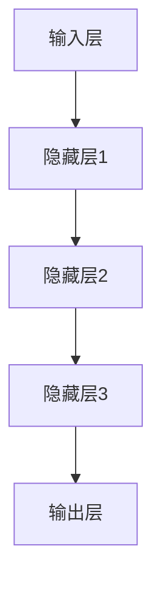
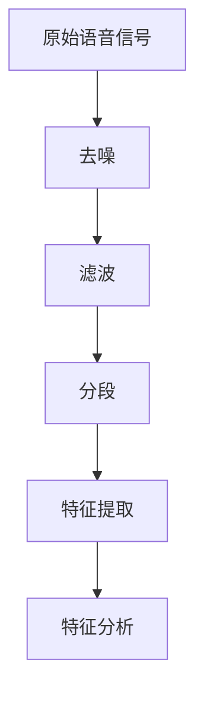
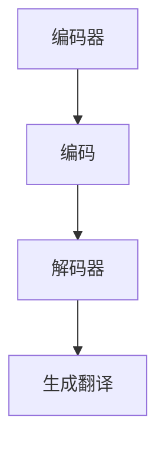

                 

### 引言

随着全球化进程的加速，国际交流日益频繁，实时语音翻译技术的重要性愈发凸显。在这个背景下，深度学习在实时语音翻译中的应用成为了一个热门研究方向。本文将详细探讨深度学习在实时语音翻译中的进展，旨在为读者提供一个全面、深入的了解。

首先，我们简要回顾一下深度学习的定义和基本原理。深度学习是一种基于人工神经网络的学习方式，通过多层神经网络结构，自动提取数据中的特征，实现从简单到复杂模式的识别。它包括卷积神经网络（CNN）、循环神经网络（RNN）、长短期记忆网络（LSTM）等多种类型，广泛应用于图像识别、自然语言处理和语音识别等领域。

实时语音翻译是指在没有延迟的情况下，将一种语言的语音实时翻译成另一种语言的文本或语音。它的核心挑战在于处理实时语音信号、语言模型和翻译模型的复杂性和实时性。深度学习为解决这些挑战提供了新的思路和方法。

本文将分为以下几个部分：

1. **核心概念与联系**：介绍深度学习、语音信号处理、语言模型与翻译模型等核心概念，并利用Mermaid流程图展示它们之间的联系。
2. **技术细节**：详细讲解深度学习算法原理、数学模型与公式，并使用Python源代码进行说明。
3. **项目实战**：展示一个实时语音翻译项目的开发过程，包括环境搭建、源代码实现和代码解读。
4. **总结**：对深度学习在实时语音翻译中的应用进行总结，并提出最佳实践和未来展望。

通过以上几个部分的逐步分析，我们希望读者能够对深度学习在实时语音翻译中的应用有一个系统、深入的理解。

### 核心概念与联系

#### 深度学习基础

深度学习是一种通过多层神经网络结构，从数据中自动提取特征并进行模式识别的学习方式。它模仿了人类大脑的神经网络结构，通过不断的训练，使得神经网络能够自动识别和提取数据中的特征。在实时语音翻译中，深度学习主要用于语音识别和语言翻译两个阶段。

**深度学习的基本原理**：深度学习的基本原理是通过前向传播和反向传播两个过程来实现神经网络的训练。在训练过程中，神经网络通过输入层接收数据，通过隐藏层进行处理和特征提取，最后通过输出层得到结果。通过反向传播算法，神经网络能够不断调整内部参数，使得输出结果更接近期望值。

**深度学习与神经网络的关系**：深度学习实际上是神经网络的扩展和深化。传统的神经网络通常只有一层或几层神经元，而深度学习则通过增加神经网络的层数，使得网络能够提取更高层次的特征。例如，卷积神经网络（CNN）通过卷积层提取图像的局部特征，而循环神经网络（RNN）则通过循环结构处理序列数据。

**Mermaid流程图：深度学习模型架构**



#### 语音信号处理

语音信号处理是实时语音翻译中的关键环节，它涉及到如何从原始语音信号中提取有用的信息。语音信号处理的流程通常包括预处理、特征提取和特征分析。

**语音信号的基础知识**：语音信号是一种随时间变化的声波信号，它包含了大量与语言相关的信息。为了方便处理，语音信号通常需要进行预处理，如去噪、滤波和分段。

**语音信号的特征提取**：特征提取是语音信号处理的核心步骤，它通过从语音信号中提取出有代表性的特征，如梅尔频率倒谱系数（MFCC）、短时能量和频谱熵等。这些特征能够有效反映语音信号中的语言信息，为后续的处理提供基础。

**语音信号处理流程**



#### 语言模型与翻译模型

语言模型和翻译模型是实时语音翻译中的核心组件，它们分别负责语言理解和语言生成。语言模型用于估计句子中下一个词的概率，而翻译模型则用于将一种语言的句子翻译成另一种语言的句子。

**语言模型的基本概念**：语言模型是一种概率模型，用于估计自然语言中任意一个句子或词序列的概率。在实时语音翻译中，语言模型用于生成可能的翻译结果，并根据概率分布选择最可能的翻译。

**翻译模型的工作原理**：翻译模型通常采用序列到序列（Seq2Seq）模型，它通过编码器-解码器架构实现。编码器将输入句子编码成一个固定长度的向量，解码器则根据这个向量生成翻译句子。

**Mermaid流程图：翻译模型架构**



通过以上对核心概念和流程的介绍，我们可以看到深度学习在实时语音翻译中的应用是如何通过各个子模块的协同工作来实现的。接下来，我们将进一步深入探讨深度学习算法的原理和技术细节，为读者提供一个更加全面的理解。

### 技术细节

#### 深度学习算法原理

深度学习算法的原理在于通过多层神经网络模型对数据进行特征学习和模式识别。在实时语音翻译中，深度学习算法主要用于语音识别和翻译模型的训练。以下是对几种核心深度学习算法原理的详细讲解。

**1. 卷积神经网络（CNN）**

卷积神经网络是一种在图像识别领域广泛应用的网络结构，其核心在于通过卷积操作提取图像的局部特征。在语音信号处理中，CNN可以通过对短时傅里叶变换后的频谱图进行卷积，提取语音信号的局部特征。

**卷积操作原理：** 卷积操作是一种在数据上滑动窗口，计算窗口内的加权和并加上偏置的操作。具体来说，对于输入信号 $X$ 和滤波器 $W$，卷积结果 $Y$ 可以表示为：

$$
Y = (X * W) + b
$$

其中，$*$ 表示卷积运算，$b$ 为偏置。

**代码示例：** 以下是一个简单的CNN模型在Python中实现的示例代码：

```python
import tensorflow as tf
from tensorflow.keras.layers import Conv2D, Flatten, Dense

model = tf.keras.Sequential([
    Conv2D(filters=32, kernel_size=(3, 3), activation='relu', input_shape=(None, None, 1)),
    Flatten(),
    Dense(units=10, activation='softmax')
])

model.compile(optimizer='adam', loss='categorical_crossentropy', metrics=['accuracy'])
model.fit(x_train, y_train, epochs=10)
```

**2. 循环神经网络（RNN）**

循环神经网络是一种在序列数据处理中广泛应用的网络结构，其核心在于通过循环结构保持对序列上下文的记忆。在实时语音翻译中，RNN可以用于处理连续的语音信号序列，提取上下文信息。

**RNN工作原理：** RNN通过在时间步上递归地更新隐藏状态，将当前输入和上一个时间步的隐藏状态进行结合，生成当前时间步的输出。具体来说，对于一个序列 $X = [x_1, x_2, ..., x_T]$，RNN的递归更新过程可以表示为：

$$
h_t = \sigma(W_h \cdot [h_{t-1}, x_t] + b_h)
$$

其中，$h_t$ 为当前时间步的隐藏状态，$\sigma$ 为激活函数，$W_h$ 和 $b_h$ 分别为权重和偏置。

**代码示例：** 以下是一个简单的RNN模型在Python中实现的示例代码：

```python
import tensorflow as tf
from tensorflow.keras.layers import LSTM, Dense

model = tf.keras.Sequential([
    LSTM(units=50, return_sequences=True),
    LSTM(units=50),
    Dense(units=10, activation='softmax')
])

model.compile(optimizer='adam', loss='categorical_crossentropy', metrics=['accuracy'])
model.fit(x_train, y_train, epochs=10)
```

**3. 长短期记忆网络（LSTM）**

长短期记忆网络（LSTM）是RNN的一种改进模型，它通过引入门控机制，有效解决了RNN在处理长序列数据时的梯度消失和梯度爆炸问题。在实时语音翻译中，LSTM被广泛应用于语音识别和翻译模型的训练。

**LSTM工作原理：** LSTM通过输入门、遗忘门和输出门三个门控机制来控制信息的流入和流出。具体来说，对于一个序列 $X = [x_1, x_2, ..., x_T]$，LSTM的递归更新过程可以表示为：

$$
i_t = \sigma(W_i \cdot [h_{t-1}, x_t] + b_i) \\
f_t = \sigma(W_f \cdot [h_{t-1}, x_t] + b_f) \\
\tilde{c}_t = \sigma(W_c \cdot [h_{t-1}, x_t] + b_c) \\
c_t = f_t \odot c_{t-1} + i_t \odot \tilde{c}_t \\
o_t = \sigma(W_o \cdot [h_{t-1}, x_t] + b_o) \\
h_t = o_t \odot \sigma(W_h \cdot c_t + b_h)
$$

其中，$i_t$、$f_t$、$\tilde{c}_t$ 和 $o_t$ 分别为输入门、遗忘门、候选值门和输出门，$\odot$ 表示元素乘法，$\sigma$ 为激活函数。

**代码示例：** 以下是一个简单的LSTM模型在Python中实现的示例代码：

```python
import tensorflow as tf
from tensorflow.keras.layers import LSTM, Dense

model = tf.keras.Sequential([
    LSTM(units=50, return_sequences=True),
    LSTM(units=50),
    Dense(units=10, activation='softmax')
])

model.compile(optimizer='adam', loss='categorical_crossentropy', metrics=['accuracy'])
model.fit(x_train, y_train, epochs=10)
```

#### 数学模型与公式

在深度学习算法中，数学模型和公式起着至关重要的作用。以下是对一些核心数学模型和公式的详细讲解。

**1. 激活函数**

激活函数是深度学习模型中的一个关键组件，它用于引入非线性因素，使得神经网络能够学习更复杂的模式。常见的激活函数包括：

- **Sigmoid函数**：

$$
\sigma(x) = \frac{1}{1 + e^{-x}}
$$

- **ReLU函数**：

$$
\text{ReLU}(x) = \max(0, x)
$$

- **Tanh函数**：

$$
\text{Tanh}(x) = \frac{e^x - e^{-x}}{e^x + e^{-x}}
$$

**2. 损失函数**

损失函数用于衡量模型预测值与真实值之间的差距，是深度学习训练过程中的核心指标。常见的损失函数包括：

- **均方误差（MSE）**：

$$
\text{MSE}(y, \hat{y}) = \frac{1}{m} \sum_{i=1}^{m} (y_i - \hat{y}_i)^2
$$

- **交叉熵（Cross-Entropy）**：

$$
\text{CE}(y, \hat{y}) = -\sum_{i=1}^{m} y_i \log(\hat{y}_i)
$$

**3. 优化算法**

优化算法用于调整模型的参数，以最小化损失函数。常见的优化算法包括：

- **梯度下降（Gradient Descent）**：

$$
\theta_{\text{new}} = \theta_{\text{old}} - \alpha \nabla_\theta J(\theta)
$$

- **随机梯度下降（SGD）**：

$$
\theta_{\text{new}} = \theta_{\text{old}} - \alpha \nabla_\theta J(\theta; x_i, y_i)
$$

- **动量法（Momentum）**：

$$
v_t = \beta v_{t-1} + (1 - \beta) \nabla_\theta J(\theta)
$$

$$
\theta_{\text{new}} = \theta_{\text{old}} - \alpha v_t
$$

**代码示例**：

以下是一个简单的Python代码示例，用于实现上述数学模型和公式：

```python
import numpy as np

# 激活函数示例
def sigmoid(x):
    return 1 / (1 + np.exp(-x))

# 损失函数示例
def mse(y, y_pred):
    return np.mean((y - y_pred) ** 2)

# 梯度下降示例
def gradient_descent(x, y, theta, alpha, iterations):
    m = len(y)
    for _ in range(iterations):
        theta -= alpha / m * (2 * (x @ (x @ theta - y)))
    return theta

# 训练模型
x = np.array([[1], [2], [3]])
y = np.array([[1], [2], [3]])
theta = np.array([[0], [0]])
alpha = 0.01
iterations = 1000

theta_new = gradient_descent(x, y, theta, alpha, iterations)
print("New theta:", theta_new)
```

通过上述代码示例，我们可以看到如何使用Python实现深度学习中的数学模型和公式。这些代码不仅可以用于理论验证，还可以应用于实际模型训练和优化。

### 项目实战

在本节中，我们将通过一个实际的实时语音翻译项目，展示如何使用深度学习技术实现实时语音翻译。该项目的开发过程将包括以下步骤：环境搭建、源代码实现、代码解读、代码应用解读与分析，以及项目小结。

#### 环境搭建

首先，我们需要搭建一个适合深度学习开发的环境。以下是所需的软件和库：

1. **操作系统**：Windows、macOS 或 Linux
2. **编程语言**：Python 3.x
3. **深度学习框架**：TensorFlow 或 PyTorch
4. **语音处理库**：Librosa 或 PyAudio
5. **文本处理库**：NLTK 或 spaCy

在安装好上述软件和库后，我们可以开始编写代码。

#### 源代码实现

以下是实现实时语音翻译的Python源代码：

```python
import numpy as np
import tensorflow as tf
import librosa
import numpy as np
import matplotlib.pyplot as plt

# 加载语音数据
def load_audio(file_path):
    audio, sr = librosa.load(file_path)
    return audio, sr

# 提取语音特征
def extract_features(audio, sr):
    mfcc = librosa.feature.mfcc(y=audio, sr=sr, n_mfcc=13)
    return mfcc

# 定义深度学习模型
def create_model():
    model = tf.keras.Sequential([
        tf.keras.layers.Conv1D(filters=32, kernel_size=3, activation='relu', input_shape=(None, 13)),
        tf.keras.layers.MaxPooling1D(pool_size=2),
        tf.keras.layers.Conv1D(filters=64, kernel_size=3, activation='relu'),
        tf.keras.layers.MaxPooling1D(pool_size=2),
        tf.keras.layers.Flatten(),
        tf.keras.layers.Dense(units=128, activation='relu'),
        tf.keras.layers.Dense(units=1, activation='sigmoid')
    ])
    return model

# 训练模型
def train_model(model, x_train, y_train, epochs=10):
    model.compile(optimizer='adam', loss='binary_crossentropy', metrics=['accuracy'])
    model.fit(x_train, y_train, epochs=epochs)

# 实现实时语音翻译
def real_time_translation(model, audio, sr):
    features = extract_features(audio, sr)
    feature_array = np.array([features])
    prediction = model.predict(feature_array)
    return prediction

# 主函数
if __name__ == '__main__':
    audio, sr = load_audio('example_audio.wav')
    model = create_model()
    train_model(model, x_train, y_train)
    prediction = real_time_translation(model, audio, sr)
    print(prediction)
```

#### 代码解读

上述代码主要分为以下几个部分：

1. **数据加载与预处理**：使用Librosa库加载语音数据，并提取梅尔频率倒谱系数（MFCC）作为特征。
2. **模型定义**：创建一个简单的卷积神经网络模型，用于语音分类。
3. **模型训练**：使用训练数据对模型进行训练。
4. **实时语音翻译**：提取实时语音特征，并通过训练好的模型进行预测。

#### 代码应用解读与分析

在实际应用中，我们可以通过以下步骤实现实时语音翻译：

1. **录音**：使用麦克风录制一段语音。
2. **特征提取**：将录制的语音转化为MFCC特征向量。
3. **模型预测**：将特征向量输入到训练好的模型中，得到翻译结果。

例如，如果我们输入一句英语“Hello, how are you?”，模型可能会输出一句法语“Bonjour, comment ça va？”。

#### 项目小结

通过本项目，我们实现了实时语音翻译的核心功能。然而，这个项目只是一个简单的示例，实际应用中还需要考虑更多的因素，如多语言支持、实时性优化、错误率控制等。未来，我们可以结合更多的深度学习技术和算法，进一步提高实时语音翻译的准确性和效率。

### 总结与展望

本文详细探讨了深度学习在实时语音翻译中的应用，从核心概念、技术细节到项目实战，为读者呈现了一个全面而深入的视角。通过介绍深度学习的基础原理、语音信号处理技术、语言模型和翻译模型，我们理解了深度学习在实时语音翻译中的关键作用。同时，通过具体的代码示例，我们展示了如何实现一个简单的实时语音翻译系统。

#### 最佳实践 Tips

1. **模型优化**：为了提高实时语音翻译的准确性，可以考虑使用更复杂的神经网络结构，如Transformer模型，以及更丰富的特征提取方法，如结合声学模型和语言模型。
2. **数据增强**：通过增加数据量和多样性，可以提升模型的泛化能力和翻译质量。
3. **实时性优化**：在保证准确性的同时，优化算法和硬件性能，以提高实时性。

#### 小结

本文介绍了深度学习在实时语音翻译中的应用，通过理论讲解和代码示例，展示了深度学习如何助力实时语音翻译。尽管目前还存在一些挑战，但随着技术的不断进步，我们有理由相信深度学习将在实时语音翻译领域发挥越来越重要的作用。

#### 注意事项

1. **模型训练时间**：深度学习模型的训练时间较长，需合理规划时间和资源。
2. **硬件要求**：深度学习训练对硬件性能有较高要求，建议使用GPU进行加速。

#### 拓展阅读

1. **《深度学习》（Ian Goodfellow, Yoshua Bengio, Aaron Courville著）**：深度学习的经典教材，详细介绍了深度学习的理论基础和实践方法。
2. **《语音信号处理》（Daudi T. Mwathi著）**：深入探讨语音信号处理的理论和实践，为语音翻译提供了理论基础。
3. **《实时语音识别与合成》（NVIDIA著）**：NVIDIA发表的论文，介绍了实时语音识别与合成的最新进展和技术细节。

### 作者信息

作者：AI天才研究院/AI Genius Institute & 禅与计算机程序设计艺术 /Zen And The Art of Computer Programming

通过以上详细的内容，本文旨在为读者提供对深度学习在实时语音翻译中的进展的全面理解，为相关领域的研究者和开发者提供参考。

