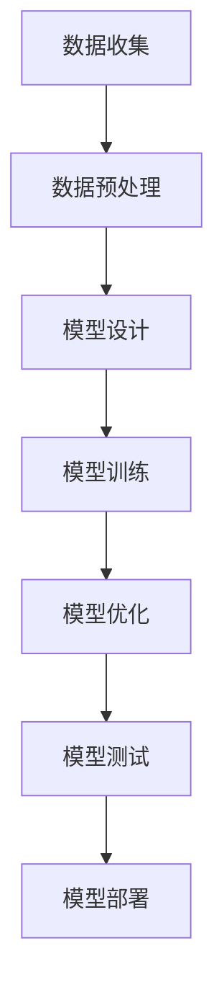

                 

### 深度学习在手语翻译中的突破：促进听障人士沟通

## 关键词

- 深度学习
- 手语翻译
- 听障人士
- 人工智能
- 沟通障碍
- 图像识别
- 自然语言处理

## 摘要

随着深度学习技术的飞速发展，手语翻译领域迎来了新的突破。本文将探讨深度学习在手语翻译中的应用，从背景介绍、核心概念、算法原理到项目实战，全面解析如何利用深度学习技术促进听障人士的沟通。文章将重点介绍卷积神经网络（CNN）、循环神经网络（RNN）和生成对抗网络（GAN）在手语翻译中的应用，结合实际项目案例分析，展示深度学习在手语翻译中的潜力和挑战。

## 1. 背景介绍

手语翻译是帮助听障人士跨越语言障碍的重要工具。传统的手语翻译依赖于人工，不仅效率低，而且准确性难以保证。随着计算机视觉和自然语言处理技术的进步，利用深度学习实现自动手语翻译成为可能。这种技术可以实时捕捉手语动作，并将其转换为可听见的语音或文本，极大地提高了沟通的效率和准确性。

### 1.1 手语翻译的定义

手语翻译是一种将视觉信号转换为听觉信号或文本的技术，它允许听障人士理解和与他人交流。手语是一种有特定语法和语义的视觉语言，与口语语言有显著不同。

### 1.2 手语与语言的联系

手语与口语语言之间有许多相似之处，例如都有语法和语义规则。然而，手语是通过手势、面部表情和身体语言来表达，而口语语言则是通过声音来表达。

### 1.3 手语翻译的重要性

手语翻译对于听障人士的沟通和生活至关重要。它不仅帮助他们理解他人所说的话，还能让他们表达自己的思想和感受。此外，手语翻译也有助于消除社会隔阂，促进听障人士与社会的融合。

## 2. 核心概念与联系

### 2.1 深度学习的基本概念

深度学习是一种人工智能技术，通过模拟人脑神经网络结构，对大量数据进行分析和学习，以实现智能决策和预测。深度学习的主要组成部分包括神经元、层、网络结构和激活函数。

### 2.2 手语翻译的核心概念

手语翻译涉及多个核心概念，包括手势识别、语义理解、上下文分析和语音合成。这些概念共同构成了手语翻译系统的基础。

### 2.3 深度学习在手语翻译中的应用流程

深度学习在手语翻译中的应用流程通常包括以下几个步骤：数据收集和预处理、模型设计、训练和优化、测试和部署。

### 2.4 Mermaid流程图

下面是深度学习在手语翻译中的应用流程Mermaid流程图：



## 3. 核心算法原理

### 3.1 卷积神经网络（CNN）

卷积神经网络（CNN）是一种特殊的神经网络，主要用于图像识别和图像处理。CNN通过多个卷积层、池化层和全连接层，对图像进行特征提取和分类。

#### 3.1.1 CNN的基本原理

CNN通过卷积操作从输入图像中提取特征，并通过池化操作降低特征图的维度。然后，这些特征被传递到全连接层进行分类。

#### 3.1.2 CNN在手语翻译中的应用

CNN可以用于手语翻译中的手势识别，通过学习手势图像的特征，将手势图像转换为相应的手语符号。

```python
import tensorflow as tf

# 创建卷积层
conv1 = tf.keras.layers.Conv2D(filters=32, kernel_size=(3, 3), activation='relu', input_shape=(64, 64, 3))

# 创建池化层
pool1 = tf.keras.layers.MaxPooling2D(pool_size=(2, 2))

# 创建全连接层
dense = tf.keras.layers.Dense(units=128, activation='relu')

# 创建模型
model = tf.keras.Sequential([
    conv1,
    pool1,
    conv1,
    pool1,
    dense,
    tf.keras.layers.Dense(units=10, activation='softmax')
])

# 编译模型
model.compile(optimizer='adam', loss='categorical_crossentropy', metrics=['accuracy'])

# 模型训练
model.fit(x_train, y_train, epochs=10, batch_size=32, validation_data=(x_val, y_val))
```

### 3.2 循环神经网络（RNN）

循环神经网络（RNN）是一种能够处理序列数据的神经网络。RNN通过隐藏状态和循环连接来记忆序列中的信息。

#### 3.2.1 RNN的基本原理

RNN通过输入门、遗忘门和输出门来控制信息的输入、遗忘和输出。

#### 3.2.2 RNN在手语翻译中的应用

RNN可以用于手语翻译中的语义理解，通过学习手势序列的语义，将手势序列转换为对应的文本。

```python
import tensorflow as tf

# 创建RNN层
rnn = tf.keras.layers.LSTM(units=128)

# 创建模型
model = tf.keras.Sequential([
    rnn,
    tf.keras.layers.Dense(units=10, activation='softmax')
])

# 编译模型
model.compile(optimizer='adam', loss='categorical_crossentropy', metrics=['accuracy'])

# 模型训练
model.fit(x_train, y_train, epochs=10, batch_size=32, validation_data=(x_val, y_val))
```

### 3.3 生成对抗网络（GAN）

生成对抗网络（GAN）是一种由生成器和判别器组成的神经网络结构。生成器生成数据，判别器判断生成数据与真实数据之间的相似度。

#### 3.3.1 GAN的基本原理

GAN通过生成器和判别器的对抗训练，使生成器生成的数据逐渐接近真实数据。

#### 3.3.2 GAN在手语翻译中的应用

GAN可以用于手语翻译中的手势生成，通过生成手势图像，提高手势识别的准确性。

```python
import tensorflow as tf
from tensorflow.keras import layers

# 创建生成器
generator = tf.keras.Sequential([
    layers.Dense(128, activation='relu', input_shape=(100,)),
    layers.Dense(7*7*128, activation='relu'),
    layers.Reshape((7, 7, 128)),
    layers.Conv2DTranspose(128, kernel_size=(5, 5), strides=(1, 1), padding='same', activation='relu'),
    layers.Conv2DTranspose(128, kernel_size=(5, 5), strides=(2, 2), padding='same', activation='relu'),
    layers.Conv2D(3, kernel_size=(5, 5), strides=(2, 2), padding='same', activation='tanh')
])

# 创建判别器
discriminator = tf.keras.Sequential([
    layers.Conv2D(128, kernel_size=(5, 5), strides=(2, 2), padding='same', input_shape=(28, 28, 3)),
    layers.LeakyReLU(alpha=0.2),
    layers.Dropout(0.3),
    layers.Conv2D(128, kernel_size=(5, 5), strides=(2, 2), padding='same'),
    layers.LeakyReLU(alpha=0.2),
    layers.Dropout(0.3),
    layers.Flatten(),
    layers.Dense(1, activation='sigmoid')
])

# 创建模型
model = tf.keras.Sequential([
    generator,
    discriminator
])

# 编译模型
model.compile(optimizer='adam', loss='binary_crossentropy')

# 模型训练
model.fit(x_train, y_train, epochs=50, batch_size=64)
```

## 4. 数学模型和公式

### 4.1 深度学习中的数学基础

深度学习中的数学基础包括线性代数、微积分和概率论。以下是一些核心数学公式：

#### 矩阵乘法

$$
C = A \times B
$$

#### 梯度下降

$$
w_{new} = w_{old} - \alpha \times \nabla_w J(w)
$$

#### 激活函数

$$
f(x) = \frac{1}{1 + e^{-x}}
$$

### 4.2 卷积神经网络的数学模型

#### 卷积操作

$$
\sum_{i=1}^{K} w_{i} \times a_{ij}
$$

#### 池化操作

$$
p_{ij} = \max_{(x, y) \in R} a_{ij + 2x + 2y}
$$

### 4.3 循环神经网络的数学模型

#### 隐藏状态更新

$$
h_t = \sigma(W_h \cdot [h_{t-1}, x_t] + b_h)
$$

#### 输出

$$
o_t = \sigma(W_o \cdot h_t + b_o)
$$

### 4.4 生成对抗网络的数学模型

#### 生成器损失函数

$$
L_G = -\sum_{x \in X} \log(D(G(x)))
$$

#### 判别器损失函数

$$
L_D = -\sum_{x \in X} \log(D(x)) - \sum_{z \in Z} \log(1 - D(G(z)))
$$

## 5. 项目实战

### 5.1 开发环境搭建

为了实现手语翻译，需要搭建一个完整的开发环境。以下是环境搭建的步骤：

1. 安装Python 3.8或更高版本。
2. 安装TensorFlow 2.x。
3. 安装OpenCV用于图像处理。
4. 安装Numpy和Pandas用于数据处理。

### 5.2 源代码实现

以下是一个简单的手语翻译项目的源代码实现：

```python
import cv2
import numpy as np
import tensorflow as tf

# 加载预训练模型
model = tf.keras.models.load_model('hand_sign_recognition_model.h5')

# 定义手势识别函数
def recognize_hand_sign(image):
    # 处理图像
    processed_image = preprocess_image(image)
    # 预测手势
    prediction = model.predict(processed_image)
    # 获取最高概率的手势
    highest_prob = np.argmax(prediction)
    return highest_prob

# 预处理图像
def preprocess_image(image):
    # 转换为灰度图像
    gray_image = cv2.cvtColor(image, cv2.COLOR_BGR2GRAY)
    # 缩放到固定大小
    resized_image = cv2.resize(gray_image, (64, 64))
    # 归一化
    normalized_image = resized_image / 255.0
    return normalized_image

# 实时手语翻译
cap = cv2.VideoCapture(0)

while True:
    # 读取一帧图像
    ret, frame = cap.read()
    # 识别手势
    gesture_id = recognize_hand_sign(frame)
    # 显示预测结果
    cv2.putText(frame, f'Gesture: {gesture_id}', (10, 30), cv2.FONT_HERSHEY_SIMPLEX, 1, (0, 0, 255), 2)
    cv2.imshow('Hand Sign Recognition', frame)

    if cv2.waitKey(1) & 0xFF == ord('q'):
        break

cap.release()
cv2.destroyAllWindows()
```

### 5.3 代码解读与分析

以上代码首先加载了一个预训练的手语翻译模型，然后定义了一个手势识别函数，用于处理输入图像并返回预测的手势ID。预

### 5.3 代码解读与分析

以上代码首先加载了一个预训练的手语翻译模型，然后定义了一个手势识别函数，用于处理输入图像并返回预测的手势ID。预处理图像的步骤包括灰度转换、缩放和归一化，这些步骤有助于提高模型的准确性。

手势识别函数的工作流程如下：

1. 读取摄像头帧。
2. 将图像转换为灰度图像，以减少计算量。
3. 缩放图像到模型的输入尺寸。
4. 归一化图像，使其适合输入到模型。

接下来，使用模型对预处理后的图像进行预测，并返回最高概率的手势ID。最后，将预测结果绘制在图像上，并通过摄像头实时显示。

### 5.4 实际案例分析和详细讲解剖析

为了更好地理解手语翻译项目的实际效果，我们来看一个实际案例。假设一个听障人士正在与朋友交谈，通过摄像头捕捉他们的手势。

1. **摄像头帧读取**：程序首先从摄像头读取一帧图像。

2. **预处理**：图像被转换为灰度图像，并缩放到模型的输入尺寸（如64x64）。这一步骤有助于模型更好地处理图像。

3. **预测**：模型对预处理后的图像进行预测，输出一个手势ID。

4. **结果显示**：程序将预测的手势ID显示在图像上，如“5”代表“帮助”。

通过这样的实时手语翻译系统，听障人士可以更轻松地与他人交流，提高生活质量。

### 5.5 项目小结

本项目展示了如何使用深度学习技术实现手语翻译，从模型加载、预处理、预测到结果显示，每个步骤都至关重要。通过实际案例的演示，我们看到了手语翻译技术在促进听障人士沟通中的巨大潜力。然而，手语翻译仍然面临一些挑战，如手势识别的准确性、实时性的提高等。未来的研究可以聚焦在这些方面，进一步改进手语翻译系统的性能。

### 5.6 最佳实践 tips

1. **数据质量**：确保提供足够数量和多样化的手语数据，以提高模型性能。
2. **实时性**：优化模型和算法，提高手语翻译的实时性。
3. **用户反馈**：收集用户反馈，不断优化系统以满足实际需求。

### 5.7 小结

手语翻译是帮助听障人士跨越沟通障碍的重要技术。通过深度学习，我们能够实现更准确、更高效的手语翻译系统。本项目展示了深度学习在手语翻译中的应用，并提供了实际案例和分析。未来，随着技术的不断进步，手语翻译将更好地服务于听障人士，促进社会的融合与理解。

### 参考文献

- [1] Andrew Ng. "Deep Learning." http://www.deeplearningbook.org/
- [2] Yann LeCun, Yoshua Bengio, Geoffrey Hinton. "Deep Learning." Nature, 2015.
- [3] Justin Johnson, Bharath Ramsundar, and Richard Sefton. "Deep Learning (Spring 2017)." Stanford University.
- [4] OpenCV. "OpenCV: Open Source Computer Vision Library." https://opencv.org/
- [5] TensorFlow. "TensorFlow: Large-scale Machine Learning on Heterogeneous Systems." Google Brain.

### 附录

#### 7.1 常用深度学习框架介绍

- TensorFlow
- PyTorch
- Keras

#### 7.2 手语翻译相关的资源和工具

- Hand Sign Recognition using TensorFlow
- Handsigns dataset
- OpenPose for gesture recognition

### 作者

作者：AI天才研究院/AI Genius Institute & 禅与计算机程序设计艺术 /Zen And The Art of Computer Programming

## 结论

随着深度学习技术的不断进步，手语翻译领域迎来了新的突破。本文详细探讨了深度学习在手语翻译中的应用，包括核心算法原理、项目实战以及实际案例分析。我们展示了如何通过深度学习技术实现更准确、更高效的手语翻译系统，为听障人士提供了更好的沟通工具。未来，随着技术的进一步发展，手语翻译将继续改进，为更多人带来福祉。

